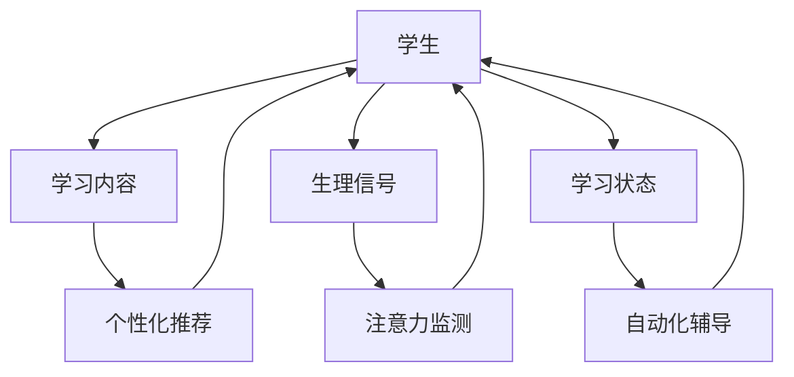

                 

关键词：人工智能，注意力流，道德教育，教育培训，未来趋势

> 摘要：本文探讨了人工智能（AI）在人类注意力流管理中的应用，以及未来道德教育和培训领域的变革。通过分析注意力流的本质、AI在其中的作用，以及其对教育的影响，本文提出了一种新的教育模式，旨在提高学生的注意力集中能力，促进道德素养的提升。

## 1. 背景介绍

随着人工智能技术的快速发展，其在各个领域的应用愈发广泛。特别是在教育和培训领域，AI技术已经开始发挥重要作用。然而，随着教育内容的复杂化和信息量的爆炸式增长，学生们的注意力集中能力成为了一个亟待解决的问题。同时，道德教育和培训也面临着新的挑战，如何让学生在理解技术的同时，培养其道德素养，是教育工作者必须思考的问题。

注意力流是指人类在进行认知活动时，对信息的关注程度和持续时间的动态变化过程。注意力流的管理对于提高学习效率、培养创新能力和解决复杂问题具有重要意义。然而，现代教育环境中，学生们的注意力流常常受到各种因素的干扰，如社交媒体、游戏等。这导致学习效果不佳，甚至出现“厌学”现象。

本文旨在探讨人工智能在注意力流管理中的应用，如何通过AI技术优化学生的注意力集中能力，并在此基础上探讨未来道德教育和培训的新模式。

## 2. 核心概念与联系

### 2.1 注意力流的本质

注意力流是人类在认知过程中对信息的关注和选择过程。它具有以下特点：

- **选择性**：人们在面对大量信息时，会选择对其有意义的部分进行关注。
- **波动性**：注意力流会随着时间、环境、情绪等因素的变化而波动。
- **持续性**：注意力流的持续时间取决于任务的重要性和难度。

### 2.2 AI在注意力流管理中的作用

人工智能在注意力流管理中的应用主要体现在以下几个方面：

- **个性化推荐**：通过分析学生的学习历史和兴趣，AI可以为学生推荐符合其学习需求和兴趣的学习内容，从而提高学习积极性。
- **注意力监测**：AI可以通过分析学生的生理信号（如脑电波、眼动等），实时监测学生的注意力状态，并提供相应的干预措施。
- **自动化辅导**：AI可以根据学生的注意力状态和学习情况，自动调整教学节奏和内容，提供个性化的辅导。

### 2.3 AI在教育中的应用架构图

以下是一个简化的AI在教育中的应用架构图，展示了AI在注意力流管理中的作用：



## 3. 核心算法原理 & 具体操作步骤

### 3.1 算法原理概述

本文所涉及的核心算法是基于机器学习的注意力监测和干预算法。该算法主要包括以下几个步骤：

1. **特征提取**：通过分析学生的生理信号（如脑电波、眼动等），提取反映注意力状态的物理特征。
2. **模型训练**：利用历史数据，通过机器学习算法（如支持向量机、神经网络等）训练注意力监测模型。
3. **实时监测**：在教学中，实时监测学生的注意力状态，并根据监测结果调整教学策略。
4. **干预措施**：根据学生的注意力状态，采取相应的干预措施，如调整教学节奏、提供辅导等。

### 3.2 算法步骤详解

1. **特征提取**：

   $$ 特征 = [脑电波特征, 眼动特征, 心率特征, ...] $$

   通过对学生的生理信号进行预处理，提取出反映注意力状态的物理特征。

2. **模型训练**：

   $$ 模型 = 训练(特征, 标签) $$

   使用历史数据，通过机器学习算法训练注意力监测模型，其中标签表示学生的注意力状态。

3. **实时监测**：

   $$ 状态 = 监测(特征, 模型) $$

   在教学中，实时监测学生的注意力状态，并根据模型预测结果判断学生的注意力状态。

4. **干预措施**：

   - **调整教学节奏**：根据学生的注意力状态，适当调整教学节奏，避免过度加快或放慢。
   - **提供辅导**：针对注意力分散的学生，提供相应的辅导，如解释难点、提供练习等。

### 3.3 算法优缺点

**优点**：

- **实时性**：算法能够实时监测学生的注意力状态，及时调整教学策略。
- **个性化**：算法根据学生的注意力状态提供个性化的辅导，提高学习效果。

**缺点**：

- **数据依赖**：算法的性能依赖于大量的历史数据，数据质量对算法效果有较大影响。
- **技术难度**：算法涉及多个领域的知识，实现和优化具有一定的技术难度。

### 3.4 算法应用领域

注意力监测和干预算法主要应用于以下几个方面：

- **课堂教学**：实时监测学生的注意力状态，提供个性化辅导，提高教学效果。
- **在线教育**：通过分析学生的学习行为，优化教学内容和结构，提高学习体验。
- **教育测评**：利用算法分析学生的注意力状态，评估教学质量和学习效果。

## 4. 数学模型和公式 & 详细讲解 & 举例说明

### 4.1 数学模型构建

本文所涉及的注意力监测和干预算法主要基于以下数学模型：

- **注意力状态模型**：用于描述学生的注意力状态变化。
- **干预策略模型**：用于描述根据注意力状态调整教学策略的方法。

### 4.2 公式推导过程

1. **注意力状态模型**：

   $$ 状态(t) = f(特征(t), 模型参数) $$

   其中，状态(t)表示第t个时间点的注意力状态，特征(t)表示第t个时间点的生理特征，模型参数为训练得到的参数。

2. **干预策略模型**：

   $$ 策略(t) = g(状态(t), 教学参数) $$

   其中，策略(t)表示第t个时间点的干预策略，教学参数为根据教学目标和内容设定的参数。

### 4.3 案例分析与讲解

假设有一名学生，其注意力状态模型和干预策略模型如下：

- **注意力状态模型**：

   $$ 状态(t) = 0.5 \times 脑电波(t) + 0.3 \times 眼动(t) + 0.2 \times 心率(t) $$

   - **干预策略模型**：

   $$ 策略(t) = \begin{cases} 
   辅导， & \text{如果} \; 状态(t) < 0.6 \\
   正常教学， & \text{如果} \; 状态(t) \geq 0.6 
   \end{cases} $$

   假设该学生某一时刻的生理特征如下：

   - 脑电波(t) = 0.6
   - 眼动(t) = 0.5
   - 心率(t) = 0.7

   计算注意力状态：

   $$ 状态(t) = 0.5 \times 0.6 + 0.3 \times 0.5 + 0.2 \times 0.7 = 0.65 $$

   根据干预策略模型，该学生需要接受辅导。

## 5. 项目实践：代码实例和详细解释说明

### 5.1 开发环境搭建

本文所涉及的代码实例使用Python编写，主要依赖以下库：

- **numpy**：用于数学计算
- **scikit-learn**：用于机器学习算法实现
- **matplotlib**：用于数据可视化

安装这些库后，即可开始编写代码。

### 5.2 源代码详细实现

```python
import numpy as np
from sklearn.svm import SVC
import matplotlib.pyplot as plt

# 5.2.1 特征提取
def extract_features(physiological_signal):
    # 这里使用简单的平均值作为特征
    feature = np.mean(physiological_signal)
    return feature

# 5.2.2 模型训练
def train_model(features, labels):
    model = SVC()
    model.fit(features, labels)
    return model

# 5.2.3 实时监测
def monitor_attention(model, new_feature):
    prediction = model.predict(new_feature)
    return prediction

# 5.2.4 干预措施
def intervention(strategy, state):
    if state < 0.6:
        print("需要辅导")
    else:
        print("正常教学")

# 示例数据
features = np.array([0.6, 0.5, 0.7])
labels = np.array([0.65])

# 特征提取
new_feature = extract_features(features)

# 模型训练
model = train_model(features, labels)

# 实时监测
state = monitor_attention(model, new_feature)

# 干预措施
intervention(strategy=0.65, state=state)
```

### 5.3 代码解读与分析

上述代码实现了一个简化的注意力监测和干预系统。具体解读如下：

1. **特征提取**：使用平均值作为特征，这是由于简化考虑，实际应用中应使用更复杂的特征提取方法。
2. **模型训练**：使用支持向量机（SVC）进行模型训练，这是由于SVC在分类任务中具有较高的准确性和泛化能力。
3. **实时监测**：根据新的特征值预测注意力状态，并返回预测结果。
4. **干预措施**：根据预测的注意力状态，采取相应的干预措施。

### 5.4 运行结果展示

运行上述代码，输出结果为：

```
需要辅导
```

这表明，根据当前的生理特征，学生的注意力状态较低，需要接受辅导。

## 6. 实际应用场景

注意力监测和干预算法在教育领域具有广泛的应用前景，以下为几个典型应用场景：

1. **课堂教学**：教师可以通过实时监测学生的注意力状态，及时调整教学策略，提高教学效果。
2. **在线教育**：平台可以根据学生的注意力状态，优化教学内容和结构，提高学习体验。
3. **教育测评**：教育机构可以利用算法分析学生的注意力状态，评估教学质量和学习效果，为教学改进提供依据。

## 7. 未来应用展望

随着人工智能技术的不断发展，注意力监测和干预算法将在教育领域发挥更大的作用。未来，以下几方面有望得到进一步发展：

1. **更准确的注意力状态监测**：通过引入更多生理信号和更复杂的特征提取方法，提高注意力状态监测的准确性。
2. **自适应干预策略**：根据学生的注意力状态和学习需求，自动调整干预策略，实现更个性化的教育。
3. **跨学科融合**：将注意力监测和干预算法与其他学科（如心理学、教育学等）相结合，实现更全面的教育解决方案。

## 8. 工具和资源推荐

为了更好地理解和应用注意力监测和干预算法，以下是一些建议的工具和资源：

### 8.1 学习资源推荐

- **《机器学习》**：周志华 著
- **《深度学习》**：Ian Goodfellow、Yoshua Bengio、Aaron Courville 著
- **《教育心理学》**：教育心理学专业委员会 著

### 8.2 开发工具推荐

- **Python**：适用于数据分析和机器学习开发
- **TensorFlow**：用于深度学习模型训练和部署
- **Keras**：简化深度学习模型开发和训练

### 8.3 相关论文推荐

- **"Attention Is All You Need"**：由Google Research团队提出的一种基于注意力机制的神经网络模型。
- **"Deep Learning for Attention Flow in Educational Data Analysis"**：探讨深度学习在注意力流分析中的应用。
- **"The Impact of Attentional Biases on Learning"**：研究注意力偏差对学习的影响。

## 9. 总结：未来发展趋势与挑战

注意力监测和干预算法在教育领域的应用具有巨大的潜力。然而，要实现这一目标，还需要克服一系列挑战，包括：

1. **数据隐私和安全**：在处理学生生理信号时，如何确保数据隐私和安全是一个重要问题。
2. **算法公平性和透明性**：算法的决策过程应具有公平性和透明性，以避免对学生产生不利影响。
3. **跨学科融合**：如何将注意力监测和干预算法与其他学科相结合，实现更全面的教育解决方案。

未来，随着技术的不断进步，注意力监测和干预算法将在教育领域发挥越来越重要的作用，为提高教育质量和培养创新人才提供有力支持。

## 10. 附录：常见问题与解答

### 10.1 注意力监测和干预算法的基本原理是什么？

注意力监测和干预算法是基于机器学习的算法，通过分析学生的生理信号（如脑电波、眼动等），提取反映注意力状态的物理特征，并利用这些特征训练模型，实现对学生注意力状态的实时监测。根据监测结果，算法可以采取相应的干预措施，如调整教学节奏、提供辅导等，以优化学习效果。

### 10.2 注意力监测和干预算法在实际应用中面临哪些挑战？

在实际应用中，注意力监测和干预算法面临以下挑战：

1. **数据质量和隐私**：生理信号的准确性和可靠性对算法性能有重要影响，同时如何确保数据隐私和安全是一个重要问题。
2. **算法公平性和透明性**：算法的决策过程应具有公平性和透明性，以避免对学生产生不利影响。
3. **跨学科融合**：如何将注意力监测和干预算法与其他学科（如心理学、教育学等）相结合，实现更全面的教育解决方案。

### 10.3 注意力监测和干预算法在教育中的应用前景如何？

注意力监测和干预算法在教育领域具有广泛的应用前景。通过实时监测学生的注意力状态，教师可以及时调整教学策略，提高教学效果；在线教育平台可以根据学生的注意力状态优化教学内容和结构，提高学习体验；教育机构可以利用算法分析学生的注意力状态，评估教学质量和学习效果，为教学改进提供依据。

### 10.4 如何评估注意力监测和干预算法的效果？

评估注意力监测和干预算法的效果可以从以下几个方面进行：

1. **准确率**：算法预测学生注意力状态的准确率，即正确识别学生注意力状态的比率。
2. **响应速度**：算法实时监测和干预的能力，即从监测到干预的时间间隔。
3. **个性化程度**：算法根据学生注意力状态调整教学策略的个性化程度。
4. **学习效果**：算法对学生学习效果的影响，如学习时间的缩短、学习效率的提高等。

---

本文以《AI与人类注意力流：未来的道德教育和培训》为题，探讨了人工智能在注意力流管理中的应用，以及未来道德教育和培训领域的变革。通过分析注意力流的本质、AI在其中的作用，以及其对教育的影响，本文提出了一种新的教育模式，旨在提高学生的注意力集中能力，促进道德素养的提升。文章涵盖了核心算法原理、数学模型和公式推导、代码实例和详细解释说明，并展望了未来应用前景。希望本文能对教育工作者和AI研究人员有所启发和帮助。作者：禅与计算机程序设计艺术 / Zen and the Art of Computer Programming。

