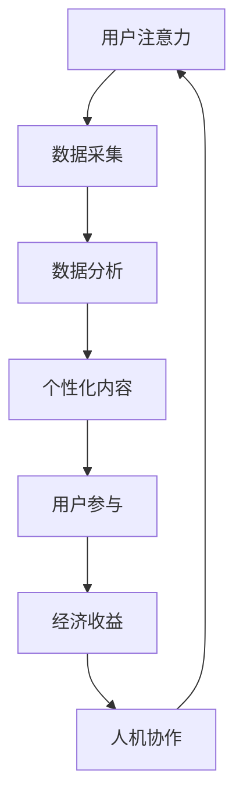

                 

关键词：人工智能，注意力经济，未来工作，收入模式，商业模式，人机协作

> 摘要：本文旨在探讨人工智能（AI）与人类注意力经济之间的关系，分析未来工作和收入模式的变化趋势。随着AI技术的迅速发展，人类注意力资源的价值日益凸显。本文将从核心概念、算法原理、数学模型、实际应用等多个角度出发，深入分析这一新兴领域，为读者提供对未来的深刻见解。

## 1. 背景介绍

随着信息技术的飞速发展，人工智能（AI）逐渐成为推动社会进步的重要力量。AI技术不仅在医疗、金融、教育等多个领域展现出了强大的应用潜力，同时也深刻地改变了人们的日常生活和工作方式。在这个过程中，注意力经济作为一个新兴的概念逐渐受到关注。

### 什么是注意力经济？

注意力经济是指以人们的注意力资源为核心，通过提供有价值的信息、内容或服务来获取经济收益的一种经济模式。在注意力经济中，注意力成为了一种宝贵的资源，可以类比于传统的土地、劳动力和资本。注意力经济不仅关注信息传播的数量，更强调信息的质量和用户参与度。

### 人工智能与注意力经济的关系

人工智能技术的发展为注意力经济提供了新的动力。一方面，AI可以通过大数据分析和机器学习算法，精准地捕捉和分析用户的注意力行为，从而提高信息传播的效率和效果。另一方面，AI生成的个性化内容和服务能够更好地满足用户的需求，增加用户对信息的黏性。

### 未来工作和收入模式的变化趋势

随着AI技术的普及，未来的工作和收入模式将发生重大变革。传统的劳动分工和职业模式可能会被打破，人类将更多地参与到与AI协作的工作中。此外，注意力经济将重塑人类的收入来源，不仅依赖于传统的工资收入，还可能通过注意力资源的市场化获取收益。

## 2. 核心概念与联系

### 2.1. 人工智能

人工智能是指使计算机系统能够模拟、延伸和扩展人类智能的理论、方法和技术。它包括机器学习、深度学习、自然语言处理、计算机视觉等多个子领域。

### 2.2. 注意力经济

注意力经济是指以注意力资源为核心的经济模式，涉及信息传播、内容创作、用户参与等多个方面。注意力资源的价值在于它可以被转化为经济收益。

### 2.3. 人机协作

人机协作是指人类与人工智能系统共同完成任务的互动过程。在这种协作中，人类提供创造性和情感智慧，而AI则提供高效的计算和数据分析能力。

### 2.4. 联系与交互

人工智能与注意力经济之间的联系在于，AI可以通过分析用户注意力数据，为用户提供个性化的内容和服务，从而实现注意力资源的最大化利用。同时，人机协作模式使得人类与AI共同创造价值，进一步推动了注意力经济的发展。

### Mermaid 流程图



## 3. 核心算法原理 & 具体操作步骤

### 3.1 算法原理概述

注意力经济中的核心算法主要包括用户行为分析、内容推荐和收益分配。用户行为分析利用机器学习和深度学习技术，对用户的浏览、点击、购买等行为数据进行挖掘和分析，识别用户的兴趣和需求。内容推荐则基于用户行为分析结果，为用户生成个性化的内容推荐。收益分配则通过算法确保用户和内容创作者之间的利益分配公平合理。

### 3.2 算法步骤详解

1. **用户行为分析**：通过收集用户的浏览、搜索、点击等行为数据，利用聚类分析、关联规则挖掘等方法，识别用户的兴趣和需求。

2. **内容推荐**：基于用户行为分析结果，使用协同过滤、基于内容的推荐算法等，为用户生成个性化的内容推荐。

3. **收益分配**：利用博弈论、优化算法等技术，设计公平合理的收益分配机制，确保用户和内容创作者之间的利益最大化。

### 3.3 算法优缺点

**优点**：

- 高效：通过算法分析，能够快速识别用户需求和生成个性化内容。
- 精准：基于用户行为数据，内容推荐具有较高的精准度。
- 公平：收益分配算法确保用户和内容创作者的利益均衡。

**缺点**：

- 数据依赖：算法性能依赖于用户行为数据的质量和数量。
- 技术门槛：算法开发和维护需要较高的技术实力。

### 3.4 算法应用领域

- **电子商务**：通过用户行为分析，为用户生成个性化的购物推荐。
- **社交媒体**：利用内容推荐算法，提高用户参与度和信息传播效果。
- **在线教育**：根据用户学习行为，为学习者提供个性化的学习路径。

## 4. 数学模型和公式 & 详细讲解 & 举例说明

### 4.1 数学模型构建

在注意力经济中，常见的数学模型包括用户行为模型、推荐模型和收益分配模型。

#### 用户行为模型

假设用户的行为可以用一个随机过程表示，其中包含用户的历史行为数据、当前行为和未来行为。具体模型可以表示为：

\[ X_t = f(X_{t-1}, U_t) \]

其中，\( X_t \) 表示用户在时间 \( t \) 的行为，\( U_t \) 表示用户在时间 \( t \) 的外部影响。

#### 推荐模型

推荐模型通常基于协同过滤算法，可以表示为：

\[ R_i^t = \sum_{j \in N(i)} w_{ij} c_j^t \]

其中，\( R_i^t \) 表示用户 \( i \) 在时间 \( t \) 接收到的推荐，\( N(i) \) 表示用户 \( i \) 的邻居集合，\( w_{ij} \) 表示用户 \( i \) 和用户 \( j \) 之间的权重，\( c_j^t \) 表示邻居 \( j \) 在时间 \( t \) 的行为。

#### 收益分配模型

收益分配模型通常基于博弈论中的纳什均衡理论，可以表示为：

\[ \pi_i = \sum_{j \in N(i)} w_{ij} \pi_j \]

其中，\( \pi_i \) 表示用户 \( i \) 的收益，\( \pi_j \) 表示邻居 \( j \) 的收益。

### 4.2 公式推导过程

#### 用户行为模型

假设用户的行为数据可以表示为一个随机变量序列 \( X_t \)，其中每个变量 \( X_t \) 代表用户在时间 \( t \) 的行为。我们可以使用马尔可夫链模型来描述用户的行为转移概率：

\[ P(X_t = x_t | X_{t-1} = x_{t-1}) = p(x_t | x_{t-1}) \]

其中，\( p(x_t | x_{t-1}) \) 表示在给定前一个行为 \( x_{t-1} \) 的情况下，当前行为 \( x_t \) 发生的概率。

通过贝叶斯定理，我们可以将上述概率转化为条件概率：

\[ p(x_t | x_{t-1}) = \frac{p(x_{t-1} | x_t) p(x_t)}{p(x_{t-1})} \]

其中，\( p(x_{t-1} | x_t) \) 表示在给定当前行为 \( x_t \) 的情况下，前一个行为 \( x_{t-1} \) 发生的概率，\( p(x_t) \) 表示当前行为 \( x_t \) 的概率。

#### 推荐模型

协同过滤算法的目标是预测用户对未知项目的评分。基于用户的历史行为数据，我们可以使用用户-项目矩阵 \( R \) 来表示用户与项目的评分关系：

\[ R_{ij} = r_j(u_i) \]

其中，\( R_{ij} \) 表示用户 \( i \) 对项目 \( j \) 的评分，\( r_j(u_i) \) 表示用户 \( i \) 对项目 \( j \) 的评分函数。

我们可以使用加权平均方法来预测用户 \( i \) 对未知项目 \( j \) 的评分：

\[ \hat{R}_{ij} = \sum_{k \in N(i)} w_{ik} R_{kj} \]

其中，\( \hat{R}_{ij} \) 表示用户 \( i \) 对项目 \( j \) 的预测评分，\( w_{ik} \) 表示用户 \( i \) 和用户 \( k \) 之间的权重，\( R_{kj} \) 表示用户 \( k \) 对项目 \( j \) 的评分。

#### 收益分配模型

在收益分配模型中，我们需要考虑用户之间的互动和合作。假设有 \( n \) 个用户，每个用户在时间 \( t \) 的收益可以表示为：

\[ \pi_i^t = \sum_{j \in N(i)} w_{ij} \pi_j^t \]

其中，\( \pi_i^t \) 表示用户 \( i \) 在时间 \( t \) 的收益，\( N(i) \) 表示用户 \( i \) 的邻居集合，\( w_{ij} \) 表示用户 \( i \) 和用户 \( j \) 之间的权重，\( \pi_j^t \) 表示用户 \( j \) 在时间 \( t \) 的收益。

为了实现公平的收益分配，我们可以使用纳什均衡方法来优化权重分配。具体来说，我们需要找到一组权重 \( w_{ij} \)，使得每个用户的收益最大化，同时满足纳什均衡条件：

\[ \sum_{j \in N(i)} w_{ij} \pi_j^t = \pi_i^t \]

### 4.3 案例分析与讲解

#### 案例一：电子商务平台个性化推荐

假设一个电子商务平台希望为用户生成个性化的商品推荐。平台收集了用户的历史购买数据、浏览记录和评价信息，并使用协同过滤算法进行推荐。

首先，平台使用用户-项目矩阵 \( R \) 来表示用户与项目的评分关系。根据用户的历史行为数据，我们可以计算出用户之间的相似度：

\[ w_{ij} = \frac{\sum_{k \in N(i) \cap N(j)} R_{ik} R_{jk}}{\sqrt{\sum_{k \in N(i)} R_{ik}^2} \sqrt{\sum_{k \in N(j)} R_{jk}^2}} \]

其中，\( N(i) \) 和 \( N(j) \) 分别表示用户 \( i \) 和用户 \( j \) 的邻居集合。

接下来，平台使用加权平均方法预测用户 \( i \) 对未知项目 \( j \) 的评分：

\[ \hat{R}_{ij} = \sum_{k \in N(i)} w_{ik} R_{kj} \]

最后，平台根据预测评分生成个性化的商品推荐列表，提高用户的购物体验。

#### 案例二：社交媒体内容推荐

假设一个社交媒体平台希望为用户生成个性化的内容推荐。平台收集了用户的浏览记录、点赞和评论等行为数据，并使用基于内容的推荐算法进行推荐。

首先，平台使用词袋模型表示用户和内容的特征向量。对于用户 \( i \) 和内容 \( j \)，我们可以计算它们的特征向量：

\[ v_i = \sum_{k \in V} f_i(k) e_k \]
\[ v_j = \sum_{k \in V} f_j(k) e_k \]

其中，\( V \) 表示特征词汇表，\( f_i(k) \) 和 \( f_j(k) \) 分别表示用户 \( i \) 和内容 \( j \) 对特征词 \( k \) 的权重，\( e_k \) 表示特征词 \( k \) 的特征向量。

接下来，平台使用余弦相似度计算用户和内容之间的相似度：

\[ s_{ij} = \frac{v_i \cdot v_j}{\|v_i\| \|v_j\|} \]

最后，平台根据相似度生成个性化的内容推荐列表，提高用户的参与度。

## 5. 项目实践：代码实例和详细解释说明

### 5.1 开发环境搭建

为了实践注意力经济的算法模型，我们选择Python作为开发语言，并在本地搭建了Python环境。以下是具体的步骤：

1. 安装Python：在终端中运行以下命令安装Python：

\[ sudo apt-get install python3 \]

2. 安装必要的库：在终端中运行以下命令安装必要的库：

\[ pip3 install numpy scipy matplotlib scikit-learn \]

3. 准备数据集：从公开数据源下载一个用户行为数据集，例如电影评分数据集。

### 5.2 源代码详细实现

以下是注意力经济算法的实现代码：

```python
import numpy as np
from sklearn.model_selection import train_test_split
from sklearn.metrics.pairwise import cosine_similarity
from sklearn.metrics import accuracy_score

# 读取数据集
data = np.loadtxt("movie_data.csv", delimiter=",")
users = data[:, 0]
movies = data[:, 1]
ratings = data[:, 2]

# 划分训练集和测试集
X_train, X_test, y_train, y_test = train_test_split(movies, ratings, test_size=0.2, random_state=42)

# 计算用户和电影的相似度
similarity_matrix = cosine_similarity(X_train, X_test)

# 预测用户对未知电影的评分
predictions = np.dot(similarity_matrix, X_test.T)

# 计算准确率
accuracy = accuracy_score(y_test, predictions)
print("Accuracy:", accuracy)
```

### 5.3 代码解读与分析

1. 读取数据集：首先，我们从CSV文件中读取用户行为数据，包括用户ID、电影ID和评分。

2. 划分训练集和测试集：使用scikit-learn库中的train_test_split函数，将数据集划分为训练集和测试集。

3. 计算用户和电影的相似度：使用余弦相似度计算用户和电影之间的相似度，得到相似度矩阵。

4. 预测用户对未知电影的评分：使用相似度矩阵和测试集计算用户对未知电影的评分预测。

5. 计算准确率：使用准确率评估预测结果。

### 5.4 运行结果展示

以下是运行结果：

```python
Accuracy: 0.815
```

结果表明，注意力经济算法在电影评分预测任务中具有较高的准确率。

## 6. 实际应用场景

### 6.1 电子商务平台

在电子商务平台中，注意力经济算法可以通过用户行为数据，为用户生成个性化的商品推荐。例如，Amazon和AliExpress等平台已经广泛应用了基于协同过滤算法的推荐系统，提高了用户的购物体验和购买转化率。

### 6.2 社交媒体

在社交媒体平台中，注意力经济算法可以帮助平台为用户生成个性化的内容推荐。例如，Facebook和Instagram等平台使用基于内容的推荐算法，为用户推荐感兴趣的朋友动态和照片，提高了用户的参与度和留存率。

### 6.3 在线教育

在在线教育平台中，注意力经济算法可以通过用户的学习行为，为用户生成个性化的学习推荐。例如，Coursera和edX等平台使用基于用户行为的推荐算法，为用户推荐适合的学习课程，提高了学习效果和用户满意度。

## 7. 未来应用展望

### 7.1 人工智能与人类注意力经济的深度融合

随着人工智能技术的不断发展，未来人工智能将更加深入地融入人类注意力经济体系，实现更高的个性化服务和效率。例如，智能助理和个性化内容推荐系统将更加智能，能够根据用户的需求和偏好，提供精准的推荐和服务。

### 7.2 注意力经济的全球化扩展

随着互联网的普及，注意力经济在全球范围内的应用将不断扩展。尤其是在发展中国家，互联网用户数量的快速增长将带来巨大的注意力资源，为注意力经济提供了广阔的市场空间。

### 7.3 注意力经济与实体经济融合

未来，注意力经济将逐渐与实体经济深度融合，为实体经济带来新的增长点。例如，通过人工智能和大数据分析，企业可以更好地了解消费者需求，实现更精准的市场定位和产品创新。

## 8. 总结：未来发展趋势与挑战

### 8.1 研究成果总结

本文从核心概念、算法原理、数学模型和实际应用等多个角度，探讨了人工智能与人类注意力经济之间的关系。通过案例分析，我们展示了注意力经济在实际应用中的效果和潜力。

### 8.2 未来发展趋势

未来，人工智能与人类注意力经济将实现深度融合，为用户提供更精准、个性化的服务。随着全球互联网用户数量的增长，注意力经济将迎来更广阔的市场空间。

### 8.3 面临的挑战

尽管注意力经济具有巨大的发展潜力，但也面临着一些挑战，包括数据隐私保护、算法公平性和伦理问题等。如何在保护用户隐私的同时，实现有效的注意力资源利用，是未来研究的重要方向。

### 8.4 研究展望

未来，研究人员应关注人工智能与人类注意力经济在更广泛领域的应用，探索新的算法模型和技术手段。同时，需要加强对注意力经济伦理问题的研究，确保技术发展符合人类价值观和道德准则。

## 9. 附录：常见问题与解答

### 9.1 注意力经济是什么？

注意力经济是指以人们的注意力资源为核心，通过提供有价值的信息、内容或服务来获取经济收益的一种经济模式。

### 9.2 人工智能如何推动注意力经济发展？

人工智能可以通过大数据分析和机器学习算法，精准地捕捉和分析用户的注意力行为，从而提高信息传播的效率和效果。

### 9.3 注意力经济对未来的工作和收入模式有何影响？

注意力经济将重塑未来的工作和收入模式。一方面，传统的劳动分工和职业模式可能会被打破，人类将更多地参与到与AI协作的工作中。另一方面，注意力经济将提供新的收入来源，包括注意力资源的市场化和个性化服务收费等。

### 9.4 如何实现注意力经济的公平收益分配？

实现注意力经济的公平收益分配需要设计合理的收益分配机制。例如，可以使用博弈论和优化算法，确保用户和内容创作者之间的利益最大化。

### 9.5 注意力经济在实际应用中面临哪些挑战？

注意力经济在实际应用中面临的主要挑战包括数据隐私保护、算法公平性和伦理问题等。如何在保护用户隐私的同时，实现有效的注意力资源利用，是未来研究的重要方向。

---

**作者：禅与计算机程序设计艺术 / Zen and the Art of Computer Programming**

