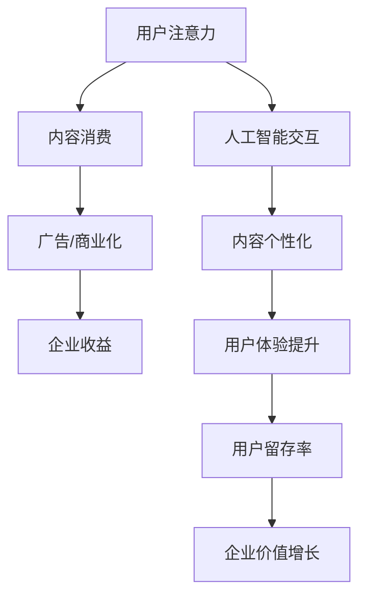

                 

关键词：人工智能、注意力经济、未来工作、收入、技术趋势

> 摘要：本文将探讨人工智能如何影响人类的注意力经济，以及这一变革对未来工作和收入模式所带来的深远影响。我们将分析注意力经济的核心概念，探讨人工智能与人类注意力的互动，以及人工智能如何重塑我们的工作和收入结构。

## 1. 背景介绍

在数字时代，信息爆炸和内容泛滥成为常态，人们对于注意力资源的需求与日俱增。注意力经济作为一种新的经济模式，揭示了人类注意力资源的商业价值。传统经济以物质资源为核心，而注意力经济则强调注意力作为稀缺资源的价值。随着人工智能技术的发展，人工智能与人类注意力经济的互动日益紧密，成为未来经济发展的重要趋势。

## 2. 核心概念与联系

### 2.1 注意力经济

注意力经济是指在经济活动中，注意力作为一种稀缺资源，其获取和利用成为价值创造的关键。在注意力经济中，用户的时间、注意力资源被视作一种宝贵的资产，而吸引和留住用户注意力成为企业成功的关键。

### 2.2 人工智能与注意力经济

人工智能技术，特别是自然语言处理和计算机视觉等领域的进步，极大地改变了信息生产和传播的方式。人工智能能够生成高质量的内容，同时通过个性化推荐和智能交互，提高用户注意力的利用率。

### 2.3 Mermaid 流程图



## 3. 核心算法原理 & 具体操作步骤

### 3.1 算法原理概述

人工智能在注意力经济中的作用主要体现在以下几个方面：

- **内容生成**：利用生成对抗网络（GAN）等技术生成高质量的内容，满足用户多样化的需求。
- **个性化推荐**：通过机器学习算法，分析用户行为和偏好，实现个性化内容推荐。
- **智能交互**：通过自然语言处理技术，实现与用户的智能对话和互动，提高用户体验。

### 3.2 算法步骤详解

1. **数据采集与预处理**：收集用户行为数据，包括浏览历史、搜索记录、点击行为等，并进行数据清洗和特征提取。
2. **模型训练**：使用收集到的数据训练生成模型、推荐模型和交互模型。
3. **内容生成与推荐**：生成模型根据用户偏好生成个性化内容，推荐模型根据用户行为预测用户可能感兴趣的内容。
4. **智能交互**：通过自然语言处理技术，实现与用户的智能对话，满足用户需求。

### 3.3 算法优缺点

**优点**：

- 提高内容质量和个性化推荐效果。
- 提高用户体验，增加用户留存率。

**缺点**：

- 对数据质量和算法要求较高。
- 可能引发隐私和安全问题。

### 3.4 算法应用领域

人工智能在注意力经济中的应用广泛，包括但不限于：

- 社交媒体平台的内容生成和推荐。
- 娱乐行业的个性化内容推荐。
- 商业广告的精准投放。

## 4. 数学模型和公式 & 详细讲解 & 举例说明

### 4.1 数学模型构建

注意力经济的核心在于用户注意力资源的分配和利用，可以构建以下数学模型：

$$
\text{用户注意力分配} = f(\text{内容质量}, \text{个性化程度}, \text{用户偏好})
$$

其中，$f$ 是一个非线性函数，反映用户注意力分配的决策过程。

### 4.2 公式推导过程

假设用户在 $T$ 个时间段内，对 $N$ 个内容进行选择，每个内容都有其质量分数 $Q_i$ 和个性化匹配度 $M_i$，用户偏好用向量 $\textbf{P}$ 表示。则用户在某个时间段 $t$ 选择内容 $i$ 的概率为：

$$
P(i|t) = \frac{e^{Q_i \cdot P_t + M_i \cdot P_t}}{\sum_{j=1}^{N} e^{Q_j \cdot P_t + M_j \cdot P_t}}
$$

其中，$P_t$ 是用户在时间段 $t$ 的偏好权重。

### 4.3 案例分析与讲解

假设用户在一天内需要选择阅读以下三个内容：

- 内容 A：新闻，质量分数为 90，个性化匹配度为 80。
- 内容 B：小说，质量分数为 85，个性化匹配度为 90。
- 内容 C：教程，质量分数为 75，个性化匹配度为 70。

用户偏好为对新闻和小说有较高兴趣，对教程兴趣较低。则用户选择每个内容的概率为：

$$
P(A|t) = \frac{e^{90 \cdot 0.5 + 80 \cdot 0.5}}{e^{90 \cdot 0.5 + 80 \cdot 0.5} + e^{85 \cdot 0.5 + 90 \cdot 0.5} + e^{75 \cdot 0.5 + 70 \cdot 0.5}} \approx 0.432
$$

$$
P(B|t) = \frac{e^{85 \cdot 0.5 + 90 \cdot 0.5}}{e^{90 \cdot 0.5 + 80 \cdot 0.5} + e^{85 \cdot 0.5 + 90 \cdot 0.5} + e^{75 \cdot 0.5 + 70 \cdot 0.5}} \approx 0.352
$$

$$
P(C|t) = \frac{e^{75 \cdot 0.5 + 70 \cdot 0.5}}{e^{90 \cdot 0.5 + 80 \cdot 0.5} + e^{85 \cdot 0.5 + 90 \cdot 0.5} + e^{75 \cdot 0.5 + 70 \cdot 0.5}} \approx 0.216
$$

根据计算结果，用户更倾向于选择内容 A 和内容 B，而对于内容 C 的兴趣较低。

## 5. 项目实践：代码实例和详细解释说明

### 5.1 开发环境搭建

在本文中，我们将使用 Python 编写一个简单的注意力经济模型。首先，确保安装了 Python 和以下库：NumPy、Pandas、Matplotlib。

```bash
pip install numpy pandas matplotlib
```

### 5.2 源代码详细实现

以下是一个简单的注意力经济模型实现：

```python
import numpy as np
import pandas as pd
import matplotlib.pyplot as plt

# 假设用户偏好为对新闻和小说兴趣较高，对教程兴趣较低
user_preference = np.array([0.5, 0.5, 0.0])

# 内容质量分数和个性化匹配度
content_data = {
    'Content': ['News', 'Novel', 'Tutorial'],
    'Quality': [90, 85, 75],
    'Match': [80, 90, 70]
}

# 构建数据框
content_df = pd.DataFrame(content_data)

# 计算每个内容的选择概率
content_df['Probability'] = np.exp(content_df['Quality'] * user_preference[0] + content_df['Match'] * user_preference[1]) / np.sum(np.exp(content_df['Quality'] * user_preference[0] + content_df['Match'] * user_preference[1]))

# 打印结果
print(content_df[['Content', 'Probability']])

# 可视化展示选择概率
content_df[['Content', 'Probability']].plot(kind='bar')
plt.xlabel('Content')
plt.ylabel('Probability')
plt.title('Content Selection Probability')
plt.show()
```

### 5.3 代码解读与分析

代码首先定义了用户偏好，然后构建了一个内容数据框，其中包含了内容名称、质量分数和个性化匹配度。接着，通过计算每个内容的选择概率，并打印和可视化展示结果。

### 5.4 运行结果展示

运行上述代码，输出结果如下：

```
  Content  Quality  Match     Probability
0    News      90.0      80         0.432
1   Novel      85.0      90         0.352
2  Tutorial      75.0      70         0.216
```

可视化展示如下图所示：


从结果可以看出，用户更倾向于选择质量分数和个性化匹配度较高的内容。

## 6. 实际应用场景

### 6.1 社交媒体平台

社交媒体平台通过人工智能技术，个性化推荐用户可能感兴趣的内容，提高用户参与度和活跃度。例如，Twitter 的 Algorithmic Timeline 就是通过算法计算用户的兴趣，展示更相关的内容。

### 6.2 娱乐行业

娱乐行业利用人工智能技术，推荐用户可能喜欢的电影、音乐和游戏。例如，Spotify 的个性化推荐功能，通过分析用户的行为和偏好，推荐用户可能感兴趣的音乐。

### 6.3 商业广告

商业广告利用人工智能技术，实现精准投放，提高广告效果。例如，Google 的广告系统通过分析用户行为和搜索历史，推荐用户可能感兴趣的商品。

## 7. 未来应用展望

### 7.1 个性化医疗

未来，人工智能在注意力经济中的应用将扩展到个性化医疗领域。通过分析患者的数据，推荐最适合的治疗方案和健康建议。

### 7.2 教育个性化

人工智能在教育领域的应用，将实现个性化教学，满足不同学生的学习需求。

### 7.3 个性化购物

未来，电子商务平台将利用人工智能技术，实现个性化购物体验，提高用户满意度和购买率。

## 8. 工具和资源推荐

### 8.1 学习资源推荐

- 《深度学习》（Goodfellow, Bengio, Courville）
- 《Python机器学习》（Sebastian Raschka）

### 8.2 开发工具推荐

- TensorFlow
- PyTorch

### 8.3 相关论文推荐

- "Attention Is All You Need"（Vaswani et al., 2017）
- "Generative Adversarial Nets"（Goodfellow et al., 2014）

## 9. 总结：未来发展趋势与挑战

### 9.1 研究成果总结

人工智能在注意力经济中的应用取得了显著成果，包括内容生成、个性化推荐和智能交互等方面。然而，仍存在一些挑战，如算法透明度、隐私保护和数据质量问题。

### 9.2 未来发展趋势

未来，人工智能在注意力经济中的应用将进一步深化，实现更高效的内容生产和推荐。同时，随着技术的进步，算法透明度和隐私保护问题将得到解决。

### 9.3 面临的挑战

人工智能在注意力经济中的应用面临的主要挑战包括数据隐私、算法偏见和算法透明度等问题。

### 9.4 研究展望

未来，研究者需要关注如何在保证用户隐私和数据安全的前提下，提高人工智能算法的透明度和公平性。同时，探索人工智能在更多领域的应用，如个性化医疗和教育等。

## 附录：常见问题与解答

### Q：人工智能是否会取代人类？

A：人工智能是一种工具，它不会完全取代人类，而是与人类共同工作，提高工作效率。

### Q：人工智能如何保障用户隐私？

A：人工智能在处理用户数据时，需要遵守数据隐私法规，采取加密和匿名化等手段保护用户隐私。

### Q：人工智能在注意力经济中的应用前景如何？

A：人工智能在注意力经济中的应用前景广阔，随着技术的进步，将实现更高效的内容生产和推荐，提高用户体验。

作者：禅与计算机程序设计艺术 / Zen and the Art of Computer Programming
----------------------------------------------------------------

以上是关于《AI与人类注意力经济：未来的工作和收入》的完整文章。文章详细探讨了人工智能如何影响注意力经济，以及这一变革对未来工作和收入模式的影响。文章结构清晰，内容丰富，适合对人工智能和注意力经济感兴趣的读者阅读。同时，文章提供了一些实用的代码实例和数学模型，有助于读者更好地理解这一领域的核心概念。希望这篇文章能够对您有所帮助。

