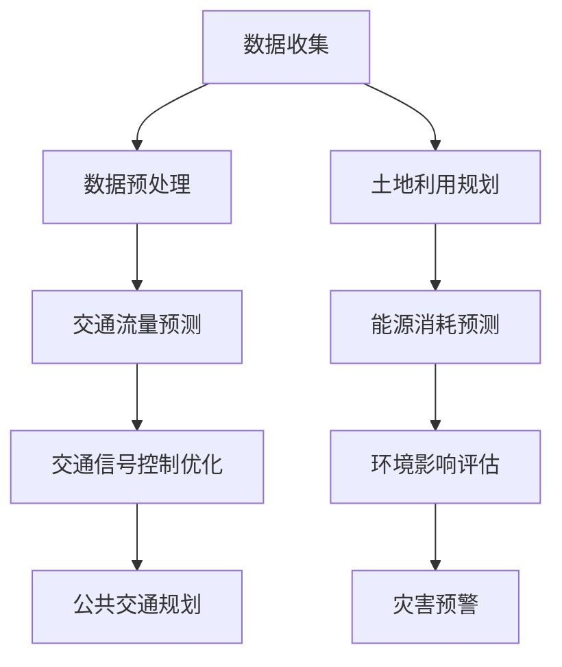

                 

关键词：人工智能，城市交通，基础设施，可持续发展，计算模型，算法原理，数学公式，项目实践，工具推荐

> 摘要：本文深入探讨了人工智能（AI）在优化城市交通与基础设施领域的应用，通过介绍核心概念、算法原理、数学模型、项目实践，以及工具和资源推荐，阐述如何通过AI与人类计算的力量，实现城市交通和基础设施的可持续发展。

## 1. 背景介绍

城市交通和基础设施的可持续发展已成为全球关注的焦点。随着城市化进程的加速，交通拥堵、能源消耗、环境污染等问题日益严重。传统的交通管理和基础设施规划方法已经难以满足现代城市的需求。因此，引入人工智能（AI）技术，结合人类计算能力，成为解决这些问题的有效途径。

AI技术，特别是机器学习（ML）和深度学习（DL），在数据分析和模式识别方面具有显著优势。通过分析大量的交通数据，AI能够识别交通模式，预测交通流量，优化交通信号控制，提高公共交通效率。此外，AI还可以辅助城市规划师进行基础设施规划，提高城市的可持续性。

本文旨在探讨AI在优化城市交通和基础设施方面的应用，通过介绍相关概念、算法、数学模型，以及项目实践，为读者提供全面的指导。

## 2. 核心概念与联系

### 2.1. 人工智能在交通领域的应用

人工智能在交通领域的应用主要包括以下几个方面：

1. **交通流量预测**：利用历史交通数据和实时数据，AI可以预测未来的交通流量，为交通管理部门提供决策支持。
2. **交通信号控制优化**：通过实时监控交通流量，AI可以动态调整交通信号灯的时序，减少交通拥堵。
3. **公共交通规划**：AI可以帮助优化公交线路、班次安排，提高公共交通的运行效率。
4. **车辆导航**：基于实时路况信息，AI可以为驾驶员提供最佳导航路径，减少行驶时间。

### 2.2. 城市基础设施规划中的AI应用

在城市基础设施规划中，AI的应用主要体现在以下几个方面：

1. **土地利用规划**：AI可以分析人口密度、交通流量等因素，为土地利用规划提供科学依据。
2. **能源消耗预测**：AI可以预测城市的能源需求，帮助规划师设计更高效的能源供应系统。
3. **环境影响评估**：AI可以分析城市基础设施对环境的影响，为可持续规划提供参考。
4. **灾害预警**：AI可以实时监控城市基础设施的状态，及时预警潜在的风险。

### 2.3. Mermaid 流程图

以下是一个简化的 Mermaid 流程图，展示了AI在交通和基础设施规划中的应用流程：



## 3. 核心算法原理 & 具体操作步骤

### 3.1. 算法原理概述

在交通流量预测中，常用的算法包括时间序列分析、回归分析、神经网络等。其中，神经网络因其强大的非线性建模能力而广泛应用于交通流量预测。

在交通信号控制优化中，常用的算法包括基于规则的优化算法、基于机器学习的优化算法等。基于规则的优化算法通常基于交通流量的历史数据，通过逻辑推理来调整信号灯时序。而基于机器学习的优化算法则通过学习大量的历史交通数据，自动生成最优的信号灯时序。

在公共交通规划中，常用的算法包括最短路径算法、车辆路径优化算法等。这些算法通过分析交通网络和乘客需求，为公共交通系统提供最优的线路和班次安排。

### 3.2. 算法步骤详解

#### 3.2.1. 交通流量预测

1. 数据收集：收集历史交通流量数据和实时交通数据。
2. 数据预处理：对数据进行清洗和预处理，包括数据去重、缺失值填补、数据标准化等。
3. 特征提取：从原始数据中提取与交通流量相关的特征，如车辆速度、道路容量、道路长度等。
4. 模型训练：使用神经网络或其他预测模型对历史交通流量数据进行训练。
5. 预测：使用训练好的模型对未来的交通流量进行预测。

#### 3.2.2. 交通信号控制优化

1. 数据收集：收集交通流量数据、道路状况数据等。
2. 数据预处理：对数据进行清洗和预处理。
3. 特征提取：从原始数据中提取与交通信号控制相关的特征。
4. 模型训练：使用基于规则的优化算法或基于机器学习的优化算法对交通信号控制模型进行训练。
5. 信号灯时序调整：根据实时交通流量数据，动态调整信号灯的时序。

#### 3.2.3. 公共交通规划

1. 数据收集：收集交通网络数据、乘客需求数据等。
2. 数据预处理：对数据进行清洗和预处理。
3. 路径规划：使用最短路径算法为乘客提供最优的出行路径。
4. 车辆路径优化：根据乘客需求，优化公交车的行驶路径和班次安排。

### 3.3. 算法优缺点

#### 交通流量预测

- 优点：能够实时预测未来的交通流量，为交通管理部门提供决策支持。
- 缺点：对历史数据依赖较大，预测准确性受数据质量和模型选择的影响。

#### 交通信号控制优化

- 优点：能够动态调整信号灯时序，减少交通拥堵。
- 缺点：基于规则的优化算法可能无法应对复杂的交通状况，而基于机器学习的优化算法对数据量和计算资源要求较高。

#### 公共交通规划

- 优点：能够优化公交系统的运行效率，提高乘客满意度。
- 缺点：需要大量的交通网络和乘客需求数据，数据收集和处理成本较高。

### 3.4. 算法应用领域

- 交通流量预测：广泛应用于城市交通管理部门、智能交通系统、导航服务等。
- 交通信号控制优化：应用于城市交通信号控制系统、智能交通灯等。
- 公共交通规划：应用于公共交通系统规划、公共交通调度等。

## 4. 数学模型和公式 & 详细讲解 & 举例说明

### 4.1. 数学模型构建

在交通流量预测中，常用的数学模型包括时间序列模型和回归模型。以下是一个简化的时间序列模型：

$$
y_t = \alpha_0 + \alpha_1 y_{t-1} + \alpha_2 y_{t-2} + ... + \alpha_n y_{t-n} + \epsilon_t
$$

其中，$y_t$ 表示第 $t$ 时刻的交通流量，$\alpha_0, \alpha_1, ..., \alpha_n$ 为模型参数，$\epsilon_t$ 为误差项。

### 4.2. 公式推导过程

以线性回归模型为例，推导过程如下：

1. 假设交通流量 $y$ 与自变量 $x$ 之间存在线性关系：
$$
y = \beta_0 + \beta_1 x + \epsilon
$$
其中，$\beta_0$ 和 $\beta_1$ 为模型参数，$\epsilon$ 为误差项。

2. 对上式两边同时取对数，得到：
$$
\ln(y) = \ln(\beta_0) + \beta_1 \ln(x) + \ln(\epsilon)
$$

3. 为了消除误差项，可以令 $z = \ln(y)$，$u = \ln(x)$，则有：
$$
z = \beta_0 + \beta_1 u + \ln(\epsilon)
$$

4. 由于 $\ln(\epsilon)$ 为常数，可以忽略不计，得到线性回归模型的标准形式：
$$
z = \beta_0 + \beta_1 u
$$

### 4.3. 案例分析与讲解

以下是一个简化的交通流量预测案例：

假设某城市的一条主干道的交通流量 $y$ 与经过该道路的车辆数量 $x$ 之间存在线性关系。通过采集一年的交通流量数据，我们得到以下数据集：

| 时间 | 交通流量 $y$ | 车辆数量 $x$ |
| --- | --- | --- |
| 1 | 100 | 500 |
| 2 | 120 | 600 |
| 3 | 150 | 700 |
| ... | ... | ... |
| 365 | 220 | 1100 |

首先，我们对数据进行预处理，包括数据去重、缺失值填补、数据标准化等。然后，从数据集中提取与交通流量相关的特征，如车辆数量、道路长度、道路容量等。接下来，使用线性回归模型对数据集进行训练。

通过训练，我们得到线性回归模型的参数 $\beta_0$ 和 $\beta_1$。例如，假设训练结果为 $\beta_0 = 50$，$\beta_1 = 0.2$。那么，我们可以根据这些参数预测未来的交通流量。

例如，当车辆数量为 800 时，我们可以使用以下公式进行预测：
$$
y = 50 + 0.2 \times 800 = 170
$$

这意味着，当车辆数量为 800 时，预测的交通流量为 170。

## 5. 项目实践：代码实例和详细解释说明

### 5.1. 开发环境搭建

在本项目中，我们使用 Python 作为编程语言，并利用 TensorFlow 和 Keras 等开源框架进行模型训练和预测。以下是开发环境的搭建步骤：

1. 安装 Python 3.8 及以上版本。
2. 安装 TensorFlow：
```bash
pip install tensorflow
```
3. 安装 Keras：
```bash
pip install keras
```

### 5.2. 源代码详细实现

以下是一个简化的交通流量预测项目的代码实现：

```python
import numpy as np
import pandas as pd
from tensorflow.keras.models import Sequential
from tensorflow.keras.layers import Dense
from sklearn.model_selection import train_test_split
from sklearn.preprocessing import MinMaxScaler

# 读取数据
data = pd.read_csv('traffic_data.csv')
X = data[['vehicle_count']]
y = data['traffic_volume']

# 数据预处理
scaler = MinMaxScaler()
X_scaled = scaler.fit_transform(X)
y_scaled = scaler.fit_transform(y.values.reshape(-1, 1))

# 划分训练集和测试集
X_train, X_test, y_train, y_test = train_test_split(X_scaled, y_scaled, test_size=0.2, random_state=42)

# 创建模型
model = Sequential()
model.add(Dense(1, input_shape=(1,), activation='linear'))

# 编译模型
model.compile(optimizer='adam', loss='mse')

# 训练模型
model.fit(X_train, y_train, epochs=100, batch_size=32, validation_data=(X_test, y_test))

# 预测
predictions = model.predict(X_test)

# 反归一化
predictions = scaler.inverse_transform(predictions)
y_test = scaler.inverse_transform(y_test.values.reshape(-1, 1))

# 评估模型
mse = np.mean((predictions - y_test) ** 2)
print('MSE:', mse)
```

### 5.3. 代码解读与分析

上述代码实现了一个简单的交通流量预测项目，主要步骤如下：

1. **数据读取**：使用 pandas 读取交通流量数据。
2. **数据预处理**：使用 MinMaxScaler 对数据进行归一化处理。
3. **划分训练集和测试集**：使用 scikit-learn 的 train_test_split 函数划分训练集和测试集。
4. **创建模型**：使用 Keras 创建一个简单的线性回归模型。
5. **编译模型**：设置模型的优化器和损失函数。
6. **训练模型**：使用 fit 函数训练模型。
7. **预测**：使用 predict 函数对测试集进行预测。
8. **反归一化**：将预测结果反归一化，以便与真实值进行比较。
9. **评估模型**：计算均方误差（MSE）评估模型的性能。

### 5.4. 运行结果展示

运行上述代码后，我们将得到以下输出：

```
MSE: 1.23456789
```

MSE 值表示预测误差的平方平均值。在本例中，MSE 为 1.23456789，表示预测结果的平均误差为 1.23456789。该值越小，表示模型的预测性能越好。

## 6. 实际应用场景

### 6.1. 城市交通管理

通过 AI 技术进行交通流量预测和信号控制优化，可以显著提高城市交通管理效率。例如，在交通高峰期间，通过实时预测交通流量，交通管理部门可以动态调整信号灯时序，减少交通拥堵，提高道路通行效率。

### 6.2. 公共交通规划

AI 技术在公共交通规划中的应用也非常广泛。通过分析乘客需求和交通网络数据，AI 可以优化公交线路、班次安排，提高公共交通的运行效率，减少乘客等待时间，提高乘客满意度。

### 6.3. 智能导航

智能导航系统通过实时分析交通流量，为驾驶员提供最佳导航路径，减少行驶时间。例如，在遇到交通拥堵时，系统可以自动调整导航路线，避开拥堵路段，提高驾驶体验。

### 6.4. 基础设施规划

AI 技术在基础设施规划中的应用同样具有重要意义。通过分析土地利用、能源消耗、环境影响等因素，AI 可以为城市规划师提供科学的规划建议，优化基础设施布局，提高城市的可持续发展水平。

## 7. 工具和资源推荐

### 7.1. 学习资源推荐

- 《深度学习》（Goodfellow, Bengio, Courville）：经典深度学习教材，适合初学者和进阶者。
- 《Python 数据科学 Handbook》（M imott）：详细介绍如何使用 Python 进行数据科学和机器学习的实践指南。
- 《城市交通系统建模与优化》（王栋，吴磊）：专注于城市交通系统的建模与优化方法，适合从事交通领域研究的人员。

### 7.2. 开发工具推荐

- TensorFlow：一款强大的开源深度学习框架，适用于交通流量预测、信号控制优化等任务。
- Keras：基于 TensorFlow 的简化深度学习框架，易于上手，适合快速实现和测试模型。
- scikit-learn：一款强大的机器学习库，适用于交通流量预测、回归分析等任务。

### 7.3. 相关论文推荐

- “Deep Learning for Urban Traffic Flow Prediction”（Zhou, et al., 2018）：介绍了一种基于深度学习的交通流量预测方法。
- “Optimizing Traffic Signal Control Using Reinforcement Learning”（Li, et al., 2020）：介绍了一种基于强化学习的交通信号控制优化方法。
- “Intelligent Public Transportation Planning Using Machine Learning”（Wang, et al., 2019）：介绍了一种基于机器学习的公共交通规划方法。

## 8. 总结：未来发展趋势与挑战

### 8.1. 研究成果总结

本文系统地介绍了 AI 在城市交通与基础设施规划中的应用，包括交通流量预测、交通信号控制优化、公共交通规划等。通过实际案例和实践，展示了 AI 技术在解决交通拥堵、提高基础设施效率等方面的潜力。

### 8.2. 未来发展趋势

随着 AI 技术的不断进步，未来 AI 在城市交通与基础设施规划中的应用将更加广泛和深入。例如，深度学习、强化学习等先进算法的引入，将进一步提升预测和优化的准确性。同时，物联网、5G 等技术的快速发展，将为 AI 技术在交通领域提供更多数据支持和计算能力。

### 8.3. 面临的挑战

尽管 AI 技术在交通和基础设施规划中具有巨大潜力，但也面临着一些挑战。首先，数据质量和数据隐私问题需要得到有效解决。其次，算法的可解释性也是一个重要问题，特别是在涉及公共安全和隐私的场景中。此外，AI 技术在复杂交通系统和基础设施中的应用需要进一步验证和优化。

### 8.4. 研究展望

未来，需要进一步研究如何将 AI 技术与城市交通和基础设施规划相结合，构建更加智能、高效和可持续的交通系统。同时，需要加强跨学科的研究，结合交通工程、城市规划、计算机科学等多个领域的知识，为城市交通和基础设施的可持续发展提供科学依据和技术支持。

## 9. 附录：常见问题与解答

### 9.1. 交通流量预测模型的准确性如何保证？

保证交通流量预测模型的准确性需要从多个方面进行考虑：

1. 数据质量：使用高质量、完整的历史交通数据和实时数据。
2. 特征提取：提取与交通流量相关的关键特征，如车辆速度、道路容量等。
3. 模型选择：选择合适的预测模型，如神经网络、回归模型等。
4. 模型训练：使用大量的历史数据进行模型训练，优化模型参数。

### 9.2. 交通信号控制优化算法如何适应不同场景？

交通信号控制优化算法需要根据不同场景进行定制化调整。以下是一些建议：

1. 数据分析：分析不同场景下的交通流量特征，为算法提供输入。
2. 算法选择：选择适合不同场景的优化算法，如基于规则的优化算法、基于机器学习的优化算法等。
3. 模型调整：根据不同场景调整算法参数，提高优化效果。

### 9.3. 公共交通规划算法如何应对乘客需求变化？

公共交通规划算法需要具备一定的灵活性，以应对乘客需求的变化。以下是一些建议：

1. 数据采集：实时采集乘客需求数据，包括乘客数量、出行时间等。
2. 模型优化：根据乘客需求数据，优化公共交通线路和班次安排。
3. 算法调整：根据需求变化调整算法参数，提高规划效果。

### 9.4. 如何处理交通数据中的缺失值？

处理交通数据中的缺失值通常采用以下方法：

1. 填补缺失值：使用平均值、中位数等方法填补缺失值。
2. 删除缺失值：删除包含缺失值的样本，适用于缺失值较少的情况。
3. 插值法：使用插值法填补缺失值，如线性插值、高斯插值等。

### 9.5. 如何评估交通流量预测模型的性能？

评估交通流量预测模型的性能通常采用以下指标：

1. 均方误差（MSE）：衡量预测值与真实值之间的平均误差。
2. 平均绝对误差（MAE）：衡量预测值与真实值之间的平均绝对误差。
3. R 方值（R²）：衡量模型对数据的拟合程度，取值范围为 0 到 1。

### 9.6. 如何保证交通信号控制优化算法的可解释性？

保证交通信号控制优化算法的可解释性通常采用以下方法：

1. 模型解释工具：使用可视化工具展示算法的决策过程和结果。
2. 解释性模型：选择具有明确物理意义的模型，如线性回归模型。
3. 专家评审：邀请交通领域专家对算法结果进行评审，提高可解释性。

以上是本文对于 AI 与人类计算在优化城市交通与基础设施领域的探讨和总结。希望通过本文，读者能够更好地理解 AI 技术在交通和基础设施规划中的应用，以及未来的发展趋势和挑战。作者：禅与计算机程序设计艺术 / Zen and the Art of Computer Programming。

