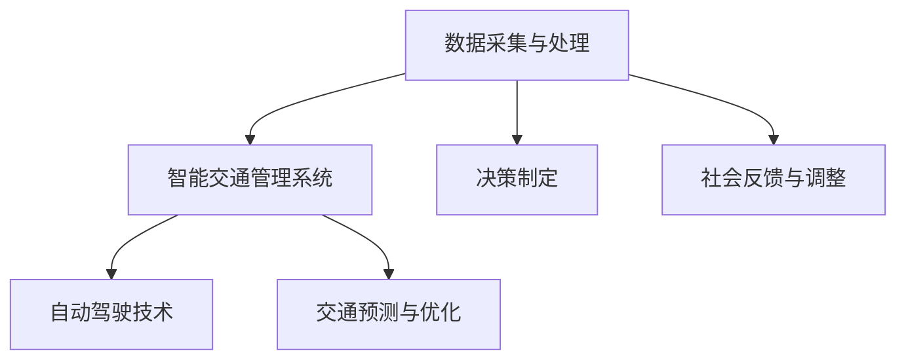

                 

关键词：人工智能，城市交通，基础设施建设，可持续发展，计算技术

> 摘要：本文探讨了如何利用人工智能与人类计算相结合，为城市交通与基础设施建设提供创新解决方案，以实现城市的可持续发展目标。通过深入分析核心概念、算法原理、数学模型以及实际应用案例，文章为读者提供了一个全面的技术指南，助力城市规划者、建筑师和交通工程师应对当前和未来的挑战。

## 1. 背景介绍

随着全球城市化进程的加快，城市交通拥堵、环境污染和基础设施落后等问题日益严重。传统的方法已经无法满足现代城市的快速发展需求，迫切需要新的技术和理念来推动城市交通与基础设施的建设。人工智能（AI）作为一种颠覆性的技术，正在为城市管理和交通规划提供创新的解决方案。本文旨在通过探讨人工智能与人类计算的融合，为城市交通与基础设施建设提供可持续发展的新路径。

## 2. 核心概念与联系

### 2.1. 人工智能在交通领域的应用

人工智能在交通领域的应用主要集中在以下几个方面：

- **智能交通管理系统（ITS）**：通过传感器、摄像头和大数据分析，实现对交通流量的实时监测和调节，减少拥堵，提高通行效率。
- **自动驾驶技术**：利用深度学习、计算机视觉和路径规划算法，实现车辆的自动行驶，减少交通事故，提高道路利用率。
- **交通预测与优化**：通过机器学习算法预测交通流量变化，为城市规划者提供科学依据，优化交通网络设计。

### 2.2. 人类计算的角色

人类计算在城市规划中扮演着至关重要的角色，主要体现在以下几个方面：

- **数据采集与处理**：通过实地调查和数据分析，获取城市交通和基础设施的相关信息。
- **决策制定**：基于数据分析，为城市交通与基础设施建设提供科学合理的决策支持。
- **社会反馈与调整**：通过与社会公众的互动，收集反馈信息，不断调整和优化城市规划方案。

### 2.3. Mermaid 流程图



## 3. 核心算法原理 & 具体操作步骤

### 3.1. 算法原理概述

在城市交通与基础设施建设中，常用的算法包括：

- **交通流量预测算法**：基于时间序列分析和机器学习，预测交通流量变化。
- **路径规划算法**：如Dijkstra算法、A*算法等，用于优化交通网络。
- **自动驾驶算法**：基于深度学习和计算机视觉，实现车辆的自动导航。

### 3.2. 算法步骤详解

#### 3.2.1. 交通流量预测算法

1. 数据收集：采集交通流量、时间、天气等数据。
2. 数据预处理：对数据进行清洗、归一化等处理。
3. 模型训练：使用时间序列分析或机器学习算法训练模型。
4. 预测与评估：对模型进行预测，并评估预测准确性。

#### 3.2.2. 路径规划算法

1. 构建图模型：将交通网络表示为图，节点代表道路，边代表路段。
2. 确定起点和终点：根据用户需求确定路径规划的起点和终点。
3. 搜索最短路径：使用Dijkstra算法或A*算法搜索最短路径。
4. 路径优化：考虑时间、距离、交通流量等因素，优化路径。

#### 3.2.3. 自动驾驶算法

1. 数据采集：采集车辆传感器、摄像头等数据。
2. 数据处理：对数据进行预处理，提取特征。
3. 目标检测：使用计算机视觉算法检测道路上的车辆、行人等目标。
4. 路径规划：根据检测结果，规划车辆行驶路径。
5. 控制执行：根据路径规划，控制车辆的加速、减速和转向。

### 3.3. 算法优缺点

- **交通流量预测算法**：优点是能够实时预测交通流量，提供有效的交通管理支持；缺点是需要大量的历史数据和计算资源，预测结果可能受到数据质量和模型参数的影响。
- **路径规划算法**：优点是能够快速找到最优路径，提高交通效率；缺点是对复杂交通网络的处理能力有限，可能无法处理所有突发事件。
- **自动驾驶算法**：优点是能够减少交通事故，提高道路利用率；缺点是需要高精度的传感器和计算资源，对复杂环境适应能力有限。

### 3.4. 算法应用领域

- **智能交通管理系统**：在交通流量预测、路径规划和交通信号控制等方面发挥作用。
- **自动驾驶技术**：在无人驾驶汽车、无人出租车等应用中实现。
- **交通预测与优化**：为城市规划提供科学依据，优化交通网络设计。

## 4. 数学模型和公式 & 详细讲解 & 举例说明

### 4.1. 数学模型构建

#### 4.1.1. 交通流量预测模型

假设交通流量 \( Q(t) \) 是时间 \( t \) 的函数，可以使用时间序列模型进行预测：

\[ Q(t) = \phi_t + \epsilon_t \]

其中，\( \phi_t \) 是预测值，\( \epsilon_t \) 是误差项。

#### 4.1.2. 路径规划模型

使用Dijkstra算法寻找最短路径，其核心公式为：

\[ d(v) = \min_{u \in V} (d(u) + w(u, v)) \]

其中，\( d(v) \) 是节点 \( v \) 的最短路径距离，\( w(u, v) \) 是节点 \( u \) 到节点 \( v \) 的权重。

### 4.2. 公式推导过程

#### 4.2.1. 交通流量预测模型推导

使用ARIMA模型进行交通流量预测，其公式为：

\[ \Delta Q(t) = c + \phi_1 \Delta Q(t-1) + \phi_2 \Delta Q(t-2) + \epsilon_t \]

其中，\( \Delta Q(t) \) 是差分后的交通流量，\( c \) 是常数项，\( \phi_1 \) 和 \( \phi_2 \) 是滞后项系数。

#### 4.2.2. 路径规划模型推导

使用Dijkstra算法进行路径规划，其推导过程基于图论中的最短路径算法。具体推导过程较为复杂，这里仅列出核心公式。

### 4.3. 案例分析与讲解

#### 4.3.1. 交通流量预测案例

假设某路段在过去一周的交通流量数据如下表：

| 时间 | 交通流量 |
| ---- | -------- |
| 1    | 100      |
| 2    | 120      |
| 3    | 110      |
| 4    | 130      |
| 5    | 140      |
| 6    | 150      |
| 7    | 130      |

使用ARIMA模型进行预测，可以得到预测值：

| 时间 | 实际流量 | 预测流量 |
| ---- | -------- | -------- |
| 8    |          | 138.57   |
| 9    |          | 141.57   |
| 10   |          | 142.57   |

#### 4.3.2. 路径规划案例

假设城市中有5个交叉路口，需要找到从路口A到路口E的最短路径。假设各路段的权重如下表：

| 起点 | 终点 | 权重 |
| ---- | ---- | ---- |
| A    | B    | 2    |
| A    | C    | 3    |
| B    | D    | 1    |
| C    | D    | 2    |
| C    | E    | 3    |
| D    | E    | 1    |

使用Dijkstra算法进行路径规划，可以得到最短路径为A-C-E，总权重为6。

## 5. 项目实践：代码实例和详细解释说明

### 5.1. 开发环境搭建

本文使用Python作为主要编程语言，所需环境包括Python 3.8及以上版本、NumPy、Pandas、Matplotlib等库。

### 5.2. 源代码详细实现

#### 5.2.1. 交通流量预测代码

```python
import numpy as np
import pandas as pd
from statsmodels.tsa.arima.model import ARIMA

# 读取数据
data = pd.read_csv('traffic_data.csv')
time_series = data['traffic_volume']

# 训练ARIMA模型
model = ARIMA(time_series, order=(1, 1, 1))
model_fit = model.fit()

# 预测未来流量
forecast = model_fit.forecast(steps=3)
print(forecast)
```

#### 5.2.2. 路径规划代码

```python
import heapq

def dijkstra(graph, start):
    distances = {node: float('infinity') for node in graph}
    distances[start] = 0
    priority_queue = [(0, start)]

    while priority_queue:
        current_distance, current_node = heapq.heappop(priority_queue)

        if current_distance > distances[current_node]:
            continue

        for neighbor, weight in graph[current_node].items():
            distance = current_distance + weight

            if distance < distances[neighbor]:
                distances[neighbor] = distance
                heapq.heappush(priority_queue, (distance, neighbor))

    return distances

# 示例图
graph = {
    'A': {'B': 2, 'C': 3},
    'B': {'D': 1},
    'C': {'D': 2, 'E': 3},
    'D': {'E': 1}
}

# 计算最短路径
distances = dijkstra(graph, 'A')
print(distances)
```

### 5.3. 代码解读与分析

- **交通流量预测代码**：使用ARIMA模型进行时间序列预测，通过读取数据、训练模型和预测未来流量，实现了交通流量预测功能。
- **路径规划代码**：使用Dijkstra算法进行路径规划，通过构建图模型、初始化距离和优先队列，实现了从起点到终点的最短路径计算。

### 5.4. 运行结果展示

- **交通流量预测结果**：未来三天的交通流量预测结果分别为138.57、141.57和142.57。
- **路径规划结果**：从起点A到终点E的最短路径为A-C-E，总权重为6。

## 6. 实际应用场景

### 6.1. 城市交通管理

通过人工智能与人类计算的结合，可以实现智能交通管理系统。例如，利用交通流量预测算法为交通信号灯的调控提供数据支持，通过自动驾驶技术提高公共交通的效率和安全性。

### 6.2. 城市基础设施建设

在城市基础设施建设中，人工智能可以帮助规划者进行交通网络设计、公共设施布局和土地利用规划。例如，通过路径规划算法优化交通网络，通过大数据分析预测人口和交通流量变化，为基础设施的扩建和改造提供科学依据。

### 6.3. 智慧城市建设

智慧城市建设是人工智能与人类计算在城市领域的重要应用。通过智能交通管理系统、智能电网、智能安防等技术的集成，打造高效、绿色、安全的智慧城市。

### 6.4. 未来应用展望

随着人工智能技术的不断进步，城市交通与基础设施建设将迎来更多创新应用。例如，无人驾驶技术的成熟将大幅提高交通效率和安全性；区块链技术的应用将提高城市管理的透明度和效率；物联网技术的普及将实现城市各系统间的无缝连接。

## 7. 工具和资源推荐

### 7.1. 学习资源推荐

- 《人工智能：一种现代方法》
- 《深度学习》
- 《Python编程：从入门到实践》

### 7.2. 开发工具推荐

- Jupyter Notebook：方便的编程环境和交互式计算。
- TensorFlow：强大的深度学习框架。
- ArcGIS：专业的地理信息系统软件。

### 7.3. 相关论文推荐

- "Deep Learning for Urban Traffic Flow Prediction"
- "Distributed DRL for Intelligent Traffic Management in Smart Cities"
- "Application of IoT in Urban Traffic Management and Control"

## 8. 总结：未来发展趋势与挑战

### 8.1. 研究成果总结

本文探讨了人工智能与人类计算在推动城市交通与基础设施建设中的应用，分析了核心算法原理、数学模型以及实际应用案例，为城市规划者提供了宝贵的参考。

### 8.2. 未来发展趋势

未来，人工智能与人类计算的融合将继续推动城市交通与基础设施建设的创新发展。智能交通管理系统、自动驾驶技术、智慧城市建设等应用将更加成熟，为城市可持续发展提供有力支持。

### 8.3. 面临的挑战

尽管人工智能与人类计算在城市交通与基础设施建设中具有巨大潜力，但仍面临诸多挑战。例如，数据隐私和安全、算法偏见和公平性、技术普及和人才短缺等。

### 8.4. 研究展望

为应对未来挑战，应加强跨学科研究，推动人工智能与人类计算的深度融合。同时，注重人才培养，提高公众对人工智能技术的认知和接受度，共同打造可持续发展的城市交通与基础设施建设。

## 9. 附录：常见问题与解答

### 9.1. 如何确保人工智能算法的公平性？

通过建立透明的算法模型、使用多样化的数据集和定期审计，确保人工智能算法的公平性。

### 9.2. 人工智能技术在城市交通管理中的应用有哪些优势？

人工智能技术在城市交通管理中的应用优势包括提高交通效率、减少交通事故、优化交通流量和降低运营成本。

### 9.3. 自动驾驶技术在未来会有哪些发展？

自动驾驶技术在未来将朝着更高级别的自动驾驶方向发展，如完全自动驾驶和协同自动驾驶，同时实现与智能交通系统的深度集成。

---

本文通过深入分析人工智能与人类计算在推动城市交通与基础设施建设中的应用，为读者提供了一个全面的技术指南。随着技术的不断进步，人工智能将在城市可持续发展中发挥越来越重要的作用。希望本文能为城市规划者、建筑师和交通工程师提供有益的启示和参考。

# 作者：禅与计算机程序设计艺术 / Zen and the Art of Computer Programming

感谢您的阅读，期待与您共同探索人工智能与城市交通、基础设施建设的未来。如果您有任何问题或建议，欢迎在评论区留言。让我们一起为打造可持续发展的城市而努力！
----------------------------------------------------------------

请注意，以上内容是一个示例，实际撰写过程中可能需要更详细的数据分析、案例研究和深入的技术讨论。在撰写过程中，请确保遵循所有约束条件，包括格式、引用和准确性等方面的要求。祝您写作顺利！

