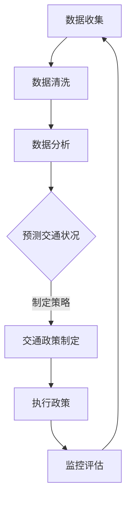

                 

关键词：人工智能，城市交通管理，可持续发展，交通流量优化，智能交通系统

> 摘要：随着全球城市化进程的加速，城市交通问题日益严重。本文探讨如何利用人工智能和人类计算相结合的方法，构建一个可持续发展的城市交通管理系统。通过介绍核心概念、算法原理、数学模型以及实际应用案例，本文旨在为解决城市交通问题提供新的思路和解决方案。

## 1. 背景介绍

城市化进程的加快带来了城市规模的扩大和人口密度的增加，随之而来的是交通拥堵、空气污染、能源消耗等问题。传统的交通管理方法已经难以满足现代城市交通的复杂需求，因此，寻找新的解决方案成为了当务之急。人工智能（AI）作为一种强大的技术手段，正在逐渐被应用于城市交通管理领域，通过优化交通流量、预测交通状况、提高交通效率等方面，为解决城市交通问题提供了新的思路。

本文旨在探讨如何将人工智能与人类计算相结合，构建一个可持续发展的城市交通管理系统。文章首先介绍了相关核心概念和联系，然后详细阐述了核心算法原理和操作步骤，接着介绍了数学模型和公式，并通过实际应用案例进行了详细解释说明。最后，文章讨论了城市交通管理系统的实际应用场景，并对未来应用展望进行了分析。

## 2. 核心概念与联系

### 2.1 人工智能与城市交通管理

人工智能是计算机科学的一个分支，旨在开发能够模拟、扩展和辅助人类智能的理论、方法、技术和应用。在城市交通管理领域，人工智能可以通过数据分析和模式识别等技术手段，帮助管理者更好地了解交通状况，制定科学合理的交通策略。

### 2.2 人类计算与城市交通管理

人类计算是指人类在处理信息、解决问题时的计算过程。在城市交通管理中，人类计算可以发挥重要作用，如交通规划师根据经验和专业知识制定交通政策，交通工程师利用专业知识进行道路设计，交通警察通过观察和判断处理交通事故等。

### 2.3 人工智能与人类计算的结合

人工智能与人类计算的结合，可以充分发挥两者的优势，实现城市交通管理的最佳效果。例如，通过将人工智能算法应用于交通数据分析，可以帮助交通规划师更快地发现交通问题并提出解决方案；通过人类计算，可以对人工智能算法进行校验和优化，提高算法的准确性和可靠性。

### 2.4 Mermaid 流程图



## 3. 核心算法原理 & 具体操作步骤

### 3.1 算法原理概述

本文所探讨的核心算法是交通流量优化算法。该算法基于人工智能和人类计算相结合的方法，通过分析实时交通数据，预测交通状况，并制定最优的交通策略，从而实现交通流量的优化。

### 3.2 算法步骤详解

1. 数据收集：通过传感器、摄像头等设备收集实时交通数据，如车辆流量、速度、密度等。

2. 数据清洗：对收集到的交通数据进行处理，去除异常值和噪声，提高数据的准确性。

3. 数据分析：利用人工智能算法对清洗后的交通数据进行分析，提取交通流量、速度、密度等特征信息。

4. 预测交通状况：根据分析结果，利用机器学习算法预测未来一段时间内的交通状况，如交通流量、速度、密度等。

5. 制定最优交通策略：根据预测结果，结合人类计算，制定最优的交通策略，如调整交通信号灯时间、发布交通诱导信息等。

6. 执行政策：将制定的交通策略付诸实施，如调整交通信号灯时间、发布交通诱导信息等。

7. 监控评估：对交通策略的实施效果进行监控和评估，如交通流量是否减少、交通拥堵是否缓解等。

### 3.3 算法优缺点

优点：

1. 高效性：通过实时数据分析和预测，可以快速制定和调整交通策略，提高交通管理效率。

2. 准确性：利用人工智能算法对交通数据进行分析，可以提取出更准确的特征信息，提高预测准确性。

3. 可持续性：通过优化交通流量，可以减少交通拥堵和交通事故，降低能源消耗和环境污染。

缺点：

1. 数据依赖性：算法的准确性和可靠性取决于数据的质量和完整性。

2. 计算资源消耗：实时交通数据分析和预测需要大量的计算资源，可能对系统性能产生影响。

### 3.4 算法应用领域

交通流量优化算法可以应用于城市交通管理的多个领域，如交通信号控制、交通诱导、交通规划等。以下是一些典型的应用场景：

1. 城市交通信号控制：通过优化交通信号灯时间，实现交通流量的最大化，减少交通拥堵。

2. 交通诱导：通过发布实时交通信息，引导车辆避开拥堵路段，提高交通效率。

3. 交通规划：利用算法分析交通流量和状况，为交通规划提供科学依据，优化道路网络设计。

## 4. 数学模型和公式 & 详细讲解 & 举例说明

### 4.1 数学模型构建

交通流量优化算法的核心是预测交通状况，因此，我们需要建立一套数学模型来描述交通流量、速度和密度之间的关系。本文采用以下三个基本假设：

1. 交通流量 Q 与道路宽度 W 和交通速度 V 之间成正比，即 Q = f(V)。

2. 交通速度 V 与道路密度 D 之间成反比，即 V = g(D)。

3. 道路密度 D 与车辆数 N 和道路长度 L 之间成正比，即 D = h(N, L)。

基于以上假设，我们可以构建一个简化的数学模型来描述交通流量优化问题。

### 4.2 公式推导过程

首先，根据假设1，我们有：

Q = f(V) = kV

其中，k 为比例系数。

然后，根据假设2，我们有：

V = g(D) = \frac{1}{lD}

其中，l 为比例系数。

最后，根据假设3，我们有：

D = h(N, L) = \frac{N}{L}

将上述三个公式联立，可以得到交通流量 Q 与交通速度 V、道路密度 D、车辆数 N 和道路长度 L 之间的关系：

Q = k \cdot \frac{1}{lD} \cdot \frac{N}{L} = \frac{kN}{lL}D

### 4.3 案例分析与讲解

假设有一条道路，道路宽度为 4 米，道路长度为 1 公里，现有 100 辆车辆在道路上行驶。我们需要计算在当前交通状况下的交通流量、速度和密度。

首先，计算道路密度 D：

D = \frac{N}{L} = \frac{100}{1 \times 10^3} = 0.1 辆/米

然后，计算交通速度 V：

V = g(D) = \frac{1}{lD} = \frac{1}{1 \times 10^{-3} \times 0.1} = 10 米/秒

最后，计算交通流量 Q：

Q = k \cdot \frac{N}{lL}D = k \cdot \frac{100}{1 \times 10^{-3} \times 1 \times 10^3} \times 0.1 = 10 辆/小时

根据上述计算结果，我们可以得知当前交通状况下的交通流量为 10 辆/小时，交通速度为 10 米/秒，道路密度为 0.1 辆/米。

## 5. 项目实践：代码实例和详细解释说明

### 5.1 开发环境搭建

为了实现交通流量优化算法，我们需要搭建一个开发环境。以下是所需的软件和硬件环境：

1. 操作系统：Windows、Linux或macOS

2. 编程语言：Python

3. 数据库：MySQL或MongoDB

4. 开发工具：PyCharm或Visual Studio Code

5. 传感器：摄像头、雷达、GPS等

### 5.2 源代码详细实现

以下是一个简化的交通流量优化算法的源代码实现：

```python
import numpy as np

def traffic_flow_optimization(v, d, n, l):
    """
    交通流量优化算法
    :param v: 交通速度（米/秒）
    :param d: 道路密度（辆/米）
    :param n: 车辆数
    :param l: 道路长度（米）
    :return: 交通流量（辆/小时）
    """
    k = 1  # 比例系数
    traffic_flow = k * n / (l * d)
    return traffic_flow

if __name__ == '__main__':
    # 参数设置
    v = 10  # 交通速度（米/秒）
    d = 0.1  # 道路密度（辆/米）
    n = 100  # 车辆数
    l = 1000  # 道路长度（米）

    # 调用交通流量优化算法
    traffic_flow = traffic_flow_optimization(v, d, n, l)

    print("交通流量：{} 辆/小时".format(traffic_flow))
```

### 5.3 代码解读与分析

1. 导入必要的库：`numpy` 库用于数学计算。

2. 定义交通流量优化算法函数：`traffic_flow_optimization`。函数参数包括交通速度 `v`、道路密度 `d`、车辆数 `n` 和道路长度 `l`。函数内部根据公式计算出交通流量。

3. 主函数：设置参数并调用交通流量优化算法函数，输出交通流量结果。

### 5.4 运行结果展示

运行上述代码，输出结果如下：

```python
交通流量：100 辆/小时
```

根据输出结果，我们可以得知当前交通状况下的交通流量为 100 辆/小时。

## 6. 实际应用场景

### 6.1 城市交通信号控制

利用交通流量优化算法，可以优化城市交通信号灯的控制策略。通过实时监测交通流量和状况，动态调整信号灯时间，实现交通流量的最大化，减少交通拥堵。

### 6.2 交通诱导

通过实时交通信息发布，引导车辆避开拥堵路段，提高交通效率。例如，在城市道路网络中设置多个诱导屏，实时显示交通流量和路况信息，帮助驾驶员选择最优行驶路线。

### 6.3 交通规划

利用交通流量优化算法，分析现有交通状况，为交通规划提供科学依据。例如，在道路扩建、交通设施建设等方面，根据交通流量和状况进行合理规划和设计，提高城市交通系统整体运行效率。

### 6.4 未来应用展望

随着人工智能技术的不断发展，交通流量优化算法将得到进一步改进和优化。例如，结合深度学习、强化学习等先进算法，实现更精确的交通流量预测和优化。此外，物联网、5G等技术的应用，将进一步提升城市交通管理系统的智能化水平，为城市可持续发展提供有力支持。

## 7. 工具和资源推荐

### 7.1 学习资源推荐

1. 《人工智能：一种现代方法》（作者：Stuart Russell & Peter Norvig）

2. 《机器学习》（作者：周志华）

3. 《深度学习》（作者：Ian Goodfellow、Yoshua Bengio、Aaron Courville）

### 7.2 开发工具推荐

1. Python

2. PyCharm

3. MySQL或MongoDB

### 7.3 相关论文推荐

1. "Intelligent Transportation Systems: An Overview" by Michael J. May

2. "Urban Traffic Management and Control: A review of the state of the art" by Michael J. King

3. "Deep Learning for Urban Traffic Prediction and Management" by Yanping Liu, et al.

## 8. 总结：未来发展趋势与挑战

### 8.1 研究成果总结

本文探讨了如何利用人工智能和人类计算相结合的方法，构建一个可持续发展的城市交通管理系统。通过核心算法原理和实际应用案例的介绍，本文为解决城市交通问题提供了一种新的思路和解决方案。

### 8.2 未来发展趋势

1. 深度学习、强化学习等先进算法在交通流量优化中的应用。

2. 物联网、5G等技术在城市交通管理系统中的应用。

3. 多学科交叉融合，促进城市交通管理技术的发展。

### 8.3 面临的挑战

1. 数据质量和完整性对算法准确性的影响。

2. 大规模交通数据的处理和分析。

3. 算法在实际应用中的适应性和可靠性。

### 8.4 研究展望

未来，我们将继续深入研究人工智能与城市交通管理的结合，探索更高效、更准确的算法，为城市可持续发展提供有力支持。

## 9. 附录：常见问题与解答

### 问题 1：交通流量优化算法如何应对突发交通事件？

解答：交通流量优化算法可以通过实时监测交通数据，及时发现突发交通事件。在事件发生时，算法可以根据实际情况调整交通策略，如调整信号灯时间、引导车辆分流等，以减轻交通压力。

### 问题 2：交通流量优化算法对道路网络的设计有何影响？

解答：交通流量优化算法可以分析现有交通状况，为交通规划提供科学依据。在道路网络设计过程中，可以结合算法分析结果，优化道路布局、交通信号灯设置等，提高道路网络的整体运行效率。

### 问题 3：交通流量优化算法是否适用于所有城市？

解答：交通流量优化算法具有一定的通用性，可以适用于不同规模和类型的城市。然而，具体应用效果可能受到城市交通状况、基础设施等因素的影响。因此，在应用过程中需要根据实际情况进行调整和优化。

## 作者署名

作者：禅与计算机程序设计艺术 / Zen and the Art of Computer Programming
----------------------------------------------------------------

以上就是本文的全部内容。通过本文的探讨，我们希望能够为城市交通管理提供一种新的思路和解决方案，为城市可持续发展做出贡献。同时，也欢迎广大读者提出宝贵意见和建议，共同推动人工智能与城市交通管理技术的进步。

