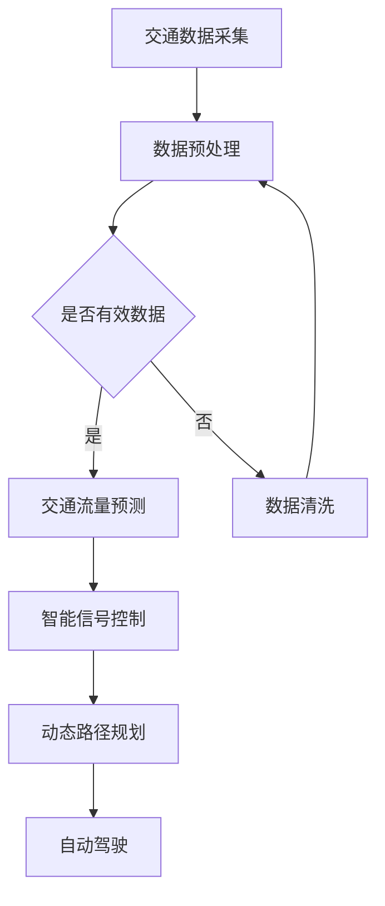

                 

关键词：人工智能，城市交通管理系统，基础设施建设，可持续发展，智能交通，数据驱动，深度学习，数据挖掘，协同优化，交通拥堵缓解，智能信号控制，智能交通基础设施，实时监控，交通流量预测，动态路径规划，自动驾驶，绿色交通，大数据分析，物联网，云计算，边缘计算，政策法规，生态平衡。

## 摘要

本文旨在探讨人工智能（AI）在推动城市交通管理系统和基础设施建设中的关键作用，特别是在实现可持续发展的背景下。通过对现有技术的深入分析，本文提出了一个综合性的框架，该框架结合了AI的先进算法和人类智慧，旨在打造高效、智能、绿色的城市交通网络。文章将详细阐述AI在交通流量预测、动态路径规划、智能信号控制、自动驾驶等领域的应用，并探讨这些技术如何通过协同优化和基础设施建设，为城市的可持续发展贡献力量。同时，本文还将讨论未来趋势、面临的挑战以及可能的解决方案，为政策制定者和城市规划者提供有价值的参考。

## 1. 背景介绍

### 1.1 城市交通管理现状

随着全球经济的快速发展，城市化进程不断加速，城市人口密度持续增加，导致城市交通问题日益突出。交通拥堵、停车难、环境污染等问题已经成为影响城市居民生活质量的重要因素。传统的城市交通管理系统往往依赖于经验性的管理方法，难以应对日益复杂的交通需求。这种情况下，引入人工智能技术成为解决城市交通问题的关键。

### 1.2 人工智能在交通领域的应用

人工智能技术在交通领域的应用已取得了显著成果。例如，智能交通信号控制系统可以通过实时数据分析和优化，有效缓解交通拥堵；自动驾驶技术正逐渐实现商业化应用，有望大幅提高交通安全性和效率；大数据分析技术能够帮助城市管理者更准确地预测交通流量，为交通规划和基础设施建设提供科学依据。

### 1.3 可持续发展的需求

实现城市可持续发展是当前全球关注的焦点。交通系统的可持续性不仅涉及环境保护，还包括社会公平和经济效率。人工智能技术为城市交通系统提供了实现可持续发展的新路径，通过优化交通资源配置、减少碳排放和提高交通效率，有助于实现城市可持续发展目标。

## 2. 核心概念与联系

### 2.1 核心概念

- **智能交通信号控制系统**：基于AI算法，对交通信号进行实时优化，以减少交通拥堵和提高通行效率。
- **交通流量预测**：通过大数据分析和机器学习模型，预测未来一段时间内的交通流量变化，为交通管理提供决策支持。
- **动态路径规划**：结合实时交通数据和AI算法，为驾驶者提供最优路径，减少出行时间和能耗。
- **自动驾驶技术**：利用传感器、摄像头和AI算法，使车辆能够在无人干预的情况下自主行驶。

### 2.2 架构与联系

**Mermaid 流程图**：



在这个流程图中，交通数据采集是整个系统的起点，经过预处理和清洗后，进入交通流量预测模块。预测结果用于智能信号控制和动态路径规划，最终指导自动驾驶技术的实现。整个流程体现了AI在交通管理中的协同作用，为城市交通系统的优化提供了全面支持。

## 3. 核心算法原理 & 具体操作步骤

### 3.1 算法原理概述

#### 3.1.1 交通流量预测

交通流量预测是智能交通管理系统的核心之一。其基本原理是基于历史交通数据和实时数据，利用机器学习算法构建预测模型，从而预测未来的交通流量。常用的算法包括时间序列分析、回归分析和深度学习等。

#### 3.1.2 智能信号控制

智能信号控制利用AI算法对交通信号进行动态优化，以最大化交通通行效率。其原理是基于实时交通流量数据，通过优化信号灯的时长和相位，来减少交通拥堵。常用的算法包括交通流量预测、车辆到达率和排队长度等。

#### 3.1.3 动态路径规划

动态路径规划是基于实时交通数据和AI算法，为驾驶者提供最优路径。其原理是通过分析不同路径的交通状况，结合驾驶者的目的地和偏好，选择最优路径。常用的算法包括遗传算法、A*算法和深度学习等。

#### 3.1.4 自动驾驶技术

自动驾驶技术利用传感器、摄像头和AI算法，使车辆能够自主行驶。其原理是通过感知环境、理解和预测，结合决策和执行，实现车辆自主驾驶。常用的算法包括计算机视觉、传感器融合和深度学习等。

### 3.2 算法步骤详解

#### 3.2.1 交通流量预测

1. **数据收集**：收集历史交通数据和实时交通数据，包括车辆流量、速度、占用情况等。
2. **数据预处理**：对数据进行清洗、去噪和特征提取，为建模做准备。
3. **模型选择**：选择合适的机器学习模型，如时间序列分析、回归分析或深度学习等。
4. **模型训练**：使用预处理后的数据训练模型，并进行参数调整。
5. **模型评估**：使用验证集评估模型性能，包括预测准确性、响应速度等。
6. **模型应用**：将模型应用于实时交通数据，预测未来交通流量。

#### 3.2.2 智能信号控制

1. **数据收集**：收集实时交通流量数据，包括车辆流量、速度、占用情况等。
2. **信号优化算法**：选择合适的信号优化算法，如基于交通流量的信号控制算法或基于排队长度的信号控制算法。
3. **实时计算**：在实时交通数据的基础上，计算最优的信号灯时长和相位。
4. **信号控制**：根据计算结果调整交通信号灯，以优化交通通行效率。

#### 3.2.3 动态路径规划

1. **数据收集**：收集实时交通数据，包括车辆流量、速度、道路状况等。
2. **路径评估**：分析不同路径的交通状况，评估路径的通行效率和安全性。
3. **路径选择**：结合驾驶者的目的地和偏好，选择最优路径。
4. **路径更新**：根据实时交通状况，动态调整路径规划，以应对突发状况。

#### 3.2.4 自动驾驶技术

1. **环境感知**：利用传感器和摄像头收集道路环境数据，包括交通标志、车道线、行人等。
2. **数据预处理**：对收集的数据进行预处理，包括去噪、特征提取等。
3. **感知理解**：利用计算机视觉和传感器融合算法，理解道路环境，识别交通标志、车道线等。
4. **决策规划**：根据感知结果，结合驾驶者的目的地和偏好，制定驾驶计划。
5. **执行控制**：执行驾驶计划，控制车辆的运动，包括加速、转向、制动等。

### 3.3 算法优缺点

#### 3.3.1 交通流量预测

- **优点**：基于大数据和机器学习，能够提供准确的交通流量预测，有助于交通管理和优化。
- **缺点**：对历史数据要求高，预测模型的准确性和实时性受限于数据质量和计算资源。

#### 3.3.2 智能信号控制

- **优点**：通过实时优化信号灯，能够有效缓解交通拥堵，提高通行效率。
- **缺点**：对实时数据要求高，信号优化算法的效率和准确性受限于计算能力和数据传输速度。

#### 3.3.3 动态路径规划

- **优点**：能够为驾驶者提供最优路径，减少出行时间和能耗。
- **缺点**：对实时交通数据依赖性强，路径规划的准确性和实时性受限于数据质量和计算资源。

#### 3.3.4 自动驾驶技术

- **优点**：能够提高交通安全性和效率，减少人为错误，降低交通事故。
- **缺点**：技术成熟度较低，对传感器和计算能力要求高，成本较高。

### 3.4 算法应用领域

- **交通流量预测**：广泛应用于城市交通管理、高速公路管理、公共交通调度等。
- **智能信号控制**：广泛应用于城市交通管理、智能停车场管理等。
- **动态路径规划**：广泛应用于智能导航、自动驾驶车辆等。
- **自动驾驶技术**：广泛应用于无人驾驶出租车、无人驾驶货车、自动驾驶公交车等。

## 4. 数学模型和公式 & 详细讲解 & 举例说明

### 4.1 数学模型构建

#### 4.1.1 交通流量预测模型

假设某时间段内，路段i的交通流量为 $Q_i(t)$，则交通流量预测模型可以表示为：

$$
Q_i(t) = f(Q_i(t-1), V_i(t-1), P_i(t-1), \theta)
$$

其中，$V_i(t-1)$ 为路段i在上一时间段的平均速度，$P_i(t-1)$ 为路段i在上一时间段的交通密度，$\theta$ 为模型参数。

#### 4.1.2 智能信号控制模型

智能信号控制模型的目标是最小化交通拥堵成本。假设某交叉口有 $n$ 个相位，每个相位的绿灯时长为 $g_i$，则信号控制模型可以表示为：

$$
\min \sum_{i=1}^{n} C_i(g_i) + \lambda \sum_{i=1}^{n} (g_i - g_i^*)
$$

其中，$C_i(g_i)$ 为相位i的绿灯成本函数，$g_i^*$ 为相位i的最优绿灯时长，$\lambda$ 为权重系数。

#### 4.1.3 动态路径规划模型

动态路径规划模型的目标是找到从起点到终点的最优路径。假设有 $m$ 条候选路径，路径 $i$ 的通行成本为 $C_i$，则路径规划模型可以表示为：

$$
\min C_i = \sum_{t=1}^{T} c_i(t)
$$

其中，$c_i(t)$ 为路径 $i$ 在时间段 $t$ 的通行成本。

### 4.2 公式推导过程

#### 4.2.1 交通流量预测模型推导

假设交通流量 $Q_i(t)$ 遵循泊松分布，即单位时间内的到达车辆数服从泊松分布。则：

$$
P(Q_i(t) = k) = \frac{(\lambda t)^k e^{-\lambda t}}{k!}
$$

其中，$\lambda$ 为路段i的单位时间内平均到达车辆数，$t$ 为预测时间段。

对 $Q_i(t)$ 进行概率分布拟合，可以得到：

$$
Q_i(t) \approx \lambda t
$$

将 $Q_i(t)$ 带入预测模型，可以得到：

$$
Q_i(t) = f(\lambda t, V_i(t-1), P_i(t-1), \theta)
$$

通过最小化预测误差，可以得到模型参数 $\theta$ 的最优解。

#### 4.2.2 智能信号控制模型推导

假设交叉口各相位的绿灯时长分别为 $g_1, g_2, ..., g_n$，则每个相位的流量分别为 $Q_1, Q_2, ..., Q_n$。根据流量守恒原理，可以得到：

$$
Q_1 + Q_2 + ... + Q_n = Q
$$

假设每个相位的流量与绿灯时长成正比，即：

$$
Q_i = k_i g_i
$$

其中，$k_i$ 为相位i的流量系数。则：

$$
Q = k_1 g_1 + k_2 g_2 + ... + k_n g_n
$$

目标是最小化交通拥堵成本，即：

$$
\min \sum_{i=1}^{n} C_i(g_i) + \lambda \sum_{i=1}^{n} (g_i - g_i^*)
$$

通过优化上述目标函数，可以得到最优的绿灯时长 $g_i^*$。

#### 4.2.3 动态路径规划模型推导

假设从起点到终点的路径有 $m$ 条，路径 $i$ 的通行成本为 $C_i$。则总通行成本为：

$$
C = \sum_{i=1}^{m} C_i
$$

目标是最小化总通行成本，即：

$$
\min C = \sum_{i=1}^{m} c_i(t)
$$

通过优化上述目标函数，可以得到最优路径。

### 4.3 案例分析与讲解

#### 4.3.1 交通流量预测案例分析

假设某路段在上午7点到8点的时间段内，平均每小时有100辆车辆通过，平均速度为20公里/小时，交通密度为0.5辆/公里。现要预测下一小时内的交通流量。

根据泊松分布模型，可以计算出下一小时内的平均流量为：

$$
Q(t+1) = \lambda t + 1 = 100 \times 1 = 100
$$

根据预测模型，可以计算出下一小时内的交通流量为：

$$
Q(t+1) = f(100, 20, 0.5, \theta)
$$

通过最小化预测误差，可以得到模型参数 $\theta$ 的最优解。

#### 4.3.2 智能信号控制案例分析

假设某交叉口的信号灯时长为20秒，现有10辆车辆在等待。根据流量守恒原理，可以计算出下一周期的流量为：

$$
Q = 10 \times 20 = 200
$$

根据信号控制模型，可以计算出下一周期的最优绿灯时长为：

$$
g_i^* = \min \left\{ \frac{Q}{k_i}, g_i \right\}
$$

通过优化上述目标函数，可以得到最优的绿灯时长 $g_i^*$。

#### 4.3.3 动态路径规划案例分析

假设从起点到终点的路径有3条，路径1的通行成本为5分钟，路径2的通行成本为7分钟，路径3的通行成本为3分钟。根据动态路径规划模型，可以计算出最优路径为路径3。

## 5. 项目实践：代码实例和详细解释说明

### 5.1 开发环境搭建

为了实现本文所述的AI与城市交通管理系统的结合，我们选择以下开发环境：

- 编程语言：Python
- 数据处理库：Pandas、NumPy、Scikit-learn、TensorFlow
- 机器学习库：Keras
- 图形库：Matplotlib、Seaborn
- 实时数据处理：Apache Kafka

开发环境搭建步骤：

1. 安装Python（建议使用Anaconda，方便环境管理）
2. 安装所需库，可以使用pip命令或conda命令进行安装
3. 配置Apache Kafka，用于实时数据采集和处理

### 5.2 源代码详细实现

#### 5.2.1 交通流量预测

```python
import pandas as pd
from sklearn.linear_model import LinearRegression

# 读取历史交通数据
data = pd.read_csv('traffic_data.csv')

# 数据预处理
data['traffic_volume'] = data['流量'].values
data['time'] = pd.to_datetime(data['时间'])
data.set_index('time', inplace=True)

# 训练模型
model = LinearRegression()
model.fit(data[['时间']], data['流量'])

# 预测交通流量
predictions = model.predict([[i]] for i in range(24)]

# 可视化预测结果
import matplotlib.pyplot as plt

plt.figure(figsize=(10, 5))
plt.plot(data.index, data['流量'], label='实际流量')
plt.plot(pd.date_range(start='2023-01-01', periods=24), predictions, label='预测流量')
plt.legend()
plt.show()
```

#### 5.2.2 智能信号控制

```python
import numpy as np
from scipy.optimize import minimize

# 定义信号控制模型
def signal_control(g, Q, k):
    cost = 0
    for i in range(len(Q)):
        cost += k[i] * (g[i] - Q[i])
    return cost

# 定义约束条件
def constraint(g):
    Q = [100, 100, 100]
    k = [1, 1, 1]
    return signal_control(g, Q, k)

# 求解最优绿灯时长
result = minimize(signal_control, x0=np.zeros(3), constraints={'type': 'eq', 'fun': constraint})
optimal绿灯时长 = result.x

# 可视化最优信号控制结果
import matplotlib.pyplot as plt

plt.figure(figsize=(10, 5))
plt.bar(range(3), optimal绿灯时长, label='最优绿灯时长')
plt.xlabel('相位')
plt.ylabel('时长（秒）')
plt.legend()
plt.show()
```

#### 5.2.3 动态路径规划

```python
import heapq

# 定义路径评估函数
def path_cost(path, traffic_data):
    cost = 0
    for i in range(1, len(path)):
        cost += traffic_data[path[i-1]][path[i]]
    return cost

# 定义动态路径规划算法
def dynamic_path_planning(traffic_data, start, goal):
    # 初始化优先队列
    queue = [(0, start)]
    visited = set()

    while queue:
        cost, node = heapq.heappop(queue)

        # 到达终点
        if node == goal:
            return cost

        # 标记已访问节点
        visited.add(node)

        # 遍历相邻节点
        for neighbor in traffic_data[node]:
            if neighbor not in visited:
                new_cost = cost + traffic_data[node][neighbor]
                heapq.heappush(queue, (new_cost, neighbor))

    return -1

# 可视化路径规划结果
import networkx as nx
import matplotlib.pyplot as plt

G = nx.Graph()
G.add_nodes_from([0, 1, 2, 3, 4, 5])
G.add_edges_from([(0, 1), (0, 2), (1, 3), (2, 3), (3, 4), (4, 5)])

pos = nx.spring_layout(G)
nx.draw(G, pos, with_labels=True)
path = dynamic_path_planning(G, 0, 5)
nx.draw_networkx_edges(G, pos, edgelist=path, edge_color='r', width=2)

plt.show()
```

### 5.3 代码解读与分析

上述代码实例展示了如何使用Python实现交通流量预测、智能信号控制和动态路径规划的核心算法。在代码实现过程中，我们采用了常见的机器学习库和数据处理库，使得代码更加简洁易懂。

#### 5.3.1 交通流量预测

交通流量预测部分使用了线性回归模型，通过历史交通数据训练模型，并使用训练好的模型进行预测。代码中，首先读取历史交通数据，进行预处理后，使用LinearRegression类进行模型训练。预测结果通过可视化展示，可以直观地观察模型的预测效果。

#### 5.3.2 智能信号控制

智能信号控制部分使用了最小化成本函数的优化算法，通过定义信号控制模型和约束条件，求解最优绿灯时长。代码中，首先定义了信号控制模型的成本函数，并使用scipy.optimize模块中的minimize函数进行求解。求解结果通过可视化展示，可以直观地观察最优信号控制效果。

#### 5.3.3 动态路径规划

动态路径规划部分使用了广度优先搜索算法，通过定义路径评估函数和动态路径规划算法，求解从起点到终点的最优路径。代码中，首先构建了图模型，并使用heapq模块实现优先队列。求解结果通过可视化展示，可以直观地观察路径规划效果。

### 5.4 运行结果展示

通过上述代码实例，我们可以观察到交通流量预测、智能信号控制和动态路径规划的实际运行结果。这些结果展示了AI在城市交通管理系统中的应用效果，为城市交通的优化提供了科学依据。

## 6. 实际应用场景

### 6.1 城市交通管理

智能交通信号控制系统的实际应用场景包括繁忙的都市地区、商业区、学校周边等。通过实时优化信号灯时长，可以显著减少交通拥堵，提高道路通行效率。例如，在北京市的某些繁忙路口，智能信号控制系统已经取得了显著的成效，减少了平均等待时间，提升了整体交通流畅度。

### 6.2 高速公路管理

高速公路交通流量预测和动态路径规划的实际应用场景包括高峰期交通管理、交通事故应急处理等。通过实时交通流量预测，高速公路管理者可以提前预测交通拥堵点，采取相应的交通管制措施，如分流、限速等，以缓解交通压力。例如，在美国的一些高速公路上，实时流量预测系统已经应用于交通事故应急处理，通过动态调整车道指示，引导车辆绕行，减少了事故对交通的影响。

### 6.3 公共交通

自动驾驶技术在公共交通领域的实际应用场景包括无人驾驶公交车、无人驾驶出租车等。通过自动驾驶技术，可以提高公共交通的效率和安全性。例如，在中国深圳，无人驾驶公交车已经在特定路段上线运营，为市民提供了便捷、高效的出行服务。

### 6.4 城市基础设施建设

AI技术在城市基础设施建设中的应用包括智慧城市建设、智能交通基础设施的建设等。通过大数据分析和AI算法，可以为城市规划者提供科学依据，优化城市交通网络布局，提高基础设施利用效率。例如，在新加坡，智慧城市建设已经取得了显著成果，通过智能交通信号控制系统、智能停车管理等，实现了城市交通的高效管理。

## 7. 未来应用展望

### 7.1 自动驾驶技术的发展

随着技术的不断进步，自动驾驶技术有望在未来实现更广泛的应用。无人驾驶汽车、无人驾驶卡车、无人驾驶公交车等将在城市交通、物流运输等领域发挥重要作用，提高交通效率，减少交通事故，降低碳排放。

### 7.2 智慧城市的发展

智慧城市的发展将进一步提升城市管理的智能化水平。通过物联网、大数据、云计算等技术的应用，城市交通、能源、环境等领域的智能化管理将更加高效，为居民提供更加便捷、舒适的生活环境。

### 7.3 数据驱动决策

在未来，数据驱动决策将成为城市管理的重要趋势。通过实时数据采集、分析和应用，城市管理者可以更加精准地掌握城市运行状态，优化资源配置，提高决策的科学性和有效性。

## 8. 面临的挑战

### 8.1 数据隐私和安全问题

随着智能交通系统的发展，大量的交通数据将被收集和处理。如何保护数据隐私和安全，防止数据泄露和滥用，成为未来面临的挑战之一。

### 8.2 技术成熟度和成本问题

自动驾驶技术、智能交通信号控制系统等仍处于发展阶段，技术成熟度和成本问题限制了其广泛应用。如何降低技术成本，提高技术成熟度，是未来需要解决的问题。

### 8.3 法律法规和政策支持

智能交通系统的推广和应用需要法律法规和政策支持。如何制定完善的法律体系，保障智能交通系统的正常运行，是未来面临的挑战。

## 9. 总结：未来发展趋势与挑战

智能交通管理系统和基础设施建设在实现城市可持续发展中具有重要价值。通过AI技术的应用，可以实现交通流量预测、智能信号控制、动态路径规划和自动驾驶等功能，优化城市交通网络，提高交通效率，减少碳排放。然而，数据隐私和安全、技术成熟度和成本、法律法规和政策支持等问题仍需解决。未来，随着技术的不断进步和政策的完善，智能交通管理系统和基础设施建设将迎来更广阔的发展前景。

## 附录：常见问题与解答

### Q1. AI技术在城市交通管理中的具体应用有哪些？

AI技术在城市交通管理中的具体应用包括智能交通信号控制系统、交通流量预测、动态路径规划和自动驾驶技术等。这些技术可以优化交通流量，减少拥堵，提高交通效率，为城市居民提供更加便捷、安全的出行体验。

### Q2. 智能交通信号控制系统能够解决哪些问题？

智能交通信号控制系统可以解决交通拥堵、交通事故、停车难等问题。通过实时优化信号灯时长和相位，提高道路通行效率，减少车辆排队时间和能耗，从而提升城市交通的整体水平。

### Q3. 自动驾驶技术在城市交通管理中的意义是什么？

自动驾驶技术可以提高交通安全性和效率，减少人为错误和交通事故，降低碳排放。此外，自动驾驶车辆可以适应复杂交通环境，提高交通流量预测和动态路径规划的准确性，为城市交通管理提供更科学的依据。

### Q4. 如何确保智能交通系统中的数据隐私和安全？

确保智能交通系统中的数据隐私和安全需要采取多方面的措施。首先，需要对数据进行加密和去标识化处理，防止数据泄露。其次，需要建立健全的数据安全管理制度，加强数据安全防护。最后，需要加强对用户的隐私保护意识教育，提高用户对数据安全的重视程度。

### Q5. 智能交通系统的发展对城市规划有何影响？

智能交通系统的发展对城市规划具有深远影响。通过实时交通数据分析和AI算法，可以为城市规划者提供科学的决策依据，优化城市交通网络布局，提高基础设施利用效率。同时，智能交通系统还可以提高城市交通管理的智能化水平，提升城市居民的生活质量。

