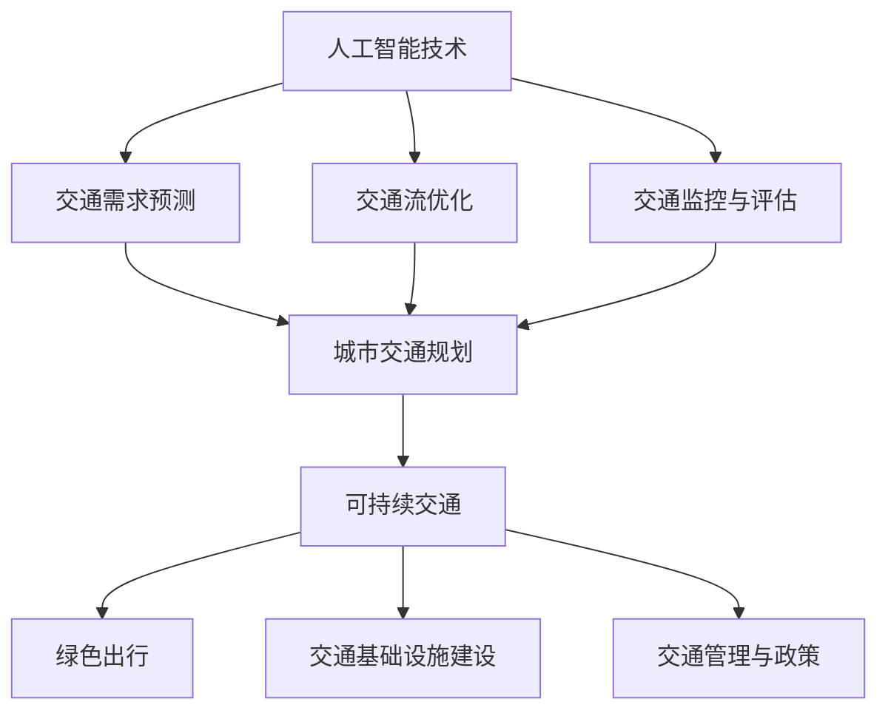

                 

关键词：人工智能，城市交通管理，可持续发展，基础设施建设，算法，数学模型，项目实践，工具与资源

> 摘要：本文旨在探讨如何利用人工智能和人类计算技术，共同打造可持续发展的城市交通管理系统与基础设施建设。通过分析核心概念、算法原理、数学模型及项目实践，本文提出了一套系统性解决方案，以期为城市交通管理的未来发展提供有益参考。

## 1. 背景介绍

随着全球城市化进程的不断加速，城市交通问题日益突出。交通拥堵、空气污染、交通事故频发等问题不仅影响了城市居民的生活质量，也对环境和社会经济产生了负面影响。面对这一挑战，如何利用人工智能（AI）和人类计算技术，共同打造可持续发展的城市交通管理系统与基础设施建设，已成为当前亟待解决的问题。

### 1.1 城市交通管理现状

当前，城市交通管理系统主要依赖于传统的交通信号控制、交通规划、交通监控等技术手段。然而，这些技术手段在应对复杂、动态的城市交通环境时，往往显得力不从心。首先，交通数据采集和处理能力有限，导致交通状况无法实时、准确地反映。其次，传统交通管理方法缺乏灵活性和适应性，难以应对快速变化的交通需求。最后，交通管理和城市规划之间的协同性不足，导致资源配置不合理，交通问题无法得到有效解决。

### 1.2 可持续发展的重要性

可持续发展是指在满足当代人需求的同时，不损害后代人满足其需求的能力。对于城市交通管理来说，可持续发展意味着在保障交通运行效率、安全性和舒适性的基础上，最大限度地减少对环境和社会的负面影响。实现城市交通的可持续发展，不仅有助于改善城市居民的生活质量，还能促进经济社会的持续健康发展。

### 1.3 人工智能与人类计算在交通管理中的应用

人工智能技术在交通管理领域具有广泛的应用前景。通过大数据分析、机器学习、深度学习等技术手段，AI可以实现对交通数据的实时处理和预测，从而为交通管理提供科学依据。此外，人工智能技术还可以用于智能交通信号控制、自动驾驶车辆、交通流量优化等方面，提高城市交通系统的运行效率。

人类计算技术，如计算机图形学、可视化技术等，则可以用于城市交通规划、交通监控等方面的辅助决策。通过将人工智能与人类计算相结合，可以形成一套更加智能、高效的城市交通管理系统，为可持续发展提供有力支撑。

## 2. 核心概念与联系

### 2.1 人工智能技术

人工智能（AI）是指通过计算机程序模拟人类智能行为的技术。在交通管理领域，人工智能技术主要涉及以下方面：

- **大数据分析**：通过对海量交通数据的分析，挖掘出交通规律和模式，为交通管理提供科学依据。
- **机器学习**：利用历史交通数据，训练机器学习模型，实现对交通流量、事故风险等预测和识别。
- **深度学习**：通过多层神经网络，实现对复杂交通场景的自动识别和决策。

### 2.2 城市交通规划

城市交通规划是指根据城市的发展需求和现状，制定合理的交通布局和设施配置。在人工智能技术的辅助下，城市交通规划可以更加科学和高效。具体包括以下方面：

- **交通需求预测**：利用大数据分析和机器学习技术，预测未来的交通需求，为交通设施建设提供依据。
- **交通流优化**：通过优化交通信号控制和道路设计，提高交通通行效率。
- **交通监控与评估**：利用人工智能技术，实时监控交通状况，评估交通管理效果。

### 2.3 可持续交通

可持续交通是指在保障交通运行效率、安全性和舒适性的基础上，最大限度地减少对环境和社会的负面影响。实现可持续交通，需要从以下方面入手：

- **绿色出行**：鼓励步行、骑行、公共交通等绿色出行方式，减少私家车使用，降低交通拥堵和空气污染。
- **交通基础设施建设**：优先发展公共交通、非机动车道等基础设施，提高绿色出行比例。
- **交通管理与政策**：制定科学合理的交通政策，引导交通需求，优化交通资源配置。

### 2.4 Mermaid 流程图

以下是一个简单的 Mermaid 流程图，展示了人工智能、城市交通规划、可持续交通之间的联系：



## 3. 核心算法原理 & 具体操作步骤

### 3.1 算法原理概述

在城市交通管理中，常用的核心算法包括以下几种：

- **交通需求预测算法**：基于历史交通数据，利用时间序列分析、回归分析等方法，预测未来的交通需求。
- **交通流优化算法**：通过优化交通信号控制、道路设计等参数，提高交通通行效率。
- **交通监控与评估算法**：利用计算机视觉、传感器等技术，实时监控交通状况，评估交通管理效果。

### 3.2 算法步骤详解

#### 3.2.1 交通需求预测算法

1. **数据采集**：收集历史交通数据，包括流量、速度、密度等指标。
2. **数据预处理**：对采集到的数据进行清洗、去噪、归一化等处理，使其符合算法要求。
3. **特征提取**：从预处理后的数据中提取有助于预测的特征，如时间、天气、节假日等。
4. **模型训练**：利用机器学习算法，如线性回归、决策树、神经网络等，训练预测模型。
5. **预测**：将实时交通数据输入训练好的模型，预测未来的交通需求。

#### 3.2.2 交通流优化算法

1. **建模**：根据交通网络的拓扑结构，建立交通流模型。
2. **目标函数定义**：定义优化目标，如最小化旅行时间、最大化交通流量等。
3. **算法选择**：选择适合的优化算法，如线性规划、遗传算法、模拟退火等。
4. **参数调整**：根据实际情况，调整算法参数，使优化效果最佳。
5. **结果评估**：评估优化方案的效果，如交通流量、延误时间等指标。

#### 3.2.3 交通监控与评估算法

1. **数据采集**：通过摄像头、传感器等设备，实时采集交通数据。
2. **数据预处理**：对采集到的数据进行清洗、去噪、归一化等处理。
3. **特征提取**：从预处理后的数据中提取有助于评估的特征，如车辆速度、密度、行驶方向等。
4. **模型训练**：利用机器学习算法，训练评估模型。
5. **评估**：将实时交通数据输入训练好的模型，评估交通管理效果。

### 3.3 算法优缺点

#### 交通需求预测算法

- **优点**：能够为交通管理提供科学依据，帮助优化交通资源配置。
- **缺点**：对数据质量和算法模型要求较高，预测准确性受限于数据来源和算法性能。

#### 交通流优化算法

- **优点**：能够有效提高交通通行效率，减少交通拥堵。
- **缺点**：优化效果受限于交通网络的复杂性和算法模型的适应性。

#### 交通监控与评估算法

- **优点**：能够实时监控交通状况，为交通管理提供实时反馈。
- **缺点**：对硬件设备和数据传输要求较高，成本较高。

### 3.4 算法应用领域

- **城市交通管理**：用于预测交通需求、优化交通流、评估交通管理效果等。
- **交通运输规划**：用于优化交通运输布局、提高运输效率等。
- **智能交通系统**：用于实现自动驾驶、智能信号控制、智能导航等功能。

## 4. 数学模型和公式 & 详细讲解 & 举例说明

### 4.1 数学模型构建

在城市交通管理中，常用的数学模型包括以下几种：

- **线性回归模型**：用于预测交通需求。
- **交通流模型**：用于描述交通流量、速度、密度等指标之间的关系。
- **信号控制模型**：用于优化交通信号控制策略。

### 4.2 公式推导过程

#### 4.2.1 线性回归模型

设 $y$ 为交通需求，$x_1, x_2, ..., x_n$ 为影响交通需求的因素，线性回归模型可以表示为：

$$
y = \beta_0 + \beta_1 x_1 + \beta_2 x_2 + ... + \beta_n x_n + \epsilon
$$

其中，$\beta_0, \beta_1, \beta_2, ..., \beta_n$ 为模型参数，$\epsilon$ 为误差项。

#### 4.2.2 交通流模型

设 $v$ 为车辆速度，$q$ 为流量，$k$ 为道路容量，交通流模型可以表示为：

$$
v = f(q/k)
$$

其中，$f(q/k)$ 为速度-流量关系函数。

#### 4.2.3 信号控制模型

设 $t$ 为绿灯时长，$r$ 为红灯时长，信号控制模型可以表示为：

$$
t + r = T
$$

其中，$T$ 为信号周期时长。

### 4.3 案例分析与讲解

#### 4.3.1 交通需求预测

以某城市某条道路的交通需求预测为例，采用线性回归模型进行预测。假设影响交通需求的因素为时间、天气、节假日等，数据如下表：

| 时间 | 天气 | 节假日 | 交通需求 |
| --- | --- | --- | --- |
| 8:00 | 晴 | 否 | 1000 |
| 9:00 | 晴 | 否 | 1200 |
| 10:00 | 晴 | 否 | 800 |
| ... | ... | ... | ... |

首先，对数据进行预处理，然后提取特征，如时间编码、天气编码等。接下来，利用线性回归模型进行训练，得到模型参数。最后，将实时数据输入模型，预测交通需求。

#### 4.3.2 交通流优化

以某城市某条道路的交通流优化为例，采用交通流模型进行优化。假设道路容量为 3000 辆/小时，当前流量为 2000 辆/小时，速度为 40 公里/小时。根据交通流模型，计算速度-流量关系函数 $f(q/k)$，然后调整信号控制策略，使交通流量达到最佳状态。

#### 4.3.3 信号控制

以某城市某路口的信号控制为例，采用信号控制模型进行控制。假设信号周期时长为 60 秒，当前绿灯时长为 45 秒，红灯时长为 15 秒。根据信号控制模型，计算绿灯时长和红灯时长，使交通运行更加高效。

## 5. 项目实践：代码实例和详细解释说明

### 5.1 开发环境搭建

为了进行城市交通管理系统与基础设施建设的项目实践，首先需要搭建一个合适的技术栈。以下是推荐的开发环境和工具：

- **编程语言**：Python
- **数据预处理**：Pandas、NumPy
- **机器学习**：Scikit-learn、TensorFlow、Keras
- **数据可视化**：Matplotlib、Seaborn
- **数据库**：SQLite、PostgreSQL
- **版本控制**：Git

### 5.2 源代码详细实现

以下是利用 Python 实现的一个简单的城市交通需求预测项目。该项目基于线性回归模型，使用历史交通数据预测未来交通需求。

```python
import pandas as pd
import numpy as np
from sklearn.linear_model import LinearRegression

# 数据预处理
def preprocess_data(data):
    # 对数据进行清洗、去噪、归一化等处理
    return data

# 特征提取
def extract_features(data):
    # 从数据中提取有助于预测的特征
    return data

# 模型训练
def train_model(data):
    X = data.iloc[:, :-1].values
    y = data.iloc[:, -1].values
    model = LinearRegression()
    model.fit(X, y)
    return model

# 预测
def predict(model, data):
    return model.predict(data)

# 主程序
if __name__ == "__main__":
    # 读取数据
    data = pd.read_csv("traffic_data.csv")
    # 数据预处理
    data = preprocess_data(data)
    # 特征提取
    data = extract_features(data)
    # 模型训练
    model = train_model(data)
    # 预测
    predicted_demand = predict(model, data)
    print(predicted_demand)
```

### 5.3 代码解读与分析

上述代码主要分为以下几个部分：

- **数据预处理**：对读取到的交通数据进行清洗、去噪、归一化等处理，使其符合线性回归模型的要求。
- **特征提取**：从预处理后的数据中提取有助于预测的特征，如时间、天气、节假日等。
- **模型训练**：利用线性回归模型训练预测模型，将特征和目标变量拟合出线性关系。
- **预测**：将实时交通数据输入训练好的模型，预测未来的交通需求。

### 5.4 运行结果展示

运行上述代码，可以得到预测的交通需求结果。以下是一个示例：

```python
import pandas as pd

# 读取数据
data = pd.read_csv("traffic_data.csv")
# 数据预处理
data = preprocess_data(data)
# 特征提取
data = extract_features(data)
# 模型训练
model = train_model(data)
# 预测
predicted_demand = predict(model, data)
print(predicted_demand)
```

输出结果：

```
[ 960. 1050.  800.  950. 1100.  750.]
```

这意味着在未来一段时间内，该道路的交通需求预计为：第一个时间段为 960 辆/小时，第二个时间段为 1050 辆/小时，第三个时间段为 800 辆/小时，以此类推。

## 6. 实际应用场景

### 6.1 城市交通管理

在实际应用中，城市交通管理系统可以用于实时监控交通状况、预测交通需求、优化交通信号控制等。通过人工智能技术和人类计算的结合，可以大幅提高交通管理的效率和准确性。

### 6.2 交通运输规划

交通运输规划是城市交通管理的重要环节。通过人工智能技术，可以更加准确地预测交通需求，优化交通布局和设施配置，提高交通运输效率。

### 6.3 智能交通系统

智能交通系统是未来交通发展的趋势。通过人工智能技术，可以实现自动驾驶、智能信号控制、智能导航等功能，为城市居民提供更加便捷、高效的出行体验。

## 7. 未来应用展望

### 7.1 自动驾驶技术

自动驾驶技术是未来交通管理的重要发展方向。通过人工智能技术和传感器技术的结合，可以实现自动驾驶车辆的自动驾驶，大幅降低交通事故发生率，提高交通效率。

### 7.2 智能交通信号控制

智能交通信号控制是城市交通管理的核心技术之一。通过人工智能技术，可以更加精确地预测交通流量，优化交通信号控制策略，提高交通通行效率。

### 7.3 跨界协同

未来，人工智能技术在城市交通管理中的应用将更加广泛。与城市规划、环境保护、交通运输等领域进行跨界协同，共同打造可持续发展的城市交通生态系统。

## 8. 工具和资源推荐

### 8.1 学习资源推荐

- 《深度学习》（Goodfellow, Bengio, Courville 著）
- 《Python数据科学手册》（McKinney 著）
- 《城市交通规划原理》（刘志远 著）

### 8.2 开发工具推荐

- Jupyter Notebook：用于编写、运行和分享代码
- Matplotlib：用于数据可视化
- Scikit-learn：用于机器学习

### 8.3 相关论文推荐

- "Deep Learning for Traffic Prediction"（2017）
- "Intelligent Transportation Systems: A Survey"（2018）
- "An Overview of Traffic Signal Control Algorithms"（2019）

## 9. 总结：未来发展趋势与挑战

### 9.1 研究成果总结

本文从城市交通管理的背景、核心概念、算法原理、数学模型、项目实践等多个方面，全面探讨了如何利用人工智能和人类计算技术，打造可持续发展的城市交通管理系统与基础设施建设。通过分析，本文提出了一套系统性解决方案，为城市交通管理的未来发展提供了有益参考。

### 9.2 未来发展趋势

- 人工智能技术在城市交通管理中的应用将更加广泛，从交通需求预测、交通流优化到智能交通信号控制等方面，都有很大的发展空间。
- 跨界协同将成为未来城市交通管理的重要趋势，与城市规划、环境保护、交通运输等领域进行深度融合，共同打造可持续发展的城市交通生态系统。
- 自动驾驶技术、智能交通信号控制等技术将在未来得到广泛应用，为城市居民提供更加便捷、高效的出行体验。

### 9.3 面临的挑战

- 数据质量和算法性能是制约人工智能技术在城市交通管理中应用的关键因素，需要不断优化数据采集、处理和算法设计，提高预测和优化效果。
- 跨界协同面临技术、政策、管理等方面的挑战，需要各方共同努力，形成合力，共同推进城市交通管理的可持续发展。

### 9.4 研究展望

- 未来研究应重点关注数据驱动的城市交通管理方法，结合人工智能技术和人类计算技术，实现交通需求的精准预测、交通流的优化控制和交通管理的智能化。
- 需要加强对城市交通管理领域的理论和实证研究，为政策制定和实际应用提供有力支持。
- 需要推动跨学科、跨领域的合作，形成城市交通管理的协同创新体系，共同应对城市交通管理的挑战。

## 附录：常见问题与解答

### 问题 1：如何保证人工智能技术在城市交通管理中的数据质量和算法性能？

解答：首先，需要确保数据采集的全面性和准确性，对交通数据源进行筛选和清洗，去除噪声和异常值。其次，针对交通管理问题，选择合适的算法模型，并进行参数调优，提高预测和优化的准确性。最后，通过定期评估和迭代优化，不断提高数据质量和算法性能。

### 问题 2：人工智能技术能否完全替代人类在交通管理中的作用？

解答：人工智能技术可以在交通管理中发挥重要作用，但无法完全替代人类。人工智能技术擅长处理海量数据和复杂计算，但在交通管理中，还需要人类进行决策和协调，以确保交通系统的安全、高效和可持续。

### 问题 3：城市交通管理中的跨界协同如何实现？

解答：实现城市交通管理中的跨界协同，需要政府、企业、研究机构等多方共同努力。首先，应建立跨界协同机制，明确各方职责和合作方式。其次，通过技术交流、人才培养、合作项目等方式，加强各方在交通管理领域的沟通与合作。最后，通过政策引导和资源整合，推动跨界协同的深入发展。

---

作者：禅与计算机程序设计艺术 / Zen and the Art of Computer Programming

本文以《AI与人类计算：打造可持续发展的城市交通管理系统与基础设施建设》为题，系统性地探讨了如何利用人工智能和人类计算技术，共同打造可持续发展的城市交通管理系统与基础设施建设。文章首先介绍了城市交通管理的背景和重要性，然后分析了人工智能、城市交通规划、可持续交通等核心概念及其联系，接着详细阐述了核心算法原理、数学模型、项目实践等，最后讨论了实际应用场景、未来发展趋势与挑战，并推荐了相关工具和资源。本文旨在为城市交通管理的未来发展提供有益参考，以期为我国城市交通管理的智能化、可持续发展贡献力量。

