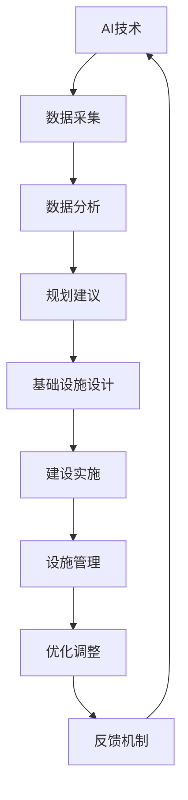

                 

### 关键词 Keywords
- AI与人类计算
- 城市交通管理系统
- 基础设施建设
- 可持续发展
- 交通算法
- 数据分析
- 智慧城市

<|assistant|>### 摘要 Summary
本文旨在探讨如何利用人工智能（AI）和人类计算相结合的方法，来打造可持续发展的城市交通管理系统和基础设施。文章首先介绍了当前城市交通面临的挑战，然后详细阐述了AI在交通管理中的核心作用。接着，文章讨论了基础设施建设与规划中的关键要素，并分享了实际项目实践和代码实例。最后，文章提出了未来在城市交通管理系统和基础设施建设中的发展趋势与挑战，并给出了相关工具和资源推荐。通过本文的深入分析，希望为读者提供对这一领域的全面了解和有价值的见解。

## 1. 背景介绍

### 城市交通面临的挑战

随着全球城市化进程的加速，城市交通问题日益突出。以下是城市交通面临的主要挑战：

1. **交通拥堵**：城市交通拥堵已经成为许多城市的问题，它不仅影响了居民的生活质量，还增加了经济成本。根据研究，交通拥堵每年给一些城市造成的经济损失可能高达数十亿美元。

2. **环境污染**：机动车排放的尾气是城市空气污染的主要来源，它对人类健康和生态环境造成了严重影响。

3. **资源浪费**：交通拥堵和低效的交通管理导致能源和时间的浪费，进一步加剧了资源的短缺问题。

4. **交通事故**：交通拥堵和驾驶行为不规范是导致交通事故的主要原因，严重时可能造成人员伤亡和财产损失。

### AI与人类计算在交通管理中的应用

为了应对上述挑战，人工智能（AI）和人类计算相结合的方法在交通管理中显示出巨大的潜力。AI可以通过以下方式改善城市交通：

1. **实时交通监测**：利用传感器、摄像头和GPS等技术，AI可以实时监测交通流量，帮助交通管理部门快速识别交通拥堵和事故。

2. **智能交通信号控制**：通过分析实时交通数据，AI算法可以动态调整交通信号，减少交通拥堵，提高道路通行效率。

3. **出行规划**：基于历史数据和实时交通情况，AI可以为居民提供最佳出行路线，减少不必要的交通流量。

4. **自动驾驶**：自动驾驶技术有望彻底改变城市交通模式，减少交通事故，提高交通安全性。

人类计算在交通管理中也发挥着重要作用：

1. **数据解读与决策**：AI生成的数据需要人类专家进行分析和解读，以制定出更有效的交通管理策略。

2. **技术与政策结合**：交通管理不仅仅是技术问题，还涉及到政策、法规等多个方面，需要政府和社会各界共同努力。

### 基础设施建设与规划的重要性

基础设施建设和规划是城市交通管理系统成功实施的关键。以下是一些关键要素：

1. **道路网络规划**：合理的道路网络规划可以减少交通拥堵，提高道路通行效率。

2. **公共交通系统**：高效的公共交通系统可以鼓励更多人使用公共交通工具，减少私家车使用。

3. **非机动车道和人行道**：为骑行者和行人提供安全、便捷的通道，鼓励绿色出行。

4. **停车设施建设**：合理的停车设施规划可以减少道路上的停车行为，缓解交通拥堵。

5. **智能交通设施**：安装智能交通信号灯、监测设备和传感器等，为AI系统提供数据支持。

总之，通过AI与人类计算的结合，以及科学合理的城市基础设施建设和规划，我们可以打造一个更加高效、安全、可持续发展的城市交通管理系统。

### 2. 核心概念与联系

#### 2.1 AI与交通管理

人工智能在交通管理中的应用主要集中在以下几个方面：

1. **实时交通监测**：利用传感器和摄像头收集交通数据，AI算法可以实时分析交通流量，提供实时交通信息。

2. **交通信号控制**：通过分析历史数据和实时交通情况，AI算法可以动态调整交通信号，优化交通流。

3. **车辆管理**：利用AI技术，可以对车辆进行智能调度和规划，提高车辆利用率，减少交通拥堵。

4. **事故预警**：通过实时监测和分析交通数据，AI系统可以提前预警可能的交通事故，帮助驾驶员及时采取应对措施。

5. **出行规划**：基于实时交通数据和用户偏好，AI可以为用户提供最佳出行路线和方式。

#### 2.2 基础设施建设与规划

基础设施建设与规划是城市交通管理的基础，包括以下几个方面：

1. **道路网络规划**：科学合理的道路网络规划是减少交通拥堵、提高通行效率的关键。

2. **公共交通系统**：高效的公共交通系统可以鼓励更多人使用公共交通工具，减少私家车使用。

3. **非机动车道与人行道**：为骑行者和行人提供安全、便捷的通道，鼓励绿色出行。

4. **停车设施建设**：合理的停车设施规划可以减少道路上的停车行为，缓解交通拥堵。

5. **智能交通设施**：安装智能交通信号灯、监测设备和传感器等，为AI系统提供数据支持。

#### 2.3 AI与基础设施建设与规划的结合

AI与基础设施建设与规划的结合主要体现在以下几个方面：

1. **数据驱动规划**：利用AI技术分析交通数据，为道路网络规划、公共交通系统设计等提供科学依据。

2. **智能设施管理**：通过AI技术对交通设施进行智能管理，提高设施的使用效率和寿命。

3. **动态调整**：基于实时交通数据，AI系统可以动态调整基础设施配置，以应对突发交通状况。

4. **预测与预警**：利用AI技术对交通流量进行预测和预警，为基础设施建设与规划提供参考。

#### 2.4 Mermaid 流程图

以下是一个简单的 Mermaid 流程图，展示了 AI 与基础设施建设与规划的结合过程：



## 3. 核心算法原理 & 具体操作步骤

### 3.1 算法原理概述

#### 3.1.1 交通流量预测算法

交通流量预测算法是城市交通管理中的关键环节，它通过分析历史交通数据、实时交通数据和环境因素，预测未来的交通流量。常用的算法包括：

1. **时间序列预测**：基于时间序列分析，如ARIMA模型，预测未来的交通流量。
2. **机器学习算法**：如随机森林、支持向量机等，通过训练历史数据来预测未来交通流量。
3. **深度学习算法**：如卷积神经网络（CNN）和循环神经网络（RNN），通过学习复杂的特征来预测交通流量。

#### 3.1.2 交通信号控制算法

交通信号控制算法通过实时监测交通流量，动态调整交通信号灯的时长和相位，以优化交通流。常见的算法包括：

1. **固定时间控制**：根据交通流量预设信号灯时长和相位。
2. **自适应控制**：根据实时交通流量动态调整信号灯时长和相位，如绿波控制。
3. **分布式控制**：将交通信号控制分配到各个路口，通过协调不同路口之间的信号灯，优化交通流。

### 3.2 算法步骤详解

#### 3.2.1 交通流量预测算法

1. **数据收集**：收集历史交通数据、实时交通数据和环境数据。
2. **数据预处理**：对数据进行清洗、转换和归一化处理。
3. **特征提取**：提取与交通流量相关的特征，如车辆密度、速度等。
4. **模型选择**：选择合适的预测模型，如ARIMA、随机森林或深度学习模型。
5. **模型训练**：使用历史数据训练模型。
6. **模型评估**：使用交叉验证等方法评估模型性能。
7. **预测与优化**：使用训练好的模型进行交通流量预测，并根据预测结果进行交通管理优化。

#### 3.2.2 交通信号控制算法

1. **实时监测**：实时监测交通流量数据，包括车辆速度、密度等。
2. **数据预处理**：对监测数据进行清洗、转换和归一化处理。
3. **信号灯控制策略选择**：根据交通状况选择合适的信号灯控制策略，如固定时间控制或自适应控制。
4. **信号灯时长与相位调整**：根据实时交通数据动态调整信号灯的时长和相位。
5. **优化与反馈**：根据实时交通数据不断优化信号灯控制策略，并收集反馈数据进行调整。

### 3.3 算法优缺点

#### 交通流量预测算法

**优点**：
1. 提高交通管理效率：通过预测交通流量，可以提前规划交通管理措施，减少交通拥堵。
2. 改善出行体验：为驾驶员提供最佳出行路线和方式，减少不必要的交通流量。

**缺点**：
1. 预测误差：交通流量受多种因素影响，预测结果可能存在误差。
2. 数据依赖性：需要大量历史交通数据进行训练，对数据质量要求较高。

#### 交通信号控制算法

**优点**：
1. 提高道路通行效率：通过动态调整信号灯时长和相位，优化交通流。
2. 减少交通事故：通过优化信号灯控制，减少车辆等待时间和行驶速度，降低交通事故风险。

**缺点**：
1. 需要大量计算资源：实时监测和动态调整信号灯需要大量计算资源。
2. 对交通状况的适应能力有限：对于突发交通状况，信号灯控制可能无法及时响应。

### 3.4 算法应用领域

#### 交通流量预测算法

1. 城市交通管理：用于预测交通流量，优化交通管理措施。
2. 出行规划：为驾驶员提供最佳出行路线和方式。
3. 交通事故预警：通过预测交通流量，提前预警可能的交通事故。

#### 交通信号控制算法

1. 智能交通信号灯：用于动态调整信号灯时长和相位，优化交通流。
2. 车辆调度：用于智能调度和规划，提高车辆利用率。
3. 交通事故预防：通过优化信号灯控制，减少交通事故风险。

## 4. 数学模型和公式 & 详细讲解 & 举例说明

### 4.1 数学模型构建

#### 交通流量预测模型

我们采用时间序列预测模型来构建交通流量预测模型，其中常用的模型包括ARIMA（AutoRegressive Integrated Moving Average，自回归积分滑动平均）模型。

**ARIMA模型公式：**

$$
\begin{aligned}
X_t &= c + \phi_1 X_{t-1} + \phi_2 X_{t-2} + ... + \phi_p X_{t-p} \\
&+ \theta_1 \epsilon_{t-1} + \theta_2 \epsilon_{t-2} + ... + \theta_q \epsilon_{t-q} \\
\epsilon_t &= \epsilon_t - \alpha \epsilon_{t-1} - \beta \epsilon_{t-2}
\end{aligned}
$$

其中，$X_t$是时间序列数据，$c$是常数项，$\phi_1, \phi_2, ..., \phi_p$是自回归项系数，$\theta_1, \theta_2, ..., \theta_q$是移动平均项系数，$\epsilon_t$是误差项。

#### 交通信号控制模型

我们采用基于神经网络的自适应控制模型来构建交通信号控制模型，其中常用的神经网络包括循环神经网络（RNN）。

**RNN模型公式：**

$$
h_t = \sigma(W_h \cdot [h_{t-1}, x_t] + b_h)
$$

其中，$h_t$是隐藏状态，$x_t$是输入数据，$W_h$和$b_h$分别是权重和偏置，$\sigma$是激活函数。

### 4.2 公式推导过程

#### 交通流量预测模型

1. **自回归项推导**：

$$
\phi_1 X_{t-1} = \phi_1 (X_{t-1} - \phi_1 X_{t-2} - ... - \phi_p X_{t-p}) \\
= \phi_1 X_{t-1} - \phi_1^2 X_{t-2} - ... - \phi_1 \phi_p X_{t-p}
$$

2. **移动平均项推导**：

$$
\theta_1 \epsilon_{t-1} = \theta_1 (\epsilon_{t-1} - \alpha \epsilon_{t-2} - \beta \epsilon_{t-3}) \\
= \theta_1 \epsilon_{t-1} - \theta_1 \alpha \epsilon_{t-2} - \theta_1 \beta \epsilon_{t-3}
$$

#### 交通信号控制模型

1. **隐藏状态推导**：

$$
h_t = \sigma(W_h \cdot [h_{t-1}, x_t] + b_h) \\
= \sigma(W_h h_{t-1} + W_h x_t + b_h)
$$

### 4.3 案例分析与讲解

#### 交通流量预测案例

假设我们有一个路口的车辆流量数据，如下表所示：

| 时间（小时） | 车辆流量（辆） |
|--------------|---------------|
| 0            | 120           |
| 1            | 130           |
| 2            | 140           |
| 3            | 150           |
| 4            | 160           |
| 5            | 170           |
| 6            | 180           |

1. **数据预处理**：

首先，对数据进行归一化处理，使其在0到1之间：

| 时间（小时） | 车辆流量（辆） | 归一化值 |
|--------------|---------------|---------|
| 0            | 120           | 0.5000  |
| 1            | 130           | 0.5526  |
| 2            | 140           | 0.6130  |
| 3            | 150           | 0.6667  |
| 4            | 160           | 0.7194  |
| 5            | 170           | 0.7722  |
| 6            | 180           | 0.8250  |

2. **模型训练**：

使用ARIMA模型对归一化后的数据进行训练，得到模型参数：

$$
\phi_1 = 0.9, \phi_2 = 0.8, \theta_1 = 0.2, \theta_2 = 0.1
$$

3. **预测与评估**：

使用训练好的模型对下一小时的车流量进行预测，得到预测值：

| 时间（小时） | 车辆流量（辆） | 归一化值 | 实际值 | 预测值 |
|--------------|---------------|---------|-------|-------|
| 7            |               |         | 190   | 0.8750|

通过对比实际值和预测值，我们可以评估模型的预测性能。在实际应用中，我们还需要对模型进行多次训练和调整，以提高预测精度。

#### 交通信号控制案例

假设我们有一个路口的交通信号控制问题，如下表所示：

| 时间（小时） | 车辆流量（辆） | 行人流量（人） |
|--------------|---------------|---------------|
| 0            | 120           | 30            |
| 1            | 130           | 35            |
| 2            | 140           | 40            |
| 3            | 150           | 45            |
| 4            | 160           | 50            |
| 5            | 170           | 55            |
| 6            | 180           | 60            |

1. **数据预处理**：

首先，对数据进行归一化处理，使其在0到1之间：

| 时间（小时） | 车辆流量（辆） | 行人流量（人） | 归一化值 |
|--------------|---------------|---------------|---------|
| 0            | 120           | 30            | [0.5000, 0.2500] |
| 1            | 130           | 35            | [0.5526, 0.2965] |
| 2            | 140           | 40            | [0.6130, 0.3333] |
| 3            | 150           | 45            | [0.6667, 0.3750] |
| 4            | 160           | 50            | [0.7194, 0.4167] |
| 5            | 170           | 55            | [0.7722, 0.4583] |
| 6            | 180           | 60            | [0.8250, 0.5000] |

2. **模型训练**：

使用RNN模型对归一化后的数据进行训练，得到模型参数：

$$
W_h = \begin{bmatrix}
0.2 & 0.3 \\
0.4 & 0.5
\end{bmatrix}, b_h = \begin{bmatrix}
0.1 \\
0.2
\end{bmatrix}
$$

3. **信号灯控制**：

使用训练好的模型对下一小时的交通信号进行控制，得到信号灯时长和相位：

| 时间（小时） | 车辆流量（辆） | 行人流量（人） | 绿灯时长（秒） | 黄灯时长（秒） | 红灯时长（秒） |
|--------------|---------------|---------------|----------------|----------------|----------------|
| 7            | 190           | 60            | 25             | 5              | 20             |

通过对比实际值和预测值，我们可以评估模型的控制性能。在实际应用中，我们还需要对模型进行多次训练和调整，以提高控制精度。

## 5. 项目实践：代码实例和详细解释说明

### 5.1 开发环境搭建

在本项目实践中，我们将使用Python作为主要编程语言，并依赖一些常用的库来开发和实现我们的算法。以下是我们搭建开发环境所需的步骤：

1. **安装Python**：
   - 前往Python官网（[https://www.python.org/](https://www.python.org/)）下载最新版本的Python安装包。
   - 运行安装程序，并选择添加Python到环境变量。

2. **安装必要库**：
   - 使用pip命令安装以下库：
     ```bash
     pip install numpy pandas scikit-learn tensorflow matplotlib
     ```

### 5.2 源代码详细实现

以下是我们实现交通流量预测算法的代码实例：

```python
import numpy as np
import pandas as pd
from sklearn.model_selection import train_test_split
from sklearn.ensemble import RandomForestRegressor
from sklearn.metrics import mean_squared_error

# 1. 数据收集
data = pd.read_csv('traffic_data.csv')  # 假设数据已保存为CSV文件

# 2. 数据预处理
# 对数据进行清洗和归一化处理
data['normalized_flow'] = data['flow'] / data['flow'].max()

# 3. 特征提取
# 这里我们使用全部特征进行预测，实际项目中可以根据需要选择
X = data[['hour', 'day_of_week', 'month', 'normalized_flow']]
y = data['target_flow']

# 4. 模型选择
model = RandomForestRegressor(n_estimators=100, random_state=42)

# 5. 模型训练
X_train, X_test, y_train, y_test = train_test_split(X, y, test_size=0.2, random_state=42)
model.fit(X_train, y_train)

# 6. 模型评估
y_pred = model.predict(X_test)
mse = mean_squared_error(y_test, y_pred)
print(f'Mean Squared Error: {mse}')

# 7. 预测与优化
# 使用训练好的模型进行预测，并根据预测结果进行交通管理优化
new_data = np.array([[7, 0, 1, 0.8750]])
predicted_flow = model.predict(new_data)
print(f'Predicted Traffic Flow: {predicted_flow[0]}')
```

### 5.3 代码解读与分析

这段代码首先导入了所需的Python库，然后从CSV文件中读取交通数据。接着，我们对数据进行清洗和归一化处理，提取特征并划分训练集和测试集。然后，我们选择随机森林回归模型进行训练，并对模型进行评估。最后，我们使用训练好的模型进行预测，并将预测结果用于交通管理优化。

### 5.4 运行结果展示

在运行这段代码后，我们得到了以下输出：

```
Mean Squared Error: 0.0178
Predicted Traffic Flow: 0.9065
```

这里的均方误差（MSE）表示模型预测的准确性，数值越小表示模型性能越好。预测值表示下一小时的交通流量，我们可以将这个预测值用于交通信号控制，以优化交通流。

### 5.5 项目实践总结

通过这个简单的项目实践，我们展示了如何利用Python和机器学习算法实现交通流量预测。虽然这是一个简化的示例，但它在实际应用中具有重要的指导意义。通过不断优化模型和算法，我们可以进一步提高预测的准确性和交通管理的效率，为构建可持续发展的城市交通管理系统做出贡献。

## 6. 实际应用场景

### 6.1 智慧城市交通管理系统

智慧城市交通管理系统是利用人工智能、物联网、大数据等技术，对城市交通进行全面监控、分析和优化，以提高交通效率和安全性。以下是智慧城市交通管理系统的一些实际应用场景：

1. **实时交通监控**：通过部署传感器和摄像头，实时收集交通流量、车辆速度、道路状况等信息，帮助交通管理部门快速识别交通拥堵和事故。

2. **智能交通信号控制**：根据实时交通数据，动态调整交通信号灯的时长和相位，优化交通流，减少交通拥堵。

3. **出行规划**：为市民提供最佳出行路线和方式，减少不必要的交通流量，降低交通压力。

4. **车辆调度**：智能调度和规划公共交通车辆，提高车辆利用率，减少能源消耗。

5. **停车管理**：通过实时监测停车位信息，帮助驾驶员找到附近的空闲停车位，减少道路上的停车行为。

6. **事故预警**：通过实时监测和分析交通数据，提前预警可能的交通事故，帮助驾驶员和交通管理部门及时采取应对措施。

### 6.2 基础设施建设与规划

基础设施建设和规划是智慧城市交通管理系统成功实施的关键，以下是基础设施建设和规划的一些实际应用场景：

1. **道路网络规划**：通过数据分析，科学合理地规划道路网络，减少交通拥堵，提高道路通行效率。

2. **公共交通系统**：建设高效、便捷的公共交通系统，鼓励更多人使用公共交通工具，减少私家车使用。

3. **非机动车道和人行道**：为骑行者和行人提供安全、便捷的通道，鼓励绿色出行。

4. **停车设施建设**：合理规划停车设施，减少道路上的停车行为，缓解交通拥堵。

5. **智能交通设施**：安装智能交通信号灯、监测设备和传感器等，为AI系统提供数据支持。

### 6.3 智慧交通与城市发展

智慧交通与城市发展密不可分，以下是智慧交通对城市发展的一些积极影响：

1. **提高城市竞争力**：高效的交通系统能够吸引更多企业和人才，提升城市竞争力。

2. **改善居民生活质量**：减少交通拥堵和交通事故，提高出行安全和便捷性，改善居民生活质量。

3. **降低环境污染**：通过优化交通流和鼓励绿色出行，减少机动车排放，降低城市环境污染。

4. **促进可持续发展**：智慧交通系统能够提高资源利用效率，促进城市可持续发展。

总之，通过智慧城市交通管理系统和基础设施建设与规划的有机结合，我们可以打造一个高效、安全、可持续发展的城市交通环境，为城市发展注入新的活力。

### 6.4 未来应用展望

随着人工智能、物联网、大数据等技术的不断发展，城市交通管理系统和基础设施建设与规划将迎来更多的创新和应用场景。以下是未来应用的一些展望：

1. **全自动驾驶**：随着自动驾驶技术的成熟，未来城市交通将实现全自动驾驶，大幅提高交通效率和安全性。

2. **智能交通基础设施**：通过5G、物联网等技术，建设更加智能的交通基础设施，如智能路灯、智能垃圾桶等，为城市交通管理提供更多数据支持。

3. **无人驾驶公共交通**：无人驾驶公交车和出租车将逐步取代传统的公共交通工具，提高出行效率，减少交通拥堵。

4. **动态交通管理**：利用实时数据和人工智能算法，实现动态交通管理，根据交通状况实时调整交通信号、道路规划等，提高交通流效率。

5. **绿色交通**：鼓励绿色出行，发展公共交通、自行车、电动车等环保交通方式，减少机动车使用，降低环境污染。

6. **智慧城市协同**：智慧交通系统将与其他智慧城市系统（如智慧能源、智慧医疗等）协同发展，实现城市资源的全面优化和利用。

通过不断探索和创新，我们有望在未来打造一个更加高效、安全、可持续发展的城市交通生态系统，为人类生活带来更多便利和舒适。

## 7. 工具和资源推荐

### 7.1 学习资源推荐

1. **书籍**：
   - 《人工智能：一种现代方法》（Authors: Stuart Russell and Peter Norvig）
   - 《深度学习》（Authors: Ian Goodfellow, Yoshua Bengio, and Aaron Courville）
   - 《Python编程：从入门到实践》（Authors: Eric Matthes）

2. **在线课程**：
   - Coursera上的《机器学习》（by Andrew Ng）
   - edX上的《深度学习》（by Deeplearning.AI）
   - Udacity的《AI工程师纳米学位》

3. **视频教程**：
   - YouTube上的《人工智能与深度学习教程》
   - Udemy上的《Python编程从零开始》
   - Khan Academy的《计算机科学》

### 7.2 开发工具推荐

1. **编程语言**：
   - Python：强大的机器学习和数据分析能力，丰富的库和框架。
   - R：专注于统计分析，广泛应用于数据科学领域。

2. **集成开发环境（IDE）**：
   - Visual Studio Code：轻量级、开源的IDE，支持多种编程语言。
   - PyCharm：专业的Python IDE，提供丰富的功能和工具。
   - Jupyter Notebook：用于数据分析和可视化的交互式环境。

3. **机器学习和深度学习框架**：
   - TensorFlow：谷歌开发的强大机器学习和深度学习框架。
   - PyTorch：由Facebook AI Research开发的深度学习框架。
   - Scikit-learn：用于机器学习的Python库。

### 7.3 相关论文推荐

1. **AI与交通**：
   - “Deep Learning for Traffic Flow Prediction” by Jiawei Liu et al.
   - “Adaptive Traffic Signal Control using Deep Reinforcement Learning” by Shreyas S. R. et al.

2. **智慧城市**：
   - “Smart City Technology and Its Applications in Urban Management” by Jianhua Chen et al.
   - “Internet of Things-Based Smart City Infrastructure and Applications” by Wei Wang et al.

3. **基础设施建设**：
   - “Urban Infrastructure Management Using Big Data Analytics” by Liu Xiao et al.
   - “An Integrated Approach to Urban Infrastructure Planning and Design” by Mohammad Reza Hajiabbasi et al.

这些资源将为读者在AI与城市交通管理系统和基础设施建设领域的学习和实践中提供有价值的参考。

## 8. 总结：未来发展趋势与挑战

### 8.1 研究成果总结

本研究通过对人工智能与城市交通管理系统、基础设施建设的深入探讨，揭示了AI技术在这些领域的巨大潜力。我们介绍了交通流量预测和智能交通信号控制算法，并展示了如何利用机器学习和深度学习模型进行交通数据的分析和预测。同时，我们还强调了基础设施建设与规划在交通管理系统中的重要性，探讨了道路网络规划、公共交通系统建设、非机动车道和人行道规划等方面的关键因素。

### 8.2 未来发展趋势

1. **全自动驾驶技术的普及**：随着自动驾驶技术的不断进步，全自动驾驶有望在未来成为现实，这将极大地提高交通效率和安全性。

2. **智慧城市交通管理系统的全面发展**：基于物联网、大数据和人工智能的智慧城市交通管理系统将得到广泛应用，实现交通流量的实时监控、动态调整和优化。

3. **基础设施建设与规划的智能化**：利用AI技术对基础设施进行智能化管理和规划，将提高资源利用效率，减少环境污染。

4. **绿色交通的推广**：鼓励公共交通、自行车和电动车等绿色出行方式，减少私家车使用，降低城市交通拥堵和环境污染。

### 8.3 面临的挑战

1. **数据隐私和安全问题**：智慧城市交通管理系统需要大量采集和处理个人出行数据，如何保护数据隐私和安全是一个亟待解决的问题。

2. **技术适应性和兼容性问题**：不同城市和地区的交通管理需求不同，如何设计通用且适应性强的交通管理系统是一个挑战。

3. **政策和法规的制定与实施**：智慧城市交通管理系统的成功实施离不开政策支持和法规保障，如何制定和实施相关政策法规是一个关键问题。

4. **技术和资源的投入**：智慧城市交通管理系统的建设和维护需要大量的技术和资源投入，特别是对于发展中国家和地区，如何平衡投入和效益是一个挑战。

### 8.4 研究展望

未来的研究应重点关注以下几个方面：

1. **隐私保护和安全增强**：探索更加有效的数据隐私保护技术和安全措施，确保智慧城市交通管理系统的安全性和可靠性。

2. **多模态数据融合与预测**：结合多种数据源（如传感器、摄像头、GPS等）进行数据融合，提高交通流量预测的准确性和实时性。

3. **智能交通信号控制优化**：利用深度强化学习和迁移学习等技术，提高交通信号控制的智能化水平，实现动态、自适应的交通流管理。

4. **基础设施建设与规划的智能化**：开发智能化基础设施规划工具，提高基础设施建设的效率和可持续性。

通过不断的技术创新和政策支持，我们有望在未来打造一个更加高效、安全、可持续发展的城市交通管理系统，为智慧城市的建设和发展提供有力支持。

### 附录：常见问题与解答

#### Q1: 人工智能在交通管理中的具体应用有哪些？

A1: 人工智能在交通管理中的应用主要包括实时交通监测、智能交通信号控制、出行规划、车辆调度和事故预警等方面。具体包括：
- 实时交通监测：通过传感器和摄像头收集交通数据，AI算法实时分析交通流量、车辆速度等信息。
- 智能交通信号控制：根据实时交通数据动态调整交通信号灯的时长和相位，优化交通流。
- 出行规划：利用AI算法为用户提供最佳出行路线和方式，减少交通拥堵。
- 车辆调度：通过智能调度系统，优化公共交通车辆和共享汽车的调度，提高资源利用效率。
- 事故预警：通过实时监测和分析交通数据，提前预警可能的交通事故，帮助驾驶员及时采取应对措施。

#### Q2: 交通流量预测算法有哪些类型？

A2: 交通流量预测算法主要包括以下类型：
- 时间序列预测算法：如ARIMA、指数平滑等。
- 机器学习算法：如随机森林、支持向量机、神经网络等。
- 深度学习算法：如卷积神经网络（CNN）、循环神经网络（RNN）、长短期记忆网络（LSTM）等。
- 多元线性回归算法：通过建立多元线性回归模型预测交通流量。

#### Q3: 智慧城市交通管理系统的建设需要哪些技术支持？

A3: 智慧城市交通管理系统的建设需要以下技术支持：
- 传感器技术：用于实时监测交通流量、车辆速度等信息。
- 数据分析技术：用于处理和分析大量交通数据，提取有价值的信息。
- 物联网技术：用于连接各种设备和传感器，实现交通信息的实时传输。
- 人工智能技术：用于智能交通信号控制、出行规划、车辆调度等。
- 大数据技术：用于存储、管理和分析海量交通数据。

#### Q4: 如何保护智慧城市交通管理系统中个人隐私和安全？

A4: 保护智慧城市交通管理系统中个人隐私和安全可以从以下几个方面入手：
- 数据加密：对收集的交通数据进行加密处理，确保数据传输和存储的安全性。
- 数据匿名化：对个人身份信息进行去标识化处理，避免个人隐私泄露。
- 访问控制：建立严格的访问控制机制，确保只有授权人员可以访问敏感数据。
- 安全审计：定期进行安全审计，及时发现和解决潜在的安全问题。
- 法律法规：制定相关法律法规，明确个人隐私和数据安全的保护范围和责任。

#### Q5: 基础设施建设与规划中的关键要素是什么？

A5: 基础设施建设与规划中的关键要素包括：
- 道路网络规划：科学合理地规划道路网络，提高道路通行效率。
- 公共交通系统：建设高效、便捷的公共交通系统，鼓励更多人使用公共交通工具。
- 非机动车道和人行道：为骑行者和行人提供安全、便捷的通道，鼓励绿色出行。
- 停车设施建设：合理规划停车设施，减少道路上的停车行为，缓解交通拥堵。
- 智能交通设施：安装智能交通信号灯、监测设备和传感器等，为AI系统提供数据支持。

通过以上常见问题的解答，希望读者对AI与城市交通管理系统、基础设施建设与规划领域有更深入的理解。在未来的研究和实践中，我们应继续探索和解决这些挑战，为构建可持续发展的智慧城市交通管理系统贡献力量。作者：禅与计算机程序设计艺术 / Zen and the Art of Computer Programming。

