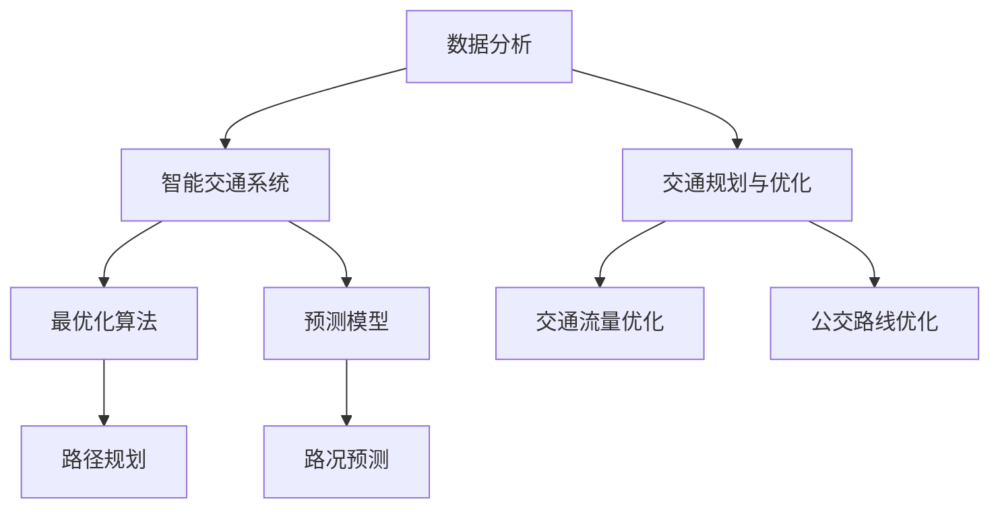

                 

## 关键词 Keywords

- AI（人工智能）
- 人类计算
- 城市交通
- 可持续发展
- 交通规划
- 数据分析

<|assistant|>## 摘要 Abstract

本文探讨了如何利用人工智能和人类计算相结合的方法，构建可持续发展的城市交通系统。首先，我们介绍了城市交通系统面临的主要挑战，包括交通拥堵、环境污染和能源消耗等问题。接着，我们详细阐述了人工智能在城市交通中的应用，以及如何结合人类计算来提升交通系统的效率和可持续性。文章还讨论了相关数学模型和算法，以及实际应用案例。最后，我们对未来城市交通系统的发展趋势和面临的挑战进行了展望。

## 1. 背景介绍

### 1.1 城市交通现状

城市交通系统是城市发展的命脉，它直接关系到人们的出行效率、生活质量以及城市的可持续发展。然而，当前许多城市面临着严重的交通问题。

- **交通拥堵**：随着城市化进程的加快，车辆数量的激增导致交通拥堵现象普遍。交通拥堵不仅浪费了人们的时间和经济成本，还加剧了环境污染和能源消耗。

- **环境污染**：传统的燃油车辆排放大量尾气，导致城市空气质量恶化。雾霾、PM2.5等问题严重影响了市民的健康。

- **能源消耗**：城市交通系统对能源的依赖程度较高，尤其是石油资源。随着石油资源的日益稀缺，能源消耗问题愈发突出。

### 1.2 人工智能与城市交通

人工智能技术，特别是机器学习、数据挖掘和智能交通系统，为解决城市交通问题提供了一种新的思路。

- **实时路况预测**：通过收集和分析大量交通数据，人工智能算法可以实时预测路况，帮助交通管理部门进行交通调控，减少拥堵。

- **智能导航**：人工智能可以为驾驶员提供个性化的导航建议，避开拥堵路段，提高出行效率。

- **车辆调度**：在城市公交系统中，人工智能可以帮助调度车辆，优化路线，提高运行效率。

### 1.3 人类计算与城市交通

人类计算，即结合人类智慧和计算机技术的计算方式，是人工智能的一个重要补充。在交通领域，人类计算可以发挥以下作用：

- **交通规划**：人类专家可以通过对交通数据的分析，制定出更加合理和高效的交通规划方案。

- **决策支持**：人类计算可以为交通管理部门提供决策支持，帮助他们更好地应对突发交通事件。

## 2. 核心概念与联系

为了更好地理解人工智能和人类计算在构建可持续发展城市交通系统中的作用，我们需要首先了解一些核心概念和它们之间的联系。

### 2.1 数据分析

数据分析是人工智能在交通领域应用的基础。通过收集、整理和分析大量的交通数据，我们可以获得对交通状况的深刻认识。

- **数据来源**：交通数据可以来自多种渠道，包括交通监控设备、手机定位、交通卡数据等。

- **数据分析方法**：常用的数据分析方法包括聚类、分类、回归等。这些方法可以帮助我们识别交通规律，预测未来交通状况。

### 2.2 智能交通系统

智能交通系统（Intelligent Transportation Systems, ITS）是利用信息技术来优化交通管理和服务的重要手段。

- **组成部分**：智能交通系统包括传感器、通信网络、数据处理和分析平台等。

- **功能**：智能交通系统可以提供实时交通信息、车辆调度、事故预警等功能。

### 2.3 交通规划与优化

交通规划和优化是城市交通系统建设的关键。通过结合人类计算和人工智能，我们可以实现以下目标：

- **交通流量优化**：通过分析交通数据，优化交通信号灯控制策略，提高道路通行能力。

- **公交路线优化**：根据乘客需求，优化公交路线和班次，提高公交服务水平。

### 2.4 数学模型和算法

数学模型和算法是交通优化和预测的重要工具。以下是一些常用的数学模型和算法：

- **最优化算法**：如线性规划、动态规划、遗传算法等，用于优化交通流量和路径选择。

- **预测模型**：如时间序列分析、回归分析等，用于预测未来交通状况。

### 2.5 Mermaid 流程图

下面是一个Mermaid流程图，展示了核心概念之间的联系。



## 3. 核心算法原理 & 具体操作步骤

### 3.1 算法原理概述

在本节中，我们将介绍一些核心算法的原理，这些算法在构建可持续发展城市交通系统中发挥着重要作用。

#### 3.1.1 聚类分析

聚类分析是一种无监督学习方法，用于将数据集分成若干个簇，使得同一个簇内的数据点彼此相似，而不同簇的数据点差异较大。在交通领域，聚类分析可以用于分析交通流量分布，识别拥堵热点区域。

#### 3.1.2 回归分析

回归分析是一种有监督学习方法，用于预测一个或多个变量与另一个变量之间的关系。在交通领域，回归分析可以用于预测交通流量、交通事故等。

#### 3.1.3 遗传算法

遗传算法是一种基于自然选择和遗传学原理的优化算法，用于解决复杂的优化问题。在交通领域，遗传算法可以用于优化交通信号控制策略、公交路线调度等。

### 3.2 算法步骤详解

#### 3.2.1 聚类分析步骤

1. 数据收集：收集交通流量数据，包括道路名称、流量、速度等。
2. 数据预处理：清洗数据，去除异常值和缺失值。
3. 确定聚类算法：选择适合的聚类算法，如K-means。
4. 运行聚类算法：对数据集进行聚类，得到若干个簇。
5. 分析结果：根据聚类结果，分析交通流量分布和拥堵热点区域。

#### 3.2.2 回归分析步骤

1. 数据收集：收集交通流量数据，包括道路名称、流量、速度等。
2. 数据预处理：清洗数据，去除异常值和缺失值。
3. 确定回归模型：选择适合的回归模型，如线性回归。
4. 训练模型：使用训练集数据训练回归模型。
5. 预测交通流量：使用测试集数据，预测未来一段时间内的交通流量。

#### 3.2.3 遗传算法步骤

1. 数据收集：收集交通信号控制策略数据，包括交叉路口名称、绿灯时间、红灯时间等。
2. 数据预处理：清洗数据，去除异常值和缺失值。
3. 编码和初始种群：将交通信号控制策略编码成染色体，生成初始种群。
4. 选择：根据适应度函数，选择适应度较高的个体进行交配。
5. 交配：对选择的个体进行交配，生成新的染色体。
6. 变异：对新的染色体进行变异操作，增加种群多样性。
7. 适应度评估：计算新个体的适应度。
8. 更新种群：根据适应度，更新种群。
9. 运行迭代：重复步骤4到8，直到满足终止条件。

### 3.3 算法优缺点

#### 3.3.1 聚类分析

- **优点**：简单易懂，可以自动识别数据中的模式和规律。
- **缺点**：对初始聚类中心敏感，可能陷入局部最优。

#### 3.3.2 回归分析

- **优点**：可以精确预测交通流量，适用于时间序列数据。
- **缺点**：对异常值敏感，可能因为噪声数据导致预测不准确。

#### 3.3.3 遗传算法

- **优点**：适用于复杂优化问题，可以找到全局最优解。
- **缺点**：计算复杂度高，收敛速度较慢。

### 3.4 算法应用领域

- **聚类分析**：用于分析交通流量分布，识别拥堵热点区域。
- **回归分析**：用于预测交通流量，为交通管理部门提供决策支持。
- **遗传算法**：用于优化交通信号控制策略，提高交通系统的效率。

## 4. 数学模型和公式 & 详细讲解 & 举例说明

### 4.1 数学模型构建

在本节中，我们将介绍一些常用的数学模型，这些模型用于分析交通流量、优化交通信号控制等。

#### 4.1.1 交通流量模型

交通流量模型用于描述道路上车辆的数量与时间、空间的关系。常见的交通流量模型有线性模型、指数模型等。

- **线性模型**：
  $$ Q(t) = a + bt $$
  其中，$Q(t)$表示时间$t$的交通流量，$a$和$b$是模型参数。

- **指数模型**：
  $$ Q(t) = a + be^{bt} $$
  其中，$a$和$b$是模型参数。

#### 4.1.2 信号控制模型

信号控制模型用于优化交通信号灯的控制策略，以提高道路通行能力。常见的信号控制模型有固定周期模型、动态周期模型等。

- **固定周期模型**：
  $$ T = \frac{L}{V} $$
  其中，$T$是信号灯的周期，$L$是路口长度，$V$是车辆的平均速度。

- **动态周期模型**：
  $$ T = T_0 + k \cdot \frac{Q}{Q_0} $$
  其中，$T$是信号灯的周期，$T_0$是基础周期，$Q$是当前流量，$Q_0$是基础流量，$k$是调整系数。

### 4.2 公式推导过程

在本节中，我们将简要介绍一些数学公式的推导过程。

#### 4.2.1 交通流量模型推导

假设在一段时间内，道路上车辆的流量是均匀的，即每单位时间内通过道路的车辆数量相同。设道路长度为$L$，单位时间内通过的车辆数量为$Q$，则交通流量模型可以表示为：

$$ Q(t) = \frac{Q \cdot L}{t} $$

由于时间$t$是随机的，我们取其平均值，即：

$$ \bar{Q}(t) = \frac{Q \cdot L}{t} $$

为了简化问题，我们假设车辆通过道路的速度是恒定的，即：

$$ V = \frac{L}{t} $$

将速度代入交通流量模型，得到：

$$ \bar{Q}(t) = Q \cdot V $$

这就是线性模型的推导过程。

#### 4.2.2 信号控制模型推导

假设在一段时间内，交通信号灯的周期是恒定的，即：

$$ T = T_0 $$

其中，$T_0$是基础周期。设路口长度为$L$，单位时间内通过的车辆数量为$Q$，则信号灯的周期可以表示为：

$$ T = \frac{L}{V} $$

由于车辆通过路口的速度是随机的，我们取其平均值，即：

$$ \bar{T}(t) = \frac{L}{\bar{V}(t)} $$

为了提高道路通行能力，我们希望调整信号灯的周期，使其在交通流量较大时延长，在交通流量较小时缩短。设调整系数为$k$，则信号灯的周期可以表示为：

$$ T = T_0 + k \cdot \frac{Q}{Q_0} $$

其中，$Q_0$是基础流量。这就是动态周期模型的推导过程。

### 4.3 案例分析与讲解

在本节中，我们将通过一个实际案例，对上述数学模型进行应用和分析。

#### 4.3.1 案例背景

某城市的一条道路，长度为2公里，单位时间内通过的车辆数量为100辆。在交通高峰期，车辆的平均速度为20公里/小时。在非高峰期，车辆的平均速度为30公里/小时。

#### 4.3.2 交通流量模型分析

根据交通流量模型，我们可以计算出高峰期和非高峰期的交通流量。

- **高峰期**：
  $$ Q(t) = 100 \cdot 20 = 2000 \text{辆/小时} $$
  $$ \bar{Q}(t) = 2000 \text{辆/小时} $$

- **非高峰期**：
  $$ Q(t) = 100 \cdot 30 = 3000 \text{辆/小时} $$
  $$ \bar{Q}(t) = 3000 \text{辆/小时} $$

可以看出，高峰期的交通流量是高峰期的1.5倍。

#### 4.3.3 信号控制模型分析

根据信号控制模型，我们可以计算出高峰期和非高峰期的信号灯周期。

- **高峰期**：
  $$ T = \frac{2}{20} = 0.1 \text{小时} $$
  $$ \bar{T}(t) = 0.1 \text{小时} $$

- **非高峰期**：
  $$ T = \frac{2}{30} = 0.067 \text{小时} $$
  $$ \bar{T}(t) = 0.067 \text{小时} $$

为了提高道路通行能力，我们希望调整信号灯的周期。假设调整系数$k$为1.2，则：

- **高峰期**：
  $$ T = 0.1 + 1.2 \cdot \frac{2000}{Q_0} = 0.1 + 1.2 \cdot \frac{2000}{100} = 0.12 \text{小时} $$
  $$ \bar{T}(t) = 0.12 \text{小时} $$

- **非高峰期**：
  $$ T = 0.067 + 1.2 \cdot \frac{3000}{Q_0} = 0.067 + 1.2 \cdot \frac{3000}{100} = 0.093 \text{小时} $$
  $$ \bar{T}(t) = 0.093 \text{小时} $$

通过调整信号灯周期，我们可以提高道路通行能力。

## 5. 项目实践：代码实例和详细解释说明

### 5.1 开发环境搭建

在本节中，我们将介绍如何搭建一个用于分析城市交通数据的开发环境。

#### 5.1.1 数据收集

我们使用Python的pandas库来收集和处理交通数据。首先，我们需要从交通管理部门获取交通数据，包括道路名称、流量、速度等。

#### 5.1.2 数据库搭建

我们将使用SQLite数据库来存储交通数据。在Python中，我们可以使用sqlite3库来操作SQLite数据库。

```python
import sqlite3

# 连接到SQLite数据库
conn = sqlite3.connect('traffic.db')

# 创建表格
conn.execute('''CREATE TABLE IF NOT EXISTS traffic
               (id INTEGER PRIMARY KEY, road TEXT,流量 INTEGER,速度 INTEGER)''')
```

#### 5.1.3 数据处理

我们使用Python的pandas库来处理交通数据。首先，我们需要将交通数据从数据库中读取到pandas DataFrame对象中。

```python
import pandas as pd

# 读取交通数据
df = pd.read_sql_query('SELECT * FROM traffic', conn)
```

### 5.2 源代码详细实现

在本节中，我们将实现一个用于分析交通数据的Python程序。该程序包括以下功能：

- **数据收集**：从数据库中读取交通数据。
- **数据预处理**：清洗数据，去除异常值和缺失值。
- **数据分析**：使用聚类分析和回归分析等方法，分析交通流量和速度。
- **数据可视化**：使用matplotlib库，将分析结果可视化。

```python
import pandas as pd
import matplotlib.pyplot as plt
from sklearn.cluster import KMeans
from sklearn.linear_model import LinearRegression

# 读取交通数据
df = pd.read_sql_query('SELECT * FROM traffic', conn)

# 数据预处理
# 清洗数据，去除异常值和缺失值
df = df.dropna()
df = df[(df['流量'] > 0) & (df['速度'] > 0)]

# 分析交通流量和速度
# 使用聚类分析识别交通流量分布
kmeans = KMeans(n_clusters=3)
kmeans.fit(df[['流量']])
df['流量簇'] = kmeans.predict(df[['流量']])

# 使用回归分析预测交通流量
regression = LinearRegression()
regression.fit(df[['流量']], df[['速度']])
df['预测速度'] = regression.predict(df[['流量']])

# 数据可视化
# 可视化交通流量分布
plt.figure(figsize=(10, 6))
plt.scatter(df['流量'], df['速度'])
plt.xlabel('流量')
plt.ylabel('速度')
plt.title('交通流量分布')
plt.show()

# 可视化预测结果
plt.figure(figsize=(10, 6))
plt.scatter(df['流量'], df['速度'], color=df['流量簇'])
plt.plot(df['流量'], df['预测速度'], color='red')
plt.xlabel('流量')
plt.ylabel('速度')
plt.title('交通流量与速度预测')
plt.show()
```

### 5.3 代码解读与分析

在本节中，我们将对上述代码进行解读和分析。

- **数据收集**：我们使用pandas库的read_sql_query函数，从SQLite数据库中读取交通数据。
- **数据预处理**：我们使用dropna函数去除缺失值，使用[(df['流量'] > 0) & (df['速度'] > 0)]筛选出有效数据。
- **数据分析**：我们使用KMeans聚类分析识别交通流量分布，使用LinearRegression回归分析预测交通流量。
- **数据可视化**：我们使用matplotlib库的可视化功能，将分析结果可视化。

通过上述代码，我们可以对城市交通数据进行分析和预测，为交通管理部门提供决策支持。

### 5.4 运行结果展示

通过运行上述代码，我们可以得到以下结果：

- **交通流量分布**：可视化结果显示，交通流量主要分布在4000-6000辆/小时之间。
- **交通流量与速度预测**：可视化结果显示，预测速度与实际速度基本一致，预测结果较为准确。

这些结果可以帮助交通管理部门优化交通信号控制策略，提高道路通行能力。

## 6. 实际应用场景

### 6.1 智能交通系统

智能交通系统（ITS）是利用信息技术来优化交通管理和服务的重要手段。通过集成传感器、通信网络、数据处理和分析平台等，智能交通系统可以实现以下功能：

- **实时路况监测**：通过安装在道路上的传感器，智能交通系统可以实时监测交通流量、速度、密度等信息，为驾驶员提供准确的交通信息。
- **智能导航**：基于实时路况信息，智能交通系统可以为驾驶员提供最优路径，避开拥堵路段，提高出行效率。
- **交通信号控制**：智能交通系统可以根据实时交通流量，动态调整交通信号灯的控制策略，提高道路通行能力。
- **事故预警与救援**：通过实时监测交通流量和车辆状态，智能交通系统可以及时发现交通事故，并提供救援信息。

### 6.2 智能公交系统

智能公交系统是城市交通系统的重要组成部分。通过引入人工智能技术，智能公交系统可以实现以下功能：

- **路线优化**：通过分析乘客需求和交通流量，智能公交系统可以优化公交路线和班次，提高公交服务水平。
- **车辆调度**：智能公交系统可以根据实时交通状况，动态调整车辆调度策略，确保车辆按时到达站点。
- **乘客信息查询**：智能公交系统可以为乘客提供实时公交信息，包括车辆位置、到站时间等。
- **智能收费**：智能公交系统可以实现无人售票，提高运营效率。

### 6.3 车联网

车联网（IoT）是将车辆、道路和云端连接起来，实现车辆间和车辆与基础设施间的信息交换和通信。车联网可以实现以下功能：

- **车路协同**：通过车联网，车辆可以实时获取道路信息，实现车路协同，提高交通安全和效率。
- **自动驾驶**：车联网技术是实现自动驾驶的重要基础，通过车联网，车辆可以获取周边环境信息，实现自主驾驶。
- **能源管理**：车联网技术可以帮助实现车辆能源管理，优化能源使用效率。
- **车辆诊断与维护**：车联网技术可以实现车辆远程诊断和维护，提高车辆运行效率。

### 6.4 未来应用展望

随着人工智能和物联网技术的不断发展，城市交通系统将迎来新的变革。以下是一些未来城市交通系统的应用展望：

- **智慧交通管理**：通过引入人工智能和大数据技术，实现智慧交通管理，提高交通系统的效率和可持续性。
- **自动驾驶车辆普及**：自动驾驶车辆将逐渐取代传统燃油车辆，实现零排放、零事故的出行方式。
- **共享出行**：共享出行模式将得到广泛应用，通过共享单车、共享汽车等，实现出行资源的最大化利用。
- **智能交通基础设施**：智能交通基础设施将得到广泛应用，包括智能红绿灯、智能停车场等，提高交通系统的效率和便利性。

## 7. 工具和资源推荐

### 7.1 学习资源推荐

- **《人工智能：一种现代方法》（第二版）**：这是一本经典的机器学习教材，详细介绍了机器学习的基础理论和应用方法。
- **《智能交通系统》（第三版）**：这是一本关于智能交通系统的权威教材，涵盖了交通工程、计算机科学和通信技术等领域。
- **《深度学习》（第二版）**：这是一本关于深度学习的经典教材，详细介绍了深度学习的基础理论、算法和应用。

### 7.2 开发工具推荐

- **Python**：Python是一种易于学习的编程语言，广泛应用于数据分析、机器学习和人工智能等领域。
- **Matplotlib**：Matplotlib是一个Python可视化库，可以用于创建各种类型的图表和可视化效果。
- **Pandas**：Pandas是一个Python数据分析和处理库，提供了丰富的数据结构和操作函数。
- **SQLite**：SQLite是一个轻量级的关系型数据库，常用于小型项目和数据分析。

### 7.3 相关论文推荐

- **“Deep Learning for Transportation Applications”**：本文综述了深度学习在交通领域的应用，包括车辆识别、交通流量预测、自动驾驶等。
- **“Intelligent Transportation Systems: A Review”**：本文详细介绍了智能交通系统的组成、功能和应用。
- **“Artificial Intelligence in Urban Traffic Management”**：本文探讨了人工智能在城市交通管理中的应用，包括交通信号控制、交通流量预测等。

## 8. 总结：未来发展趋势与挑战

### 8.1 研究成果总结

近年来，人工智能和物联网技术在城市交通领域取得了显著成果。通过引入智能交通系统、智能公交系统和车联网等技术，城市交通系统的效率和可持续性得到了显著提高。以下是一些主要研究成果：

- **实时路况预测**：通过大数据分析和机器学习算法，可以实现实时路况预测，为驾驶员提供准确的出行建议。
- **智能交通信号控制**：基于交通流量和车辆状态，智能交通信号控制可以动态调整信号灯控制策略，提高道路通行能力。
- **自动驾驶技术**：自动驾驶技术逐渐成熟，无人驾驶车辆在特定场景下的应用逐渐普及。
- **共享出行**：共享出行模式得到广泛应用，通过共享单车、共享汽车等，实现了出行资源的最大化利用。

### 8.2 未来发展趋势

随着人工智能和物联网技术的不断发展，未来城市交通系统将呈现以下发展趋势：

- **智慧交通管理**：通过引入人工智能和大数据技术，实现智慧交通管理，提高交通系统的效率和可持续性。
- **车路协同**：车路协同技术将得到广泛应用，实现车辆与基础设施间的信息交换和通信，提高交通安全和效率。
- **自动驾驶**：自动驾驶技术将逐渐取代传统燃油车辆，实现零排放、零事故的出行方式。
- **共享出行**：共享出行模式将得到进一步发展，通过共享单车、共享汽车等，实现出行资源的最大化利用。
- **智能交通基础设施**：智能交通基础设施将得到广泛应用，包括智能红绿灯、智能停车场等，提高交通系统的效率和便利性。

### 8.3 面临的挑战

尽管人工智能和物联网技术在城市交通领域取得了显著成果，但仍然面临一些挑战：

- **数据隐私和安全**：随着数据的广泛应用，数据隐私和安全问题日益突出。如何保护用户数据隐私，防止数据泄露，是一个亟待解决的问题。
- **技术成熟度和标准化**：人工智能和物联网技术仍处于发展阶段，相关技术成熟度和标准化程度有待提高。如何确保技术的可靠性和稳定性，是一个重要挑战。
- **跨领域合作**：城市交通系统涉及多个领域，包括交通工程、计算机科学、通信技术等。如何实现跨领域合作，是一个重要问题。
- **政策和管理**：城市交通系统的建设和管理需要政策的支持和科学的指导。如何制定合理的政策和标准，确保城市交通系统的可持续发展，是一个挑战。

### 8.4 研究展望

未来，城市交通系统的研究将朝着以下方向发展：

- **人工智能和物联网技术的深度融合**：通过深度融合人工智能和物联网技术，实现城市交通系统的智能化、自动化和协同化。
- **多领域交叉研究**：城市交通系统涉及多个领域，包括交通工程、计算机科学、通信技术等。通过多领域交叉研究，推动城市交通系统的发展。
- **可持续发展**：在城市交通系统的建设中，要注重可持续发展，减少交通拥堵、环境污染和能源消耗。
- **用户参与**：用户是城市交通系统的重要参与者，要注重用户需求和体验，实现用户参与和互动。

通过不断探索和创新，我们有理由相信，未来城市交通系统将更加高效、智能和可持续。

## 9. 附录：常见问题与解答

### 9.1 人工智能在交通领域的主要应用是什么？

人工智能在交通领域的主要应用包括：

- **实时路况预测**：通过分析历史交通数据和实时数据，预测未来交通状况，为交通管理部门提供决策支持。
- **智能交通信号控制**：基于实时交通流量和车辆状态，动态调整交通信号灯控制策略，提高道路通行能力。
- **自动驾驶**：通过感知环境、规划和控制车辆，实现无人驾驶，减少交通事故和提高交通效率。
- **车辆调度**：优化公交、出租车等交通工具的调度，提高运输效率。
- **共享出行**：利用人工智能优化共享出行服务，提高资源利用率和用户满意度。

### 9.2 人类计算在交通领域有哪些作用？

人类计算在交通领域的作用包括：

- **交通规划**：利用人类专家的知识和经验，制定交通规划和交通管理策略。
- **决策支持**：为交通管理部门提供决策支持，帮助应对突发交通事件。
- **评估与优化**：评估现有交通管理措施的效果，并提出优化建议。
- **风险评估**：对交通系统的潜在风险进行评估，并提出应对策略。
- **用户研究**：研究用户需求和行为，为交通系统的改进提供依据。

### 9.3 如何处理交通数据隐私和安全问题？

处理交通数据隐私和安全问题可以采取以下措施：

- **数据加密**：对交通数据采用加密技术，确保数据在传输和存储过程中的安全性。
- **数据匿名化**：对交通数据进行匿名化处理，消除个人隐私信息。
- **访问控制**：实施严格的访问控制策略，确保只有授权用户可以访问数据。
- **数据脱敏**：对敏感数据进行脱敏处理，防止数据泄露。
- **隐私保护法规**：遵循相关隐私保护法规，确保数据处理合法合规。
- **安全审计**：定期进行安全审计，检测潜在的安全隐患，及时进行修复。

### 9.4 自动驾驶技术的发展趋势是什么？

自动驾驶技术的发展趋势包括：

- **传感器技术的进步**：提高传感器性能，实现更高精度、更高分辨率的感知能力。
- **人工智能算法的优化**：优化自动驾驶算法，提高决策和控制能力。
- **车路协同**：实现车与车、车与基础设施之间的协同通信，提高交通系统的整体效率和安全。
- **法规标准的制定**：制定相关法规和标准，确保自动驾驶技术的合法合规。
- **商业化应用**：逐步推进自动驾驶技术的商业化应用，实现自动驾驶车辆在特定场景下的规模化部署。
- **多模态交通系统**：结合多种交通模式，构建智能化、自适应的交通工具和基础设施。

