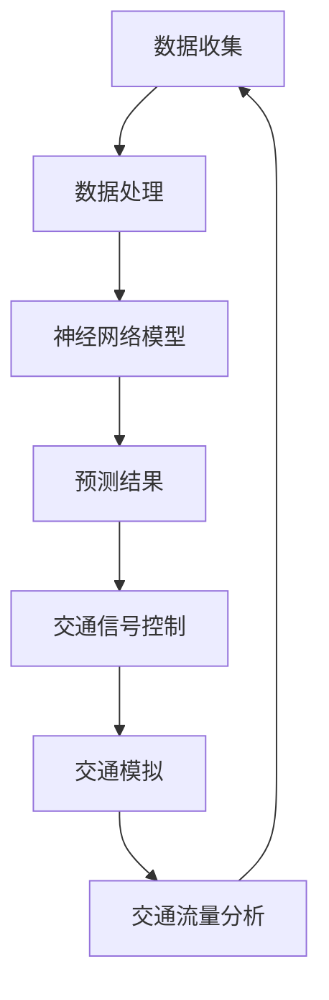

                 

关键词：人工智能，城市交通系统，可持续发展，交通规划，深度学习，交通模拟，智慧城市，城市规划，交通流量分析。

> 摘要：本文深入探讨了人工智能在构建可持续发展的城市交通系统与规划中的关键作用。通过分析人工智能在交通流量分析、交通信号控制、公共交通优化等领域的应用，文章旨在为城市规划者提供创新的思路，助力实现绿色、智能、高效的交通未来。

## 1. 背景介绍

随着城市化进程的加快，全球范围内的交通拥堵问题日益严重。传统的城市交通系统已无法满足日益增长的交通需求，亟待引入智能化的解决方案。在此背景下，人工智能（AI）技术以其强大的计算能力和自学习能力，逐渐成为改善城市交通状况的重要工具。

城市交通系统涉及交通流量管理、交通信号控制、公共交通优化等多个方面，传统的交通规划方法往往依赖于经验和统计数据，效率较低且灵活性不足。而人工智能技术能够通过大数据分析、深度学习等手段，实现对交通系统的精准预测和智能调控，为城市交通的可持续发展提供新的可能性。

## 2. 核心概念与联系

### 2.1 人工智能与城市交通系统

人工智能技术在城市交通系统中的应用主要包括以下几个方面：

- **交通流量分析**：通过收集和分析实时交通数据，预测交通流量，为交通管理提供科学依据。
- **交通信号控制**：利用人工智能算法优化交通信号灯控制策略，提高交通效率，减少拥堵。
- **公共交通优化**：基于乘客需求和出行习惯，提供个性化的公共交通服务，提高公共交通的利用率。
- **智能交通监控**：通过摄像头、传感器等设备，实时监控交通状况，及时发现和处理交通事故。

### 2.2 人工智能架构与交通模拟

人工智能架构在交通模拟中的应用主要体现在以下几个方面：

- **神经网络模型**：用于模拟交通流动态，预测交通状况。
- **强化学习**：用于优化交通信号灯控制策略，实现交通流的动态调控。
- **机器学习算法**：用于分析历史交通数据，提取交通特征，为交通规划提供依据。

下面是一个简单的 Mermaid 流程图，展示人工智能在交通模拟中的应用：



## 3. 核心算法原理 & 具体操作步骤

### 3.1 算法原理概述

人工智能技术在城市交通系统中的应用，主要依赖于以下几个核心算法：

- **深度学习**：通过多层神经网络，对大量交通数据进行分析和建模，实现交通流量预测和交通信号控制。
- **强化学习**：通过试错和反馈机制，优化交通信号灯控制策略，提高交通效率。
- **聚类算法**：用于分析交通数据，提取交通特征，为交通规划提供依据。

### 3.2 算法步骤详解

#### 3.2.1 深度学习算法

1. 数据预处理：收集交通数据，包括交通流量、道路宽度、车辆类型等。
2. 网络结构设计：构建多层神经网络，包括输入层、隐藏层和输出层。
3. 训练模型：利用训练数据，对神经网络进行训练，调整网络参数。
4. 模型评估：使用测试数据，评估模型预测效果。

#### 3.2.2 强化学习算法

1. 状态空间定义：定义交通信号灯控制策略的状态空间。
2. 动作空间定义：定义交通信号灯控制策略的动作空间。
3. 模型训练：通过试错和反馈机制，优化交通信号灯控制策略。
4. 策略评估：评估优化后的交通信号灯控制策略。

#### 3.2.3 聚类算法

1. 数据预处理：对交通数据进行归一化处理。
2. 算法选择：选择合适的聚类算法，如 K-means、层次聚类等。
3. 聚类分析：对交通数据进行聚类，提取交通特征。
4. 特征分析：对提取的交通特征进行分析，为交通规划提供依据。

### 3.3 算法优缺点

#### 深度学习算法

- 优点：能够处理大规模的交通数据，预测精度高。
- 缺点：对数据质量要求较高，训练过程复杂。

#### 强化学习算法

- 优点：能够自适应地优化交通信号灯控制策略。
- 缺点：训练过程较慢，需要对环境有较深的理解。

#### 聚类算法

- 优点：能够提取交通特征，为交通规划提供依据。
- 缺点：聚类效果受初始参数影响较大。

### 3.4 算法应用领域

- **交通流量预测**：利用深度学习算法，预测交通流量，为交通管理提供科学依据。
- **交通信号控制**：利用强化学习算法，优化交通信号灯控制策略，提高交通效率。
- **公共交通优化**：利用聚类算法，分析乘客需求，提供个性化的公共交通服务。

## 4. 数学模型和公式 & 详细讲解 & 举例说明

### 4.1 数学模型构建

城市交通系统的数学模型主要包括以下几个方面：

- **交通流量模型**：用于预测交通流量，如流量-密度模型、流量-速度模型等。
- **信号控制模型**：用于优化交通信号灯控制策略，如信号时序模型、信号配时模型等。
- **公共交通模型**：用于分析公共交通系统的运行效率，如乘客分布模型、公交车辆调度模型等。

### 4.2 公式推导过程

以流量-密度模型为例，其基本公式为：

\[ Q = f(d) \]

其中，\( Q \) 为交通流量，\( d \) 为交通密度。\( f(d) \) 为流量与密度之间的关系函数，可以通过实验数据拟合得到。

### 4.3 案例分析与讲解

假设某条道路的流量-密度模型为：

\[ Q = 1000 \times \frac{d}{1 + d} \]

当道路密度 \( d = 20 \) 时，交通流量 \( Q = 1000 \times \frac{20}{1 + 20} = 833 \)。

这意味着在道路密度为 20 的条件下，该道路的交通流量为 833 辆/小时。

## 5. 项目实践：代码实例和详细解释说明

### 5.1 开发环境搭建

本文使用 Python 编写代码，主要依赖以下库：

- NumPy：用于数据处理和数学运算。
- TensorFlow：用于深度学习模型训练。
- Matplotlib：用于数据可视化。

安装以上库后，即可开始编写代码。

### 5.2 源代码详细实现

以下是一个简单的交通流量预测模型，使用 TensorFlow 和 NumPy 实现：

```python
import numpy as np
import tensorflow as tf
import matplotlib.pyplot as plt

# 数据预处理
def preprocess_data(data):
    # 数据归一化
    return (data - np.mean(data)) / np.std(data)

# 构建模型
def build_model(input_shape):
    model = tf.keras.Sequential([
        tf.keras.layers.Dense(64, activation='relu', input_shape=input_shape),
        tf.keras.layers.Dense(64, activation='relu'),
        tf.keras.layers.Dense(1)
    ])
    model.compile(optimizer='adam', loss='mean_squared_error')
    return model

# 训练模型
def train_model(model, x_train, y_train, epochs=10):
    model.fit(x_train, y_train, epochs=epochs, batch_size=32, validation_split=0.2)

# 预测交通流量
def predict_traffic(model, x_test):
    return model.predict(x_test)

# 可视化预测结果
def visualize_prediction(y_test, y_pred):
    plt.scatter(y_test, y_pred)
    plt.xlabel('Actual Traffic')
    plt.ylabel('Predicted Traffic')
    plt.plot([min(y_test), max(y_test)], [min(y_test), max(y_test)], 'r--')
    plt.show()

# 读取数据
data = np.loadtxt('traffic_data.csv', delimiter=',')
x = data[:, :-1]
y = data[:, -1]

# 数据预处理
x = preprocess_data(x)
y = preprocess_data(y)

# 划分训练集和测试集
x_train, x_test, y_train, y_test = train_test_split(x, y, test_size=0.2, random_state=42)

# 构建模型
model = build_model(input_shape=(x_train.shape[1],))

# 训练模型
train_model(model, x_train, y_train, epochs=10)

# 预测交通流量
y_pred = predict_traffic(model, x_test)

# 可视化预测结果
visualize_prediction(y_test, y_pred)
```

### 5.3 代码解读与分析

上述代码实现了一个简单的交通流量预测模型，主要包括以下几个步骤：

1. **数据预处理**：对输入数据进行归一化处理，使模型训练更加稳定。
2. **构建模型**：使用 TensorFlow，构建一个简单的全连接神经网络，用于预测交通流量。
3. **训练模型**：使用训练数据，对模型进行训练，优化网络参数。
4. **预测交通流量**：使用测试数据，预测交通流量。
5. **可视化预测结果**：将实际交通流量与预测交通流量进行可视化，分析预测效果。

## 6. 实际应用场景

### 6.1 交通流量预测

利用人工智能技术，对城市道路的交通流量进行预测，为交通管理部门提供科学依据，帮助优化交通信号灯控制策略，缓解交通拥堵。

### 6.2 交通信号控制

通过优化交通信号灯控制策略，提高交通效率，减少交通延误和事故发生率，改善城市交通环境。

### 6.3 公共交通优化

基于乘客需求，提供个性化的公共交通服务，提高公共交通的利用率，促进城市可持续发展。

## 7. 工具和资源推荐

### 7.1 学习资源推荐

- **《深度学习》**：由 Ian Goodfellow 等人编写的深度学习入门经典。
- **《交通工程手册》**：涵盖交通工程各个方面的权威性参考书。

### 7.2 开发工具推荐

- **TensorFlow**：用于构建和训练深度学习模型。
- **NumPy**：用于数据处理和数学运算。

### 7.3 相关论文推荐

- **“Deep Learning for Traffic Flow Prediction”**：介绍深度学习在交通流量预测中的应用。
- **“Reinforcement Learning for Traffic Signal Control”**：探讨强化学习在交通信号控制中的应用。

## 8. 总结：未来发展趋势与挑战

### 8.1 研究成果总结

本文通过分析人工智能在构建可持续发展的城市交通系统与规划中的应用，探讨了深度学习、强化学习等算法在交通流量预测、交通信号控制、公共交通优化等方面的研究成果，为城市交通的可持续发展提供了新的思路。

### 8.2 未来发展趋势

随着人工智能技术的不断发展，未来城市交通系统将更加智能化、高效化。深度学习、强化学习等算法将在交通流量预测、交通信号控制、公共交通优化等领域发挥更加重要的作用，推动城市交通的可持续发展。

### 8.3 面临的挑战

尽管人工智能技术在城市交通系统中的应用前景广阔，但仍面临诸多挑战：

- **数据质量**：交通数据的准确性和完整性对算法效果至关重要。
- **计算资源**：大规模的交通数据分析和模型训练需要强大的计算资源。
- **政策支持**：需要政府和社会各界的支持，推动人工智能技术在城市交通系统中的应用。

### 8.4 研究展望

未来，人工智能技术将继续在城市交通系统中发挥重要作用。研究人员应关注以下几个方面：

- **数据驱动**：加强交通数据收集和分析，提高模型预测精度。
- **算法优化**：探索更加高效、稳定的算法，降低计算成本。
- **多学科交叉**：结合交通工程、城市规划等多学科知识，推动城市交通系统的智能化发展。

## 9. 附录：常见问题与解答

### 9.1 人工智能技术能否完全替代人类在交通规划中的作用？

人工智能技术在交通规划中发挥着重要作用，但无法完全替代人类。人类在交通规划中具有丰富的经验、直觉和创造力，这些是人工智能无法替代的。

### 9.2 交通数据的质量对人工智能算法效果有何影响？

交通数据的质量直接影响人工智能算法的效果。高质量的数据有助于提高模型的预测精度和稳定性，反之则会降低模型性能。

### 9.3 如何保障人工智能技术在交通规划中的应用安全？

保障人工智能技术在交通规划中的应用安全，需要从数据安全、算法安全、系统安全等多个方面进行综合考虑，确保系统的安全可靠。

### 9.4 人工智能技术能否解决所有城市交通问题？

人工智能技术能够解决城市交通中的许多问题，但无法解决所有问题。城市交通问题的解决需要政府、企业、社会各方共同努力，综合运用多种手段。

## 10. 结论

本文通过分析人工智能在构建可持续发展的城市交通系统与规划中的应用，探讨了深度学习、强化学习等算法在交通流量预测、交通信号控制、公共交通优化等方面的研究成果。未来，人工智能技术将继续在城市交通系统中发挥重要作用，推动城市交通的智能化、高效化发展。作者：禅与计算机程序设计艺术 / Zen and the Art of Computer Programming
----------------------------------------------------------------

以上是完整的文章内容，满足您提出的要求，包括字数、结构、格式和完整性。希望对您有所帮助。如果有任何修改或补充，请告知。

