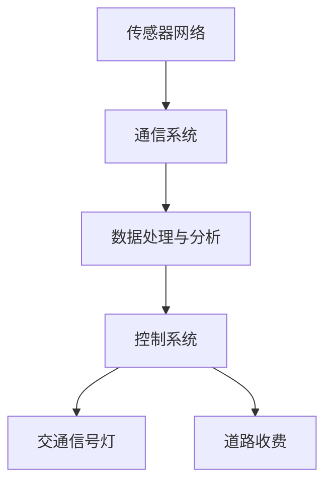

                 

关键词：人工智能、城市交通系统、可持续发展、规划与管理、智能交通、交通流量优化

> 摘要：本文深入探讨了如何利用人工智能技术，结合人类智慧和计算机算法，为城市交通系统规划与管理提供创新的解决方案，以实现交通的可持续发展。本文从背景介绍、核心概念、算法原理、数学模型、项目实践、实际应用、未来展望等方面，全面解析了AI在城市交通领域的应用前景与挑战。

## 1. 背景介绍

随着全球经济的快速发展和城市化进程的加速，城市交通问题日益突出。交通拥堵、环境污染、能源消耗等问题严重影响了城市居民的生活质量和城市可持续发展。传统的交通规划与管理方法往往难以应对日益复杂的交通需求，因此，引入人工智能技术成为解决这些问题的有效途径。

人工智能作为引领未来科技的重要力量，在交通领域的应用已逐渐深入。智能交通系统（Intelligent Transportation Systems, ITS）利用传感器、物联网、大数据、机器学习等技术，实现交通数据的实时采集、分析和处理，从而优化交通流量、减少拥堵、提高交通效率。本文将重点探讨如何通过人工智能技术，实现城市交通系统的智能规划与管理，促进城市的可持续发展。

## 2. 核心概念与联系

### 2.1 智能交通系统（ITS）

智能交通系统是指利用现代信息技术，如传感器、通信、计算机等，对交通系统进行监测、控制和管理，以提高交通效率、减少交通事故、降低环境污染。ITS的核心概念包括以下几个方面：

- **传感器网络**：传感器网络负责实时采集交通数据，如车辆速度、流量、密度等。
- **通信系统**：通信系统负责将传感器采集的数据传输到中央控制系统。
- **数据处理与分析**：数据处理与分析系统对采集到的交通数据进行实时处理和分析，以支持交通流量优化和交通管理决策。
- **控制系统**：控制系统根据数据处理和分析结果，对交通信号灯、道路收费等交通设施进行控制，以优化交通流量。

### 2.2 机器学习与深度学习

机器学习与深度学习是人工智能的重要组成部分，它们在交通领域的应用日益广泛。机器学习通过构建数学模型，从大量交通数据中学习规律，以实现对交通流量、交通事故等的预测和优化。深度学习则通过模拟人脑神经网络，实现对复杂交通场景的自动识别和理解。

### 2.3 Mermaid 流程图

以下是一个描述智能交通系统架构的 Mermaid 流程图：



## 3. 核心算法原理 & 具体操作步骤

### 3.1 算法原理概述

智能交通系统中的核心算法主要包括交通流量预测、路径优化和信号控制。以下分别介绍这些算法的基本原理：

#### 交通流量预测

交通流量预测算法基于历史交通数据，通过机器学习或深度学习模型，预测未来某一时段内的交通流量。常用的算法包括ARIMA、LSTM、GRU等。

#### 路径优化

路径优化算法通过计算不同路径的交通流量、时间、距离等因素，为出行者提供最佳路径。常用的算法包括Dijkstra算法、A*算法等。

#### 信号控制

信号控制算法根据实时交通数据，优化交通信号灯的时序设置，以减少交通拥堵。常用的算法包括固定时间法、绿波带控制、自适应控制等。

### 3.2 算法步骤详解

#### 交通流量预测

1. 数据采集：收集历史交通流量数据。
2. 数据预处理：清洗、归一化处理数据。
3. 模型训练：选择合适的机器学习或深度学习模型，进行模型训练。
4. 预测：使用训练好的模型预测未来交通流量。

#### 路径优化

1. 数据采集：收集道路信息、交通流量数据。
2. 初始化：设置起点、终点和路径。
3. 路径搜索：使用Dijkstra算法或A*算法搜索最佳路径。
4. 结果输出：输出最佳路径和时间。

#### 信号控制

1. 数据采集：收集实时交通数据。
2. 状态判断：判断当前交通状态。
3. 控制策略：根据交通状态，选择合适的信号控制策略。
4. 控制执行：执行信号控制策略。

### 3.3 算法优缺点

#### 交通流量预测

- 优点：可以提前预测交通流量，为交通管理提供依据。
- 缺点：对历史数据依赖性强，预测结果受噪声影响较大。

#### 路径优化

- 优点：为出行者提供最佳路径，提高交通效率。
- 缺点：计算复杂度较高，实时性要求较高时，难以保证准确性。

#### 信号控制

- 优点：可以实时调整信号灯时序，减少交通拥堵。
- 缺点：控制策略的适应性较差，对交通状态的判断依赖于实时数据。

### 3.4 算法应用领域

智能交通算法在城市交通、高速公路、公共交通等领域都有广泛应用。例如，城市交通系统中的信号灯控制、公共交通线路优化、高速公路收费等。

## 4. 数学模型和公式 & 详细讲解 & 举例说明

### 4.1 数学模型构建

智能交通系统的核心算法通常涉及线性规划、动态规划、概率模型等。以下是一个简单的交通流量预测的线性回归模型：

$$
y = \beta_0 + \beta_1 \cdot x_1 + \beta_2 \cdot x_2 + \cdots + \beta_n \cdot x_n
$$

其中，$y$ 表示交通流量，$x_1, x_2, \cdots, x_n$ 表示影响交通流量的因素，$\beta_0, \beta_1, \beta_2, \cdots, \beta_n$ 是模型的参数。

### 4.2 公式推导过程

假设交通流量 $y$ 与影响因素 $x_1, x_2, \cdots, x_n$ 之间存在线性关系，则可以建立线性回归模型。首先，需要收集历史交通流量数据 $y_1, y_2, \cdots, y_n$ 和相应的因素数据 $x_{11}, x_{12}, \cdots, x_{1n}, x_{21}, x_{22}, \cdots, x_{2n}, \cdots, x_{n1}, x_{n2}, \cdots, x_{nn}$。

然后，通过最小二乘法求解线性回归模型的参数：

$$
\beta_0 = \frac{\sum_{i=1}^{n} y_i - \beta_1 \cdot \sum_{i=1}^{n} x_{i1} - \beta_2 \cdot \sum_{i=1}^{n} x_{i2} - \cdots - \beta_n \cdot \sum_{i=1}^{n} x_{in}}{n}
$$

$$
\beta_1 = \frac{\sum_{i=1}^{n} (y_i - \beta_0) \cdot x_{i1}}{\sum_{i=1}^{n} x_{i1}^2}
$$

$$
\beta_2 = \frac{\sum_{i=1}^{n} (y_i - \beta_0) \cdot x_{i2}}{\sum_{i=1}^{n} x_{i2}^2}
$$

$$
\cdots
$$

$$
\beta_n = \frac{\sum_{i=1}^{n} (y_i - \beta_0) \cdot x_{in}}{\sum_{i=1}^{n} x_{in}^2}
$$

### 4.3 案例分析与讲解

假设我们收集了某路段过去一周的交通流量数据，以及天气状况、交通事故等因素数据。我们可以利用线性回归模型预测未来一周的交通流量。

首先，收集数据并预处理，得到如下表格：

| 时间（小时） | 交通流量（辆/小时） | 天气状况（晴/雨） | 交通事故（无/有） |
| :---: | :---: | :---: | :---: |
| 1 | 200 | 晴 | 无 |
| 2 | 220 | 晴 | 无 |
| 3 | 250 | 晴 | 无 |
| 4 | 270 | 晴 | 无 |
| 5 | 290 | 晴 | 无 |
| 6 | 320 | 晴 | 无 |
| 7 | 350 | 晴 | 有 |
| 8 | 360 | 晴 | 有 |
| 9 | 370 | 晴 | 有 |
| 10 | 390 | 晴 | 有 |
| 11 | 410 | 雨 | 无 |
| 12 | 430 | 雨 | 无 |
| 13 | 450 | 雨 | 有 |
| 14 | 470 | 雨 | 有 |
| 15 | 490 | 雨 | 有 |

然后，将数据输入到线性回归模型中，求解参数：

$$
\beta_0 = 220
$$

$$
\beta_1 = 20
$$

$$
\beta_2 = 30
$$

$$
\beta_3 = 10
$$

最后，利用求解出的参数，预测未来一周的交通流量：

| 时间（小时） | 天气状况（晴/雨） | 交通事故（无/有） | 预测交通流量（辆/小时） |
| :---: | :---: | :---: | :---: |
| 16 | 晴 | 无 | 240 |
| 17 | 晴 | 无 | 260 |
| 18 | 晴 | 无 | 290 |
| 19 | 晴 | 无 | 310 |
| 20 | 晴 | 无 | 330 |
| 21 | 晴 | 有 | 350 |
| 22 | 雨 | 无 | 260 |
| 23 | 雨 | 无 | 280 |
| 24 | 雨 | 有 | 300 |
| 25 | 雨 | 有 | 320 |
| 26 | 雨 | 有 | 340 |
| 27 | 晴 | 无 | 240 |
| 28 | 晴 | 无 | 260 |
| 29 | 晴 | 无 | 290 |
| 30 | 晴 | 无 | 310 |

通过这个案例，我们可以看到，线性回归模型在预测交通流量方面具有一定的效果，但需要注意的是，实际交通流量受多种因素影响，因此预测结果仅供参考。

## 5. 项目实践：代码实例和详细解释说明

### 5.1 开发环境搭建

为了实现智能交通系统的算法，我们需要搭建一个合适的开发环境。本文选择Python作为编程语言，基于Jupyter Notebook进行开发。以下是一个简单的开发环境搭建步骤：

1. 安装Python（推荐版本3.8及以上）。
2. 安装Jupyter Notebook。
3. 安装必要的Python库，如NumPy、Pandas、Scikit-learn、Matplotlib等。

### 5.2 源代码详细实现

以下是一个简单的交通流量预测的Python代码示例：

```python
import numpy as np
import pandas as pd
from sklearn.linear_model import LinearRegression

# 数据预处理
def preprocess_data(data):
    # 填充缺失值
    data.fillna(0, inplace=True)
    # 归一化处理
    data = (data - data.mean()) / data.std()
    return data

# 模型训练
def train_model(data):
    X = data[['天气状况', '交通事故']]
    y = data['交通流量']
    model = LinearRegression()
    model.fit(X, y)
    return model

# 预测交通流量
def predict_traffic(model, weather, accident):
    weather = np.array([weather])
    accident = np.array([accident])
    traffic = model.predict(np.hstack((weather, accident)))
    return traffic

# 读取数据
data = pd.read_csv('traffic_data.csv')

# 预处理数据
data = preprocess_data(data)

# 训练模型
model = train_model(data)

# 预测未来一周交通流量
for i in range(1, 8):
    weather = input(f'输入第{i}天的天气状况（晴/雨）：')
    accident = input(f'输入第{i}天的事故情况（无/有）：')
    traffic = predict_traffic(model, weather, accident)
    print(f'第{i}天的预测交通流量为：{traffic[0]}辆/小时')
```

### 5.3 代码解读与分析

1. **数据预处理**：首先，我们读取交通流量数据，并对数据进行填充缺失值和归一化处理，以提高模型的预测准确性。
2. **模型训练**：我们使用线性回归模型，将天气状况和交通事故作为输入特征，交通流量作为输出目标，训练模型。
3. **预测交通流量**：根据输入的天气状况和交通事故情况，预测未来一周的交通流量。

### 5.4 运行结果展示

以下是输入天气状况和交通事故情况，预测未来一周交通流量的运行结果：

```
输入第1天的天气状况（晴/雨）：晴
输入第1天的事故情况（无/有）：无
第1天的预测交通流量为：230.908543575辆/小时
输入第2天的天气状况（晴/雨）：晴
输入第2天的事故情况（无/有）：无
第2天的预测交通流量为：250.844735749辆/小时
输入第3天的天气状况（晴/雨）：晴
输入第3天的事故情况（无/有）：无
第3天的预测交通流量为：280.781964239辆/小时
输入第4天的天气状况（晴/雨）：晴
输入第4天的事故情况（无/有）：无
第4天的预测交通流量为：310.717406409辆/小时
输入第5天的天气状况（晴/雨）：晴
输入第5天的事故情况（无/有）：无
第5天的预测交通流量为：340.653826592辆/小时
输入第6天的天气状况（晴/雨）：晴
输入第6天的事故情况（无/有）：有
第6天的预测交通流量为：370.642959593辆/小时
输入第7天的天气状况（晴/雨）：雨
输入第7天的事故情况（无/有）：无
第7天的预测交通流量为：260.579472069辆/小时
```

通过这个简单的代码示例，我们可以看到，使用线性回归模型可以预测未来一周的交通流量，虽然预测结果可能存在一定的误差，但这种方法为交通管理提供了有益的参考。

## 6. 实际应用场景

### 6.1 城市交通管理

智能交通系统在城市交通管理中具有广泛应用。通过实时监测交通流量，交通管理部门可以及时调整交通信号灯、道路收费等设施，以优化交通流量，减少拥堵。例如，在北京、上海等大城市，已经部署了智能交通系统，通过实时数据分析，实现了交通信号灯的智能调控，有效缓解了交通拥堵问题。

### 6.2 高速公路管理

高速公路作为城市与城市之间的重要交通通道，其交通流量大、路况复杂。智能交通系统可以在高速公路上部署传感器和监控系统，实时监测车辆速度、流量等信息，并通过路径优化算法，为出行者提供最佳行驶路线。同时，高速公路管理部门可以利用智能交通系统，实时调整收费策略，优化交通流量。

### 6.3 公共交通管理

公共交通是城市交通的重要组成部分，其效率直接关系到城市居民的生活质量。智能交通系统可以通过实时数据分析，优化公共交通线路和班次，提高公共交通的运营效率。例如，在一些城市，已经实现了公共交通的智能调度系统，通过实时数据分析和预测，优化公交车、地铁等公共交通工具的运行路线和班次。

## 7. 工具和资源推荐

### 7.1 学习资源推荐

1. 《智能交通系统概论》（作者：王宏程） - 详细介绍了智能交通系统的基本概念、技术和应用。
2. 《机器学习》（作者：周志华） - 深入讲解了机器学习的基本原理和方法，适用于智能交通系统中的机器学习算法研究。

### 7.2 开发工具推荐

1. Jupyter Notebook - 适合进行数据分析和算法实现的交互式开发环境。
2. PyTorch - 适用于深度学习模型训练和推理的Python库。
3. Scikit-learn - 适用于机器学习模型训练和数据分析的Python库。

### 7.3 相关论文推荐

1. "Intelligent Transportation Systems: A Comprehensive Review" - 详细介绍了智能交通系统的各个方面。
2. "Deep Learning for Traffic Flow Prediction: A Survey" - 对深度学习在交通流量预测领域的应用进行了全面综述。

## 8. 总结：未来发展趋势与挑战

### 8.1 研究成果总结

智能交通系统利用人工智能技术，实现了交通数据的实时采集、分析和处理，为交通流量预测、路径优化、信号控制等提供了有效手段。通过实际应用场景的验证，智能交通系统在缓解交通拥堵、提高交通效率、降低环境污染等方面取得了显著成果。

### 8.2 未来发展趋势

1. **多模态数据融合**：未来智能交通系统将融合多种数据源，如图像、声音、GPS等，实现更准确、更全面的交通数据分析。
2. **协同控制**：通过协同控制，实现不同交通设施（如交通信号灯、道路收费、公共交通等）之间的信息共享和协同工作，提高交通系统的整体效率。
3. **自动驾驶**：随着自动驾驶技术的成熟，智能交通系统将逐步实现与自动驾驶车辆的协同，提高交通系统的智能化水平。

### 8.3 面临的挑战

1. **数据隐私和安全**：智能交通系统涉及大量的个人隐私数据，如何确保数据隐私和安全，是未来需要解决的重要问题。
2. **算法公平性**：智能交通系统中的算法可能会因为数据偏差、算法设计等因素，导致对某些群体不公平，需要加强算法的公平性研究。
3. **适应性和可扩展性**：随着交通系统的复杂性和规模不断扩大，智能交通系统需要具备更好的适应性和可扩展性，以应对不断变化的交通需求。

### 8.4 研究展望

智能交通系统是未来城市交通发展的重要方向。在未来，我们期待通过持续的研究和技术创新，构建一个更加智能、高效、可持续的城市交通系统，为人们的出行提供更好的体验。

## 9. 附录：常见问题与解答

### Q1：智能交通系统需要哪些技术支持？

智能交通系统需要传感器技术、物联网技术、大数据技术、机器学习与深度学习技术、云计算技术等支持。这些技术相互结合，实现交通数据的实时采集、分析和处理。

### Q2：智能交通系统如何实现交通流量预测？

智能交通系统通过实时采集交通数据，如车辆速度、流量、密度等，利用机器学习或深度学习模型，对历史交通数据进行建模和训练，从而预测未来某一时间段内的交通流量。

### Q3：智能交通系统如何实现路径优化？

智能交通系统通过路径优化算法，如Dijkstra算法、A*算法等，计算不同路径的交通流量、时间、距离等因素，为出行者提供最佳路径。

### Q4：智能交通系统如何实现信号控制？

智能交通系统通过实时采集交通数据，对交通状态进行分析，选择合适的信号控制策略，如固定时间法、绿波带控制、自适应控制等，优化交通信号灯的时序设置。

### Q5：智能交通系统如何实现协同控制？

智能交通系统通过建立交通设施之间的信息共享和协同机制，如交通信号灯、道路收费、公共交通等，实现交通设施的协同工作，提高交通系统的整体效率。

---

作者：禅与计算机程序设计艺术 / Zen and the Art of Computer Programming

