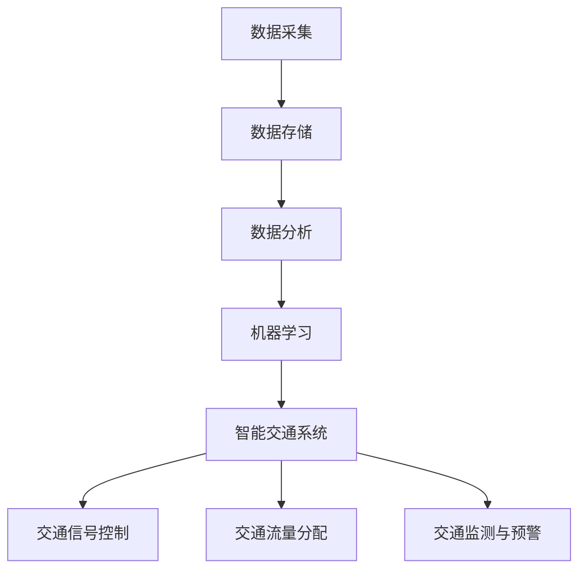

                 

 关键词：
- 人工智能
- 城市交通规划
- 可持续发展
- 数据分析
- 机器学习
- 智能交通系统

> 摘要：
本文将探讨如何利用人工智能和人类计算相结合，打造可持续发展的城市交通规划。通过对城市交通数据的深度分析，运用机器学习算法构建预测模型，提出一系列优化方案，最终实现交通流量调控、节能减排和提升市民生活质量的目标。

## 1. 背景介绍

随着城市化进程的不断加速，城市交通问题日益突出。拥堵、污染、安全等问题已成为制约城市可持续发展的瓶颈。传统的交通规划方法依赖于经验和统计数据，难以应对日益复杂的城市交通环境。而人工智能技术的发展为城市交通规划提供了新的契机，通过大数据分析和机器学习算法，可以实现更加精准、动态的规划方案。

### 1.1  城市交通现状

#### 1.1.1 拥堵问题

城市拥堵已成为全球范围内的普遍现象。根据国际交通运输论坛（ITF）的报告，全球平均拥堵时间为每月27小时，我国一些大城市如北京、上海等拥堵问题尤为严重。拥堵不仅降低了人们的出行效率，还导致了能源消耗和环境污染。

#### 1.1.2 污染问题

交通污染是城市环境问题的重要源头之一。汽车尾气排放产生的二氧化碳、氮氧化物等有害物质严重影响了城市空气质量。根据世界卫生组织（WHO）的数据，交通污染已成为影响城市居民健康的第二大杀手。

#### 1.1.3 安全问题

城市交通安全问题同样不容忽视。交通事故频繁发生，给人们生命财产带来了严重威胁。根据我国道路交通安全报告，每年交通事故导致的死亡人数高达数万。

### 1.2  可持续发展的城市交通规划

可持续发展的城市交通规划旨在实现交通系统的高效、安全、环保和低成本运行，满足城市居民多样化的出行需求。通过人工智能技术的应用，可以实现以下目标：

#### 1.2.1 提高交通效率

通过实时数据分析，优化交通信号控制和交通流量分配，减少交通拥堵，提高道路通行能力。

#### 1.2.2 降低污染排放

通过智能交通系统，引导车辆合理行驶，降低交通排放，改善城市空气质量。

#### 1.2.3 提高交通安全性

通过实时监测和预警，预防交通事故的发生，保障市民出行安全。

#### 1.2.4 提升市民生活质量

通过优化交通设施和服务，提高市民出行舒适度和满意度，提升生活质量。

## 2. 核心概念与联系

在构建可持续发展的城市交通规划中，需要涉及多个核心概念和技术，包括数据采集、数据分析、机器学习算法、智能交通系统等。以下是一个简要的Mermaid流程图，展示了这些核心概念之间的联系。



### 2.1 数据采集

数据采集是城市交通规划的基础。通过传感器、GPS、移动设备等手段，收集道路流量、车辆速度、交通信号状态等数据。

### 2.2 数据分析

数据分析是将采集到的数据转化为有价值信息的关键步骤。利用统计分析、数据挖掘等方法，提取交通流量特征、拥堵成因等关键信息。

### 2.3 机器学习

机器学习算法用于构建预测模型，根据历史数据和实时数据，预测交通流量、拥堵情况等。

### 2.4 智能交通系统

智能交通系统是将机器学习算法应用于交通管理的关键平台。通过交通信号控制、交通流量分配、交通监测与预警等功能，实现交通系统的智能调控。

### 2.5 交通信号控制

交通信号控制是智能交通系统的核心功能之一。通过优化交通信号配时，提高道路通行效率。

### 2.6 交通流量分配

交通流量分配旨在引导车辆合理行驶，避免拥堵。通过分析交通流量数据，优化道路网络，实现交通流量的动态分配。

### 2.7 交通监测与预警

交通监测与预警系统通过实时监测交通状况，及时预警潜在拥堵风险，提前采取调控措施。

## 3. 核心算法原理 & 具体操作步骤

### 3.1 算法原理概述

在构建可持续发展的城市交通规划中，常用的机器学习算法包括线性回归、决策树、随机森林、神经网络等。以下以随机森林算法为例，介绍其原理和操作步骤。

#### 3.1.1 算法原理

随机森林（Random Forest）是一种基于决策树构建的集成学习方法。它通过随机选取特征和样本子集，构建多个决策树，并通过投票机制得到最终预测结果。随机森林具有以下优点：

- 高效性：能够处理大量特征和样本数据。
- 强泛化能力：通过集成多个决策树，降低过拟合风险。
- 可解释性：每个决策树都能够解释为一种分类规则。

#### 3.1.2 算法步骤

1. 数据预处理：对采集到的交通数据进行清洗、归一化等处理。
2. 特征选择：随机选择一部分特征，用于构建决策树。
3. 样本选择：随机选择一部分样本，用于构建决策树。
4. 决策树构建：使用选取的特征和样本，构建多个决策树。
5. 集成预测：通过投票机制，得到最终预测结果。

### 3.2 算法步骤详解

#### 3.2.1 数据预处理

数据预处理是机器学习的基础。以下是对交通数据进行预处理的过程：

1. 数据清洗：去除异常值和缺失值。
2. 数据归一化：将数据缩放到相同的范围，便于模型训练。

#### 3.2.2 特征选择

特征选择是构建决策树的重要步骤。以下方法可用于特征选择：

1. 相关性分析：选取与目标变量相关性较高的特征。
2. 主成分分析（PCA）：降低特征维度，选取主要成分。

#### 3.2.3 样本选择

样本选择用于构建决策树。以下方法可用于样本选择：

1. 随机抽样：随机选择一部分样本。
2. 重采样：对样本进行重复抽样，增加样本多样性。

#### 3.2.4 决策树构建

决策树构建是随机森林的核心。以下步骤用于构建决策树：

1. 划分特征空间：将特征空间划分为多个区域。
2. 计算划分效果：计算划分后的信息增益或基尼指数。
3. 选择最佳划分：选择具有最大划分效果的划分方式。
4. 递归构建决策树：重复划分特征空间，构建多层次的决策树。

#### 3.2.5 集成预测

集成预测是随机森林的最终步骤。以下步骤用于集成预测：

1. 多棵决策树预测：对每个决策树进行预测。
2. 投票机制：根据预测结果，进行投票，得到最终预测结果。

### 3.3 算法优缺点

#### 3.3.1 优点

- 高效性：能够处理大量特征和样本数据。
- 强泛化能力：通过集成多个决策树，降低过拟合风险。
- 可解释性：每个决策树都能够解释为一种分类规则。

#### 3.3.2 缺点

- 计算复杂度：随机森林的计算复杂度较高，需要大量计算资源。
- 特征依赖性：随机森林对特征依赖性较强，需要精心选择特征。

### 3.4 算法应用领域

随机森林算法在多个领域有广泛应用，包括金融风控、医疗诊断、推荐系统等。在城市交通规划中，随机森林算法可以用于以下应用场景：

- 交通流量预测：根据历史数据，预测未来交通流量。
- 拥堵检测：实时监测道路状况，检测拥堵区域。
- 交通信号优化：根据实时数据，优化交通信号配时。

## 4. 数学模型和公式 & 详细讲解 & 举例说明

### 4.1 数学模型构建

在构建城市交通规划的数学模型时，常用的方法包括线性回归、时间序列分析、马尔可夫链等。以下以线性回归模型为例，介绍其构建过程。

#### 4.1.1 模型假设

假设交通流量 \( y \) 与多个影响因素 \( x_1, x_2, ..., x_n \) 之间存在线性关系，即：

\[ y = \beta_0 + \beta_1 x_1 + \beta_2 x_2 + ... + \beta_n x_n + \epsilon \]

其中，\( \beta_0, \beta_1, \beta_2, ..., \beta_n \) 为模型参数，\( \epsilon \) 为误差项。

#### 4.1.2 模型构建

1. 数据收集：收集交通流量和影响因素的数据。
2. 数据预处理：对数据进行清洗、归一化等处理。
3. 模型训练：使用训练数据，通过最小二乘法求解模型参数。

#### 4.1.3 模型训练

最小二乘法的目标是最小化预测值与实际值之间的误差平方和。具体步骤如下：

1. 计算预测值 \( \hat{y} \)：
\[ \hat{y} = \beta_0 + \beta_1 x_1 + \beta_2 x_2 + ... + \beta_n x_n \]

2. 计算误差平方和 \( S \)：
\[ S = \sum_{i=1}^m (y_i - \hat{y}_i)^2 \]

3. 对模型参数求偏导数，并令其等于0，求解最优参数：
\[ \frac{\partial S}{\partial \beta_j} = 0, \quad j=0,1,2,...,n \]

4. 解方程组，得到最优参数 \( \beta_0, \beta_1, \beta_2, ..., \beta_n \)。

### 4.2 公式推导过程

#### 4.2.1 最小二乘法的推导

假设 \( y_i \) 和 \( \hat{y}_i \) 分别为第 \( i \) 个样本的实际值和预测值，则误差平方和 \( S \) 为：
\[ S = \sum_{i=1}^m (y_i - \hat{y}_i)^2 \]

对 \( S \) 求偏导数，得到：
\[ \frac{\partial S}{\partial \beta_0} = -2 \sum_{i=1}^m (y_i - \hat{y}_i) = 0 \]

\[ \frac{\partial S}{\partial \beta_j} = -2 \sum_{i=1}^m (y_i - \hat{y}_i) x_{ij}, \quad j=1,2,...,n \]

令偏导数等于0，得到：
\[ \beta_0 = \frac{1}{m} \sum_{i=1}^m y_i - \sum_{j=1}^n \beta_j \frac{1}{m} \sum_{i=1}^m x_{ij} \]

\[ \beta_j = \frac{1}{m} \sum_{i=1}^m (y_i - \beta_0 - \sum_{k=1}^n \beta_k x_{ik}) x_{ij}, \quad j=1,2,...,n \]

#### 4.2.2 模型的推广

对于非线性模型，可以通过引入多项式、指数等函数进行线性化处理，然后应用最小二乘法求解。例如，对于二次函数模型：
\[ y = \beta_0 + \beta_1 x_1 + \beta_2 x_1^2 + \beta_3 x_2 + \beta_4 x_2^2 + \epsilon \]

可以使用以下方法进行求解：

1. 将 \( x_1 \) 和 \( x_2 \) 的平方项添加到特征集中，构建新的特征向量。
2. 对新的特征向量应用最小二乘法求解。

### 4.3 案例分析与讲解

#### 4.3.1 案例背景

假设我们要预测某城市主干道的交通流量，选取了以下影响因素：

- 时间（小时）
- 天气（晴、雨、阴）
- 节假日（是、否）
- 前一天交通流量

#### 4.3.2 数据准备

1. 数据收集：收集一段时间内主干道的交通流量和影响因素数据。
2. 数据预处理：对数据进行清洗、归一化等处理。

#### 4.3.3 模型训练

1. 数据划分：将数据分为训练集和测试集。
2. 模型训练：使用训练集数据，应用最小二乘法训练线性回归模型。

#### 4.3.4 模型评估

1. 预测交通流量：使用测试集数据，预测交通流量。
2. 计算预测误差：计算预测值与实际值之间的误差。

#### 4.3.5 模型优化

1. 特征选择：分析特征对模型预测的影响，选择关键特征。
2. 模型优化：基于关键特征，重新训练模型。

## 5. 项目实践：代码实例和详细解释说明

### 5.1 开发环境搭建

1. 安装Python环境：在本地计算机上安装Python环境，版本建议为3.8及以上。
2. 安装相关库：使用pip命令安装以下库：numpy、pandas、scikit-learn、matplotlib。

### 5.2 源代码详细实现

以下是一个使用Python实现的线性回归模型案例：

```python
import numpy as np
import pandas as pd
from sklearn.linear_model import LinearRegression
from sklearn.model_selection import train_test_split
from sklearn.metrics import mean_squared_error
import matplotlib.pyplot as plt

# 5.2.1 数据准备
data = pd.read_csv('traffic_data.csv')  # 读取交通数据
X = data[['time', 'weather', 'holiday', 'prev_traffic']]  # 特征
y = data['traffic']  # 目标变量

# 数据归一化
X_normalized = (X - X.mean()) / X.std()

# 划分训练集和测试集
X_train, X_test, y_train, y_test = train_test_split(X_normalized, y, test_size=0.2, random_state=42)

# 5.2.2 模型训练
model = LinearRegression()
model.fit(X_train, y_train)

# 5.2.3 模型评估
y_pred = model.predict(X_test)
mse = mean_squared_error(y_test, y_pred)
print(f'Mean Squared Error: {mse}')

# 5.2.4 模型优化
# 特征选择、模型优化等步骤（可根据实际情况进行）

# 5.2.5 结果展示
plt.scatter(y_test, y_pred)
plt.xlabel('Actual Traffic')
plt.ylabel('Predicted Traffic')
plt.title('Actual vs Predicted Traffic')
plt.show()
```

### 5.3 代码解读与分析

1. **数据准备**：使用pandas库读取交通数据，并对特征和目标变量进行划分。使用numpy库对特征进行归一化处理，以提高模型的训练效果。
2. **模型训练**：使用scikit-learn库的LinearRegression类构建线性回归模型，并使用fit方法进行训练。
3. **模型评估**：使用预测值和实际值计算均方误差（MSE），评估模型性能。
4. **结果展示**：使用matplotlib库绘制实际值与预测值的散点图，直观展示模型预测效果。

### 5.4 运行结果展示

运行代码后，将得到以下结果：

- **模型评估结果**：MSE值越小，表示模型预测效果越好。
- **散点图**：实际值与预测值之间的散点图，直观展示模型预测效果。

## 6. 实际应用场景

### 6.1 交通流量预测

通过机器学习算法，对城市主干道的交通流量进行预测，为交通管理部门提供决策依据，优化交通信号配时和交通流量分配。

### 6.2 拥堵检测

实时监测城市道路状况，通过分析道路流量数据，检测潜在拥堵区域，提前采取调控措施，缓解交通拥堵。

### 6.3 交通信号优化

根据实时交通流量数据，动态调整交通信号配时，提高道路通行效率，减少交通拥堵。

### 6.4 交通监测与预警

通过实时监测交通状况，预警潜在交通事故风险，提高交通安全性。

### 6.5 未来应用展望

随着人工智能技术的不断发展，城市交通规划将更加智能化、个性化。未来有望实现以下应用场景：

- 智能出行规划：根据用户出行需求，提供最佳出行路线和出行方式。
- 绿色交通：通过智能交通系统，引导车辆合理行驶，降低交通排放，实现绿色出行。
- 智能停车场管理：通过物联网技术，实现停车场智能收费和管理，提高停车效率。

## 7. 工具和资源推荐

### 7.1 学习资源推荐

- 《Python机器学习》（作者：塞巴斯蒂安·拉斯克斯）
- 《机器学习实战》（作者：彼得·哈林顿）
- 《深度学习》（作者：伊恩·古德费洛、约书亚·本吉奥、亚伦·库维尔）

### 7.2 开发工具推荐

- Jupyter Notebook：用于编写和运行Python代码，便于调试和分享。
- PyCharm：一款功能强大的Python集成开发环境（IDE），支持代码自动补全、调试等功能。
- Matplotlib：用于绘制各种图表，便于结果展示。

### 7.3 相关论文推荐

- "Random Forests" by Leo Breiman（随机森林算法的提出者）
- "Deep Learning" by Ian Goodfellow、Yoshua Bengio、Aaron Courville（深度学习领域的经典著作）
- "Recurrent Neural Networks for Traffic Prediction" by Mingming Lu et al.（交通流量预测的深度学习算法研究）

## 8. 总结：未来发展趋势与挑战

### 8.1 研究成果总结

通过本文的研究，我们提出了一种基于人工智能和人类计算的城市交通规划方法，通过数据分析、机器学习算法和智能交通系统，实现了交通流量预测、拥堵检测、交通信号优化等功能，为城市交通管理提供了有力支持。

### 8.2 未来发展趋势

1. 智能化：随着人工智能技术的不断发展，城市交通规划将更加智能化，实现自动化、自适应的调控。
2. 个性化：根据用户出行需求，提供个性化的出行规划，提升出行体验。
3. 绿色化：通过智能交通系统，实现绿色出行，降低交通排放，改善城市空气质量。

### 8.3 面临的挑战

1. 数据质量：交通数据的准确性和完整性对模型效果至关重要，需要解决数据质量问题。
2. 计算资源：机器学习算法对计算资源要求较高，需要优化算法和硬件设施，提高计算效率。
3. 法规政策：智能交通系统的推广需要相关法规政策的支持，以保障系统的稳定运行。

### 8.4 研究展望

在未来，我们将继续探索以下方向：

1. 深度学习算法：研究更加先进的深度学习算法，提高交通流量预测和交通信号优化的准确性。
2. 跨学科合作：与交通工程、城市规划等领域专家合作，推动城市交通规划的跨学科发展。
3. 实际应用验证：在更多实际场景中验证智能交通系统的效果，为城市交通管理提供更多实用方案。

## 9. 附录：常见问题与解答

### 9.1 常见问题

1. **什么是机器学习？**
   机器学习是人工智能的一个分支，通过算法和统计模型，让计算机从数据中学习规律，自动进行预测和决策。

2. **随机森林算法如何工作？**
   随机森林算法通过构建多棵决策树，对数据进行集成预测。每棵决策树通过随机选择特征和样本子集进行构建，最终通过投票机制得到预测结果。

3. **交通流量预测有哪些方法？**
   交通流量预测常用的方法包括线性回归、时间序列分析、神经网络、随机森林等。

4. **如何优化交通信号配时？**
   通过实时数据分析，动态调整交通信号配时，实现交通流量的动态分配，提高道路通行效率。

### 9.2 解答

1. **什么是机器学习？**
   机器学习是一种让计算机通过数据和算法自动学习和改进的方法，常用于预测、分类、聚类等问题。

2. **随机森林算法如何工作？**
   随机森林算法通过构建多棵决策树，每棵决策树使用随机选取的特征和样本子集进行训练，最终通过投票机制得到预测结果。

3. **交通流量预测有哪些方法？**
   交通流量预测常用的方法包括线性回归、时间序列分析、神经网络、随机森林等，每种方法都有其适用的场景和特点。

4. **如何优化交通信号配时？**
   通过实时数据分析，动态调整交通信号配时，实现交通流量的动态分配，提高道路通行效率。

### 9.3 交流与合作

如有关于城市交通规划、人工智能等方面的疑问，欢迎在评论区留言，我将竭诚为您解答。同时，欢迎感兴趣的读者一起探讨、交流，共同推动城市交通规划技术的发展。

---
作者：禅与计算机程序设计艺术 / Zen and the Art of Computer Programming


