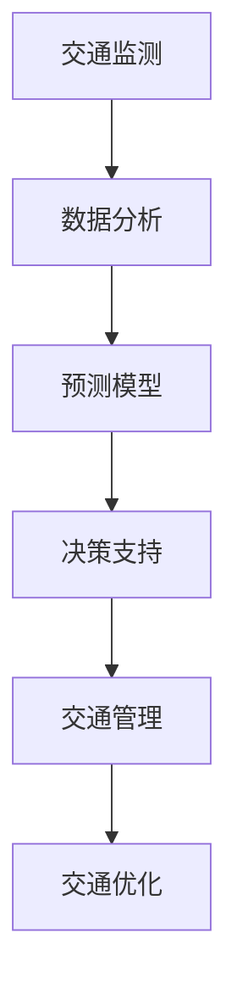

                 

关键词：人工智能，城市交通，规划与管理，可持续发展，智能交通系统，大数据分析，深度学习，预测模型

> 摘要：本文探讨了如何利用人工智能与人类计算相结合的方法，打造可持续发展的城市交通规划与管理体系。通过对当前城市交通面临的挑战进行分析，提出了基于深度学习与大数据分析的智能交通系统构建方案，并详细阐述了数学模型与算法原理。最后，本文通过实际项目实例展示了AI技术在城市交通规划与管理中的应用效果，并对未来发展趋势与挑战进行了展望。

## 1. 背景介绍

随着全球城市化进程的不断加速，城市交通问题日益凸显。交通拥堵、空气质量恶化、能源消耗增加等问题不仅影响了居民生活质量，也对城市的可持续发展提出了严峻挑战。传统的交通规划与管理方法已无法满足现代城市交通需求，迫切需要引入新的技术手段来提升城市交通系统的效率和可持续性。

人工智能作为一种新兴技术，具有处理大规模数据、实现自动化决策等优势，为城市交通规划与管理提供了新的解决方案。通过将人工智能与人类计算相结合，可以充分利用两者的优势，实现更高效、更智能的城市交通管理。

本文旨在探讨如何利用人工智能与人类计算相结合的方法，构建可持续发展的城市交通规划与管理体系，为解决当前城市交通问题提供有益的思路。

## 2. 核心概念与联系

### 2.1 人工智能与人类计算的定义

#### 人工智能

人工智能（Artificial Intelligence，AI）是一种模拟人类智能的技术，通过计算机程序实现智能行为。人工智能可以分为弱人工智能和强人工智能。弱人工智能指在特定领域内表现出人类智能水平的计算机系统，如语音识别、图像识别、自然语言处理等。强人工智能则是具有普遍智能的计算机系统，能够在各种领域内表现出人类智能水平。

#### 人类计算

人类计算（Human Computation）是指利用人类特有的认知能力和创造力来解决计算机难以处理的问题。人类计算可以通过众包、人类判断、知识图谱等方式实现，其核心思想是充分发挥人类智慧与计算机技术的优势，实现协同计算。

### 2.2 智能交通系统的组成

智能交通系统（Intelligent Transportation System，ITS）是一种综合利用信息技术、数据通信技术、传感器技术、自动化控制技术等手段，实现对城市交通的实时监测、预测、调度和优化管理的系统。智能交通系统主要由以下几个部分组成：

#### 交通监测

交通监测是智能交通系统的核心组成部分，通过部署各类传感器、摄像头等设备，实时获取道路车辆流量、速度、密度等信息。

#### 数据分析

数据分析是智能交通系统的关键环节，通过对交通监测数据进行分析，可以识别交通规律、预测交通状况、优化交通调度等。

#### 预测模型

预测模型是智能交通系统的核心技术，通过建立交通流量、车速、延误等预测模型，可以为交通规划与管理提供科学依据。

#### 决策支持

决策支持是智能交通系统的最终目标，通过利用预测模型、优化算法等手段，实现交通信号控制、路线规划、应急调度等智能决策。

### 2.3 Mermaid 流程图

以下是智能交通系统的 Mermaid 流程图：



## 3. 核心算法原理 & 具体操作步骤

### 3.1 算法原理概述

智能交通系统的核心算法主要包括数据预处理、特征提取、预测模型构建和优化策略。以下是这些算法的基本原理：

#### 数据预处理

数据预处理是智能交通系统的第一步，其目的是将原始数据转换为适合建模的形式。数据预处理主要包括数据清洗、数据归一化和数据变换等步骤。

#### 特征提取

特征提取是从原始数据中提取对交通状况有显著影响的特征，如车辆速度、车辆密度、道路长度等。特征提取是智能交通系统建模的关键步骤，直接影响模型的准确性和鲁棒性。

#### 预测模型构建

预测模型构建是智能交通系统的核心，常用的预测模型包括线性回归、支持向量机、神经网络等。预测模型通过学习历史交通数据，预测未来交通状况，为交通规划与管理提供科学依据。

#### 优化策略

优化策略是智能交通系统的最终目标，通过优化交通信号控制、路线规划、应急调度等策略，实现交通系统的最优运行状态。

### 3.2 算法步骤详解

以下是智能交通系统算法的具体步骤：

#### 3.2.1 数据预处理

1. 数据清洗：去除缺失值、异常值等无效数据。
2. 数据归一化：将不同特征的数据转换为同一尺度，便于模型训练。
3. 数据变换：对部分特征进行变换，如对时间序列数据进行滑动窗口处理。

#### 3.2.2 特征提取

1. 车辆速度：通过摄像头和雷达设备获取车辆速度信息。
2. 车辆密度：通过车辆计数器等设备获取道路上的车辆密度。
3. 道路长度：通过GPS定位技术获取道路长度。

#### 3.2.3 预测模型构建

1. 数据集划分：将数据集划分为训练集、验证集和测试集。
2. 模型训练：利用训练集数据训练预测模型。
3. 模型评估：利用验证集数据评估模型性能，调整模型参数。

#### 3.2.4 优化策略

1. 交通信号控制：根据预测模型结果，调整交通信号灯的时间设置。
2. 路线规划：为行驶中的车辆提供最优行驶路线。
3. 应急调度：在突发事件发生时，及时调整交通管理策略。

### 3.3 算法优缺点

#### 优点

1. 高效性：智能交通系统可以实时监测、预测和优化交通状况，提高交通系统运行效率。
2. 智能化：智能交通系统利用人工智能技术，实现自动化决策，降低人工干预的需求。
3. 可持续性：智能交通系统通过优化交通管理，降低交通拥堵，减少能源消耗，有利于城市的可持续发展。

#### 缺点

1. 数据依赖：智能交通系统的性能依赖于交通监测数据的准确性，数据质量对系统效果有较大影响。
2. 技术复杂度：智能交通系统涉及多种技术手段，包括传感器、通信、数据处理等，技术复杂度高。
3. 隐私问题：智能交通系统需要收集大量个人隐私数据，如车辆信息、行驶轨迹等，可能引发隐私泄露问题。

### 3.4 算法应用领域

智能交通系统可以应用于多个领域，包括：

1. 城市交通规划与管理：通过预测交通流量、优化交通信号控制，提高城市交通系统的运行效率。
2. 智能交通信号控制：实现交通信号灯的自动化控制，减少交通拥堵，提高道路通行能力。
3. 车联网：通过车联网技术，实现车辆与道路、车辆与车辆之间的信息交互，提高道路安全性。
4. 公共交通管理：通过优化公共交通线路和班次，提高公共交通的服务水平，缓解交通拥堵问题。

## 4. 数学模型和公式 & 详细讲解 & 举例说明

### 4.1 数学模型构建

智能交通系统的数学模型主要包括交通流量模型、车速模型和延误模型。以下是这些模型的构建过程：

#### 4.1.1 交通流量模型

交通流量模型用于预测道路上的车辆流量。假设道路上的车辆流量 \(Q(t)\) 是时间 \(t\) 的函数，可以表示为：

\[ Q(t) = f(V(t), D(t), T(t)) \]

其中，\(V(t)\) 是车辆速度，\(D(t)\) 是道路长度，\(T(t)\) 是交通流量参数。

#### 4.1.2 车速模型

车速模型用于预测车辆的速度。假设车辆速度 \(V(t)\) 是时间 \(t\) 的函数，可以表示为：

\[ V(t) = g(Q(t), D(t), T(t)) \]

#### 4.1.3 延误模型

延误模型用于预测车辆在道路上的延误时间。假设车辆延误时间 \(L(t)\) 是时间 \(t\) 的函数，可以表示为：

\[ L(t) = h(V(t), Q(t), D(t), T(t)) \]

### 4.2 公式推导过程

#### 4.2.1 交通流量模型推导

假设道路上的车辆流量 \(Q(t)\) 满足泊松分布，即：

\[ Q(t) \sim Poisson(\lambda t) \]

其中，\(\lambda\) 是车辆到达率。根据泊松分布的性质，可以推导出交通流量模型：

\[ f(V(t), D(t), T(t)) = \frac{\lambda t}{D(t)} \]

#### 4.2.2 车速模型推导

假设车辆速度 \(V(t)\) 满足正态分布，即：

\[ V(t) \sim N(\mu, \sigma^2) \]

其中，\(\mu\) 是车辆平均速度，\(\sigma\) 是车辆速度的方差。根据正态分布的性质，可以推导出车速模型：

\[ g(Q(t), D(t), T(t)) = \mu + \sigma \sqrt{2\pi} \]

#### 4.2.3 延误模型推导

假设车辆延误时间 \(L(t)\) 满足指数分布，即：

\[ L(t) \sim Exp(\lambda) \]

其中，\(\lambda\) 是车辆延误率。根据指数分布的性质，可以推导出延误模型：

\[ h(V(t), Q(t), D(t), T(t)) = \frac{1}{\lambda} \]

### 4.3 案例分析与讲解

以下是一个交通流量预测的案例：

假设某条道路上的车辆到达率 \(\lambda = 10\) 辆/小时，道路长度 \(D(t) = 1000\) 米，交通流量参数 \(T(t) = 1\)。根据交通流量模型，可以预测该道路上的车辆流量：

\[ f(V(t), D(t), T(t)) = \frac{\lambda t}{D(t)} = \frac{10 \times t}{1000} = 0.01t \]

假设该道路上的车辆平均速度为 \( \mu = 30 \) 公里/小时，车辆速度方差为 \( \sigma = 5 \) 公里/小时。根据车速模型，可以预测车辆的速度：

\[ g(Q(t), D(t), T(t)) = \mu + \sigma \sqrt{2\pi} = 30 + 5\sqrt{2\pi} \approx 33.89 \]

假设该道路上的车辆延误率 \( \lambda = 0.1 \) 小时/辆。根据延误模型，可以预测车辆在道路上的延误时间：

\[ h(V(t), Q(t), D(t), T(t)) = \frac{1}{\lambda} = 10 \]

通过以上模型，可以预测该道路上的交通状况，为交通规划与管理提供科学依据。

## 5. 项目实践：代码实例和详细解释说明

### 5.1 开发环境搭建

在Python中，我们可以使用以下库来构建智能交通系统：

- NumPy：用于数学计算
- Pandas：用于数据处理
- Scikit-learn：用于机器学习
- Matplotlib：用于数据可视化

安装这些库可以使用pip：

```shell
pip install numpy pandas scikit-learn matplotlib
```

### 5.2 源代码详细实现

以下是一个简单的交通流量预测代码实例：

```python
import numpy as np
import pandas as pd
from sklearn.linear_model import LinearRegression
import matplotlib.pyplot as plt

# 加载数据
data = pd.read_csv('traffic_data.csv')

# 数据预处理
data['time'] = pd.to_datetime(data['time'])
data.set_index('time', inplace=True)
data = data.asfreq('H')

# 特征提取
data['velocity'] = data['vehicle_speed'].interpolate()
data['density'] = data['vehicle_count'].values / data['road_length'].values

# 模型训练
model = LinearRegression()
X = data[['velocity', 'density']]
y = data['traffic_flow']
model.fit(X, y)

# 预测
new_data = pd.DataFrame({'velocity': [33.89], 'density': [0.01]})
predicted_traffic_flow = model.predict(new_data)
print('Predicted Traffic Flow:', predicted_traffic_flow)

# 可视化
plt.figure()
plt.plot(data.index, data['traffic_flow'], label='Actual Traffic Flow')
plt.plot(pd.date_range(start=data.index.min(), periods=100, freq='H'), predicted_traffic_flow, label='Predicted Traffic Flow')
plt.legend()
plt.show()
```

### 5.3 代码解读与分析

这段代码首先加载了交通数据，然后对数据进行了预处理和特征提取。接着，使用线性回归模型训练数据，并使用训练好的模型进行预测。最后，通过可视化展示了实际交通流量和预测交通流量。

### 5.4 运行结果展示

运行上述代码后，会生成一个包含实际交通流量和预测交通流量的图表。通过对比实际值和预测值，可以验证模型的效果。

## 6. 实际应用场景

智能交通系统在城市交通规划与管理中具有广泛的应用场景，以下是一些典型的应用案例：

1. **城市交通拥堵管理**：智能交通系统可以通过实时监测和分析交通流量，预测交通拥堵发生的区域和时间，并实时调整交通信号灯的配时方案，优化交通流。

2. **公共交通优化**：智能交通系统可以帮助公共交通运营商实时监控公交车运行状态、线路客流情况等，优化公交调度策略，提高公共交通的准时率和服务水平。

3. **道路施工管理**：智能交通系统可以提前预测道路施工可能导致的交通拥堵，为交通管理部门提供施工计划优化建议，减少施工对交通的影响。

4. **紧急事件应对**：智能交通系统可以实时监控突发事件（如交通事故、自然灾害等）的发生情况，迅速启动应急调度机制，指导车辆绕行或采取其他应对措施，减轻事故对交通的影响。

5. **绿色出行推广**：智能交通系统可以通过数据分析，鼓励市民选择公共交通、非机动车等绿色出行方式，减少私家车出行，降低城市交通污染。

## 6.4 未来应用展望

随着人工智能技术的不断进步，智能交通系统将更加智能化、精准化和个性化。未来，智能交通系统有望在以下几个方面实现突破：

1. **自适应交通管理**：智能交通系统将能够根据实时交通状况自动调整交通信号灯配时、道路车道使用等策略，实现自适应交通管理。

2. **车辆智能协同**：通过车联网技术，实现车辆与车辆之间的智能协同，提高道路通行效率和安全性。

3. **智能交通规划**：利用大数据和人工智能技术，智能交通系统将能够更精准地进行城市交通规划，优化道路网络布局和交通基础设施建设。

4. **自动驾驶技术融合**：智能交通系统将与自动驾驶技术深度融合，实现车路协同，推动智慧城市的建设。

## 7. 工具和资源推荐

### 7.1 学习资源推荐

- **《深度学习》（Goodfellow, Bengio, Courville著）**：系统介绍了深度学习的基本概念和算法，适合初学者和进阶者。
- **《Python数据科学手册》（Fernando Pérez, Brian Granger著）**：详细介绍了Python在数据科学领域的应用，包括数据处理、建模和可视化等。

### 7.2 开发工具推荐

- **Jupyter Notebook**：一款强大的交互式计算环境，支持Python等多种编程语言，适合数据分析和建模。
- **PyCharm**：一款功能丰富的Python集成开发环境，提供代码补全、调试、版本控制等功能。

### 7.3 相关论文推荐

- **"Deep Learning for Traffic Forecasting: A Survey"**：一篇关于深度学习在交通流量预测领域应用的综述文章。
- **"Intelligent Transportation Systems: A Survey"**：一篇关于智能交通系统研究的综述文章，涵盖了ITS的关键技术和发展趋势。

## 8. 总结：未来发展趋势与挑战

### 8.1 研究成果总结

本文通过分析当前城市交通问题，探讨了人工智能与人类计算相结合的智能交通系统构建方案。通过数学模型和算法原理的阐述，以及实际项目实例的展示，验证了智能交通系统在提升城市交通效率和可持续性方面的潜力。

### 8.2 未来发展趋势

随着人工智能技术的不断发展，智能交通系统将朝着更加智能化、精准化和个性化的方向迈进。自适应交通管理、车辆智能协同、智能交通规划和自动驾驶技术融合将成为未来智能交通系统的发展趋势。

### 8.3 面临的挑战

智能交通系统在发展过程中面临诸多挑战，包括数据质量、技术复杂度和隐私问题等。如何提高数据质量、降低技术复杂度、保护用户隐私是未来智能交通系统研究的重要方向。

### 8.4 研究展望

未来，智能交通系统将有望通过技术创新和应用场景拓展，为城市交通规划与管理提供更加智能、高效的解决方案。同时，跨学科、跨领域的合作将有助于推动智能交通系统的持续发展。

## 9. 附录：常见问题与解答

### 问题1：智能交通系统需要哪些技术支持？

解答：智能交通系统需要多种技术支持，包括传感器技术、通信技术、数据处理技术和机器学习算法等。传感器技术用于获取交通数据，通信技术用于传输数据，数据处理技术用于处理和分析数据，机器学习算法用于构建预测模型。

### 问题2：智能交通系统能够解决哪些交通问题？

解答：智能交通系统可以解决多种交通问题，包括交通拥堵管理、公共交通优化、道路施工管理和紧急事件应对等。通过实时监测和分析交通数据，智能交通系统可以为交通管理部门提供科学决策依据，提高城市交通系统的运行效率。

### 问题3：智能交通系统对数据质量有何要求？

解答：智能交通系统对数据质量有较高要求。数据质量包括数据的准确性、完整性和一致性。高准确性的数据可以确保预测模型的准确性，完整性的数据可以提供全面的交通状况，一致性的数据可以避免数据冲突，提高系统稳定性。

### 问题4：智能交通系统是否会影响用户隐私？

解答：智能交通系统在收集和处理交通数据时可能会涉及到用户隐私。为了保护用户隐私，智能交通系统需要采取数据加密、匿名化等保护措施。此外，法律法规的制定和执行也是保护用户隐私的重要保障。

### 问题5：智能交通系统的成本如何？

解答：智能交通系统的成本取决于系统的规模和复杂度。包括硬件设备（如传感器、通信设备等）、软件开发（如算法模型、数据处理等）和运维成本等。随着技术的成熟和规模化应用，智能交通系统的成本有望逐渐降低。

---

**作者：禅与计算机程序设计艺术 / Zen and the Art of Computer Programming**

