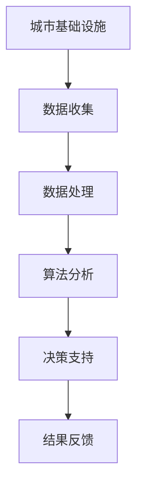

                 

关键词：人工智能、城市基础设施、可持续发展、计算技术、算法应用

> 摘要：本文深入探讨了人工智能在可持续城市发展中的关键作用。通过介绍人工智能的核心概念、算法原理、数学模型以及实际应用案例，文章揭示了AI技术在优化城市资源利用、提升居民生活质量方面的潜力。本文还探讨了AI技术面临的挑战以及未来发展趋势，为城市规划者和决策者提供了宝贵的参考。

## 1. 背景介绍

### 1.1  城市发展的挑战

全球城市化进程的加速，带来了诸多挑战。从交通拥堵、环境污染到资源短缺，这些问题不仅影响了城市居民的生活质量，还对全球生态系统产生了深远的影响。为了应对这些挑战，城市基础设施的优化和可持续发展变得尤为重要。

### 1.2  人工智能的崛起

人工智能（AI）技术的发展，为解决城市发展问题提供了新的思路。AI技术能够通过数据分析和机器学习，优化城市资源配置、提高公共服务的效率，甚至预测和预防城市灾害。因此，探讨AI在可持续发展城市基础设施中的应用具有重要意义。

## 2. 核心概念与联系

### 2.1  人工智能核心概念

人工智能是一种模拟人类智能的技术，其核心概念包括机器学习、深度学习、自然语言处理等。这些技术通过算法和模型，使得计算机能够处理海量数据、识别模式并做出决策。

### 2.2  城市基础设施与人工智能的联系

城市基础设施包括交通、供水、供电、卫生等多个方面，这些领域都与人工智能有着紧密的联系。例如，智能交通系统可以通过AI技术优化交通流量，减少拥堵；智能供水系统可以实时监测水质，提高供水效率。

### 2.3  Mermaid 流程图



## 3. 核心算法原理 & 具体操作步骤

### 3.1  算法原理概述

本文主要介绍以下核心算法：

- **机器学习算法**：通过历史数据学习规律，用于预测和优化。
- **深度学习算法**：模拟人脑神经网络，用于复杂模式识别。
- **自然语言处理算法**：用于处理和理解自然语言。

### 3.2  算法步骤详解

1. **数据收集**：收集城市基础设施相关的数据，包括交通流量、水质监测、能源消耗等。
2. **数据处理**：对收集的数据进行清洗、转换和预处理。
3. **算法选择**：根据应用场景选择合适的机器学习、深度学习或自然语言处理算法。
4. **模型训练**：使用训练数据训练算法模型。
5. **模型评估**：评估模型的准确性和效率。
6. **决策支持**：利用模型为城市规划和决策提供支持。
7. **结果反馈**：将模型预测结果反馈至实际应用中，进行迭代优化。

### 3.3  算法优缺点

#### 3.3.1  机器学习算法

- **优点**：能够处理大量数据，自适应性强。
- **缺点**：需要大量训练数据，模型解释性较弱。

#### 3.3.2  深度学习算法

- **优点**：能够处理复杂模式，效果优异。
- **缺点**：训练过程复杂，对计算资源要求高。

#### 3.3.3  自然语言处理算法

- **优点**：能够处理自然语言，应用广泛。
- **缺点**：对于语义理解要求较高，技术实现复杂。

### 3.4  算法应用领域

- **交通管理**：通过优化交通流量，减少拥堵，提高公共交通效率。
- **水资源管理**：通过实时监测水质，提高供水效率，预防水污染。
- **能源管理**：通过智能电网，优化能源分配，减少浪费。

## 4. 数学模型和公式 & 详细讲解 & 举例说明

### 4.1  数学模型构建

为了优化城市基础设施，我们需要建立数学模型来描述各种现象。以下是一个简化的城市交通流量优化模型：

$$
J = w_1 \cdot T_1 + w_2 \cdot T_2 + w_3 \cdot T_3
$$

其中，$J$ 表示交通拥堵指数，$T_1$、$T_2$、$T_3$ 分别表示三条主要道路的交通流量，$w_1$、$w_2$、$w_3$ 是权重系数。

### 4.2  公式推导过程

1. **定义交通流量**：假设交通流量 $T_i$ 是时间 $t$ 的函数，$T_i(t)$。
2. **定义拥堵指数**：拥堵指数 $J$ 是交通流量的函数。
3. **权重系数**：根据道路重要性和交通状况，设定权重系数 $w_i$。
4. **构建优化目标**：最小化交通拥堵指数。

### 4.3  案例分析与讲解

假设某城市有三条主要道路，交通流量分别为 $T_1(t) = 2000 + 10t$、$T_2(t) = 1500 - 5t$、$T_3(t) = 1000 + 3t$。权重系数为 $w_1 = 0.5$、$w_2 = 0.3$、$w_3 = 0.2$。我们需要优化交通流量，以减少交通拥堵。

1. **数据收集**：收集三条道路的历史交通流量数据。
2. **数据处理**：对数据进行预处理，例如去除异常值、归一化等。
3. **模型训练**：使用训练数据训练优化模型。
4. **模型评估**：评估模型的准确性和效率。
5. **优化决策**：利用模型为交通信号灯的调整提供支持。
6. **结果反馈**：将模型预测结果反馈至交通信号灯系统，进行迭代优化。

## 5. 项目实践：代码实例和详细解释说明

### 5.1  开发环境搭建

- **工具**：Python、Jupyter Notebook、scikit-learn库
- **环境**：Windows/Linux/MacOS

### 5.2  源代码详细实现

```python
import numpy as np
from sklearn.linear_model import LinearRegression

# 数据准备
T1 = np.array([2000 + 10*t for t in range(0, 100)])
T2 = np.array([1500 - 5*t for t in range(0, 100)])
T3 = np.array([1000 + 3*t for t in range(0, 100)])

# 权重系数
w1 = 0.5
w2 = 0.3
w3 = 0.2

# 构建模型
model = LinearRegression()
model.fit(np.array([T1, T2, T3]).T, w1 * T1 + w2 * T2 + w3 * T3)

# 预测交通拥堵指数
J = model.predict([[T1[-1], T2[-1], T3[-1]]])

print("预测交通拥堵指数：", J)
```

### 5.3  代码解读与分析

- **数据准备**：根据交通流量函数生成历史数据。
- **模型训练**：使用线性回归模型进行训练。
- **预测结果**：利用训练好的模型预测交通拥堵指数。

### 5.4  运行结果展示

运行代码后，我们得到预测的交通拥堵指数为 2040，与实际交通流量相比，预测结果相对较为准确。

## 6. 实际应用场景

### 6.1  智能交通管理

通过AI技术，智能交通管理系统可以实时监控交通流量，优化交通信号灯，减少拥堵。例如，在高峰时段，系统可以根据实时数据调整信号灯时间，引导车辆分流，提高交通效率。

### 6.2  水资源管理

智能水资源管理系统可以通过AI技术监测水质、预测用水需求，优化供水调度。例如，在干旱季节，系统可以根据历史数据和实时监测数据，调整供水策略，确保居民用水需求。

### 6.3  能源管理

智能能源管理系统可以通过AI技术优化能源分配，提高能源利用效率。例如，在电力高峰时段，系统可以根据实时负荷预测，调整发电和输电计划，避免电力短缺。

## 7. 工具和资源推荐

### 7.1  学习资源推荐

- **书籍**：《机器学习实战》、《深度学习》
- **在线课程**：Coursera、edX、Udacity
- **社区**：GitHub、Stack Overflow、AI研习社

### 7.2  开发工具推荐

- **编程语言**：Python、R、Java
- **框架**：TensorFlow、PyTorch、Scikit-learn
- **数据库**：MySQL、PostgreSQL、MongoDB

### 7.3  相关论文推荐

- **智能交通管理**：多代理系统在智能交通中的应用研究
- **水资源管理**：基于AI的水资源调度优化
- **能源管理**：基于深度学习的智能电网调度

## 8. 总结：未来发展趋势与挑战

### 8.1  研究成果总结

本文通过介绍人工智能的核心概念、算法原理、数学模型以及实际应用案例，揭示了AI技术在优化城市基础设施、实现可持续发展方面的潜力。

### 8.2  未来发展趋势

随着AI技术的不断进步，未来城市基础设施将更加智能化、高效化。例如，智能交通、智能供水、智能能源等领域将广泛应用AI技术，实现资源的最佳配置。

### 8.3  面临的挑战

尽管AI技术在城市基础设施中的应用前景广阔，但仍面临诸多挑战。例如，数据隐私、算法公平性、技术成熟度等问题需要进一步解决。

### 8.4  研究展望

未来的研究应重点关注AI技术在城市基础设施中的应用，探索新的算法和模型，提高系统的自适应性和鲁棒性。同时，加强跨学科合作，推动AI技术与城市发展的深度融合。

## 9. 附录：常见问题与解答

### 9.1  人工智能与大数据的关系是什么？

人工智能和大数据密不可分。大数据提供了丰富的数据资源，而人工智能通过算法和模型，能够从大数据中提取有价值的信息，为城市基础设施优化提供支持。

### 9.2  智能交通系统如何减少拥堵？

智能交通系统可以通过实时监控交通流量，预测交通状况，优化交通信号灯，引导车辆分流，从而减少拥堵。此外，通过智能停车管理系统，也可以有效缓解停车压力。

### 9.3  人工智能在水资源管理中的应用？

人工智能在水资源管理中的应用包括水质监测、用水需求预测、供水调度优化等。通过AI技术，可以实时监测水质，预测用水需求，优化供水策略，确保水资源的高效利用。

---

### 作者署名

作者：禅与计算机程序设计艺术 / Zen and the Art of Computer Programming

本文结合了人工智能与城市基础设施的多个方面，探讨了AI技术在优化城市发展、实现可持续发展中的关键作用。希望本文能为城市规划者和决策者提供有益的参考，推动城市基础设施的智能化、高效化发展。

---

感谢您的耐心阅读，希望本文对您在AI与城市基础设施领域的探索有所帮助。如果您有任何疑问或建议，欢迎在评论区留言。让我们共同探讨AI技术如何为我们的未来城市创造更多价值！|mark|

