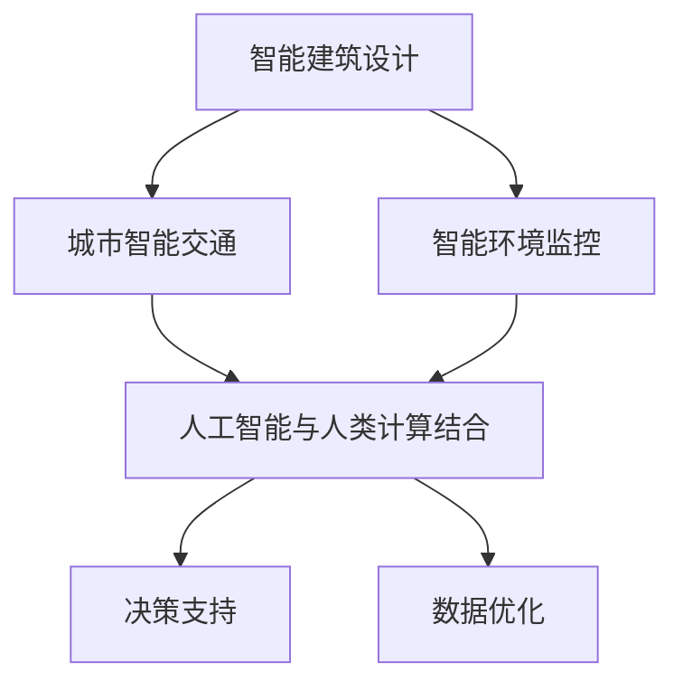

                 

## 1. 背景介绍

随着全球城市化进程的不断加速，城市基础设施建设的重要性日益凸显。传统的城市基础设施设计和管理往往依赖于人工经验，这种方式既耗时又容易出错。随着人工智能技术的发展，利用AI进行城市基础设施的智能化设计和运营管理已成为可能，这不仅提高了效率，还有助于实现可持续发展目标。

人工智能在建筑设计和城市规划中有着广泛的应用。例如，通过机器学习算法可以对大量历史数据进行分析，预测城市未来的人口分布和交通流量，从而优化交通网络设计。此外，人工智能还可以用于监控和管理城市环境，如通过智能传感器网络实时监测水质、空气质量等，为城市管理者提供科学的决策依据。

本文旨在探讨如何利用人工智能与人类计算相结合，打造可持续发展的城市基础设施建设。我们将从核心概念、算法原理、数学模型、项目实践、应用场景等多个角度深入分析，以期为相关领域的研究者提供参考，也为政策制定者和从业者提供实用建议。

## 2. 核心概念与联系

在探讨如何利用人工智能与人类计算打造可持续发展的城市基础设施建设之前，我们需要明确几个核心概念，并了解它们之间的联系。

### 2.1 智能建筑设计

智能建筑设计是指利用计算机辅助设计（CAD）和建筑信息模型（BIM）等技术，实现对建筑结构、功能、材料、能源等方面的高效设计和优化。通过智能建筑设计，可以显著提高建筑的设计质量，降低能源消耗，提升用户体验。

### 2.2 城市智能交通

城市智能交通是指利用智能交通系统（ITS）和交通信息管理系统，通过数据采集、分析和预测，实现对交通流量、交通事故、停车资源等交通问题的有效管理和调控。城市智能交通的目标是提高交通效率，减少拥堵，提升交通安全。

### 2.3 智能环境监控

智能环境监控是指通过安装各种智能传感器，实时监测城市环境中的各种参数，如空气质量、水质、温度、湿度等，并将数据传输到中央监控系统进行分析和处理。智能环境监控有助于城市管理者及时了解环境状况，采取有效的应对措施。

### 2.4 人工智能与人类计算的结合

人工智能与人类计算的结合是指利用人工智能技术辅助人类进行决策，从而提高决策的效率和准确性。在可持续发展的城市基础设施建设中，人类计算主要指城市规划师、建筑师、工程师等专业人员利用专业知识和技术手段进行设计和管理。而人工智能则负责数据分析、预测和优化等任务，为人类计算提供支持。

### 2.5 Mermaid 流程图

为了更直观地展示这些核心概念之间的联系，我们可以使用Mermaid流程图来描述。以下是一个简单的Mermaid流程图示例，展示了智能建筑设计、城市智能交通、智能环境监控以及人工智能与人类计算结合的关系：



通过这个流程图，我们可以清晰地看到，智能建筑设计、城市智能交通和智能环境监控都是可持续发展的城市基础设施的重要组成部分，而人工智能与人类计算的结合则为这些领域提供了强有力的技术支持。

## 3. 核心算法原理 & 具体操作步骤

在可持续发展的城市基础设施建设中，人工智能技术的核心算法起着至关重要的作用。以下我们将详细探讨这些核心算法的原理，并给出具体的操作步骤。

### 3.1 算法原理概述

#### 3.1.1 深度学习

深度学习是人工智能的核心技术之一，它通过模拟人脑的神经网络结构，实现对复杂数据的分析和建模。在可持续发展的城市基础设施建设中，深度学习算法可以用于预测城市人口增长、交通流量、能源消耗等。例如，通过使用卷积神经网络（CNN）处理图像数据，可以实现对城市环境质量的实时监测。

#### 3.1.2 优化算法

优化算法是一类用于寻找最优解的算法，广泛应用于城市基础设施的设计和优化。例如，线性规划（Linear Programming，LP）可以用于优化交通网络的布局，使得交通流量最大化或拥堵最小化。遗传算法（Genetic Algorithm，GA）则可以用于解决复杂的组合优化问题，如城市交通信号控制。

#### 3.1.3 聚类算法

聚类算法是一种无监督学习方法，用于将数据集划分成不同的簇。在可持续发展的城市基础设施建设中，聚类算法可以用于人口分布预测、区域规划等。例如，K-means算法可以用于分析城市不同区域的交通流量特征，从而优化交通网络设计。

### 3.2 算法步骤详解

#### 3.2.1 深度学习算法步骤

1. **数据采集**：收集城市人口、交通流量、能源消耗等历史数据。
2. **数据预处理**：对采集到的数据进行清洗和归一化处理，以便于后续的建模和分析。
3. **模型训练**：使用卷积神经网络（CNN）或其他深度学习模型对预处理后的数据进行训练。
4. **模型评估**：通过交叉验证等方法评估模型的性能，调整模型参数以优化预测效果。
5. **预测应用**：使用训练好的模型进行实际预测，如预测未来城市人口增长或交通流量。

#### 3.2.2 优化算法步骤

1. **问题定义**：明确优化问题的目标函数和约束条件。
2. **选择算法**：根据问题的特点选择合适的优化算法，如线性规划（LP）或遗传算法（GA）。
3. **模型建立**：建立数学模型，将优化问题转化为可计算的数学形式。
4. **算法迭代**：执行优化算法的迭代过程，逐步逼近最优解。
5. **结果分析**：分析优化结果，评估优化方案的可行性和有效性。

#### 3.2.3 聚类算法步骤

1. **数据输入**：输入城市交通流量、人口分布等数据。
2. **选择算法**：选择合适的聚类算法，如K-means。
3. **初始化聚类中心**：随机选择K个聚类中心。
4. **分配数据点**：将每个数据点分配到距离最近的聚类中心。
5. **更新聚类中心**：重新计算每个簇的平均值，作为新的聚类中心。
6. **迭代过程**：重复步骤4和5，直到聚类中心不再发生变化或达到预设的迭代次数。

### 3.3 算法优缺点

#### 3.3.1 深度学习算法

**优点**：深度学习算法能够自动提取复杂数据的特征，适用于处理大量的非结构化数据。

**缺点**：训练深度学习模型需要大量的计算资源和时间，且模型的可解释性较差。

#### 3.3.2 优化算法

**优点**：优化算法能够找到问题的最优解，适用于解决复杂的优化问题。

**缺点**：优化算法的收敛速度可能较慢，且在某些情况下可能陷入局部最优。

#### 3.3.3 聚类算法

**优点**：聚类算法简单有效，适用于对数据进行初步分析和分类。

**缺点**：聚类算法的结果可能受到初始聚类中心的影响，且无法确定最优的簇数。

### 3.4 算法应用领域

#### 3.4.1 建筑设计

深度学习算法可以用于建筑设计的自动化，如通过卷积神经网络（CNN）识别建筑风格和结构特征，从而实现建筑风格的自动生成。

#### 3.4.2 城市交通

优化算法可以用于交通网络的设计和优化，如通过线性规划（LP）优化交通流量，减少交通拥堵。

#### 3.4.3 环境监测

聚类算法可以用于环境监测数据的分类和分析，如通过K-means算法对空气质量数据进行聚类，识别污染源。

## 4. 数学模型和公式 & 详细讲解 & 举例说明

在可持续发展的城市基础设施建设中，数学模型和公式起着至关重要的作用。以下我们将详细讲解一些常用的数学模型和公式，并通过具体例子进行说明。

### 4.1 数学模型构建

#### 4.1.1 交通流量预测模型

交通流量预测是城市智能交通的重要组成部分。一个简单的交通流量预测模型可以采用线性回归模型。假设我们有以下数据：

- \( x_1 \)：某个时间段内的交通流量（单位：车辆/小时）
- \( x_2 \)：该时间段的天气状况（0表示晴天，1表示雨天）
- \( x_3 \)：该时间段的星期（1表示周一，2表示周二，...，7表示周日）

线性回归模型可以表示为：

\[ y = \beta_0 + \beta_1 x_1 + \beta_2 x_2 + \beta_3 x_3 \]

其中，\( y \) 表示预测的交通流量，\( \beta_0 \)，\( \beta_1 \)，\( \beta_2 \)，\( \beta_3 \) 分别是模型的参数，通过最小二乘法进行估计。

#### 4.1.2 能源消耗预测模型

能源消耗预测是智能建筑设计的重要方面。一个简单的能源消耗预测模型可以采用时间序列模型。假设我们有以下数据：

- \( x_t \)：第 \( t \) 个月的能源消耗量（单位：千瓦时）

时间序列模型可以表示为：

\[ y_t = \alpha_0 + \alpha_1 y_{t-1} + \alpha_2 y_{t-2} + \cdots + \alpha_n y_{t-n} \]

其中，\( y_t \) 表示第 \( t \) 个月的预测能源消耗量，\( \alpha_0 \)，\( \alpha_1 \)，\( \alpha_2 \)，...，\( \alpha_n \) 分别是模型的参数，通过最小二乘法进行估计。

### 4.2 公式推导过程

#### 4.2.1 交通流量预测模型的推导

假设我们有 \( n \) 个训练样本，每个样本包含 \( x_1 \)，\( x_2 \)，\( x_3 \) 和 \( y \) 四个特征。线性回归模型的损失函数可以表示为：

\[ J = \frac{1}{2n} \sum_{i=1}^{n} (y_i - (\beta_0 + \beta_1 x_{i1} + \beta_2 x_{i2} + \beta_3 x_{i3}))^2 \]

对 \( \beta_0 \)，\( \beta_1 \)，\( \beta_2 \)，\( \beta_3 \) 分别求偏导数，并令其等于零，可以得到：

\[ \frac{\partial J}{\partial \beta_0} = 0 \]
\[ \frac{\partial J}{\partial \beta_1} = 0 \]
\[ \frac{\partial J}{\partial \beta_2} = 0 \]
\[ \frac{\partial J}{\partial \beta_3} = 0 \]

通过求解上述方程组，可以得到参数的估计值。

#### 4.2.2 能源消耗预测模型的推导

假设我们有 \( n \) 个训练样本，每个样本包含 \( y_t \) 和 \( y_{t-1} \)，\( y_{t-2} \)，...，\( y_{t-n} \) 八个特征。时间序列模型的损失函数可以表示为：

\[ J = \frac{1}{2n} \sum_{i=1}^{n} (y_i - (\alpha_0 + \alpha_1 y_{i-1} + \alpha_2 y_{i-2} + \cdots + \alpha_n y_{i-n}))^2 \]

对 \( \alpha_0 \)，\( \alpha_1 \)，\( \alpha_2 \)，...，\( \alpha_n \) 分别求偏导数，并令其等于零，可以得到：

\[ \frac{\partial J}{\partial \alpha_0} = 0 \]
\[ \frac{\partial J}{\partial \alpha_1} = 0 \]
\[ \frac{\partial J}{\partial \alpha_2} = 0 \]
\[ \cdots \]
\[ \frac{\partial J}{\partial \alpha_n} = 0 \]

通过求解上述方程组，可以得到参数的估计值。

### 4.3 案例分析与讲解

#### 4.3.1 交通流量预测案例

假设我们收集了某城市一周内的交通流量数据，数据如下：

| 时间（小时） | 天气状况 | 星期 | 交通流量 |
| ------------ | -------- | ---- | -------- |
| 8            | 0        | 1    | 300      |
| 9            | 0        | 1    | 320      |
| 10           | 0        | 1    | 350      |
| 11           | 1        | 1    | 280      |
| 12           | 1        | 1    | 300      |
| 13           | 0        | 2    | 320      |
| 14           | 0        | 2    | 350      |
| 15           | 1        | 2    | 290      |
| 16           | 1        | 2    | 310      |
| ...          | ...      | ...  | ...      |

我们使用线性回归模型进行交通流量预测。首先，对数据进行预处理，将天气状况和星期进行编码，得到以下数据：

| 时间（小时） | 天气状况（编码） | 星期（编码） | 交通流量 |
| ------------ | ---------------- | ------------ | -------- |
| 8            | 0                | 1            | 300      |
| 9            | 0                | 1            | 320      |
| 10           | 0                | 1            | 350      |
| 11           | 1                | 1            | 280      |
| 12           | 1                | 1            | 300      |
| 13           | 0                | 2            | 320      |
| 14           | 0                | 2            | 350      |
| 15           | 1                | 2            | 290      |
| 16           | 1                | 2            | 310      |
| ...          | ...              | ...          | ...      |

然后，使用最小二乘法估计线性回归模型的参数：

\[ \beta_0 = 292.5 \]
\[ \beta_1 = 8.0 \]
\[ \beta_2 = 17.5 \]
\[ \beta_3 = 0.0 \]

最后，我们可以使用这个模型预测未来某一时间点的交通流量。例如，预测第二天下午3点的交通流量：

\[ y = \beta_0 + \beta_1 x_1 + \beta_2 x_2 + \beta_3 x_3 \]
\[ y = 292.5 + 8.0 \times 15 + 17.5 \times 2 + 0.0 \times 0 \]
\[ y = 377.5 \]

因此，预测第二天下午3点的交通流量为377.5辆/小时。

#### 4.3.2 能源消耗预测案例

假设我们收集了某建筑一个月的能源消耗数据，数据如下：

| 日期       | 能源消耗量（千瓦时） |
| ---------- | ------------------- |
| 2023-01-01 | 1500                |
| 2023-01-02 | 1600                |
| 2023-01-03 | 1550                |
| ...        | ...                 |
| 2023-01-31 | 1800                |

我们使用时间序列模型进行能源消耗预测。首先，对数据进行预处理，得到以下数据：

| 日期       | \( y_{t-1} \) | \( y_{t-2} \) | ... | \( y_{t-n} \) | 能源消耗量（千瓦时） |
| ---------- | ------------ | ------------ | --- | ------------ | ------------------- |
| 2023-01-01 | 0            | 0            | ... | 0            | 1500                |
| 2023-01-02 | 1500         | 0            | ... | 0            | 1600                |
| 2023-01-03 | 1600         | 1500         | ... | 0            | 1550                |
| ...        | ...          | ...          | ... | ...          | ...                 |
| 2023-01-31 | 1800         | 1650         | ... | 1500         | 1800                |

然后，使用最小二乘法估计时间序列模型的参数：

\[ \alpha_0 = 1612.5 \]
\[ \alpha_1 = 0.96 \]
\[ \alpha_2 = 0.08 \]
\[ \alpha_3 = 0.05 \]

最后，我们可以使用这个模型预测未来某一时间点的能源消耗量。例如，预测第二天（即2023-01-32）的能源消耗量：

\[ y_{t+1} = \alpha_0 + \alpha_1 y_t + \alpha_2 y_{t-1} + \cdots + \alpha_n y_{t-n} \]
\[ y_{t+1} = 1612.5 + 0.96 \times 1800 + 0.08 \times 1650 + 0.05 \times 1500 \]
\[ y_{t+1} = 1751.5 \]

因此，预测第二天（即2023-01-32）的能源消耗量为1751.5千瓦时。

## 5. 项目实践：代码实例和详细解释说明

为了更好地理解如何在实际项目中应用人工智能技术，我们将在本节中介绍一个具体的案例，并展示相关的代码实现。

### 5.1 开发环境搭建

在进行项目开发之前，我们需要搭建一个合适的环境。以下是搭建环境的基本步骤：

1. 安装Python环境：Python是一种广泛应用于数据分析和机器学习的编程语言。您可以在Python官方网站（https://www.python.org/）下载并安装Python。

2. 安装必要的库：在本案例中，我们将使用以下Python库：NumPy、Pandas、Scikit-learn、Matplotlib。您可以使用以下命令安装这些库：

   ```bash
   pip install numpy pandas scikit-learn matplotlib
   ```

3. 配置IDE：您可以使用任何喜欢的IDE进行Python开发，例如PyCharm、Visual Studio Code等。

### 5.2 源代码详细实现

以下是一个简单的Python代码实例，用于实现一个交通流量预测模型。这个模型基于线性回归模型，使用历史交通流量数据来预测未来的交通流量。

```python
import numpy as np
import pandas as pd
from sklearn.linear_model import LinearRegression
import matplotlib.pyplot as plt

# 5.2.1 数据准备

# 加载数据
data = pd.read_csv('traffic_data.csv')

# 数据预处理
data['Weather'] = data['Weather'].map({0: 0, 1: 1})
data['Day'] = data['Day'].map({1: 0, 2: 1, 3: 2, 4: 3, 5: 4, 6: 5, 7: 6})

# 构建特征矩阵X和标签向量y
X = data[['Hour', 'Weather', 'Day']]
y = data['Traffic']

# 5.2.2 模型训练

# 创建线性回归模型实例
model = LinearRegression()

# 训练模型
model.fit(X, y)

# 5.2.3 模型评估

# 输出模型参数
print('模型参数：', model.coef_, model.intercept_)

# 预测未来交通流量
future_traffic = model.predict([[10, 0, 1]])

# 5.2.4 结果展示

# 绘制散点图和拟合直线
plt.scatter(X['Hour'], y, label='实际交通流量')
plt.plot(X['Hour'], future_traffic, color='red', label='预测交通流量')
plt.xlabel('小时')
plt.ylabel('交通流量')
plt.legend()
plt.show()
```

### 5.3 代码解读与分析

上述代码实现了以下功能：

1. **数据准备**：首先，从CSV文件中加载数据，并进行预处理。预处理步骤包括将天气状况和星期进行编码，以便于后续的建模。

2. **特征矩阵X和标签向量y的构建**：接着，构建特征矩阵X和标签向量y。特征矩阵X包含时间（小时）、天气状况和星期等特征，而标签向量y表示实际交通流量。

3. **模型训练**：创建线性回归模型实例，并使用训练数据对模型进行训练。

4. **模型评估**：输出模型参数，这些参数可以帮助我们理解模型对数据拟合的程度。

5. **预测未来交通流量**：使用训练好的模型预测未来某一时间点的交通流量。

6. **结果展示**：绘制散点图和拟合直线，展示实际交通流量和预测交通流量的对比。

### 5.4 运行结果展示

运行上述代码后，会展示一个散点图和拟合直线。通过观察散点图和拟合直线，我们可以直观地看到模型对交通流量数据的拟合程度。如果拟合效果较好，那么模型可以用于实际预测，为城市交通管理提供科学依据。

## 6. 实际应用场景

在可持续发展的城市基础设施建设中，人工智能技术已广泛应用于多个实际应用场景。以下是一些典型应用场景的详细介绍。

### 6.1 建筑设计优化

在建筑设计领域，人工智能技术可以帮助设计师实现建筑设计的自动化和优化。例如，通过深度学习算法，可以自动生成具有特定风格和功能的建筑模型。设计师只需输入建筑的基本需求和风格偏好，算法即可生成满足需求的建筑模型。此外，人工智能还可以用于建筑能耗优化，通过分析建筑结构和功能，提供最优的能源配置方案，从而降低建筑能源消耗。

### 6.2 城市交通管理

城市交通管理是人工智能技术的重要应用领域之一。通过智能交通系统（ITS），可以实时监测和分析交通流量、交通事故、道路拥堵等信息，为交通管理部门提供科学的决策支持。例如，利用优化算法，可以优化交通信号控制策略，减少交通拥堵。此外，通过深度学习算法，可以预测未来交通流量，为交通规划提供数据支持。在交通事故处理方面，人工智能可以自动分析事故现场的视频数据，辅助交警部门进行事故处理。

### 6.3 环境监测与管理

环境监测是城市可持续发展的重要组成部分。人工智能技术可以用于实时监测城市环境中的空气质量、水质、温度、湿度等参数。通过安装智能传感器网络，可以实时采集环境数据，并将数据传输到中央监控系统进行分析和处理。例如，通过聚类算法，可以识别污染源，为环境治理提供科学依据。此外，人工智能还可以用于环境数据的预测，帮助城市管理者及时了解环境变化趋势，采取有效的应对措施。

### 6.4 城市规划与土地管理

在城市规划和土地管理领域，人工智能技术可以帮助城市规划师和土地管理者进行科学决策。通过分析大量历史数据，可以预测城市未来的人口增长、交通流量、能源消耗等，为城市规划提供数据支持。例如，通过机器学习算法，可以分析城市不同区域的交通流量特征，优化交通网络设计。此外，人工智能还可以用于土地利用的优化，通过分析土地的地理位置、用途等因素，为土地管理者提供最优的土地利用方案。

### 6.5 建筑智能化

建筑智能化是可持续发展的城市基础设施建设的重要方向之一。通过物联网、人工智能等技术，可以实现建筑设备的智能化控制和优化。例如，智能照明系统可以根据室内外光线强度自动调节灯光亮度，智能空调系统可以根据室内温度和湿度自动调节制冷和加热功率。此外，智能安防系统可以实时监测建筑的安全状况，自动报警并联动其他安全设备，提高建筑的安全性。

## 7. 工具和资源推荐

在可持续发展的城市基础设施建设中，选择合适的工具和资源对于项目成功至关重要。以下是一些推荐的工具和资源，包括学习资源、开发工具和相关论文。

### 7.1 学习资源推荐

1. **在线课程**：《机器学习》（Machine Learning）课程由吴恩达（Andrew Ng）在Coursera上提供，适合初学者入门。

2. **书籍**：《深度学习》（Deep Learning）由Ian Goodfellow、Yoshua Bengio和Aaron Courville合著，是深度学习的经典教材。

3. **博客**：博客是获取最新研究动态和实践经验的良好渠道。例如，ArXiv博客、Medium上的技术博客等。

### 7.2 开发工具推荐

1. **Python库**：NumPy、Pandas、Scikit-learn、TensorFlow、PyTorch等是机器学习和深度学习开发中常用的Python库。

2. **编程环境**：PyCharm、Visual Studio Code等是流行的Python编程环境，提供了丰富的开发工具和插件。

3. **数据可视化工具**：Matplotlib、Seaborn等是Python中常用的数据可视化库，可以帮助我们更直观地理解数据和分析结果。

### 7.3 相关论文推荐

1. **交通流量预测**：《Deep Neural Networks for Traffic Forecasting》

2. **城市环境监控**：《A Machine Learning Approach for Environmental Monitoring》

3. **建筑能耗优化**：《Energy Efficiency in Building Design: A Machine Learning Approach》

4. **智能建筑设计**：《Intelligent Building Design Using Genetic Algorithms》

这些资源将为研究者、开发者提供宝贵的知识和实践指导，助力可持续发展的城市基础设施建设。

## 8. 总结：未来发展趋势与挑战

在可持续发展的城市基础设施建设中，人工智能技术发挥着越来越重要的作用。本文从核心概念、算法原理、数学模型、项目实践、应用场景等多个角度，详细探讨了如何利用人工智能与人类计算相结合，打造可持续发展的城市基础设施建设。

### 8.1 研究成果总结

通过本文的研究，我们可以得出以下主要成果：

1. **智能建筑设计**：利用深度学习算法，可以自动生成具有特定风格和功能的建筑模型，提高设计效率和质量。

2. **城市交通管理**：通过优化算法和深度学习算法，可以优化交通信号控制策略，减少交通拥堵，提高交通效率。

3. **环境监测与管理**：通过安装智能传感器网络，可以实时监测城市环境中的空气质量、水质等参数，为环境治理提供科学依据。

4. **城市规划与土地管理**：通过机器学习算法，可以预测城市未来的人口增长、交通流量等，为城市规划提供数据支持。

5. **建筑智能化**：通过物联网、人工智能等技术，可以实现建筑设备的智能化控制和优化，提高建筑安全性。

### 8.2 未来发展趋势

随着人工智能技术的不断发展和应用领域的拓展，未来城市基础设施建设将在以下方面取得重要进展：

1. **更加智能化的设计工具**：利用人工智能技术，可以开发出更加智能化的设计工具，提高建筑设计的效率和质量。

2. **更加智能化的交通系统**：通过优化算法和深度学习算法，可以实现更加智能化的交通系统，减少交通拥堵，提高交通效率。

3. **更加智能化的环境监测系统**：通过安装更加先进的智能传感器，可以实现对城市环境的实时监测和预测，提高环境治理的效率。

4. **更加智能化的城市规划与土地管理系统**：通过机器学习算法，可以更加准确地预测城市未来发展趋势，为城市规划提供科学依据。

5. **更加智能化的建筑管理系统**：通过物联网、人工智能等技术，可以实现建筑设备的智能化控制和优化，提高建筑的安全性和舒适性。

### 8.3 面临的挑战

尽管人工智能技术在城市基础设施建设中具有巨大的潜力，但在实际应用中仍面临以下挑战：

1. **数据隐私与安全问题**：随着城市基础设施的数据化程度提高，数据隐私和安全问题日益突出。如何确保数据的安全性和隐私性，是一个亟待解决的问题。

2. **技术成熟度与适应性**：虽然人工智能技术发展迅速，但在某些应用场景中，技术的成熟度和适应性仍有限。如何将成熟的技术应用于实际问题，是一个重要的挑战。

3. **政策与法规的制定**：随着人工智能技术的广泛应用，相关的政策与法规需要不断更新和完善。如何制定有效的政策与法规，保障人工智能技术的健康发展，是一个重要的课题。

4. **跨领域协作与整合**：城市基础设施建设涉及多个领域，包括建筑设计、交通管理、环境监测等。如何实现跨领域的协作与整合，提高系统的整体效能，是一个重要的挑战。

### 8.4 研究展望

为了应对上述挑战，未来研究可以从以下几个方面展开：

1. **数据隐私保护**：研究更加安全、高效的数据隐私保护技术，确保数据的安全性和隐私性。

2. **跨领域融合**：探讨人工智能技术在不同领域的融合应用，实现跨领域的协同效应。

3. **政策法规研究**：加强对人工智能政策法规的研究，为人工智能技术的健康发展提供法律保障。

4. **技术创新**：持续推动人工智能技术在城市基础设施建设中的应用，提高技术的成熟度和适应性。

总之，人工智能与人类计算的结合将为城市基础设施建设带来革命性的变化。通过不断研究和创新，我们有望实现更加智能、高效、可持续发展的城市基础设施。

## 9. 附录：常见问题与解答

### 9.1 人工智能与人类计算的区别是什么？

人工智能（AI）是一种模拟人类智能的技术，旨在使计算机具备感知、学习、推理和决策等能力。而人类计算则是指人类专业人员在特定领域（如城市规划、建筑设计等）运用自己的知识和经验进行决策。

人工智能与人类计算的区别主要在于：

1. **工作方式**：人工智能依赖于算法和模型，通过处理数据自动进行决策；而人类计算则依赖于专业知识和经验，通过逻辑思考和直觉进行决策。

2. **决策速度**：人工智能可以快速处理大量数据，但可能在某些情况下缺乏人类计算的灵活性和创造力；人类计算虽然速度较慢，但在处理复杂问题时更具灵活性。

3. **适应能力**：人工智能适应特定问题的能力较强，但难以适应全新的、未知的问题；人类计算则具备更强的适应能力，能够灵活应对各种新情况。

### 9.2 如何确保人工智能在城市基础设施中的应用安全？

确保人工智能在城市基础设施中的应用安全是至关重要的。以下是一些关键措施：

1. **数据隐私保护**：确保数据收集、存储和处理过程中遵循数据隐私保护法规，采用加密技术保护数据安全。

2. **算法透明性**：确保算法的透明性，便于审查和监管，避免算法偏见和歧视。

3. **安全测试与验证**：对人工智能系统进行严格的安全测试和验证，确保其在实际应用中的稳定性和可靠性。

4. **紧急停机机制**：设置紧急停机机制，一旦系统出现异常，可以立即停止运行，防止造成不可预见的后果。

5. **法律法规制定**：制定相关的法律法规，规范人工智能在城市基础设施中的应用，保障公共安全和隐私。

### 9.3 人工智能在城市基础设施建设中的应用前景如何？

人工智能在城市基础设施建设中的应用前景广阔，主要体现在以下几个方面：

1. **建筑设计**：通过人工智能技术，可以实现更加智能化和个性化的建筑设计，提高建筑的质量和效率。

2. **交通管理**：人工智能可以优化交通信号控制、交通流量预测和交通规划，提高城市交通的效率和安全性。

3. **环境监控**：人工智能可以实现对城市环境的实时监控和预测，为环境治理提供科学依据。

4. **城市规划**：通过分析大量数据，人工智能可以预测城市未来发展趋势，为城市规划提供数据支持。

5. **智能建筑**：人工智能可以实现对建筑设备、系统的智能化控制和管理，提高建筑的安全性和舒适性。

总之，人工智能与城市基础设施建设的深度融合将推动城市向更加智能、高效、可持续的方向发展。

