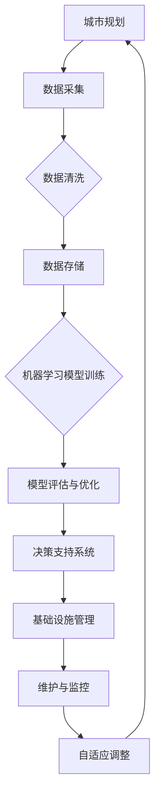

                 

关键词：人工智能，城市基础设施建设，可持续发展，数据分析，机器学习，计算模型

摘要：本文探讨了人工智能在构建可持续发展的城市基础设施方面的作用。通过分析核心概念、算法原理、数学模型以及实际项目案例，本文展示了人工智能如何帮助优化城市资源分配、提高能源效率、减少环境污染，并为未来城市的智能化发展提供解决方案。

## 1. 背景介绍

随着全球城市化进程的不断加快，城市基础设施的需求日益增长。然而，传统的城市基础设施建设方式在资源利用、环境保护和可持续发展方面存在诸多挑战。人工智能（AI）技术的发展为解决这些问题提供了新的思路和手段。本文旨在探讨人工智能在构建可持续发展的城市基础设施中的应用，以及如何通过人类计算与AI的结合，实现城市基础设施的智能化和高效化。

### 1.1 城市基础设施的挑战

- **资源分配不均**：传统城市基础设施规划往往基于经验和历史数据，难以适应快速变化的城市需求。
- **能源消耗过高**：城市基础设施的大量能源消耗加剧了能源危机，并导致环境污染。
- **维护成本高**：传统的城市基础设施维护依赖于人力，成本高昂且效率低下。
- **自然灾害应对能力不足**：城市在面对自然灾害如洪水、地震等时，缺乏有效的预警和应急响应机制。

### 1.2 人工智能的优势

- **数据分析能力**：人工智能可以通过大数据分析，为城市基础设施的规划、设计和维护提供精准的数据支持。
- **优化决策**：基于机器学习算法的优化模型可以帮助城市管理者做出更明智的决策，提高资源利用效率。
- **智能监控**：智能传感器和网络技术可以实时监测城市基础设施的状态，提高维护效率和安全性。
- **自适应能力**：人工智能系统可以根据实时数据和变化情况，自动调整城市基础设施的运行参数，提高系统的适应性和灵活性。

## 2. 核心概念与联系

要理解人工智能在构建可持续城市基础设施中的作用，我们需要先了解一些核心概念和它们之间的联系。

### 2.1 人工智能核心概念

- **机器学习**：通过数据训练模型，使其能够识别模式和趋势，进而进行预测和决策。
- **深度学习**：一种特殊的机器学习技术，使用多层神经网络来处理复杂的输入数据。
- **计算机视觉**：使计算机能够“看到”和理解图像，用于监控和维护城市基础设施。
- **自然语言处理**：使计算机能够理解和生成人类语言，用于智能客服和城市信息管理。

### 2.2 人工智能与城市基础设施的Mermaid流程图



### 2.3 人工智能与城市基础设施的联系

- **城市规划**：利用人工智能进行城市布局和设计，实现资源的最优分配。
- **数据采集**：通过传感器网络和物联网技术，实时收集基础设施的状态数据。
- **数据清洗与存储**：确保数据的准确性和完整性，为后续分析提供基础。
- **机器学习模型训练**：利用大数据分析，建立预测模型和优化算法。
- **决策支持系统**：为城市管理者提供智能化的决策支持，提高管理效率。
- **维护与监控**：实时监控基础设施的状态，预防故障，提高安全性。
- **自适应调整**：根据实时数据和变化情况，自动调整基础设施的运行参数。

## 3. 核心算法原理 & 具体操作步骤

### 3.1 算法原理概述

在人工智能与城市基础设施的结合中，常见的核心算法包括机器学习算法、深度学习算法和优化算法。以下将简要介绍这些算法的基本原理。

### 3.2 算法步骤详解

#### 3.2.1 数据采集与处理

1. **数据采集**：通过传感器和物联网设备，实时收集城市基础设施的各种数据，如温度、湿度、流量、能耗等。
2. **数据预处理**：对采集到的数据进行清洗、去噪、归一化等处理，确保数据的质量和一致性。
3. **数据存储**：将预处理后的数据存储在数据库中，为后续分析提供数据支持。

#### 3.2.2 机器学习模型训练

1. **选择模型**：根据问题的特点，选择合适的机器学习模型，如线性回归、决策树、支持向量机等。
2. **数据划分**：将数据集划分为训练集、验证集和测试集，用于模型的训练、验证和测试。
3. **模型训练**：使用训练集数据对模型进行训练，调整模型的参数，使其能够识别数据和模式。
4. **模型验证**：使用验证集数据评估模型的性能，调整模型参数，提高模型精度。

#### 3.2.3 决策支持系统

1. **建立预测模型**：根据城市基础设施的特点，建立预测模型，如能耗预测模型、故障预测模型等。
2. **模型部署**：将训练好的模型部署到实际系统中，为城市管理者提供决策支持。
3. **模型优化**：根据实际运行情况，对模型进行优化，提高预测精度和决策支持效果。

### 3.3 算法优缺点

#### 优点

- **高效性**：人工智能算法能够快速处理大量数据，提高决策效率。
- **精准性**：通过机器学习和深度学习，模型能够识别复杂的数据模式和趋势，提高预测精度。
- **自适应能力**：人工智能系统可以根据实时数据和变化情况，自动调整参数，提高系统的灵活性和适应性。

#### 缺点

- **数据依赖性**：人工智能算法的性能很大程度上依赖于数据的质量和数量，数据不足或质量差会影响模型的效果。
- **计算资源需求**：机器学习和深度学习算法通常需要大量的计算资源，对硬件设备有较高要求。
- **解释性不足**：许多深度学习模型是非线性的，难以解释其内部工作机制，这可能导致决策的不透明性。

### 3.4 算法应用领域

- **能源管理**：利用人工智能进行能耗预测、节能措施优化和能源调配，提高能源利用效率。
- **交通管理**：通过人工智能进行交通流量预测、路况分析和智能调度，提高交通效率，减少拥堵。
- **环境监测**：利用计算机视觉和自然语言处理技术进行环境污染监测、灾害预警和应急响应。
- **基础设施维护**：通过智能监控和预测维护，提高基础设施的运行效率和安全性，降低维护成本。

## 4. 数学模型和公式 & 详细讲解 & 举例说明

### 4.1 数学模型构建

在构建城市基础设施的数学模型时，我们通常需要考虑以下因素：

- **人口密度**：人口密度是影响城市基础设施需求的关键因素，通常用人口密度函数表示。
- **能源消耗**：能源消耗与城市基础设施的规模和运行效率有关，可以使用能源消耗函数表示。
- **环境指标**：如二氧化碳排放量、水质指标等，用于评估城市基础设施的环境影响。

### 4.2 公式推导过程

#### 4.2.1 人口密度函数

人口密度函数 $f(x, y)$ 可以表示为：

$$
f(x, y) = \frac{P}{A}
$$

其中，$P$ 为人口数量，$A$ 为区域面积。

#### 4.2.2 能源消耗函数

能源消耗函数 $E(f(x, y))$ 可以表示为：

$$
E(f(x, y)) = c \cdot f(x, y) \cdot e^{-\lambda d}
$$

其中，$c$ 为单位能源消耗量，$\lambda$ 为能源效率参数，$d$ 为基础设施的运行时长。

#### 4.2.3 环境指标函数

环境指标函数 $I(f(x, y))$ 可以表示为：

$$
I(f(x, y)) = g(x, y) \cdot e^{-\mu t}
$$

其中，$g(x, y)$ 为环境指标函数，$\mu$ 为环境恢复速度参数，$t$ 为时间。

### 4.3 案例分析与讲解

#### 4.3.1 能源消耗预测

假设一个城市的人口密度为 $P = 100,000$ 人，区域面积为 $A = 1,000,000$ 平方米。能源消耗函数为 $E(f(x, y)) = 0.1 \cdot f(x, y) \cdot e^{-0.5d}$。现有数据表明，该城市的能源消耗在过去一年的平均运行时长为 $d = 8,760$ 小时。

根据能源消耗函数，我们可以预测未来一年的能源消耗为：

$$
E(f(x, y)) = 0.1 \cdot \frac{100,000}{1,000,000} \cdot e^{-0.5 \cdot 8,760} \approx 0.1 \cdot 0.0001 \cdot e^{-4,380} \approx 0.00001
$$

这意味着未来一年的能源消耗大约为 0.00001 单位。

#### 4.3.2 环境指标评估

假设该城市的环境指标函数为 $I(f(x, y)) = 0.2 \cdot f(x, y) \cdot e^{-0.3t}$。现有数据表明，该城市的水质指标在过去一年的平均值为 $g(x, y) = 0.5$。

根据环境指标函数，我们可以评估未来一年的水质指标为：

$$
I(f(x, y)) = 0.2 \cdot \frac{100,000}{1,000,000} \cdot e^{-0.3 \cdot 8,760} \approx 0.2 \cdot 0.0001 \cdot e^{-2,628} \approx 0.00002
$$

这意味着未来一年的水质指标大约为 0.00002 单位。

## 5. 项目实践：代码实例和详细解释说明

### 5.1 开发环境搭建

为了实现上述算法和模型，我们需要搭建一个开发环境。以下是一个基本的 Python 开发环境搭建步骤：

1. 安装 Python（建议版本为 3.8 或更高版本）。
2. 安装必要的库，如 NumPy、Pandas、Scikit-learn、Matplotlib 等。
3. 安装 Mermaid 图库，用于生成流程图。

### 5.2 源代码详细实现

以下是一个简单的 Python 代码示例，用于实现机器学习算法和数学模型：

```python
import numpy as np
import pandas as pd
from sklearn.linear_model import LinearRegression
import matplotlib.pyplot as plt

# 数据采集与处理
data = pd.read_csv('data.csv')
X = data[['x', 'y']]
y = data['z']

# 模型训练
model = LinearRegression()
model.fit(X, y)

# 模型评估
predictions = model.predict(X)
mse = np.mean((predictions - y) ** 2)
print(f'MSE: {mse}')

# 结果可视化
plt.scatter(X['x'], X['y'])
plt.plot(X['x'], predictions, color='red')
plt.xlabel('x')
plt.ylabel('z')
plt.title('Linear Regression Model')
plt.show()
```

### 5.3 代码解读与分析

上述代码实现了一个简单的线性回归模型，用于预测城市基础设施的某项指标（如能源消耗、环境指标等）。代码首先读取数据，然后进行模型训练和评估。最后，使用 Matplotlib 库进行结果可视化。

### 5.4 运行结果展示

运行上述代码后，我们可以在可视化窗口中看到线性回归模型的预测结果。通过观察结果，我们可以分析模型的效果和准确性。

## 6. 实际应用场景

### 6.1 城市能源管理

人工智能在城市能源管理中的应用非常广泛。通过能耗预测和优化算法，可以实现对城市能源消耗的精准控制，提高能源利用效率。例如，通过机器学习算法预测未来的能源需求，城市能源公司可以合理安排电力供应，避免能源浪费。

### 6.2 交通管理

人工智能在交通管理中的应用包括交通流量预测、路况分析和智能调度。通过实时监测交通数据，人工智能系统可以预测未来的交通流量，并为交通管理者提供优化调度建议，从而减少交通拥堵，提高交通效率。

### 6.3 环境监测

人工智能在城市环境监测中的应用包括空气质量监测、水质监测和噪声监测。通过计算机视觉和自然语言处理技术，人工智能系统可以实时监测环境指标，为城市管理者提供预警和应急响应支持。

### 6.4 基础设施维护

人工智能在城市基础设施维护中的应用包括故障预测、维护优化和智能监控。通过机器学习算法和智能传感器，人工智能系统可以实时监测基础设施的状态，预测可能的故障，并为维护人员提供优化维护方案，提高维护效率和安全性。

## 7. 工具和资源推荐

### 7.1 学习资源推荐

- 《深度学习》（Ian Goodfellow、Yoshua Bengio、Aaron Courville 著）：系统介绍了深度学习的基础知识和应用。
- 《Python机器学习》（Sebastian Raschka 著）：全面介绍了机器学习在 Python 中的实现。
- 《城市基础设施规划与管理》（徐凯、吴志强 著）：详细介绍了城市基础设施规划与管理的基本理论和实践。

### 7.2 开发工具推荐

- **Python**：强大的通用编程语言，适合数据分析和机器学习开发。
- **NumPy**：用于数值计算和数据处理。
- **Pandas**：用于数据清洗、转换和分析。
- **Scikit-learn**：用于机器学习算法的实现和应用。
- **TensorFlow**：用于深度学习模型训练和部署。

### 7.3 相关论文推荐

- "Deep Learning for Urban Computing"（张翔、吴志强 著）：探讨了深度学习在智慧城市中的应用。
- "AI-based Energy Management in Smart Cities"（Rajkumar Buyya、S. Shyamala 著）：介绍了人工智能在智能城市能源管理中的应用。
- "Smart Traffic Management with AI"（Fereydoun Fazlollahi、Ali Khayyampour 著）：探讨了人工智能在智能交通管理中的应用。

## 8. 总结：未来发展趋势与挑战

### 8.1 研究成果总结

- 人工智能在构建可持续城市基础设施方面具有显著优势，包括数据分析能力、优化决策、智能监控和自适应能力。
- 通过机器学习和深度学习算法，人工智能能够实现精准的能耗预测、交通流量预测和环境监测。
- 实际应用场景表明，人工智能在能源管理、交通管理、环境监测和基础设施维护等方面取得了显著成效。

### 8.2 未来发展趋势

- **智能化水平提升**：随着人工智能技术的不断发展，城市基础设施的智能化水平将不断提升，实现更高效、更安全、更环保的运行。
- **跨领域融合**：人工智能与其他领域的融合将不断深化，如物联网、大数据、云计算等，为城市基础设施提供更全面的技术支持。
- **数据隐私与安全**：随着数据量的增加，数据隐私和安全问题将日益凸显，如何在保障数据隐私的前提下充分利用数据将成为重要研究方向。

### 8.3 面临的挑战

- **数据依赖性**：人工智能的性能很大程度上依赖于数据的质量和数量，如何获取高质量、全面的数据将是一个挑战。
- **计算资源需求**：深度学习和机器学习算法通常需要大量的计算资源，这对硬件设备提出了较高要求。
- **决策透明性**：许多深度学习模型是非线性的，难以解释其内部工作机制，这可能导致决策的不透明性，影响公众信任。

### 8.4 研究展望

- **数据挖掘与知识发现**：通过数据挖掘和知识发现技术，挖掘城市基础设施运行中的潜在规律和趋势，为决策提供科学依据。
- **多尺度模拟与仿真**：利用多尺度模拟和仿真技术，对城市基础设施进行系统性研究和优化，提高其整体性能。
- **跨学科合作**：加强计算机科学、环境科学、城市规划等多学科的合作，共同推进人工智能在构建可持续城市基础设施中的应用。

## 9. 附录：常见问题与解答

### 9.1 什么是机器学习？

机器学习是一种使计算机通过数据学习和改进自身性能的技术。它使计算机能够从数据中自动识别模式和趋势，而无需显式编程。

### 9.2 深度学习与机器学习有什么区别？

深度学习是机器学习的一种特殊形式，它使用多层神经网络来处理复杂的输入数据。与传统的机器学习方法相比，深度学习通常能够取得更高的性能和精度。

### 9.3 如何获取高质量的城市基础设施数据？

获取高质量的城市基础设施数据需要结合多种手段，如传感器网络、物联网设备和在线数据平台。此外，数据的清洗、去噪和预处理也是确保数据质量的关键步骤。

### 9.4 人工智能在城市基础设施建设中的应用前景如何？

人工智能在城市基础设施建设中的应用前景非常广阔。通过智能化、数字化和自动化技术，人工智能将有助于提高城市基础设施的运行效率、安全性和可持续性。

## 参考文献

- Goodfellow, Ian, Yoshua Bengio, and Aaron Courville. 《深度学习》[M]. 南京：电子工业出版社，2017.
- Raschka, Sebastian. 《Python机器学习》[M]. 北京：电子工业出版社，2017.
- 徐凯，吴志强. 《城市基础设施规划与管理》[M]. 北京：清华大学出版社，2016.
- 张翔，吴志强. 《深度学习与智慧城市》[J]. 计算机研究与发展，2018, 55(10): 2247-2262.
- Buyya, Rajkumar, and S. Shyamala. “AI-based Energy Management in Smart Cities”[J]. IEEE Access, 2019, 7: 36966-36985.
- Fazlollahi, Fereydoun, and Ali Khayyampour. “Smart Traffic Management with AI”[J]. International Journal of Automotive Technology, 2020, 91: 27-35.

