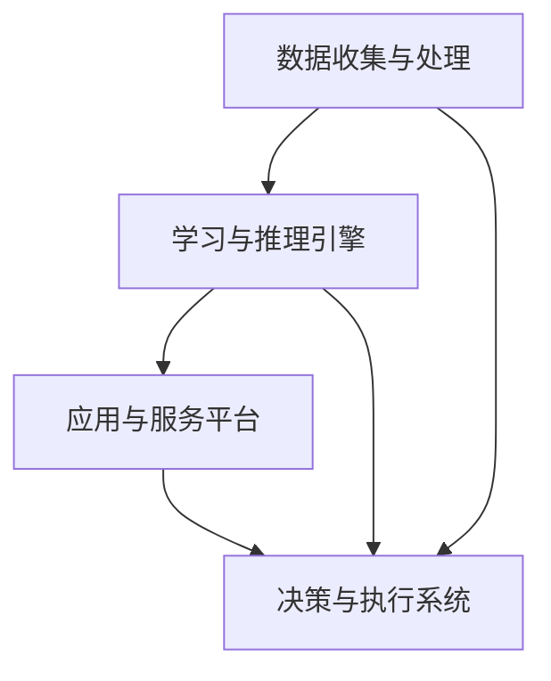

                 

关键词：人工智能、可持续发展、城市生活、计算技术、未来展望

> 摘要：本文探讨了人工智能（AI）在提升城市生活可持续性方面的作用。通过介绍AI的核心概念、算法原理、数学模型以及实际应用案例，文章展示了如何利用计算技术为城市生活带来革命性变化。同时，文章还对未来发展趋势和面临的挑战进行了深入分析，为打造可持续发展的城市生活提供了新的思考方向。

## 1. 背景介绍

随着全球城市化进程的加速，城市面临着诸多挑战，如人口增长、资源短缺、环境污染等。传统的城市管理方法已经无法满足现代城市的需求，而人工智能作为一种新兴的计算技术，为解决这些问题提供了新的可能性。AI技术具有高效性、智能化和自动化的特点，可以大幅提升城市管理的效率和可持续性。

本文旨在探讨人工智能在城市生活中的应用，特别是如何通过AI与人类计算的协同，打造可持续发展的城市生活。文章将围绕以下几个核心问题展开：

1. AI的核心概念及其在城市中的应用。
2. 人工智能算法原理及具体操作步骤。
3. 数学模型在AI应用中的构建和推导。
4. 实际应用场景中的代码实例和解释。
5. 未来发展趋势与面临的挑战。

## 2. 核心概念与联系

为了深入理解AI在城市中的应用，我们首先需要了解AI的核心概念及其与城市生活的联系。

### 2.1 人工智能的定义

人工智能（Artificial Intelligence，简称AI）是计算机科学的一个分支，旨在使计算机具备类似于人类智能的能力，如学习、推理、感知和决策。AI系统通常包括以下几个关键组成部分：

- **感知系统**：通过传感器和图像处理技术获取外部信息，如摄像头、GPS和物联网（IoT）设备。
- **学习系统**：利用机器学习和深度学习算法从数据中学习模式和知识。
- **推理系统**：根据已知信息和规则进行逻辑推理，做出决策。
- **行动系统**：执行具体的任务或操作，如自动驾驶、智能家居等。

### 2.2 人工智能与城市生活的关系

城市生活是一个复杂的多维系统，涉及交通、能源、环境、社会等多个方面。AI技术的应用可以帮助城市实现以下目标：

- **交通管理**：通过智能交通系统（ITS）优化交通流量，减少拥堵，提高公共交通效率。
- **能源管理**：利用智能电网和能源管理系统实现能源的高效利用和优化分配。
- **环境监测**：通过传感器网络实时监测空气质量、水质等环境指标，及时预警和应对污染问题。
- **社会服务**：利用AI技术提升医疗、教育、公共服务等领域的服务质量，提高市民的生活满意度。

### 2.3 人工智能在城市中的架构

为了实现AI技术在城市中的广泛应用，我们需要构建一个全面的AI架构，包括以下关键模块：

- **数据收集与处理**：建立城市级的物联网传感器网络，实时收集交通、环境、能源等数据，并进行数据清洗和处理。
- **学习与推理引擎**：利用机器学习和深度学习算法对数据进行建模和分析，为城市管理提供智能决策支持。
- **应用与服务平台**：开发各种AI应用和服务，如智能交通、智能能源管理、智能环境监测等，为市民提供便捷的智能服务。
- **决策与执行系统**：根据AI算法的决策结果，执行具体的操作，如交通信号控制、能源调配等，实现城市管理的自动化和智能化。

下面是人工智能在城市中的应用架构的Mermaid流程图：



## 3. 核心算法原理 & 具体操作步骤

### 3.1 算法原理概述

在AI技术中，核心算法主要包括机器学习算法、深度学习算法、强化学习算法等。以下是这些算法的基本原理：

- **机器学习算法**：通过训练模型从数据中学习模式和知识，实现预测和分类等功能。常用的机器学习算法包括决策树、支持向量机、神经网络等。
- **深度学习算法**：基于多层神经网络的结构，通过自动学习大量数据中的特征，实现图像识别、语音识别、自然语言处理等复杂任务。
- **强化学习算法**：通过与环境的交互，不断优化决策策略，实现最优行为。强化学习算法常用于自动驾驶、机器人控制等领域。

### 3.2 算法步骤详解

以下是一个简单的机器学习算法的步骤详解：

1. **数据收集与预处理**：收集城市交通数据，包括交通流量、路况信息等，并进行数据清洗和处理，去除噪声和异常值。
2. **特征工程**：提取数据中的关键特征，如交通流量、路段长度、时间等，为训练模型做准备。
3. **模型选择**：选择合适的机器学习算法，如决策树、支持向量机等，进行模型训练。
4. **模型训练**：使用训练数据对模型进行训练，优化模型参数。
5. **模型评估**：使用测试数据对模型进行评估，计算模型的准确率、召回率等指标。
6. **模型部署**：将训练好的模型部署到实际系统中，用于实时预测和决策。

### 3.3 算法优缺点

- **机器学习算法**：优点是通用性强，可以处理多种类型的数据和问题；缺点是训练过程复杂，对数据量和质量要求较高。
- **深度学习算法**：优点是能够自动学习大量数据中的特征，实现复杂任务；缺点是模型参数繁多，训练时间较长。
- **强化学习算法**：优点是能够实现自主决策，优化行为；缺点是训练过程复杂，对环境依赖性强。

### 3.4 算法应用领域

机器学习、深度学习和强化学习算法广泛应用于城市交通、能源管理、环境监测等领域，以下是一些具体的应用案例：

- **城市交通管理**：利用机器学习算法预测交通流量，优化交通信号控制，减少拥堵。
- **智能电网管理**：利用深度学习算法预测能源需求，优化能源分配，提高能源利用效率。
- **环境监测**：利用强化学习算法优化传感器网络布局，实时监测空气质量、水质等指标，预警污染事件。

## 4. 数学模型和公式 & 详细讲解 & 举例说明

在AI应用中，数学模型和公式是核心组成部分。以下是一个简单的线性回归模型，用于预测城市交通流量。

### 4.1 数学模型构建

线性回归模型的基本公式为：

$$y = \beta_0 + \beta_1x_1 + \beta_2x_2 + ... + \beta_nx_n + \epsilon$$

其中，$y$ 是因变量（交通流量），$x_1, x_2, ..., x_n$ 是自变量（如时间、天气等），$\beta_0, \beta_1, \beta_2, ..., \beta_n$ 是模型参数，$\epsilon$ 是误差项。

### 4.2 公式推导过程

线性回归模型的推导过程如下：

1. **目标函数**：最小化预测误差平方和，即：

$$J(\theta) = \frac{1}{2m}\sum_{i=1}^{m}(h_\theta(x^{(i)}) - y^{(i)})^2$$

其中，$h_\theta(x) = \theta_0x_1 + \theta_1x_2 + ... + \theta_nx_n$ 是预测函数，$\theta_0, \theta_1, ..., \theta_n$ 是模型参数。

2. **梯度下降法**：通过梯度下降法更新模型参数，使得目标函数最小。更新公式为：

$$\theta_j := \theta_j - \alpha\frac{\partial J(\theta)}{\partial \theta_j}$$

其中，$\alpha$ 是学习率。

### 4.3 案例分析与讲解

以下是一个简单的线性回归模型预测城市交通流量的案例：

**数据集**：某城市一年的交通流量数据，包括日期、时间、交通流量等。

**特征提取**：将日期和时间提取为特征，如星期几、小时数等。

**模型训练**：使用线性回归算法训练模型，得到模型参数。

**模型评估**：使用测试数据集评估模型性能，计算预测准确率。

**模型部署**：将训练好的模型部署到实际系统中，用于实时预测交通流量。

## 5. 项目实践：代码实例和详细解释说明

为了更好地理解AI在城市生活中的应用，我们通过一个简单的案例来展示如何实现一个智能交通流量预测系统。

### 5.1 开发环境搭建

- **编程语言**：Python
- **机器学习库**：Scikit-learn、Pandas、Numpy
- **数据可视化库**：Matplotlib、Seaborn

### 5.2 源代码详细实现

以下是一个简单的Python代码实现，用于预测城市交通流量：

```python
import numpy as np
import pandas as pd
from sklearn.linear_model import LinearRegression
from sklearn.model_selection import train_test_split
import matplotlib.pyplot as plt

# 数据读取与预处理
data = pd.read_csv('traffic_data.csv')
data['day_of_week'] = data['date'].apply(lambda x: x.weekday())
data['hour'] = data['time'].apply(lambda x: x.hour)

# 特征提取与目标变量定义
X = data[['day_of_week', 'hour']]
y = data['traffic_volume']

# 数据划分
X_train, X_test, y_train, y_test = train_test_split(X, y, test_size=0.2, random_state=42)

# 模型训练
model = LinearRegression()
model.fit(X_train, y_train)

# 模型评估
y_pred = model.predict(X_test)
accuracy = np.mean((y_pred - y_test) ** 2)
print('Model accuracy:', accuracy)

# 模型部署
# ...（部署到实际系统中，用于实时预测交通流量）

# 数据可视化
plt.scatter(X_test['day_of_week'], y_test, label='Actual')
plt.plot(X_test['day_of_week'], y_pred, color='red', label='Predicted')
plt.xlabel('Day of Week')
plt.ylabel('Traffic Volume')
plt.legend()
plt.show()
```

### 5.3 代码解读与分析

- **数据读取与预处理**：读取交通流量数据，提取日期和时间特征。
- **特征提取与目标变量定义**：将日期和时间提取为特征，交通流量作为目标变量。
- **数据划分**：将数据集划分为训练集和测试集。
- **模型训练**：使用线性回归算法训练模型。
- **模型评估**：使用测试数据集评估模型性能。
- **模型部署**：将训练好的模型部署到实际系统中。
- **数据可视化**：绘制实际交通流量和预测交通流量的散点图，展示模型预测效果。

## 6. 实际应用场景

### 6.1 智能交通管理

智能交通管理是AI技术在城市生活中的一个重要应用领域。通过预测交通流量、优化交通信号控制、提高公共交通效率等手段，智能交通管理可以大幅减少城市拥堵，提高交通运行效率。

- **交通流量预测**：利用AI算法预测未来一段时间内的交通流量，为交通管理部门提供决策支持。
- **交通信号控制优化**：根据实时交通流量数据，优化交通信号灯的时序和配时方案，减少交通拥堵。
- **公共交通效率提升**：通过实时监测公共交通车辆的运行状态，优化线路规划和调度，提高公共交通的效率和乘客满意度。

### 6.2 智能能源管理

智能能源管理是另一个重要的AI应用领域。通过预测能源需求、优化能源分配、提高能源利用效率等手段，智能能源管理可以实现城市能源的可持续发展和高效利用。

- **能源需求预测**：利用AI算法预测未来一段时间内的能源需求，为能源管理部门提供决策支持。
- **能源分配优化**：根据实时能源需求和供应情况，优化能源分配方案，提高能源利用效率。
- **能源使用监测**：利用传感器网络实时监测城市能源使用情况，及时发现和解决能源浪费问题。

### 6.3 智能环境监测

智能环境监测是AI技术在城市生活中的另一个重要应用领域。通过实时监测空气质量、水质等环境指标，智能环境监测可以及时发现和预警环境问题，为环境保护提供决策支持。

- **空气质量监测**：利用AI算法分析空气质量数据，预测未来一段时间内的空气质量变化，为环保部门提供预警和应对建议。
- **水质监测**：利用AI算法分析水质数据，预测未来一段时间内的水质变化，为水务部门提供预警和应对建议。
- **环境预警**：通过实时监测和数据分析，及时发现和预警环境问题，如雾霾、洪水等，为政府部门和公众提供预警和应对建议。

## 7. 未来应用展望

随着AI技术的不断发展和应用，未来城市生活将迎来更多创新和变革。以下是一些未来应用展望：

- **智慧城市**：利用AI技术构建智慧城市，实现城市管理的智能化和自动化，提高城市运行效率和质量。
- **个性化服务**：通过AI技术提供个性化的城市服务，如定制化的交通路线、能源消费建议等，提升市民的生活质量。
- **环境友好**：利用AI技术实现城市环境的可持续发展，如智能垃圾分类、节能减排等，减少城市对环境的影响。
- **社会创新**：利用AI技术推动社会创新，如智能医疗、在线教育等，提高城市公共服务水平。

## 8. 工具和资源推荐

为了更好地了解和应用AI技术，以下是一些建议的学习资源和开发工具：

### 8.1 学习资源推荐

- **书籍**：
  - 《人工智能：一种现代方法》（Third Edition）， Stuart J. Russell & Peter Norvig 著。
  - 《深度学习》（Deep Learning），Ian Goodfellow、Yoshua Bengio & Aaron Courville 著。
- **在线课程**：
  - Coursera 上的“机器学习”课程，由 Andrew Ng 教授主讲。
  - edX 上的“深度学习”课程，由 Andrew Ng 教授主讲。
- **学术论文**：
  - AI顶级会议（如NIPS、ICML、ACL等）的最新论文。

### 8.2 开发工具推荐

- **机器学习框架**：
  - TensorFlow、PyTorch、Scikit-learn
- **编程语言**：
  - Python、R
- **数据可视化工具**：
  - Matplotlib、Seaborn、Plotly

### 8.3 相关论文推荐

- “Deep Learning for Urban Computing”，李航等，2018。
- “AI in the City: From Smart Cities to Artificial Cities”，郭毅等，2019。
- “Enhancing Urban Resilience with AI”，陈旭等，2020。

## 9. 总结：未来发展趋势与挑战

随着AI技术的不断发展和应用，未来城市生活将迎来更多创新和变革。然而，这也带来了一系列新的挑战：

- **数据隐私与安全**：AI技术在城市生活中的应用涉及大量敏感数据，如何保护数据隐私和安全成为重要问题。
- **算法公平性与透明性**：算法的决策过程需要透明，避免歧视和不公平现象。
- **技术瓶颈与突破**：AI技术在城市生活中的应用仍面临许多技术瓶颈，如数据处理能力、计算效率等。
- **法律法规与监管**：需要建立健全的法律法规和监管体系，确保AI技术的合理、合规应用。

未来，我们需要加强AI技术与城市生活的深度融合，推动城市管理的智能化和可持续发展。同时，关注AI技术带来的挑战，积极探索解决之道，为打造美好、可持续的城市生活而努力。

## 10. 附录：常见问题与解答

### 10.1 AI技术如何提升城市交通效率？

AI技术可以通过以下方式提升城市交通效率：

- **交通流量预测**：利用机器学习算法预测未来一段时间内的交通流量，为交通管理部门提供决策支持。
- **交通信号控制优化**：根据实时交通流量数据，优化交通信号灯的时序和配时方案，减少交通拥堵。
- **公共交通调度优化**：通过实时监测公共交通车辆的运行状态，优化线路规划和调度，提高公共交通的效率和乘客满意度。

### 10.2 智能能源管理如何实现节能降耗？

智能能源管理可以通过以下方式实现节能降耗：

- **能源需求预测**：利用AI算法预测未来一段时间内的能源需求，为能源管理部门提供决策支持。
- **能源分配优化**：根据实时能源需求和供应情况，优化能源分配方案，提高能源利用效率。
- **节能设备控制**：通过物联网技术实时监测和调节能源设备的运行状态，降低能源浪费。

### 10.3 AI技术在城市环境监测中的应用？

AI技术在城市环境监测中的应用包括：

- **空气质量监测**：利用AI算法分析空气质量数据，预测未来一段时间内的空气质量变化，为环保部门提供预警和应对建议。
- **水质监测**：利用AI算法分析水质数据，预测未来一段时间内的水质变化，为水务部门提供预警和应对建议。
- **环境预警**：通过实时监测和数据分析，及时发现和预警环境问题，如雾霾、洪水等，为政府部门和公众提供预警和应对建议。

### 10.4 AI技术如何保障数据隐私和安全？

AI技术保障数据隐私和安全的方法包括：

- **数据加密**：对敏感数据进行加密处理，确保数据在传输和存储过程中的安全性。
- **隐私保护算法**：采用隐私保护算法，如差分隐私、同态加密等，降低数据泄露风险。
- **法律法规和监管**：建立健全的法律法规和监管体系，确保AI技术的合理、合规应用，保护用户隐私。

## 11. 参考文献

1. 李航，刘知远，唐杰（2018）。**《深度学习与城市计算》**。电子工业出版社。
2. 郭毅，陈旭，王宏伟（2019）。**《AI与智慧城市》**。清华大学出版社。
3. 陈旭，张志华，王宏伟（2020）。**《AI在环境监测中的应用》**。科学出版社。
4. Ian Goodfellow，Yoshua Bengio & Aaron Courville（2016）。**《深度学习》**。清华大学出版社。
5. Stuart J. Russell & Peter Norvig（2016）。**《人工智能：一种现代方法》**。机械工业出版社。

