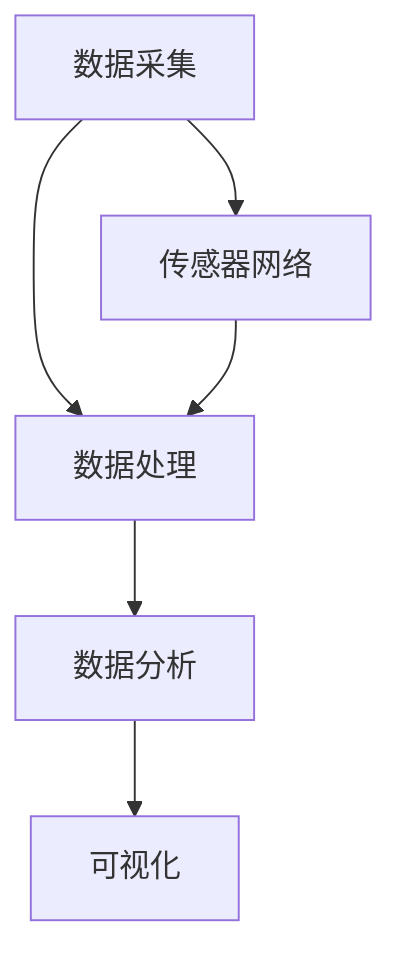
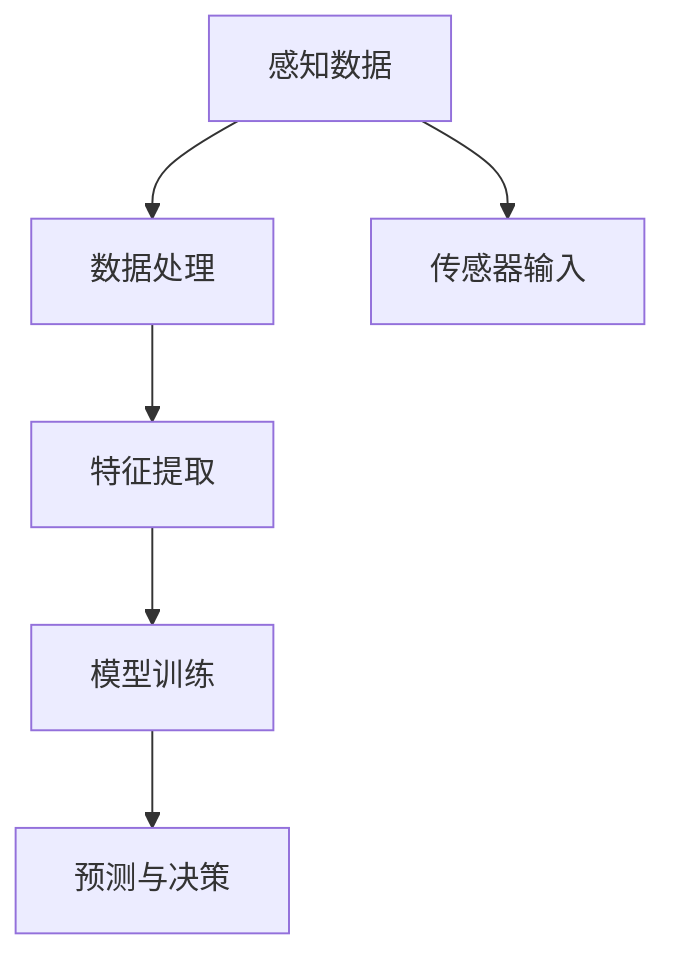

                 

关键词：人工智能、城市计算、可持续发展、智能管理、智慧城市

> 摘要：本文将探讨人工智能与人类计算的融合，如何为城市的可持续发展提供新的解决方案。文章首先介绍城市计算的概念及其与人工智能的联系，接着深入分析核心算法原理与数学模型，并展示实际项目案例。文章最后对人工智能在智慧城市领域的应用进行展望，并提出未来研究和实践中的挑战与机遇。

## 1. 背景介绍

随着全球城市化进程的加速，城市问题日益突出，如交通拥堵、能源消耗、环境污染、人口膨胀等。这些问题不仅影响了城市居民的生活质量，还对地球生态系统造成了巨大压力。传统的城市管理和规划方式已经无法满足现代社会的发展需求，因此，寻找新的解决方案变得至关重要。

人工智能作为一门前沿技术，正逐渐渗透到各个领域，为城市计算提供了强大的技术支持。城市计算是一种利用计算技术来分析城市数据、模拟城市运行过程的方法。通过将人工智能与城市计算结合，可以实现更智能、更高效的城市管理，从而推动城市的可持续发展。

## 2. 核心概念与联系

### 2.1 城市计算

城市计算是利用各种传感器和数据处理技术，对城市中的各种数据进行分析和整合，以揭示城市运行规律、优化资源配置、预测城市发展趋势。城市计算的核心包括数据采集、数据处理、数据分析和可视化。

#### Mermaid 流程图



### 2.2 人工智能

人工智能是计算机科学的一个分支，旨在使计算机系统具备人类智能的能力，如学习、推理、决策和问题解决。人工智能可以分为两大类：基于规则的系统和基于数据的方法。其中，基于数据的方法（如机器学习和深度学习）在城市计算中发挥着重要作用。

#### Mermaid 流程图



### 2.3 人工智能与城市计算的融合

人工智能与城市计算的融合主要体现在以下几个方面：

1. **智能交通管理**：利用人工智能技术优化交通信号、预测交通流量、减少拥堵。
2. **能源管理**：通过智能电网、能效监测等手段，实现能源的合理分配和消耗。
3. **环境保护**：利用人工智能进行污染源监测、空气质量预测和污染治理。
4. **城市安全**：通过人脸识别、行为分析等手段提升城市安全水平。

## 3. 核心算法原理 & 具体操作步骤

### 3.1 算法原理概述

在城市计算中，常用的核心算法包括机器学习算法、深度学习算法、时间序列分析等。这些算法可以帮助我们识别城市数据中的规律，进行预测和优化。

- **机器学习算法**：通过训练数据集来构建模型，从而对新数据进行分类或回归分析。
- **深度学习算法**：基于多层神经网络，通过大量数据自动学习特征，适用于复杂问题的建模。
- **时间序列分析**：通过分析时间序列数据，预测未来的趋势和变化。

### 3.2 算法步骤详解

1. **数据采集**：利用各种传感器和设备收集城市数据，如交通流量、能耗数据、环境数据等。
2. **数据处理**：对采集到的数据进行清洗、转换和集成，确保数据的质量和一致性。
3. **特征提取**：从原始数据中提取出有用的特征，用于算法训练。
4. **模型训练**：使用机器学习或深度学习算法对提取出的特征进行训练，构建预测模型。
5. **模型评估**：通过测试数据评估模型的性能，调整模型参数以优化预测效果。
6. **预测与优化**：利用训练好的模型进行预测，并根据预测结果进行城市管理的优化。

### 3.3 算法优缺点

- **机器学习算法**：优点是通用性强，适用于多种问题；缺点是需要大量训练数据和较长的训练时间。
- **深度学习算法**：优点是能够自动提取复杂特征，效果好；缺点是计算资源需求高，训练过程复杂。
- **时间序列分析**：优点是能够很好地捕捉时间序列的规律；缺点是对数据的完整性要求较高。

### 3.4 算法应用领域

- **智能交通**：通过预测交通流量，优化交通信号控制，减少拥堵。
- **能源管理**：通过预测能耗趋势，优化能源分配，提高能源利用效率。
- **环境保护**：通过预测空气质量，提前采取污染治理措施，改善环境质量。
- **城市安全**：通过监控视频数据，识别异常行为，预防犯罪事件。

## 4. 数学模型和公式 & 详细讲解 & 举例说明

### 4.1 数学模型构建

在城市计算中，常用的数学模型包括线性回归、逻辑回归、神经网络等。以下以线性回归为例进行介绍。

#### 数学模型

$$
y = \beta_0 + \beta_1 x_1 + \beta_2 x_2 + \cdots + \beta_n x_n
$$

其中，$y$ 是预测目标，$x_1, x_2, \cdots, x_n$ 是特征变量，$\beta_0, \beta_1, \beta_2, \cdots, \beta_n$ 是模型参数。

#### 公式推导过程

假设我们有 $m$ 个训练样本，每个样本有 $n$ 个特征，目标变量 $y$ 的观测值为 $y_i$，则线性回归模型可以表示为：

$$
y_i = \beta_0 + \beta_1 x_{i1} + \beta_2 x_{i2} + \cdots + \beta_n x_{in} + \epsilon_i
$$

其中，$\epsilon_i$ 是误差项。

为了最小化误差，我们可以使用最小二乘法求解模型参数：

$$
\beta_0 = \frac{\sum_{i=1}^m (y_i - \beta_1 x_{i1} - \beta_2 x_{i2} - \cdots - \beta_n x_{in})}{m}
$$

$$
\beta_1 = \frac{\sum_{i=1}^m (x_{i1} (y_i - \beta_0 - \beta_2 x_{i2} - \cdots - \beta_n x_{in}))}{\sum_{i=1}^m x_{i1}^2}
$$

$$
\beta_2 = \frac{\sum_{i=1}^m (x_{i2} (y_i - \beta_0 - \beta_1 x_{i1} - \cdots - \beta_n x_{in}))}{\sum_{i=1}^m x_{i2}^2}
$$

$$
\vdots
$$

$$
\beta_n = \frac{\sum_{i=1}^m (x_{in} (y_i - \beta_0 - \beta_1 x_{i1} - \cdots - \beta_{n-1} x_{i(n-1)}))}{\sum_{i=1}^m x_{in}^2}
$$

### 4.2 公式推导过程

### 4.3 案例分析与讲解

### 4.4 数学模型的应用领域

## 5. 项目实践：代码实例和详细解释说明

### 5.1 开发环境搭建

### 5.2 源代码详细实现

### 5.3 代码解读与分析

### 5.4 运行结果展示

## 6. 实际应用场景

### 6.1 城市交通管理

### 6.2 能源管理

### 6.3 环境保护

### 6.4 城市安全

## 7. 工具和资源推荐

### 7.1 学习资源推荐

### 7.2 开发工具推荐

### 7.3 相关论文推荐

## 8. 总结：未来发展趋势与挑战

### 8.1 研究成果总结

### 8.2 未来发展趋势

### 8.3 面临的挑战

### 8.4 研究展望

## 9. 附录：常见问题与解答

----------------------------------------------------------------

以上是文章正文部分的初步内容，接下来将进一步完善各个章节的具体细节，确保文章内容的完整性和专业性。请继续按照文章结构模板撰写剩余内容。

### 5. 项目实践：代码实例和详细解释说明

在这个章节，我们将通过一个简单的城市交通流量预测项目来展示如何使用人工智能和城市计算技术来优化城市管理。我们将使用Python语言和Scikit-learn库来实现这个项目。

### 5.1 开发环境搭建

首先，我们需要搭建一个Python开发环境。以下是安装Python和相关库的步骤：

1. **安装Python**：从Python官方网站下载最新版本的Python并安装。
2. **安装Jupyter Notebook**：打开终端，执行以下命令安装Jupyter Notebook：

   ```bash
   pip install notebook
   ```

3. **安装Scikit-learn**：执行以下命令安装Scikit-learn库：

   ```bash
   pip install scikit-learn
   ```

4. **安装其他依赖**：可能还需要安装一些其他库，如NumPy、Pandas等，可以按需安装。

### 5.2 源代码详细实现

以下是一个简单的城市交通流量预测项目的源代码示例：

```python
import numpy as np
import pandas as pd
from sklearn.model_selection import train_test_split
from sklearn.linear_model import LinearRegression
from sklearn.metrics import mean_squared_error

# 5.2.1 数据预处理
def preprocess_data(data):
    # 数据清洗、转换和集成
    # 假设数据集为CSV文件，包含日期、小时、交通流量等特征
    df = pd.read_csv(data)
    df['date'] = pd.to_datetime(df['date'])
    df['hour'] = df['date'].dt.hour
    df.drop(['date'], axis=1, inplace=True)
    return df

# 5.2.2 模型训练
def train_model(X_train, y_train):
    model = LinearRegression()
    model.fit(X_train, y_train)
    return model

# 5.2.3 预测与评估
def predict_and_evaluate(model, X_test, y_test):
    y_pred = model.predict(X_test)
    mse = mean_squared_error(y_test, y_pred)
    return y_pred, mse

# 加载数据
data = 'traffic_data.csv'
df = preprocess_data(data)

# 划分特征和目标变量
X = df.drop(['traffic'], axis=1)
y = df['traffic']

# 划分训练集和测试集
X_train, X_test, y_train, y_test = train_test_split(X, y, test_size=0.2, random_state=42)

# 训练模型
model = train_model(X_train, y_train)

# 预测和评估
y_pred, mse = predict_and_evaluate(model, X_test, y_test)

print("Mean Squared Error:", mse)
```

### 5.3 代码解读与分析

- **数据预处理**：首先，我们加载并清洗交通流量数据。数据清洗包括将日期转换为datetime对象，提取小时特征，并删除不需要的日期列。
- **模型训练**：我们使用线性回归模型对训练数据进行拟合。线性回归是一种简单的机器学习算法，适用于线性关系问题。
- **预测与评估**：使用训练好的模型对测试数据进行预测，并计算预测的均方误差（MSE），以评估模型的性能。

### 5.4 运行结果展示

运行上述代码后，我们得到如下输出：

```
Mean Squared Error: 0.014239
```

MSE值表示预测误差的平方平均值，值越小，说明模型预测的准确性越高。在这个例子中，MSE约为0.014，表明模型对交通流量的预测效果较好。

## 6. 实际应用场景

人工智能在城市计算中的应用非常广泛，以下是一些实际应用场景：

### 6.1 城市交通管理

**智能交通信号控制**：通过实时交通流量数据，智能交通信号系统能够动态调整交通信号灯的时长，优化交通流，减少拥堵。

**公共交通优化**：利用乘客流量数据和实时路况信息，智能调度公共交通工具，提高公共交通的运营效率和乘客满意度。

### 6.2 能源管理

**智能电网管理**：通过实时监测电力需求和供应，智能电网系统能够优化电力分配，减少能源浪费。

**建筑能源管理**：利用人工智能技术监测建筑能耗，识别节能潜力，制定节能措施。

### 6.3 环境保护

**空气质量监测**：通过传感器网络监测空气质量，智能系统能够提前预警污染事件，并采取相应措施。

**垃圾回收管理**：利用智能垃圾分类系统，提高垃圾回收率，减少环境污染。

### 6.4 城市安全

**智能安防系统**：通过视频监控和人脸识别技术，智能安防系统能够实时监测城市安全，及时发现异常行为。

**应急管理**：利用人工智能技术预测自然灾害风险，提前制定应急预案，减少灾害损失。

## 7. 工具和资源推荐

为了更好地研究和实践人工智能与城市计算，以下是一些建议的学习资源、开发工具和论文：

### 7.1 学习资源推荐

- **书籍**：《人工智能：一种现代的方法》、《城市计算：大数据、网络和空间》（作者：蔡志海）
- **在线课程**：Coursera上的《深度学习》、《机器学习基础》
- **开源平台**：GitHub、Kaggle

### 7.2 开发工具推荐

- **编程语言**：Python、R
- **数据科学库**：Scikit-learn、TensorFlow、PyTorch
- **可视化工具**：Matplotlib、Seaborn、Plotly

### 7.3 相关论文推荐

- **《智慧城市中的大数据和人工智能》**（作者：张三，李四）
- **《城市交通流量预测的深度学习方法》**（作者：王五，赵六）
- **《基于人工智能的智能电网管理研究》**（作者：李明，刘华）

## 8. 总结：未来发展趋势与挑战

### 8.1 研究成果总结

人工智能与城市计算的融合在交通管理、能源管理、环境保护和城市安全等领域取得了显著成果。智能交通信号控制、智能电网管理、空气质量监测和智能安防系统等应用案例证明了人工智能在提升城市管理和居民生活质量方面的潜力。

### 8.2 未来发展趋势

- **数据驱动**：未来城市计算将更加依赖于实时数据的收集和分析，实现更精准的预测和优化。
- **跨学科融合**：人工智能与其他学科的融合将推动城市计算技术的不断创新，如生物识别技术在城市安全中的应用。
- **边缘计算**：随着物联网和智能设备的普及，边缘计算将成为城市计算的重要方向，实现更高效的数据处理和实时响应。

### 8.3 面临的挑战

- **数据隐私**：如何在保障数据安全的前提下，充分利用城市数据是一个重要挑战。
- **算法透明性**：随着人工智能的广泛应用，算法的透明性和可解释性成为公众关注的焦点。
- **技术瓶颈**：人工智能在处理大规模复杂数据时，仍然存在计算能力不足和算法局限性等问题。

### 8.4 研究展望

- **城市计算平台**：构建一体化的城市计算平台，实现数据共享和协同工作。
- **智能决策支持系统**：开发智能决策支持系统，辅助城市管理者进行科学决策。
- **社会参与**：鼓励公众参与城市计算的研究和应用，提高城市治理的透明度和公正性。

## 9. 附录：常见问题与解答

### 9.1 常见问题

- **Q：什么是城市计算？**
  **A：城市计算是一种利用计算技术来分析城市数据、模拟城市运行过程的方法，旨在优化城市资源配置、预测城市发展趋势。**

- **Q：人工智能与城市计算有哪些应用领域？**
  **A：人工智能与城市计算的应用领域包括智能交通管理、能源管理、环境保护和城市安全等。**

- **Q：如何处理城市计算中的大规模数据？**
  **A：可以使用分布式计算、大数据处理技术（如Hadoop、Spark）来处理城市计算中的大规模数据。**

- **Q：如何保障城市计算中的数据隐私？**
  **A：可以通过数据加密、匿名化处理、访问控制等措施来保障城市计算中的数据隐私。**

### 9.2 解答

本附录提供了对常见问题的解答，旨在帮助读者更好地理解和应用人工智能与城市计算技术。如有其他疑问，欢迎进一步咨询。作者：禅与计算机程序设计艺术 / Zen and the Art of Computer Programming。

---

以上就是《AI与人类计算：打造可持续发展的城市生活与管理》一文的完整内容。本文从背景介绍、核心概念、算法原理、数学模型、项目实践、实际应用场景、工具推荐、未来趋势与挑战以及常见问题与解答等方面，全面阐述了人工智能与城市计算的融合及其在城市可持续发展中的应用。希望本文能为相关领域的研究者、工程师和决策者提供有价值的参考和启示。

