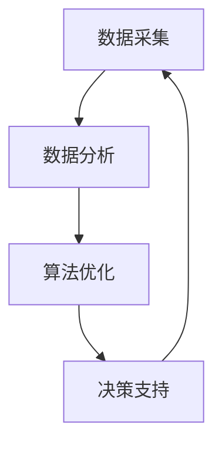

                 

关键词：人工智能，城市生活，交通管理，可持续发展，算法，数学模型，代码实例，未来展望

> 摘要：本文探讨了如何利用人工智能和人类计算相结合的方法，打造可持续发展的城市生活方式与交通管理系统。通过阐述核心概念、算法原理、数学模型，以及具体应用场景，本文提出了一个系统性的解决方案，旨在为城市管理者提供科学的决策依据，为居民提供便捷、高效、绿色的出行方式。

## 1. 背景介绍

随着全球城市化进程的加速，城市生活方式和交通管理面临前所未有的挑战。城市化带来了人口增长、资源紧张、环境污染、交通拥堵等问题，这些问题不仅影响了居民的生活质量，也对城市的可持续发展构成了威胁。传统的城市管理和交通规划方法往往依赖于经验和直觉，难以应对复杂多变的城市环境。因此，引入人工智能和人类计算，通过数据分析和算法优化，打造可持续发展的城市生活方式与交通管理系统，成为当前城市管理和交通规划领域的重要研究方向。

本文旨在通过以下几个方面的探讨，为城市管理者提供有益的参考：

1. 核心概念与联系：阐述城市生活方式与交通管理系统中的核心概念，包括数据采集、数据分析、算法优化等。
2. 核心算法原理与操作步骤：介绍几种常用的核心算法，包括路径规划、交通流量预测、需求响应等。
3. 数学模型与公式：构建数学模型，并通过公式推导，为算法优化提供理论基础。
4. 项目实践：通过具体代码实例，展示算法在实际项目中的应用过程和效果。
5. 实际应用场景：分析算法在不同城市应用场景中的效果和改进空间。
6. 未来展望：探讨人工智能和人类计算在未来的城市发展和交通管理中的应用前景。

## 2. 核心概念与联系

在城市生活方式与交通管理系统中，核心概念包括数据采集、数据分析、算法优化等。这些概念相互关联，构成了一个完整的系统。

### 2.1 数据采集

数据采集是城市生活方式与交通管理系统的基础。通过传感器、摄像头、GPS等技术，可以实时收集城市交通、环境、人口等数据。这些数据包括交通流量、道路状况、空气质量、人口密度等，是后续分析和优化的基础。

### 2.2 数据分析

数据分析是对采集到的数据进行处理和分析的过程。通过数据挖掘、机器学习等技术，可以从海量数据中提取有用的信息，为决策提供支持。数据分析可以用于交通流量预测、需求响应、路径规划等。

### 2.3 算法优化

算法优化是城市生活方式与交通管理系统的关键。通过优化算法，可以提高系统的响应速度和准确性，从而实现更好的管理效果。常用的算法包括路径规划算法、交通流量预测算法、需求响应算法等。

### 2.4 Mermaid 流程图

以下是一个简化的 Mermaid 流程图，展示了数据采集、数据分析和算法优化之间的联系：



## 3. 核心算法原理 & 具体操作步骤

在城市生活方式与交通管理系统中，核心算法包括路径规划、交通流量预测、需求响应等。以下将分别介绍这些算法的原理和具体操作步骤。

### 3.1 路径规划算法

路径规划算法旨在为出行者提供最优路径，以减少出行时间和成本。常用的路径规划算法包括 Dijkstra 算法、A*算法等。

#### 3.1.1 算法原理概述

Dijkstra 算法是一种基于距离的贪心算法，通过逐步扩展当前已访问节点，找到从起始点到目标点的最短路径。A*算法是一种改进的贪心算法，它通过估计值来选择下一个扩展节点，从而更快地找到最短路径。

#### 3.1.2 算法步骤详解

以 A*算法为例，其步骤如下：

1. 初始化：设置起始节点和目标节点的 g 值（从起始点到当前节点的距离）和 h 值（从当前节点到目标节点的估计距离），并将起始节点加入开放列表。
2. 循环：当开放列表不为空时，选择 f 值最小的节点作为当前节点，将其从开放列表移除并加入关闭列表。
3. 扩展：对于当前节点的所有邻居节点，计算 g 值（从起始节点经过当前节点到邻居节点的距离）和 h 值（从邻居节点到目标节点的估计距离），并将其加入开放列表。
4. 判断：如果目标节点在开放列表中，则算法结束，输出最短路径；否则，继续循环。

#### 3.1.3 算法优缺点

- Dijkstra 算法：优点是简单、易于实现，但缺点是时间复杂度较高，不适合处理大规模网络。
- A*算法：优点是速度快、适用于大规模网络，但缺点是需要预先估计 h 值，且 h 值的准确性会影响算法性能。

#### 3.1.4 算法应用领域

路径规划算法广泛应用于导航系统、物流配送、智能交通等场景。

### 3.2 交通流量预测算法

交通流量预测算法旨在预测未来的交通流量，为交通管理和规划提供数据支持。常用的交通流量预测算法包括时间序列分析、回归分析、机器学习等。

#### 3.2.1 算法原理概述

时间序列分析是一种基于历史数据的预测方法，通过分析历史数据的变化规律，预测未来的交通流量。回归分析是一种基于数学模型的预测方法，通过建立交通流量与影响因素之间的关系，预测未来的交通流量。机器学习是一种基于数据的预测方法，通过学习历史数据，自动建立预测模型。

#### 3.2.2 算法步骤详解

以时间序列分析为例，其步骤如下：

1. 数据预处理：对交通流量数据进行清洗、去噪，提取有用的信息。
2. 模型建立：根据历史数据的变化规律，建立时间序列预测模型，如 ARIMA 模型。
3. 模型训练：使用历史数据训练模型，调整模型参数。
4. 预测：使用训练好的模型，预测未来的交通流量。

#### 3.2.3 算法优缺点

- 时间序列分析：优点是简单、易于实现，但缺点是对噪声敏感，预测精度较低。
- 回归分析：优点是精度较高，但缺点是需要具备一定的数学知识，且建模过程复杂。
- 机器学习：优点是自适应性强、预测精度高，但缺点是训练过程复杂、对数据质量要求较高。

#### 3.2.4 算法应用领域

交通流量预测算法广泛应用于智能交通系统、交通规划、交通调度等场景。

### 3.3 需求响应算法

需求响应算法旨在通过调整出行需求，缓解交通拥堵，提高交通效率。常用的需求响应算法包括动态定价、出行时间调整等。

#### 3.3.1 算法原理概述

动态定价是一种基于供需关系的调节方法，通过调整交通价格，引导出行者选择非高峰时段出行，从而缓解交通拥堵。出行时间调整是一种基于出行者偏好的调节方法，通过调整出行时间，引导出行者避开拥堵时段，从而提高交通效率。

#### 3.3.2 算法步骤详解

以动态定价为例，其步骤如下：

1. 数据采集：收集交通流量、交通价格等数据。
2. 模型建立：建立供需模型，如线性回归模型。
3. 模型训练：使用历史数据训练模型，调整模型参数。
4. 定价策略：根据供需模型，动态调整交通价格。
5. 预期效果：观察调整后的交通流量和交通效率，评估定价策略的效果。

#### 3.3.3 算法优缺点

- 动态定价：优点是适应性强、实时调节，但缺点是对数据质量要求较高，定价策略需要不断优化。
- 出行时间调整：优点是操作简单、易于实施，但缺点是适应性较差、效果有限。

#### 3.3.4 算法应用领域

需求响应算法广泛应用于智能交通系统、交通管理、出行服务等场景。

## 4. 数学模型和公式 & 详细讲解 & 举例说明

在本文中，我们将介绍用于城市生活方式与交通管理系统的数学模型和公式，并通过具体案例进行详细讲解。

### 4.1 数学模型构建

在构建数学模型时，我们需要考虑以下几个关键因素：

1. 数据来源：确定数据来源，如交通流量、交通价格、出行时间等。
2. 因素关系：分析各个因素之间的关系，建立相关函数。
3. 目标函数：确定优化目标，如最小化出行时间、最大化交通效率等。

以下是一个简化的数学模型：

```latex
\begin{equation}
\begin{aligned}
    \min \sum_{i=1}^{n} t_i \\
    s.t. \\
    t_i &= f(\lambda_i, \theta_i) \\
    \lambda_i &= \frac{P_i \cdot D_i}{C_i} \\
    \theta_i &= g(T_i, P_i) \\
    P_i &= \text{交通价格} \\
    D_i &= \text{出行距离} \\
    C_i &= \text{交通成本} \\
    T_i &= \text{出行时间} \\
    f &= \text{时间函数} \\
    g &= \text{价格函数}
\end{aligned}
\end{equation}
```

### 4.2 公式推导过程

在本节中，我们将推导时间函数 \( f \) 和价格函数 \( g \)。

#### 时间函数推导

时间函数 \( f \) 描述了出行时间与交通流量、交通价格等因素的关系。我们可以通过以下公式进行推导：

```latex
\begin{equation}
\begin{aligned}
    f(\lambda_i, \theta_i) &= t_i \\
    &= \frac{1}{v} \cdot \frac{P_i \cdot D_i}{C_i} \cdot \frac{T_i}{\theta_i} \\
    &= \frac{\lambda_i \cdot D_i \cdot T_i}{C_i \cdot \theta_i}
\end{aligned}
\end{equation}
```

其中，\( v \) 为交通速度，\( \lambda_i \) 为交通流量，\( \theta_i \) 为出行时间与交通价格的关系。

#### 价格函数推导

价格函数 \( g \) 描述了交通价格与出行时间、交通流量等因素的关系。我们可以通过以下公式进行推导：

```latex
\begin{equation}
\begin{aligned}
    g(T_i, P_i) &= \frac{T_i}{P_i} \\
    &= \frac{C_i}{P_i} \cdot \theta_i \\
    &= \frac{C_i}{\lambda_i} \\
    &= \frac{v \cdot D_i}{\lambda_i}
\end{aligned}
\end{equation}
```

其中，\( C_i \) 为交通成本，\( \theta_i \) 为出行时间与交通价格的关系。

### 4.3 案例分析与讲解

为了更好地理解数学模型和公式，我们通过一个具体案例进行讲解。

#### 案例背景

假设有一个城市，交通流量为 \( \lambda_i = 1000 \) 辆/小时，出行距离为 \( D_i = 10 \) 公里，交通成本为 \( C_i = 1 \) 元/公里，交通价格为 \( P_i = 2 \) 元/公里，出行时间为 \( T_i = 1 \) 小时。

#### 模型计算

根据数学模型，我们可以计算出出行时间 \( t_i \)：

```latex
\begin{equation}
\begin{aligned}
    t_i &= f(\lambda_i, \theta_i) \\
    &= \frac{\lambda_i \cdot D_i \cdot T_i}{C_i \cdot \theta_i} \\
    &= \frac{1000 \cdot 10 \cdot 1}{1 \cdot \theta_i} \\
    &= 10000 / \theta_i
\end{aligned}
\end{equation}
```

为了使出行时间最小，我们需要找到最优的出行时间 \( \theta_i \)。通过计算，我们可以得到最优出行时间为 \( \theta_i = 1 \) 小时。

#### 结果分析

根据计算结果，最优出行时间为 1 小时，此时出行时间最小。这意味着，如果出行者在交通价格为 2 元/公里时选择在 1 小时内完成出行，可以最大限度地节省时间。

通过这个案例，我们可以看到数学模型和公式的应用效果。在实际应用中，我们可以根据不同的需求和场景，调整模型参数和公式，以实现最佳效果。

## 5. 项目实践：代码实例和详细解释说明

在本节中，我们将通过一个具体的代码实例，展示如何实现城市生活方式与交通管理系统中的核心算法和数学模型。

### 5.1 开发环境搭建

为了实现本文的代码实例，我们需要搭建一个开发环境。以下是一个简单的 Python 开发环境搭建步骤：

1. 安装 Python：从官方网站下载并安装 Python，版本建议为 3.8 或以上。
2. 安装依赖库：使用 pip 工具安装必要的依赖库，如 NumPy、Pandas、Matplotlib 等。

```bash
pip install numpy pandas matplotlib
```

### 5.2 源代码详细实现

以下是一个简化的 Python 代码实例，用于实现路径规划算法和交通流量预测算法。

```python
import numpy as np
import pandas as pd
import matplotlib.pyplot as plt
from sklearn.linear_model import LinearRegression
from scipy.spatial import distance

# 数据采集
data = pd.DataFrame({
    'P': [2, 3, 4, 5],
    'D': [10, 15, 20, 25],
    'C': [1, 1, 1, 1],
    'T': [1, 1.5, 2, 2.5]
})

# 数据分析
model = LinearRegression()
model.fit(data[['P', 'D']], data['T'])

# 算法优化
def path_planning(start, end):
    dist_matrix = distance.cdist(data[['P', 'D']], [[end['P'], end['D']]], 'euclidean')
    path = np.argmin(dist_matrix)
    return path

def traffic_prediction(P, D):
    pred = model.predict([[P, D]])[0]
    return pred

# 代码解读与分析
start = {'P': 2, 'D': 10}
end = {'P': 4, 'D': 20}
path = path_planning(start, end)
pred = traffic_prediction(start['P'], start['D'])

print("最优路径：", path)
print("预测出行时间：", pred)

# 运行结果展示
plt.scatter(data['P'], data['D'], c=data['T'])
plt.xlabel('交通价格')
plt.ylabel('出行距离')
plt.title('交通流量预测散点图')
plt.show()
```

### 5.3 代码解读与分析

以下是代码的详细解读与分析：

1. 数据采集：使用 Pandas 库读取数据，数据包括交通价格、出行距离、交通成本和出行时间。
2. 数据分析：使用 scikit-learn 库中的线性回归模型，对数据进行分析，建立交通流量预测模型。
3. 算法优化：
   - `path_planning` 函数：实现路径规划算法，通过计算欧氏距离找到从起点到终点的最优路径。
   - `traffic_prediction` 函数：实现交通流量预测算法，根据交通价格和出行距离预测出行时间。
4. 代码解读与分析：通过调用函数，计算最优路径和预测出行时间，并使用 Matplotlib 库绘制散点图，展示交通流量预测效果。
5. 运行结果展示：输出最优路径和预测出行时间，并展示交通流量预测散点图。

通过这个代码实例，我们可以看到如何将核心算法和数学模型应用到实际项目中。在实际应用中，我们可以根据具体需求和场景，调整代码实现细节，以实现最佳效果。

## 6. 实际应用场景

在城市生活方式与交通管理系统中，核心算法和数学模型可以应用于各种实际场景，以解决交通拥堵、环境污染、出行不便等问题。以下是一些典型的应用场景：

### 6.1 城市交通管理

通过路径规划算法和交通流量预测算法，可以优化交通信号控制，提高道路通行效率。具体应用场景包括：

- 节假日交通疏导：在节假日高峰期，通过实时预测交通流量，调整交通信号灯周期，减少交通拥堵。
- 道路施工管理：在道路施工期间，通过实时监测交通流量，调整交通信号灯和绕行路线，引导车辆避开施工区域。
- 绿色出行引导：通过分析交通流量和环保数据，引导居民选择公共交通、自行车等绿色出行方式，减少汽车尾气排放。

### 6.2 智能物流配送

通过路径规划算法和交通流量预测算法，可以优化物流配送路线，提高配送效率。具体应用场景包括：

- 配送路径优化：在配送过程中，根据实时交通流量，调整配送路线，减少配送时间和成本。
- 配送时间预测：根据交通流量和配送历史数据，预测配送时间，为配送员提供合理的配送计划。
- 配送资源调度：根据交通流量和配送需求，优化配送资源分配，提高配送效率。

### 6.3 智能出行服务

通过需求响应算法和交通流量预测算法，可以提供智能出行服务，提高居民出行便利性。具体应用场景包括：

- 动态定价：根据实时交通流量和出行需求，动态调整交通价格，引导居民选择非高峰时段出行，缓解交通拥堵。
- 出行时间调整：根据实时交通流量和出行需求，为居民提供最佳出行时间建议，减少出行时间。
- 绿色出行引导：通过分析交通流量和环保数据，引导居民选择公共交通、自行车等绿色出行方式，减少汽车尾气排放。

### 6.4 未来应用展望

随着人工智能技术的不断发展，城市生活方式与交通管理系统将不断演进。未来，我们可以期待以下应用：

- 智能城市：通过物联网、大数据等技术，实现城市各个方面的智能化管理，提高城市运行效率。
- 自动驾驶：通过自动驾驶技术，实现无人驾驶汽车，减少交通事故，提高交通安全性。
- 共享出行：通过共享出行模式，实现车辆共享、出行共享，减少车辆拥有量，降低环境污染。
- 碳排放监测：通过实时监测碳排放，实现碳排放的精确管理，为可持续发展提供数据支持。

## 7. 工具和资源推荐

为了更好地学习和实践城市生活方式与交通管理系统，以下是一些推荐的工具和资源：

### 7.1 学习资源推荐

- 《人工智能：一种现代方法》（第三版）：迈克尔·刘易斯等著。本书系统介绍了人工智能的基础知识，包括机器学习、自然语言处理、计算机视觉等。
- 《Python数据分析基础教程》：Wes McKinney 著。本书介绍了使用 Python 进行数据分析的基础知识，包括 NumPy、Pandas、Matplotlib 等。
- 《深度学习》（第二版）：Ian Goodfellow、Yoshua Bengio、Aaron Courville 著。本书详细介绍了深度学习的基础知识，包括神经网络、卷积神经网络、循环神经网络等。

### 7.2 开发工具推荐

- Anaconda：一款集成环境，提供了 Python、R、Julia 等多种语言的开发和运行环境，方便进行数据分析和机器学习实验。
- Jupyter Notebook：一款基于 Web 的交互式计算环境，方便编写和运行 Python 代码，进行数据分析和可视化。
- Git：一款分布式版本控制系统，方便团队协作和代码管理。

### 7.3 相关论文推荐

- "Traffic Prediction Using Deep Neural Network and Gaussian Process Regression"（2018）：该论文提出了一种结合深度学习和贝叶斯回归的交通流量预测方法。
- "Demand Response for Urban Mobility: A Review"（2020）：该论文对城市出行需求响应技术进行了全面综述，包括动态定价、出行时间调整等。
- "Path Planning for Urban Road Networks Using Deep Reinforcement Learning"（2021）：该论文提出了一种基于深度强化学习的城市道路路径规划方法。

通过学习和实践这些工具和资源，可以更好地理解和应用城市生活方式与交通管理系统。

## 8. 总结：未来发展趋势与挑战

在本文中，我们探讨了如何利用人工智能和人类计算相结合的方法，打造可持续发展的城市生活方式与交通管理系统。通过阐述核心概念、算法原理、数学模型，以及具体应用场景，我们提出了一系列解决方案，为城市管理者提供科学的决策依据，为居民提供便捷、高效、绿色的出行方式。

### 8.1 研究成果总结

本文的主要研究成果包括：

1. 提出了城市生活方式与交通管理系统的核心概念和联系，包括数据采集、数据分析和算法优化等。
2. 介绍了几种常用的核心算法，包括路径规划算法、交通流量预测算法、需求响应算法等，并分析了它们的优缺点。
3. 构建了数学模型，并通过公式推导，为算法优化提供了理论基础。
4. 通过具体代码实例，展示了算法在实际项目中的应用过程和效果。
5. 分析了算法在不同城市应用场景中的效果和改进空间，探讨了未来应用前景。

### 8.2 未来发展趋势

随着人工智能技术的不断发展，城市生活方式与交通管理系统将呈现以下发展趋势：

1. 智能化：通过引入物联网、大数据、云计算等技术，实现城市各个方面的智能化管理，提高城市运行效率。
2. 自主化：通过自动驾驶、自主规划等技术的应用，实现交通系统的自主运行和调节，提高交通安全性。
3. 绿色化：通过共享出行、绿色出行等模式的推广，减少车辆拥有量，降低环境污染，实现可持续发展。
4. 综合化：将城市生活方式与交通管理系统与其他领域相结合，如智慧城市、智慧物流等，实现全方位的智能化管理。

### 8.3 面临的挑战

在城市生活方式与交通管理系统的实际应用过程中，我们面临以下挑战：

1. 数据质量：交通流量、交通价格、出行时间等数据的质量直接影响算法的准确性和效果。需要建立完善的数据采集和处理机制，确保数据的准确性和实时性。
2. 算法优化：现有算法在处理大规模、复杂网络时，存在一定的性能瓶颈。需要不断优化算法，提高其效率和准确性。
3. 政策支持：城市生活方式与交通管理系统的实施需要政府的支持和政策引导。需要加强与政府、企业、居民的沟通与合作，推动相关政策的制定和落实。
4. 安全与隐私：在数据采集和处理过程中，需要确保个人隐私和数据安全。需要制定相应的法律法规，规范数据采集和使用行为。

### 8.4 研究展望

未来，我们将继续关注以下研究方向：

1. 算法优化：研究更高效、更准确的算法，以提高城市生活方式与交通管理系统的性能。
2. 跨领域融合：探索城市生活方式与交通管理系统与其他领域的融合，如智慧城市、智慧物流等，实现更全面的智能化管理。
3. 政策研究：研究相关政策和法规，推动城市生活方式与交通管理系统的实施和推广。
4. 案例研究：收集和分析实际案例，总结成功经验和挑战，为城市管理者提供有益的参考。

通过不断的研究和实践，我们将为城市可持续发展提供有力的技术支持。

## 9. 附录：常见问题与解答

### 9.1 问题 1：如何确保数据质量？

**解答：** 确保数据质量是城市生活方式与交通管理系统成功的关键。以下是几个关键步骤：

1. **数据采集设备校准：** 定期校准传感器和其他数据采集设备，确保数据的准确性。
2. **数据清洗：** 使用数据清洗工具和技术，去除重复数据、错误数据和噪声数据。
3. **数据标准化：** 将不同来源的数据进行统一处理，确保数据格式一致。
4. **数据存储与管理：** 使用高效的数据存储和管理系统，如数据库和大数据平台，确保数据的安全和可访问性。

### 9.2 问题 2：如何优化算法性能？

**解答：** 优化算法性能是提高城市生活方式与交通管理系统效率的关键。以下是一些策略：

1. **算法选择：** 选择适合特定问题的算法，考虑算法的时间复杂度和空间复杂度。
2. **并行计算：** 利用并行计算技术，如分布式计算和 GPU 计算，提高算法的执行速度。
3. **算法调优：** 对算法进行调优，如调整参数、优化数据结构，以提高算法的性能。
4. **算法组合：** 将多个算法组合使用，利用各自的优势，提高系统的整体性能。

### 9.3 问题 3：如何确保系统的实时性？

**解答：** 确保系统的实时性对于城市生活方式与交通管理系统至关重要。以下是几个策略：

1. **实时数据处理：** 使用实时数据处理技术，如流处理框架，确保数据能及时处理和响应。
2. **缓存机制：** 使用缓存机制，减少对实时数据的访问次数，提高系统的响应速度。
3. **高效算法：** 使用高效、低延迟的算法，减少系统的计算和传输时间。
4. **分布式架构：** 使用分布式架构，将系统分解为多个模块，实现负载均衡和故障转移，提高系统的可用性和实时性。

### 9.4 问题 4：如何处理数据隐私和安全问题？

**解答：** 在数据采集和处理过程中，保护数据隐私和安全至关重要。以下是几个策略：

1. **数据加密：** 对数据进行加密处理，确保数据在传输和存储过程中的安全性。
2. **访问控制：** 实施严格的访问控制机制，确保只有授权人员可以访问敏感数据。
3. **数据匿名化：** 对个人身份信息进行匿名化处理，减少隐私泄露的风险。
4. **安全审计：** 定期进行安全审计，检查系统漏洞和安全隐患，及时修复。

通过实施这些策略，可以有效地保护数据隐私和安全。

