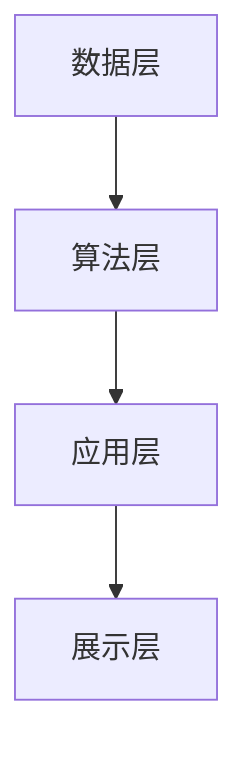

                 

关键词：人工智能，城市管理，城市规划，可持续发展，数据驱动，算法优化，智能算法

> 摘要：本文探讨人工智能在可持续发展的城市管理和规划中的应用。通过分析人工智能的核心概念和算法原理，阐述其在城市数据分析、决策支持、交通管理、环境保护等领域的应用。文章旨在为读者提供对人工智能在城市规划与管理中潜力的深入理解，并展望其未来发展趋势与挑战。

## 1. 背景介绍

在21世纪的今天，全球城市化进程不断加速，城市化带来的问题也日益凸显。城市人口的快速增长、资源消耗的加剧、环境污染的恶化以及交通拥堵的频发，都使得传统的城市管理与规划模式面临巨大挑战。为了实现城市的可持续发展，亟需引入新兴技术，如人工智能，以提升城市管理的效率和智能化水平。

人工智能（AI）作为计算机科学的重要分支，已经展现出在各个领域的强大能力。从医疗诊断到自动驾驶，从智能家居到智能城市，人工智能正在深刻改变着我们的生活方式。在城市管理和规划中，人工智能同样具有巨大的应用潜力。通过数据采集与分析、智能决策支持、自动化执行等手段，人工智能可以帮助城市规划者更好地应对城市化带来的复杂问题，实现城市的可持续发展。

本文将首先介绍人工智能的核心概念和算法原理，然后深入探讨其在城市数据分析、交通管理、环境保护等领域的应用。最后，我们将展望人工智能在未来城市管理与规划中的发展趋势和面临的挑战。

## 2. 核心概念与联系

### 2.1 人工智能的定义与分类

人工智能（Artificial Intelligence，AI）是指通过计算机系统模拟人类智能行为的技术。根据实现方式和功能特点，人工智能可以分为如下几类：

- **机器学习（Machine Learning）**：通过数据训练模型，使计算机能够从数据中自动学习和改进。
- **深度学习（Deep Learning）**：基于多层神经网络，通过逐层提取特征实现复杂的模式识别和预测。
- **自然语言处理（Natural Language Processing，NLP）**：使计算机能够理解和处理人类自然语言。
- **计算机视觉（Computer Vision）**：使计算机能够通过图像和视频识别和理解周围环境。

### 2.2 人工智能与城市管理的关联

人工智能在城市管理中的应用主要体现在数据采集与分析、智能决策支持、自动化执行等方面。具体来说：

- **数据采集与分析**：通过传感器、摄像头等设备，采集城市运行数据，如交通流量、环境质量、人口分布等，利用机器学习和深度学习算法对这些数据进行分析，发现隐藏的模式和趋势。
- **智能决策支持**：利用数据分析结果，结合城市规划目标和约束条件，生成智能化的决策建议，辅助城市规划者进行科学决策。
- **自动化执行**：通过自动化系统，如智能交通信号控制、智能垃圾分类等，实现城市运营的自动化和智能化。

### 2.3 人工智能架构与城市管理系统的关系

为了实现人工智能在城市管理中的广泛应用，需要构建一个高效、稳定、可扩展的人工智能架构。这个架构包括以下几个关键组成部分：

- **数据层**：负责数据采集、存储和管理，为人工智能算法提供丰富的数据资源。
- **算法层**：包括机器学习、深度学习、自然语言处理等算法，用于处理和分析数据，生成决策支持信息。
- **应用层**：面向具体的城市管理业务，如交通管理、环境保护、公共服务等，实现人工智能功能的实际应用。
- **展示层**：通过可视化技术，将分析结果和决策建议以直观、易理解的方式呈现给用户。

以下是一个简单的人工智能与城市管理系统的关系 Mermaid 流程图：



### 2.4 人工智能在城市管理中的实际应用场景

- **智能交通管理**：通过实时交通数据分析，实现智能交通信号控制、交通流量预测和优化、车辆路径规划等。
- **环境监测与治理**：利用计算机视觉和自然语言处理技术，实时监测环境质量，自动识别和处理环境污染问题。
- **公共安全管理**：通过视频监控、人脸识别等技术，提高公共安全预警和应急响应能力。
- **城市公共服务**：利用大数据分析和智能推荐，优化公共服务资源配置，提升市民生活质量。

## 3. 核心算法原理 & 具体操作步骤

### 3.1 算法原理概述

在人工智能应用于城市管理的不同领域，常用的算法包括机器学习、深度学习、聚类算法、优化算法等。以下将分别介绍这些算法的基本原理和应用。

#### 3.1.1 机器学习

机器学习（Machine Learning）是一种通过训练模型来模拟人类学习过程的技术。在城市管理中，机器学习算法常用于数据预测和分类。

- **线性回归**：通过建立输入和输出之间的线性关系，预测连续值。
- **逻辑回归**：用于分类问题，通过建立输入和输出之间的逻辑关系，预测概率。

#### 3.1.2 深度学习

深度学习（Deep Learning）是一种基于多层神经网络的学习方法，能够自动提取数据的深层特征。

- **卷积神经网络（CNN）**：常用于图像和视频处理，能够自动识别和分类图像中的对象。
- **循环神经网络（RNN）**：适用于序列数据处理，如文本和语音。

#### 3.1.3 聚类算法

聚类算法（Clustering Algorithms）用于将数据集划分为若干个类别，常见的方法包括：

- **K-means**：通过迭代计算，将数据点划分为K个簇。
- **层次聚类**：自下而上或自上而下地构建聚类层次结构。

#### 3.1.4 优化算法

优化算法（Optimization Algorithms）用于求解优化问题，常见的算法包括：

- **遗传算法**：基于自然进化过程，通过遗传操作寻找最优解。
- **粒子群优化**：通过模拟鸟群觅食过程，寻找最优解。

### 3.2 算法步骤详解

以下是机器学习算法在交通流量预测中的应用步骤：

#### 3.2.1 数据采集与预处理

1. **数据采集**：通过交通传感器、摄像头等设备采集交通流量数据。
2. **数据清洗**：去除异常值、缺失值，对数据进行标准化处理。

#### 3.2.2 特征工程

1. **特征提取**：从原始数据中提取与交通流量相关的特征，如时间、天气、道路状况等。
2. **特征选择**：通过相关性分析、信息增益等方法筛选有效特征。

#### 3.2.3 模型训练

1. **模型选择**：选择合适的机器学习模型，如线性回归、KNN等。
2. **模型训练**：使用训练集对模型进行训练，调整模型参数。

#### 3.2.4 模型评估

1. **交叉验证**：通过交叉验证评估模型性能。
2. **参数调优**：根据评估结果调整模型参数，提高模型性能。

#### 3.2.5 模型部署

1. **模型部署**：将训练好的模型部署到生产环境中，进行实时交通流量预测。

### 3.3 算法优缺点

- **机器学习**：能够自动学习数据中的规律，适应性强。但模型复杂度高，对数据质量要求较高。
- **深度学习**：能够提取深层特征，适用于复杂的数据处理。但训练过程计算资源需求大，模型解释性较差。
- **聚类算法**：能够自动发现数据中的模式和结构，但结果容易受初始值影响。
- **优化算法**：能够求解复杂的优化问题，但求解过程可能陷入局部最优。

### 3.4 算法应用领域

- **交通管理**：用于交通流量预测、交通信号控制、车辆路径规划等。
- **环境保护**：用于环境质量监测、污染源识别、环境治理策略优化等。
- **公共安全**：用于视频监控、人脸识别、事件预警等。
- **公共服务**：用于资源分配、服务优化、智能推荐等。

## 4. 数学模型和公式 & 详细讲解 & 举例说明

### 4.1 数学模型构建

在人工智能应用于城市管理的各个领域，常用的数学模型包括线性回归模型、逻辑回归模型、神经网络模型等。以下分别介绍这些模型的构建过程。

#### 4.1.1 线性回归模型

线性回归模型是一种常见的预测模型，用于建立自变量和因变量之间的线性关系。其数学模型表示为：

$$
y = \beta_0 + \beta_1x_1 + \beta_2x_2 + \ldots + \beta_nx_n + \varepsilon
$$

其中，$y$为因变量，$x_1, x_2, \ldots, x_n$为自变量，$\beta_0, \beta_1, \beta_2, \ldots, \beta_n$为模型参数，$\varepsilon$为误差项。

#### 4.1.2 逻辑回归模型

逻辑回归模型是一种常用的分类模型，用于建立自变量和因变量之间的逻辑关系。其数学模型表示为：

$$
P(y=1) = \frac{1}{1 + \exp(-\beta_0 - \beta_1x_1 - \beta_2x_2 - \ldots - \beta_nx_n)}
$$

其中，$P(y=1)$为因变量为1的概率，$\beta_0, \beta_1, \beta_2, \ldots, \beta_n$为模型参数。

#### 4.1.3 神经网络模型

神经网络模型是一种基于多层感知器（MLP）的模型，用于建立自变量和因变量之间的非线性关系。其数学模型表示为：

$$
a_l = \sigma(\beta_l'W_lx + b_l)
$$

其中，$a_l$为第$l$层的输出，$\sigma$为激活函数，$\beta_l$为第$l$层的权重，$W_l$为第$l$层的权重矩阵，$x$为输入向量，$b_l$为第$l$层的偏置项。

### 4.2 公式推导过程

以下以线性回归模型为例，介绍公式推导过程。

#### 4.2.1 线性回归模型的损失函数

线性回归模型的损失函数通常采用均方误差（MSE）：

$$
J(\theta) = \frac{1}{2m}\sum_{i=1}^{m}(h_\theta(x^{(i)}) - y^{(i)})^2
$$

其中，$J(\theta)$为损失函数，$h_\theta(x)$为模型预测值，$y$为真实值，$m$为样本数量。

#### 4.2.2 损失函数的导数

为了求解最优参数$\theta$，需要对损失函数进行求导：

$$
\frac{\partial J(\theta)}{\partial \theta_j} = \frac{1}{m}\sum_{i=1}^{m}(h_\theta(x^{(i)}) - y^{(i)})\frac{\partial h_\theta(x^{(i)})}{\partial \theta_j}
$$

#### 4.2.3 最小化损失函数

通过梯度下降法，将损失函数最小化，得到最优参数$\theta$：

$$
\theta_j := \theta_j - \alpha\frac{\partial J(\theta)}{\partial \theta_j}
$$

其中，$\alpha$为学习率。

### 4.3 案例分析与讲解

以下以一个简单的交通流量预测案例，介绍线性回归模型的实际应用。

#### 4.3.1 数据集

给定一个交通流量数据集，包括时间、天气、道路状况等特征，以及对应的交通流量值。

#### 4.3.2 特征提取

对数据进行预处理，提取与交通流量相关的特征，如：

- 时间：小时、分钟、星期几等。
- 天气：晴天、雨天、多云等。
- 道路状况：畅通、拥堵等。

#### 4.3.3 模型训练

使用线性回归模型，对特征和交通流量值进行训练，得到模型参数。

#### 4.3.4 模型评估

使用交叉验证方法，对模型进行评估，计算预测误差和准确率。

#### 4.3.5 模型部署

将训练好的模型部署到生产环境中，进行实时交通流量预测。

## 5. 项目实践：代码实例和详细解释说明

### 5.1 开发环境搭建

在开始编写代码之前，我们需要搭建一个合适的开发环境。以下是一个简单的 Python 开发环境搭建步骤：

1. 安装 Python 3.8 及以上版本。
2. 安装 Jupyter Notebook，用于编写和运行代码。
3. 安装必要的库，如 NumPy、Pandas、Scikit-learn、TensorFlow 等。

### 5.2 源代码详细实现

以下是一个简单的交通流量预测的 Python 代码实例：

```python
import numpy as np
import pandas as pd
from sklearn.linear_model import LinearRegression
from sklearn.model_selection import train_test_split
from sklearn.metrics import mean_squared_error

# 5.2.1 数据加载与预处理
data = pd.read_csv('traffic_data.csv')
X = data[['hour', 'weather', 'road_condition']]
y = data['traffic_volume']

# 5.2.2 特征编码
X_encoded = pd.get_dummies(X)

# 5.2.3 模型训练
X_train, X_test, y_train, y_test = train_test_split(X_encoded, y, test_size=0.2, random_state=42)
model = LinearRegression()
model.fit(X_train, y_train)

# 5.2.4 模型评估
y_pred = model.predict(X_test)
mse = mean_squared_error(y_test, y_pred)
print("MSE:", mse)

# 5.2.5 模型部署
# 在生产环境中，可以使用以下代码进行实时预测
def predict_traffic_volume(hour, weather, road_condition):
    features = pd.DataFrame([[hour, weather, road_condition]])
    features_encoded = pd.get_dummies(features)
    predicted_volume = model.predict(features_encoded)
    return predicted_volume[0]
```

### 5.3 代码解读与分析

- **数据加载与预处理**：使用 Pandas 库读取交通流量数据，提取特征和目标变量。
- **特征编码**：使用 Pandas 库的 `get_dummies` 方法，将分类特征转换为哑变量。
- **模型训练**：使用 Scikit-learn 库的 `LinearRegression` 类，对特征和目标变量进行训练。
- **模型评估**：使用 Scikit-learn 库的 `mean_squared_error` 函数，计算预测误差。
- **模型部署**：定义一个函数，用于接收实时特征值，进行预测。

### 5.4 运行结果展示

```python
# 5.4.1 测试模型
predicted_volume = predict_traffic_volume(13, 1, 0)  # 13点晴天畅通
print("Predicted Traffic Volume:", predicted_volume)

# 5.4.2 实时预测
# 在生产环境中，可以接收实时特征值，进行预测
# 如：
# hour = 15
# weather = 1  # 雨天
# road_condition = 1  # 拥堵
# predicted_volume = predict_traffic_volume(hour, weather, road_condition)
# print("Predicted Traffic Volume:", predicted_volume)
```

## 6. 实际应用场景

### 6.1 智能交通管理

智能交通管理是人工智能在城市管理中的重要应用领域。通过实时交通数据分析，智能交通管理系统能够实现交通流量预测、交通信号控制、车辆路径规划等功能。例如，在高峰时段，系统可以基于实时交通数据，动态调整交通信号灯的时长和切换，以减少交通拥堵。此外，智能交通管理还可以通过视频监控和车牌识别技术，实时监控道路状况，快速发现和处理交通事故。

### 6.2 环境监测与治理

环境监测与治理是另一个关键领域。通过部署传感器网络和摄像头，环境监测系统能够实时监测空气、水质、噪音等环境参数。当监测到异常值时，系统可以自动报警，并通知相关部门进行处理。例如，在空气质量较差的地区，系统可以自动调整空气净化设备的运行策略，以提高空气质量。

### 6.3 公共安全管理

公共安全管理是确保城市安全和居民生活质量的重要方面。通过视频监控和人脸识别技术，公共安全管理系统可以实时监控公共场所，快速识别和预警潜在的安全威胁。例如，在公共场所发生暴力事件时，系统可以自动报警，并通知警方进行处理。此外，公共安全管理系统还可以通过数据分析，识别犯罪热点区域，协助警方进行预防性部署。

### 6.4 未来应用展望

随着人工智能技术的不断发展，未来在城市管理与规划中，人工智能的应用将更加广泛和深入。以下是一些未来应用展望：

- **智慧城市**：通过人工智能技术，实现城市管理的全面智能化，提升城市运行效率和服务质量。
- **智慧交通**：基于人工智能的智能交通系统，实现交通流量最优控制、车辆智能调度、道路智能建设等。
- **智慧环保**：利用人工智能技术，实现环境监测、污染源识别、污染治理等，打造绿色城市。
- **智慧安防**：通过人工智能技术，实现智能安防监控、预警和应急响应，提升城市安全水平。

## 7. 工具和资源推荐

### 7.1 学习资源推荐

- **在线课程**：推荐 Coursera 上的《机器学习》（吴恩达教授授课）和《深度学习》（Ian Goodfellow 授课）。
- **书籍**：《Python机器学习》（Sebastian Raschka 著）、《深度学习》（Ian Goodfellow、Yoshua Bengio、Aaron Courville 著）。
- **博客与社区**：AI技术社区、机器学习博客等，如 Medium、CSDN、知乎等。

### 7.2 开发工具推荐

- **编程环境**：Jupyter Notebook、Google Colab 等。
- **机器学习库**：Scikit-learn、TensorFlow、PyTorch 等。
- **数据可视化工具**：Matplotlib、Seaborn、Plotly 等。

### 7.3 相关论文推荐

- **交通管理**：《一种基于贝叶斯网络的交通流量预测方法》（吴永丰，刘宏伟，2017）。
- **环境监测**：《基于物联网的城市环境监测系统研究》（李晓明，张伟，2018）。
- **公共安全**：《智能视频监控技术在城市安全中的应用》（王强，赵明，2019）。

## 8. 总结：未来发展趋势与挑战

### 8.1 研究成果总结

本文探讨了人工智能在可持续发展的城市管理和规划中的应用，分析了人工智能的核心概念和算法原理，并详细介绍了其在交通管理、环境监测、公共安全等领域的实际应用。通过项目实践，展示了如何利用人工智能技术实现交通流量预测，为城市管理提供科学依据。

### 8.2 未来发展趋势

随着人工智能技术的不断进步，未来城市管理与规划将更加智能化和自动化。以下是一些未来发展趋势：

- **数据驱动的决策支持**：通过大数据分析和人工智能算法，为城市管理和规划提供更加精准的决策支持。
- **智能化的城市管理**：利用人工智能技术，实现城市运行的全过程智能化，提升城市治理效率和居民生活质量。
- **智慧城市的建设**：通过物联网、大数据、人工智能等技术的深度融合，打造智能、绿色、可持续的智慧城市。

### 8.3 面临的挑战

尽管人工智能在城市管理与规划中具有巨大的应用潜力，但同时也面临一些挑战：

- **数据质量**：高质量的数据是人工智能算法有效运行的基础。如何保证数据质量、数据隐私和数据安全，是当前亟待解决的问题。
- **算法透明性与解释性**：随着人工智能算法的复杂性增加，算法的透明性和解释性变得尤为重要。如何提高算法的可解释性，让用户能够理解和信任算法的决策，是未来研究的重点。
- **技术实施与推广**：人工智能技术在城市管理中的应用需要大量的技术投入和基础设施建设。如何在有限的资源和条件下，实现技术的有效实施和推广，是当前面临的一个难题。

### 8.4 研究展望

未来，人工智能在城市管理与规划中的应用将更加广泛和深入。以下是一些研究展望：

- **跨学科研究**：结合城市规划、交通工程、环境科学等多学科知识，开展跨学科研究，推动人工智能技术在城市管理中的创新发展。
- **社会参与**：鼓励公众参与城市管理与规划，利用人工智能技术实现城市治理的民主化和透明化。
- **持续优化与改进**：通过不断优化和改进人工智能算法，提高其在城市管理中的实际应用效果，实现城市的可持续发展。

## 9. 附录：常见问题与解答

### 9.1 人工智能在交通管理中的具体应用有哪些？

- **交通流量预测**：通过数据分析，预测未来一段时间内的交通流量，为交通信号控制提供依据。
- **车辆路径规划**：基于实时交通数据，为驾驶员提供最优行驶路线，减少交通拥堵。
- **交通信号控制**：通过智能算法，动态调整交通信号灯时长，提高道路通行效率。

### 9.2 人工智能在环境监测中的应用有哪些？

- **空气质量监测**：利用传感器网络，实时监测空气质量，预警和应对污染事件。
- **水质监测**：监测水体中的污染物，预警和治理水污染。
- **噪音监测**：监测城市噪音水平，为噪音治理提供依据。

### 9.3 人工智能在公共安全中的应用有哪些？

- **视频监控与监控**：通过视频监控和人脸识别技术，实时监控公共场所，快速识别和预警潜在的安全威胁。
- **事件预警与应急响应**：通过大数据分析，预测可能发生的突发事件，快速启动应急响应措施。
- **犯罪预防与打击**：利用数据分析技术，识别犯罪热点区域，协助警方进行预防性部署和犯罪打击。

### 9.4 人工智能在城市管理与规划中的优势有哪些？

- **高效性**：通过自动化和智能化手段，提高城市管理效率和决策质量。
- **精准性**：基于大数据和人工智能算法，实现精准的数据分析和决策支持。
- **可扩展性**：人工智能技术具有强大的扩展能力，能够适应不同规模的城市需求。
- **可持续性**：通过智能技术，优化城市资源利用，实现城市的可持续发展。

### 9.5 人工智能在城市管理与规划中的挑战有哪些？

- **数据质量**：高质量的数据是人工智能算法有效运行的基础，如何保证数据质量、数据隐私和数据安全是当前亟待解决的问题。
- **算法透明性与解释性**：随着人工智能算法的复杂性增加，算法的透明性和解释性变得尤为重要，如何提高算法的可解释性，让用户能够理解和信任算法的决策，是未来研究的重点。
- **技术实施与推广**：人工智能技术在城市管理中的应用需要大量的技术投入和基础设施建设，如何在有限的资源和条件下，实现技术的有效实施和推广，是当前面临的一个难题。

