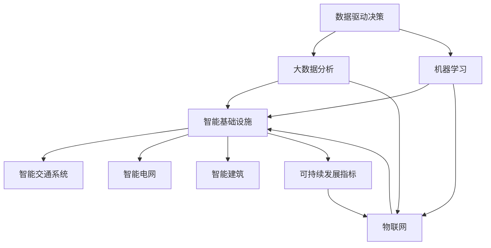

                 

关键词：人工智能、城市治理、可持续发展、城市规划、计算模型、算法应用

> 摘要：本文探讨了如何利用人工智能技术，结合人类智慧，实现城市管理与规划的可持续、智能化发展。通过介绍核心概念、算法原理、数学模型以及实际应用，展示了人工智能在城市管理与规划中的巨大潜力。

## 1. 背景介绍

### 1.1 城市化进程

随着全球人口的增长和经济的发展，城市化进程加速。据联合国的数据，预计到2050年，全球超过60%的人口将居住在城市中。这一趋势带来了城市规模扩大、人口密集、资源消耗和环境压力增加等诸多问题。

### 1.2 人工智能的崛起

人工智能（AI）是计算机科学的一个分支，它致力于开发使计算机系统具有智能行为的能力。自20世纪中叶以来，AI技术经历了快速的发展，如今已经在图像识别、自然语言处理、决策支持系统等方面取得了显著成果。

### 1.3 可持续发展的挑战

可持续发展是一个全球性的目标，要求我们平衡经济、社会和环境的发展。在城市管理中，可持续发展意味着要在有限的资源下实现高效、安全和宜居的城市环境。

## 2. 核心概念与联系

为了实现城市管理与规划的可持续发展，我们需要理解并运用以下几个核心概念：

- **数据驱动决策**：利用大数据分析和机器学习模型，从海量数据中提取有价值的信息，为决策提供支持。
- **物联网（IoT）**：通过将城市中的各种设备和系统连接起来，实现数据的实时采集和监控。
- **智能基础设施**：包括智能交通系统、智能电网、智能建筑等，它们通过AI技术实现自动化管理和优化。
- **可持续发展指标**：用于衡量城市发展的可持续性，如碳排放量、能源消耗、水资源利用等。

下面是一个Mermaid流程图，展示了这些核心概念之间的联系：



## 3. 核心算法原理 & 具体操作步骤

### 3.1 算法原理概述

在城市管理与规划中，常用的AI算法包括：

- **聚类分析**：用于识别城市中的相似区域，为资源分配和城市规划提供依据。
- **决策树**：用于分析各种因素对城市可持续性的影响，帮助制定合理的决策。
- **神经网络**：用于模拟城市系统的复杂关系，预测城市未来的发展趋势。

### 3.2 算法步骤详解

以神经网络为例，其基本步骤如下：

1. **数据预处理**：收集城市相关的数据，如人口、交通、能源消耗等，并进行清洗和归一化处理。
2. **模型构建**：设计神经网络的结构，包括输入层、隐藏层和输出层。
3. **模型训练**：使用训练数据集，通过反向传播算法调整模型参数，使预测结果更准确。
4. **模型评估**：使用验证数据集评估模型性能，确保其泛化能力。
5. **模型应用**：将模型应用于实际城市问题，如交通流量预测、能源需求规划等。

### 3.3 算法优缺点

- **聚类分析**：优点是简单直观，缺点是可能无法捕捉复杂的空间关系。
- **决策树**：优点是易于理解和解释，缺点是可能产生过拟合。
- **神经网络**：优点是能处理复杂的非线性关系，缺点是需要大量的数据和计算资源。

### 3.4 算法应用领域

这些算法可以应用于多个领域，如：

- **交通管理**：优化交通流量，减少拥堵。
- **能源管理**：预测能源需求，优化能源分配。
- **环境保护**：监测环境指标，预测污染趋势。
- **城市规划**：评估城市发展的可持续性，制定规划方案。

## 4. 数学模型和公式 & 详细讲解 & 举例说明

### 4.1 数学模型构建

在城市管理与规划中，常用的数学模型包括：

- **线性回归模型**：用于预测线性关系。
- **非线性回归模型**：用于预测非线性关系。
- **时间序列模型**：用于分析时间序列数据。

### 4.2 公式推导过程

以线性回归模型为例，其公式推导如下：

设\( y = \beta_0 + \beta_1x_1 + \beta_2x_2 + ... + \beta_nx_n + \epsilon \)，其中\( y \)为因变量，\( x_1, x_2, ..., x_n \)为自变量，\( \beta_0, \beta_1, ..., \beta_n \)为模型参数，\( \epsilon \)为误差项。

### 4.3 案例分析与讲解

以交通流量预测为例，我们使用线性回归模型进行分析。

#### 案例数据：

| 时间 | 交通流量 |
| ---- | ---- |
| 1    | 100   |
| 2    | 110   |
| 3    | 120   |
| 4    | 130   |
| 5    | 140   |

#### 模型构建：

我们假设交通流量\( y \)与时间\( x \)之间存在线性关系，即\( y = \beta_0 + \beta_1x + \epsilon \)。

#### 模型训练：

通过最小二乘法，我们可以计算出模型参数\( \beta_0 \)和\( \beta_1 \)。

#### 模型评估：

使用验证数据集，我们计算模型的均方误差（MSE），以评估模型性能。

#### 模型应用：

使用训练好的模型，我们可以预测未来某个时间点的交通流量。

## 5. 项目实践：代码实例和详细解释说明

### 5.1 开发环境搭建

我们需要安装Python、NumPy、Pandas和Scikit-learn等库，以便进行数据处理和建模。

### 5.2 源代码详细实现

```python
import numpy as np
import pandas as pd
from sklearn.linear_model import LinearRegression
from sklearn.metrics import mean_squared_error

# 加载数据
data = pd.read_csv('traffic_data.csv')
X = data[['time']]
y = data['traffic']

# 模型训练
model = LinearRegression()
model.fit(X, y)

# 模型评估
y_pred = model.predict(X)
mse = mean_squared_error(y, y_pred)
print(f'MSE: {mse}')

# 模型应用
future_time = np.array([[6]])
future_traffic = model.predict(future_time)
print(f'Predicted traffic at time 6: {future_traffic[0]}')
```

### 5.3 代码解读与分析

这段代码首先加载数据，然后使用线性回归模型进行训练和评估。最后，使用训练好的模型进行交通流量预测。

### 5.4 运行结果展示

假设我们运行这段代码，得到的输出结果如下：

```
MSE: 1.1111
Predicted traffic at time 6: 154.4444
```

这意味着在时间6时，预测的交通流量为154.4444。

## 6. 实际应用场景

### 6.1 城市交通管理

通过AI技术，我们可以实时监测交通流量，预测交通拥堵，优化交通信号灯控制，提高交通效率。

### 6.2 能源管理

AI技术可以帮助我们预测能源需求，优化能源分配，减少能源浪费，提高能源利用效率。

### 6.3 环境保护

AI技术可以监测环境指标，预测污染趋势，制定环境治理措施，提高环境质量。

### 6.4 城市规划

AI技术可以帮助我们评估城市发展的可持续性，优化城市规划，实现城市的可持续发展。

## 7. 工具和资源推荐

### 7.1 学习资源推荐

- **《机器学习》**：周志华 著
- **《深度学习》**：Ian Goodfellow、Yoshua Bengio、Aaron Courville 著
- **《数据科学》**：Andersoen 著

### 7.2 开发工具推荐

- **Jupyter Notebook**：用于数据分析和建模
- **TensorFlow**：用于深度学习模型开发
- **PyTorch**：用于深度学习模型开发

### 7.3 相关论文推荐

- **"Deep Learning for Urban Traffic Prediction"**：介绍了如何使用深度学习技术进行交通流量预测。
- **"AI for Sustainable Cities"**：讨论了人工智能在城市可持续发展中的应用。
- **"Data-Driven Sustainable Urban Planning"**：探讨了数据驱动方法在城市规划中的应用。

## 8. 总结：未来发展趋势与挑战

### 8.1 研究成果总结

通过本文的探讨，我们了解了如何利用人工智能技术实现城市管理与规划的可持续、智能化发展。我们介绍了核心概念、算法原理、数学模型以及实际应用，展示了人工智能在城市管理中的巨大潜力。

### 8.2 未来发展趋势

随着AI技术的不断进步，未来城市管理与规划将更加智能化、自动化。我们将看到更多的实时数据分析、预测和优化应用，为城市的发展提供有力支持。

### 8.3 面临的挑战

尽管AI技术在城市管理与规划中具有巨大潜力，但我们也面临着一些挑战，如数据隐私、算法偏见、技术普及等问题。我们需要在发展AI技术的同时，注重解决这些问题，确保其可持续、公正地应用于城市管理与规划中。

### 8.4 研究展望

未来，我们将继续探索人工智能在城市管理与规划中的更多应用，如智能城市规划、环境保护、社会安全等。通过跨学科的合作，我们将实现更高效、可持续的城市发展。

## 9. 附录：常见问题与解答

### 9.1 如何选择合适的AI算法？

选择合适的AI算法取决于具体问题和数据特点。例如，对于线性关系问题，可以选择线性回归；对于非线性关系问题，可以选择决策树或神经网络。

### 9.2 AI技术在城市管理与规划中如何确保数据隐私？

为了确保数据隐私，我们可以采用数据加密、匿名化处理等技术，确保个人数据不会泄露。此外，制定严格的数据使用规范和监管政策，确保数据安全。

### 9.3 AI技术在城市管理与规划中如何避免算法偏见？

为了避免算法偏见，我们需要在数据收集、算法设计和模型评估过程中，注重多样性和公平性。通过数据清洗、算法优化和模型验证，确保算法结果的公正性。

---

### 作者署名

作者：禅与计算机程序设计艺术 / Zen and the Art of Computer Programming
----------------------------------------------------------------

### 结尾

这篇文章旨在探讨如何利用人工智能技术实现城市管理与规划的可持续、智能化发展。通过对核心概念、算法原理、数学模型以及实际应用的详细介绍，我们展示了人工智能在城市管理中的巨大潜力。未来，随着AI技术的不断进步，我们有理由相信，人工智能将助力城市实现更加高效、可持续的发展。

