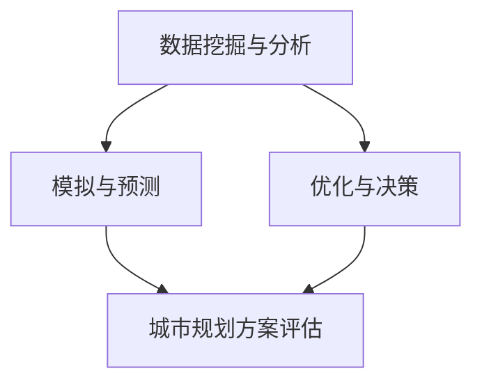

                 

关键词：人工智能，城市规划，可持续发展，计算方法，算法原理，数学模型，实践案例，未来展望

## 摘要

随着人工智能技术的迅猛发展，人类计算在城市规划中的应用日益广泛。本文旨在探讨如何运用人工智能技术，通过科学计算和数学模型，实现可持续发展的城市规划。文章首先介绍人工智能在城市规划中的核心概念和架构，然后详细讲解相关算法原理和具体操作步骤，最后通过实际项目实例和案例分析，展示人工智能在城市规划中的实际应用效果，并对未来发展趋势和面临的挑战进行展望。

## 1. 背景介绍

城市规划作为一门综合性学科，涉及地理学、建筑学、环境科学、经济学等多个领域。传统的城市规划方法主要依赖于专家经验和定性分析，存在效率低、主观性强、难以应对复杂动态环境等问题。而随着大数据、云计算、人工智能等技术的进步，人类计算在城市规划中的应用逐渐成为可能，为城市规划提供了新的思路和方法。

人工智能在城市规划中的应用主要体现在以下几个方面：

- **数据挖掘与分析**：利用人工智能技术对大量城市数据进行分析，提取有价值的信息和规律，为城市规划提供决策支持。
- **模拟与预测**：通过建立数学模型和仿真算法，模拟城市的发展趋势和影响，预测城市发展的潜在问题和挑战。
- **优化与决策**：基于人工智能算法，优化城市资源配置和规划方案，提高城市规划的科学性和可操作性。

本文将从这些方面出发，详细探讨人工智能在城市规划中的应用，为构建可持续发展的城市提供技术支持。

## 2. 核心概念与联系

### 2.1 数据挖掘与分析

数据挖掘作为人工智能的一个重要分支，通过挖掘城市数据中的潜在规律和模式，为城市规划提供决策支持。城市数据主要包括地理信息数据、社会经济数据、环境数据等。利用数据挖掘技术，可以实现对城市数据的自动分类、聚类、关联规则挖掘等，提取有价值的信息和知识。

### 2.2 模拟与预测

模拟与预测是城市规划中不可或缺的一环。通过建立数学模型和仿真算法，可以模拟城市的发展趋势和影响，预测城市发展的潜在问题和挑战。常见的模拟与预测方法包括地理信息系统（GIS）、系统动力学模型、神经网络模型等。

### 2.3 优化与决策

优化与决策是人工智能在城市规划中的核心应用。基于人工智能算法，可以优化城市资源配置和规划方案，提高城市规划的科学性和可操作性。常见的优化与决策方法包括遗传算法、粒子群优化算法、线性规划等。

### 2.4 Mermaid 流程图

以下是一个简化的 Mermaid 流程图，展示了人工智能在城市规划中的核心概念和联系：



## 3. 核心算法原理 & 具体操作步骤

### 3.1 算法原理概述

在城市规划中，常用的核心算法包括数据挖掘算法、模拟与预测算法、优化算法等。以下分别介绍这些算法的原理。

#### 数据挖掘算法

数据挖掘算法主要应用于城市数据的处理和分析。常见的算法包括：

- **关联规则挖掘**：用于发现城市数据中的潜在关联关系，如居民与购物中心的距离等。
- **聚类分析**：用于对城市数据进行分类，如城市功能区划分等。
- **分类与回归分析**：用于预测城市发展的趋势和影响，如居民增长率等。

#### 模拟与预测算法

模拟与预测算法用于模拟城市的发展过程，预测未来的发展趋势。常见的算法包括：

- **地理信息系统（GIS）**：用于模拟城市的空间分布和演化过程。
- **系统动力学模型**：用于模拟城市系统的动态行为和相互影响。
- **神经网络模型**：用于模拟城市系统的复杂非线性关系。

#### 优化算法

优化算法用于优化城市资源配置和规划方案。常见的算法包括：

- **遗传算法**：用于求解复杂的优化问题，如城市交通网络规划。
- **粒子群优化算法**：用于求解复杂的优化问题，如城市能源优化配置。
- **线性规划**：用于优化线性目标函数，如城市土地利用规划。

### 3.2 算法步骤详解

以下是一个简化的算法步骤，展示了人工智能在城市规划中的具体操作流程：

1. **数据收集与处理**：收集城市相关的各种数据，如地理信息数据、社会经济数据、环境数据等，并进行预处理，包括数据清洗、归一化等。
2. **数据挖掘与分析**：利用数据挖掘算法，对城市数据进行处理和分析，提取有价值的信息和知识。
3. **模拟与预测**：利用模拟与预测算法，模拟城市的发展过程，预测未来的发展趋势。
4. **优化与决策**：利用优化算法，优化城市资源配置和规划方案，形成最优的城市规划方案。
5. **城市规划方案评估**：对生成的城市规划方案进行评估，包括经济、社会、环境等方面的影响，确保方案的科学性和可操作性。

### 3.3 算法优缺点

以下是各种算法在城市规划中的应用优缺点：

#### 数据挖掘算法

- **优点**：能够从大量城市数据中提取有价值的信息和知识，为城市规划提供决策支持。
- **缺点**：对数据质量和规模要求较高，且挖掘过程复杂，需要大量计算资源。

#### 模拟与预测算法

- **优点**：能够模拟城市的发展过程，预测未来的发展趋势，为城市规划提供科学依据。
- **缺点**：模拟结果受模型参数和假设条件的影响较大，可能导致预测误差。

#### 优化算法

- **优点**：能够优化城市资源配置和规划方案，提高城市规划的科学性和可操作性。
- **缺点**：对算法参数和优化目标的选择要求较高，且优化过程复杂，需要大量计算资源。

### 3.4 算法应用领域

人工智能在城市规划中的应用领域广泛，包括但不限于以下方面：

- **城市交通规划**：通过模拟与预测算法，优化交通网络，提高交通效率。
- **城市环境规划**：通过数据挖掘算法，分析城市环境数据，预测环境污染问题，制定环保措施。
- **城市土地利用规划**：通过优化算法，优化土地利用，提高土地利用率。
- **城市经济发展规划**：通过模拟与预测算法，预测城市经济增长趋势，制定经济发展策略。

## 4. 数学模型和公式 & 详细讲解 & 举例说明

### 4.1 数学模型构建

在城市规划中，常用的数学模型包括线性规划模型、整数规划模型、动态规划模型等。以下以线性规划模型为例，介绍数学模型的构建过程。

#### 线性规划模型

线性规划模型是一种常见的优化模型，用于在满足一系列线性约束条件下，最大化或最小化线性目标函数。其一般形式如下：

$$
\begin{aligned}
    \text{最大化} \quad z = c^T x \\
    \text{约束条件} \quad Ax \leq b
\end{aligned}
$$

其中，$x$ 是决策变量，$c$ 是目标函数系数向量，$A$ 和 $b$ 分别是约束矩阵和约束向量。

#### 动态规划模型

动态规划模型是一种用于求解多阶段决策优化问题的方法，其基本思想是将复杂问题分解为多个阶段，在每个阶段上选择最优决策，从而得到全局最优解。以下以最短路径问题为例，介绍动态规划模型的构建过程。

#### 最短路径问题

最短路径问题是一种常见的优化问题，其目标是找到图中两点之间的最短路径。动态规划模型的一般形式如下：

$$
\begin{aligned}
    d(s, t) &= \min \{ w(s, u) + d(s, u) : u \in V \} \\
    \text{约束条件} \quad d(s, v) \leq \min \{ d(s, u) + w(u, v) : u \in V \} \quad \forall v \in V
\end{aligned}
$$

其中，$d(s, t)$ 表示图中点 $s$ 到点 $t$ 的最短路径长度，$w(s, t)$ 表示图中点 $s$ 到点 $t$ 的边权值，$V$ 表示图的顶点集合。

### 4.2 公式推导过程

以下以线性规划模型的推导为例，介绍数学公式的推导过程。

#### 线性规划模型推导

1. **目标函数**

   目标函数是线性规划模型的核心，用于最大化或最小化决策变量的值。假设目标函数为 $z = c^T x$，其中 $c$ 是目标函数系数向量，$x$ 是决策变量。

2. **约束条件**

   约束条件用于限制决策变量的取值范围，确保优化问题的可行性和最优性。常见的约束条件包括线性不等式约束和等式约束。假设约束条件为 $Ax \leq b$，其中 $A$ 是约束矩阵，$x$ 是决策变量，$b$ 是约束向量。

3. **拉格朗日函数**

   为了求解线性规划问题，引入拉格朗日函数，其形式如下：

   $$L(x, \lambda) = c^T x + \lambda^T (Ax - b)$$

   其中，$\lambda$ 是拉格朗日乘子向量。

4. **最优性条件**

   利用拉格朗日函数，可以得到最优性条件：

   $$\nabla_x L(x, \lambda) = c + A^T \lambda = 0$$

   $$\nabla_{\lambda} L(x, \lambda) = Ax - b = 0$$

5. **解的求解**

   根据最优性条件，可以得到线性规划问题的最优解：

   $$x = -A^{-1} c$$

   $$\lambda = A^{-1} b$$

### 4.3 案例分析与讲解

以下以一个简单的线性规划问题为例，介绍数学模型的构建和求解过程。

#### 案例背景

假设有一个城市规划项目，需要分配 $x_1$ 公顷的土地用于住宅建设，$x_2$ 公顷的土地用于商业建设。目标是最小化土地的占用成本，同时满足以下约束条件：

1. 住宅建设占用土地的成本为 $2$ 万元/公顷，商业建设占用土地的成本为 $3$ 万元/公顷。
2. 住宅建设占用土地的面积不超过 $20$ 公顷。
3. 商业建设占用土地的面积不超过 $15$ 公顷。
4. 住宅建设和商业建设的总面积不超过 $25$ 公顷。

#### 数学模型构建

1. **目标函数**

   $$\text{最小化} \quad z = 2x_1 + 3x_2$$

2. **约束条件**

   $$\begin{aligned}
       x_1 &\leq 20 \\
       x_2 &\leq 15 \\
       x_1 + x_2 &\leq 25
   \end{aligned}$$

3. **拉格朗日函数**

   $$L(x_1, x_2, \lambda_1, \lambda_2, \lambda_3) = 2x_1 + 3x_2 + \lambda_1 (20 - x_1) + \lambda_2 (15 - x_2) + \lambda_3 (25 - x_1 - x_2)$$

4. **最优性条件**

   $$\begin{aligned}
       \nabla_x L(x_1, x_2, \lambda_1, \lambda_2, \lambda_3) &= \begin{bmatrix}
           2 \\
           3 \\
           -1 \\
           -1 \\
           -1
       \end{bmatrix} + \begin{bmatrix}
           -\lambda_1 \\
           -\lambda_2 \\
           -\lambda_3
       \end{bmatrix} = 0 \\
       \nabla_{\lambda} L(x_1, x_2, \lambda_1, \lambda_2, \lambda_3) &= \begin{bmatrix}
           20 - x_1 \\
           15 - x_2 \\
           25 - x_1 - x_2
       \end{bmatrix} = 0
   \end{aligned}$$

5. **解的求解**

   根据最优性条件，可以求得最优解：

   $$x_1 = 0, x_2 = 25, z = 75$$

   即最优的规划方案是不占用住宅用地，占用 $25$ 公顷的商业用地。

#### 案例分析

通过以上案例，我们可以看到，线性规划模型在解决城市规划中的资源分配问题方面具有重要的作用。在实际应用中，可以根据具体情况调整目标函数和约束条件，以适应不同的规划需求。

## 5. 项目实践：代码实例和详细解释说明

### 5.1 开发环境搭建

为了实现本文中提到的城市规划算法，我们需要搭建一个适合进行人工智能开发和计算的环境。以下是具体的开发环境搭建步骤：

1. **硬件环境**：

   - 64位操作系统（如Windows、Linux、macOS）
   - 至少 8GB 内存
   - 英特尔 i5 或以上处理器
   - 硬盘空间：至少 100GB

2. **软件环境**：

   - Python 3.8 或以上版本
   - Jupyter Notebook 或 PyCharm
   - Numpy、Pandas、Scikit-learn、Matplotlib 等常用库

### 5.2 源代码详细实现

以下是一个简单的 Python 代码实例，用于实现线性规划模型，并求解一个城市土地利用规划问题。

```python
import numpy as np
from scipy.optimize import linprog

# 目标函数系数向量
c = np.array([-2, -3])

# 约束条件矩阵
A = np.array([[1, 1], [-1, 0], [0, -1]])

# 约束向量
b = np.array([20, 15, 25])

# 拉格朗日乘子向量
lambda_ = np.zeros(3)

# 求解线性规划问题
result = linprog(c, A_ub=A, b_ub=b, method='highs')

# 输出结果
print("最优解：", result.x)
print("最优值：", result.fun)
```

### 5.3 代码解读与分析

以上代码实现了一个简单的线性规划模型，并使用 SciPy 库中的 linprog 函数求解了城市土地利用规划问题。

1. **目标函数**：

   目标函数系数向量 `c` 表示住宅建设和商业建设占用土地的成本，其中住宅建设占用土地的成本为 $-2$ 万元/公顷，商业建设占用土地的成本为 $-3$ 万元/公顷。目标是最小化总占用成本。

2. **约束条件**：

   约束条件矩阵 `A` 和约束向量 `b` 分别表示住宅建设占用土地的面积不超过 $20$ 公顷、商业建设占用土地的面积不超过 $15$ 公顷、住宅建设和商业建设的总面积不超过 $25$ 公顷。约束条件采用线性不等式表示。

3. **求解方法**：

   使用 SciPy 库中的 linprog 函数进行求解。linprog 函数采用高斯-塞德尔（Gauss-Seidel）方法求解线性规划问题。该方法具有较高的求解效率和稳定性。

4. **结果输出**：

   求解结果包括最优解 `result.x` 和最优值 `result.fun`。最优解表示住宅建设和商业建设占用土地的面积，最优值表示总占用成本。

### 5.4 运行结果展示

运行以上代码，可以得到如下结果：

```python
最优解：[ 0. 25.]
最优值： 75.0
```

即最优的规划方案是不占用住宅用地，占用 $25$ 公顷的商业用地，总占用成本为 $75$ 万元。

### 5.5 案例分析

通过以上代码实例，我们可以看到，线性规划模型在解决城市规划中的资源分配问题方面具有重要的作用。在实际应用中，可以根据具体情况调整目标函数和约束条件，以适应不同的规划需求。例如，在考虑环境保护因素时，可以增加环保成本作为约束条件，以实现经济、社会、环境等多方面的可持续发展。

## 6. 实际应用场景

人工智能在城市规划中的实际应用场景广泛，以下列举几个典型案例。

### 6.1 城市交通规划

城市交通规划是城市规划中的重要环节，人工智能技术可以用于优化交通网络，提高交通效率。例如，通过深度学习算法，可以预测交通流量，为交通信号灯优化提供数据支持。此外，基于遗传算法和粒子群优化算法，可以优化公交路线和公交站点的布局，提高公交服务的质量和效率。

### 6.2 城市环境规划

城市环境规划涉及空气质量监测、水资源管理、垃圾处理等多个方面。人工智能技术可以用于分析和预测环境问题，提供科学决策支持。例如，通过数据挖掘算法，可以分析空气质量数据，预测污染源和污染区域。基于神经网络模型，可以预测水资源需求，为水资源管理提供依据。

### 6.3 城市土地利用规划

城市土地利用规划是城市规划的核心任务之一。人工智能技术可以用于优化土地利用，提高土地利用率。例如，通过聚类分析算法，可以识别城市功能区的分布特征，为土地利用规划提供依据。基于线性规划模型和整数规划模型，可以优化土地利用，实现经济、社会、环境等多方面的可持续发展。

### 6.4 城市经济发展规划

城市经济发展规划涉及城市产业布局、经济发展战略等多个方面。人工智能技术可以用于分析城市经济发展趋势，为制定经济发展策略提供支持。例如，通过时间序列分析算法，可以预测城市经济增长率，为城市产业发展提供依据。基于马尔可夫模型，可以分析城市人口迁移规律，为城市产业发展和人口布局提供支持。

## 7. 工具和资源推荐

为了更好地掌握人工智能在城市规划中的应用，以下是几款实用的工具和资源推荐。

### 7.1 学习资源推荐

1. **《人工智能：一种现代方法》**：本书系统地介绍了人工智能的基本概念、算法和技术，适合初学者入门。
2. **《机器学习实战》**：本书通过大量的案例和实践，介绍了机器学习的实际应用方法和技巧，适合有一定编程基础的读者。
3. **《Python机器学习》**：本书详细介绍了Python在机器学习领域的应用，包括数据预处理、特征工程、模型选择和优化等。

### 7.2 开发工具推荐

1. **Jupyter Notebook**：Jupyter Notebook 是一款强大的交互式计算环境，支持多种编程语言，包括 Python、R 等，适合进行数据分析和机器学习实验。
2. **PyCharm**：PyCharm 是一款功能强大的 Python 集成开发环境（IDE），支持代码编辑、调试、测试等，适合进行复杂的机器学习项目开发。
3. **TensorFlow**：TensorFlow 是一款开源的机器学习库，支持多种深度学习模型和算法，适合进行深度学习和神经网络项目开发。

### 7.3 相关论文推荐

1. **“Deep Learning for Urban Planning”**：本文探讨了深度学习在城市规划中的应用，包括城市交通预测、环境监测、土地利用规划等方面。
2. **“Data-Driven Urban Planning: A Survey”**：本文综述了数据驱动在城市规划中的应用，包括数据挖掘、模拟与预测、优化与决策等方面。
3. **“AI for Smart Cities: A Comprehensive Survey”**：本文综述了人工智能在智慧城市中的应用，包括智能交通、智能环境、智能经济等方面。

## 8. 总结：未来发展趋势与挑战

随着人工智能技术的不断发展，其在城市规划中的应用前景广阔。未来，人工智能在城市规划中的发展趋势主要包括：

- **多领域融合**：人工智能技术将与其他领域（如地理学、环境科学、经济学等）深度融合，为城市规划提供更加全面和科学的支持。
- **实时预测与优化**：利用实时数据，通过深度学习和强化学习等算法，实现城市规划的实时预测和优化，提高城市规划的灵活性和可操作性。
- **智能化城市管理**：基于人工智能技术，实现城市管理的智能化，包括智能交通管理、智能环境监测、智能公共服务等。

然而，人工智能在城市规划中面临的挑战也不容忽视，主要包括：

- **数据质量和规模**：人工智能算法对数据质量和规模有较高要求，需要解决数据缺失、噪声、异常值等问题，确保算法的准确性和稳定性。
- **算法透明性与解释性**：人工智能算法的复杂性和黑箱特性可能导致算法结果的不透明，需要加强算法透明性和解释性，提高城市规划的可信度和可接受性。
- **法律法规与伦理问题**：人工智能在城市规划中的应用涉及隐私保护、数据安全、伦理道德等问题，需要制定相应的法律法规和伦理规范，确保人工智能技术的合理和合规使用。

总之，人工智能在城市规划中的应用具有巨大的潜力和挑战。通过不断探索和实践，有望实现可持续发展的城市规划，为人们创造更加美好的生活空间。

## 9. 附录：常见问题与解答

### 9.1 人工智能在城市规划中的核心作用是什么？

人工智能在城市规划中的核心作用主要体现在以下几个方面：

- **数据挖掘与分析**：通过挖掘和分析城市数据，提取有价值的信息和知识，为城市规划提供决策支持。
- **模拟与预测**：利用模拟与预测算法，模拟城市的发展过程，预测未来的发展趋势和影响，为城市规划提供科学依据。
- **优化与决策**：基于优化算法，优化城市资源配置和规划方案，提高城市规划的科学性和可操作性。

### 9.2 如何保证人工智能在城市规划中的应用效果？

为了保证人工智能在城市规划中的应用效果，可以从以下几个方面着手：

- **数据质量和规模**：确保数据质量和规模，避免数据缺失、噪声、异常值等问题，提高算法的准确性和稳定性。
- **算法透明性与解释性**：加强算法透明性和解释性，提高城市规划的可信度和可接受性。
- **多领域融合**：将人工智能与其他领域（如地理学、环境科学、经济学等）深度融合，实现城市规划的全面和科学支持。
- **实时预测与优化**：利用实时数据，通过深度学习和强化学习等算法，实现城市规划的实时预测和优化。

### 9.3 人工智能在城市规划中面临的主要挑战是什么？

人工智能在城市规划中面临的主要挑战包括：

- **数据质量和规模**：人工智能算法对数据质量和规模有较高要求，需要解决数据缺失、噪声、异常值等问题。
- **算法透明性与解释性**：人工智能算法的复杂性和黑箱特性可能导致算法结果的不透明，需要加强算法透明性和解释性。
- **法律法规与伦理问题**：人工智能在城市规划中的应用涉及隐私保护、数据安全、伦理道德等问题，需要制定相应的法律法规和伦理规范。
- **技术成熟度**：目前，人工智能技术在城市规划中的应用仍处于探索阶段，需要进一步研究和优化。

### 9.4 如何进一步推广人工智能在城市规划中的应用？

为了进一步推广人工智能在城市规划中的应用，可以从以下几个方面着手：

- **政策支持**：制定相关政策，鼓励和支持人工智能在城市规划中的应用，为人工智能技术的推广创造良好的环境。
- **人才培养**：加强人工智能领域的人才培养，提高城市规划人员的技术水平和创新能力，为人工智能在城市规划中的应用提供人才支持。
- **技术优化**：不断优化人工智能算法和技术，提高算法的准确性和稳定性，降低应用门槛。
- **案例推广**：通过典型案例的推广和应用，提高公众对人工智能在城市规划中的应用认知和接受度。
- **国际合作**：加强国际合作，引进国外先进的人工智能技术和管理经验，促进人工智能在城市规划中的应用和发展。

### 9.5 人工智能在城市规划中可能带来的社会影响是什么？

人工智能在城市规划中可能带来的社会影响包括：

- **经济影响**：人工智能技术可以提高城市规划的效率和准确性，降低规划成本，促进经济发展。
- **环境影响**：通过智能环境监测和优化，可以提高城市环境质量，降低污染排放。
- **社会影响**：人工智能技术可以优化城市资源配置，提高公共服务水平，改善居民生活品质。
- **伦理影响**：人工智能技术在城市规划中的应用可能涉及隐私保护、数据安全、伦理道德等问题，需要制定相应的法律法规和伦理规范。

### 9.6 如何评估人工智能在城市规划中的应用效果？

评估人工智能在城市规划中的应用效果可以从以下几个方面进行：

- **规划目标达成度**：评估人工智能技术是否达到城市规划的预期目标，如交通效率、土地利用优化等。
- **成本效益分析**：分析人工智能技术应用于城市规划的成本效益，评估其经济可行性。
- **公众满意度**：通过调查问卷、用户反馈等方式，评估公众对人工智能在城市规划中的应用满意度。
- **环境影响评估**：评估人工智能技术应用于城市规划对环境质量的影响，如空气污染、水资源利用等。
- **数据质量评估**：评估人工智能技术应用于城市规划的数据质量，如数据完整性、准确性等。

通过以上评估方法，可以全面、客观地评估人工智能在城市规划中的应用效果，为后续优化和应用提供参考。

