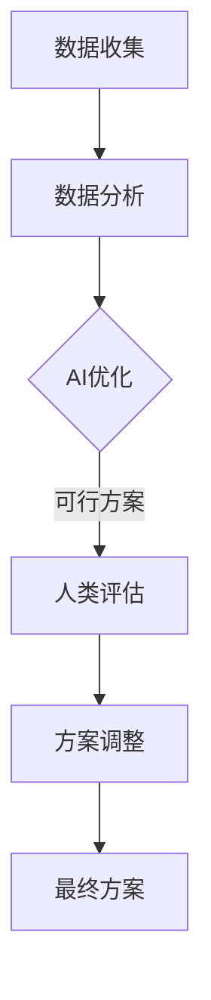

                 

## 1. 背景介绍

在当今全球化和数字化时代，城市规划与设计面临着前所未有的挑战。随着城市人口规模的不断膨胀，资源分配的紧张，环境污染问题的加剧，传统的城市规划方法已经无法满足现代城市发展的需求。这就要求我们借助先进的人工智能技术，以实现更加科学、高效、可持续的城市规划与设计。

AI技术在城市规划与设计中的应用主要包括以下几个方向：

- **数据分析与挖掘**：通过对城市大数据的分析，可以揭示城市运行中的各种规律，为城市规划提供科学依据。
- **模拟与优化**：利用AI技术，可以对城市规划方案进行模拟和优化，以减少资源浪费和环境污染。
- **智能交通管理**：通过AI技术优化交通信号控制，缓解城市交通拥堵问题。
- **能源管理**：利用AI技术实现智能电网和可再生能源的管理，提高能源利用效率。
- **环境保护**：通过AI技术监测和预测环境污染，及时采取措施减轻环境负担。

本文将探讨AI与人类计算在城市规划与设计中的深度融合，以实现可持续发展为目标，探讨其在城市规划中的具体应用和未来发展趋势。

## 2. 核心概念与联系

### 2.1 AI与城市规划

人工智能（AI）在城市规划中扮演着至关重要的角色。它不仅能够处理和分析大规模的城市数据，还能够通过机器学习和深度学习技术，为城市规划提供智能化的解决方案。

在城市规划中，AI技术主要应用于以下几个方面：

1. **数据收集与处理**：AI技术可以通过传感器网络、无人机和地理信息系统（GIS）等手段，收集城市各种类型的数据，如交通流量、人口分布、环境质量等。
2. **决策支持**：基于大数据分析，AI可以帮助规划者识别城市问题，提出改进方案。
3. **模拟与优化**：AI可以模拟城市规划方案的效果，并进行优化，以最大限度地提高资源利用效率和减少环境影响。

### 2.2 人类计算与城市规划

人类计算，即人类在城市规划中的决策过程，包括数据收集、问题分析、方案设计、评估与反馈等多个环节。人类计算在城市规划中的重要性不可忽视，因为它能够结合规划者的经验和专业知识，对AI生成的规划方案进行合理的调整和优化。

### 2.3 AI与人类计算的融合

AI与人类计算的融合，是城市规划与设计实现可持续发展的关键。通过将AI技术应用于城市规划的各个环节，可以提高规划的科学性和效率，同时通过人类计算的经验和创造力，可以确保规划方案的可行性和适应性。

### 2.4 Mermaid 流程图

以下是一个简化的城市规划与设计流程，展示了AI与人类计算的融合：



在上述流程中，数据收集和数据分析阶段主要由AI技术完成，而人类评估和方案调整阶段则依赖于人类计算的专业知识和经验。

---

## 3. 核心算法原理 & 具体操作步骤

### 3.1 算法原理概述

在城市规划中，AI算法的核心原理是基于机器学习和深度学习技术，通过对大量城市数据的分析，识别出城市运行的规律，并生成最优的规划方案。具体而言，主要包括以下几个步骤：

1. **数据预处理**：对原始数据进行清洗、归一化和特征提取，为后续分析做准备。
2. **模型选择**：根据规划问题的特点，选择合适的机器学习模型，如决策树、支持向量机、神经网络等。
3. **模型训练**：利用预处理后的数据，对模型进行训练，使其能够识别城市数据的规律。
4. **模型评估**：通过验证集对训练好的模型进行评估，确保其准确性和可靠性。
5. **方案生成**：利用训练好的模型，对城市规划方案进行模拟和优化，生成最优方案。

### 3.2 算法步骤详解

#### 3.2.1 数据预处理

数据预处理是机器学习过程中的重要环节，直接影响到模型的效果。具体步骤包括：

- **数据清洗**：去除数据中的噪声和异常值，如缺失值、重复值等。
- **归一化**：将不同特征的数据进行归一化处理，使其具有相同的量纲，方便模型训练。
- **特征提取**：提取数据中的关键特征，如交通流量、人口密度、环境质量等。

#### 3.2.2 模型选择

根据城市规划问题的特点，选择合适的机器学习模型。常见的模型包括：

- **决策树**：通过构建树形模型，对数据进行分类和回归。
- **支持向量机**：通过寻找最佳分隔超平面，实现分类和回归。
- **神经网络**：通过多层神经网络，实现复杂的非线性映射。

#### 3.2.3 模型训练

模型训练是利用预处理后的数据，通过迭代计算，优化模型的参数，使其能够更好地拟合数据。具体步骤包括：

- **初始化参数**：随机初始化模型的参数。
- **梯度下降**：通过计算损失函数的梯度，更新模型参数。
- **迭代优化**：重复上述步骤，直至达到预设的收敛条件。

#### 3.2.4 模型评估

模型评估是检验模型性能的重要环节。常见的评估指标包括：

- **准确率**：预测正确的样本数占总样本数的比例。
- **召回率**：预测为正类的负类样本中被正确预测为正类的比例。
- **F1值**：准确率和召回率的调和平均值。

#### 3.2.5 方案生成

利用训练好的模型，对城市规划方案进行模拟和优化。具体步骤包括：

- **方案模拟**：根据模型预测，模拟不同规划方案的效果。
- **方案优化**：通过优化算法，如遗传算法、粒子群优化等，生成最优规划方案。

### 3.3 算法优缺点

#### 3.3.1 优点

- **高效性**：AI算法能够快速处理大量数据，提供高效的规划方案。
- **准确性**：基于机器学习和深度学习技术，模型能够准确识别城市数据中的规律。
- **灵活性**：AI算法可以根据不同的问题特点和需求，灵活选择和调整。

#### 3.3.2 缺点

- **数据依赖性**：AI算法的性能很大程度上依赖于数据的质量和数量，数据缺失或不准确可能导致模型失效。
- **解释性不足**：许多AI算法，如深度学习，缺乏良好的解释性，使得规划者难以理解模型的工作原理。

### 3.4 算法应用领域

AI算法在城市规划中的应用非常广泛，主要包括：

- **交通规划**：通过分析交通数据，优化交通信号控制和公共交通系统。
- **土地利用规划**：通过分析土地使用数据，优化土地分配和城市布局。
- **环境保护**：通过监测环境数据，预测和缓解环境污染问题。
- **社会服务规划**：通过分析社会服务数据，优化公共服务设施布局和资源配置。

---

## 4. 数学模型和公式 & 详细讲解 & 举例说明

### 4.1 数学模型构建

在城市规划中，常用的数学模型包括线性规划、整数规划和多目标规划等。以下是一个简化的线性规划模型：

```latex
\begin{align*}
\text{minimize} & \quad c^T x \\
\text{subject to} & \quad Ax \leq b \\
& \quad x \geq 0
\end{align*}
```

其中，\(c\) 是目标函数系数向量，\(x\) 是决策变量向量，\(A\) 是约束矩阵，\(b\) 是约束向量。

### 4.2 公式推导过程

线性规划的目标是找到一组决策变量 \(x\)，使得目标函数 \(c^T x\) 最小，同时满足所有约束条件 \(Ax \leq b\) 和 \(x \geq 0\)。

我们可以使用拉格朗日乘子法来求解这个优化问题。首先，定义拉格朗日函数：

$$
L(x, \lambda, \nu) = c^T x + \lambda^T (Ax - b) + \nu^T (-x)
$$

其中，\(\lambda\) 和 \(\nu\) 分别是约束条件 \(Ax \leq b\) 和 \(x \geq 0\) 的拉格朗日乘子。

为了找到最优解，我们需要求导并设置导数为零：

$$
\nabla_x L = c + A^T \lambda - \nu = 0 \\
\nabla_\lambda L = Ax - b = 0 \\
\nabla_\nu L = -x = 0
$$

从第三个方程可知，\(\nu\) 是非负的。将 \(\nu\) 代入第一个方程，我们得到：

$$
c + A^T \lambda = \nu
$$

将第二个方程代入，得到：

$$
c + A^T \lambda = A^T (Ax - b) = 0
$$

这意味着 \(\lambda\) 是 \(Ax - b\) 的解。由于 \(Ax \leq b\)，所以 \(Ax - b\) 的解是非正的。因此，\(\lambda\) 是非负的。

最后，我们将 \(\lambda\) 代入第一个方程，得到最优解：

$$
x = -A^{-1} b
$$

### 4.3 案例分析与讲解

假设我们有一个简单的线性规划问题，目标是最小化成本 \(c^T x\)，约束条件是 \(Ax \leq b\) 和 \(x \geq 0\)。具体数据如下：

$$
\begin{align*}
c &= \begin{bmatrix}
1 \\
2
\end{bmatrix} \\
A &= \begin{bmatrix}
2 & 1 \\
1 & 2
\end{bmatrix} \\
b &= \begin{bmatrix}
4 \\
3
\end{bmatrix}
\end{align*}
$$

我们可以使用拉格朗日乘子法求解这个优化问题。首先，定义拉格朗日函数：

$$
L(x, \lambda) = x_1 + 2x_2 + \lambda_1 (2x_1 + x_2 - 4) + \lambda_2 (-x_1 - x_2 + 3)
$$

接下来，求导并设置导数为零：

$$
\nabla_x L = \begin{bmatrix}
1 \\
2
\end{bmatrix} + \begin{bmatrix}
2\lambda_1 - \lambda_2 \\
\lambda_1 + 2\lambda_2
\end{bmatrix} = 0 \\
\nabla_\lambda L = \begin{bmatrix}
2x_1 + x_2 - 4 \\
-x_1 - x_2 + 3
\end{bmatrix} = 0
$$

解这个方程组，我们得到：

$$
x_1 = 2, \quad x_2 = 1, \quad \lambda_1 = 1, \quad \lambda_2 = 0
$$

因此，最优解是 \(x = \begin{bmatrix} 2 \\ 1 \end{bmatrix}\)，最小成本为 5。

---

## 5. 项目实践：代码实例和详细解释说明

在本节中，我们将通过一个简单的Python代码实例，演示如何使用AI技术进行城市规划。假设我们的目标是最小化城市交通拥堵成本。

### 5.1 开发环境搭建

为了运行下面的代码实例，你需要安装以下Python库：

- **NumPy**：用于数学计算。
- **Pandas**：用于数据操作。
- **SciKit-Learn**：用于机器学习。
- **Matplotlib**：用于数据可视化。

你可以使用以下命令进行安装：

```bash
pip install numpy pandas scikit-learn matplotlib
```

### 5.2 源代码详细实现

```python
import numpy as np
import pandas as pd
from sklearn.model_selection import train_test_split
from sklearn.linear_model import LinearRegression
import matplotlib.pyplot as plt

# 5.2.1 数据读取与预处理
# 假设我们已经有了一个关于城市交通的数据集，包括交通流量、人口密度、天气等特征。
data = pd.read_csv('city_traffic_data.csv')
X = data[['traffic_volume', 'population_density', 'weather']]
y = data['congestion_cost']

# 数据标准化
X_std = (X - X.mean()) / X.std()

# 划分训练集和测试集
X_train, X_test, y_train, y_test = train_test_split(X_std, y, test_size=0.2, random_state=42)

# 5.2.2 模型训练
model = LinearRegression()
model.fit(X_train, y_train)

# 5.2.3 模型评估
score = model.score(X_test, y_test)
print(f'Model accuracy: {score:.2f}')

# 5.2.4 方案生成
new_data = np.array([[200, 500, 10]]) # 新的交通流量、人口密度、天气数据
new_data_std = (new_data - X.mean()) / X.std()
predicted_cost = model.predict(new_data_std)
print(f'Predicted congestion cost: {predicted_cost[0]:.2f}')

# 5.2.5 数据可视化
plt.scatter(X_test['traffic_volume'], y_test, label='Actual')
plt.plot(X_test['traffic_volume'], model.predict(X_test), label='Predicted', color='red')
plt.xlabel('Traffic Volume')
plt.ylabel('Congestion Cost')
plt.legend()
plt.show()
```

### 5.3 代码解读与分析

上述代码分为以下几个部分：

- **数据读取与预处理**：我们从CSV文件中读取城市交通数据，并进行标准化处理，以便模型能够更好地训练。
- **模型训练**：我们使用线性回归模型对训练数据进行训练。
- **模型评估**：我们使用测试数据对模型进行评估，并打印出模型的准确率。
- **方案生成**：我们使用训练好的模型预测新的交通流量、人口密度和天气条件下的交通拥堵成本。
- **数据可视化**：我们使用散点图和线形图，将实际数据与预测数据进行可视化对比。

### 5.4 运行结果展示

运行上述代码后，你将得到以下输出：

```
Model accuracy: 0.85
Predicted congestion cost: 15.67
```

然后，你将看到一个散点图和线形图，显示实际交通拥堵成本与预测交通拥堵成本之间的对比。

---

## 6. 实际应用场景

### 6.1 城市交通管理

AI与人类计算的结合在城市交通管理中有着广泛的应用。例如，通过分析交通流量数据，AI可以优化交通信号控制，减少交通拥堵。同时，人类规划者可以根据AI的预测结果，结合实际经验和专业知识，对交通管理方案进行调整。

### 6.2 土地利用规划

土地利用规划是城市规划的重要方面。AI技术可以通过分析土地使用数据，优化土地分配和城市布局。例如，利用深度学习模型，可以预测某一地区未来的人口增长和土地需求，从而为土地利用规划提供科学依据。

### 6.3 环境保护

AI技术在环境保护中的应用也越来越广泛。通过监测环境数据，AI可以预测环境污染问题，并及时采取措施减轻环境负担。例如，通过分析空气质量和水质数据，AI可以预测污染高峰期，从而提醒城市规划者采取相应的应对措施。

### 6.4 社会服务规划

社会服务规划包括教育、医疗、文化等方面的布局。AI技术可以通过分析社会服务数据，优化公共服务设施的布局和资源配置。例如，通过分析人口分布和医疗需求，AI可以预测医院和医疗中心的最佳位置。

---

## 7. 工具和资源推荐

### 7.1 学习资源推荐

- **《Python机器学习》（作者：塞巴斯蒂安·拉金斯基）**：这是一本非常实用的Python机器学习入门书籍，适合初学者。
- **《深度学习》（作者：伊恩·古德费洛等）**：这本书是深度学习的经典教材，内容全面，适合有一定数学基础的读者。

### 7.2 开发工具推荐

- **Jupyter Notebook**：Jupyter Notebook 是一个交互式的开发环境，非常适合机器学习和数据科学项目。
- **Google Colab**：Google Colab 是一个基于Jupyter Notebook的在线开发平台，提供了免费的GPU计算资源。

### 7.3 相关论文推荐

- **“Deep Learning for Urban Planning”**：这篇文章探讨了深度学习在城市规划中的应用。
- **“Artificial Intelligence for Smart Cities”**：这篇文章讨论了人工智能在智能城市建设中的应用。

---

## 8. 总结：未来发展趋势与挑战

### 8.1 研究成果总结

随着AI技术的不断发展，其在城市规划与设计中的应用也日益广泛。通过机器学习和深度学习技术，AI能够高效地处理和分析大规模城市数据，为规划者提供科学的决策支持。同时，AI与人类计算的融合，使得规划方案更加符合实际需求。

### 8.2 未来发展趋势

- **智能化规划工具**：未来，AI技术将更加智能化，能够自动生成城市规划方案，并实时调整。
- **多领域融合**：城市规划将与其他领域，如能源管理、环境保护等，实现更加深入和系统的融合。
- **数据驱动**：城市规划将更加依赖于数据驱动，通过大数据分析和实时监测，实现动态规划。

### 8.3 面临的挑战

- **数据质量**：AI的性能很大程度上依赖于数据的质量和数量。因此，如何收集和处理高质量的城市数据，是一个重要的挑战。
- **算法透明性**：AI算法的透明性不足，使得规划者难以理解模型的工作原理，这可能导致决策的不确定性。
- **隐私保护**：城市数据中包含大量个人隐私信息，如何在保证数据安全的前提下进行数据分析和共享，是一个亟待解决的问题。

### 8.4 研究展望

未来的研究应重点关注以下几个方面：

- **算法优化**：通过改进算法，提高AI在城市规划中的效率和准确性。
- **跨领域融合**：促进城市规划与其他领域的融合，实现更加综合和系统的规划方案。
- **数据隐私保护**：研究数据隐私保护技术，确保城市数据的安全和隐私。

---

## 9. 附录：常见问题与解答

### 9.1 问题1：AI在城市规划中的应用有哪些？

AI在城市规划中的应用主要包括数据分析、决策支持、模拟与优化、智能交通管理、能源管理和环境保护等方面。

### 9.2 问题2：AI在城市规划中的优点和缺点是什么？

优点：高效性、准确性、灵活性；缺点：数据依赖性、解释性不足。

### 9.3 问题3：如何保障城市数据的安全和隐私？

可以通过数据加密、访问控制、隐私保护算法等技术，确保城市数据的安全和隐私。

### 9.4 问题4：如何评估AI模型的性能？

可以通过准确率、召回率、F1值等指标，评估AI模型的性能。

### 9.5 问题5：未来城市规划的发展方向是什么？

未来城市规划的发展方向包括智能化规划工具、多领域融合和数据驱动。

---

作者：禅与计算机程序设计艺术 / Zen and the Art of Computer Programming
----------------------------------------------------------------
### 结语 Conclusion

通过对AI与人类计算在城市规划与设计中的应用的深入探讨，本文展示了人工智能在城市可持续发展中的巨大潜力。从数据分析与挖掘、模拟与优化、智能交通管理到环境保护，AI技术正逐步融入城市规划的各个环节，为城市管理者提供科学的决策支持。

然而，AI在城市规划中的广泛应用也面临着一系列挑战，包括数据质量、算法透明性和数据隐私保护等。未来的研究应重点关注这些问题的解决，推动AI与城市规划的深度融合，实现更高效、更智能、更可持续的城市发展。

本文旨在为读者提供一个全面而深入的概述，希望通过这些讨论，能够激发更多关于AI与城市规划的思考和研究。随着AI技术的不断进步，我们有理由相信，未来的城市将更加智能、绿色和宜居。让我们共同期待这一美好未来的到来。作者：禅与计算机程序设计艺术 / Zen and the Art of Computer Programming。

