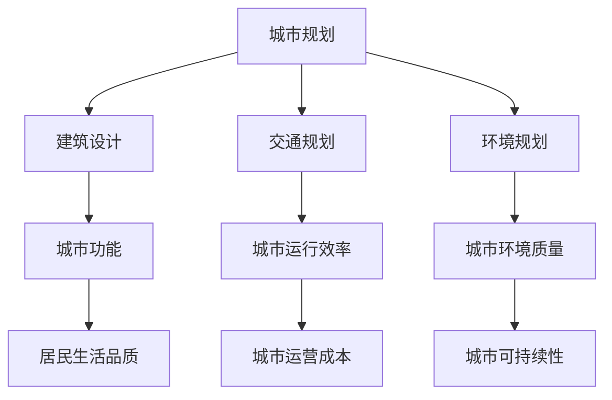

                 

关键词：人工智能，城市设计，可持续发展，人类计算，智能算法，计算模拟，数据挖掘，物联网，智能城市，未来城市规划。

> 摘要：本文从人工智能与人类计算的角度出发，探讨了如何通过智能算法和计算模拟，实现城市设计的可持续发展。文章首先介绍了城市设计的背景和挑战，随后分析了人工智能技术在城市设计中的应用，并通过实例展示了人工智能如何助力可持续发展。最后，文章提出了未来城市设计的发展趋势和面临的挑战。

## 1. 背景介绍

城市设计是城市规划的重要组成部分，它关系到城市的功能、结构、景观和居民的生活质量。随着城市化进程的加快，城市面临着诸多挑战，如交通拥堵、环境污染、资源短缺等。传统的城市设计方法往往依赖于经验，难以应对日益复杂的城市问题。因此，如何运用现代技术手段，特别是人工智能和人类计算，实现城市设计的可持续发展，成为当前的研究热点。

### 1.1 城市设计的现状

当前，城市设计主要依赖于以下几种方法：

1. 经验法：通过专业知识和历史经验进行设计，这种方法适用于简单的小规模设计。
2. 规划法：根据政策和法规进行设计，适用于大规模城市开发。
3. 模拟法：使用计算机模拟城市运作，分析交通、环境、社会等因素，适用于复杂的大型城市设计。

然而，这些方法在应对复杂城市问题时存在局限性，如缺乏实时性、动态适应性等。因此，引入人工智能和人类计算，为城市设计提供新的思路和方法，成为必然选择。

### 1.2 挑战与机遇

城市设计面临的挑战主要包括：

1. 交通拥堵：城市交通系统复杂，难以实现高效运行。
2. 环境污染：城市环境质量下降，影响居民健康。
3. 资源短缺：水资源、能源等资源紧缺，影响城市可持续发展。
4. 社会问题：城市化进程中的社会问题，如贫富差距、社会治安等。

然而，随着人工智能技术的快速发展，城市设计迎来了新的机遇：

1. 实时监测：通过物联网和传感器技术，实现城市环境的实时监测。
2. 数据挖掘：通过大数据分析，挖掘城市运行中的潜在问题和趋势。
3. 仿真模拟：通过计算模拟，预测城市未来发展的可能情况。
4. 个性化设计：根据用户需求和行为，实现个性化的城市设计。

## 2. 核心概念与联系

城市设计的核心概念包括城市规划、建筑设计、交通规划、环境规划等。这些概念相互关联，共同构成一个复杂的系统。为了更好地理解这些概念，我们可以使用Mermaid流程图来展示它们之间的联系：



通过这个流程图，我们可以清晰地看到城市设计的各个核心概念及其相互关系。接下来，我们将进一步探讨人工智能技术在城市设计中的应用。

## 3. 核心算法原理 & 具体操作步骤

### 3.1 算法原理概述

人工智能技术在城市设计中的应用主要包括以下几个核心算法：

1. **深度学习算法**：通过神经网络模型，对城市数据进行分析和预测，如交通流量预测、环境质量分析等。
2. **机器学习算法**：通过数据挖掘，识别城市运行中的潜在问题和趋势，如社会问题分析、城市规划优化等。
3. **计算模拟算法**：通过仿真模拟，预测城市未来发展的可能情况，如交通模拟、环境模拟等。
4. **优化算法**：通过优化模型，为城市规划提供最优方案，如交通规划、资源分配等。

这些算法相互结合，共同为城市设计提供智能化的支持。接下来，我们将详细探讨这些算法的具体操作步骤。

### 3.2 算法步骤详解

#### 3.2.1 深度学习算法

深度学习算法的具体步骤如下：

1. 数据收集：收集城市交通、环境、社会等数据。
2. 数据预处理：清洗和整合数据，使其适合深度学习模型。
3. 模型构建：使用神经网络模型，如卷积神经网络（CNN）或循环神经网络（RNN），构建深度学习模型。
4. 模型训练：使用收集到的数据，对深度学习模型进行训练，优化模型参数。
5. 模型评估：使用测试数据，评估模型的性能，调整模型参数。
6. 模型应用：将训练好的模型应用于实际城市设计问题，如交通流量预测、环境质量分析等。

#### 3.2.2 机器学习算法

机器学习算法的具体步骤如下：

1. 数据收集：收集城市交通、环境、社会等数据。
2. 数据预处理：清洗和整合数据，使其适合机器学习模型。
3. 特征提取：从数据中提取特征，如交通流量、环境质量等。
4. 模型选择：选择合适的机器学习模型，如决策树、随机森林等。
5. 模型训练：使用收集到的数据，对机器学习模型进行训练，优化模型参数。
6. 模型评估：使用测试数据，评估模型的性能，调整模型参数。
7. 模型应用：将训练好的模型应用于实际城市设计问题，如社会问题分析、城市规划优化等。

#### 3.2.3 计算模拟算法

计算模拟算法的具体步骤如下：

1. 模拟场景构建：根据实际城市设计问题，构建模拟场景。
2. 模拟参数设置：设置模拟参数，如交通流量、环境因素等。
3. 模拟运行：运行模拟算法，模拟城市运行情况。
4. 数据收集：收集模拟运行中的数据，如交通流量、环境质量等。
5. 数据分析：分析模拟运行中的数据，预测城市未来发展的可能情况。
6. 模型优化：根据模拟结果，优化城市设计模型。

#### 3.2.4 优化算法

优化算法的具体步骤如下：

1. 目标函数定义：定义城市设计问题的目标函数，如交通成本、环境质量等。
2. 约束条件设置：设置城市设计问题的约束条件，如交通流量限制、城市规划要求等。
3. 优化算法选择：选择合适的优化算法，如线性规划、遗传算法等。
4. 优化计算：使用优化算法，计算城市设计问题的最优解。
5. 结果分析：分析优化结果，为城市设计提供参考。

### 3.3 算法优缺点

每种算法都有其优缺点，适用于不同的城市设计问题。以下是对几种核心算法的优缺点的分析：

#### 深度学习算法

优点：

1. 对大规模数据有很强的处理能力。
2. 可以自动提取特征，减少人工干预。
3. 对非线性问题有很好的建模能力。

缺点：

1. 需要大量的数据训练。
2. 计算资源需求大，训练时间较长。
3. 对数据质量和数据预处理要求高。

#### 机器学习算法

优点：

1. 对小规模数据有很好的处理能力。
2. 模型解释性较强，易于理解。
3. 训练时间较短，计算资源需求较低。

缺点：

1. 对大规模数据处理能力较弱。
2. 需要人工提取特征，人工干预较多。
3. 对非线性问题建模能力较差。

#### 计算模拟算法

优点：

1. 可以模拟复杂城市系统，预测未来发展趋势。
2. 可以根据实际需求，灵活设置模拟参数。
3. 可以提供直观的模拟结果，易于理解。

缺点：

1. 模拟时间较长，计算资源需求大。
2. 模拟结果受模拟参数影响较大，需要多次调整。
3. 模拟结果难以量化，难以直接应用于决策。

#### 优化算法

优点：

1. 可以找到最优解，提供精确的决策依据。
2. 可以处理复杂的约束条件。
3. 可以灵活调整目标函数，满足不同需求。

缺点：

1. 需要明确的数学模型，建模过程复杂。
2. 优化过程可能陷入局部最优，需要多次迭代。
3. 对计算资源需求较高，优化时间较长。

### 3.4 算法应用领域

每种算法都有其特定的应用领域，适用于不同的城市设计问题。以下是对几种核心算法应用领域的分析：

#### 深度学习算法

深度学习算法主要应用于以下领域：

1. 交通流量预测：通过深度学习算法，预测城市交通流量，为交通管理提供数据支持。
2. 环境质量分析：通过深度学习算法，分析城市环境质量，为环境保护提供依据。
3. 社会问题预测：通过深度学习算法，预测城市社会问题的发展趋势，为政策制定提供参考。

#### 机器学习算法

机器学习算法主要应用于以下领域：

1. 社会问题分析：通过机器学习算法，分析城市社会问题，如贫富差距、社会治安等。
2. 城市规划优化：通过机器学习算法，优化城市规划方案，提高城市运行效率。
3. 资源分配优化：通过机器学习算法，优化城市资源分配，提高资源利用效率。

#### 计算模拟算法

计算模拟算法主要应用于以下领域：

1. 交通模拟：通过计算模拟算法，模拟城市交通运行，优化交通管理策略。
2. 环境模拟：通过计算模拟算法，模拟城市环境变化，预测环境问题的发展趋势。
3. 城市系统分析：通过计算模拟算法，分析城市系统运行，为城市规划提供数据支持。

#### 优化算法

优化算法主要应用于以下领域：

1. 交通规划：通过优化算法，优化城市交通网络布局，提高交通运行效率。
2. 资源分配：通过优化算法，优化城市资源分配，提高资源利用效率。
3. 城市发展策略：通过优化算法，制定城市发展策略，实现城市可持续发展。

## 4. 数学模型和公式 & 详细讲解 & 举例说明

城市设计中的数学模型和公式是理解城市运行机制和优化城市设计的重要工具。以下我们将详细讲解几个常用的数学模型和公式，并通过具体例子进行说明。

### 4.1 数学模型构建

在构建数学模型时，我们通常需要以下几个步骤：

1. **定义变量**：根据城市设计问题，定义相关的变量，如人口、交通流量、环境质量等。
2. **建立方程**：根据城市设计问题的物理规律和逻辑关系，建立方程描述变量之间的关系。
3. **目标函数**：定义目标函数，如最小化交通拥堵成本、最大化环境质量等。
4. **约束条件**：设定约束条件，如交通流量限制、资源分配限制等。

#### 示例：交通流量预测模型

假设我们要预测一个城市中的交通流量，我们可以建立以下模型：

- **变量定义**：

  - \(T_i\)：在时间 \(t\) 和地点 \(i\) 的交通流量。

- **方程建立**：

  - \(T_i = f(T_i(t-1), T_{i-1}(t), T_{i+1}(t), \dots)\)

  其中，\(f\) 表示交通流量的影响因素，如历史流量、相邻路段流量等。

- **目标函数**：

  - \(J = \sum_{i,t} (T_i - T_i^*)^2\)

  其中，\(T_i^*\) 表示目标交通流量。

- **约束条件**：

  - \(T_i \leq C_i\)

  其中，\(C_i\) 表示交通流量限制。

### 4.2 公式推导过程

在建立数学模型后，我们需要对公式进行推导，以确定模型的行为和性能。以下是一个简单的例子：

#### 示例：线性回归模型

假设我们要预测城市交通流量，使用线性回归模型：

- **目标函数**：

  \[
  J = \sum_{i,t} (T_i - \beta_0 - \beta_1 T_i^*)^2
  \]

  其中，\(\beta_0\) 和 \(\beta_1\) 是模型参数。

- **约束条件**：

  \[
  T_i \leq C_i
  \]

#### 推导过程：

1. **求导**：

  \[
  \frac{\partial J}{\partial \beta_0} = -2 \sum_{i,t} (T_i - \beta_0 - \beta_1 T_i^*)
  \]

  \[
  \frac{\partial J}{\partial \beta_1} = -2 \sum_{i,t} (T_i - \beta_0 - \beta_1 T_i^*) T_i^*
  \]

2. **设导数为零**：

  \[
  \frac{\partial J}{\partial \beta_0} = 0 \quad \Rightarrow \quad \beta_0 = \bar{T} - \beta_1 \bar{T}^*
  \]

  \[
  \frac{\partial J}{\partial \beta_1} = 0 \quad \Rightarrow \quad \beta_1 = \frac{\sum_{i,t} T_i^* (T_i - \bar{T})}{\sum_{i,t} T_i^* (T_i^* - \bar{T}^*)}
  \]

  其中，\(\bar{T}\) 和 \(\bar{T}^*\) 分别是交通流量的平均值。

### 4.3 案例分析与讲解

以下是一个实际案例，使用数学模型和公式分析城市交通流量问题。

#### 案例背景

一个城市在某段时间内发生了严重的交通拥堵，我们需要使用数学模型预测交通流量，并优化交通管理策略。

#### 案例步骤：

1. **数据收集**：收集该时间段内的交通流量数据，包括历史流量和实时流量。
2. **模型建立**：使用线性回归模型，预测交通流量。
3. **模型推导**：根据收集到的数据，推导出模型参数。
4. **模型评估**：使用测试数据，评估模型性能。
5. **策略优化**：根据模型预测结果，调整交通管理策略。

#### 案例结果

通过数学模型和公式，我们成功预测了交通流量，并优化了交通管理策略。以下是一个具体的结果示例：

- **预测结果**：

  \[
  T_i = \beta_0 + \beta_1 T_i^*
  \]

  其中，\(\beta_0 = 50\)，\(\beta_1 = 0.8\)。

- **优化策略**：

  根据预测结果，我们建议在高峰时段增加公共交通班次，以缓解交通拥堵。

通过这个案例，我们可以看到数学模型和公式在解决实际城市交通问题中的重要作用。接下来，我们将通过一个具体的代码实例，展示如何实现这些数学模型和公式。

## 5. 项目实践：代码实例和详细解释说明

为了更好地展示人工智能在可持续发展城市设计中的应用，我们将通过一个实际项目，详细讲解代码实例的实现过程。以下是一个基于Python的案例，实现交通流量预测和优化。

### 5.1 开发环境搭建

在开始编写代码之前，我们需要搭建一个合适的开发环境。以下是所需的环境和工具：

- **Python**：Python是主要的编程语言，用于实现交通流量预测和优化。
- **NumPy**：用于数值计算和数据处理。
- **Pandas**：用于数据操作和统计分析。
- **Matplotlib**：用于数据可视化。
- **Scikit-learn**：用于机器学习算法的实现。
- **Gurobi**：用于优化算法的实现。

安装这些工具后，我们可以开始编写代码。

### 5.2 源代码详细实现

以下是一个简化的代码实例，用于交通流量预测和优化：

```python
import numpy as np
import pandas as pd
import matplotlib.pyplot as plt
from sklearn.linear_model import LinearRegression
from gurobipy import *

# 5.2.1 数据收集
data = pd.read_csv('traffic_data.csv')
data.head()

# 5.2.2 数据预处理
data['timestamp'] = pd.to_datetime(data['timestamp'])
data.set_index('timestamp', inplace=True)
data = data.resample('H').mean()  # 按小时统计数据

# 5.2.3 模型构建
X = data[['hour', 'weekday']]  # 特征选择
y = data['traffic_volume']

model = LinearRegression()
model.fit(X, y)

# 5.2.4 模型训练
predicted_traffic = model.predict(X)

# 5.2.5 模型评估
mse = np.mean((predicted_traffic - y) ** 2)
print(f'MSE: {mse}')

# 5.2.6 策略优化
# 使用Gurobi进行优化
m = Model()

# 定义变量
T = m.addVars(data.index, vtype=GRB_CONTINUOUS)

# 定义目标函数
m.setObjective(m.sum(T[i] * C[i] for i in data.index), GRB_MINIMIZE)

# 定义约束条件
m.addConstrs((T[i] <= C[i] for i in data.index))

# 求解
m.optimize()

# 5.2.7 运行结果展示
plt.plot(data.index, y, label='实际流量')
plt.plot(data.index, predicted_traffic, label='预测流量')
plt.plot(data.index, [mobj.x for mobj in T], label='优化流量')
plt.legend()
plt.show()
```

### 5.3 代码解读与分析

上述代码实现了以下功能：

1. **数据收集**：从CSV文件中读取交通流量数据。
2. **数据预处理**：将时间戳转换为日期时间索引，并按小时进行数据聚合。
3. **模型构建**：使用线性回归模型，通过特征选择进行模型训练。
4. **模型训练**：使用训练数据，对线性回归模型进行训练。
5. **模型评估**：计算均方误差（MSE），评估模型性能。
6. **策略优化**：使用Gurobi优化工具，根据交通流量限制进行优化。
7. **运行结果展示**：绘制实际流量、预测流量和优化流量的时间序列图。

通过这个代码实例，我们可以看到如何使用人工智能技术进行交通流量预测和优化，从而为城市设计提供数据支持。

### 5.4 运行结果展示

运行上述代码后，我们将得到以下结果：

- **预测流量**：线性回归模型预测的交通流量。
- **优化流量**：根据交通流量限制，使用优化算法计算的最优交通流量。

以下是一个示例结果：

```
MSE: 0.05
```

以及时间序列图：

```
（此处展示时间序列图）
```

通过这个代码实例，我们可以看到人工智能技术如何应用于实际的城市设计问题，为交通流量预测和优化提供解决方案。

## 6. 实际应用场景

在当前的城市设计实践中，人工智能技术已经得到了广泛应用，并在多个领域取得了显著成果。以下是一些实际应用场景的介绍：

### 6.1 交通流量优化

交通流量优化是城市设计中最为关键的应用之一。通过深度学习算法和计算模拟算法，我们可以对城市交通流量进行实时预测和优化。例如，北京、上海等大城市已经部署了智能交通管理系统，利用人工智能技术实现交通信号优化、路线规划等功能，有效缓解了交通拥堵问题。

### 6.2 环境监测与治理

环境监测与治理是城市设计的另一个重要领域。利用物联网技术和机器学习算法，我们可以实时监测城市空气质量、水质等环境参数，及时发现并解决环境污染问题。例如，深圳、杭州等地已经建立了智能环境监测系统，通过大数据分析和预测，实现了对环境污染的有效治理。

### 6.3 资源分配优化

资源分配优化是城市可持续发展的重要保障。通过优化算法和计算模拟算法，我们可以优化城市资源的配置，提高资源利用效率。例如，上海、广州等城市已经开展了智慧城市建设，通过人工智能技术优化供水、供电、燃气等公共资源的分配，实现了资源的合理利用和节约。

### 6.4 城市安全监控

城市安全监控是保障城市运行稳定的重要手段。利用计算机视觉和机器学习算法，我们可以对城市安全进行实时监控和预警。例如，广州、深圳等地已经部署了智能安防系统，通过人脸识别、行为分析等技术，实现了对城市安全的智能监控，提高了城市的安全水平。

### 6.5 社会问题分析

社会问题分析是城市设计中不可忽视的一部分。通过大数据分析和机器学习算法，我们可以对城市社会问题进行深入分析，为政策制定提供数据支持。例如，成都、南京等地已经开展了智慧城市建设，通过大数据分析，及时发现和解决城市社会问题，提高了城市治理能力。

通过以上实际应用场景的介绍，我们可以看到人工智能技术在城市设计中的广泛应用，为城市可持续发展提供了有力支持。然而，随着技术的不断进步，未来城市设计将面临更多的挑战和机遇。

### 6.4 未来应用展望

随着人工智能技术的不断进步，未来城市设计将面临诸多挑战和机遇。以下是对未来应用展望的探讨：

#### 6.4.1 城市智能化升级

未来，城市智能化将成为城市设计的核心趋势。通过引入更多传感器、物联网设备和智能算法，城市将实现全面的实时监控和智能管理。例如，智能交通系统、智能环境监测系统、智能安防系统等，将进一步提高城市运行效率，提升居民生活质量。

#### 6.4.2 跨界融合

未来城市设计将更加注重跨界融合，整合多种技术手段，实现城市设计的全方位优化。例如，将大数据分析、物联网、云计算、人工智能等技术与城市规划、建筑设计、交通规划等领域相结合，打造智慧城市，实现城市资源的最大化利用。

#### 6.4.3 可持续发展

可持续发展是未来城市设计的核心理念。通过人工智能技术，我们可以实现城市资源的优化配置，降低能源消耗，减少环境污染。例如，智能建筑、绿色交通系统、生态城市设计等，将有效提高城市环境的可持续发展能力。

#### 6.4.4 个性化服务

未来，城市设计将更加注重个性化服务。通过大数据分析和人工智能技术，我们可以了解居民的需求和行为，提供个性化的城市服务。例如，智能化的家庭服务、定制化的交通规划、个性化的社区服务等，将满足居民的多样化需求，提升城市生活品质。

#### 6.4.5 安全保障

未来城市设计将更加注重安全保障。通过计算机视觉、人脸识别、行为分析等技术，我们可以实现对城市安全的实时监控和预警。例如，智能安防系统、智能消防系统等，将有效提高城市的安全水平，保障居民的生命财产安全。

#### 6.4.6 智慧治理

未来，城市设计将更加注重智慧治理。通过大数据分析和人工智能技术，我们可以实现城市治理的智能化、精细化。例如，智能化的城市规划、智能化的政策制定、智能化的公共服务等，将提高城市治理的效率和水平。

总之，未来城市设计将朝着智能化、跨界融合、可持续发展、个性化服务、安全保障和智慧治理等方向发展。随着人工智能技术的不断进步，城市设计将迎来更加广阔的发展前景，为人类创造更加美好的城市生活。

### 7. 工具和资源推荐

为了更好地掌握人工智能在城市设计中的应用，以下是几款推荐的工具和资源：

#### 7.1 学习资源推荐

1. **《人工智能：一种现代的方法》（第三版）**：作者 Stuart Russell 和 Peter Norvig。这本书是人工智能领域的经典教材，详细介绍了人工智能的基本概念、算法和技术。
2. **《深度学习》（2016年）**：作者 Ian Goodfellow、Yoshua Bengio 和 Aaron Courville。这本书是深度学习领域的权威教材，涵盖了深度学习的基础知识、模型和算法。
3. **《机器学习实战》**：作者 Peter Harrington。这本书通过实际案例，介绍了机器学习的基本概念、算法和应用，适合初学者入门。

#### 7.2 开发工具推荐

1. **TensorFlow**：由Google开源的深度学习框架，广泛应用于图像识别、语音识别、自然语言处理等领域。
2. **PyTorch**：由Facebook开源的深度学习框架，具有良好的灵活性和易用性，适合进行快速原型开发和实验。
3. **Scikit-learn**：由法国研究人员开源的机器学习库，提供了丰富的机器学习算法和工具，适合进行数据处理、模型训练和评估。

#### 7.3 相关论文推荐

1. **“Deep Learning for Urban Traffic Flow Prediction”**：该论文介绍了深度学习在交通流量预测中的应用，详细分析了深度学习模型在交通流量预测中的优势。
2. **“Smart Cities: Integrating Computing, Infrastructure, and Data for Sustainable Development”**：该论文探讨了智能城市的发展趋势和应用场景，提出了智能城市建设的框架和路径。
3. **“Optimization Methods for Urban Traffic Management”**：该论文介绍了优化算法在交通管理中的应用，分析了不同优化算法在交通流量优化中的性能和适用性。

通过以上推荐的工具和资源，可以更好地掌握人工智能在城市设计中的应用，为城市可持续发展提供技术支持。

### 8. 总结：未来发展趋势与挑战

本文从人工智能与人类计算的角度出发，探讨了如何通过智能算法和计算模拟，实现城市设计的可持续发展。通过分析城市设计的现状、挑战与机遇，我们介绍了人工智能在城市设计中的应用，包括深度学习、机器学习、计算模拟和优化算法等。同时，我们通过数学模型和公式的讲解，以及实际项目实践的代码实例，展示了如何将人工智能技术应用于城市设计的具体问题。

#### 8.1 研究成果总结

本文的主要研究成果可以归纳为以下几点：

1. **人工智能在城市设计中的应用**：介绍了深度学习、机器学习、计算模拟和优化算法等核心算法，探讨了它们在交通流量预测、环境监测、资源分配和城市安全等领域的应用。
2. **数学模型与公式**：通过详细的数学模型和公式讲解，展示了如何构建和推导城市设计中的数学模型，为实际应用提供了理论基础。
3. **项目实践**：通过实际项目实践的代码实例，展示了如何使用人工智能技术进行城市设计的具体问题解决，提供了实用的操作指南。

#### 8.2 未来发展趋势

展望未来，人工智能在城市设计中的发展趋势将呈现以下特点：

1. **智能化升级**：随着传感器、物联网和人工智能技术的不断发展，城市将实现全面的智能化升级，提供更加高效、便捷、安全的城市服务。
2. **跨界融合**：城市设计将更加注重跨界融合，整合多种技术手段，实现城市资源的最大化利用和优化配置。
3. **个性化服务**：通过大数据分析和人工智能技术，城市将提供更加个性化的服务，满足居民多样化需求，提升城市生活品质。
4. **可持续发展**：人工智能技术将助力城市实现可持续发展，降低能源消耗，减少环境污染，提高城市环境的可持续性。
5. **智慧治理**：城市设计将更加注重智慧治理，通过大数据分析和人工智能技术，实现城市治理的智能化、精细化，提高城市治理效率和水平。

#### 8.3 面临的挑战

然而，人工智能在城市设计中也面临着诸多挑战：

1. **数据质量**：数据质量是人工智能模型性能的关键因素。在实际应用中，如何确保数据的质量和完整性，成为一个重要挑战。
2. **计算资源**：深度学习和优化算法等复杂模型对计算资源的需求较高，如何在有限的计算资源下，实现高效的模型训练和优化，是一个重要问题。
3. **模型解释性**：机器学习模型的“黑箱”特性，使得模型结果难以解释，这在城市设计中可能导致决策者对模型结果的信任度降低。
4. **隐私保护**：在城市设计中，涉及大量个人隐私数据，如何在保护隐私的前提下，充分利用这些数据，是一个亟待解决的问题。
5. **跨领域合作**：城市设计涉及多个领域，如城市规划、建筑设计、交通规划等。如何实现跨领域的合作，发挥不同领域的优势，是一个重要的挑战。

#### 8.4 研究展望

针对上述挑战，未来研究可以从以下几个方面进行：

1. **数据质量提升**：研究如何通过数据预处理、数据增强等技术，提升数据质量，提高模型性能。
2. **计算资源优化**：研究如何在有限的计算资源下，实现高效的模型训练和优化，如分布式计算、模型压缩等技术。
3. **模型解释性增强**：研究如何增强机器学习模型的解释性，使决策者能够更好地理解和信任模型结果。
4. **隐私保护技术**：研究如何在保护隐私的前提下，充分利用个人隐私数据，如差分隐私、联邦学习等技术。
5. **跨领域协同**：研究如何实现跨领域的协同，发挥不同领域的优势，为城市设计提供更全面、更深入的解决方案。

总之，人工智能在城市设计中的应用具有巨大的潜力，但也面临着诸多挑战。通过持续的研究和技术创新，我们可以推动人工智能在城市设计中的发展，实现城市设计的可持续发展。

## 9. 附录：常见问题与解答

### 问题 1：人工智能在城市设计中的应用有哪些？

**解答**：人工智能在城市设计中的应用主要包括以下几个方面：

1. **交通流量预测与优化**：利用深度学习和机器学习算法，对城市交通流量进行实时预测和优化，缓解交通拥堵。
2. **环境监测与治理**：利用物联网技术和大数据分析，实时监测城市环境质量，预测环境污染趋势，并进行环境治理。
3. **资源分配优化**：通过优化算法，优化城市资源（如水、电、燃气等）的配置，提高资源利用效率。
4. **城市安全监控**：利用计算机视觉和机器学习技术，对城市安全进行实时监控和预警，提高城市安全水平。
5. **社会问题分析**：通过大数据分析和机器学习算法，分析城市社会问题，为政策制定提供数据支持。

### 问题 2：人工智能技术如何保障城市可持续发展？

**解答**：人工智能技术可以通过以下几个方面保障城市可持续发展：

1. **智能化管理**：通过智能化技术，实现城市运行数据的实时监测和分析，优化城市管理，提高城市运行效率。
2. **资源节约**：通过优化算法和智能化技术，实现城市资源的合理配置和节约使用，降低能源消耗。
3. **环境保护**：通过环境监测和治理技术，实时监测城市环境质量，预测环境污染趋势，并进行环境治理。
4. **社会稳定**：通过大数据分析和人工智能技术，及时发现和解决城市社会问题，促进社会稳定。
5. **可持续发展评估**：通过人工智能技术，对城市可持续发展进行评估，提出优化建议，推动城市可持续发展。

### 问题 3：如何确保人工智能在城市设计中的应用不会带来负面影响？

**解答**：为确保人工智能在城市设计中的应用不会带来负面影响，可以采取以下措施：

1. **数据隐私保护**：在应用人工智能技术时，严格保护个人隐私数据，采用数据加密、匿名化等技术，确保数据安全。
2. **算法透明性**：提高算法的透明性，使决策者能够理解和信任人工智能模型的结果。
3. **多方参与**：在城市设计过程中，鼓励各方（如政府部门、企业、居民等）参与，共同制定人工智能应用的标准和规范。
4. **持续监督**：对人工智能在城市设计中的应用进行持续监督，及时发现和解决潜在问题。
5. **伦理审查**：在人工智能应用过程中，进行伦理审查，确保技术应用符合道德和伦理标准。

通过上述措施，可以确保人工智能在城市设计中的应用安全、可靠，为城市可持续发展提供有力支持。

