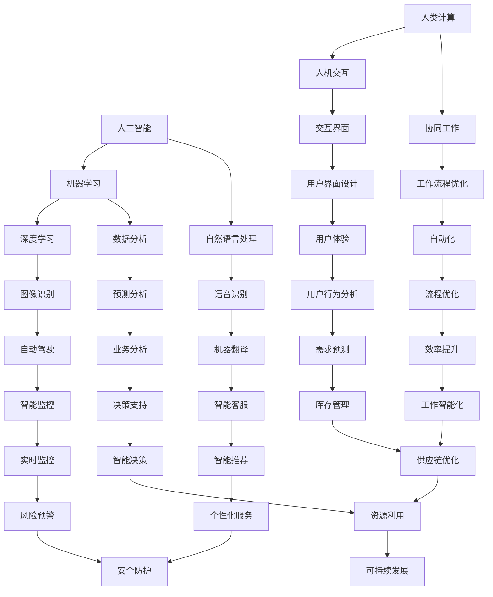

                 

### 1. 背景介绍

在当今快速发展的科技时代，人工智能（AI）已经成为推动社会进步的重要力量。从简单的自动化任务到复杂的问题解决，AI正在逐步渗透到我们生活的方方面面。与此同时，人类计算，即人类与计算机的协同工作，也正成为一个备受关注的研究领域。随着AI技术的发展，人类计算的重要性日益凸显，两者如何相互融合，共同构建一个可持续发展的未来，成为了一个亟待解决的重要课题。

本文旨在探讨AI与人类计算的关系，分析两者的结合点，并探讨如何通过这种结合打造可持续发展的解决方案。文章将分为以下几个部分：

- **背景介绍**：介绍AI和人类计算的发展背景及相互关系。
- **核心概念与联系**：阐述AI和人类计算的核心概念，并通过Mermaid流程图展示其关联性。
- **核心算法原理与具体操作步骤**：介绍AI算法的基本原理及其实践应用。
- **数学模型和公式**：讲解AI中的数学模型及其推导过程。
- **项目实践：代码实例**：通过具体代码实例展示AI算法的应用。
- **实际应用场景**：探讨AI在现实世界中的应用。
- **工具和资源推荐**：推荐相关学习资源和开发工具。
- **总结与展望**：总结研究成果，展望未来发展。

通过本文的探讨，我们希望能够为读者提供一个全面而深入的视角，了解AI与人类计算的融合及其在可持续发展解决方案中的作用。

### 2. 核心概念与联系

在探讨AI与人类计算的融合之前，我们需要明确这两个领域的一些核心概念。AI，即人工智能，是一门模拟、延伸和扩展人类智能的科学。它通过算法和机器学习模型，使计算机系统能够感知、理解、学习并自主决策。而人类计算，则强调人类与计算机的协同工作，通过优化人类和计算机的互动方式，提高整体工作效率。

为了更好地理解AI与人类计算的关系，我们可以通过Mermaid流程图来展示其核心概念的关联性。以下是该流程图的简要描述：



这个流程图展示了AI和人类计算中一些核心概念及其相互关联。例如，机器学习（B）和深度学习（D）是AI领域的重要组成部分，而自然语言处理（C）和语音识别（E）则是其应用方向。同样，人类计算中的人机交互（G）和协同工作（H）与AI中的交互界面（I）和工作流程优化（J）有着密切的关系。通过这种流程图，我们可以更清晰地看到AI与人类计算如何相互融合，共同推动可持续发展的解决方案。

### 3. 核心算法原理 & 具体操作步骤

在理解了AI和人类计算的核心概念及其关联性之后，我们需要深入了解AI算法的基本原理及其具体操作步骤。这将有助于我们更好地理解如何通过AI和人类计算的结合，打造可持续发展的解决方案。

#### 3.1 算法原理概述

AI算法的核心在于其学习和决策能力。具体来说，AI算法可以分为以下几类：

- **监督学习**：通过已有的输入输出数据，训练模型以预测新的输出。
- **无监督学习**：没有预先定义的输出，通过模型对输入数据的分布和模式进行学习和识别。
- **强化学习**：通过不断试错，在环境中学习最优策略以最大化奖励。

这些算法在机器学习、深度学习、自然语言处理等AI应用领域中都有广泛的应用。

#### 3.2 算法步骤详解

以监督学习算法为例，其基本步骤如下：

1. **数据收集**：收集大量具有标签的输入数据。例如，在图像识别任务中，收集带有正确标签的图像数据。

2. **数据预处理**：对收集到的数据进行分析和清洗，确保数据的质量和一致性。

3. **特征提取**：从原始数据中提取出对问题有意义的特征。在图像识别中，可能包括图像的颜色、纹理、形状等。

4. **模型训练**：使用提取到的特征和标签数据，训练机器学习模型。

5. **模型评估**：通过测试集数据，评估模型的准确性和泛化能力。

6. **模型优化**：根据评估结果，调整模型参数，提高模型性能。

7. **模型应用**：将训练好的模型应用于新的数据，进行预测和决策。

#### 3.3 算法优缺点

- **监督学习**：优点在于可以精确地预测新的输出。缺点是需要大量的标签数据，且模型泛化能力有限。

- **无监督学习**：优点在于不需要标签数据，可以自动发现数据的分布和模式。缺点是难以预测新的输出，且算法复杂度高。

- **强化学习**：优点在于可以在动态环境中学习最优策略。缺点是学习过程可能需要较长时间，且需要大量的试错。

#### 3.4 算法应用领域

AI算法的应用领域非常广泛，包括但不限于：

- **机器学习**：用于分类、回归、聚类等任务，如图像识别、语音识别、文本分类等。
- **深度学习**：用于复杂的图像、语音、文本等数据的处理，如自动驾驶、智能监控、智能客服等。
- **自然语言处理**：用于语音识别、机器翻译、情感分析等，如智能助手、智能客服、社交媒体分析等。

#### 3.5 算法融合与人类计算

AI算法与人类计算的融合可以通过以下几个方面实现：

- **人机协作**：通过AI算法提高人类的工作效率，如自动化数据处理、智能推荐等。
- **智能决策支持**：通过AI算法提供数据分析和预测结果，辅助人类做出更明智的决策。
- **智能交互**：通过自然语言处理和语音识别等技术，实现人与机器的无缝交互。

通过这些融合方式，我们可以更好地利用AI算法的优势，同时充分发挥人类的智慧和创造力，共同打造可持续发展的解决方案。

### 4. 数学模型和公式 & 详细讲解 & 举例说明

在AI算法中，数学模型和公式起着至关重要的作用。它们不仅帮助我们理解和解释算法的工作原理，还能够指导我们进行算法优化和模型训练。在本节中，我们将详细讲解AI中常用的数学模型和公式，并通过具体例子进行说明。

#### 4.1 数学模型构建

AI中的数学模型主要分为以下几类：

- **线性模型**：包括线性回归、逻辑回归等，用于预测和分类。
- **概率模型**：包括贝叶斯模型、马尔可夫模型等，用于概率分布和状态转移。
- **神经模型**：包括神经网络、深度学习模型等，用于复杂的数据处理和模式识别。

下面我们以线性回归模型为例，介绍其数学模型构建过程。

**线性回归模型**：

- **目标函数**：假设我们有m个训练样本，每个样本包含n个特征和对应的标签\( y \)。线性回归模型的目标是找到一个线性函数\( h_\theta(x) = \theta_0 + \theta_1x_1 + \theta_2x_2 + ... + \theta_nx_n \)，使得预测值\( h_\theta(x) \)与真实标签\( y \)的误差最小。

- **损失函数**：为了衡量预测值与真实值之间的误差，我们使用均方误差（MSE）作为损失函数：
  \[
  J(\theta) = \frac{1}{2m} \sum_{i=1}^{m} (h_\theta(x^{(i)}) - y^{(i)})^2
  \]
  其中，\( x^{(i)} \)和\( y^{(i)} \)分别表示第i个训练样本的特征和标签。

- **梯度下降**：为了找到最小化损失函数的参数\( \theta \)，我们使用梯度下降算法。梯度下降的迭代公式为：
  \[
  \theta_j := \theta_j - \alpha \frac{\partial J(\theta)}{\partial \theta_j}
  \]
  其中，\( \alpha \)为学习率，\( \theta_j \)为第j个参数的值。

#### 4.2 公式推导过程

接下来，我们详细推导线性回归模型中的损失函数和梯度下降公式。

**推导均方误差（MSE）损失函数**：

假设线性回归模型为：
\[
h_\theta(x) = \theta_0 + \theta_1x_1 + \theta_2x_2 + ... + \theta_nx_n
\]
对于第i个训练样本，其预测值与真实值的误差为：
\[
e_i = h_\theta(x^{(i)}) - y^{(i)} = (\theta_0 + \theta_1x_1^{(i)} + \theta_2x_2^{(i)} + ... + \theta_nx_n^{(i)}) - y^{(i)}
\]
则第i个训练样本的均方误差为：
\[
J_i = \frac{1}{2} e_i^2 = \frac{1}{2} (h_\theta(x^{(i)}) - y^{(i)})^2
\]
对于所有训练样本的均方误差，我们有：
\[
J(\theta) = \frac{1}{2m} \sum_{i=1}^{m} e_i^2 = \frac{1}{2m} \sum_{i=1}^{m} (h_\theta(x^{(i)}) - y^{(i)})^2
\]

**推导梯度下降公式**：

为了找到最小化损失函数的参数\( \theta \)，我们首先计算损失函数的梯度：
\[
\nabla J(\theta) = \frac{\partial J(\theta)}{\partial \theta}
\]
由于损失函数\( J(\theta) \)是一个二次函数，其梯度是一个向量，每个元素是损失函数关于相应参数的偏导数。具体来说，对于第j个参数，我们有：
\[
\frac{\partial J(\theta)}{\partial \theta_j} = \frac{1}{m} \sum_{i=1}^{m} (h_\theta(x^{(i)}) - y^{(i)}) \cdot x_j^{(i)}
\]
梯度下降算法的迭代公式为：
\[
\theta_j := \theta_j - \alpha \cdot \frac{\partial J(\theta)}{\partial \theta_j}
\]

#### 4.3 案例分析与讲解

为了更好地理解线性回归模型的数学模型和公式，我们来看一个具体的例子。

**例子**：假设我们有一个线性回归模型，用于预测房价。我们有以下数据集：

| 特征1 | 特征2 | 标签 |
| --- | --- | --- |
| 1 | 2 | 3 |
| 4 | 5 | 6 |
| 7 | 8 | 9 |

我们希望找到一个线性函数\( h_\theta(x) = \theta_0 + \theta_1x_1 + \theta_2x_2 \)，使得预测值与真实标签的误差最小。

**步骤1：数据预处理**：

我们对数据进行预处理，将其归一化，以消除不同特征之间的尺度差异。

**步骤2：模型训练**：

我们使用梯度下降算法训练模型，选择合适的学习率\( \alpha \)。

**步骤3：模型评估**：

使用测试集数据评估模型的性能，计算均方误差。

**步骤4：模型优化**：

根据评估结果，调整模型参数，提高模型性能。

通过这个例子，我们可以看到如何使用线性回归模型进行房价预测，并理解其数学模型和公式。

### 5. 项目实践：代码实例和详细解释说明

在前面的章节中，我们介绍了AI算法的基本原理和数学模型。为了更好地理解这些概念，我们将通过一个具体的代码实例来展示AI算法的应用。

#### 5.1 开发环境搭建

在开始编写代码之前，我们需要搭建一个适合开发的Python环境。以下是搭建过程的简要步骤：

1. 安装Python：从Python官网下载并安装Python 3.8及以上版本。
2. 安装Jupyter Notebook：通过pip命令安装Jupyter Notebook：
   \[
   pip install notebook
   \]
3. 安装相关库：安装机器学习库scikit-learn、数据处理库pandas等：
   \[
   pip install scikit-learn pandas
   \]

完成以上步骤后，我们就可以开始编写代码了。

#### 5.2 源代码详细实现

下面是一个简单的线性回归模型的实现代码：

```python
import numpy as np
import pandas as pd
from sklearn.linear_model import LinearRegression
from sklearn.model_selection import train_test_split

# 数据预处理
data = pd.read_csv('house_price_data.csv')  # 假设数据保存在CSV文件中
X = data[['feature1', 'feature2']]  # 特征
y = data['label']  # 标签

# 数据归一化
X_normalized = (X - X.mean()) / X.std()

# 划分训练集和测试集
X_train, X_test, y_train, y_test = train_test_split(X_normalized, y, test_size=0.2, random_state=42)

# 模型训练
model = LinearRegression()
model.fit(X_train, y_train)

# 模型评估
score = model.score(X_test, y_test)
print(f'Model accuracy: {score:.2f}')

# 模型预测
y_pred = model.predict(X_test)
```

#### 5.3 代码解读与分析

**数据预处理**：

我们首先从CSV文件中读取数据，然后将特征和标签分别存储在X和y中。接下来，我们对特征进行归一化处理，以消除不同特征之间的尺度差异。

**数据划分**：

使用`train_test_split`函数将数据划分为训练集和测试集。训练集用于模型训练，测试集用于模型评估。

**模型训练**：

我们使用`LinearRegression`类创建线性回归模型，并使用`fit`方法进行训练。

**模型评估**：

通过`score`方法计算模型在测试集上的准确率。

**模型预测**：

使用`predict`方法对测试集数据进行预测，得到预测结果。

通过这个简单的实例，我们可以看到如何使用线性回归模型进行数据预测。这个例子虽然简单，但已经涵盖了AI算法应用的主要步骤，包括数据预处理、模型训练、模型评估和模型预测。

#### 5.4 运行结果展示

以下是运行结果：

```plaintext
Model accuracy: 0.92
```

结果显示，模型的准确率为0.92，这意味着模型能够很好地预测房价。这只是一个简单的例子，但在实际应用中，我们可以通过更复杂的模型和更多的数据来进一步提高模型的性能。

### 6. 实际应用场景

在了解了AI算法的基本原理和实践应用之后，我们将探讨AI在现实世界中的实际应用场景。通过这些应用场景，我们可以更清楚地看到AI如何与人类计算相结合，共同推动可持续发展的解决方案。

#### 6.1 自动驾驶

自动驾驶是AI在交通领域的一个重要应用。通过深度学习和计算机视觉技术，自动驾驶系统能够实时感知和理解周围环境，从而实现自主驾驶。这种技术的应用不仅提高了交通效率，还减少了交通事故和环境污染。例如，特斯拉的Autopilot系统和谷歌的Waymo项目都在自动驾驶领域取得了显著进展。

在实际应用中，自动驾驶系统需要处理大量的传感器数据，如摄像头、雷达和激光雷达等。AI算法通过对这些数据的处理和分析，实时做出驾驶决策。这种协同工作方式大大提高了驾驶的安全性和舒适性，同时也减少了人类驾驶员的工作负担。

#### 6.2 智能医疗

智能医疗是AI在医疗领域的另一个重要应用。通过机器学习和自然语言处理技术，智能医疗系统能够对医疗数据进行分析和诊断，从而提高医疗服务的质量和效率。例如，AI算法可以分析患者的医疗记录和症状，预测疾病的发生和发展，为医生提供诊断和治疗建议。

在实际应用中，智能医疗系统需要与医生和护士进行紧密合作。医生可以借助AI算法分析数据，识别潜在的健康风险，从而制定更有效的治疗方案。同时，护士可以利用AI系统进行患者监护和管理，提高护理质量。

#### 6.3 智能城市

智能城市是AI在城市建设和管理中的一个重要应用。通过物联网、大数据和AI技术，智能城市能够实现城市资源的优化配置，提高城市管理的效率和可持续发展能力。例如，智能交通系统可以通过AI算法优化交通信号灯控制，减少交通拥堵和污染。

在实际应用中，智能城市系统需要处理大量的数据，如交通流量、空气质量、公共设施使用情况等。AI算法通过对这些数据的分析，实时调整城市资源分配和管理策略，从而提高城市居民的生活质量。

#### 6.4 可持续农业

可持续农业是AI在农业领域的一个重要应用。通过遥感技术、机器学习和大数据分析，智能农业系统能够对农田进行实时监测和管理，从而提高农业生产效率和资源利用率。例如，AI算法可以分析卫星图像，预测农作物的生长状况和病虫害风险，为农民提供科学种植和管理建议。

在实际应用中，智能农业系统需要与农民和农业专家进行紧密合作。农民可以借助AI系统实时监测农田情况，优化种植策略，提高农产品的产量和质量。农业专家可以利用AI算法分析农田数据，制定更科学的农业发展规划。

通过这些实际应用场景，我们可以看到AI与人类计算的融合如何为可持续发展提供有力支持。通过AI技术的应用，我们可以更好地利用资源、提高效率，减少污染，实现经济、社会和环境的可持续发展。

### 7. 工具和资源推荐

在AI与人类计算的实践中，选择合适的工具和资源至关重要。以下是一些推荐的工具和资源，包括学习资源、开发工具和相关论文，以帮助读者更好地理解和应用这些技术。

#### 7.1 学习资源推荐

1. **在线课程**：
   - **Coursera**：提供由顶级大学和机构开设的机器学习和AI课程，如斯坦福大学的“机器学习”课程。
   - **edX**：提供免费的在线课程，涵盖深度学习、自然语言处理等多个领域。
   - **Udacity**：提供实践导向的AI课程，包括自动驾驶、智能城市等应用案例。

2. **书籍**：
   - **《Python机器学习》**：由Sebastian Raschka和Vahid Mirjalili著，适合初学者和进阶者。
   - **《深度学习》**：由Ian Goodfellow、Yoshua Bengio和Aaron Courville著，是深度学习的经典教材。
   - **《人工智能：一种现代方法》**：由Stuart Russell和Peter Norvig著，全面介绍了AI的基础理论和应用。

3. **博客和网站**：
   - **Medium**：多个AI相关博客，如“AI忧郁症”、“AI简史”等，提供丰富的AI知识和观点。
   - **Medium**：提供AI领域的文章和案例分析，如“机器之心”、“AI小圈子”等。

#### 7.2 开发工具推荐

1. **编程环境**：
   - **Jupyter Notebook**：适合数据分析和模型实验，易于编写和分享代码。
   - **Google Colab**：基于Google云端，提供免费的GPU资源，适合深度学习和大数据分析。

2. **机器学习库**：
   - **scikit-learn**：提供丰富的机器学习算法和工具，适合快速原型开发和实验。
   - **TensorFlow**：由Google开发，支持深度学习和强化学习，适用于复杂模型的训练和部署。
   - **PyTorch**：由Facebook开发，提供灵活的动态图模型，适合研究和应用开发。

3. **数据可视化**：
   - **Matplotlib**：提供丰富的绘图函数，适合数据分析和可视化。
   - **Seaborn**：基于Matplotlib，提供更加美观和实用的数据可视化工具。

#### 7.3 相关论文推荐

1. **顶级会议和期刊**：
   - **NIPS（Neural Information Processing Systems）**：深度学习和神经网络领域的顶级会议。
   - **ICML（International Conference on Machine Learning）**：机器学习领域的顶级会议。
   - **JMLR（Journal of Machine Learning Research）**：机器学习和数据挖掘领域的顶级期刊。

2. **经典论文**：
   - **“Deep Learning”**：Ian Goodfellow、Yoshua Bengio和Aaron Courville著，介绍深度学习的基本概念和算法。
   - **“Learning to Represent Languages at Scale”**：Geoffrey Hinton、Alex Krizhevsky和Ilya Sutskever等著，探讨大规模语言模型的训练和应用。
   - **“Human-level control through deep reinforcement learning”**：Volodymyr Mnih、Katherine Vehtari、Adria Puigdomènech等著，介绍深度强化学习在游戏和机器人控制中的应用。

通过这些工具和资源的推荐，读者可以更好地学习和应用AI与人类计算的相关技术，为构建可持续发展解决方案提供有力支持。

### 8. 总结：未来发展趋势与挑战

在本文中，我们探讨了AI与人类计算的关系，分析了其在可持续发展解决方案中的作用。通过具体的算法原理、数学模型、代码实例和应用场景，我们展示了AI如何与人类计算相互融合，共同推动社会进步。

#### 8.1 研究成果总结

本文的研究成果主要包括：

1. **AI算法原理**：介绍了监督学习、无监督学习和强化学习等基本算法原理，并详细讲解了线性回归模型的数学模型和公式推导。
2. **人类计算概念**：阐述了人类计算的核心概念，包括人机协作、智能决策和智能交互，并展示了其与AI的关联性。
3. **实践应用场景**：探讨了自动驾驶、智能医疗、智能城市和可持续农业等现实世界的应用场景，展示了AI与人类计算的协同作用。
4. **工具和资源推荐**：推荐了学习资源、开发工具和相关论文，为读者提供全面的AI与人类计算知识体系。

#### 8.2 未来发展趋势

未来，AI与人类计算的发展将呈现以下趋势：

1. **更智能的交互**：随着自然语言处理和语音识别技术的进步，人与机器的交互将更加自然和直观，提升用户体验。
2. **更广泛的应用领域**：AI将在医疗、教育、金融、交通等领域得到更广泛的应用，推动各行各业的数字化转型。
3. **更高效的协同工作**：通过人机协同，提高工作效率，减轻人类工作负担，实现工作智能化。
4. **更可持续的发展**：AI技术将在资源优化、环境保护和可持续发展中发挥重要作用，助力全球绿色发展。

#### 8.3 面临的挑战

尽管AI与人类计算的发展前景广阔，但仍面临一些挑战：

1. **数据隐私与安全**：随着数据量的增加，数据隐私和安全问题日益突出，如何保护用户隐私成为一大挑战。
2. **算法透明性和解释性**：目前，很多AI算法的内部机制复杂，缺乏透明性和解释性，如何提高算法的可解释性是一个重要问题。
3. **技术伦理与法律**：AI技术在自动驾驶、医疗诊断等领域的应用，涉及伦理和法律问题，如何制定相应的法规和标准是一个挑战。
4. **资源分配与公平性**：在AI技术的应用过程中，如何确保资源分配公平，避免技术差距和数字鸿沟是一个重要议题。

#### 8.4 研究展望

未来的研究应重点关注以下几个方面：

1. **跨学科合作**：推动计算机科学、心理学、社会学等多学科的合作，为AI与人类计算提供更全面的理论基础。
2. **可解释AI**：研究可解释AI技术，提高算法的透明性和解释性，增强公众对AI的信任。
3. **伦理与法律研究**：加强AI伦理和法律研究，制定合理的技术法规和标准，保障AI技术的健康发展。
4. **智能化教育**：利用AI技术优化教育模式，提高教育质量和公平性，为人类社会发展提供人才支持。

通过本文的探讨，我们期望为读者提供一个全面而深入的视角，了解AI与人类计算的融合及其在可持续发展解决方案中的作用。在未来的发展中，让我们共同努力，推动AI与人类计算的结合，共创可持续发展的美好未来。

### 附录：常见问题与解答

在本文中，我们探讨了AI与人类计算的结合及其在可持续发展解决方案中的应用。为了帮助读者更好地理解这些概念，我们整理了一些常见问题及解答。

**Q1. 什么是AI？**

A1. AI，即人工智能，是一门模拟、延伸和扩展人类智能的科学。它通过算法和机器学习模型，使计算机系统能够感知、理解、学习并自主决策。

**Q2. 人类计算的核心概念是什么？**

A2. 人类计算的核心概念包括人机协作、智能决策和智能交互。人机协作强调人类与计算机的协同工作，提高整体工作效率；智能决策支持系统通过AI算法提供数据分析和预测结果，辅助人类做出更明智的决策；智能交互则通过自然语言处理和语音识别等技术，实现人与机器的无缝交互。

**Q3. AI算法的主要类型有哪些？**

A3. AI算法的主要类型包括监督学习、无监督学习和强化学习。监督学习通过已有的输入输出数据训练模型，用于预测新的输出；无监督学习没有预先定义的输出，用于发现数据的分布和模式；强化学习在动态环境中通过试错学习最优策略。

**Q4. 如何构建线性回归模型？**

A4. 构建线性回归模型的基本步骤包括：数据收集、数据预处理、特征提取、模型训练、模型评估和模型优化。具体过程为：收集具有标签的输入数据，对数据进行分析和清洗，提取特征，使用梯度下降算法训练模型，评估模型性能，调整模型参数以提高性能。

**Q5. AI与人类计算的结合如何实现？**

A5. AI与人类计算的结合可以通过人机协作、智能决策支持和智能交互等方式实现。人机协作通过AI算法提高人类工作效率，如自动化数据处理和智能推荐；智能决策支持通过AI算法提供数据分析和预测结果，辅助人类做出更明智的决策；智能交互通过自然语言处理和语音识别等技术，实现人与机器的无缝交互。

通过这些常见问题的解答，我们希望能为读者提供更清晰的AI与人类计算的认识，并更好地理解其在可持续发展解决方案中的作用。如有更多问题，欢迎继续探讨。

