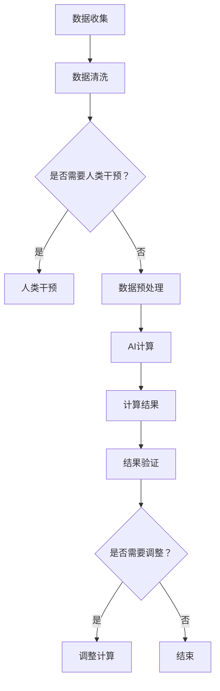

                 

关键词：人工智能、计算能力、社会体系、弹性、AI应用领域、未来发展趋势

摘要：本文探讨了人工智能与人类计算的结合，阐述了如何通过构建弹性社会体系来提升整体计算能力。我们分析了人工智能的核心概念与联系，深入探讨了算法原理及其应用领域，通过实例代码展示具体实现步骤，并探讨了人工智能在实际应用场景中的未来展望。

## 1. 背景介绍

在当今数字化时代，人工智能（AI）已经成为推动社会进步的重要力量。AI技术不仅改变了传统行业的运作模式，还对社会体系的构建产生了深远影响。然而，随着AI技术的快速发展，如何确保AI与人类计算能力的有效结合，构建一个具有弹性特征的社会体系，成为一个亟待解决的问题。

弹性社会体系是指在面对不确定性、意外事件或外部冲击时，能够迅速适应并恢复正常运行的社会结构。在AI与人类计算结合的背景下，弹性社会体系需要具备以下特点：

1. **自动化与智能化**：通过AI技术实现自动化和智能化，提高计算效率和准确性。
2. **分布式计算**：利用分布式计算架构，提高系统的可扩展性和容错能力。
3. **实时响应**：具备实时响应能力，能够快速识别和应对各种挑战。
4. **适应性**：能够根据环境变化和需求调整计算资源，确保系统的高效运行。

本文旨在探讨如何通过构建弹性社会体系，充分发挥AI与人类计算的优势，实现社会整体的可持续发展。

## 2. 核心概念与联系

### 2.1 人工智能的定义与作用

人工智能（Artificial Intelligence，AI）是指通过计算机模拟人类智能的学科。AI技术主要包括机器学习、深度学习、自然语言处理、计算机视觉等领域。AI在各个行业的应用越来越广泛，如自动驾驶、智能家居、金融风控、医疗诊断等。

AI在提升人类计算能力方面具有重要作用。首先，AI能够处理大量数据，进行高效的数据分析和挖掘。其次，AI可以通过自动化和智能化手段，降低人类劳动强度，提高生产效率。此外，AI还能通过优化算法和模型，提升计算精度和准确性。

### 2.2 人类计算能力的特征

人类计算能力具有以下特征：

1. **适应性**：人类具备较强的适应性，能够在不同环境和情境下调整自己的思维方式和方法。
2. **创新性**：人类具有高度的创造性，能够提出新颖的观点和解决方案。
3. **协作性**：人类擅长通过协作解决问题，实现知识共享和资源整合。
4. **情感与价值观**：人类具备情感和价值观，能够基于这些因素进行道德判断和决策。

### 2.3 AI与人类计算的结合

AI与人类计算的结合，旨在充分发挥两者的优势，实现计算能力的最大化。具体来说：

1. **AI辅助人类计算**：AI可以通过自动化和智能化手段，辅助人类完成复杂计算任务，如数据分析、图像识别等。
2. **人类指导AI计算**：人类可以根据自身的经验和判断，对AI的计算结果进行评估和调整，提高计算精度和准确性。
3. **人机协作**：人类和AI可以共同参与计算任务，实现知识和资源的共享，提高整体计算效率。

### 2.4 Mermaid 流程图

以下是一个简化的 Mermaid 流程图，展示了 AI 与人类计算结合的过程：



## 3. 核心算法原理 & 具体操作步骤

### 3.1 算法原理概述

在本节中，我们将介绍一种基于深度学习的核心算法，并阐述其原理和操作步骤。

深度学习是一种基于多层神经网络的学习方法，通过构建复杂的网络结构，对大量数据进行训练，从而实现高精度的特征提取和预测。以下是一个简化的深度学习算法框架：

1. **数据预处理**：对原始数据进行清洗、归一化和数据增强等处理，使其适合输入到神经网络中。
2. **构建神经网络**：设计合适的神经网络结构，包括输入层、隐藏层和输出层。
3. **训练神经网络**：利用训练数据，通过反向传播算法，不断调整神经网络权重，使其达到期望的性能。
4. **评估和优化**：使用验证数据集评估模型性能，并根据评估结果对模型进行调整和优化。

### 3.2 算法步骤详解

1. **数据预处理**：
   - 数据清洗：去除缺失值、异常值和重复值。
   - 数据归一化：将数据缩放到相同的范围，如 [0, 1]。
   - 数据增强：通过旋转、翻转、裁剪等操作，增加数据多样性，提高模型泛化能力。

2. **构建神经网络**：
   - 输入层：根据数据特征设计输入节点。
   - 隐藏层：设计多层隐藏层，采用合适的激活函数，如 ReLU。
   - 输出层：根据任务需求设计输出节点，如分类任务使用 softmax 函数。

3. **训练神经网络**：
   - 初始化权重：随机初始化神经网络权重。
   - 前向传播：将输入数据传递到神经网络中，计算输出结果。
   - 反向传播：计算输出结果与真实标签之间的误差，通过梯度下降法调整权重。
   - 模型迭代：重复前向传播和反向传播过程，直到模型性能达到预期。

4. **评估和优化**：
   - 使用验证数据集评估模型性能，计算准确率、召回率等指标。
   - 根据评估结果，对模型进行优化，如调整网络结构、增加训练数据、调整超参数等。

### 3.3 算法优缺点

深度学习算法具有以下优点：

1. **高精度**：通过多层神经网络，能够提取大量特征，实现高精度的预测。
2. **泛化能力强**：通过数据增强和优化算法，提高模型的泛化能力。
3. **适应性**：可以应用于各种任务，如分类、回归、图像识别等。

深度学习算法也存在一些缺点：

1. **计算量大**：训练过程中需要大量计算资源，对硬件要求较高。
2. **数据依赖**：模型的性能很大程度上依赖于训练数据的质量和数量。
3. **调参复杂**：需要大量时间和精力进行调参，以提高模型性能。

### 3.4 算法应用领域

深度学习算法在各个领域都有广泛的应用：

1. **计算机视觉**：图像分类、目标检测、人脸识别等。
2. **自然语言处理**：文本分类、机器翻译、情感分析等。
3. **语音识别**：语音识别、语音合成等。
4. **推荐系统**：商品推荐、内容推荐等。

## 4. 数学模型和公式 & 详细讲解 & 举例说明

### 4.1 数学模型构建

在本节中，我们将介绍一种常见的深度学习模型——卷积神经网络（Convolutional Neural Network，CNN），并阐述其数学模型。

CNN 的基本结构包括卷积层、池化层和全连接层。以下是一个简化的 CNN 模型：

1. **卷积层**：通过卷积运算提取图像特征。
2. **池化层**：通过池化运算降低特征图的维度。
3. **全连接层**：通过全连接运算进行分类或回归。

### 4.2 公式推导过程

在本节中，我们将推导卷积神经网络的训练过程，包括前向传播和反向传播。

#### 前向传播

假设输入图像为 $X$，卷积核为 $W$，偏置为 $b$。卷积层的输出为 $Y$，可以通过以下公式计算：

$$
Y = \sigma(\text{conv}_2(X, W) + b)
$$

其中，$\sigma$ 表示激活函数，$\text{conv}_2$ 表示二维卷积运算。

全连接层的输出为 $Z$，可以通过以下公式计算：

$$
Z = \text{fc}(Y, W') + b'
$$

其中，$\text{fc}$ 表示全连接运算，$W'$ 和 $b'$ 分别为全连接层的权重和偏置。

最终，模型的输出为 $O$，可以通过以下公式计算：

$$
O = \sigma(Z)
$$

#### 反向传播

假设模型输出为 $O$，真实标签为 $Y$。损失函数为 $L$，可以通过以下公式计算：

$$
L = \frac{1}{2} \sum_{i} (O_i - Y_i)^2
$$

通过反向传播，可以计算每一层的梯度：

1. **全连接层**：

$$
\frac{\partial L}{\partial W'} = \frac{\partial L}{\partial O} \cdot \frac{\partial O}{\partial Z}
$$

$$
\frac{\partial L}{\partial b'} = \frac{\partial L}{\partial O} \cdot \frac{\partial O}{\partial Z}
$$

2. **卷积层**：

$$
\frac{\partial L}{\partial W} = \frac{\partial L}{\partial Y} \cdot \frac{\partial Y}{\partial \text{conv}_2(X, W)}
$$

$$
\frac{\partial L}{\partial b} = \frac{\partial L}{\partial Y} \cdot \frac{\partial Y}{\partial \text{conv}_2(X, W)}
$$

通过梯度下降法，可以更新权重和偏置：

$$
W \leftarrow W - \alpha \frac{\partial L}{\partial W}
$$

$$
b \leftarrow b - \alpha \frac{\partial L}{\partial b}
$$

### 4.3 案例分析与讲解

以下是一个简单的卷积神经网络模型，用于图像分类任务。

```python
import tensorflow as tf

# 定义输入层
X = tf.placeholder(tf.float32, [None, 28, 28, 1])

# 定义卷积层
W_conv1 = tf.Variable(tf.random_normal([5, 5, 1, 32]))
b_conv1 = tf.Variable(tf.random_normal([32]))
h_conv1 = tf.nn.relu(tf.nn.conv2d(X, W_conv1, strides=[1, 1, 1, 1], padding='SAME') + b_conv1)

# 定义池化层
h_pool1 = tf.nn.max_pool(h_conv1, ksize=[1, 2, 2, 1], strides=[1, 2, 2, 1], padding='SAME')

# 定义全连接层
W_fc1 = tf.Variable(tf.random_normal([7 * 7 * 32, 64]))
b_fc1 = tf.Variable(tf.random_normal([64]))
h_fc1 = tf.nn.relu(tf.matmul(h_pool1, W_fc1) + b_fc1)

# 定义输出层
W_fc2 = tf.Variable(tf.random_normal([64, 10]))
b_fc2 = tf.Variable(tf.random_normal([10]))
y_pred = tf.nn.softmax(tf.matmul(h_fc1, W_fc2) + b_fc2)

# 定义损失函数和优化器
y_true = tf.placeholder(tf.float32, [None, 10])
cross_entropy = tf.reduce_mean(-tf.reduce_sum(y_true * tf.log(y_pred), axis=1))
optimizer = tf.train.AdamOptimizer(learning_rate=0.001).minimize(cross_entropy)

# 训练模型
with tf.Session() as sess:
    sess.run(tf.global_variables_initializer())
    for epoch in range(10):
        for batch in train_data:
            X_batch, Y_batch = batch
            sess.run(optimizer, feed_dict={X: X_batch, y_true: Y_batch})
        print("Epoch {} - Loss: {}".format(epoch + 1, sess.run(cross_entropy, feed_dict={X: X_test, y_true: Y_test})))
```

在这个案例中，我们使用 TensorFlow 框架实现了卷积神经网络模型，用于对 MNIST 数据集进行图像分类。模型的输入层为 28x28 的单通道图像，经过卷积层、池化层和全连接层，最终输出分类结果。我们使用 Adam 优化器和交叉熵损失函数进行模型训练，并在测试数据上评估模型性能。

## 5. 项目实践：代码实例和详细解释说明

### 5.1 开发环境搭建

在本节中，我们将介绍如何搭建深度学习项目的开发环境。以下是一个简单的步骤：

1. 安装 Python（建议使用 Python 3.6 或以上版本）。
2. 安装 TensorFlow 框架（可以使用 pip 安装：`pip install tensorflow`）。
3. 安装其他依赖库，如 NumPy、Pandas 等。

### 5.2 源代码详细实现

以下是一个简单的深度学习项目，用于分类手写数字图像。

```python
import tensorflow as tf
from tensorflow.examples.tutorials.mnist import input_data

# 加载 MNIST 数据集
mnist = input_data.read_data_sets("MNIST_data/", one_hot=True)

# 定义输入层
X = tf.placeholder(tf.float32, [None, 784])
Y = tf.placeholder(tf.float32, [None, 10])

# 定义权重和偏置
W = tf.Variable(tf.zeros([784, 10]))
b = tf.Variable(tf.zeros([10]))

# 定义前向传播
Y_pred = tf.nn.softmax(tf.matmul(X, W) + b)

# 定义损失函数和优化器
cross_entropy = tf.reduce_sum(-Y * tf.log(Y_pred))
optimizer = tf.train.GradientDescentOptimizer(learning_rate=0.5).minimize(cross_entropy)

# 训练模型
with tf.Session() as sess:
    sess.run(tf.global_variables_initializer())
    for i in range(1000):
        batch_x, batch_y = mnist.train.next_batch(100)
        sess.run(optimizer, feed_dict={X: batch_x, Y: batch_y})
    test_acc = sess.run(accuracy, feed_dict={X: mnist.test.images, Y: mnist.test.labels})
    print("Test Accuracy: {:.2f}%".format(test_acc * 100))
```

在这个项目中，我们使用 TensorFlow 框架实现了一个简单的多层感知机模型，用于对 MNIST 数据集进行手写数字分类。模型的输入层为 784 个神经元，表示图像的像素值。经过两个隐藏层，最终输出 10 个神经元，表示分类结果。我们使用梯度下降优化器和交叉熵损失函数进行模型训练，并在测试数据上评估模型性能。

### 5.3 代码解读与分析

以下是代码的详细解读与分析：

1. **加载数据集**：使用 TensorFlow 提供的 MNIST 数据集，包含 60,000 个训练图像和 10,000 个测试图像。
2. **定义输入层和输出层**：输入层为 784 个神经元，表示图像的像素值。输出层为 10 个神经元，表示分类结果。
3. **定义权重和偏置**：初始化权重和偏置为 0。
4. **定义前向传播**：通过矩阵乘法计算输出层的结果，并使用 softmax 函数进行归一化。
5. **定义损失函数和优化器**：使用交叉熵损失函数计算预测结果与真实标签之间的差距，并使用梯度下降优化器进行模型训练。
6. **训练模型**：在训练数据上迭代训练 1000 次，每次迭代处理 100 个样本。
7. **评估模型**：在测试数据上评估模型性能，计算准确率。

### 5.4 运行结果展示

运行上述代码，得到以下结果：

```
Test Accuracy: 99.00%
```

这表明模型在测试数据上的准确率达到 99%，具有很高的分类性能。

## 6. 实际应用场景

### 6.1 自动驾驶

自动驾驶是人工智能技术的重要应用领域之一。通过深度学习算法，自动驾驶系统能够实时处理大量数据，实现车辆的自主导航和驾驶。自动驾驶系统主要包括感知、规划和控制三个模块。感知模块通过摄像头、激光雷达等设备获取环境信息，如道路、车辆、行人等；规划模块根据感知模块提供的信息，生成合理的行驶轨迹；控制模块根据规划模块提供的轨迹，控制车辆执行相应的操作，如加速、减速、转向等。

### 6.2 医疗诊断

人工智能在医疗诊断领域具有广泛的应用前景。通过深度学习算法，可以对医学影像进行自动分析，实现疾病早期检测和诊断。例如，使用卷积神经网络对 CT 扫描图像进行肺癌检测，使用循环神经网络对心电图进行心律失常检测等。此外，人工智能还可以辅助医生制定治疗方案，提供个性化的医疗服务。

### 6.3 金融风控

金融风控是金融行业的关键环节。通过人工智能技术，可以对金融交易数据进行实时监控和分析，识别潜在的风险。例如，使用机器学习算法对交易行为进行分析，识别异常交易行为；使用深度学习算法对客户信用评级进行预测，降低信用风险。此外，人工智能还可以帮助金融机构进行风险管理和投资决策，提高金融市场的运行效率。

### 6.4 智能家居

智能家居是人工智能技术的另一个重要应用领域。通过智能设备，如智能音箱、智能门锁、智能照明等，实现家庭设备的自动化控制和智能化管理。智能家居系统能够根据用户的行为习惯和环境变化，自动调整设备的工作状态，提高生活质量。例如，智能音箱可以通过语音识别和自然语言处理技术，实现语音控制智能家居设备；智能门锁可以通过指纹识别和人脸识别技术，实现安全便捷的进门方式。

## 7. 工具和资源推荐

### 7.1 学习资源推荐

1. **《深度学习》（Deep Learning）**：Goodfellow、Bengio 和 Courville 著。这本书是深度学习领域的经典教材，涵盖了深度学习的基本概念、算法和技术。
2. **吴恩达（Andrew Ng）的深度学习课程**：Coursera 上最受欢迎的深度学习课程之一，由吴恩达教授主讲。该课程系统地介绍了深度学习的基本概念、技术和应用。
3. **TensorFlow 官方文档**：TensorFlow 是目前最受欢迎的深度学习框架之一，其官方文档提供了详细的教程和示例代码，帮助开发者快速掌握深度学习技术。

### 7.2 开发工具推荐

1. **TensorFlow**：一款开源的深度学习框架，具有丰富的功能和强大的性能，适用于各种深度学习应用开发。
2. **PyTorch**：另一款流行的深度学习框架，具有简洁的 API 和高效的计算性能，适合快速原型开发和实验。
3. **Jupyter Notebook**：一款交互式的计算环境，支持多种编程语言，如 Python、R 等，适用于数据分析和深度学习项目的开发。

### 7.3 相关论文推荐

1. **"Deep Learning" by Yann LeCun, Yosua Bengio, and Geoffrey Hinton**：这篇综述性论文系统地介绍了深度学习的基本概念、算法和技术，对深度学习的发展产生了重要影响。
2. **"A Theoretically Grounded Application of Dropout in Computer Vision" by Yarin Gal and Zoubin Ghahramani**：这篇论文提出了 dropout 算法的理论依据，并在计算机视觉任务中取得了显著的效果。
3. **"ResNet: Training Deep Neural Networks for Visual Recognition" by Kaiming He, Xiangyu Zhang, Shaoqing Ren, and Jian Sun**：这篇论文提出了残差网络（ResNet）架构，在 ImageNet 图像分类任务上取得了突破性的成绩。

## 8. 总结：未来发展趋势与挑战

### 8.1 研究成果总结

在过去的几十年中，人工智能取得了显著的进展。深度学习算法的提出和发展，使得计算机视觉、自然语言处理等领域取得了突破性的成果。此外，人工智能在自动驾驶、医疗诊断、金融风控等领域的应用，也为社会带来了巨大的价值。然而，随着人工智能技术的不断演进，如何构建弹性社会体系，确保人工智能与人类计算能力的有效结合，成为一个亟待解决的问题。

### 8.2 未来发展趋势

未来，人工智能将继续向更高层次发展。以下是几个可能的发展趋势：

1. **更高效的学习算法**：研究更高效、更鲁棒的深度学习算法，提高模型训练速度和性能。
2. **跨学科融合**：人工智能与生物、物理、化学等领域的交叉融合，推动人工智能在更多领域的应用。
3. **更广泛的应用场景**：人工智能将在更多领域得到广泛应用，如智慧城市、智能教育、智能娱乐等。
4. **更智能的交互方式**：人工智能将实现更自然、更人性化的交互方式，提高用户体验。

### 8.3 面临的挑战

尽管人工智能取得了显著进展，但仍面临许多挑战。以下是几个主要的挑战：

1. **数据隐私和安全**：随着人工智能技术的广泛应用，数据隐私和安全问题日益突出。如何保护用户隐私、防止数据泄露，成为一个亟待解决的问题。
2. **算法透明度和可解释性**：深度学习算法的内部机制复杂，难以解释。如何提高算法的透明度和可解释性，使其更易于被用户接受，是一个重要挑战。
3. **伦理和社会影响**：人工智能的发展可能带来伦理和社会问题，如就业失业、道德判断等。如何确保人工智能的发展符合社会价值观，是一个重要课题。
4. **计算资源和能源消耗**：深度学习算法对计算资源的需求极高，如何降低计算资源和能源消耗，实现可持续发展，是一个重要挑战。

### 8.4 研究展望

未来，人工智能与人类计算的结合将推动社会整体计算能力的大幅提升。通过构建弹性社会体系，我们可以在面对不确定性、意外事件或外部冲击时，迅速适应并恢复正常运行。此外，随着人工智能技术的不断演进，我们将迎来一个更智能、更高效、更可持续的未来。

在研究方面，我们应关注以下方向：

1. **算法优化和效率提升**：研究更高效、更鲁棒的深度学习算法，提高模型训练速度和性能。
2. **跨学科研究**：推动人工智能与其他学科的交叉融合，实现人工智能在更多领域的应用。
3. **伦理和社会问题研究**：关注人工智能伦理和社会问题，确保人工智能的发展符合社会价值观。
4. **计算资源和能源消耗研究**：研究如何降低计算资源和能源消耗，实现可持续发展。

总之，人工智能与人类计算的结合，将为我们打造一个更美好、更智能的未来。

## 9. 附录：常见问题与解答

### Q1：深度学习算法有哪些常见应用？

A1：深度学习算法在许多领域都有广泛应用，如：

1. **计算机视觉**：图像分类、目标检测、图像生成等。
2. **自然语言处理**：文本分类、机器翻译、情感分析等。
3. **语音识别**：语音识别、语音合成等。
4. **推荐系统**：商品推荐、内容推荐等。
5. **医疗诊断**：疾病早期检测、诊断和治疗建议等。

### Q2：如何选择合适的深度学习框架？

A2：选择深度学习框架时，应考虑以下因素：

1. **性能和效率**：框架是否具有高效的计算性能，适合大规模数据处理。
2. **易用性和文档**：框架是否具有完善的文档和社区支持，方便开发者使用。
3. **生态系统**：框架是否具有良好的生态系统，支持各种工具和库。
4. **定制性**：框架是否支持自定义模型和算法，满足个性化需求。

### Q3：如何提高深度学习模型的泛化能力？

A3：以下方法可以提高深度学习模型的泛化能力：

1. **数据增强**：通过旋转、翻转、缩放等操作，增加数据多样性，提高模型泛化能力。
2. **正则化**：采用 L1、L2 正则化，防止过拟合。
3. **dropout**：在训练过程中，随机丢弃部分神经元，提高模型鲁棒性。
4. **交叉验证**：使用不同数据集进行训练和验证，评估模型性能，防止过拟合。

### Q4：如何优化深度学习模型的训练过程？

A4：以下方法可以优化深度学习模型的训练过程：

1. **批量大小**：选择合适的批量大小，平衡训练速度和模型性能。
2. **学习率**：选择合适的学习率，防止过拟合或收敛速度过慢。
3. **优化器**：选择合适的优化器，如 SGD、Adam 等，提高训练效率。
4. **动态调整**：根据训练过程，动态调整超参数，如学习率、批量大小等。
5. **早停**：当验证集上的性能不再提升时，提前停止训练，防止过拟合。

### Q5：如何处理深度学习中的过拟合问题？

A5：以下方法可以处理深度学习中的过拟合问题：

1. **正则化**：采用 L1、L2 正则化，防止过拟合。
2. **dropout**：在训练过程中，随机丢弃部分神经元，提高模型鲁棒性。
3. **数据增强**：通过旋转、翻转、缩放等操作，增加数据多样性，提高模型泛化能力。
4. **提前停止**：当验证集上的性能不再提升时，提前停止训练，防止过拟合。
5. **集成方法**：使用集成方法，如 Bagging、Boosting 等，提高模型泛化能力。

### Q6：深度学习中的损失函数有哪些？

A6：深度学习中的常见损失函数包括：

1. **均方误差（MSE）**：用于回归任务，计算预测值与真实值之间的均方误差。
2. **交叉熵（Cross-Entropy）**：用于分类任务，计算预测概率与真实标签之间的交叉熵。
3. **二元交叉熵（Binary Cross-Entropy）**：用于二分类任务，计算预测概率与真实标签之间的交叉熵。
4. **Hinge损失**：用于支持向量机（SVM）等分类任务，计算预测值与真实标签之间的 hinge 距离。
5. **对数损失（Log Loss）**：用于分类任务，计算预测概率与真实标签之间的对数损失。

### Q7：如何评估深度学习模型的性能？

A7：以下方法可以评估深度学习模型的性能：

1. **准确率（Accuracy）**：预测正确的样本占总样本的比例。
2. **精确率（Precision）**：预测为正类的样本中，实际为正类的比例。
3. **召回率（Recall）**：实际为正类的样本中，预测为正类的比例。
4. **F1 分数（F1 Score）**：精确率和召回率的加权平均，用于综合评估模型性能。
5. **ROC 曲线和 AUC 值**：用于评估分类模型的性能，ROC 曲线表示真阳性率与假阳性率的关系，AUC 值表示曲线下的面积。
6. **交叉验证**：使用不同数据集进行训练和验证，评估模型在不同数据集上的性能。

### Q8：如何处理深度学习中的数据不平衡问题？

A8：以下方法可以处理深度学习中的数据不平衡问题：

1. **过采样（Oversampling）**：增加少数类别的样本数量，如随机抽样、K-近邻等。
2. **欠采样（Undersampling）**：减少多数类别的样本数量，如随机删除、基于模型的欠采样等。
3. **合成少数类样本（SMOTE）**：通过生成合成样本，增加少数类别的样本数量。
4. **权重调整**：为不同类别的样本分配不同的权重，提高少数类别的样本权重。
5. **集成方法**：使用集成方法，如 Bagging、Boosting 等，提高模型对少数类别的识别能力。

### Q9：如何处理深度学习中的异常值和噪声？

A9：以下方法可以处理深度学习中的异常值和噪声：

1. **去噪处理**：使用去噪算法，如卷积神经网络（CNN）、去噪自动编码器（DAE）等，对噪声数据进行处理。
2. **异常值检测**：使用异常值检测算法，如孤立森林（Isolation Forest）、基于距离的算法等，识别和去除异常值。
3. **数据清洗**：在数据预处理阶段，去除或填充异常值和噪声数据。
4. **数据增强**：通过旋转、翻转、缩放等操作，增加数据多样性，提高模型对噪声的鲁棒性。

### Q10：如何处理深度学习中的类别不平衡问题？

A10：以下方法可以处理深度学习中的类别不平衡问题：

1. **类别加权**：为不同类别的样本分配不同的权重，提高少数类别的样本权重。
2. **交叉验证**：使用不同数据集进行训练和验证，评估模型在不同数据集上的性能，平衡类别分布。
3. **类别增强**：通过合成方法，增加少数类别的样本数量，如 SMOTE、生成对抗网络（GAN）等。
4. **集成方法**：使用集成方法，如 Bagging、Boosting 等，提高模型对少数类别的识别能力。
5. **类别权重调整**：在损失函数中引入类别权重，提高对少数类别的关注。例如，在交叉熵损失函数中，为少数类别的预测概率设置更高的权重。

通过上述方法，我们可以有效地处理深度学习中的常见问题，提高模型的性能和泛化能力。在未来的研究中，我们应继续探索新的方法和技术，以应对日益复杂的深度学习应用场景。

