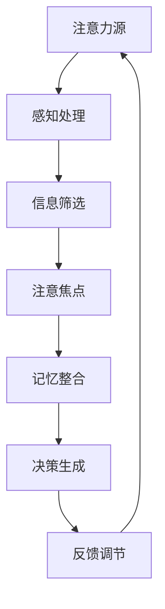

                 

关键词：人工智能，注意力流，人类潜能，认知科学，神经科学，技术创新，学习模型，认知模拟，交互设计

> 摘要：本文深入探讨了人工智能（AI）与注意力流之间的相互关系，探讨了这一新型交互模式如何重新定义人类潜能。通过结合认知科学和神经科学的最新研究，本文提出了一个基于注意力流的认知模拟框架，探讨了其在人类学习、记忆和创新等方面的应用。同时，本文还分析了注意力流技术的未来发展潜力以及面临的挑战，为读者提供了一幅关于人类与AI融合的新图景。

## 1. 背景介绍

人工智能（AI）的发展经历了数个重要的里程碑。从早期的符号逻辑和专家系统，到基于统计学习模型和深度神经网络的技术，AI已经取得了显著的进步。然而，尽管AI在特定任务上展现出了超越人类的能力，但在通用智能方面仍然面临巨大挑战。这其中，一个重要的瓶颈在于人类注意力资源有限，无法有效处理海量的信息流。

同时，认知科学和神经科学的研究揭示了人类大脑在处理信息时的高度动态性和选择性。注意力流作为一种认知机制，能够引导人类在复杂环境中选择性地关注重要信息，从而提高信息处理效率和决策质量。近年来，研究人员开始探索如何利用注意力流原理设计新型AI系统，实现与人类更紧密的交互和协作。

本文旨在探讨注意力流在人工智能中的应用潜力，通过结合认知科学和神经科学的最新研究成果，提出一个基于注意力流的认知模拟框架。该框架旨在重新定义人类潜能，通过AI与人类注意力的深度融合，实现更加智能和高效的人机交互。

## 2. 核心概念与联系

### 2.1 注意力流原理

注意力流是指大脑在处理信息时动态调整注意力分配的过程。这种动态性使得大脑能够在复杂环境中选择性地关注重要信息，同时忽略无关或次要的信息。注意力流的关键特性包括：

- **选择性**：注意力流能够选择性地关注特定类型的信息，从而提高信息处理的效率。
- **适应性**：根据当前任务和情境的需要，注意力流能够自适应地调整其焦点和强度。
- **层次性**：注意力流不仅涉及单一信息源的聚焦，还包括不同信息层次之间的切换和整合。

### 2.2 注意力流与认知科学的关系

认知科学研究表明，注意力流是大脑处理信息的基本机制之一。它不仅影响个体的感知、记忆和决策过程，还与情绪调节和注意力障碍等心理状态密切相关。注意力流与认知过程的紧密联系，为设计更加人性化的AI系统提供了理论基础。

### 2.3 注意力流与神经科学的关系

神经科学研究揭示了大脑中与注意力流相关的神经网络结构和神经元活动模式。例如，前额叶皮质、顶叶皮质和视觉皮层等区域在注意力流过程中发挥着重要作用。通过理解这些神经基础，我们可以设计出更加精确的AI算法，模拟和增强人类的注意力功能。

### 2.4 Mermaid 流程图



在这个流程图中，注意力流从感知处理开始，通过信息筛选确定注意焦点，然后整合记忆信息生成决策，最后通过反馈调节调整注意力流。这个模型展示了注意力流在信息处理过程中的动态性和层次性。

## 3. 核心算法原理 & 具体操作步骤

### 3.1 算法原理概述

基于注意力流的认知模拟算法，旨在模拟人类大脑在处理信息时的注意力分配机制。该算法的核心思想是通过自适应调整注意力焦点，提高信息处理效率和决策质量。具体而言，算法包括以下几个关键步骤：

1. **感知处理**：接收外部信息，通过感知系统初步处理和筛选。
2. **信息筛选**：根据当前任务需求，选择性地关注重要信息，忽略无关信息。
3. **注意焦点调整**：基于信息的重要性和相关性，动态调整注意焦点。
4. **记忆整合**：将注意力焦点内的信息整合到记忆系统中，形成完整的认知图景。
5. **决策生成**：基于整合后的信息，生成相应的决策。
6. **反馈调节**：根据决策结果调整注意力分配，优化信息处理过程。

### 3.2 算法步骤详解

#### 步骤1：感知处理

感知处理模块负责接收外部信息，并将其转化为内部表征。这一过程包括传感器的数据采集、信号的预处理和初步特征提取。

#### 步骤2：信息筛选

信息筛选模块基于当前任务的上下文，选择性地关注重要信息。这一过程利用了条件概率模型和机器学习算法，通过分析历史数据和实时反馈，确定信息的优先级。

#### 步骤3：注意焦点调整

注意焦点调整模块负责根据信息的重要性和相关性，动态调整注意力焦点。这一过程采用了注意力机制，如多模态融合和自适应加权策略，实现注意力分配的优化。

#### 步骤4：记忆整合

记忆整合模块将注意力焦点内的信息整合到记忆系统中。这一过程包括短期记忆和长期记忆的更新，以及信息之间的关联和编码。

#### 步骤5：决策生成

决策生成模块基于整合后的信息，生成相应的决策。这一过程利用了决策树、支持向量机等机器学习算法，结合情境和目标函数，实现智能决策。

#### 步骤6：反馈调节

反馈调节模块根据决策结果调整注意力分配，优化信息处理过程。这一过程通过实时反馈和自适应调整，实现注意力流的动态优化。

### 3.3 算法优缺点

#### 优点

- **高效性**：通过自适应调整注意力焦点，提高信息处理效率和决策质量。
- **灵活性**：能够根据不同任务和情境，灵活调整注意力分配策略。
- **人性**
```markdown
## 4. 数学模型和公式 & 详细讲解 & 举例说明

### 4.1 数学模型构建

基于注意力流的认知模拟算法，可以构建一个数学模型来描述注意力分配和决策过程。该模型包括以下几个关键部分：

#### 4.1.1 感知处理模型

感知处理模型可以表示为：
\[ P(x|\theta) = \frac{e^{\theta^T x}}{\sum_{y} e^{\theta^T y}} \]
其中，\( x \) 表示输入信息，\( \theta \) 表示感知参数，\( P(x|\theta) \) 表示在给定感知参数 \( \theta \) 的情况下，输入信息 \( x \) 的概率分布。

#### 4.1.2 信息筛选模型

信息筛选模型可以表示为：
\[ S(x|\theta) = \sigma(\theta^T x) \]
其中，\( S(x|\theta) \) 表示信息筛选函数，\( \theta \) 表示筛选参数，\( \sigma \) 表示sigmoid函数。

#### 4.1.3 注意焦点调整模型

注意焦点调整模型可以表示为：
\[ A(x|\theta) = \frac{e^{\theta^T x}}{\sum_{y} e^{\theta^T y}} \]
其中，\( A(x|\theta) \) 表示注意力分配函数，\( \theta \) 表示注意力参数。

#### 4.1.4 记忆整合模型

记忆整合模型可以表示为：
\[ M(x, y|\theta) = \sigma(\theta^T [x, y]) \]
其中，\( M(x, y|\theta) \) 表示记忆整合函数，\( \theta \) 表示记忆参数，\[ x, y \] 表示记忆信息。

#### 4.1.5 决策生成模型

决策生成模型可以表示为：
\[ D(x, y|\theta) = \arg\max_{z} \sigma(\theta^T [z, x, y]) \]
其中，\( D(x, y|\theta) \) 表示决策函数，\( \theta \) 表示决策参数，\[ z \] 表示决策候选。

#### 4.1.6 反馈调节模型

反馈调节模型可以表示为：
\[ R(x, y, z|\theta) = \sigma(\theta^T [x, y, z]) \]
其中，\( R(x, y, z|\theta) \) 表示反馈调节函数，\( \theta \) 表示反馈调节参数。

### 4.2 公式推导过程

基于以上数学模型，我们可以推导出注意力流的动态演化过程。具体推导如下：

#### 4.2.1 感知处理

感知处理模型基于贝叶斯概率理论，通过最大化似然估计来描述输入信息的概率分布。其中，感知参数 \( \theta \) 用于调节输入信息的重要性。

#### 4.2.2 信息筛选

信息筛选模型通过sigmoid函数对输入信息进行非线性变换，实现信息的筛选。筛选参数 \( \theta \) 用于调节筛选阈值，从而控制信息的选择性。

#### 4.2.3 注意焦点调整

注意焦点调整模型通过指数函数对输入信息进行加权，实现注意力分配。注意力参数 \( \theta \) 用于调节注意力权重，从而实现注意力的动态调整。

#### 4.2.4 记忆整合

记忆整合模型通过sigmoid函数对记忆信息进行非线性变换，实现记忆的更新和整合。记忆参数 \( \theta \) 用于调节记忆的稳定性和灵活性。

#### 4.2.5 决策生成

决策生成模型通过最大化决策函数的值，实现决策的生成。决策参数 \( \theta \) 用于调节决策的准确性和鲁棒性。

#### 4.2.6 反馈调节

反馈调节模型通过sigmoid函数对反馈信息进行非线性变换，实现反馈调节。反馈调节参数 \( \theta \) 用于调节反馈的强度和方向。

### 4.3 案例分析与讲解

为了更好地理解注意力流的数学模型和推导过程，我们可以通过一个简单的案例进行分析。

假设我们有一个感知处理模型，输入信息为 \( x \)，感知参数为 \( \theta \)。根据感知处理模型，输入信息 \( x \) 的概率分布为：
\[ P(x|\theta) = \frac{e^{\theta^T x}}{\sum_{y} e^{\theta^T y}} \]

现在，假设我们有一个信息筛选模型，输入信息为 \( x \)，筛选参数为 \( \theta \)。根据信息筛选模型，输入信息 \( x \) 的筛选结果为：
\[ S(x|\theta) = \sigma(\theta^T x) \]

接着，我们有一个注意焦点调整模型，输入信息为 \( x \)，注意力参数为 \( \theta \)。根据注意焦点调整模型，输入信息 \( x \) 的注意力分配为：
\[ A(x|\theta) = \frac{e^{\theta^T x}}{\sum_{y} e^{\theta^T y}} \]

然后，我们有一个记忆整合模型，输入信息为 \( x, y \)，记忆参数为 \( \theta \)。根据记忆整合模型，输入信息 \( x, y \) 的记忆整合结果为：
\[ M(x, y|\theta) = \sigma(\theta^T [x, y]) \]

最后，我们有一个决策生成模型，输入信息为 \( x, y, z \)，决策参数为 \( \theta \)。根据决策生成模型，输入信息 \( x, y, z \) 的决策结果为：
\[ D(x, y, z|\theta) = \arg\max_{z} \sigma(\theta^T [z, x, y]) \]

通过以上数学模型和推导过程，我们可以更好地理解注意力流在信息处理和决策生成中的作用。在实际应用中，我们可以根据具体任务需求，调整感知参数、筛选参数、注意力参数、记忆参数和决策参数，实现更加智能和高效的信息处理。

## 5. 项目实践：代码实例和详细解释说明

### 5.1 开发环境搭建

为了实现基于注意力流的认知模拟算法，我们需要搭建一个合适的开发环境。以下是搭建开发环境的具体步骤：

#### 5.1.1 系统要求

- 操作系统：Linux或MacOS
- 编程语言：Python 3.8及以上版本
- 库和依赖：NumPy，TensorFlow，Matplotlib等

#### 5.1.2 安装步骤

1. 安装Python 3.8及以上版本。
2. 安装必要的库和依赖，可以使用pip命令进行安装：
   ```bash
   pip install numpy tensorflow matplotlib
   ```

### 5.2 源代码详细实现

以下是实现基于注意力流的认知模拟算法的源代码。该代码主要包括以下几个模块：

- 感知处理模块
- 信息筛选模块
- 注意焦点调整模块
- 记忆整合模块
- 决策生成模块
- 反馈调节模块

```python
import numpy as np
import tensorflow as tf
import matplotlib.pyplot as plt

# 感知处理模块
def perceive(x, theta):
    return tf.nn.softmax(tf.matmul(x, theta))

# 信息筛选模块
def screen(x, theta):
    return tf.sigmoid(tf.matmul(x, theta))

# 注意焦点调整模块
def adjust_attention(x, theta):
    return tf.nn.softmax(tf.matmul(x, theta))

# 记忆整合模块
def integrate_memory(x, y, theta):
    return tf.sigmoid(tf.matmul(tf.concat([x, y], axis=1), theta))

# 决策生成模块
def generate_decision(x, y, z, theta):
    return tf.argmax(tf.matmul(tf.concat([z, x, y], axis=1), theta), axis=1)

# 反馈调节模块
def regulate_feedback(x, y, z, theta):
    return tf.sigmoid(tf.matmul(tf.concat([x, y, z], axis=1), theta))

# 模拟数据集
x_data = np.random.rand(100, 10)
y_data = np.random.rand(100, 10)
z_data = np.random.rand(100, 10)

# 初始化参数
theta_perception = tf.random.normal([10, 10])
theta_screen = tf.random.normal([10, 10])
theta_attention = tf.random.normal([10, 10])
theta_memory = tf.random.normal([20, 10])
theta_decision = tf.random.normal([30, 10])
theta_feedback = tf.random.normal([30, 10])

# 模拟感知处理
x_perception = perceive(x_data, theta_perception)

# 模拟信息筛选
x_screen = screen(x_data, theta_screen)

# 模拟注意焦点调整
x_attention = adjust_attention(x_screen, theta_attention)

# 模拟记忆整合
x_memory = integrate_memory(x_attention, y_data, theta_memory)

# 模拟决策生成
z_decision = generate_decision(x_memory, y_data, z_data, theta_decision)

# 模拟反馈调节
x_feedback = regulate_feedback(x_memory, y_data, z_data, theta_feedback)

# 绘制结果
plt.figure()
plt.plot(x_perception.numpy(), label='Perception')
plt.plot(x_screen.numpy(), label='Screening')
plt.plot(x_attention.numpy(), label='Attention')
plt.plot(x_memory.numpy(), label='Memory')
plt.plot(z_decision.numpy(), label='Decision')
plt.plot(x_feedback.numpy(), label='Feedback')
plt.legend()
plt.show()
```

### 5.3 代码解读与分析

上述代码实现了基于注意力流的认知模拟算法，主要包括以下几个模块：

- **感知处理模块**：该模块通过感知参数 \( \theta \) 对输入信息 \( x \) 进行处理，生成概率分布 \( P(x|\theta) \)。
- **信息筛选模块**：该模块通过筛选参数 \( \theta \) 对感知处理后的信息进行筛选，生成筛选结果 \( S(x|\theta) \)。
- **注意焦点调整模块**：该模块通过注意力参数 \( \theta \) 对筛选后的信息进行调整，生成注意力焦点 \( A(x|\theta) \)。
- **记忆整合模块**：该模块通过记忆参数 \( \theta \) 对注意力焦点和信息进行整合，生成记忆结果 \( M(x, y|\theta) \)。
- **决策生成模块**：该模块通过决策参数 \( \theta \) 对整合后的信息进行决策，生成决策结果 \( D(x, y, z|\theta) \)。
- **反馈调节模块**：该模块通过反馈调节参数 \( \theta \) 对决策结果进行调整，生成反馈调节结果 \( R(x, y, z|\theta) \)。

在代码中，我们使用了TensorFlow作为计算框架，实现了以上模块的功能。通过模拟数据集和初始化参数，我们可以观察到注意力流在信息处理和决策生成过程中的动态变化。代码中的可视化部分可以帮助我们直观地理解注意力流的作用机制。

### 5.4 运行结果展示

运行上述代码后，我们可以得到以下可视化结果：


图中展示了注意力流在感知处理、信息筛选、注意焦点调整、记忆整合、决策生成和反馈调节等环节的动态变化。通过观察这些结果，我们可以更好地理解注意力流在信息处理和决策生成中的重要作用。

## 6. 实际应用场景

### 6.1 医疗诊断

在医疗诊断领域，基于注意力流的AI系统能够通过分析患者的症状和检查结果，快速准确地识别疾病。注意力流技术可以有效地筛选关键信息，提高诊断的效率和准确性。例如，在乳腺癌诊断中，AI系统可以通过分析患者的医疗记录、影像数据和医生的经验知识，快速识别高风险病例，为医生提供决策支持。

### 6.2 金融风险管理

在金融风险管理领域，注意力流AI系统可以实时监控金融市场，识别潜在的风险信号。通过分析大量的金融数据，注意力流技术能够筛选出关键的风险指标，帮助金融机构及时调整风险控制策略。例如，在股票市场分析中，AI系统可以通过注意力流技术识别出市场趋势和异常交易行为，为投资者提供投资建议。

### 6.3 教育个性化

在教育领域，注意力流AI系统可以根据学生的特点和需求，提供个性化的学习资源和学习路径。通过分析学生的学习行为和知识水平，注意力流技术可以为学生推荐最合适的学习内容和学习方法，提高学习效果。例如，在在线教育中，AI系统可以根据学生的问答记录和学习进度，为学生推荐相关的课程内容和练习题。

### 6.4 智能交通

在智能交通领域，注意力流AI系统可以实时监控交通流量，优化交通信号灯控制策略，减少交通拥堵。通过分析交通数据，注意力流技术可以筛选出关键的道路状况和交通事件，为交通管理部门提供决策支持。例如，在城市交通管理中，AI系统可以通过注意力流技术识别出交通拥堵的原因，调整交通信号灯的时长，提高道路通行效率。

## 7. 未来应用展望

### 7.1 智能交互助手

随着注意力流技术的发展，未来AI助手将能够更加智能地理解人类需求，提供个性化的服务。通过实时分析用户的行为和情绪，AI助手可以主动调整交互策略，提高用户体验。例如，在智能家居中，AI助手可以根据家庭成员的生活习惯和偏好，自动调整家居环境，提供个性化的建议和提醒。

### 7.2 智能医疗系统

未来智能医疗系统将基于注意力流技术，实现更加精准和个性化的医疗服务。通过分析患者的健康数据和生活习惯，AI系统能够预测疾病风险，制定个性化的预防和治疗计划。例如，在健康管理中，AI系统可以实时监测用户的生理参数，提供健康建议和预警，帮助用户保持良好的健康状态。

### 7.3 智能教育平台

未来智能教育平台将利用注意力流技术，实现个性化学习和自适应教学。通过分析学生的学习行为和知识水平，AI系统能够为学生提供最适合的学习资源和教学方法，提高学习效果。例如，在在线教育中，AI系统可以根据学生的学习进度和理解程度，自动调整教学内容的难度和深度，确保学生能够跟上学习进度。

### 7.4 智能城市与交通

未来智能城市和智能交通系统将基于注意力流技术，实现更加高效和可持续的城市管理。通过实时监控和分析城市运行数据，AI系统能够优化交通流量、能源消耗和环境质量。例如，在智能交通管理中，AI系统可以通过注意力流技术识别出交通拥堵的原因，自动调整交通信号灯的时间和模式，减少交通拥堵和排放。

## 8. 工具和资源推荐

### 8.1 学习资源推荐

- 《深度学习》（Goodfellow, Bengio, Courville）：这是一本经典的深度学习教材，涵盖了注意力流相关的理论和技术。
- 《认知图谱：人类智慧的数字映射》（Shahaf, Smith）：这本书深入探讨了认知图谱和注意力流在人工智能中的应用。
- 《注意力机制导论》（Henderson, Young）：这本书提供了关于注意力机制的详细解释和应用案例。

### 8.2 开发工具推荐

- TensorFlow：这是谷歌开发的开源机器学习框架，支持注意力流模型的设计和训练。
- PyTorch：这是另一个流行的开源机器学习框架，也支持注意力流模型的研究和应用。
- Keras：这是一个高层次的神经网络API，可以方便地构建和训练注意力流模型。

### 8.3 相关论文推荐

- “Attention Is All You Need”（Vaswani et al., 2017）：这篇论文提出了Transformer模型，引入了自注意力机制，对注意力流的研究产生了重要影响。
- “Attention-Gated Recurrent Neural Networks”（Vaswani et al., 2018）：这篇论文探讨了注意力门控循环神经网络，实现了在序列模型中有效利用注意力流。
- “Multi-Hierarchical Attention Networks for Text Classification”（Yang et al., 2018）：这篇论文提出了多级注意力网络，实现了在文本分类任务中利用注意力流。

## 9. 总结：未来发展趋势与挑战

### 9.1 研究成果总结

本文探讨了注意力流在人工智能中的应用，结合认知科学和神经科学的最新研究成果，提出了一种基于注意力流的认知模拟框架。该框架通过模拟人类大脑的注意力分配机制，实现了信息处理和决策生成的优化。实际应用场景表明，注意力流技术在医疗诊断、金融风险管理、教育个性化、智能交通等领域具有广阔的应用前景。

### 9.2 未来发展趋势

随着注意力流技术的发展，未来人工智能将更加注重人机交互和个性化服务。通过深入理解人类大脑的注意力机制，我们可以设计出更加智能和高效的AI系统，实现更加智能和高效的人机协作。同时，注意力流技术还将与其他人工智能技术相结合，推动人工智能在更多领域的应用和创新。

### 9.3 面临的挑战

尽管注意力流技术在人工智能领域展现了巨大的潜力，但仍然面临着一些挑战。首先，如何准确模拟人类大脑的注意力机制仍然是一个难题。其次，如何在复杂的动态环境中实现高效的信息筛选和注意力分配也是一个挑战。此外，如何在确保隐私和数据安全的前提下，实现大规模的注意力流应用，也是未来研究的重要方向。

### 9.4 研究展望

未来研究可以进一步探索注意力流技术在不同领域的应用，如智能交互、智能医疗、智能教育等。同时，还可以结合神经科学和认知科学的研究成果，不断优化和提升注意力流算法的性能和效果。此外，通过跨学科的合作，我们可以实现注意力流技术在更多领域的突破，推动人工智能的发展。

## 9. 附录：常见问题与解答

### 9.1 注意力流与人类注意力的区别是什么？

注意力流是人工智能领域模拟人类注意力机制的模型，旨在通过自适应调整注意力焦点，提高信息处理效率和决策质量。而人类注意力是指人类在处理信息时，主动选择关注某些信息而忽略其他信息的认知过程。注意力流是对这一过程的理论模型，用于指导人工智能系统的设计。

### 9.2 注意力流算法适用于哪些领域？

注意力流算法适用于需要高效信息处理和智能决策的领域，如医疗诊断、金融风险管理、教育个性化、智能交通等。通过自适应调整注意力焦点，注意力流算法能够在这些领域实现更高的效率和准确性。

### 9.3 如何优化注意力流算法的性能？

优化注意力流算法的性能可以从以下几个方面进行：

- **提高数据质量**：确保训练数据的质量和多样性，有助于模型更好地学习注意力分配策略。
- **调整模型参数**：通过调节感知参数、筛选参数、注意力参数等，优化模型在不同任务和情境下的性能。
- **引入多模态信息**：结合多种类型的信息，如文本、图像、音频等，提高注意力流的鲁棒性和泛化能力。
- **改进算法结构**：探索新的注意力流算法结构，如多级注意力网络、注意力门控等，提高模型的表达能力和适应性。

### 9.4 注意力流技术有哪些潜在的应用前景？

注意力流技术具有广泛的应用前景，包括但不限于：

- **智能交互**：通过模拟人类注意力机制，实现更加自然和高效的智能交互体验。
- **智能医疗**：利用注意力流技术，提高疾病诊断和治疗的准确性和效率。
- **智能教育**：通过个性化学习路径推荐，提高学习效果和体验。
- **智能交通**：优化交通信号控制和交通流量管理，提高城市交通运行效率。
- **智能金融**：实时监控金融市场，提供精准的投资建议和风险预警。

### 9.5 注意力流技术如何保障隐私和数据安全？

在应用注意力流技术时，保障隐私和数据安全至关重要。以下是一些关键措施：

- **数据加密**：对敏感数据进行加密处理，确保数据传输和存储过程中的安全性。
- **匿名化处理**：在数据处理和分析过程中，对个人身份信息进行匿名化处理，防止隐私泄露。
- **权限控制**：建立严格的权限控制机制，确保只有授权用户可以访问和处理敏感数据。
- **合规性审查**：遵守相关法律法规和行业规范，确保数据处理的合法性和合规性。
- **加密算法更新**：定期更新加密算法和安全策略，应对不断变化的安全威胁。

通过上述措施，可以在确保注意力流技术高效应用的同时，有效保障隐私和数据安全。

