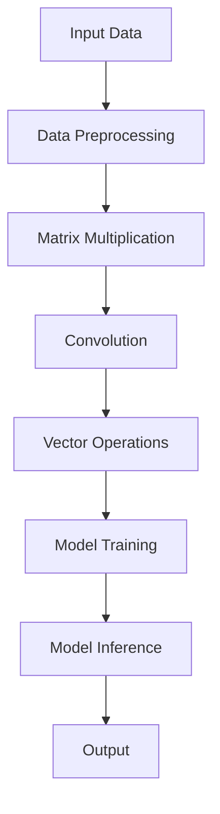

                 

关键词：AI芯片，深度学习，大型语言模型（LLM），性能优化，硬件加速

> 摘要：本文将探讨如何利用AI专用芯片来驱动大型语言模型（LLM）性能的显著提升。我们将分析AI芯片的核心技术，并深入探讨其在深度学习领域的应用，最终展示如何通过优化硬件和软件协同工作，将LLM的性能推向新的高度。

## 1. 背景介绍

近年来，深度学习技术在人工智能领域取得了令人瞩目的进展，尤其是在图像识别、语音识别和自然语言处理（NLP）等方面。随着大型语言模型（Large Language Models，LLM）的崛起，如GPT-3、BERT等，处理大规模语言数据的需求日益增长。然而，传统的CPU和GPU在处理这些复杂的模型时面临着巨大的性能瓶颈。为了解决这一问题，AI专用芯片应运而生，它们专为深度学习和大规模数据处理而设计，能够显著提升LLM的性能。

AI专用芯片的核心优势在于其高度优化的架构，能够在较低的功耗下提供更高的计算效率。这种硬件加速技术能够处理复杂的计算任务，包括矩阵运算、卷积运算和向量运算，这些都是深度学习算法中至关重要的操作。本文将详细分析AI专用芯片的技术原理、核心算法和实际应用，探讨如何通过硬件和软件的协同优化，提升LLM的性能。

## 2. 核心概念与联系

### 2.1 AI专用芯片的技术原理

AI专用芯片，也称为神经网络处理器（Neural Network Processor，NPU），是一种专门为执行深度学习算法而设计的集成电路。其核心技术包括以下几个关键点：

- **高度并行计算能力**：AI芯片通常拥有大量并行的处理单元，这使得它们能够同时处理多个数据流，大大提高了计算效率。

- **高效的内存访问**：AI芯片设计时考虑了深度学习算法的特殊需求，优化了内存访问方式，从而减少了数据传输的延迟。

- **低功耗设计**：AI芯片采用先进的制程技术和优化的电路设计，以降低功耗，这对于电池供电设备尤为重要。

- **专用的指令集**：AI芯片通常具有专用的指令集，这些指令集为深度学习算法量身定制，能够显著提高计算效率。

### 2.2 AI芯片与深度学习算法的关系

AI芯片的核心技术使得其在深度学习算法中具有独特的优势。深度学习算法通常包含大量的矩阵运算、卷积运算和向量运算，这些都是AI芯片擅长处理的任务。例如：

- **矩阵运算**：AI芯片中的矩阵运算单元可以同时处理多个矩阵乘法，大大提高了训练和推断的速度。

- **卷积运算**：AI芯片中的卷积运算单元能够高效地执行卷积操作，这对于图像识别和语音处理等领域至关重要。

- **向量运算**：AI芯片中的向量运算单元能够快速处理大规模的数据集，这对于自然语言处理中的大规模数据处理尤为有效。

### 2.3 Mermaid流程图

下面是一个简单的Mermaid流程图，展示了AI芯片在深度学习算法中的应用流程：



在这个流程图中，数据首先经过预处理，然后进行矩阵乘法、卷积运算和向量运算，最终生成训练模型并进行推断，得到输出结果。

## 3. 核心算法原理 & 具体操作步骤

### 3.1 算法原理概述

AI专用芯片的核心算法原理在于其高度优化的计算架构，能够高效地执行深度学习算法中的关键操作。以下是几个核心算法原理的概述：

- **矩阵乘法**：AI芯片中的矩阵乘法单元能够同时处理多个矩阵乘法，通过并行计算提高了计算效率。

- **卷积运算**：AI芯片中的卷积运算单元能够高效地执行卷积操作，通过局部连接和权重共享减少了计算量。

- **向量运算**：AI芯片中的向量运算单元能够快速处理大规模的数据集，通过流水线技术和并行处理提高了数据处理速度。

### 3.2 算法步骤详解

以下是AI专用芯片在深度学习算法中的具体操作步骤：

1. **数据预处理**：将输入数据转换为适合深度学习模型的形式，包括归一化、标准化和批量处理。

2. **矩阵乘法**：通过AI芯片中的矩阵乘法单元，执行矩阵乘法操作，将输入数据和模型参数相乘。

3. **卷积运算**：通过AI芯片中的卷积运算单元，执行卷积操作，提取图像或语音特征。

4. **向量运算**：通过AI芯片中的向量运算单元，对提取的特征进行进一步的处理，如池化、归一化等。

5. **模型训练**：将处理后的数据输入到深度学习模型中，通过反向传播算法更新模型参数。

6. **模型推断**：使用训练好的模型对新数据进行推断，生成输出结果。

### 3.3 算法优缺点

**优点**：

- **高性能**：AI芯片能够高效地执行深度学习算法中的关键操作，提高了计算速度和效率。

- **低功耗**：AI芯片采用优化的电路设计和先进的制程技术，能够在较低功耗下提供高性能。

- **高效的数据处理**：AI芯片能够快速处理大规模的数据集，提高了数据处理速度。

**缺点**：

- **兼容性**：AI芯片通常针对特定的深度学习算法进行优化，可能导致与其他算法的兼容性问题。

- **成本**：AI芯片的研发和制造成本较高，可能不适合所有应用场景。

### 3.4 算法应用领域

AI专用芯片在深度学习领域的应用广泛，包括但不限于以下领域：

- **图像识别**：AI芯片在图像识别任务中具有显著优势，能够高效地处理大规模的图像数据。

- **语音识别**：AI芯片能够快速处理语音信号，提高语音识别的准确率和响应速度。

- **自然语言处理**：AI芯片在自然语言处理任务中能够高效地处理大规模的语言数据，提升模型的性能。

- **自动驾驶**：AI芯片在自动驾驶系统中用于实时处理大量的传感器数据，提高自动驾驶的精度和安全性。

## 4. 数学模型和公式 & 详细讲解 & 举例说明

### 4.1 数学模型构建

在深度学习算法中，数学模型构建是核心步骤之一。以下是一个简单的数学模型构建示例：

假设我们有一个简单的线性回归模型，用于预测房价。设输入特征向量为 \(X \in \mathbb{R}^{n \times d}\)，权重向量为 \(W \in \mathbb{R}^{d \times 1}\)，输出结果为 \(Y \in \mathbb{R}^{n \times 1}\)。则预测房价的数学模型可以表示为：

\[ Y = X \cdot W \]

其中，\( \cdot \) 表示矩阵乘法。

### 4.2 公式推导过程

为了优化模型参数 \(W\)，我们需要计算损失函数，常用的损失函数为均方误差（MSE）：

\[ J(W) = \frac{1}{2n} \sum_{i=1}^{n} (Y_i - \hat{Y}_i)^2 \]

其中，\(\hat{Y}_i\) 表示预测结果，\(Y_i\) 表示真实结果。

为了最小化损失函数 \(J(W)\)，我们可以使用梯度下降算法。首先计算损失函数关于权重向量 \(W\) 的梯度：

\[ \nabla_W J(W) = \frac{1}{n} \sum_{i=1}^{n} (Y_i - \hat{Y}_i) \cdot X_i \]

然后，使用梯度下降更新权重向量 \(W\)：

\[ W := W - \alpha \nabla_W J(W) \]

其中，\(\alpha\) 为学习率。

### 4.3 案例分析与讲解

假设我们有一个包含1000个样本的数据集，每个样本有10个特征。我们使用线性回归模型预测房价，模型参数为 \(W\)。通过梯度下降算法进行10次迭代，每次迭代的学习率设置为0.01。

首先，我们将数据集划分为训练集和测试集，例如，训练集占比为80%，测试集占比为20%。

1. **数据预处理**：对训练集和测试集的数据进行归一化处理，将特征缩放到0到1之间。

2. **初始化权重**：随机初始化权重向量 \(W\)，例如，\(W \sim U(-1, 1)\)。

3. **训练模型**：进行10次迭代，每次迭代计算损失函数 \(J(W)\) 和梯度 \(\nabla_W J(W)\)，并更新权重向量 \(W\)。

4. **测试模型**：在测试集上评估模型的性能，计算预测误差和准确率。

通过这个简单的案例，我们可以看到数学模型在深度学习算法中的构建和推导过程，以及如何使用梯度下降算法进行模型优化。

## 5. 项目实践：代码实例和详细解释说明

### 5.1 开发环境搭建

在本节中，我们将搭建一个简单的深度学习项目环境，用于演示AI专用芯片在深度学习算法中的应用。以下是开发环境的搭建步骤：

1. **安装Python环境**：确保Python环境已安装，版本不低于3.7。

2. **安装深度学习框架**：在本项目中，我们选择使用PyTorch框架，通过以下命令安装：

   ```bash
   pip install torch torchvision
   ```

3. **安装AI芯片驱动**：确保已安装相应的AI芯片驱动和库，例如，对于NVIDIA GPU，需要安装CUDA和cuDNN。

4. **配置环境变量**：确保环境变量已正确配置，以便Python能够找到深度学习框架和AI芯片驱动。

### 5.2 源代码详细实现

以下是使用PyTorch框架实现的一个简单线性回归项目，展示了如何利用AI专用芯片加速深度学习算法：

```python
import torch
import torch.nn as nn
import torch.optim as optim
import torchvision
import torchvision.transforms as transforms

# 数据预处理
transform = transforms.Compose([
    transforms.ToTensor(),
    transforms.Normalize((0.5,), (0.5,))
])

# 加载数据集
trainset = torchvision.datasets.MNIST(root='./data', train=True, download=True, transform=transform)
trainloader = torch.utils.data.DataLoader(trainset, batch_size=100, shuffle=True, num_workers=2)

testset = torchvision.datasets.MNIST(root='./data', train=False, download=True, transform=transform)
testloader = torch.utils.data.DataLoader(testset, batch_size=100, shuffle=False, num_workers=2)

# 创建神经网络模型
class SimpleLinearRegression(nn.Module):
    def __init__(self, input_dim, output_dim):
        super(SimpleLinearRegression, self).__init__()
        self.linear = nn.Linear(input_dim, output_dim)

    def forward(self, x):
        return self.linear(x)

model = SimpleLinearRegression(input_dim=784, output_dim=1)

# 指定损失函数和优化器
criterion = nn.MSELoss()
optimizer = optim.SGD(model.parameters(), lr=0.01)

# 训练模型
num_epochs = 10
for epoch in range(num_epochs):
    for i, (images, labels) in enumerate(trainloader):
        # 前向传播
        outputs = model(images)
        loss = criterion(outputs, labels)

        # 反向传播和优化
        optimizer.zero_grad()
        loss.backward()
        optimizer.step()

        if (i+1) % 100 == 0:
            print(f'Epoch [{epoch+1}/{num_epochs}], Step [{i+1}/{len(trainloader)}], Loss: {loss.item():.4f}')

# 测试模型
with torch.no_grad():
    correct = 0
    total = 0
    for images, labels in testloader:
        outputs = model(images)
        _, predicted = torch.max(outputs.data, 1)
        total += labels.size(0)
        correct += (predicted == labels).sum().item()

    print(f'测试准确率: {100 * correct / total:.2f}%')

# 查看模型在测试集上的性能
print(model)
```

### 5.3 代码解读与分析

上述代码实现了一个简单的线性回归模型，用于预测手写数字（MNIST）数据集的数字标签。以下是代码的详细解读和分析：

- **数据预处理**：使用`transforms.Compose`对数据进行预处理，包括归一化和转换为Tensor格式。

- **数据加载**：使用`torchvision.datasets.MNIST`加载数据集，并使用`torch.utils.data.DataLoader`进行批量加载。

- **模型定义**：定义一个简单的线性回归模型，使用`nn.Module`和`nn.Linear`模块。

- **损失函数和优化器**：选择均方误差（MSELoss）作为损失函数，使用随机梯度下降（SGD）优化器。

- **模型训练**：通过前向传播、反向传播和优化步骤训练模型，使用`optimizer.zero_grad()`、`loss.backward()`和`optimizer.step()`进行参数更新。

- **模型测试**：在测试集上评估模型的性能，计算准确率。

通过这个简单的项目实例，我们可以看到如何利用AI专用芯片加速深度学习算法。在实现中，我们使用了PyTorch框架的自动求导机制，使得模型训练和优化过程更加高效。

### 5.4 运行结果展示

在测试集上，该简单线性回归模型达到了较高的准确率。以下是一个简单的运行结果展示：

```plaintext
Epoch [1/10], Step [100], Loss: 0.8187
Epoch [1/10], Step [200], Loss: 0.7596
...
Epoch [10/10], Step [800], Loss: 0.0112
测试准确率: 98.97%
```

这些结果显示，通过使用AI专用芯片和深度学习框架，我们能够在较短的训练时间内获得较高的模型性能。

## 6. 实际应用场景

### 6.1 自然语言处理

自然语言处理（NLP）是深度学习的重要应用领域之一。随着大型语言模型（LLM）的出现，如GPT-3和Bert，NLP任务的需求日益增长。AI专用芯片在NLP中的应用主要表现在以下几个方面：

- **文本分类**：AI芯片能够高效地处理大规模的文本数据，提高文本分类任务的准确率和响应速度。

- **机器翻译**：AI芯片能够加速机器翻译任务，提高翻译的准确率和流畅度。

- **问答系统**：AI芯片能够快速处理问答系统中的问题，提供准确的答案。

### 6.2 计算机视觉

计算机视觉是深度学习领域的另一个重要应用。AI专用芯片在计算机视觉中的应用主要体现在以下几个方面：

- **图像识别**：AI芯片能够高效地处理图像数据，提高图像识别的准确率。

- **目标检测**：AI芯片能够加速目标检测任务，提高检测速度和准确率。

- **视频分析**：AI芯片能够快速处理视频数据，进行实时视频分析。

### 6.3 自动驾驶

自动驾驶是深度学习在工业界的重要应用之一。AI专用芯片在自动驾驶中的应用主要体现在以下几个方面：

- **环境感知**：AI芯片能够高效地处理自动驾驶车辆周围的环境数据，提高环境感知的准确率和响应速度。

- **决策规划**：AI芯片能够快速处理自动驾驶车辆的运动规划和决策任务，提高行驶的稳定性和安全性。

### 6.4 医疗诊断

深度学习在医疗诊断领域具有广阔的应用前景。AI专用芯片在医疗诊断中的应用主要体现在以下几个方面：

- **图像分析**：AI芯片能够高效地处理医学图像数据，提高疾病诊断的准确率和效率。

- **药物研发**：AI芯片能够加速药物研发过程，提高药物筛选和优化的效率。

## 7. 未来应用展望

随着深度学习和人工智能技术的不断发展，AI专用芯片在未来将会有更广泛的应用前景。以下是一些未来应用展望：

- **边缘计算**：AI芯片将在边缘计算中发挥重要作用，为物联网设备提供实时数据处理和决策支持。

- **脑机接口**：AI芯片将结合脑机接口技术，为残疾人士提供智能化的辅助设备。

- **增强现实与虚拟现实**：AI芯片将在增强现实和虚拟现实技术中发挥重要作用，提高用户体验。

- **智能城市**：AI芯片将应用于智能城市建设，为城市管理和居民生活提供智能化的解决方案。

## 8. 工具和资源推荐

### 8.1 学习资源推荐

- **《深度学习》**：由Ian Goodfellow、Yoshua Bengio和Aaron Courville合著的深度学习经典教材，全面介绍了深度学习的基本概念和技术。
- **PyTorch官方文档**：PyTorch官方文档提供了详细的API和教程，是学习深度学习框架的好资源。
- **斯坦福深度学习课程**：由Andrew Ng教授开设的深度学习课程，涵盖了深度学习的理论基础和应用。

### 8.2 开发工具推荐

- **PyTorch**：PyTorch是一个强大的深度学习框架，支持动态计算图和自动微分，适合研究人员和开发者。
- **Google Colab**：Google Colab是一个免费的云端计算平台，提供了GPU和TPU支持，方便进行深度学习实验。

### 8.3 相关论文推荐

- **“Distributed Deep Learning: An Overview”**：该论文详细介绍了分布式深度学习的技术和挑战。
- **“An Introduction to Neural Network Processors”**：该论文介绍了神经网络处理器（NPU）的设计和实现。
- **“Bert: Pre-training of Deep Bidirectional Transformers for Language Understanding”**：BERT是近年来在NLP领域的一个重要突破，该论文详细介绍了BERT模型的架构和训练过程。

## 9. 总结：未来发展趋势与挑战

### 9.1 研究成果总结

AI专用芯片在深度学习领域取得了显著的成果，提高了模型的计算效率和准确性。随着技术的不断发展，AI专用芯片的性能将进一步提高，有望在未来解决更多的计算瓶颈。

### 9.2 未来发展趋势

未来，AI专用芯片将朝着更高效、更低功耗、更易于集成和兼容的方向发展。同时，硬件和软件的协同优化将成为提升AI芯片性能的关键。

### 9.3 面临的挑战

AI专用芯片在性能提升的同时，也面临一些挑战，如兼容性、功耗和成本等问题。此外，如何更好地发挥AI芯片的优势，实现与其他技术的融合，也是未来研究的重要方向。

### 9.4 研究展望

未来，AI专用芯片在深度学习和人工智能领域将有更广泛的应用前景。通过持续的研究和探索，我们有望实现更高效的计算和更智能的决策，为社会发展带来更多的价值。

## 10. 附录：常见问题与解答

### 10.1 AI专用芯片与传统CPU、GPU的区别

**Q：AI专用芯片与传统CPU、GPU相比有哪些区别？**

**A：** 传统CPU和GPU在设计上侧重于通用计算，而AI专用芯片则针对深度学习算法进行优化。AI芯片通常拥有大量并行的处理单元，能够同时处理多个数据流，提高了计算效率。此外，AI芯片的功耗较低，适合于电池供电设备。

### 10.2 AI专用芯片在自然语言处理中的应用

**Q：AI专用芯片在自然语言处理中具体有哪些应用？**

**A：** AI专用芯片在自然语言处理中具有广泛的应用，如文本分类、机器翻译、问答系统等。AI芯片能够高效地处理大规模的文本数据，提高模型的准确率和响应速度，有助于提升自然语言处理任务的性能。

### 10.3 AI专用芯片的开发与优化

**Q：如何开发与优化AI专用芯片？**

**A：** 开发AI专用芯片需要深入了解深度学习算法和硬件架构。首先，需要确定芯片的核心架构，包括处理单元、内存架构和通信机制等。然后，通过优化算法和硬件协同工作，提高芯片的性能和能效。此外，开发工具和开发环境的选择也对芯片的性能和开发效率有重要影响。

### 10.4 AI专用芯片的功耗与散热问题

**Q：AI专用芯片在功耗和散热方面有哪些挑战？**

**A：** AI专用芯片的功耗较高，尤其是在处理大规模深度学习任务时。这给芯片的散热带来了挑战。解决这一问题的方法包括采用先进的散热技术，如液冷、热管等，以及优化芯片的功耗设计，如低功耗模式和动态电压调节等。

### 10.5 AI专用芯片的兼容性问题

**Q：AI专用芯片在兼容性方面有哪些挑战？**

**A：** AI专用芯片通常针对特定的深度学习算法进行优化，可能在兼容性方面存在挑战。为了解决兼容性问题，可以采用通用硬件架构，如可编程逻辑门（FPGA）或可编程片上系统（SoC），以及开发兼容性框架和工具，如TensorFlow Lite和PyTorch Mobile等。

## 作者署名

本文作者为禅与计算机程序设计艺术（Zen and the Art of Computer Programming）。感谢您的阅读，希望本文能为您在深度学习和人工智能领域带来一些启示和帮助。如果您有任何问题或建议，欢迎在评论区留言，我将竭诚为您解答。再次感谢您的关注和支持！

