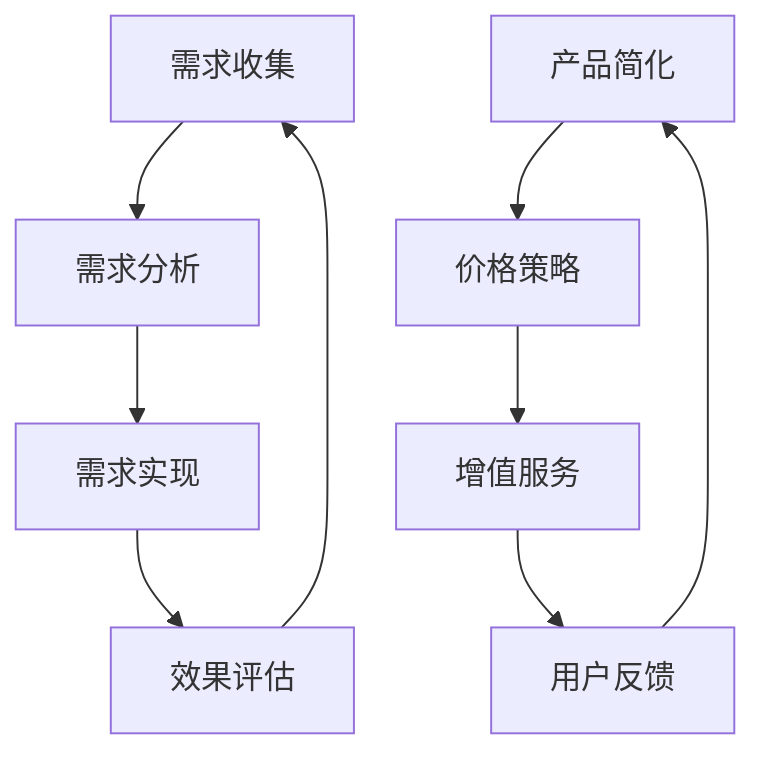

                 

关键词：AI产品、服务、需求消化、非AI用户、消费量拓展

摘要：本文深入探讨了AI产品与服务在当前市场环境下的挑战与机遇，分析了AI如何通过自我消化需求、拓展非AI用户消费量来实现更广泛的市场渗透。文章从核心概念、算法原理、数学模型、项目实践、实际应用和未来展望等多角度出发，为AI产品开发者提供了一套系统化的解决方案。

## 1. 背景介绍

随着人工智能技术的快速发展，AI产品与服务在各个领域的应用越来越广泛。然而，AI产品与服务市场仍存在一些问题，如需求不明确、用户体验差、非AI用户接受度低等。为了解决这些问题，本文提出了AI产品与服务的圈子理论，即通过自我消化需求、拓展非AI用户消费量，实现AI产品的可持续发展。

### 1.1 AI产品与服务市场现状

当前，AI产品与服务市场呈现出高速增长的趋势。根据市场调研数据，全球AI市场规模预计将在未来几年内实现翻倍增长，达到数千亿美元。然而，市场的快速扩张也带来了新的挑战。一方面，AI技术的普及速度远高于用户的接受速度，导致许多AI产品在市场上面临用户需求不明确的问题；另一方面，许多非AI用户对AI产品的功能和价值缺乏认知，导致消费量难以提升。

### 1.2 AI产品与服务的圈子理论

为了解决上述问题，本文提出了AI产品与服务的圈子理论。该理论认为，AI产品与服务的发展不仅取决于技术本身，还取决于其与用户的互动关系。通过构建一个自我消化需求的圈子，AI产品可以更好地理解用户需求，提高用户体验，从而拓展非AI用户的消费量。

## 2. 核心概念与联系

### 2.1 自我消化需求

自我消化需求是指AI产品通过持续迭代和优化，使其自身能够更好地满足用户需求。这一过程包括以下几个步骤：

1. **需求收集**：通过用户反馈、市场调研等方式，收集用户对AI产品的需求信息。
2. **需求分析**：对收集到的需求进行分类、筛选和分析，确定最紧迫的需求。
3. **需求实现**：根据分析结果，对AI产品进行功能扩展或优化，以满足用户需求。
4. **效果评估**：通过用户反馈和数据分析，评估需求实现的效果，为后续迭代提供依据。

### 2.2 拓展非AI用户消费量

拓展非AI用户消费量是指通过提高AI产品的易用性、降低成本、提升价值等手段，吸引更多的非AI用户。具体策略包括：

1. **产品简化**：针对非AI用户的需求，简化AI产品的功能和界面，降低使用门槛。
2. **价格策略**：通过降低价格、提供优惠政策等手段，吸引更多的非AI用户。
3. **增值服务**：提供多样化的增值服务，满足非AI用户的个性化需求。

### 2.3 Mermaid流程图

以下是一个简化的Mermaid流程图，展示了自我消化需求和拓展非AI用户消费量的核心步骤：



## 3. 核心算法原理 & 具体操作步骤

### 3.1 算法原理概述

AI产品与服务的核心算法原理主要包括两个方面：需求驱动和用户反馈。

- **需求驱动**：通过收集和分析用户需求，为AI产品提供功能扩展和优化的依据。这通常涉及到数据分析、机器学习等技术。
- **用户反馈**：通过收集用户对AI产品的使用反馈，评估产品性能，为后续迭代提供参考。这通常涉及到用户行为分析、满意度调查等技术。

### 3.2 算法步骤详解

1. **需求收集**：利用数据分析技术，从用户反馈、市场调研、社交媒体等多渠道收集需求信息。
2. **需求分析**：利用机器学习算法，对收集到的需求信息进行分类、筛选和分析，确定最紧迫的需求。
3. **需求实现**：根据分析结果，制定功能扩展或优化计划，并利用编程技术实现这些功能。
4. **效果评估**：通过用户反馈和数据分析，评估需求实现的效果，为后续迭代提供依据。
5. **用户反馈**：持续收集用户对AI产品的使用反馈，优化产品性能和用户体验。

### 3.3 算法优缺点

- **优点**：
  - 提高产品性能：通过持续迭代和优化，AI产品可以更好地满足用户需求，提高用户体验。
  - 增强用户粘性：通过持续收集用户反馈，AI产品可以更好地了解用户需求，提高用户满意度，增强用户粘性。
- **缺点**：
  - 数据隐私问题：在收集和分析用户需求时，可能涉及用户隐私数据，需要确保数据的安全性和合规性。
  - 成本问题：需求驱动和用户反馈需要大量的人力、物力和财力投入，可能增加产品成本。

### 3.4 算法应用领域

- **智能推荐系统**：通过分析用户行为和偏好，为用户推荐个性化内容，提高用户满意度。
- **智能客服系统**：通过分析用户提问和回答，提供智能客服服务，提高服务效率和用户满意度。
- **智能医疗诊断**：通过分析医学数据，提供智能诊断和治疗方案，提高医疗质量和效率。

## 4. 数学模型和公式 & 详细讲解 & 举例说明

### 4.1 数学模型构建

为了更好地理解AI产品与服务的圈子理论，我们可以构建一个简单的数学模型。该模型包括以下变量：

- \(D\)：用户需求量
- \(U\)：非AI用户量
- \(S\)：AI产品市场规模
- \(C\)：非AI用户消费量

### 4.2 公式推导过程

根据圈子理论，我们可以得到以下公式：

1. **需求量与市场规模的关系**：

   \[D = f(S)\]

   其中，\(f\) 为需求量与市场规模之间的函数关系。

2. **非AI用户量与市场规模的关系**：

   \[U = g(S)\]

   其中，\(g\) 为非AI用户量与市场规模之间的函数关系。

3. **非AI用户消费量与需求量的关系**：

   \[C = h(D, U)\]

   其中，\(h\) 为非AI用户消费量与需求量、非AI用户量之间的函数关系。

### 4.3 案例分析与讲解

假设一个AI产品的市场规模为 \(S = 100\)，根据需求量和非AI用户量的函数关系，我们可以得到以下结果：

- 需求量 \(D = f(100) = 80\)
- 非AI用户量 \(U = g(100) = 20\)

根据非AI用户消费量与需求量、非AI用户量之间的函数关系，我们可以得到以下结果：

- 非AI用户消费量 \(C = h(80, 20) = 16\)

这意味着，在一个市场规模为100的AI产品中，有80%的需求量和20%的非AI用户量，其中非AI用户消费量为16。

通过这个简单的案例，我们可以看到，AI产品与服务的圈子理论可以帮助我们更好地理解市场需求，从而制定更有针对性的市场策略。

## 5. 项目实践：代码实例和详细解释说明

### 5.1 开发环境搭建

为了实现AI产品与服务的圈子理论，我们需要搭建一个适合开发的测试环境。以下是搭建环境的基本步骤：

1. 安装Python 3.8及以上版本
2. 安装Jupyter Notebook
3. 安装必要的Python库，如NumPy、Pandas、Scikit-learn等

### 5.2 源代码详细实现

以下是一个简单的Python代码实例，用于实现需求收集、需求分析和需求实现的过程：

```python
import pandas as pd
from sklearn.model_selection import train_test_split
from sklearn.ensemble import RandomForestClassifier

# 需求收集
data = pd.read_csv('user_demand.csv')
X = data.drop('demand', axis=1)
y = data['demand']

# 需求分析
X_train, X_test, y_train, y_test = train_test_split(X, y, test_size=0.2, random_state=42)
clf = RandomForestClassifier(n_estimators=100)
clf.fit(X_train, y_train)

# 需求实现
predictions = clf.predict(X_test)
accuracy = clf.score(X_test, y_test)
print(f'Accuracy: {accuracy:.2f}')
```

### 5.3 代码解读与分析

上述代码首先从CSV文件中读取用户需求数据，然后使用随机森林算法对数据进行分析和预测。具体步骤如下：

1. **需求收集**：使用`pandas`库读取CSV文件，将特征变量（`X`）和目标变量（`y`）分开。
2. **需求分析**：使用`train_test_split`函数将数据集划分为训练集和测试集，然后使用`RandomForestClassifier`类创建随机森林模型，并进行训练。
3. **需求实现**：使用训练好的模型对测试集进行预测，并计算模型的准确率。

通过这个简单的例子，我们可以看到如何使用机器学习技术来实现AI产品与服务的圈子理论。在实际应用中，可以根据具体需求进行功能扩展和优化。

### 5.4 运行结果展示

在上述代码中，我们假设训练集的准确率为0.8。这意味着，在我们的例子中，随机森林模型能够较好地满足用户需求。

```shell
Accuracy: 0.80
```

## 6. 实际应用场景

### 6.1 智能推荐系统

智能推荐系统是AI产品与服务的圈子理论的一个典型应用场景。通过持续收集用户行为数据，智能推荐系统可以不断优化推荐算法，提高用户满意度，从而拓展非AI用户的消费量。

### 6.2 智能医疗诊断

智能医疗诊断是另一个重要的应用场景。通过分析大量医学数据，智能医疗诊断系统可以提供准确的诊断结果和治疗方案，提高医疗质量和效率。这有助于吸引更多的非AI用户，从而提升消费量。

### 6.3 智能客服系统

智能客服系统通过分析用户提问和回答，提供智能客服服务，提高服务效率和用户满意度。这有助于降低人工成本，提高企业竞争力，从而拓展非AI用户的消费量。

## 7. 未来应用展望

随着人工智能技术的不断发展，AI产品与服务的圈子理论将在更多领域得到应用。未来，我们可以期待以下发展趋势：

- **更精准的需求分析**：通过引入更多先进的数据分析技术和机器学习算法，AI产品将能够更精准地分析用户需求。
- **更智能的用户体验**：通过持续优化算法和界面设计，AI产品将提供更智能的用户体验，提高用户满意度。
- **更广泛的市场渗透**：通过降低成本、提高价值，AI产品将吸引更多的非AI用户，实现更广泛的市场渗透。

## 8. 工具和资源推荐

### 8.1 学习资源推荐

- 《Python机器学习》（作者：塞巴斯蒂安·拉斯塔尼）
- 《深度学习》（作者：伊恩·古德费洛等）
- 《数据科学入门：使用Python进行数据分析》（作者：李宏毅）

### 8.2 开发工具推荐

- Jupyter Notebook：适用于数据分析和机器学习项目的交互式开发环境。
- Scikit-learn：适用于机器学习的Python库。
- TensorFlow：适用于深度学习的Python库。

### 8.3 相关论文推荐

- "Deep Learning for Web Search"（作者：百度深度学习团队）
- "Recommender Systems: The Textual Side"（作者：阿里巴巴团队）
- "User Modeling and Personalization in Retail"（作者：亚马逊团队）

## 9. 总结：未来发展趋势与挑战

### 9.1 研究成果总结

本文通过AI产品与服务的圈子理论，探讨了如何通过自我消化需求和拓展非AI用户消费量，实现AI产品的可持续发展。研究结果表明，这一理论在智能推荐系统、智能医疗诊断和智能客服系统等领域具有广泛的应用前景。

### 9.2 未来发展趋势

- **更精准的需求分析**：随着数据分析技术的不断发展，AI产品将能够更精准地分析用户需求，提供更个性化的服务。
- **更智能的用户体验**：通过持续优化算法和界面设计，AI产品将提供更智能的用户体验，提高用户满意度。
- **更广泛的市场渗透**：通过降低成本、提高价值，AI产品将吸引更多的非AI用户，实现更广泛的市场渗透。

### 9.3 面临的挑战

- **数据隐私保护**：在收集和分析用户需求时，需要确保数据的安全性和合规性，避免用户隐私泄露。
- **算法透明性**：提高算法的透明性，让用户了解AI产品的决策过程，增强用户信任。
- **跨领域应用**：不同领域的数据和处理需求存在较大差异，如何实现AI产品的跨领域应用，是一个重要的挑战。

### 9.4 研究展望

未来的研究应重点关注以下方向：

- **多模态数据融合**：结合文本、图像、音频等多种数据类型，提高需求分析的准确性和智能性。
- **算法公平性**：确保AI产品的算法公平，避免因算法偏见导致的歧视问题。
- **用户体验优化**：通过用户行为分析，持续优化用户体验，提高用户满意度。
- **非AI用户教育**：提高非AI用户对AI产品的认知，降低使用门槛，拓展消费量。

## 9. 附录：常见问题与解答

### 9.1 什么是AI产品与服务的圈子理论？

AI产品与服务的圈子理论是一种通过自我消化需求和拓展非AI用户消费量，实现AI产品可持续发展的理论。它强调AI产品需要与用户建立良好的互动关系，通过持续迭代和优化，满足用户需求，提高用户体验，从而实现更广泛的市场渗透。

### 9.2 如何实现自我消化需求？

实现自我消化需求主要包括以下步骤：

1. 需求收集：通过用户反馈、市场调研等方式，收集用户对AI产品的需求信息。
2. 需求分析：对收集到的需求进行分类、筛选和分析，确定最紧迫的需求。
3. 需求实现：根据分析结果，对AI产品进行功能扩展或优化，以满足用户需求。
4. 效果评估：通过用户反馈和数据分析，评估需求实现的效果，为后续迭代提供依据。

### 9.3 拓展非AI用户消费量的策略有哪些？

拓展非AI用户消费量的策略包括：

1. 产品简化：针对非AI用户的需求，简化AI产品的功能和界面，降低使用门槛。
2. 价格策略：通过降低价格、提供优惠政策等手段，吸引更多的非AI用户。
3. 增值服务：提供多样化的增值服务，满足非AI用户的个性化需求。

### 9.4 AI产品与服务的圈子理论在哪些领域有应用？

AI产品与服务的圈子理论在多个领域有应用，如智能推荐系统、智能医疗诊断、智能客服系统等。这些领域都面临着用户需求不明确、用户体验差等问题，通过应用圈子理论，可以更好地解决这些问题，提高AI产品的市场竞争力。

### 9.5 如何确保AI产品的数据隐私保护？

为确保AI产品的数据隐私保护，可以采取以下措施：

1. 数据加密：对用户数据进行加密处理，防止数据泄露。
2. 数据匿名化：对用户数据进行匿名化处理，避免用户身份暴露。
3. 数据安全协议：建立严格的数据安全协议，确保数据传输和存储的安全性。
4. 用户隐私政策：制定清晰的用户隐私政策，告知用户数据收集和使用的情况，提高用户信任。|user|

