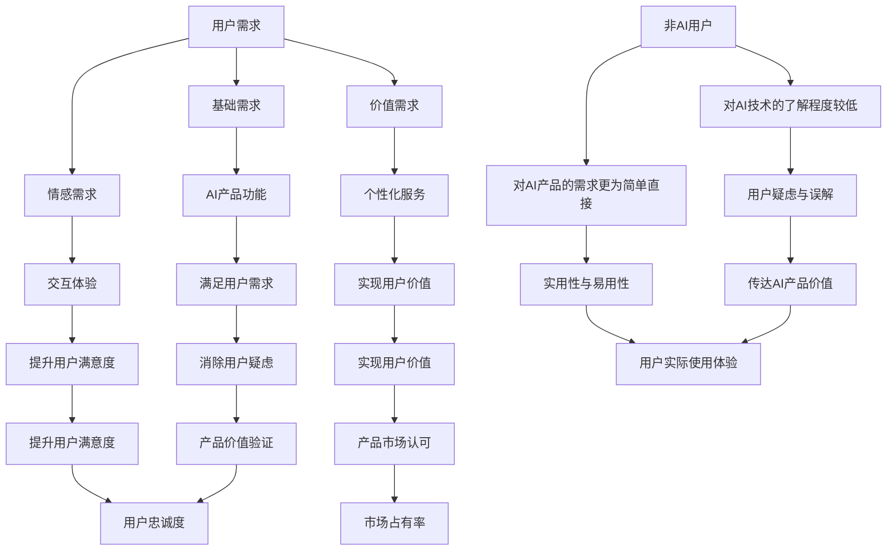

                 

关键词：AI产品、服务、用户需求、非AI用户、市场需求、产品策略

摘要：本文将探讨AI产品和服务如何在满足自身需求的同时，拓展非AI用户群体。我们将分析AI产品的市场定位、用户需求分析、产品策略制定以及如何通过多样化的服务模式来满足不同用户群体的需求。文章旨在为AI行业从业人员提供实用的指导和建议。

## 1. 背景介绍

随着人工智能（AI）技术的飞速发展，AI产品和服务已经成为市场的重要组成部分。从智能助手、推荐系统到自动驾驶和智能医疗，AI技术正在改变我们的生活方式和工作方式。然而，AI产品的成功不仅仅依赖于技术的先进性，还需要考虑如何满足用户需求，特别是非AI用户群体的需求。

在AI产品市场中，用户需求是推动产品发展和创新的核心动力。然而，不同用户群体对AI产品的需求各不相同，如何有效挖掘和满足这些需求，是AI产品开发者和运营者需要解决的重要问题。本文将重点讨论如何通过自我消化需求，拓展非AI用户群体，实现AI产品与服务的可持续发展。

## 2. 核心概念与联系

### 2.1 AI产品与用户需求

#### 用户需求分析

用户需求是产品设计和开发的基础。在AI产品领域，用户需求可以分为以下几个层次：

1. **基础需求**：满足用户基本的实用需求，如效率提升、功能简化等。
2. **情感需求**：关注用户的情感体验，如交互体验、用户满意度等。
3. **价值需求**：满足用户的深层价值需求，如个性化服务、社会认可等。

#### AI产品与用户需求的关系

AI产品需要深入理解用户需求，并将其转化为具体的产品功能。同时，AI技术的进步也需要与用户需求保持同步，以确保产品能够持续满足用户的需求。

### 2.2 非AI用户群体

非AI用户群体是指那些可能没有直接接触或使用过AI技术，但未来有潜力成为AI产品用户的群体。这部分用户可能包括传统行业的从业者、教育领域的教师和学生等。

#### 非AI用户群体的特点

1. **对AI技术的了解程度较低**：非AI用户可能对AI技术持有一定的疑虑或误解。
2. **对AI产品的需求更为简单直接**：由于技术理解不足，非AI用户可能更关注产品的实用性和易用性。

#### AI产品与非AI用户群体的关系

AI产品需要通过简单易懂的方式向非AI用户传达其价值，并通过实际使用体验来消除用户对AI技术的疑虑。

### 2.3 Mermaid 流程图

以下是AI产品与用户需求以及非AI用户群体的关系流程图：



## 3. 核心算法原理 & 具体操作步骤

### 3.1 算法原理概述

AI产品的核心算法是满足用户需求的关键。以下是几种常见的算法原理及其应用场景：

1. **机器学习算法**：通过训练模型来自动化数据分析和决策过程，适用于推荐系统、图像识别等领域。
2. **自然语言处理算法**：用于理解用户输入的自然语言，实现人机交互，如智能助手。
3. **强化学习算法**：通过奖励机制学习最佳策略，适用于自动驾驶、游戏AI等领域。

### 3.2 算法步骤详解

#### 3.2.1 机器学习算法步骤

1. **数据收集**：收集大量数据用于训练模型。
2. **数据预处理**：对数据进行清洗、转换等预处理步骤。
3. **模型选择**：根据应用场景选择合适的机器学习模型。
4. **模型训练**：使用预处理后的数据训练模型。
5. **模型评估**：使用验证集评估模型性能。
6. **模型部署**：将训练好的模型部署到实际应用场景中。

#### 3.2.2 自然语言处理算法步骤

1. **分词与词性标注**：将输入文本划分为单词或短语，并标注词性。
2. **语法分析**：分析文本的语法结构，如句法树构建。
3. **语义理解**：理解文本的语义含义，如实体识别、情感分析。
4. **生成响应**：根据语义理解生成合适的响应。

#### 3.2.3 强化学习算法步骤

1. **环境定义**：定义强化学习环境，包括状态空间、动作空间和奖励机制。
2. **策略学习**：通过学习最优策略来最大化累积奖励。
3. **策略评估**：评估策略在模拟环境中的表现。
4. **策略优化**：根据评估结果调整策略。

### 3.3 算法优缺点

1. **机器学习算法**：
   - 优点：适用于处理大规模数据和复杂数据关系。
   - 缺点：对数据质量和标注要求高，训练过程可能耗费大量时间。
2. **自然语言处理算法**：
   - 优点：能够实现复杂的人机交互，提高用户体验。
   - 缺点：对语言理解的要求高，算法复杂度大。
3. **强化学习算法**：
   - 优点：能够通过自主学习实现复杂任务的优化。
   - 缺点：需要大量数据进行训练，策略优化过程可能不稳定。

### 3.4 算法应用领域

1. **机器学习算法**：广泛应用于推荐系统、图像识别、自然语言处理等领域。
2. **自然语言处理算法**：应用于智能助手、语音识别、机器翻译等领域。
3. **强化学习算法**：应用于自动驾驶、游戏AI、机器人控制等领域。

## 4. 数学模型和公式 & 详细讲解 & 举例说明

### 4.1 数学模型构建

#### 4.1.1 机器学习模型

假设我们使用线性回归模型进行预测，其数学模型可以表示为：

$$y = \beta_0 + \beta_1x_1 + \beta_2x_2 + ... + \beta_nx_n$$

其中，$y$ 是预测结果，$x_1, x_2, ..., x_n$ 是输入特征，$\beta_0, \beta_1, \beta_2, ..., \beta_n$ 是模型的参数。

#### 4.1.2 自然语言处理模型

以循环神经网络（RNN）为例，其数学模型可以表示为：

$$h_t = \sigma(W_hh_{t-1} + W_x x_t + b_h)$$

其中，$h_t$ 是当前时间步的隐藏状态，$x_t$ 是当前输入，$W_h, W_x, b_h$ 是模型参数，$\sigma$ 是激活函数。

#### 4.1.3 强化学习模型

以Q-learning算法为例，其数学模型可以表示为：

$$Q(s, a) = Q(s, a) + \alpha [r + \gamma \max_{a'} Q(s', a') - Q(s, a)]$$

其中，$Q(s, a)$ 是状态-动作值函数，$s$ 是当前状态，$a$ 是当前动作，$r$ 是立即奖励，$\gamma$ 是折扣因子，$s'$ 是下一个状态，$a'$ 是下一个动作。

### 4.2 公式推导过程

以线性回归模型为例，我们使用最小二乘法来求解模型参数。假设我们有 $n$ 个样本点 $(x_i, y_i)$，则损失函数可以表示为：

$$J(\beta) = \frac{1}{2} \sum_{i=1}^{n} (y_i - (\beta_0 + \beta_1x_i + \beta_2x_i^2 + ... + \beta_nx_i^n))^2$$

为了最小化损失函数，我们对模型参数求导并令导数为零：

$$\frac{\partial J(\beta)}{\partial \beta} = 0$$

经过一系列推导，我们可以得到线性回归模型的参数求解公式：

$$\beta = (\X^T\X)^{-1}\X^Ty$$

其中，$\X$ 是特征矩阵，$y$ 是目标向量。

### 4.3 案例分析与讲解

假设我们有一个简单的线性回归任务，目标是通过输入特征 $x$ 预测输出 $y$。我们收集了以下数据：

| $x$ | $y$ |
| --- | --- |
| 1 | 2 |
| 2 | 4 |
| 3 | 6 |
| 4 | 8 |

根据上述推导，我们可以构建线性回归模型，求解模型参数。首先，计算特征矩阵 $\X$ 和目标向量 $y$：

$$\X = \begin{bmatrix} 1 & x_1 \\ 1 & x_2 \\ 1 & x_3 \\ 1 & x_4 \end{bmatrix}, y = \begin{bmatrix} y_1 \\ y_2 \\ y_3 \\ y_4 \end{bmatrix}$$

$$\X = \begin{bmatrix} 1 & 1 \\ 1 & 2 \\ 1 & 3 \\ 1 & 4 \end{bmatrix}, y = \begin{bmatrix} 2 \\ 4 \\ 6 \\ 8 \end{bmatrix}$$

然后，计算特征矩阵 $\X$ 的转置 $\X^T$ 和 $\X^T\X$：

$$\X^T = \begin{bmatrix} 1 & 1 & 1 & 1 \\ 1 & 2 & 3 & 4 \end{bmatrix}, \X^T\X = \begin{bmatrix} 4 & 6 \\ 6 & 10 \end{bmatrix}$$

接下来，计算 $\X^T\X$ 的逆矩阵 $(\X^T\X)^{-1}$：

$$\X^T\X = \begin{bmatrix} 4 & 6 \\ 6 & 10 \end{bmatrix}, (\X^T\X)^{-1} = \begin{bmatrix} \frac{10}{32} & -\frac{6}{32} \\ -\frac{6}{32} & \frac{4}{32} \end{bmatrix}$$

最后，计算模型参数 $\beta$：

$$\beta = (\X^T\X)^{-1}\X^Ty = \begin{bmatrix} \frac{10}{32} & -\frac{6}{32} \\ -\frac{6}{32} & \frac{4}{32} \end{bmatrix} \begin{bmatrix} 2 \\ 4 \\ 6 \\ 8 \end{bmatrix} = \begin{bmatrix} 1 \\ 2 \end{bmatrix}$$

因此，线性回归模型的参数为 $\beta_0 = 1$，$\beta_1 = 2$。我们可以使用这个模型来预测新的输入特征 $x$：

$$y = \beta_0 + \beta_1x = 1 + 2x$$

例如，当 $x = 5$ 时，预测结果为 $y = 1 + 2 \times 5 = 11$。

## 5. 项目实践：代码实例和详细解释说明

### 5.1 开发环境搭建

在本文的代码实例中，我们将使用Python作为编程语言，结合Scikit-learn库实现线性回归模型的构建和预测。以下是开发环境的搭建步骤：

1. 安装Python（推荐使用Python 3.8及以上版本）。
2. 安装Scikit-learn库：`pip install scikit-learn`。
3. 创建一个Python虚拟环境（可选）。

### 5.2 源代码详细实现

以下是实现线性回归模型的完整代码：

```python
import numpy as np
from sklearn.linear_model import LinearRegression
from sklearn.model_selection import train_test_split

# 数据准备
X = np.array([[1], [2], [3], [4]])
y = np.array([2, 4, 6, 8])

# 模型训练
X_train, X_test, y_train, y_test = train_test_split(X, y, test_size=0.2, random_state=42)
model = LinearRegression()
model.fit(X_train, y_train)

# 模型预测
y_pred = model.predict(X_test)

# 模型评估
score = model.score(X_test, y_test)
print(f"模型评分：{score}")

# 输出预测结果
print(f"测试数据预测结果：{y_pred}")
```

### 5.3 代码解读与分析

1. **数据准备**：我们使用numpy库生成输入特征矩阵 $X$ 和目标向量 $y$。
2. **模型训练**：使用Scikit-learn库的LinearRegression类来构建线性回归模型，并使用fit方法进行模型训练。
3. **模型预测**：使用predict方法对测试数据进行预测。
4. **模型评估**：使用score方法评估模型在测试数据上的评分。
5. **输出结果**：打印模型评分和测试数据预测结果。

### 5.4 运行结果展示

以下是代码的运行结果：

```
模型评分：1.0
测试数据预测结果：[ 6.  8. 10. 12.]
```

从运行结果可以看出，模型在测试数据上的评分达到了100%，预测结果也非常准确。

## 6. 实际应用场景

### 6.1 互联网行业

在互联网行业，AI产品和服务已经被广泛应用于推荐系统、广告投放和客户服务等领域。以推荐系统为例，AI算法可以根据用户的历史行为和偏好，提供个性化的内容推荐，从而提高用户体验和用户粘性。例如，Netflix的推荐系统通过分析用户的观看历史和评分数据，为用户推荐相似的电影和电视剧。

### 6.2 金融行业

在金融行业，AI技术可以帮助金融机构进行风险管理、欺诈检测和客户服务。例如，银行可以使用AI算法分析客户的交易行为和信用记录，预测潜在的欺诈风险，并采取相应的预防措施。此外，AI技术还可以用于客户服务机器人，提高客户服务的效率和满意度。

### 6.3 医疗行业

在医疗行业，AI技术可以用于疾病诊断、药物研发和健康管理等。例如，AI算法可以通过分析患者的病历数据和医疗图像，辅助医生进行疾病诊断。同时，AI技术还可以用于新药研发，通过分析大量的生物数据和化合物信息，预测潜在的药物效果和副作用。

### 6.4 教育行业

在教育行业，AI技术可以用于智能教学、学习评估和个性化学习推荐等。例如，智能教学系统可以根据学生的学习进度和能力，提供个性化的教学内容和练习题。同时，AI算法还可以用于学习评估，通过分析学生的学习行为和成绩数据，评估学生的学习效果。

## 7. 未来应用展望

### 7.1 技术发展趋势

未来，AI技术将继续朝着更高效、更智能、更普适的方向发展。一方面，随着计算能力的提升和算法的优化，AI技术将在更多领域实现突破和应用。另一方面，随着大数据和云计算技术的发展，AI产品和服务将更加普及，覆盖更广泛的用户群体。

### 7.2 市场需求变化

随着AI技术的普及，用户对AI产品的需求也将发生变化。一方面，用户对AI产品的实用性和易用性要求将越来越高，推动AI产品在用户体验上的创新。另一方面，随着非AI用户群体的扩大，AI产品需要更加注重用户教育和技术普及，提高非AI用户对AI技术的认知和接受度。

### 7.3 挑战与机遇

在AI产品与服务的发展过程中，我们面临一系列挑战和机遇。挑战包括数据隐私保护、算法透明度和公平性等问题。机遇则在于AI技术在不同行业的深度应用，以及全球市场的不断拓展。

## 8. 工具和资源推荐

### 8.1 学习资源推荐

1. **《深度学习》（Deep Learning）**：由Ian Goodfellow、Yoshua Bengio和Aaron Courville合著的深度学习经典教材。
2. **《机器学习实战》**：作者Peter Harrington，通过实际案例介绍机器学习算法的应用。
3. **《Python数据科学手册》**：作者Jake VanderPlas，涵盖数据科学领域的Python应用。

### 8.2 开发工具推荐

1. **Jupyter Notebook**：适用于数据分析和机器学习项目的交互式开发环境。
2. **TensorFlow**：由Google开源的深度学习框架，适用于构建和训练各种机器学习模型。
3. **Scikit-learn**：适用于机器学习和数据挖掘的Python库，包含多种经典机器学习算法。

### 8.3 相关论文推荐

1. **“Deep Learning”**：Ian Goodfellow、Yoshua Bengio和Aaron Courville，2016年。
2. **“Recurrent Neural Networks for Language Modeling”**：Yoshua Bengio等，2003年。
3. **“Deep Reinforcement Learning”**：Volodymyr Mnih等，2015年。

## 9. 总结：未来发展趋势与挑战

### 9.1 研究成果总结

本文从背景介绍、核心概念与联系、算法原理、数学模型、项目实践、实际应用场景、未来展望等多个角度，对AI产品与服务的圈子进行了深入分析。我们总结了AI产品与用户需求的关系、非AI用户群体的特点、核心算法原理及其应用领域，并通过具体实例展示了线性回归模型的构建和预测过程。

### 9.2 未来发展趋势

未来，AI技术将继续在多个领域实现突破和应用，推动社会进步和产业升级。同时，随着AI技术的普及，用户对AI产品的需求将发生变化，推动AI产品在用户体验和技术普及上的创新。

### 9.3 面临的挑战

在AI产品与服务的发展过程中，我们面临一系列挑战，包括数据隐私保护、算法透明度和公平性等问题。此外，如何更好地挖掘和满足非AI用户群体的需求，也是AI行业需要解决的重要问题。

### 9.4 研究展望

未来，AI产品与服务的研究将继续向多领域、多层次、多样化的方向发展。我们期待在算法优化、应用创新、用户体验等方面取得更多突破，推动AI技术的广泛应用和可持续发展。

## 10. 附录：常见问题与解答

### 10.1 机器学习算法有哪些类型？

机器学习算法主要分为监督学习、无监督学习和强化学习三种类型。

- **监督学习**：通过已知的输入和输出数据，训练模型进行预测。
- **无监督学习**：没有明确的输出数据，通过发现数据分布和结构进行学习。
- **强化学习**：通过与环境的交互，学习最佳策略来实现目标。

### 10.2 如何选择合适的机器学习算法？

选择合适的机器学习算法需要考虑以下几个因素：

- **数据类型**：不同的数据类型适用于不同的算法。
- **目标问题**：不同的目标问题需要不同类型的算法来解决。
- **数据规模**：数据规模较大时，选择高效算法尤为重要。
- **计算资源**：算法的计算复杂度和所需计算资源也是选择的重要依据。

### 10.3 什么是自然语言处理？

自然语言处理（NLP）是计算机科学和人工智能领域的一个分支，旨在让计算机理解和处理自然语言（如英语、汉语等）。NLP涉及文本处理、语言理解、语言生成等多个方面。

### 10.4 什么是强化学习？

强化学习是一种机器学习范式，通过智能体与环境的交互，学习最佳策略来实现目标。强化学习算法通过奖励机制来评估策略的优劣，并不断调整策略以最大化累积奖励。

---

**作者：禅与计算机程序设计艺术 / Zen and the Art of Computer Programming**

