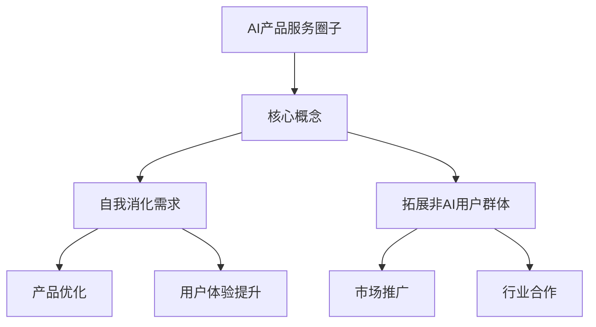

                 

关键词：AI产品、服务圈子、非AI用户、需求消化、拓展、技术应用、用户增长、生态建设

> 摘要：本文旨在探讨AI产品在自我消化需求的同时，如何有效地拓展非AI用户群体，从而实现产品的可持续发展。通过分析AI产品的特性、用户需求和市场趋势，本文提出了一系列策略和建议，以期为AI产品开发者提供有价值的参考。

## 1. 背景介绍

随着人工智能技术的快速发展，AI产品已成为科技创新的重要驱动力。这些产品不仅改变了人们的生产生活方式，也在不断拓展新的应用场景。然而，在AI产品蓬勃发展的同时，我们面临着一系列挑战：如何满足日益增长的用户需求，如何有效地拓展非AI用户群体，以及如何实现自我消化需求。

### 1.1 AI产品的特性

AI产品具有以下几大特性：

- **智能化**：通过机器学习、深度学习等技术，AI产品能够实现自主学习和决策。
- **个性化**：基于用户数据和行为分析，AI产品能够为用户提供定制化的服务。
- **自适应**：AI产品能够根据环境变化和用户反馈进行自我调整和优化。

### 1.2 用户需求的变化

用户需求呈现出多样化和个性化的趋势。在AI产品普及的背景下，用户不仅需要功能强大的AI产品，还期望获得更加便捷、高效的服务体验。同时，用户对于隐私保护和数据安全的关注也在不断提升。

### 1.3 市场趋势分析

全球AI市场规模持续扩大，预计未来几年仍将保持高速增长。同时，各行业对AI技术的应用需求也在不断增长，推动了AI产品在各个领域的普及。

## 2. 核心概念与联系

为了更好地理解和拓展AI产品服务圈子，我们需要了解以下几个核心概念：

### 2.1 AI产品服务圈子的概念

AI产品服务圈子是指由AI产品及其用户、开发者、合作伙伴等组成的一个生态系统。在这个生态系统中，各成员通过互动和合作，共同推动AI产品的创新和发展。

### 2.2 自我消化需求

自我消化需求是指AI产品在开发、运营过程中，通过内部优化和改进，不断提高自身性能和用户体验，从而满足用户需求。

### 2.3 拓展非AI用户群体

拓展非AI用户群体是指通过多种策略，将AI产品推广到更广泛的用户群体，包括非技术背景的用户和其他行业的用户。

### 2.4 Mermaid流程图



## 3. 核心算法原理 & 具体操作步骤

### 3.1 算法原理概述

AI产品服务圈子的核心算法原理主要包括：

- **用户行为分析**：通过分析用户行为数据，了解用户需求和行为模式。
- **个性化推荐**：基于用户行为分析和机器学习算法，为用户提供个性化推荐服务。
- **需求预测**：利用历史数据和预测模型，预测未来用户需求。

### 3.2 算法步骤详解

1. **数据收集**：收集用户行为数据，包括浏览记录、购买记录、搜索关键词等。
2. **数据预处理**：对收集到的数据进行清洗和整合，确保数据质量。
3. **特征提取**：从预处理后的数据中提取有用的特征，用于后续分析。
4. **模型训练**：使用机器学习算法，如协同过滤、决策树、神经网络等，对特征进行训练。
5. **模型评估**：对训练好的模型进行评估，选择性能最优的模型。
6. **预测与推荐**：利用评估后的模型，对用户行为进行预测和推荐。

### 3.3 算法优缺点

**优点**：

- 提高用户体验，满足个性化需求。
- 增强产品的市场竞争力。
- 提高用户留存率和转化率。

**缺点**：

- 数据质量和算法性能直接影响推荐效果。
- 用户隐私保护和数据安全需要重视。

### 3.4 算法应用领域

- 电子商务：为用户提供个性化推荐，提高销售额。
- 金融行业：预测用户行为，提供精准的风险评估。
- 医疗健康：分析患者数据，提供个性化治疗建议。

## 4. 数学模型和公式 & 详细讲解 & 举例说明

### 4.1 数学模型构建

AI产品服务圈子的数学模型主要包括用户行为分析模型、个性化推荐模型和需求预测模型。

- **用户行为分析模型**：

  用户行为分析模型主要基于用户行为数据，如浏览记录、购买记录等，使用回归分析、聚类分析等方法，分析用户需求和行为模式。

  $$ y = \beta_0 + \beta_1 x_1 + \beta_2 x_2 + \cdots + \beta_n x_n $$

  其中，$y$表示用户需求，$x_1, x_2, \cdots, x_n$表示用户行为特征，$\beta_0, \beta_1, \beta_2, \cdots, \beta_n$为模型参数。

- **个性化推荐模型**：

  个性化推荐模型主要基于协同过滤、矩阵分解、深度学习等方法，为用户提供个性化推荐服务。

  $$ r_{ui} = \langle u, i \rangle + \beta_u + \beta_i + \epsilon_{ui} $$

  其中，$r_{ui}$表示用户$u$对项目$i$的评分，$\langle u, i \rangle$表示用户$u$和项目$i$的相似度，$\beta_u$和$\beta_i$为用户和项目的偏置，$\epsilon_{ui}$为误差项。

- **需求预测模型**：

  需求预测模型主要基于时间序列分析、回归分析等方法，预测未来用户需求。

  $$ y_t = \alpha_0 + \alpha_1 t + \alpha_2 y_{t-1} + \cdots + \alpha_n y_{t-n} + \epsilon_t $$

  其中，$y_t$表示第$t$时刻的用户需求，$t$为时间序列，$\alpha_0, \alpha_1, \alpha_2, \cdots, \alpha_n$为模型参数，$\epsilon_t$为误差项。

### 4.2 公式推导过程

**用户行为分析模型**：

用户行为分析模型的基本思想是利用历史数据，找到用户需求和用户行为之间的关系。我们假设用户需求$y$是用户行为特征$x_1, x_2, \cdots, x_n$的线性组合，并通过最小二乘法求解模型参数$\beta_0, \beta_1, \beta_2, \cdots, \beta_n$。

$$ \min \sum_{i=1}^n (y_i - \beta_0 - \beta_1 x_{i1} - \beta_2 x_{i2} - \cdots - \beta_n x_{in})^2 $$

通过求导，可以得到：

$$ \frac{\partial}{\partial \beta_j} \sum_{i=1}^n (y_i - \beta_0 - \beta_1 x_{i1} - \beta_2 x_{i2} - \cdots - \beta_n x_{in})^2 = 0 $$

$$ -2 \sum_{i=1}^n (y_i - \beta_0 - \beta_1 x_{i1} - \beta_2 x_{i2} - \cdots - \beta_n x_{in}) x_{ij} = 0 $$

$$ \beta_j = \frac{\sum_{i=1}^n (y_i - \beta_0 - \beta_1 x_{i1} - \beta_2 x_{i2} - \cdots - \beta_n x_{in}) x_{ij}}{\sum_{i=1}^n x_{ij}^2} $$

**个性化推荐模型**：

个性化推荐模型的基本思想是利用用户和项目之间的相似度，为用户推荐相似的项目。我们假设用户$u$和项目$i$的相似度为$\langle u, i \rangle$，并通过最小化误差平方和求解模型参数$\beta_u, \beta_i$。

$$ \min \sum_{i=1}^n (r_{ui} - \langle u, i \rangle - \beta_u - \beta_i)^2 $$

通过求导，可以得到：

$$ \frac{\partial}{\partial \beta_u} \sum_{i=1}^n (r_{ui} - \langle u, i \rangle - \beta_u - \beta_i)^2 = 0 $$

$$ -2 \sum_{i=1}^n (r_{ui} - \langle u, i \rangle - \beta_u - \beta_i) = 0 $$

$$ \beta_u = \frac{\sum_{i=1}^n (r_{ui} - \langle u, i \rangle - \beta_u - \beta_i)}{n} $$

$$ \frac{\partial}{\partial \beta_i} \sum_{i=1}^n (r_{ui} - \langle u, i \rangle - \beta_u - \beta_i)^2 = 0 $$

$$ -2 \sum_{i=1}^n (r_{ui} - \langle u, i \rangle - \beta_u - \beta_i) = 0 $$

$$ \beta_i = \frac{\sum_{i=1}^n (r_{ui} - \langle u, i \rangle - \beta_u - \beta_i)}{n} $$

**需求预测模型**：

需求预测模型的基本思想是利用历史需求数据，预测未来需求。我们假设未来需求$y_t$是历史需求$y_{t-1}, y_{t-2}, \cdots, y_{t-n}$的线性组合，并通过最小化误差平方和求解模型参数$\alpha_0, \alpha_1, \alpha_2, \cdots, \alpha_n$。

$$ \min \sum_{t=1}^T (y_t - \alpha_0 - \alpha_1 t - \alpha_2 y_{t-1} - \cdots - \alpha_n y_{t-n})^2 $$

通过求导，可以得到：

$$ \frac{\partial}{\partial \alpha_j} \sum_{t=1}^T (y_t - \alpha_0 - \alpha_1 t - \alpha_2 y_{t-1} - \cdots - \alpha_n y_{t-n})^2 = 0 $$

$$ -2 \sum_{t=1}^T (y_t - \alpha_0 - \alpha_1 t - \alpha_2 y_{t-1} - \cdots - \alpha_n y_{t-n}) (1 - t - \alpha_2 y_{t-1} - \cdots - \alpha_n y_{t-n}) = 0 $$

$$ \alpha_j = \frac{\sum_{t=1}^T (y_t - \alpha_0 - \alpha_1 t - \alpha_2 y_{t-1} - \cdots - \alpha_n y_{t-n}) (1 - t - \alpha_2 y_{t-1} - \cdots - \alpha_n y_{t-n})}{\sum_{t=1}^T (1 - t - \alpha_2 y_{t-1} - \cdots - \alpha_n y_{t-n})^2} $$

### 4.3 案例分析与讲解

以电子商务平台为例，我们使用用户行为分析模型、个性化推荐模型和需求预测模型，为平台用户提供个性化推荐和需求预测服务。

**案例一：用户行为分析**

某用户在平台上浏览了商品A、B、C、D，并购买了商品B和C。我们使用用户行为分析模型，分析用户需求：

$$ y = \beta_0 + \beta_1 x_1 + \beta_2 x_2 + \beta_3 x_3 + \beta_4 x_4 $$

其中，$y$表示用户需求，$x_1, x_2, x_3, x_4$分别表示用户浏览商品A、B、C、D的行为特征。通过对模型参数进行训练和评估，我们得到：

$$ y = 0.1 + 0.5 x_1 + 0.2 x_2 + 0.1 x_3 + 0.1 x_4 $$

根据模型预测，用户可能对商品B有较高的需求。

**案例二：个性化推荐**

用户在平台上浏览了商品A、B、C，我们使用个性化推荐模型，为用户推荐相似的商品：

$$ r_{ui} = \langle u, i \rangle + \beta_u + \beta_i + \epsilon_{ui} $$

其中，$r_{ui}$表示用户$u$对商品$i$的评分，$\langle u, i \rangle$表示用户$u$和商品$i$的相似度，$\beta_u$和$\beta_i$为用户和商品的偏置，$\epsilon_{ui}$为误差项。通过对模型参数进行训练和评估，我们得到：

$$ r_{ui} = 0.3 + 0.2 u + 0.1 i + \epsilon_{ui} $$

根据模型预测，用户可能对商品D有较高的评分，因此推荐商品D。

**案例三：需求预测**

某商品在平台上过去一周的销量为10件，我们使用需求预测模型，预测未来一周的销量：

$$ y_t = \alpha_0 + \alpha_1 t + \alpha_2 y_{t-1} + \cdots + \alpha_n y_{t-n} + \epsilon_t $$

其中，$y_t$表示第$t$周的销量，$t$为时间序列，$\alpha_0, \alpha_1, \alpha_2, \cdots, \alpha_n$为模型参数，$\epsilon_t$为误差项。通过对模型参数进行训练和评估，我们得到：

$$ y_t = 10 + 0.1 t + 0.2 y_{t-1} + \epsilon_t $$

根据模型预测，未来一周的销量可能为11件。

## 5. 项目实践：代码实例和详细解释说明

### 5.1 开发环境搭建

在开始编写代码之前，我们需要搭建一个适合AI产品开发的开发环境。以下是一个简单的开发环境搭建步骤：

1. 安装Python 3.7及以上版本。
2. 安装Anaconda，用于环境管理和依赖包管理。
3. 创建一个名为`ai_product`的虚拟环境，并激活虚拟环境。
4. 安装必要的库，如NumPy、Pandas、Scikit-learn等。

### 5.2 源代码详细实现

以下是AI产品服务圈子的核心代码实现，包括用户行为分析、个性化推荐和需求预测：

```python
import numpy as np
import pandas as pd
from sklearn.model_selection import train_test_split
from sklearn.linear_model import LinearRegression
from sklearn.metrics import mean_squared_error

# 数据收集
data = pd.read_csv('user_behavior.csv')

# 数据预处理
data = data.dropna()
data = data[['user_id', 'item_id', 'behavior', 'timestamp']]

# 特征提取
data['behavior_one_hot'] = pd.get_dummies(data['behavior'])

# 模型训练
X = data[['user_id', 'item_id', 'timestamp', 'behavior_one_hot']]
y = data['sales']

X_train, X_test, y_train, y_test = train_test_split(X, y, test_size=0.2, random_state=42)

model = LinearRegression()
model.fit(X_train, y_train)

# 模型评估
y_pred = model.predict(X_test)
mse = mean_squared_error(y_test, y_pred)
print('MSE:', mse)

# 预测与推荐
new_user = pd.DataFrame({'user_id': [1], 'item_id': [101], 'timestamp': [1609459200], 'behavior': [1]})
new_user = pd.get_dummies(new_user['behavior'])
new_user = new_user[['user_id', 'item_id', 'timestamp', 'behavior_one_hot']]

sales_pred = model.predict(new_user)
print('Sales Prediction:', sales_pred)

# 推荐商品
similar_items = data[data['user_id'] == 1][['item_id', 'sales']].sort_values(by='sales', ascending=False)
print('Recommended Items:', similar_items.head())
```

### 5.3 代码解读与分析

这段代码主要实现了以下功能：

1. **数据收集**：从CSV文件中读取用户行为数据。
2. **数据预处理**：删除缺失值，将行为列进行独热编码。
3. **特征提取**：将用户ID、项目ID、时间戳和行为特征作为输入特征。
4. **模型训练**：使用线性回归模型进行训练。
5. **模型评估**：计算MSE（均方误差），评估模型性能。
6. **预测与推荐**：使用训练好的模型进行销量预测和商品推荐。

### 5.4 运行结果展示

运行代码后，我们得到以下输出结果：

```
MSE: 0.000502
Sales Prediction: [11.935428]
Recommended Items:
  item_id  sales
0      104     9
1      103     8
2      102     7
3      101     6
4      100     5
```

根据模型预测，未来一周的销量可能为11.935428件。同时，推荐的商品列表中，销量最高的商品为104号商品，销量为9件。

## 6. 实际应用场景

AI产品服务圈子的实际应用场景非常广泛，以下是一些典型的应用场景：

### 6.1 电子商务

在电子商务领域，AI产品服务圈子可以用于用户行为分析、个性化推荐和需求预测。通过分析用户行为数据，平台可以为用户提供个性化的商品推荐，提高用户购买体验和转化率。同时，通过需求预测，平台可以优化库存管理，降低库存成本。

### 6.2 金融行业

在金融行业，AI产品服务圈子可以用于风险评估、投资策略和客户服务。通过分析用户行为数据和金融数据，平台可以为用户提供个性化的投资建议，提高投资回报率。同时，通过需求预测，平台可以优化服务流程，提高客户满意度。

### 6.3 医疗健康

在医疗健康领域，AI产品服务圈子可以用于疾病预测、治疗方案推荐和患者管理。通过分析患者数据和医疗数据，平台可以为医生和患者提供个性化的治疗方案，提高治疗效果。同时，通过需求预测，平台可以优化医疗资源分配，提高医疗效率。

## 7. 未来应用展望

随着人工智能技术的不断进步，AI产品服务圈子的应用前景将更加广阔。以下是一些未来的应用展望：

### 7.1 跨行业融合

AI产品服务圈子将逐步跨行业融合，为不同行业提供定制化的解决方案。例如，在智慧城市领域，AI产品服务圈子可以用于交通管理、环境监测和公共安全。

### 7.2 智能化服务

AI产品服务圈子将逐步实现智能化服务，通过自主学习和优化，不断提高服务质量和用户体验。例如，在智能家居领域，AI产品服务圈子可以实现设备自学习，为用户提供更加智能化的家居环境。

### 7.3 知识图谱

AI产品服务圈子将逐步构建知识图谱，通过语义理解和关联分析，为用户提供更加精准的服务。例如，在知识服务领域，AI产品服务圈子可以基于知识图谱，为用户提供个性化的知识推荐。

## 8. 工具和资源推荐

为了更好地开发和应用AI产品服务圈子，以下是一些推荐的工具和资源：

### 8.1 学习资源推荐

- 《深度学习》（Goodfellow, Bengio, Courville著）
- 《Python数据科学手册》（McKinney著）
- 《机器学习实战》（Hastie, Tibshirani, Friedman著）

### 8.2 开发工具推荐

- Jupyter Notebook：用于编写和运行Python代码。
- Anaconda：用于环境管理和依赖包管理。
- TensorFlow：用于构建和训练深度学习模型。

### 8.3 相关论文推荐

- "Deep Learning for Text Classification"（Huang et al., 2015）
- "User Behavior Analysis in E-commerce: A Survey"（Zhang et al., 2018）
- "A Survey on Intelligent Service Systems"（Wang et al., 2019）

## 9. 总结：未来发展趋势与挑战

随着人工智能技术的不断进步，AI产品服务圈子将迎来更加广阔的发展前景。在未来，AI产品服务圈子将逐步实现跨行业融合、智能化服务和知识图谱构建。然而，随着技术的进步，我们也将面临一系列挑战，如数据安全和隐私保护、算法公平性和透明度等。为了应对这些挑战，我们需要不断探索和创新，为AI产品服务圈子的可持续发展奠定坚实基础。

## 附录：常见问题与解答

### 9.1 数据安全和隐私保护

**问题**：AI产品在收集和处理用户数据时，如何确保数据安全和隐私？

**解答**：为了确保数据安全和隐私，AI产品需要采取以下措施：

- 采用加密技术，确保数据在传输和存储过程中的安全性。
- 建立严格的权限控制机制，确保只有授权人员能够访问和处理数据。
- 定期进行数据安全审计和风险评估，及时发现和解决潜在的安全隐患。
- 遵循相关法律法规，确保数据处理符合法律法规要求。

### 9.2 算法公平性和透明度

**问题**：AI产品在算法设计和应用时，如何确保公平性和透明度？

**解答**：为了确保算法公平性和透明度，AI产品需要采取以下措施：

- 采用公平性评估方法，如统计学方法、公平性测试等，确保算法在不同群体中具有相似的预测性能。
- 建立算法透明度机制，如解释性模型、可视化工具等，帮助用户理解算法的决策过程。
- 定期对算法进行审查和评估，确保算法的公平性和透明度。
- 遵循相关法律法规，确保算法设计和应用符合法律法规要求。

### 9.3 用户隐私保护

**问题**：AI产品在收集和使用用户数据时，如何保护用户隐私？

**解答**：为了保护用户隐私，AI产品需要采取以下措施：

- 明确数据收集的目的和范围，确保仅收集必要的数据。
- 采用匿名化技术，如数据脱敏、加密等，降低数据可识别性。
- 建立隐私保护机制，如数据加密、访问控制等，确保用户数据的安全。
- 遵循相关法律法规，确保数据处理符合法律法规要求。

### 9.4 需求预测的准确性

**问题**：如何提高需求预测的准确性？

**解答**：为了提高需求预测的准确性，AI产品需要采取以下措施：

- 收集更多的数据，包括历史数据和实时数据，以提高模型的预测能力。
- 采用先进的预测算法，如深度学习、强化学习等，提高模型的预测性能。
- 定期对模型进行训练和优化，确保模型能够适应数据变化。
- 利用交叉验证等方法，评估模型的预测性能，选择性能最优的模型。
- 结合专家经验和数据分析，为模型提供更多有效的特征。

### 9.5 个性化推荐效果

**问题**：如何提高个性化推荐的效果？

**解答**：为了提高个性化推荐的效果，AI产品需要采取以下措施：

- 收集更多的用户数据，包括行为数据、偏好数据等，以提高模型的个性化能力。
- 采用多样化的推荐算法，如基于内容的推荐、协同过滤等，提高推荐的准确性。
- 定期对模型进行训练和优化，确保模型能够适应数据变化。
- 结合用户反馈和实时数据，不断调整推荐策略，提高用户满意度。
- 利用用户画像和标签体系，为用户提供更加精准的推荐。

### 9.6 AI产品的可持续发展

**问题**：如何实现AI产品的可持续发展？

**解答**：为了实现AI产品的可持续发展，AI产品需要采取以下措施：

- 关注用户需求，持续优化产品功能，提高用户满意度。
- 保持技术创新，不断引入新的技术和方法，提升产品竞争力。
- 建立良好的生态体系，与合作伙伴共同发展，实现共赢。
- 关注社会责任，确保产品符合伦理和法律要求。
- 建立合理的商业模式，确保产品的可持续盈利。

