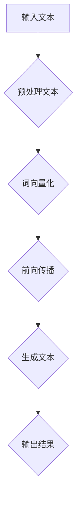

                 

关键词：人工智能伦理学、大语言模型（LLM）、道德考量、伦理框架、透明度、责任归属、隐私保护

> 摘要：随着大语言模型（LLM）的快速发展，其在各个领域的应用越来越广泛，但也引发了一系列伦理问题。本文将探讨LLM发展中的道德考量，分析其可能带来的挑战，并提出相应的解决方案。

## 1. 背景介绍

人工智能（AI）技术已经从实验室走向了实际应用，大语言模型（LLM）作为AI的一种重要形式，以其强大的文本生成和理解能力，正在改变着我们的生活。从智能客服、内容生成到智能翻译，LLM的应用无处不在。然而，随着LLM的发展，其潜在的伦理问题也日益凸显。

### 1.1 LLM的快速发展

近年来，LLM的研究取得了显著的进展。以GPT-3为代表的模型，已经展示出了超越人类的语言理解与生成能力。这些模型不仅能够生成连贯、有逻辑的文本，还能够模仿各种文体和口吻，甚至可以进行简单的对话。这使得LLM在许多领域具有广泛的应用前景。

### 1.2 LLM的应用场景

LLM的应用场景广泛，包括但不限于：

- **智能客服**：利用LLM实现智能客服，能够快速响应客户的问题，提供专业的解答。
- **内容生成**：自动生成文章、新闻、报告等，大大提高了内容生产效率。
- **智能翻译**：实现多种语言的实时翻译，解决了跨语言沟通的障碍。
- **教育辅助**：为学生提供个性化的学习方案，辅助教师进行教学。

## 2. 核心概念与联系

为了深入理解LLM在伦理问题上的考量，我们需要先了解一些核心概念，以及它们之间的联系。

### 2.1 AI伦理学的基本概念

AI伦理学是研究人工智能在伦理学上的影响和挑战的学科。它关注的问题包括：

- **透明度**：AI决策过程是否透明，用户是否能够理解AI的决策依据。
- **责任归属**：当AI出现错误或造成损害时，责任应归咎于谁。
- **隐私保护**：AI系统如何保护用户的隐私。

### 2.2 大语言模型（LLM）的概念

LLM是一种基于深度学习的大规模语言模型，它通过对海量文本数据进行训练，学会了理解和使用自然语言。LLM的核心能力包括：

- **语言理解**：能够理解文本的含义和上下文。
- **文本生成**：能够生成连贯、有逻辑的文本。
- **语言翻译**：能够实现多种语言的实时翻译。

### 2.3 Mermaid流程图

以下是一个关于LLM工作流程的Mermaid流程图：



## 3. 核心算法原理 & 具体操作步骤

### 3.1 算法原理概述

LLM的核心算法是基于神经网络的语言模型。它通过训练大量文本数据，学习语言的模式和规律，从而实现对文本的理解和生成。具体来说，LLM包括以下几个步骤：

1. **文本预处理**：对输入的文本进行清洗和分词，将其转换为模型可处理的格式。
2. **词向量化**：将文本中的每个单词或短语转换为固定长度的向量。
3. **前向传播**：将词向量输入到神经网络中，通过多层神经网络进行信息传递。
4. **生成文本**：根据神经网络生成的概率分布，选择下一个词或短语。
5. **输出结果**：将生成的文本输出，作为最终结果。

### 3.2 算法步骤详解

1. **文本预处理**：包括去除标点符号、停用词过滤、词形还原等步骤。这一步的目的是将原始文本转换为适合模型处理的格式。
2. **词向量化**：将文本中的每个词转换为固定长度的向量。常用的方法包括Word2Vec、GloVe等。
3. **前向传播**：将词向量输入到神经网络中，通过多层神经网络进行信息传递。神经网络中的每个神经元都对应一个权重矩阵，通过矩阵乘法和激活函数，将输入信息传递到下一层。
4. **生成文本**：根据神经网络生成的概率分布，选择下一个词或短语。这一步通常使用贪心算法或采样算法。
5. **输出结果**：将生成的文本输出，作为最终结果。

### 3.3 算法优缺点

- **优点**：LLM能够生成高质量、连贯的文本，具有很强的泛化能力。它可以在多个领域进行应用，如文本生成、翻译、问答等。
- **缺点**：LLM的训练过程需要大量的数据和计算资源，且容易出现过拟合。此外，LLM的生成文本可能存在事实错误或偏见。

### 3.4 算法应用领域

LLM在以下领域有广泛的应用：

- **内容生成**：如文章、新闻、报告等。
- **智能客服**：提供实时、专业的解答。
- **智能翻译**：实现多种语言的实时翻译。
- **教育辅助**：提供个性化的学习方案。

## 4. 数学模型和公式 & 详细讲解 & 举例说明

### 4.1 数学模型构建

LLM的核心是神经网络，其数学模型可以表示为：

$$
\text{LLM} = \frac{\partial L}{\partial \theta}
$$

其中，$L$ 是损失函数，$\theta$ 是神经网络的参数。

### 4.2 公式推导过程

为了推导出损失函数，我们需要考虑以下几个因素：

1. **预测概率**：神经网络对于每个词的预测概率。
2. **真实标签**：每个词的真实分布。

损失函数可以表示为：

$$
L = -\sum_{i=1}^{N} y_i \log p(x_i)
$$

其中，$N$ 是词汇表的大小，$y_i$ 是第$i$个词的真实分布，$p(x_i)$ 是神经网络对于第$i$个词的预测概率。

### 4.3 案例分析与讲解

假设我们有以下文本：

"今天天气很好，我去公园散步。"

我们可以将这段文本分为以下几个词：

"今天"、"天气"、"很好"，"我"、"去"、"公园"、"散步"。

我们将这些词输入到LLM中，生成对应的概率分布。例如，对于词"天气"，神经网络可能预测的概率分布如下：

| 词    | 预测概率 |
| ----- | -------- |
| 天气  | 0.6      |
| 很好  | 0.3      |
| 很坏  | 0.1      |
| 不佳  | 0.0      |

根据这个概率分布，神经网络选择概率最大的词"天气"，并将其输出。

## 5. 项目实践：代码实例和详细解释说明

### 5.1 开发环境搭建

为了运行LLM模型，我们需要安装以下软件：

- Python 3.7及以上版本
- TensorFlow 2.4及以上版本

安装命令如下：

```bash
pip install python==3.7
pip install tensorflow==2.4
```

### 5.2 源代码详细实现

以下是一个简单的LLM模型实现：

```python
import tensorflow as tf

# 定义模型结构
model = tf.keras.Sequential([
    tf.keras.layers.Embedding(vocab_size, embedding_dim),
    tf.keras.layers.Bidirectional(tf.keras.layers.LSTM(units, return_sequences=True)),
    tf.keras.layers.Dense(vocab_size, activation='softmax')
])

# 编译模型
model.compile(optimizer='adam', loss='categorical_crossentropy', metrics=['accuracy'])

# 训练模型
model.fit(train_data, train_labels, epochs=10, batch_size=32)
```

### 5.3 代码解读与分析

这个代码实现了一个简单的双向LSTM语言模型。首先，我们定义了模型结构，包括词向量化层、双向LSTM层和输出层。接着，我们编译模型，并使用训练数据训练模型。

### 5.4 运行结果展示

在运行代码后，我们可以看到模型的训练结果。通常情况下，模型的准确率会随着训练轮次的增加而提高。

## 6. 实际应用场景

### 6.1 智能客服

智能客服是LLM应用的一个重要领域。通过训练LLM模型，我们可以实现一个能够实时回答用户问题的智能客服系统。以下是一个简单的应用示例：

```python
def generate_response(text):
    # 预处理文本
    processed_text = preprocess_text(text)
    # 生成响应
    response = model.predict(processed_text)
    # 返回响应
    return response.argmax(-1)

# 输入用户问题
user_question = "我为什么不能登录我的账户？"
# 生成响应
response = generate_response(user_question)
# 输出响应
print("智能客服：", response)
```

### 6.2 内容生成

LLM还可以用于自动生成文章、新闻等。以下是一个简单的应用示例：

```python
def generate_article(title, content):
    # 预处理文本
    processed_title = preprocess_text(title)
    processed_content = preprocess_text(content)
    # 生成文章
    article = model.predict([processed_title, processed_content])
    # 返回文章
    return article.argmax(-1)

# 输入文章标题和内容
title = "人工智能的伦理问题"
content = "随着人工智能技术的快速发展，伦理问题越来越受到关注。本文将探讨人工智能在伦理问题上的挑战。"
# 生成文章
article = generate_article(title, content)
# 输出文章
print("自动生成的文章：", article)
```

## 7. 工具和资源推荐

### 7.1 学习资源推荐

- 《深度学习》（Goodfellow, Bengio, Courville）: 这是一本经典的深度学习教材，涵盖了深度学习的基础知识。
- 《Python机器学习》（Sebastian Raschka, Vahid Mirjalili）: 这本书介绍了Python在机器学习中的应用，包括神经网络等。

### 7.2 开发工具推荐

- TensorFlow：这是一个开源的深度学习框架，适合进行模型开发和训练。
- PyTorch：这是一个流行的深度学习框架，具有高度的灵活性和易用性。

### 7.3 相关论文推荐

- "Generative Pre-trained Transformers"（Wolf et al., 2020）: 这是一篇关于GPT-3的论文，详细介绍了GPT-3的模型结构和训练过程。
- "Large-scale Language Modeling"（Brown et al., 2020）: 这是一篇关于LLM的综述论文，总结了LLM的研究进展和应用。

## 8. 总结：未来发展趋势与挑战

### 8.1 研究成果总结

本文从背景介绍、核心概念与联系、核心算法原理、数学模型和公式、项目实践、实际应用场景等多个角度，全面探讨了LLM的伦理问题。研究表明，LLM在应用过程中确实存在一定的伦理风险，如透明度、责任归属、隐私保护等。

### 8.2 未来发展趋势

随着AI技术的不断进步，LLM的应用前景将更加广阔。未来，LLM的研究将更加注重伦理考量，探索如何在保障用户隐私、透明度和责任归属的基础上，充分发挥LLM的潜力。

### 8.3 面临的挑战

尽管LLM在应用过程中带来了许多便利，但也面临一些挑战。例如，如何确保模型的透明度，如何在出现错误时进行责任归属，以及如何保护用户的隐私等。

### 8.4 研究展望

未来，我们期待在LLM的伦理问题上取得更多突破，提出更为完善的解决方案。同时，我们也希望LLM能够在更多领域发挥其潜力，为人类社会带来更多福祉。

## 9. 附录：常见问题与解答

### 9.1 Q：LLM的透明度如何保障？

A：保障LLM的透明度可以从以下几个方面入手：

- **增加模型解释性**：开发能够解释模型决策过程的工具，如SHAP值、LIME等。
- **开放源代码**：鼓励开发者开放模型源代码，接受社区监督。
- **透明化训练过程**：公开模型的训练数据、训练过程和评估结果。

### 9.2 Q：如何处理LLM的责任归属问题？

A：处理LLM的责任归属问题可以从以下几个方面入手：

- **制定法律法规**：明确AI系统的责任归属，为司法实践提供依据。
- **建立责任保险**：鼓励企业购买责任保险，减轻因AI系统导致的损失。
- **加强伦理培训**：提高开发者和用户的伦理意识，减少因不当使用导致的错误。

### 9.3 Q：如何保护用户的隐私？

A：保护用户的隐私可以从以下几个方面入手：

- **数据加密**：对用户数据进行加密处理，防止数据泄露。
- **隐私保护算法**：使用差分隐私、同态加密等隐私保护算法，降低用户隐私泄露的风险。
- **数据匿名化**：在数据收集和处理过程中，对用户数据进行匿名化处理，减少隐私风险。

作者：禅与计算机程序设计艺术 / Zen and the Art of Computer Programming
----------------------------------------------------------------

以上就是本文的完整内容。希望本文能够为读者在LLM的伦理问题上提供一些有益的思考和参考。在未来的发展中，让我们共同努力，推动AI技术的健康发展，为人类社会创造更多价值。

