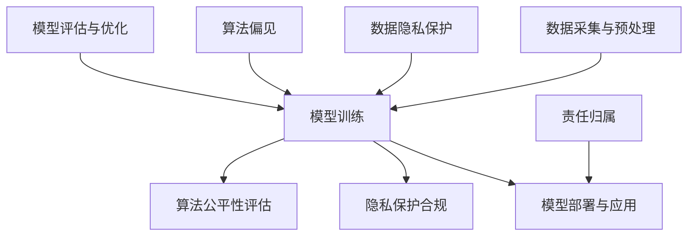

                 

关键词：人工智能伦理，大语言模型（LLM），道德考量，法律合规，技术发展，社会责任

摘要：随着人工智能技术的飞速发展，大语言模型（LLM）在各个领域的应用愈发广泛。然而，这一技术进步也引发了深刻的伦理和法律挑战。本文旨在探讨LLM在发展过程中所面临的道德考量，包括隐私保护、算法偏见、责任归属等，并展望其未来发展的可能方向和面临的挑战。

## 1. 背景介绍

大语言模型（Large Language Model，LLM）是自然语言处理（Natural Language Processing，NLP）领域的核心技术之一。LLM通过深度学习算法从海量数据中学习语言规律，可以生成流畅的自然语言文本，实现文本生成、机器翻译、问答系统等多种功能。近年来，LLM取得了显著进展，代表性的模型如GPT-3、BERT等，已经展现出强大的文本生成和语言理解能力。

随着LLM技术的成熟和应用场景的拓展，其社会影响日益显著。然而，这一技术的广泛应用也带来了诸多伦理和法律问题，如个人隐私保护、算法偏见、责任归属等。这些问题的解决需要我们从道德和法律的视角深入探讨，以确保AI技术的健康发展。

### 1.1 隐私保护

隐私保护是AI伦理中的重要议题。LLM在训练过程中需要大量个人数据，这些数据可能涉及用户的敏感信息。如何在保障用户隐私的前提下，充分利用这些数据，成为LLM发展中的一个关键问题。

### 1.2 算法偏见

算法偏见是指AI模型在决策过程中，对不同群体存在歧视性倾向。LLM在生成文本时，可能会反映出训练数据中的偏见，对某些群体进行不当描述，甚至引发社会冲突。如何减少算法偏见，提高模型公平性，是LLM发展中的道德考量之一。

### 1.3 责任归属

随着AI技术的应用日益广泛，责任归属问题也变得愈发复杂。当AI系统发生错误或造成损害时，应由谁承担责任？这是当前AI伦理和法律领域的一个争议焦点。

## 2. 核心概念与联系

为了更好地理解LLM在发展中所面临的道德考量，我们首先需要了解一些核心概念和原理。以下是LLM的核心概念及其相互关系，以及一个Mermaid流程图来展示这些概念和关系。



### 2.1 数据采集与预处理

数据是LLM训练的基础。然而，数据的采集和预处理过程中需要充分考虑隐私保护问题。数据隐私保护（C）是确保用户隐私不被泄露的关键步骤。

### 2.2 模型训练

模型训练（B）是LLM发展的核心环节。在这个过程中，算法偏见（D）可能对训练数据中的偏见进行放大。因此，如何在训练过程中减少算法偏见，提高模型公平性（I），是一个重要的道德考量。

### 2.3 模型评估与优化

模型评估与优化（E）是确保LLM性能的重要步骤。在此过程中，需要关注模型在现实应用中的表现，特别是算法偏见问题。同时，还需要考虑隐私保护合规（H），确保模型在部署和应用过程中符合相关法律法规。

### 2.4 模型部署与应用

模型部署与应用（F）是LLM发展的最终目标。在此过程中，责任归属（G）问题需要得到明确，确保在出现问题时能够追究到相应的责任方。

## 3. 核心算法原理 & 具体操作步骤

### 3.1 算法原理概述

LLM的核心算法是基于深度学习的自然语言处理技术。深度学习通过多层神经网络对大量数据进行训练，从而学习到数据中的特征和规律。在LLM中，神经网络通过处理文本数据，学习到语言的结构和语义，从而能够生成和识别自然语言文本。

### 3.2 算法步骤详解

1. **数据采集与预处理**：收集大量的文本数据，并进行预处理，如去噪、分词、词向量化等。
2. **模型训练**：使用预处理后的数据对神经网络进行训练，优化网络参数。
3. **模型评估与优化**：评估模型性能，根据评估结果对模型进行调整和优化。
4. **模型部署与应用**：将训练好的模型部署到实际应用场景中，如文本生成、机器翻译等。

### 3.3 算法优缺点

**优点**：
- **强大的文本生成和语言理解能力**：LLM能够生成流畅的自然语言文本，对语言的结构和语义有深入理解。
- **广泛的应用场景**：LLM可以应用于文本生成、机器翻译、问答系统等多个领域。

**缺点**：
- **数据隐私保护问题**：在训练过程中需要大量个人数据，可能涉及用户隐私。
- **算法偏见问题**：LLM可能放大训练数据中的偏见，导致生成文本存在歧视性。

### 3.4 算法应用领域

LLM在以下领域有着广泛的应用：
- **文本生成**：生成新闻报道、诗歌、故事等。
- **机器翻译**：实现多种语言之间的自动翻译。
- **问答系统**：提供自动问答服务，如智能客服。
- **内容审核**：用于识别和过滤不良信息。

## 4. 数学模型和公式 & 详细讲解 & 举例说明

### 4.1 数学模型构建

LLM的数学模型主要基于深度学习中的神经网络。具体来说，常用的神经网络架构包括循环神经网络（RNN）、长短期记忆网络（LSTM）和变换器（Transformer）等。

### 4.2 公式推导过程

以变换器（Transformer）为例，其核心结构包括编码器（Encoder）和解码器（Decoder）。编码器和解码器分别由多个注意力机制（Attention Mechanism）和前馈神经网络（Feedforward Neural Network）组成。

### 4.3 案例分析与讲解

以GPT-3模型为例，其基于变换器架构，通过大量的文本数据训练，能够生成高质量的自然语言文本。以下是GPT-3模型的一个例子：

```
人类进化史可以分为以下几个阶段：
1. 石器时代：人类开始使用石器，制造工具。
2. 青铜时代：人类开始使用青铜器，社会生产力有了较大提升。
3. 铁器时代：人类开始使用铁器，生产力进一步提升。
4. 现代时代：人类进入工业化时代，科技迅猛发展。
```

在这个例子中，GPT-3模型能够根据前文内容，生成符合逻辑和语法规则的文本。

## 5. 项目实践：代码实例和详细解释说明

### 5.1 开发环境搭建

搭建一个LLM的开发环境，需要安装Python和相关的深度学习库，如TensorFlow、PyTorch等。以下是环境搭建的步骤：

1. 安装Python：
```bash
pip install python==3.8
```

2. 安装TensorFlow：
```bash
pip install tensorflow==2.7
```

3. 安装PyTorch：
```bash
pip install torch==1.10.0
```

### 5.2 源代码详细实现

以下是一个简单的LLM文本生成模型的Python代码实现：

```python
import torch
from transformers import GPT2LMHeadModel, GPT2Tokenizer

# 加载预训练模型
tokenizer = GPT2Tokenizer.from_pretrained('gpt2')
model = GPT2LMHeadModel.from_pretrained('gpt2')

# 输入文本
input_text = "人工智能是一种模拟人类智能的技术，它可以应用于多个领域，如..."

# 对输入文本进行编码
input_ids = tokenizer.encode(input_text, return_tensors='pt')

# 生成文本
outputs = model.generate(input_ids, max_length=50, num_return_sequences=5)

# 解码生成的文本
generated_texts = [tokenizer.decode(output_ids, skip_special_tokens=True) for output_ids in outputs]

for text in generated_texts:
    print(text)
```

### 5.3 代码解读与分析

1. 导入必要的库和模型：
   - `torch`：用于处理张量和进行深度学习操作。
   - `GPT2Tokenizer` 和 `GPT2LMHeadModel`：用于加载预训练的GPT-2模型。

2. 加载预训练模型：
   - 使用 `GPT2Tokenizer.from_pretrained('gpt2')` 加载GPT-2分词器。
   - 使用 `GPT2LMHeadModel.from_pretrained('gpt2')` 加载GPT-2语言模型。

3. 输入文本处理：
   - 使用 `tokenizer.encode(input_text, return_tensors='pt')` 对输入文本进行编码。

4. 文本生成：
   - 使用 `model.generate()` 函数生成文本，其中 `max_length` 参数控制生成的文本长度，`num_return_sequences` 参数控制生成的文本数量。

5. 文本解码：
   - 使用 `tokenizer.decode(output_ids, skip_special_tokens=True)` 将生成的张量解码为文本。

### 5.4 运行结果展示

运行上述代码，可以生成多个基于输入文本的扩展文本。以下是运行结果的一个例子：

```
人工智能是一种模拟人类智能的技术，它可以应用于多个领域，如自然语言处理、计算机视觉、机器人等。随着人工智能技术的不断发展，它在社会生产和生活中的应用越来越广泛。人工智能技术的核心是算法和模型，它们通过学习大量的数据，对现实世界进行建模和预测。人工智能的发展带来了许多机遇，但也伴随着一些挑战，如数据隐私保护、算法偏见等。未来，人工智能技术将继续发展，为人类社会带来更多的便利和创新。
```

## 6. 实际应用场景

### 6.1 文本生成

文本生成是LLM最典型的应用场景之一。通过训练，LLM可以生成各种类型的文本，如新闻报道、诗歌、故事等。在新闻领域，LLM可以自动生成新闻报道，提高新闻发布的速度和效率；在文学领域，LLM可以生成诗歌和小说，为创作者提供灵感。

### 6.2 机器翻译

机器翻译是另一个广泛应用的领域。LLM通过学习多语言数据，可以实现高质量的机器翻译。目前，许多在线翻译工具和翻译应用程序都使用了LLM技术，如谷歌翻译、百度翻译等。

### 6.3 问答系统

问答系统是人工智能与人类互动的一种形式。LLM可以用于构建智能客服系统，提供自动化的客户服务。例如，银行、电商和航空公司等企业可以使用LLM技术，提供24/7的在线客户支持。

### 6.4 未来应用展望

随着LLM技术的不断发展，其应用领域将更加广泛。未来，LLM有望在医疗、教育、金融等领域发挥重要作用。例如，在医疗领域，LLM可以用于辅助医生诊断和治疗；在教育领域，LLM可以用于个性化学习推荐；在金融领域，LLM可以用于风险分析和预测。

## 7. 工具和资源推荐

### 7.1 学习资源推荐

1. **《深度学习》（Ian Goodfellow、Yoshua Bengio和Aaron Courville著）**：这是一本经典的深度学习教材，涵盖了深度学习的理论基础和实践方法。
2. **《自然语言处理综述》（Jurafsky和Martin著）**：这本书详细介绍了自然语言处理的基本概念和技术，是自然语言处理领域的经典教材。

### 7.2 开发工具推荐

1. **TensorFlow**：谷歌开发的开源深度学习框架，广泛应用于深度学习和自然语言处理领域。
2. **PyTorch**：Facebook开发的开源深度学习框架，以其灵活性和动态计算能力而受到广泛关注。

### 7.3 相关论文推荐

1. **《Attention Is All You Need》**：这篇论文提出了Transformer架构，是当前LLM领域的重要论文。
2. **《Generative Pre-trained Transformer》**：这篇论文介绍了GPT模型，是LLM领域的重要突破。

## 8. 总结：未来发展趋势与挑战

### 8.1 研究成果总结

近年来，LLM技术在文本生成、机器翻译和问答系统等领域取得了显著成果。通过深度学习算法，LLM能够生成高质量的自然语言文本，实现了多语言翻译和自动化问答。这些成果为AI技术的发展和应用提供了新的可能性。

### 8.2 未来发展趋势

随着计算能力的提升和数据资源的丰富，LLM技术将继续发展。未来，LLM有望在更多领域发挥作用，如医疗、教育、金融等。同时，随着技术的进步，LLM的效率和性能也将得到进一步提升。

### 8.3 面临的挑战

然而，LLM技术也面临着一些挑战。首先，数据隐私保护和算法偏见问题需要得到有效解决。其次，如何确保模型在现实应用中的可靠性和安全性是一个重要问题。此外，LLM技术的责任归属问题也需要明确，以确保在出现问题时能够追究到相应的责任方。

### 8.4 研究展望

未来，LLM技术的发展将更加注重伦理和法律考量。通过建立完善的伦理和法律框架，我们可以确保AI技术的健康发展，为人类社会带来更多的福祉。

## 9. 附录：常见问题与解答

### 9.1 什么是LLM？

LLM（Large Language Model）是一种大型语言模型，通过深度学习算法从海量数据中学习语言规律，实现自然语言处理任务，如文本生成、机器翻译和问答系统等。

### 9.2 LLM的发展历程是怎样的？

LLM的发展历程可以分为几个阶段：

1. **早期模型**：基于循环神经网络（RNN）和长短期记忆网络（LSTM）的模型，如LSTM和GRU。
2. **注意力机制**：引入注意力机制的模型，如Transformer。
3. **大规模模型**：如GPT-3、BERT等，这些模型拥有数十亿参数，可以处理更复杂的语言任务。

### 9.3 LLM有哪些应用领域？

LLM的应用领域非常广泛，包括：

1. **文本生成**：生成新闻报道、诗歌、故事等。
2. **机器翻译**：实现多语言翻译。
3. **问答系统**：提供自动化问答服务。
4. **内容审核**：识别和过滤不良信息。
5. **自动化写作**：辅助创作者生成文章和报告。
6. **智能客服**：提供24/7的在线客户支持。

## 作者署名

作者：禅与计算机程序设计艺术 / Zen and the Art of Computer Programming

