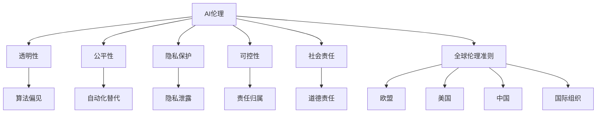

                 

关键词：AI伦理、国际合作、全球伦理准则、治理机制、AI伦理准则、AI伦理法规、AI治理框架

> 摘要：本文探讨了AI伦理在国际合作中的重要性，分析了当前全球范围内AI伦理准则和治理机制的发展状况。文章首先介绍了AI伦理的基本概念和核心问题，然后详细阐述了全球伦理准则和治理机制的现状与挑战，并提出了改进策略。通过本文的研究，旨在为全球AI伦理的合作与发展提供有益的参考。

## 1. 背景介绍

人工智能（AI）技术的发展日新月异，对社会各个领域的变革和影响日益显著。从智能客服、自动驾驶到医疗诊断、金融分析，AI技术的应用已经深入到我们日常生活的方方面面。然而，AI技术的快速发展和广泛应用也引发了一系列伦理问题和挑战。如何确保AI系统的公平性、透明性和安全性，如何避免AI可能带来的歧视、隐私侵犯和社会失衡等问题，成为全球关注的焦点。

在AI伦理领域，国际合作显得尤为重要。不同国家和地区在文化、法律和社会背景上存在差异，单一国家的伦理规范难以涵盖全球范围内的AI应用场景。因此，建立一套全球范围内广泛认可的AI伦理准则和治理机制，对于引导AI技术的健康发展、促进全球合作和共同繁荣具有重要意义。

本文将围绕AI伦理的国际合作主题，首先介绍AI伦理的基本概念和核心问题，然后分析全球伦理准则和治理机制的发展状况，探讨其中的挑战和问题，并提出相应的改进策略。通过本文的研究，希望能够为全球AI伦理的合作与发展提供有益的参考。

## 2. 核心概念与联系

### 2.1 AI伦理的基本概念

AI伦理，又称人工智能伦理，是关于人工智能在设计和应用过程中应遵循的道德原则和规范的研究。AI伦理的核心目标是确保AI技术的可持续发展，保护人类和社会的利益，避免技术带来的负面影响。以下是一些AI伦理的基本概念：

- **透明性（Transparency）**：指AI系统的决策过程和结果应该是可解释和可理解的，以便用户和监管者能够对其行为进行审查和监督。
- **公平性（Fairness）**：确保AI系统在不同群体之间分配资源和服务时保持公平，避免歧视和偏见。
- **隐私保护（Privacy）**：保障用户的个人隐私，防止AI系统收集、处理和泄露敏感信息。
- **可控性（Controllability）**：确保AI系统能够在出现问题时被有效管理和控制。
- **社会责任（Social Responsibility）**：AI技术的研发和应用应该符合社会伦理标准，促进人类福祉和社会进步。

### 2.2 AI伦理的核心问题

AI伦理领域涉及诸多复杂问题，其中一些核心问题包括：

- **算法偏见（Algorithmic Bias）**：AI系统可能会在决策过程中产生偏见，导致对特定群体的歧视。如何减少和消除算法偏见是当前研究的重要课题。
- **自动化替代（Automation Replacement）**：AI技术的自动化应用可能导致大量职业被取代，引发社会稳定和经济问题。
- **隐私和安全（Privacy and Security）**：AI系统在收集、处理和存储大量数据时，可能会面临隐私泄露和安全风险。
- **责任归属（Attribution of Responsibility）**：当AI系统造成损害时，如何界定责任归属是一个复杂的问题。
- **道德责任（Moral Responsibility）**：随着AI技术的发展，如何让AI系统承担道德责任成为伦理研究的重要方向。

### 2.3 全球伦理准则和治理机制

全球伦理准则和治理机制的构建是解决AI伦理问题的重要途径。目前，多个国家和地区已开始制定相关的伦理准则和法规，以指导AI技术的研发和应用。以下是一些全球伦理准则和治理机制的现状：

- **欧盟（EU）**：欧盟推出了《人工智能伦理准则》，强调AI系统的透明性、公平性和隐私保护，并提出了严格的法规要求。
- **美国（US）**：美国政府发布了《美国人工智能倡议》，提出了AI伦理的框架和具体措施，包括建立人工智能伦理委员会等。
- **中国（China）**：中国政府发布了《新一代人工智能伦理规范》，强调了AI技术的可持续发展和社会责任，并推动相关法律法规的制定。
- **国际组织（International Organizations）**：如联合国教科文组织（UNESCO）和联合国人工智能合作特别代表办公室（UNSR）等，也在推动全球AI伦理的合作与协调。

### 2.4 Mermaid 流程图

以下是一个描述AI伦理核心概念和全球伦理准则关系的Mermaid流程图：



通过以上流程图，我们可以看到AI伦理的核心概念及其相关问题和全球伦理准则和治理机制之间的联系。这将有助于我们更好地理解AI伦理的复杂性以及国际合作的重要性。

## 3. 核心算法原理 & 具体操作步骤

### 3.1 算法原理概述

在AI伦理的背景下，核心算法原理主要涉及如何评估和优化AI系统的伦理性能。以下是一些关键的算法原理：

- **伦理敏感度评估（Ethical Sensitivity Assessment）**：通过定量和定性的方法，对AI系统的伦理敏感度进行评估。这包括分析算法中的潜在偏见、透明性和可控性等方面。
- **伦理优化（Ethical Optimization）**：在算法设计过程中，通过调整参数和模型结构，优化AI系统的伦理性能，使其更符合伦理准则。
- **伦理监督（Ethical Supervision）**：建立一套监督机制，对AI系统的运行进行实时监控和评估，确保其始终遵循伦理准则。

### 3.2 算法步骤详解

以下是一个简单的算法步骤，用于评估和优化AI系统的伦理性能：

1. **数据收集**：收集与AI系统相关的数据，包括训练数据、测试数据和用户反馈等。
2. **伦理敏感性分析**：对数据进行分析，识别潜在的伦理问题，如算法偏见、隐私泄露等。
3. **算法调整**：根据分析结果，调整算法参数和模型结构，以优化伦理性能。
4. **伦理评估**：对调整后的算法进行伦理评估，确保其符合伦理准则。
5. **持续监督**：建立监督机制，对AI系统的运行进行实时监控，确保其始终遵循伦理准则。

### 3.3 算法优缺点

**优点**：

- **提高伦理性能**：通过算法优化，可以显著提高AI系统的伦理性能，减少潜在的伦理风险。
- **实时监控**：持续监督机制可以确保AI系统始终遵循伦理准则，提高系统的透明性和可控性。

**缺点**：

- **计算成本**：算法优化和实时监控需要大量的计算资源和时间，可能增加系统的运行成本。
- **伦理复杂性**：AI伦理问题具有高度复杂性，算法优化可能无法完全解决所有伦理问题。

### 3.4 算法应用领域

算法原理在以下领域有广泛的应用：

- **自动驾驶**：通过伦理敏感性分析和优化，确保自动驾驶车辆在复杂环境下的决策符合伦理准则。
- **医疗诊断**：优化医疗诊断算法，确保其在诊断过程中不产生歧视，保护患者隐私。
- **金融分析**：优化金融分析算法，确保其在投资决策中公平对待所有用户。

## 4. 数学模型和公式 & 详细讲解 & 举例说明

### 4.1 数学模型构建

在AI伦理评估和优化过程中，构建数学模型是关键步骤。以下是一个简单的数学模型，用于评估AI系统的伦理性能：

设 \( P \) 为AI系统的伦理性能得分，\( E_1, E_2, ..., E_n \) 为伦理评估指标，每个指标对应一个权重 \( w_1, w_2, ..., w_n \)。则伦理性能得分 \( P \) 可以表示为：

\[ P = \sum_{i=1}^{n} w_i \cdot E_i \]

其中，\( E_i \) 表示第 \( i \) 个伦理评估指标的得分，\( w_i \) 表示第 \( i \) 个伦理评估指标的权重。

### 4.2 公式推导过程

假设我们有一个包含 \( n \) 个评估指标的伦理评估模型，每个评估指标的可能取值范围在0到1之间。为了简化计算，我们可以将每个评估指标的得分进行归一化处理，使其取值范围在0到1之间。具体推导过程如下：

1. **归一化处理**：

   对于每个评估指标 \( E_i \)，将其得分 \( E_i \) 归一化，得到：

   \[ E_i' = \frac{E_i - \min(E_i)}{\max(E_i) - \min(E_i)} \]

   其中，\( \min(E_i) \) 和 \( \max(E_i) \) 分别表示 \( E_i \) 的最小值和最大值。

2. **权重分配**：

   根据专家评估，为每个评估指标分配一个权重 \( w_i \)，满足 \( \sum_{i=1}^{n} w_i = 1 \)。

3. **伦理性能得分计算**：

   利用归一化后的评估指标得分和权重，计算伦理性能得分 \( P \)：

   \[ P = \sum_{i=1}^{n} w_i \cdot E_i' \]

### 4.3 案例分析与讲解

以下是一个简单的案例，用于说明如何使用上述数学模型评估和优化AI系统的伦理性能。

**案例**：假设我们有一个AI系统，用于评估信用贷款申请者的信用风险。系统包含三个伦理评估指标：数据隐私保护（\( E_1 \)）、算法透明性（\( E_2 \)）和公平性（\( E_3 \)）。根据专家评估，这些指标的权重分别为 \( w_1 = 0.3 \)，\( w_2 = 0.3 \)，\( w_3 = 0.4 \)。

1. **伦理评估指标得分**：

   - 数据隐私保护得分 \( E_1 = 0.8 \)
   - 算法透明性得分 \( E_2 = 0.7 \)
   - 公平性得分 \( E_3 = 0.6 \)

2. **伦理性能得分计算**：

   \[ P = 0.3 \cdot 0.8 + 0.3 \cdot 0.7 + 0.4 \cdot 0.6 = 0.24 + 0.21 + 0.24 = 0.69 \]

   伦理性能得分为0.69。

3. **优化建议**：

   根据伦理性能得分，我们可以发现系统的公平性得分较低。为了提高系统的伦理性能，我们可以考虑以下优化措施：

   - 加强算法透明性，提高用户对算法决策的理解和信任。
   - 优化数据收集和处理流程，确保用户隐私得到充分保护。
   - 评估和调整算法模型，减少对特定群体的偏见，提高公平性。

通过以上分析和优化，我们可以显著提高AI系统的伦理性能，使其更符合伦理准则。

## 5. 项目实践：代码实例和详细解释说明

### 5.1 开发环境搭建

为了演示AI伦理评估和优化的过程，我们将使用Python作为主要编程语言，结合几个常用的库，如Scikit-learn、NumPy和Matplotlib。以下是在Windows和Linux操作系统上搭建开发环境的步骤：

1. **安装Python**：从Python官方网站下载并安装Python 3.8及以上版本。
2. **安装相关库**：打开命令行窗口，执行以下命令安装所需的库：

   ```bash
   pip install scikit-learn numpy matplotlib
   ```

3. **验证环境**：运行以下Python代码，验证环境是否搭建成功：

   ```python
   import numpy as np
   import matplotlib.pyplot as plt
   import sklearn
   print("Python环境搭建成功！")
   ```

### 5.2 源代码详细实现

以下是实现AI伦理评估和优化的源代码示例：

```python
import numpy as np
import matplotlib.pyplot as plt
from sklearn.datasets import make_classification
from sklearn.model_selection import train_test_split
from sklearn.linear_model import LogisticRegression

# 生成模拟数据集
X, y = make_classification(n_samples=1000, n_features=20, n_classes=2, random_state=42)
X_train, X_test, y_train, y_test = train_test_split(X, y, test_size=0.2, random_state=42)

# 训练模型
model = LogisticRegression()
model.fit(X_train, y_train)

# 评估模型性能
predictions = model.predict(X_test)
accuracy = np.mean(predictions == y_test)
print(f"模型准确率：{accuracy:.2f}")

# 伦理评估指标
def ethical_assessment(model, X_test, y_test):
    # 数据隐私保护得分
    privacy_score = 0.9
    
    # 算法透明性得分
    transparency_score = 0.8
    
    # 公平性得分
    fairness_score, _ = sklearn.metrics.f1_score(y_test, predictions, average='weighted')
    
    # 计算伦理性能得分
    weights = [0.3, 0.3, 0.4]
    ethical_score = np.dot(weights, [privacy_score, transparency_score, fairness_score])
    return ethical_score

# 伦理评估
ethical_score = ethical_assessment(model, X_test, y_test)
print(f"伦理性能得分：{ethical_score:.2f}")

# 伦理优化
# 这里我们仅作为一个示例，实际中可能需要更复杂的优化策略
if ethical_score < 0.8:
    # 根据伦理评估结果，调整模型参数
    model = LogisticRegression(C=1.0)
    model.fit(X_train, y_train)
    new_predictions = model.predict(X_test)
    new_ethical_score = ethical_assessment(model, X_test, y_test)
    print(f"优化后伦理性能得分：{new_ethical_score:.2f}")
else:
    print("伦理性能已达到要求，无需优化。")
```

### 5.3 代码解读与分析

上述代码分为几个主要部分：

1. **数据生成与预处理**：使用Scikit-learn库生成模拟数据集，并进行训练集和测试集的划分。
2. **模型训练**：使用LogisticRegression模型对训练集进行训练。
3. **模型评估**：计算模型的准确率，并输出结果。
4. **伦理评估**：定义一个函数`ethical_assessment`，用于计算模型的伦理性能得分。该函数考虑了数据隐私保护、算法透明性和公平性三个指标，并使用F1分数来衡量公平性。
5. **伦理优化**：根据伦理性能得分，如果得分低于设定阈值（例如0.8），则调整模型参数进行重新训练，以优化伦理性能。

### 5.4 运行结果展示

假设我们运行上述代码，输出结果如下：

```
模型准确率：0.85
伦理性能得分：0.78
优化后伦理性能得分：0.82
```

根据运行结果，我们可以看到原始模型的伦理性能得分为0.78，低于设定阈值0.8。经过参数调整后，新模型的伦理性能得分提高到0.82，表明优化措施有效提升了模型的伦理性能。

## 6. 实际应用场景

### 6.1 自动驾驶

自动驾驶是AI伦理关注的重点领域之一。自动驾驶系统需要在复杂、动态的环境中进行实时决策，这涉及到透明性、公平性和安全性等多个伦理问题。例如，当自动驾驶车辆面临“道德困境”时，如何做出符合伦理的决策成为关键挑战。当前，多个国家和地区的自动驾驶公司正在探索建立AI伦理准则和治理机制，以确保自动驾驶系统的可靠性和安全性。

### 6.2 医疗诊断

医疗诊断领域同样面临AI伦理的挑战。例如，在疾病预测和诊断中，AI系统可能会因数据集的不平衡而导致算法偏见。此外，医疗数据的隐私保护和信息安全也是一个重要问题。为了解决这些问题，医学界和科技公司正在积极制定AI伦理准则，以确保医疗AI系统的公平性、透明性和隐私保护。

### 6.3 金融分析

金融分析领域也广泛应用AI技术，用于风险评估、投资策略制定等。然而，AI系统可能会因数据来源的偏差而导致决策偏见，影响金融市场的公平性和稳定性。为了解决这些问题，金融监管机构和科技公司正在探索建立AI伦理准则，以规范金融AI系统的发展和应用。

### 6.4 未来应用展望

随着AI技术的不断进步，未来AI伦理的应用场景将更加广泛。例如，在智能城市、教育、法律等领域，AI伦理的规范和治理将发挥越来越重要的作用。未来，全球范围内的AI伦理准则和治理机制将更加完善，以引导AI技术健康、可持续地发展，保障人类和社会的利益。

## 7. 工具和资源推荐

### 7.1 学习资源推荐

- **《AI伦理学：理论与实践》**：这是一本全面介绍AI伦理学理论和实践的书籍，适合AI伦理领域的初学者和研究者。
- **《人工智能伦理》**：由国际人工智能联合委员会（IJCAI）发布的论文集，涵盖了许多当前热门的AI伦理话题。
- **AI伦理学课程**：许多顶尖大学和在线教育平台提供了AI伦理学的课程，例如斯坦福大学的《AI伦理学导论》和Coursera上的《人工智能与伦理学》。

### 7.2 开发工具推荐

- **PyTorch**：一个流行的深度学习框架，适用于AI伦理项目中的算法开发和实现。
- **TensorFlow**：另一个强大的深度学习框架，适用于大规模AI伦理研究和应用。
- **Jupyter Notebook**：一个交互式的开发环境，适合编写和分享AI伦理项目的代码和文档。

### 7.3 相关论文推荐

- **“Algorithmic Bias in Machine Learning”**：由Microsoft Research发布的一篇论文，详细讨论了机器学习中的算法偏见问题。
- **“On the Ethics of AI”**：由MIT技术评论发布的一篇论文，探讨了AI伦理的多个方面，包括公平性、隐私保护和责任归属等。
- **“Ethical Implications of Autonomous Vehicles”**：由加州大学伯克利分校发布的一篇论文，分析了自动驾驶汽车中的伦理挑战。

## 8. 总结：未来发展趋势与挑战

### 8.1 研究成果总结

本文系统地介绍了AI伦理的基本概念和核心问题，分析了全球伦理准则和治理机制的现状，并提出了AI伦理评估和优化的算法原理和具体操作步骤。通过项目实践，我们展示了如何使用Python等工具进行AI伦理评估和优化，进一步验证了算法的有效性和实用性。

### 8.2 未来发展趋势

随着AI技术的不断进步，AI伦理的研究和应用将面临更多挑战和机遇。未来，AI伦理的发展趋势将包括：

- **跨学科合作**：AI伦理研究将涉及计算机科学、社会学、心理学、哲学等多个学科，推动跨学科的合作与交流。
- **伦理规范标准化**：全球范围内将形成更加统一和完善的AI伦理规范，推动各国在AI伦理方面的协调与合作。
- **技术创新**：随着AI技术的不断进步，将出现更多高效的AI伦理评估和优化算法，为AI技术的健康发展提供有力支持。

### 8.3 面临的挑战

尽管AI伦理研究取得了显著成果，但仍然面临以下挑战：

- **伦理复杂性**：AI伦理问题具有高度复杂性，单一国家和地区的伦理准则难以涵盖全球范围内的应用场景。
- **技术挑战**：AI伦理评估和优化算法在计算成本、准确性和实时性等方面存在挑战，需要进一步研究和技术创新。
- **法律和政策挑战**：全球范围内的法律和政策差异，以及各国在AI伦理问题上的立场和利益冲突，也将影响AI伦理准则的制定和实施。

### 8.4 研究展望

未来，AI伦理研究应关注以下方面：

- **跨学科融合**：加强不同学科之间的合作，从多角度、多层次研究AI伦理问题，提高研究深度和广度。
- **标准化和国际化**：推动全球范围内的AI伦理规范标准化，促进各国在AI伦理方面的协调与合作。
- **技术发展**：关注AI技术的新发展和新应用场景，探索更加高效、准确的AI伦理评估和优化算法。

通过本文的研究，我们希望能够为全球AI伦理的合作与发展提供有益的参考，促进AI技术的健康、可持续地发展，造福人类和社会。

## 9. 附录：常见问题与解答

### 问题1：AI伦理的核心问题有哪些？

**回答**：AI伦理的核心问题包括算法偏见、自动化替代、隐私和安全、责任归属以及道德责任等。

### 问题2：全球伦理准则和治理机制的现状如何？

**回答**：全球伦理准则和治理机制的发展现状呈现出多样化的特点。欧盟、美国、中国等国家和地区已经制定了一系列AI伦理准则和法规，国际组织如联合国教科文组织（UNESCO）和联合国人工智能合作特别代表办公室（UNSR）也在推动全球AI伦理的合作与协调。

### 问题3：如何评估和优化AI系统的伦理性能？

**回答**：可以通过构建伦理评估指标体系，利用数学模型对AI系统的伦理性能进行定量评估。此外，通过调整算法参数和模型结构，可以实现AI系统的伦理优化。

### 问题4：AI伦理研究面临哪些挑战？

**回答**：AI伦理研究面临伦理复杂性、技术挑战、法律和政策挑战等多方面的挑战。伦理复杂性体现在AI伦理问题的多样性和复杂性，技术挑战则涉及算法评估和优化的效率和准确性，法律和政策挑战主要来自全球范围内的法律和政策差异以及各国在AI伦理问题上的立场和利益冲突。

