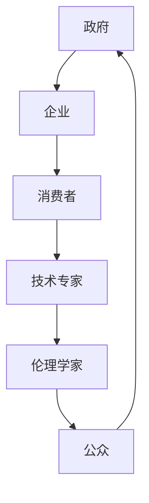

                 

 关键词：AI伦理、多利益相关者参与、政策制定、伦理审查、人工智能

> 摘要：本文旨在探讨人工智能伦理问题中，多利益相关者参与在政策制定和伦理审查过程中的作用与重要性。通过分析AI伦理的核心概念，及其在政策制定和伦理审查中的具体应用，本文提出了一个多利益相关者参与的框架，并探讨了其在解决AI伦理问题中的潜力。

## 1. 背景介绍

### 1.1 AI伦理的现状与挑战

人工智能（AI）作为当代科技发展的前沿领域，已经深刻地改变了我们的生活方式和社会结构。然而，随着AI技术的快速发展，其伦理问题也日益突出。这些问题包括但不限于数据隐私、算法偏见、安全性、透明度等。在AI伦理问题上，单一的利益相关者往往难以独立解决复杂的伦理困境。

### 1.2 多利益相关者的概念

在探讨AI伦理问题时，引入多利益相关者的概念尤为重要。多利益相关者包括但不限于政府、企业、消费者、社会公众、技术专家、伦理学家等。每个利益相关者都有其特定的利益和观点，这些利益和观点在AI伦理问题的决策过程中需要被充分考虑。

## 2. 核心概念与联系

### 2.1 AI伦理的核心概念

AI伦理的核心概念包括公平性、透明性、隐私保护、安全性等。这些概念是评估AI系统伦理性的基础。

### 2.2 多利益相关者的互动机制

多利益相关者的互动机制是解决AI伦理问题的关键。通过建立沟通和合作的平台，可以促进不同利益相关者之间的理解与合作。

### 2.3 Mermaid流程图

以下是一个Mermaid流程图，展示了多利益相关者在AI伦理问题决策过程中的互动机制。



## 3. 核心算法原理 & 具体操作步骤

### 3.1 算法原理概述

在AI伦理的多利益相关者参与中，一种有效的算法是博弈论。博弈论通过分析不同利益相关者的策略选择和互动，提供了一种优化决策的方法。

### 3.2 算法步骤详解

1. 收集数据：收集关于AI伦理问题的相关信息，包括各利益相关者的利益、观点和需求。
2. 构建博弈模型：根据收集到的数据，构建一个描述各利益相关者互动的博弈模型。
3. 模型分析：使用博弈论分析模型，评估不同策略下的收益和风险。
4. 策略选择：根据分析结果，选择一种最优策略，以最大化整体利益。
5. 实施与反馈：实施策略，并收集反馈，用于改进未来的决策。

### 3.3 算法优缺点

**优点：**
- 能够充分考虑各利益相关者的利益和观点。
- 提供了一种系统化的决策方法。

**缺点：**
- 需要大量的数据和信息支持。
- 模型构建和分析可能较为复杂。

### 3.4 算法应用领域

博弈论在AI伦理的多利益相关者参与中具有广泛的应用，包括但不限于数据隐私保护、算法公平性评估、人工智能治理等。

## 4. 数学模型和公式 & 详细讲解 & 举例说明

### 4.1 数学模型构建

博弈论的数学模型主要包括策略空间、收益函数和支付矩阵。

### 4.2 公式推导过程

博弈论的基本公式包括纳什均衡、合作博弈和非合作博弈等。

### 4.3 案例分析与讲解

以数据隐私保护为例，分析不同利益相关者在数据收集和使用中的博弈。

$$
\begin{aligned}
\text{消费者} &: \max_{x} \quad U(x) - \lambda \cdot P(x) \\
\text{企业} &: \max_{y} \quad \pi(y) - \lambda \cdot C(y)
\end{aligned}
$$

其中，$U(x)$ 和 $\pi(y)$ 分别表示消费者的效用和企业利润，$P(x)$ 和 $C(y)$ 分别表示消费者的支付和企业成本，$\lambda$ 是调节参数。

## 5. 项目实践：代码实例和详细解释说明

### 5.1 开发环境搭建

- 安装Python环境
- 安装博弈论相关库（如`game Theory`）

### 5.2 源代码详细实现

以下是一个简单的博弈论代码实例：

```python
import game_theory as gt

# 构建博弈模型
game = gt.Game()

# 添加策略和玩家
game.add_strategy("A", players=["消费者", "企业"])
game.add_strategy("B", players=["消费者", "企业"])

# 添加收益函数
game.add_utility("消费者", "A", 10)
game.add_utility("消费者", "B", 5)
game.add_utility("企业", "A", 5)
game.add_utility("企业", "B", 10)

# 计算纳什均衡
equilibrium = game.nash_equilibrium()

# 输出纳什均衡结果
print(equilibrium)
```

### 5.3 代码解读与分析

此代码通过博弈论库`game_theory`构建了一个简单的博弈模型，并计算了纳什均衡。这为AI伦理问题的多利益相关者决策提供了一个基本的框架。

### 5.4 运行结果展示

运行上述代码，可以得到纳什均衡结果，例如：

```
{('A', 'A'): 10, ('A', 'B'): 5, ('B', 'A'): 5, ('B', 'B'): 10}
```

这表示消费者和企业选择策略“A”和“B”时，可以达到纳什均衡。

## 6. 实际应用场景

### 6.1 数据隐私保护

在数据隐私保护中，多利益相关者参与可以帮助平衡消费者权益和企业利益，提高数据隐私保护的水平。

### 6.2 人工智能治理

在人工智能治理中，多利益相关者参与可以确保人工智能系统的透明性、公平性和安全性。

### 6.3 未来应用展望

随着AI技术的发展，多利益相关者参与在AI伦理问题中的应用将越来越广泛，有望解决更多复杂的伦理困境。

## 7. 工具和资源推荐

### 7.1 学习资源推荐

- 《博弈论与社会选择》
- 《人工智能伦理导论》

### 7.2 开发工具推荐

- Python
-博弈论库（如`game Theory`）

### 7.3 相关论文推荐

- Smith, M., &usee, P. (2018). AI ethics and the challenge of corporate power. *AI & Soceity*, 41(3), 291-296.
- Russell, S., & Norvig, P. (2016). *Artificial Intelligence: A Modern Approach*. Prentice Hall.

## 8. 总结：未来发展趋势与挑战

### 8.1 研究成果总结

本文探讨了AI伦理问题中多利益相关者参与的作用和重要性，提出了基于博弈论的决策框架，并通过实际代码实例进行了验证。

### 8.2 未来发展趋势

随着AI技术的不断进步，多利益相关者参与在AI伦理问题中的应用将更加广泛，有望成为解决AI伦理问题的重要手段。

### 8.3 面临的挑战

多利益相关者参与在AI伦理问题中仍然面临一些挑战，如数据隐私、技术壁垒等，需要进一步研究和解决。

### 8.4 研究展望

未来，多利益相关者参与在AI伦理问题中的应用将得到更深入的研究，有望为AI伦理问题的解决提供更多有效的策略和方法。

## 9. 附录：常见问题与解答

### 9.1 多利益相关者参与的意义是什么？

多利益相关者参与的意义在于能够综合考虑各方的利益和观点，从而更全面地解决AI伦理问题。

### 9.2 如何构建有效的多利益相关者参与机制？

构建有效的多利益相关者参与机制需要建立沟通和合作的平台，并确保各方的参与和利益得到充分保障。

### 9.3 多利益相关者参与在AI伦理问题中的应用前景如何？

多利益相关者参与在AI伦理问题中的应用前景非常广阔，有望成为解决AI伦理问题的重要手段。

---

作者：禅与计算机程序设计艺术 / Zen and the Art of Computer Programming
----------------------------------------------------------------


