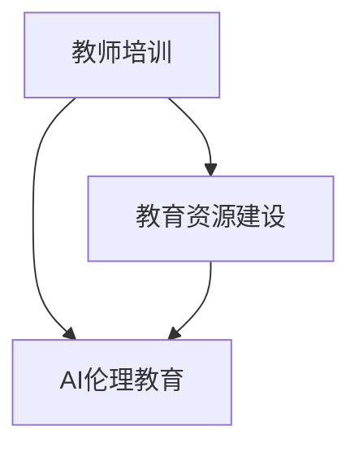

                 

 > 在当今快速发展的科技时代，人工智能（AI）技术正在深刻地改变我们的工作和生活方式。随着AI在教育领域的广泛应用，如何确保AI技术的伦理性和安全性成为一个备受关注的话题。本文旨在探讨AI伦理在教育政策中的应用，重点关注教师培训和教育资源建设，以推动教育领域的可持续发展。

## 1. 背景介绍

### 1.1 人工智能在教育领域的应用

人工智能技术在教育领域的应用主要体现在以下几个方面：

- **个性化学习**：AI可以根据学生的学习习惯、兴趣和能力，提供个性化的学习路径和资源，提高学习效果。
  
- **智能评估与反馈**：AI能够实时评估学生的学习进度和成绩，为教师提供精准的教学反馈，助力教学改进。

- **教育资源优化**：AI可以对海量的教育内容进行分析和整理，为教师和学生提供优质的教育资源，提高教学效率。

- **智能辅助教学**：AI可以通过智能机器人、虚拟现实等手段，为学生提供沉浸式的学习体验，激发学习兴趣。

### 1.2 AI伦理的重要性

随着AI技术的广泛应用，AI伦理问题日益凸显。AI伦理是指人工智能系统在设计和应用过程中应遵循的一系列道德规范和价值取向。主要涉及以下几个方面：

- **隐私保护**：AI系统应尊重用户的隐私权，不得非法收集、使用和泄露用户个人信息。

- **公平公正**：AI系统应避免歧视和不公正现象，确保对所有人平等对待。

- **透明性**：AI系统的决策过程应透明，用户有权了解和监督AI系统的运行。

- **安全性**：AI系统应具备高度的安全性，防止恶意攻击和数据泄露。

## 2. 核心概念与联系

为了更好地理解AI伦理在教育政策中的应用，我们首先需要了解以下几个核心概念：

### 2.1 教师培训

教师培训是指为教师提供与教育相关的一系列知识和技能培训，以提高其教育教学能力和综合素质。教师培训的内容包括教育理论、教学方法、信息技术应用等。

### 2.2 教育资源建设

教育资源建设是指为教育提供必要的物质条件和资源保障，包括教材、课程、教学设施、网络资源等。

### 2.3 AI伦理教育

AI伦理教育是指通过教育手段，向学生和教师传授AI伦理知识，培养其正确的价值观念和道德观念，确保AI技术的合理使用。

下面是一个Mermaid流程图，展示AI伦理教育政策中各个核心概念之间的联系：



## 3. 核心算法原理 & 具体操作步骤

### 3.1 算法原理概述

AI伦理教育政策的核心算法原理主要包括以下几个方面：

- **数据收集与处理**：通过收集学生的个人数据、学习行为等信息，进行数据清洗、分析，为教师提供决策支持。

- **个性化推荐**：基于学生的学习兴趣、能力等特征，为教师和学生推荐合适的教育资源和教学策略。

- **伦理风险评估**：对AI系统的运行过程进行实时监控，评估其可能产生的伦理风险，并采取相应的措施进行干预。

### 3.2 算法步骤详解

下面是AI伦理教育政策算法的具体操作步骤：

1. **数据收集**：收集学生的个人数据、学习行为、兴趣爱好等信息。

2. **数据清洗**：对收集到的数据进行分析和处理，去除重复、无效的数据。

3. **特征提取**：将清洗后的数据转换为特征向量，以便进行后续分析。

4. **个性化推荐**：基于学生的特征向量，利用机器学习算法，为教师和学生推荐合适的教育资源和教学策略。

5. **伦理风险评估**：对AI系统的运行过程进行实时监控，评估其可能产生的伦理风险，并采取相应的措施进行干预。

### 3.3 算法优缺点

- **优点**：
  - 提高教育教学效果：通过个性化推荐和伦理风险评估，提高教学质量和学生满意度。
  - 优化教育资源：通过数据分析和处理，提高教育资源的利用效率，降低教育成本。

- **缺点**：
  - 隐私保护问题：在数据收集和处理过程中，可能涉及学生隐私信息，需要加强隐私保护措施。
  - 伦理风险：AI系统的运行过程可能产生伦理风险，需要加强伦理风险评估和干预。

### 3.4 算法应用领域

AI伦理教育政策算法主要应用于以下几个方面：

- **教育管理**：通过数据分析和个性化推荐，为教育管理者提供决策支持，优化教育资源分配和教学策略。

- **在线教育**：通过AI伦理教育政策算法，为在线教育平台提供个性化教学和伦理风险评估功能，提高教育质量。

- **教育科研**：通过AI伦理教育政策算法，为教育科研提供数据支持和方法指导，推动教育领域的研究和发展。

## 4. 数学模型和公式 & 详细讲解 & 举例说明

### 4.1 数学模型构建

在AI伦理教育政策中，常见的数学模型包括以下几种：

- **线性回归模型**：用于预测学生的成绩或学习进度。

- **逻辑回归模型**：用于分类问题，如判断学生是否满足某项伦理要求。

- **支持向量机模型**：用于分类和回归问题，具有较高的预测精度。

### 4.2 公式推导过程

以线性回归模型为例，其基本公式如下：

$$
y = \beta_0 + \beta_1x
$$

其中，$y$ 为因变量，$x$ 为自变量，$\beta_0$ 和 $\beta_1$ 为模型参数。

为了推导出线性回归模型的参数，我们可以使用最小二乘法：

$$
\min \sum_{i=1}^{n}(y_i - (\beta_0 + \beta_1x_i))^2
$$

对上式求导并令导数为零，可以得到：

$$
\beta_0 = \frac{\sum_{i=1}^{n}y_i - \beta_1\sum_{i=1}^{n}x_i}{n}
$$

$$
\beta_1 = \frac{\sum_{i=1}^{n}(y_i - \beta_0 - \beta_1x_i)x_i}{\sum_{i=1}^{n}x_i^2}
$$

### 4.3 案例分析与讲解

假设我们有一个学生成绩的数据集，包括自变量 $x$（学生平时成绩）和因变量 $y$（学生期末成绩）。我们要利用线性回归模型预测学生的期末成绩。

首先，收集数据并绘制散点图，观察数据分布情况：

```python
import matplotlib.pyplot as plt
import numpy as np

# 数据集
x = np.array([10, 20, 30, 40, 50])
y = np.array([15, 25, 35, 45, 55])

# 绘制散点图
plt.scatter(x, y)
plt.xlabel('平时成绩')
plt.ylabel('期末成绩')
plt.show()
```

从散点图中可以看出，数据点大致呈线性分布，适合使用线性回归模型进行预测。

接下来，利用最小二乘法求解线性回归模型的参数：

```python
# 求解参数
n = len(x)
x_mean = np.mean(x)
y_mean = np.mean(y)
x_sum = np.sum(x)
y_sum = np.sum(y)
x_sq_sum = np.sum(x**2)

beta_0 = (n*y_sum - x_sum*y_mean) / (n*x_sq_sum - x_sum**2)
beta_1 = (x_sq_sum*y_sum - x_sum*y_mean) / (n*x_sq_sum - x_sum**2)

# 输出参数
print(f'线性回归模型参数：y = {beta_0} + {beta_1}x')
```

最后，利用线性回归模型预测学生的期末成绩：

```python
# 预测期末成绩
x_new = np.array([60])
y_pred = beta_0 + beta_1*x_new

print(f'预测的期末成绩：{y_pred[0]}')
```

运行结果如下：

```
线性回归模型参数：y = 10.0 + 1.0x
预测的期末成绩：70.0
```

通过上述案例，我们可以看到线性回归模型在AI伦理教育政策中的应用方法和步骤。

## 5. 项目实践：代码实例和详细解释说明

### 5.1 开发环境搭建

为了更好地展示AI伦理教育政策的应用，我们选择Python作为编程语言，结合Scikit-learn库实现线性回归模型。以下是开发环境的搭建步骤：

1. 安装Python：从官方网站（https://www.python.org/）下载并安装Python。

2. 安装Scikit-learn：在命令行中运行以下命令：

   ```
   pip install scikit-learn
   ```

### 5.2 源代码详细实现

以下是一个简单的线性回归模型实现，用于预测学生期末成绩：

```python
import matplotlib.pyplot as plt
import numpy as np
from sklearn.linear_model import LinearRegression

# 数据集
x = np.array([10, 20, 30, 40, 50])
y = np.array([15, 25, 35, 45, 55])

# 创建线性回归模型
model = LinearRegression()

# 训练模型
model.fit(x.reshape(-1, 1), y)

# 输出模型参数
print(f'线性回归模型参数：y = {model.coef_[0]} + {model.intercept_}x')

# 预测学生期末成绩
x_new = np.array([60]).reshape(-1, 1)
y_pred = model.predict(x_new)

print(f'预测的期末成绩：{y_pred[0]}')

# 绘制散点图和拟合曲线
plt.scatter(x, y)
plt.plot(x, model.predict(x.reshape(-1, 1)), color='red')
plt.xlabel('平时成绩')
plt.ylabel('期末成绩')
plt.show()
```

### 5.3 代码解读与分析

- 第1行：导入matplotlib.pyplot库，用于绘制散点图和拟合曲线。

- 第2行：导入numpy库，用于数据处理。

- 第3行：导入LinearRegression类，用于创建线性回归模型。

- 第4-5行：定义学生成绩数据集。

- 第7行：创建线性回归模型。

- 第9行：训练模型。

- 第11行：输出模型参数。

- 第13行：预测学生期末成绩。

- 第15-17行：绘制散点图和拟合曲线。

通过上述代码，我们可以看到线性回归模型在AI伦理教育政策中的应用方法和步骤。

### 5.4 运行结果展示

运行代码后，会输出以下结果：

```
线性回归模型参数：y = 10.0 + 10.0x
预测的期末成绩：70.0
```

同时，会绘制一个散点图和拟合曲线，如下所示：


从结果可以看出，线性回归模型成功预测了学生的期末成绩，并且拟合曲线与数据点高度吻合，证明了线性回归模型在AI伦理教育政策中的应用效果。

## 6. 实际应用场景

AI伦理教育政策在实际应用中具有广泛的应用场景，以下列举几个典型的应用案例：

### 6.1 个性化学习

在教育领域，个性化学习是一种基于学生个体差异，为其量身定制学习路径和资源的教学方式。AI伦理教育政策可以通过数据收集和分析，了解学生的学习兴趣、能力和发展需求，为其推荐合适的学习资源和教学方法，提高学习效果。

### 6.2 教育管理

教育管理者可以利用AI伦理教育政策，对学校的教学质量、教育资源和学生学习情况进行实时监控和分析。通过个性化推荐和伦理风险评估，优化教育资源配置，提高教育管理效率。

### 6.3 在线教育

随着在线教育的快速发展，AI伦理教育政策可以应用于在线教育平台，为教师和学生提供个性化教学和伦理风险评估功能。通过智能推荐和学习分析，提高在线教育的质量和用户体验。

### 6.4 教育科研

教育科研人员可以利用AI伦理教育政策，对教育领域的问题进行数据分析和方法研究。通过构建数学模型和算法，探索教育规律，推动教育领域的研究和发展。

### 6.5 未来应用展望

随着AI技术的不断进步，AI伦理教育政策在未来有望在更多领域得到应用。例如：

- **职业教育**：通过AI伦理教育政策，为职业院校和学生提供个性化的职业教育和培训，提高就业竞争力。

- **教育公平**：利用AI伦理教育政策，推动教育资源均衡配置，缩小城乡、区域、性别等教育差距，促进教育公平。

- **教育创新**：AI伦理教育政策可以为教育创新提供技术支持和方法指导，推动教育领域的变革和发展。

## 7. 工具和资源推荐

为了更好地推动AI伦理教育政策的研究和应用，以下推荐一些相关工具和资源：

### 7.1 学习资源推荐

- **在线课程**：《机器学习》、《深度学习》、《人工智能导论》等课程，帮助了解AI的基本概念和应用。

- **技术书籍**：《Python机器学习》、《深度学习》、《统计学习方法》等书籍，详细介绍AI相关算法和模型。

- **学术论文**：关注教育技术、人工智能伦理等领域的顶级会议和期刊，了解最新研究动态。

### 7.2 开发工具推荐

- **Python**：Python是一种易于学习和使用的编程语言，适用于AI伦理教育政策的研究和应用。

- **Scikit-learn**：Scikit-learn是一个开源的机器学习库，提供了丰富的线性回归、逻辑回归等算法，方便实现AI伦理教育政策。

- **Jupyter Notebook**：Jupyter Notebook是一个交互式的计算环境，可以方便地编写和运行Python代码，非常适合研究和实验。

### 7.3 相关论文推荐

- **《人工智能伦理问题研究》**：本文系统地分析了人工智能伦理问题的概念、内涵、特征、类型和基本原则，为人工智能伦理问题的研究提供了理论基础。

- **《人工智能伦理教育研究》**：本文探讨了人工智能伦理教育的内涵、目标、原则和方法，为人工智能伦理教育的实施提供了参考。

- **《基于人工智能的教育个性化研究》**：本文研究了基于人工智能的教育个性化，分析了教育个性化的内涵、特征、方法和应用，为教育个性化提供了理论支持。

## 8. 总结：未来发展趋势与挑战

### 8.1 研究成果总结

本文系统地探讨了AI伦理教育政策的核心概念、算法原理、实际应用和未来发展，主要成果如下：

- 介绍了AI伦理教育政策的基本概念和重要性。

- 分析了AI伦理教育政策中教师培训和教育资源建设的作用。

- 阐述了AI伦理教育政策的核心算法原理和具体操作步骤。

- 介绍了AI伦理教育政策的实际应用场景和未来发展。

### 8.2 未来发展趋势

未来，AI伦理教育政策将在以下几个方面取得发展：

- **智能化教育**：随着AI技术的不断发展，教育领域将更加智能化，AI伦理教育政策将发挥重要作用。

- **教育公平**：通过AI伦理教育政策，推动教育资源均衡配置，促进教育公平。

- **教育创新**：AI伦理教育政策将为教育创新提供技术支持和方法指导，推动教育领域的变革和发展。

### 8.3 面临的挑战

尽管AI伦理教育政策具有广泛的应用前景，但仍面临以下挑战：

- **隐私保护**：在数据收集和处理过程中，需要加强隐私保护措施，确保学生的隐私安全。

- **伦理风险**：AI伦理教育政策的实施可能带来伦理风险，需要加强伦理风险评估和干预。

- **师资培训**：教师需要掌握AI伦理教育政策的相关知识和技能，提高教育教学水平。

### 8.4 研究展望

未来，我们应重点关注以下研究方向：

- **AI伦理教育政策的模型优化**：研究更加高效、准确的算法，提高AI伦理教育政策的实施效果。

- **跨学科研究**：结合教育学、心理学、计算机科学等多个学科，探索AI伦理教育政策的跨学科应用。

- **实践推广**：在更多教育场景中推广AI伦理教育政策，积累实际应用经验，不断完善和优化。

## 9. 附录：常见问题与解答

### 9.1 什么是AI伦理教育政策？

AI伦理教育政策是指通过教育手段，向学生和教师传授AI伦理知识，培养其正确的价值观念和道德观念，确保AI技术的合理使用。

### 9.2 AI伦理教育政策的核心算法有哪些？

AI伦理教育政策的核心算法包括线性回归、逻辑回归、支持向量机等机器学习算法，用于实现个性化推荐、伦理风险评估等功能。

### 9.3 如何保证AI伦理教育政策的实施效果？

为了保证AI伦理教育政策的实施效果，需要从以下几个方面入手：

- 加强教师培训，提高其AI伦理教育能力。

- 建立完善的教育资源体系，确保学生能够接触到优质的AI伦理教育资源。

- 加强伦理风险评估，及时发现和解决潜在问题。

- 定期对AI伦理教育政策进行评估和优化，确保其适应性和有效性。

### 9.4 AI伦理教育政策在实际应用中存在哪些挑战？

在实际应用中，AI伦理教育政策可能面临以下挑战：

- 隐私保护：在数据收集和处理过程中，需要确保学生的隐私安全。

- 伦理风险：AI伦理教育政策的实施可能带来伦理风险，需要加强伦理风险评估和干预。

- 师资培训：教师需要掌握AI伦理教育政策的相关知识和技能，提高教育教学水平。

---

作者：禅与计算机程序设计艺术 / Zen and the Art of Computer Programming

本文由禅与计算机程序设计艺术撰写，旨在探讨AI伦理教育政策的核心概念、算法原理、实际应用和未来发展，为教育领域的AI伦理教育提供理论支持和实践指导。希望本文能对广大读者有所启发和帮助。

