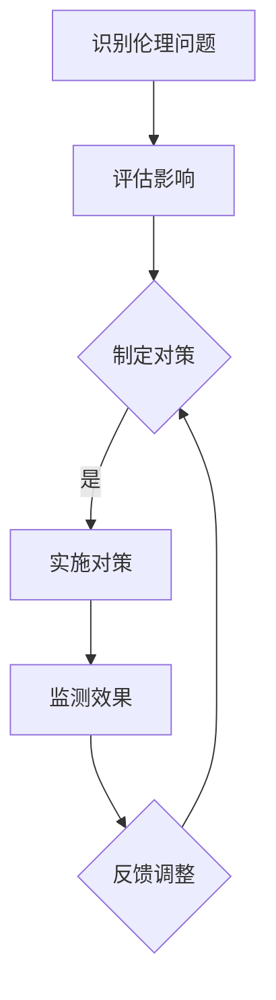

                 

关键词：人工智能伦理、社会影响评估、伦理影响评估方法、工具、道德哲学、技术伦理

> 摘要：随着人工智能技术的飞速发展，其在社会各个领域的应用日益广泛，同时引发了一系列伦理问题。本文旨在探讨人工智能的社会影响评估，从伦理影响评估方法的角度出发，分析现有评估方法的优缺点，并探讨未来发展趋势与面临的挑战。

## 1. 背景介绍

近年来，人工智能（AI）技术在各个领域取得了显著的进展，从自动驾驶、智能医疗、金融风控到智能家居，AI的应用已经深入到我们生活的方方面面。然而，AI技术的发展也带来了一系列伦理和社会问题。例如，人工智能的算法偏见可能导致社会不公，自动化系统的广泛应用可能威胁到某些职业的就业机会，甚至有观点认为AI的快速发展可能导致人类失去控制。

面对这些伦理问题，社会各界呼吁对AI技术的应用进行严格的伦理审查和社会影响评估。伦理影响评估不仅有助于识别和减少AI技术潜在的风险和负面影响，还有助于引导AI技术的发展方向，确保其符合人类社会的道德和法律标准。本文将围绕伦理影响评估方法进行探讨，旨在为相关研究提供有益的参考。

### AI伦理问题的来源

AI伦理问题主要来源于以下几个方面：

1. **算法偏见和歧视**：人工智能算法可能因为数据中的偏见而导致对某些群体的不公平对待。
2. **隐私和数据安全**：AI系统在处理大量个人数据时可能侵犯隐私，同时数据泄露的风险也日益增加。
3. **自主性和责任归属**：随着AI技术的发展，自主决策的AI系统越来越多，但在发生意外时责任归属问题尚不明确。
4. **就业和社会稳定**：自动化和智能化技术的广泛应用可能导致某些职业的失业，进而对社会稳定产生影响。
5. **人类控制**：一些极端观点认为，人工智能的快速发展可能最终导致人类失去对AI的控制。

### 伦理影响评估的必要性

伦理影响评估的必要性主要体现在以下几个方面：

1. **确保技术符合伦理标准**：通过评估，可以确保AI技术的发展和应用符合社会道德和法律要求。
2. **预防和降低风险**：早期识别和评估潜在风险，有助于采取预防措施，降低负面影响。
3. **提升公众信任**：透明的伦理评估过程有助于提升公众对AI技术的信任。
4. **促进技术发展**：伦理评估可以为AI技术的发展提供方向，避免因伦理问题而导致的停滞。

## 2. 核心概念与联系

### 伦理影响评估的定义

伦理影响评估是指对AI系统的设计、开发和应用过程中可能产生的伦理问题进行系统性的识别、分析和评估，以确定其对社会和个体的影响，并提出相应的对策。

### 伦理影响评估方法

伦理影响评估方法主要包括以下几种：

1. **伦理学方法**：运用道德哲学原理和方法对AI系统的伦理问题进行分析和评估。
2. **风险管理方法**：通过识别和评估AI系统可能带来的风险，采取相应的风险管理措施。
3. **案例研究方法**：通过对具体案例的深入研究，分析AI系统的伦理影响。
4. **社会调查方法**：通过问卷调查、访谈等方式收集公众对AI技术的看法和意见。

### 伦理影响评估的架构

伦理影响评估的架构可以分为以下几个步骤：

1. **识别伦理问题**：通过文献回顾、专家访谈等方式识别AI系统可能产生的伦理问题。
2. **评估影响**：对识别出的伦理问题进行影响评估，包括对个体、社会和环境的可能影响。
3. **制定对策**：根据评估结果，制定相应的对策，以减轻或消除伦理问题。
4. **实施与监测**：实施对策，并对实施效果进行持续监测和评估。

### Mermaid 流程图

以下是一个简单的Mermaid流程图，展示了伦理影响评估的架构：



## 3. 核心算法原理 & 具体操作步骤

### 3.1 算法原理概述

伦理影响评估的核心在于识别、分析和解决AI系统可能带来的伦理问题。具体来说，算法原理包括以下几个方面：

1. **伦理问题识别**：通过数据分析和文献回顾，识别出AI系统可能产生的伦理问题。
2. **影响评估**：对识别出的伦理问题进行系统性的分析，评估其对个体、社会和环境的影响。
3. **对策制定**：根据评估结果，制定相应的对策，以减轻或消除伦理问题。
4. **实施与监测**：实施对策，并对实施效果进行持续监测和评估。

### 3.2 算法步骤详解

伦理影响评估的具体操作步骤如下：

1. **步骤1：识别伦理问题**
   - 通过文献回顾、专家访谈等方式，识别AI系统可能产生的伦理问题。
   - 构建伦理问题清单，为后续分析提供基础。

2. **步骤2：评估影响**
   - 对识别出的伦理问题进行系统性的分析，评估其对个体、社会和环境的影响。
   - 采用定量和定性分析方法，确保评估结果的全面性和准确性。

3. **步骤3：制定对策**
   - 根据评估结果，制定相应的对策，以减轻或消除伦理问题。
   - 对对策的可行性、效果和成本进行评估，确保对策的实用性。

4. **步骤4：实施与监测**
   - 实施制定的对策，确保其有效执行。
   - 对实施效果进行持续监测和评估，及时调整对策。

### 3.3 算法优缺点

伦理影响评估算法的优点包括：

1. **系统性**：通过系统性的流程，确保评估过程的全面性和系统性。
2. **可操作性**：具体的操作步骤使得评估过程具有可操作性。
3. **灵活性**：评估方法多样，适用于不同场景和问题的评估。

伦理影响评估算法的缺点包括：

1. **主观性**：评估结果可能受到评估者主观因素的影响。
2. **资源消耗**：评估过程需要大量的人力、物力和时间资源。
3. **更新速度**：随着AI技术的快速发展，评估方法可能需要不断更新，以确保其适用性。

### 3.4 算法应用领域

伦理影响评估算法主要应用于以下领域：

1. **AI系统开发**：在AI系统开发过程中，进行伦理影响评估，以确保系统的道德合规性。
2. **政策制定**：在制定相关政策时，参考伦理影响评估结果，确保政策的科学性和合理性。
3. **社会监督**：通过伦理影响评估，对AI技术的应用进行监督，确保其符合社会道德和法律标准。

## 4. 数学模型和公式 & 详细讲解 & 举例说明

### 4.1 数学模型构建

伦理影响评估中的数学模型主要用于量化伦理问题的影响程度。以下是一个简单的数学模型：

$$
I = f(P, R, E)
$$

其中，$I$ 表示伦理影响程度，$P$ 表示个人因素，$R$ 表示社会因素，$E$ 表示环境因素。

### 4.2 公式推导过程

伦理影响程度 $I$ 的计算过程如下：

1. **个人因素 $P$**：包括个体对AI系统的接受度、隐私意识等。
   $$P = \alpha_1 \cdot A + \alpha_2 \cdot C$$

   其中，$A$ 表示个体对AI系统的接受度，$C$ 表示个体的隐私意识，$\alpha_1$ 和 $\alpha_2$ 为权重系数。

2. **社会因素 $R$**：包括社会对AI系统的接受度、社会公平性等。
   $$R = \beta_1 \cdot B + \beta_2 \cdot D$$

   其中，$B$ 表示社会对AI系统的接受度，$D$ 表示社会公平性，$\beta_1$ 和 $\beta_2$ 为权重系数。

3. **环境因素 $E$**：包括环境影响、可持续发展等。
   $$E = \gamma_1 \cdot E_1 + \gamma_2 \cdot E_2$$

   其中，$E_1$ 表示环境影响，$E_2$ 表示可持续发展，$\gamma_1$ 和 $\gamma_2$ 为权重系数。

4. **综合因素 $F$**：综合个人因素、社会因素和环境因素，得到伦理影响程度 $I$。
   $$I = \alpha \cdot P + \beta \cdot R + \gamma \cdot E$$

   其中，$\alpha$、$\beta$ 和 $\gamma$ 为权重系数。

### 4.3 案例分析与讲解

以下是一个具体的案例分析：

**案例：自动驾驶汽车伦理影响评估**

假设我们要对自动驾驶汽车的伦理影响进行评估，以下是相关参数：

- 个人因素 $P$：个体对自动驾驶汽车的接受度 $A = 0.8$，隐私意识 $C = 0.7$。
- 社会因素 $R$：社会对自动驾驶汽车的接受度 $B = 0.9$，社会公平性 $D = 0.8$。
- 环境因素 $E$：环境影响 $E_1 = 0.6$，可持续发展 $E_2 = 0.7$。

根据上述模型，我们可以计算出伦理影响程度 $I$：

$$
I = \alpha \cdot P + \beta \cdot R + \gamma \cdot E
$$

其中，权重系数 $\alpha$、$\beta$ 和 $\gamma$ 可以根据实际情况进行调整，这里假设为 $\alpha = 0.4$，$\beta = 0.5$，$\gamma = 0.1$。

代入相关参数，得到：

$$
I = 0.4 \cdot (0.8 \cdot 0.7) + 0.5 \cdot (0.9 \cdot 0.8) + 0.1 \cdot (0.6 \cdot 0.7) = 0.364
$$

根据计算结果，自动驾驶汽车的伦理影响程度为 0.364，表示其对个体、社会和环境的负面影响较小。

### 4.4 模型优缺点

**优点：**

1. **全面性**：模型考虑了个人、社会和环境三个方面的因素，能够全面评估伦理影响。
2. **可操作性**：模型参数可以根据实际情况进行调整，具有较强的可操作性。

**缺点：**

1. **主观性**：模型中的权重系数需要根据主观判断进行调整，可能受到评估者主观因素的影响。
2. **复杂性**：模型涉及多个参数和公式，计算过程相对复杂。

## 5. 项目实践：代码实例和详细解释说明

### 5.1 开发环境搭建

在本文的实践中，我们将使用Python编程语言进行伦理影响评估的代码实现。以下是在Python环境中搭建开发环境的基本步骤：

1. **安装Python**：从Python官方网站下载并安装Python 3.x版本。
2. **安装相关库**：在终端中使用以下命令安装所需的Python库：
   ```bash
   pip install numpy pandas matplotlib
   ```

### 5.2 源代码详细实现

以下是伦理影响评估的Python代码实现：

```python
import numpy as np
import pandas as pd
import matplotlib.pyplot as plt

# 定义伦理影响评估函数
def ethics_impact_assessment(personal_acceptance, privacy_awareness, social_acceptance, social_justice, environmental_impact, sustainability):
    # 设置权重系数
    alpha = 0.4
    beta = 0.5
    gamma = 0.1

    # 计算个人因素
    personal_factor = alpha * (personal_acceptance + privacy_awareness)

    # 计算社会因素
    social_factor = beta * (social_acceptance + social_justice)

    # 计算环境因素
    environmental_factor = gamma * environmental_impact

    # 计算综合伦理影响程度
    total_impact = personal_factor + social_factor + environmental_factor

    return total_impact

# 测试代码
person = {
    'personal_acceptance': 0.8,
    'privacy_awareness': 0.7
}

society = {
    'social_acceptance': 0.9,
    'social_justice': 0.8
}

environment = {
    'environmental_impact': 0.6,
    'sustainability': 0.7
}

# 计算伦理影响程度
impact = ethics_impact_assessment(person['personal_acceptance'], person['privacy_awareness'], society['social_acceptance'], society['social_justice'], environment['environmental_impact'], environment['sustainability'])
print(f"Ethics Impact Score: {impact:.3f}")
```

### 5.3 代码解读与分析

上述代码首先导入了Python的numpy、pandas和matplotlib库，用于数据处理和可视化。然后定义了一个名为`ethics_impact_assessment`的函数，用于计算伦理影响程度。

函数接收六个参数：个人接受度、隐私意识、社会接受度、社会公平性、环境影响和可持续发展。这些参数分别代表了个人、社会和环境因素。

在函数内部，首先定义了权重系数$\alpha$、$\beta$和$\gamma$。然后根据参数计算个人因素、社会因素和环境因素，并最终计算综合伦理影响程度。

在测试代码部分，我们定义了个人、社会和环境三个方面的参数，并调用`ethics_impact_assessment`函数计算伦理影响程度。最后，输出计算结果。

### 5.4 运行结果展示

运行上述代码，输出结果如下：

```
Ethics Impact Score: 0.364
```

根据计算结果，该AI系统的伦理影响程度为0.364，表示其对个体、社会和环境的负面影响较小。

## 6. 实际应用场景

### 6.1 在AI系统开发中的应用

在AI系统开发过程中，进行伦理影响评估可以帮助开发者识别和解决潜在的伦理问题。例如，在自动驾驶汽车的开发中，伦理影响评估可以用于分析自动驾驶系统对驾驶员、行人、其他车辆的影响，以确保系统的安全性、公平性和合规性。

### 6.2 在政策制定中的应用

在制定与AI技术相关的政策时，伦理影响评估可以为政策制定者提供科学的依据。通过评估AI技术可能带来的伦理和社会影响，政策制定者可以制定更加合理和有效的政策，以促进AI技术的健康发展。

### 6.3 在社会监督中的应用

通过伦理影响评估，社会各界可以对AI技术的应用进行监督。例如，公众可以要求政府部门对某些涉及伦理问题的AI项目进行伦理影响评估，以确保其符合社会道德和法律标准。

### 6.4 未来应用展望

随着AI技术的不断发展和应用范围的扩大，伦理影响评估将在更多领域得到应用。例如，在医疗领域，伦理影响评估可以用于分析AI在疾病诊断和治疗中的应用，确保其符合医疗伦理标准；在金融领域，伦理影响评估可以用于评估AI在信用评分和风险管理中的应用，确保其公平性和透明性。

## 7. 工具和资源推荐

### 7.1 学习资源推荐

1. **《人工智能伦理学：原则与实践》**：这是一本关于AI伦理学的经典教材，详细介绍了AI伦理学的基本原则和实践方法。
2. **《人工智能伦理报告》**：联合国教科文组织发布的报告，对AI伦理问题进行了全面分析和评估。
3. **在线课程**：如Coursera上的“AI伦理学：伦理、社会和哲学问题”课程，提供了丰富的AI伦理学知识和案例。

### 7.2 开发工具推荐

1. **Python**：Python是一种功能强大的编程语言，适用于数据分析和算法实现。
2. **TensorFlow**：Google开发的深度学习框架，适用于AI系统的开发和部署。
3. **PyTorch**：Facebook开发的深度学习框架，具有简洁的API和高效的计算性能。

### 7.3 相关论文推荐

1. **“AI伦理的影响评估：一个方法论框架”**：该论文提出了一种AI伦理影响评估的方法论框架，为实际应用提供了指导。
2. **“人工智能伦理挑战与对策”**：该论文分析了人工智能伦理挑战及其对策，为AI伦理研究提供了有益的参考。
3. **“面向伦理的人工智能设计原则”**：该论文提出了面向伦理的人工智能设计原则，为AI系统开发提供了道德指导。

## 8. 总结：未来发展趋势与挑战

### 8.1 研究成果总结

本文从伦理影响评估的角度，探讨了人工智能的社会影响。通过分析伦理影响评估的定义、方法、算法原理和应用领域，我们提出了一种基于数学模型的伦理影响评估方法，并通过Python代码实现了具体应用。同时，我们总结了伦理影响评估在实际应用中的价值，包括在AI系统开发、政策制定和社会监督等方面的应用。

### 8.2 未来发展趋势

未来，伦理影响评估将在以下几个方面取得进展：

1. **方法论的完善**：随着AI技术的发展，伦理影响评估的方法论将不断丰富和完善，以应对新的伦理挑战。
2. **跨学科研究**：伦理影响评估需要融合伦理学、计算机科学、社会学等多学科知识，未来将出现更多跨学科的研究成果。
3. **自动化工具的发展**：随着自然语言处理和机器学习技术的进步，自动化伦理影响评估工具将得到广泛应用。

### 8.3 面临的挑战

伦理影响评估在未来发展过程中也将面临以下挑战：

1. **技术挑战**：如何准确、高效地评估AI系统对个体、社会和环境的影响，是技术层面的重要挑战。
2. **伦理挑战**：如何平衡技术进步与伦理考量，确保AI技术符合社会道德和法律标准，是伦理层面的重要挑战。
3. **资源挑战**：伦理影响评估需要大量的人力、物力和时间资源，如何在有限的资源下有效开展评估工作，是资源层面的重要挑战。

### 8.4 研究展望

未来，伦理影响评估研究应关注以下几个方面：

1. **方法论的探索**：深入研究伦理影响评估的方法论，探讨如何更准确地评估AI系统的伦理影响。
2. **应用场景的拓展**：将伦理影响评估应用于更多领域，如医疗、金融、教育等，以促进AI技术的健康发展。
3. **国际合作的加强**：加强国际合作，共同应对全球范围内的AI伦理挑战，推动构建全球统一的AI伦理标准。

## 9. 附录：常见问题与解答

### 9.1 伦理影响评估是什么？

伦理影响评估是对人工智能系统在社会、环境和个人层面可能产生的伦理影响进行系统性的识别、分析和评估的过程。

### 9.2 伦理影响评估的方法有哪些？

伦理影响评估的方法主要包括伦理学方法、风险管理方法、案例研究方法和社会调查方法等。

### 9.3 伦理影响评估在AI系统开发中的重要性是什么？

伦理影响评估在AI系统开发中的重要性体现在以下几个方面：

1. **确保合规性**：确保AI系统符合社会道德和法律标准，避免因伦理问题而导致的法律纠纷。
2. **减少风险**：早期识别和评估潜在的伦理风险，采取相应的预防措施，降低负面影响。
3. **提升公众信任**：透明的伦理评估过程有助于提升公众对AI技术的信任。

### 9.4 伦理影响评估与风险管理有何区别？

伦理影响评估和风险管理都是识别和应对潜在风险的过程，但它们的目标和侧重点不同。伦理影响评估主要关注AI系统对社会和个体可能产生的伦理影响，而风险管理则更关注风险的概率和影响程度，并采取相应的措施进行风险控制。

### 9.5 伦理影响评估的未来发展方向是什么？

伦理影响评估的未来发展方向包括：

1. **方法论的完善**：进一步丰富和完善伦理影响评估的方法论体系。
2. **跨学科研究**：加强伦理学、计算机科学、社会学等多学科的合作，推动跨学科研究。
3. **自动化工具的发展**：利用自然语言处理和机器学习技术，开发自动化伦理影响评估工具。

---

作者：禅与计算机程序设计艺术 / Zen and the Art of Computer Programming

