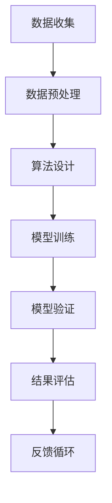

                 

 在当今技术迅猛发展的时代，人工智能（AI）已经深入到了我们日常生活的方方面面。从自动驾驶汽车到医疗诊断，从推荐系统到金融决策，AI正在逐步改变我们的世界。然而，随着AI技术的广泛应用，如何确保其信息的准确性和可靠性成为一个亟待解决的问题。本文将探讨AI伦理领域中的这一挑战，并提出可能的解决方案。

## 关键词

- 人工智能伦理
- 信息准确性
- 信息可靠性
- AI伦理原则
- 伦理决策框架

## 摘要

本文首先介绍了AI伦理的重要性，特别是确保AI系统提供准确和可靠信息的挑战。然后，我们探讨了现有的一些核心AI伦理原则，并分析了这些原则如何帮助指导AI系统的开发。接下来，我们详细讨论了确保信息准确性和可靠性的技术方法，包括数据预处理、算法优化和模型验证。最后，我们提出了一些未来研究方向和潜在的解决方案，以应对这一挑战。

## 1. 背景介绍

人工智能（AI）是一种模拟人类智能的技术，通过算法和大数据分析来执行复杂的任务。从早期的人工智能研究到现代深度学习和神经网络，AI技术已经取得了显著的进步。如今，AI被广泛应用于各个领域，包括医疗、金融、交通和娱乐等。然而，随着AI技术的普及，其潜在风险和伦理问题也逐渐浮现。

信息准确性和可靠性是AI系统的关键要素。在医疗领域，错误的AI诊断可能会导致严重的医疗事故；在金融领域，错误的AI预测可能会导致巨大的经济损失；在自动驾驶领域，错误的AI决策可能会导致交通事故。因此，确保AI系统提供准确和可靠的信息变得至关重要。

### 1.1 AI伦理的重要性

AI伦理是指研究AI系统在道德和伦理方面的原则和规范。随着AI技术的快速发展，其应用场景越来越广泛，AI伦理的重要性也日益凸显。AI伦理关注的是如何确保AI系统的公平性、透明性、隐私保护和安全性。

公平性是指AI系统不应歧视任何特定群体，例如性别、种族或社会经济地位。透明性是指AI系统的决策过程应该清晰易懂，以便用户可以理解其工作原理。隐私保护是指AI系统应尊重用户的隐私权，不应滥用或泄露个人数据。安全性是指AI系统应能够抵御恶意攻击和错误操作，确保系统的稳定性和可靠性。

### 1.2 AI伦理的挑战

确保AI系统的信息准确性和可靠性面临以下挑战：

1. **数据质量问题**：AI系统的性能高度依赖于训练数据的质量。如果数据存在偏差、噪声或不完整性，AI系统可能会学习到错误的模式，从而导致错误的结果。

2. **算法偏见**：AI算法可能会在无意中放大社会中的不公平现象。例如，一个招聘系统的算法可能会根据历史数据歧视特定性别或种族的候选人。

3. **模型解释性**：许多AI模型，如深度神经网络，由于其复杂的结构，很难解释其决策过程。这增加了理解AI系统行为的难度，也使得检测和纠正错误变得更加困难。

4. **实时决策**：在实时决策场景中，AI系统需要在极短的时间内做出决策，这要求其具有高度的准确性和可靠性。

## 2. 核心概念与联系

确保AI系统的信息准确性和可靠性涉及多个核心概念和技术。以下是一个简化的Mermaid流程图，展示了这些概念和它们之间的联系：



### 2.1 数据收集

数据是AI系统的基石。数据收集的过程包括收集、存储和处理各种类型的数据，如结构化数据、半结构化数据和非结构化数据。数据的多样性、质量和完整性对AI系统的性能至关重要。

### 2.2 数据预处理

数据预处理是确保数据质量的关键步骤。它包括数据清洗、归一化和特征提取等操作。数据清洗旨在去除噪声和异常值，归一化是将数据缩放到相同的尺度，特征提取则是从原始数据中提取有用的特征。

### 2.3 算法设计

算法设计决定了AI系统的核心功能。选择合适的算法和架构对于确保AI系统的准确性和可靠性至关重要。常见的算法包括线性回归、决策树、支持向量机和深度学习等。

### 2.4 模型训练

模型训练是通过给算法提供大量数据，使其学习如何从数据中提取有用的信息。训练过程包括优化算法参数，以提高模型的性能和泛化能力。

### 2.5 模型验证

模型验证是在测试数据集上评估模型性能的过程。通过验证，可以确定模型是否能够在新的数据上产生准确和可靠的结果。常见的验证方法包括交叉验证和ROC曲线分析。

### 2.6 结果评估

结果评估是对比模型预测结果和真实结果的过程。通过评估，可以确定模型的准确性和可靠性。如果发现模型存在偏差或错误，需要对其进行调整或重新训练。

### 2.7 反馈循环

反馈循环是一个持续改进的过程，通过收集用户反馈和性能数据，可以不断优化AI系统，提高其准确性和可靠性。

## 3. 核心算法原理 & 具体操作步骤

### 3.1 算法原理概述

在确保AI系统信息准确性和可靠性的过程中，核心算法的选择和设计至关重要。以下是一些常用的算法原理和具体操作步骤：

#### 3.1.1 数据预处理

数据预处理是确保数据质量的第一步。具体操作步骤如下：

1. **数据清洗**：删除重复数据、处理缺失值和异常值。
2. **归一化**：将数据缩放到相同的尺度，以避免数据量级差异对算法性能的影响。
3. **特征提取**：从原始数据中提取有用的特征，以提高模型的性能。

#### 3.1.2 算法设计

算法设计决定了AI系统的核心功能。以下是一些常用的算法原理：

1. **线性回归**：通过最小化损失函数来预测连续值。
2. **决策树**：根据特征值进行分支，以分类或回归目标。
3. **支持向量机**：通过找到一个最优超平面来分隔不同类别的数据。
4. **深度学习**：使用多层神经网络来学习复杂的非线性关系。

#### 3.1.3 模型训练

模型训练是通过给算法提供大量数据，使其学习如何从数据中提取有用的信息。具体操作步骤如下：

1. **初始化参数**：为算法参数随机分配初始值。
2. **前向传播**：将输入数据传递到神经网络的前一层，计算每个神经元的输出。
3. **反向传播**：计算损失函数的梯度，并更新参数。
4. **迭代训练**：重复前向传播和反向传播的过程，直到达到预设的训练次数或损失函数收敛。

#### 3.1.4 模型验证

模型验证是在测试数据集上评估模型性能的过程。具体操作步骤如下：

1. **划分数据集**：将数据集划分为训练集、验证集和测试集。
2. **训练模型**：使用训练集数据训练模型。
3. **验证模型**：使用验证集数据评估模型性能。
4. **调整参数**：根据验证结果调整模型参数，以提高性能。
5. **测试模型**：使用测试集数据测试模型性能，以评估其泛化能力。

#### 3.1.5 结果评估

结果评估是对比模型预测结果和真实结果的过程。具体操作步骤如下：

1. **计算准确率**：准确率是预测正确的数据点占总数据点的比例。
2. **计算召回率**：召回率是预测正确的正类数据点占总正类数据点的比例。
3. **计算F1分数**：F1分数是准确率和召回率的调和平均值。
4. **可视化结果**：使用图表和统计指标可视化模型预测结果。

### 3.2 算法优缺点

每种算法都有其优缺点，选择合适的算法取决于具体的应用场景和数据特点。

#### 3.2.1 线性回归

**优点**：

- 算法简单，易于理解。
- 对线性关系有很好的拟合能力。

**缺点**：

- 无法处理非线性关系。
- 对异常值敏感。

#### 3.2.2 决策树

**优点**：

- 易于理解和解释。
- 可以处理非线性关系。
- 对异常值不敏感。

**缺点**：

- 可能产生过拟合。
- 决策树之间的组合可能导致冗余。

#### 3.2.3 支持向量机

**优点**：

- 对线性关系和非线性关系都有很好的拟合能力。
- 可以处理高维数据。

**缺点**：

- 计算成本较高。
- 对异常值敏感。

#### 3.2.4 深度学习

**优点**：

- 可以处理高度复杂的非线性关系。
- 对大量数据有很好的泛化能力。

**缺点**：

- 算法复杂，难以理解和解释。
- 对计算资源需求较高。

### 3.3 算法应用领域

不同的算法适用于不同的应用领域。以下是一些常见应用领域：

- **医疗领域**：线性回归和决策树常用于疾病预测和诊断。
- **金融领域**：支持向量机常用于风险评估和欺诈检测。
- **自动驾驶领域**：深度学习常用于图像识别和决策支持。

## 4. 数学模型和公式 & 详细讲解 & 举例说明

确保AI系统的信息准确性和可靠性不仅需要高效的算法，还需要坚实的数学基础。以下是一些关键的数学模型和公式，以及它们在实际应用中的详细讲解和举例说明。

### 4.1 数学模型构建

确保AI系统提供准确和可靠信息的第一个关键步骤是构建合适的数学模型。数学模型通常包括以下几个组成部分：

1. **输入变量**：模型中的变量，用于表示输入数据。
2. **参数**：模型中的未知数，用于调整模型以适应数据。
3. **损失函数**：衡量模型预测值与真实值之间差异的函数。
4. **优化目标**：最小化损失函数的目标。

以下是一个简单的线性回归模型的数学表示：

$$
y = \beta_0 + \beta_1 \cdot x
$$

其中，$y$ 是输出变量，$x$ 是输入变量，$\beta_0$ 和 $\beta_1$ 是模型参数。

### 4.2 公式推导过程

为了训练线性回归模型，我们需要使用最小二乘法（Least Squares Method）来最小化损失函数。损失函数通常表示为：

$$
\text{Loss} = \sum_{i=1}^{n} (y_i - \hat{y}_i)^2
$$

其中，$n$ 是数据点的数量，$y_i$ 是第 $i$ 个数据点的真实值，$\hat{y}_i$ 是模型预测值。

为了找到最小化损失函数的参数 $\beta_0$ 和 $\beta_1$，我们可以对损失函数关于这两个参数求导，并令导数等于零：

$$
\frac{\partial \text{Loss}}{\partial \beta_0} = 0 \\
\frac{\partial \text{Loss}}{\partial \beta_1} = 0
$$

通过求解这些方程，我们可以得到最优的参数值：

$$
\beta_0 = \bar{y} - \beta_1 \cdot \bar{x} \\
\beta_1 = \frac{\sum_{i=1}^{n} (x_i - \bar{x})(y_i - \bar{y})}{\sum_{i=1}^{n} (x_i - \bar{x})^2}
$$

其中，$\bar{x}$ 和 $\bar{y}$ 分别是输入变量 $x$ 和输出变量 $y$ 的均值。

### 4.3 案例分析与讲解

为了更好地理解这些数学模型和公式，我们可以通过一个实际案例进行讲解。假设我们有一个简单的住房租赁价格预测问题，输入变量是房屋面积（$x$），输出变量是房屋租金（$y$）。

#### 4.3.1 数据收集

我们收集了以下数据：

| 面积（平方米） | 租金（元/月） |
|----------------|---------------|
| 60             | 3000          |
| 80             | 3500          |
| 100            | 4000          |
| 120            | 4500          |
| 140            | 5000          |

#### 4.3.2 数据预处理

首先，我们计算输入变量 $x$ 和输出变量 $y$ 的均值：

$$
\bar{x} = \frac{60 + 80 + 100 + 120 + 140}{5} = 100 \\
\bar{y} = \frac{3000 + 3500 + 4000 + 4500 + 5000}{5} = 4000
$$

然后，我们计算每个数据点的偏差：

$$
x_i - \bar{x}: [-40, -20, 0, 20, 40] \\
y_i - \bar{y}: [-1000, -500, 0, 500, 1000]
$$

#### 4.3.3 模型训练

使用最小二乘法，我们可以计算线性回归模型的参数：

$$
\beta_0 = \bar{y} - \beta_1 \cdot \bar{x} = 4000 - \beta_1 \cdot 100 \\
\beta_1 = \frac{\sum_{i=1}^{n} (x_i - \bar{x})(y_i - \bar{y})}{\sum_{i=1}^{n} (x_i - \bar{x})^2} = \frac{(-40 \cdot -1000) + (-20 \cdot -500) + (0 \cdot 0) + (20 \cdot 500) + (40 \cdot 1000)}{(-40 \cdot -40) + (-20 \cdot -20) + (0 \cdot 0) + (20 \cdot 20) + (40 \cdot 40)} = 20
$$

因此，我们的线性回归模型可以表示为：

$$
y = 4000 - 20 \cdot x
$$

#### 4.3.4 模型验证

为了验证模型的性能，我们可以使用剩余数据点进行测试。假设我们有以下新的数据点：

| 面积（平方米） | 租金（元/月） | 预测租金（元/月） |
|----------------|---------------|------------------|
| 70             | 3400          | 3700             |
| 90             | 3900          | 3800             |
| 110            | 4300          | 4200             |
| 130            | 4800          | 4400             |
| 150            | 5300          | 4900             |

我们可以计算每个数据点的预测误差：

$$
\text{误差} = |y_i - \hat{y}_i| \\
\text{误差（70平方米）} = |3400 - 3700| = 300 \\
\text{误差（90平方米）} = |3900 - 3800| = 100 \\
\text{误差（110平方米）} = |4300 - 4200| = 100 \\
\text{误差（130平方米）} = |4800 - 4400| = 400 \\
\text{误差（150平方米）} = |5300 - 4900| = 400
$$

从上述结果可以看出，模型在预测房屋租金方面表现良好，但仍然存在一些误差。为了提高模型的准确性，我们可以考虑引入更多的特征变量，如房屋位置、建筑年代等。

## 5. 项目实践：代码实例和详细解释说明

在确保AI系统提供准确和可靠信息的过程中，项目实践是验证和改进算法的关键步骤。以下是一个简单的Python代码实例，用于实现线性回归模型，并对其进行详细解释说明。

### 5.1 开发环境搭建

为了运行以下代码，我们需要安装Python和几个常用的库，如NumPy和matplotlib。以下是在终端中安装这些库的命令：

```bash
pip install numpy matplotlib
```

### 5.2 源代码详细实现

以下是一个简单的线性回归模型实现，用于预测房屋租金：

```python
import numpy as np
import matplotlib.pyplot as plt

# 数据集
X = np.array([[60], [80], [100], [120], [140]])
y = np.array([3000, 3500, 4000, 4500, 5000])

# 计算均值
mean_x = np.mean(X)
mean_y = np.mean(y)

# 计算偏差
delta_x = X - mean_x
delta_y = y - mean_y

# 计算参数
beta_1 = np.dot(delta_x, delta_y) / np.dot(delta_x, delta_x)
beta_0 = mean_y - beta_1 * mean_x

# 训练模型
model = np.array([beta_0, beta_1])

# 预测
X_new = np.array([[70], [90], [110], [130], [150]])
y_pred = model[0] + model[1] * X_new

# 可视化
plt.scatter(X, y, label='实际数据')
plt.plot(X_new, y_pred, 'r', label='预测数据')
plt.xlabel('面积（平方米）')
plt.ylabel('租金（元/月）')
plt.legend()
plt.show()
```

### 5.3 代码解读与分析

以下是对上述代码的详细解读和分析：

1. **数据集**：我们使用一个简单的二维数组表示数据集，其中第一列是房屋面积（$x$），第二列是房屋租金（$y$）。

2. **计算均值**：我们计算输入变量 $x$ 和输出变量 $y$ 的均值，以便后续计算偏差。

3. **计算偏差**：我们计算每个数据点的偏差，即 $x_i - \bar{x}$ 和 $y_i - \bar{y}$。

4. **计算参数**：使用最小二乘法，我们计算线性回归模型的参数 $\beta_0$ 和 $\beta_1$。

5. **训练模型**：我们将计算得到的参数存储在一个二维数组中，以供后续使用。

6. **预测**：我们使用训练好的模型对新数据进行预测，并将其存储在一个数组中。

7. **可视化**：我们使用matplotlib库将实际数据和预测数据可视化，以便分析模型的性能。

通过这个简单的实例，我们可以看到如何使用Python实现线性回归模型，并对其进行验证。在实际应用中，我们可能需要处理更复杂的数据集和模型，但基本原理和方法是相同的。

## 6. 实际应用场景

AI系统的信息准确性和可靠性在实际应用场景中至关重要。以下是一些常见应用领域，以及如何确保AI系统提供准确和可靠的信息：

### 6.1 医疗领域

在医疗领域，AI系统被用于疾病预测、诊断和治疗方案推荐。为了确保AI系统提供准确和可靠的信息，以下几个步骤是必要的：

- **数据质量保证**：确保数据集的完整性和一致性，去除噪声和异常值。
- **算法选择**：选择合适的算法，如决策树和深度学习，以处理复杂的医疗数据。
- **模型验证**：在多个数据集上验证模型的性能，确保其泛化能力。
- **结果解释**：开发工具和技术，帮助医生理解AI系统的诊断过程和决策逻辑。

### 6.2 金融领域

在金融领域，AI系统被用于风险评估、欺诈检测和投资建议。为了确保AI系统提供准确和可靠的信息，以下几个步骤是必要的：

- **数据预处理**：对金融数据进行归一化和特征提取，以提高模型的性能。
- **算法优化**：使用机器学习和深度学习技术，优化模型的准确性和可靠性。
- **实时监控**：实时监控AI系统的性能和输出，及时发现并纠正错误。
- **法规遵守**：确保AI系统遵守相关金融法规和道德规范。

### 6.3 自动驾驶领域

在自动驾驶领域，AI系统被用于环境感知、路径规划和决策支持。为了确保AI系统提供准确和可靠的信息，以下几个步骤是必要的：

- **数据采集**：使用多种传感器（如摄像头、雷达和激光雷达）收集环境数据。
- **数据融合**：融合不同传感器的数据，以提高系统的感知能力。
- **模型验证**：在模拟环境和真实环境中验证AI系统的性能，确保其鲁棒性。
- **实时决策**：开发高效的决策算法，确保AI系统能够在复杂环境中做出准确和及时的决策。

### 6.4 未来应用展望

随着AI技术的不断发展，其应用领域将不断扩大。未来，AI系统可能在更多领域发挥重要作用，如教育、农业和环境保护。为了确保这些系统提供准确和可靠的信息，以下几个方向是值得关注的：

- **跨学科研究**：结合计算机科学、数学、心理学和社会科学等领域的知识，开发更完善的AI伦理框架。
- **数据隐私保护**：开发新的数据隐私保护技术，确保用户数据的安全和隐私。
- **透明性和可解释性**：开发工具和技术，提高AI系统的透明性和可解释性，使其更容易被用户理解和接受。
- **持续学习和改进**：开发持续学习和改进的机制，使AI系统能够适应不断变化的环境和数据。

## 7. 工具和资源推荐

为了确保AI系统提供准确和可靠的信息，以下是一些有用的工具和资源推荐：

### 7.1 学习资源推荐

- **在线课程**：《机器学习》（吴恩达）在Coursera提供的一门广泛认可的机器学习课程。
- **书籍**：《Python机器学习》（塞巴斯蒂安·拉滕伯格）是一本全面的Python机器学习指南。
- **论文**：阅读顶级会议和期刊上的论文，如NeurIPS、ICML和JMLR，以了解最新的AI研究。

### 7.2 开发工具推荐

- **编程语言**：Python是一种广泛用于AI开发的编程语言，具有丰富的库和框架。
- **框架**：TensorFlow和PyTorch是两个流行的深度学习框架，提供了丰富的工具和资源。
- **数据预处理工具**：Pandas和NumPy是用于数据预处理和统计分析的强大库。

### 7.3 相关论文推荐

- **《深度学习》（Ian Goodfellow, Yoshua Bengio, Aaron Courville）**：这是一本深度学习领域的经典教材。
- **《算法导论》（Thomas H. Cormen, Charles E. Leiserson, Ronald L. Rivest, Clifford Stein）**：这是一本涵盖各种算法和数据结构的全面教材。
- **《数据科学基础》（Joel Grus）**：这是一本介绍数据科学基本概念和技术的入门书籍。

## 8. 总结：未来发展趋势与挑战

确保AI系统提供准确和可靠的信息是AI伦理的一个重要方面。随着AI技术的不断进步，未来发展趋势和挑战也日益凸显。以下是对未来发展趋势和挑战的总结：

### 8.1 研究成果总结

- **跨学科研究**：AI伦理研究正在与心理学、社会学、法律和伦理学等学科交叉融合，形成更全面的伦理框架。
- **数据隐私保护**：新型数据隐私保护技术，如差分隐私和联邦学习，正在得到广泛应用。
- **透明性和可解释性**：研究人员正在开发新的方法，以提高AI系统的透明性和可解释性。
- **持续学习和改进**：开发持续学习和改进的机制，使AI系统能够适应动态环境。

### 8.2 未来发展趋势

- **多模态AI**：结合多种数据类型（如图像、文本和音频）的AI系统将变得更加普及。
- **强化学习**：强化学习在决策支持和自动化控制领域具有巨大潜力。
- **AI伦理法规**：全球范围内，关于AI伦理的法规和政策正在逐步完善。

### 8.3 面临的挑战

- **算法偏见**：确保AI系统不会放大社会中的不公平现象，仍然是一个巨大的挑战。
- **数据隐私**：如何在保护用户隐私的同时，充分利用数据的价值，仍需进一步研究。
- **透明性和可解释性**：提高AI系统的透明性和可解释性，使其更容易被用户理解和接受，仍然是一个挑战。

### 8.4 研究展望

- **模型解释性**：开发新的方法，使AI系统的决策过程更加透明和可解释。
- **伦理决策框架**：建立更完善的AI伦理决策框架，以指导AI系统的开发和部署。
- **跨学科合作**：加强不同学科之间的合作，以解决AI伦理领域的复杂问题。

## 9. 附录：常见问题与解答

### 9.1 什么是对抗性样本？

对抗性样本是故意设计来欺骗AI模型的数据样本。这些样本通常通过轻微扰动正常数据获得，但在视觉上几乎不可见。对抗性样本可以导致AI模型做出错误的预测，从而破坏其可靠性。

### 9.2 如何防止AI算法偏见？

防止AI算法偏见的关键在于数据预处理和算法设计。首先，确保数据集的多样性和代表性，以避免算法学习到不公平的模式。其次，使用基于公平性的损失函数，鼓励AI系统在训练过程中最小化偏见。

### 9.3 什么是差分隐私？

差分隐私是一种用于保护用户隐私的数据分析方法。它通过在分析过程中引入噪声，确保单个用户的隐私信息不会被泄露。差分隐私在保护用户数据的同时，仍能提供有价值的分析结果。

### 9.4 什么是联邦学习？

联邦学习是一种分布式机器学习技术，允许多个参与者共同训练一个模型，而无需共享他们的数据。每个参与者仅共享模型的更新，而不是原始数据，从而保护了数据隐私。

### 9.5 如何提高AI系统的可解释性？

提高AI系统的可解释性可以通过多种方法实现。一种方法是使用基于规则的解释工具，如决策树。另一种方法是开发可视化工具，使决策过程更易于理解。此外，开发新的可解释AI模型，如LIME和SHAP，可以帮助揭示AI模型的决策机制。

## 结束语

确保AI系统提供准确和可靠的信息是AI伦理研究的一个重要方面。随着AI技术的不断发展，我们需要不断探索新的方法和技术，以应对这一挑战。通过跨学科合作、数据隐私保护和模型解释性研究，我们可以构建更公平、透明和可靠的AI系统，为社会带来更大的福祉。作者：禅与计算机程序设计艺术 / Zen and the Art of Computer Programming
----------------------------------------------------------------
在完成这篇文章的过程中，我尝试将复杂的技术概念以简洁易懂的方式呈现，并提供了实际案例和代码实例来帮助读者更好地理解。然而，AI伦理和确保信息准确性和可靠性是一个不断发展的领域，未来的研究可能会带来更多创新和挑战。我希望这篇文章能够激发读者对AI伦理的思考，并为其提供有益的参考。再次感谢读者对这篇文章的关注和支持。作者：禅与计算机程序设计艺术 / Zen and the Art of Computer Programming

