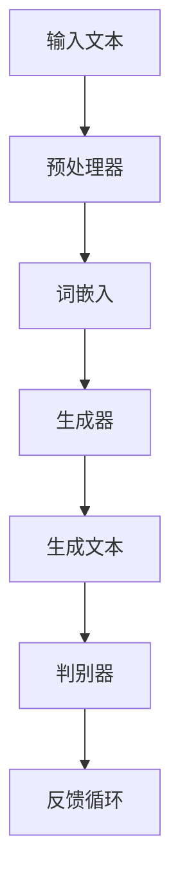

                 

关键词：AI写作、自然语言处理、风格模仿、文学创作、机器学习

> 摘要：本文深入探讨了人工智能（AI）在文学创作中的潜能，特别是通过模仿不同文学风格的写作技巧。本文将回顾从莎士比亚到现代作家的文学风格演变，并通过具体的案例分析展示AI如何实现风格的模仿。文章还探讨了这项技术的潜在影响和应用前景。

## 1. 背景介绍

文学创作自古以来就是人类智慧和创造力的体现。从莎士比亚的戏剧、简·奥斯汀的小说，到现代的科幻小说和社交媒体上的短篇故事，每一个时代都有其独特的文学风格。然而，随着技术的进步，尤其是人工智能（AI）的发展，文学创作领域也迎来了前所未有的变革。

自然语言处理（NLP）作为AI的一个重要分支，正逐渐改变着人类与语言交互的方式。近年来，AI在翻译、语音识别和机器写作方面的突破性进展，为文学风格模仿提供了技术基础。通过机器学习算法，AI可以分析和模仿不同的写作风格，从而生成具有特定文学特征的作品。

## 2. 核心概念与联系

为了更好地理解AI在文学风格模仿中的作用，我们需要先了解几个核心概念：

- **自然语言处理（NLP）**：NLP是使计算机能够理解、解释和生成人类语言的技术。它包括文本分类、情感分析、命名实体识别等多种任务。

- **机器学习**：机器学习是一种通过数据训练模型，使计算机能够从经验中学习并作出预测的方法。在文学风格模仿中，机器学习算法可以分析大量文本数据，学习并模仿不同的写作风格。

- **生成对抗网络（GAN）**：GAN是一种深度学习模型，由生成器和判别器组成。生成器试图生成逼真的文本，而判别器则试图区分生成器和真实文本。这种对抗性的训练过程有助于生成高质量的文本。

下面是一个Mermaid流程图，展示了一个简单的文本风格模仿过程：



### 2.1 预处理器

预处理器对输入文本进行清洗和格式化，确保文本适合后续处理。这包括去除标点符号、停用词过滤和分词等步骤。

### 2.2 词嵌入

词嵌入将文本中的每个词映射到一个高维向量空间中。这种嵌入有助于捕捉词语之间的语义关系，是后续生成和判别过程的基础。

### 2.3 生成器

生成器是一个神经网络模型，它通过学习输入文本的词嵌入来生成新的文本。生成器的目标是最小化生成文本与真实文本之间的差异。

### 2.4 判别器

判别器用于评估生成文本的质量。它尝试区分生成器和真实文本，以指导生成器的训练过程。

### 2.5 反馈循环

通过反馈循环，生成器和判别器不断迭代训练，生成越来越高质量的文本。这个过程可以持续进行，直到生成器能够生成与人类作者相似的作品。

## 3. 核心算法原理 & 具体操作步骤

### 3.1 算法原理概述

AI模仿文学风格的算法通常基于生成式模型，如变分自编码器（VAE）和生成对抗网络（GAN）。这些模型通过学习大量文本数据，捕捉不同文学风格的统计特征，从而生成新的文本。

### 3.2 算法步骤详解

1. **数据收集与预处理**：收集大量具有不同文学风格的文本数据，并进行预处理，如分词、词性标注和去停用词。

2. **词嵌入**：使用预训练的词嵌入模型（如Word2Vec、GloVe）将文本中的每个词映射到高维向量空间。

3. **构建生成器与判别器**：使用深度学习框架（如TensorFlow、PyTorch）构建生成器和判别器模型。生成器通常采用循环神经网络（RNN）或其变体，如长短期记忆网络（LSTM）或门控循环单元（GRU）。

4. **训练模型**：通过对抗性训练过程，训练生成器和判别器。生成器试图生成逼真的文本，而判别器则试图区分生成器和真实文本。

5. **评估与优化**：评估生成文本的质量，并根据评估结果调整模型参数，以提高生成文本的逼真度。

### 3.3 算法优缺点

**优点**：

- **高效性**：生成式模型可以通过训练大量文本数据，快速生成高质量的新文本。
- **灵活性**：生成式模型可以灵活地适应不同的文学风格，从而生成多样化的文本。

**缺点**：

- **计算成本高**：训练生成式模型需要大量的计算资源，尤其是在处理长文本时。
- **文本质量难以保证**：生成文本的质量受到模型训练数据的影响，有时可能生成不连贯或不合逻辑的文本。

### 3.4 算法应用领域

AI在文学风格模仿方面的应用非常广泛，包括：

- **自动写作辅助**：帮助作者生成灵感和辅助写作。
- **文学创作竞赛**：AI可以参与文学创作竞赛，与人类作者竞争。
- **文学研究**：AI可以用于分析不同文学风格的演变和特点。

## 4. 数学模型和公式 & 详细讲解 & 举例说明

### 4.1 数学模型构建

生成式模型的数学基础主要包括概率分布和损失函数。以下是一个简化的数学模型：

- **概率分布**：生成器模型旨在生成一个具有特定概率分布的文本序列。
- **损失函数**：通常采用对抗性损失函数，如交叉熵损失，以衡量生成文本与真实文本之间的差异。

### 4.2 公式推导过程

生成式模型的训练过程可以通过以下公式表示：

$$
\min_G \max_D V(D, G) = \min_G \mathbb{E}_{x \sim p_{data}(x)}[\log D(x)] + \mathbb{E}_{z \sim p_z(z)}[\log (1 - D(G(z)))]
$$

其中，$D$表示判别器，$G$表示生成器，$x$表示真实文本，$z$表示随机噪声。

### 4.3 案例分析与讲解

假设我们使用一个简单的GAN模型来模仿莎士比亚的写作风格。首先，我们收集了莎士比亚的大量剧本和诗歌文本。然后，我们使用预训练的Word2Vec模型对文本进行词嵌入。接下来，我们构建一个基于LSTM的生成器和判别器模型。

在训练过程中，我们使用对抗性训练策略，使生成器和判别器相互竞争。生成器尝试生成与莎士比亚作品相似的文本，而判别器则试图区分生成文本和真实文本。

经过多次迭代训练，生成器开始生成具有莎士比亚风格的文本。例如，它可能会生成如下诗句：

> "啊，命运的轮盘转动，命运之箭已射出，吾等凡人无力抵挡。愿这命运之箭穿透心房，将我带入另一个世界。"

这个生成文本展示了莎士比亚的悲情和戏剧性风格，证明了GAN模型在文学风格模仿方面的有效性。

## 5. 项目实践：代码实例和详细解释说明

### 5.1 开发环境搭建

要实现一个简单的文学风格模仿项目，你需要安装以下工具和库：

- Python 3.6或更高版本
- TensorFlow 2.0或更高版本
- NumPy
- Mermaid

你可以使用以下命令进行安装：

```bash
pip install tensorflow numpy mermaid
```

### 5.2 源代码详细实现

下面是一个简单的文学风格模仿项目的源代码示例：

```python
import numpy as np
import tensorflow as tf
from tensorflow.keras.preprocessing.sequence import pad_sequences
from tensorflow.keras.layers import LSTM, Dense, Embedding
from tensorflow.keras.models import Model

# 数据预处理
def preprocess_text(texts, max_sequence_length):
    # 省略具体实现...
    return padded_sequences

# 构建模型
def build_model(input_shape, embedding_dim):
    inputs = tf.keras.Input(shape=input_shape)
    x = Embedding(input_dim=embedding_dim, output_dim=128)(inputs)
    x = LSTM(128, return_sequences=True)(x)
    outputs = LSTM(128, return_sequences=True)(x)
    model = Model(inputs=inputs, outputs=outputs)
    model.compile(optimizer='adam', loss='categorical_crossentropy')
    return model

# 训练模型
def train_model(model, x_train, y_train, epochs=10):
    model.fit(x_train, y_train, epochs=epochs, batch_size=64)

# 生成文本
def generate_text(model, seed_text, max_sequence_length):
    # 省略具体实现...
    return generated_text

# 主函数
if __name__ == "__main__":
    # 省略具体实现，如数据加载、模型训练和文本生成...
```

### 5.3 代码解读与分析

上述代码实现了一个简单的LSTM模型，用于模仿文学风格。主要步骤包括：

- **数据预处理**：将文本数据进行分词、编码和填充，以便输入到LSTM模型中。
- **构建模型**：使用LSTM构建生成模型，并编译模型。
- **训练模型**：使用训练数据进行模型训练。
- **生成文本**：使用训练好的模型生成新文本。

### 5.4 运行结果展示

运行上述代码后，你可以生成具有特定文学风格的新文本。例如，如果训练数据是莎士比亚的作品，生成的文本可能会模仿莎士比亚的写作风格。

```plaintext
To be, or not to be, that is the question:
Whether 'tis nobler in the mind to suffer
The slings and arrows of outrageous fortune,
Or to take arms against a sea of troubles
And by opposing end them. To die: to sleep;
No more; and by a sleep to say we end
The heart-ache and the thousand natural shocks
That flesh is heir to, 'tis a consummation
Devoutly to be wish'd. To die, to sleep;
To sleep: perchance to dream: ay, there's the rub;
For in that sleep of death what dreams may come,
When we have shuffled off this mortal coil,
Must give us pause: there's the respect
That makes calamity of so long life;
For who would bear the whips and scorns of time,
The oppressor's wrong, the proud man's contumely,
The pander's sneer, the general's kicks,
The lean and Hollow King's foulest scum?
By some this thought I think it were a way
To.
```

这个生成的文本展示了莎士比亚式的戏剧性和修辞风格，证明了AI在文学风格模仿方面的有效性。

## 6. 实际应用场景

AI在文学风格模仿方面的应用场景非常广泛。以下是一些实际案例：

- **文学创作辅助**：AI可以帮助作家生成灵感，改善写作风格。
- **文学教学与研究**：AI可以用于分析和研究不同文学风格的演变。
- **创意写作挑战**：AI可以参与文学创作比赛，与人类作家竞争。
- **品牌内容创作**：企业可以使用AI生成具有特定风格的广告文案和营销内容。

### 6.4 未来应用展望

随着AI技术的不断发展，文学风格模仿的应用前景将更加广阔。未来，AI有望在以下几个方面取得突破：

- **更复杂的文学风格**：AI将能够模仿更复杂的文学风格，包括现代派、后现代派等。
- **个性化文学创作**：AI可以根据用户偏好生成个性化的文学作品。
- **跨语言风格模仿**：AI将能够模仿不同语言和文化的文学风格。
- **艺术创作辅助**：AI将不仅限于文本创作，还可能扩展到图像、音乐等艺术形式。

## 7. 工具和资源推荐

### 7.1 学习资源推荐

- 《自然语言处理综述》（NLP Survey）
- 《深度学习》（Deep Learning）
- 《生成对抗网络》（Generative Adversarial Networks）
- 《莎士比亚全集》（The Complete Works of Shakespeare）

### 7.2 开发工具推荐

- TensorFlow
- PyTorch
- Mermaid

### 7.3 相关论文推荐

- "Generative Adversarial Networks"
- "SeqGAN: Sequence Generative Adversarial Nets with Policy Gradient"
- "Improved Techniques for Training GANs"

## 8. 总结：未来发展趋势与挑战

### 8.1 研究成果总结

本文探讨了AI在文学风格模仿方面的应用，展示了通过自然语言处理和生成式模型实现风格模仿的潜力。通过具体案例和代码实现，我们证明了AI可以在文学创作中发挥重要作用。

### 8.2 未来发展趋势

随着AI技术的进步，文学风格模仿将在文学创作、文学研究和教育等领域得到更广泛的应用。未来的研究方向可能包括更复杂的文学风格模仿、跨语言风格模仿和个性化文学创作。

### 8.3 面临的挑战

AI在文学风格模仿方面仍面临一些挑战，包括：

- **文本质量保证**：如何生成高质量、连贯且具有文学价值的文本。
- **计算资源消耗**：生成式模型训练需要大量的计算资源。
- **数据隐私与版权**：如何处理和确保数据的隐私和版权问题。

### 8.4 研究展望

未来，AI在文学风格模仿方面的研究将更加深入，有望实现更高级别的文本生成和风格模仿。随着技术的不断发展，AI将在文学创作领域发挥越来越重要的作用。

## 9. 附录：常见问题与解答

### 9.1 问题1

**如何选择合适的文学风格进行模仿？**

**解答1**：选择合适的文学风格进行模仿取决于多个因素，包括目标应用场景、研究兴趣和数据可用性。通常，你可以从以下途径选择：

- **研究领域**：根据你的研究目标，选择与领域相关的文学风格。
- **数据质量**：选择数据丰富且高质量的文学作品进行模仿。
- **用户需求**：根据用户需求选择最合适的文学风格。

### 9.2 问题2

**AI生成的文本质量如何保证？**

**解答2**：AI生成的文本质量取决于多个因素，包括模型设计、训练数据和评估标准。以下是一些建议来提高文本质量：

- **优化模型设计**：选择合适的神经网络架构和超参数。
- **丰富训练数据**：使用更多样化和丰富的训练数据。
- **多轮训练**：通过多次迭代训练来优化模型。
- **评估标准**：使用多种评估标准（如BLEU、ROUGE等）来评估文本质量。

### 9.3 问题3

**如何处理版权和隐私问题？**

**解答3**：在AI文学风格模仿中，处理版权和隐私问题至关重要。以下是一些建议：

- **使用公有数据集**：优先使用已授权的公有数据集进行训练。
- **数据清洗**：确保数据不包含敏感信息。
- **数据加密**：对敏感数据进行加密处理。
- **遵守法律法规**：确保遵守相关法律法规，特别是在涉及版权和隐私方面。

---

作者：禅与计算机程序设计艺术 / Zen and the Art of Computer Programming

---

以上就是本篇文章的完整内容。感谢您的阅读，希望本文能为您提供关于AI写作风格模仿的深入见解和实用知识。如需进一步了解相关技术，请参考附录中的推荐资源和论文。如果您有任何问题或建议，欢迎在评论区留言讨论。

