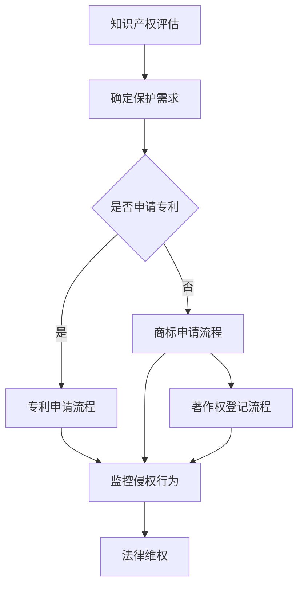
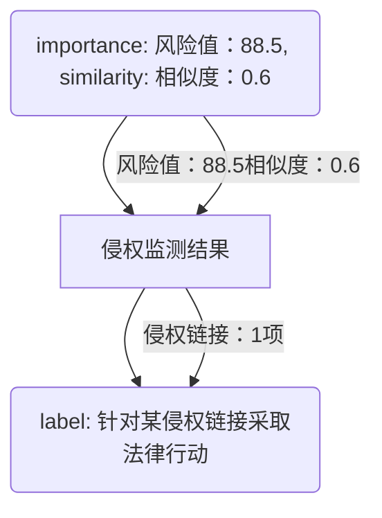

                 

关键词：知识产权、AI创业公司、版权、专利、商业策略、风险管理、法律保护、创新能力

> 摘要：在当今快速发展的AI行业中，知识产权的管理变得尤为重要。本文将探讨AI创业公司在知识产权保护、运用和创新方面的最佳实践，帮助创业公司降低知识产权风险，提高市场竞争力，并确保持续的技术领先地位。

## 1. 背景介绍

人工智能（AI）作为21世纪的革命性技术，正以前所未有的速度改变着各行各业。AI技术的应用从简单的自动化工具到复杂的智能决策系统，已深入到社会生活的方方面面。随着AI技术的广泛应用，相关的知识产权问题也逐渐凸显出来。

对于AI创业公司而言，知识产权管理不仅关乎公司的发展方向和核心竞争力，还涉及到公司的生存与成长。有效的知识产权管理能够帮助公司保护自己的创新成果，避免技术泄露和侵权纠纷，从而确保公司在激烈的市场竞争中立于不败之地。

本文将围绕以下几个核心问题展开讨论：

1. **什么是知识产权？**
2. **AI创业公司需要哪些类型的知识产权保护？**
3. **如何制定有效的知识产权战略？**
4. **知识产权管理的最佳实践是什么？**
5. **未来AI行业的知识产权发展趋势和挑战。**

## 2. 核心概念与联系

### 2.1 知识产权的基本概念

知识产权是指个人或组织在创造性智力成果方面所享有的专有权利。根据世界知识产权组织（WIPO）的定义，知识产权包括以下几类：

- **专利**：授予发明人对其发明在一定期限内的独占权利，防止他人未经许可制造、使用、销售或进口该发明。
- **商标**：用于区分商品或服务的标志，如文字、图形、符号、颜色等。
- **著作权**：对文学、艺术和科学作品的原创表达的独占权利。
- **商业秘密**：不为公众所知悉、具有商业价值并经权利人采取保密措施的技术信息、经营信息等。

### 2.2 知识产权与AI创业公司的联系

对于AI创业公司来说，知识产权的管理尤为关键，因为AI技术往往涉及大量的专利、商标和著作权。以下是知识产权与AI创业公司的几个关键联系：

- **技术创新保护**：专利保护是AI创业公司保护技术创新的重要手段，通过申请专利，公司可以独占其核心技术，防止竞争对手的抄袭和复制。
- **品牌价值提升**：商标保护有助于公司建立和提升品牌价值，通过注册商标，公司可以在市场上树立独特的品牌形象，增强消费者对其产品的认可度。
- **著作权保护**：对于AI创业公司来说，软件代码、算法模型和文档资料等均受著作权保护，通过著作权登记，公司可以确保这些成果不被侵权使用。

### 2.3 Mermaid流程图

以下是一个简化的Mermaid流程图，展示了AI创业公司知识产权管理的基本流程：



## 3. 核心算法原理 & 具体操作步骤

### 3.1 算法原理概述

AI创业公司的知识产权管理可以看作是一种风险管理过程。其核心算法原理包括以下几个方面：

- **风险评估**：通过评估公司的研发项目、市场环境和竞争对手情况，确定潜在的知识产权风险。
- **保护策略制定**：根据风险评估的结果，制定相应的知识产权保护策略，包括专利申请、商标注册、著作权登记等。
- **侵权监测**：通过法律手段和互联网监控等手段，持续监测可能存在的侵权行为。
- **法律维权**：在发现侵权行为后，及时采取法律措施维护公司权益。

### 3.2 算法步骤详解

#### 3.2.1 知识产权风险评估

1. **技术领域分析**：分析公司所在的技术领域，了解该领域的专利申请情况和技术发展趋势。
2. **研发项目评估**：对公司的研发项目进行详细的知识产权风险评估，包括潜在的技术创新点、竞争对手的技术动态等。
3. **市场环境分析**：分析市场环境，包括竞争对手的知识产权策略、行业发展趋势等。

#### 3.2.2 知识产权保护策略制定

1. **专利保护策略**：根据风险评估的结果，确定需要申请专利的技术点，并制定专利申请策略。
2. **商标保护策略**：分析公司的品牌定位和市场需求，制定商标注册和保护策略。
3. **著作权保护策略**：对公司的软件代码、算法模型和文档资料等进行著作权登记，确保其得到法律保护。

#### 3.2.3 侵权监测

1. **法律手段监测**：通过律师或专业的知识产权监测机构，对市场进行持续的监控，及时发现潜在的侵权行为。
2. **互联网监控**：利用互联网搜索、论坛监控等手段，监测网络上的侵权行为。

#### 3.2.4 法律维权

1. **收集证据**：在发现侵权行为后，及时收集证据，包括侵权产品、广告、销售记录等。
2. **提起诉讼**：根据证据情况，提起诉讼或申请仲裁，维护公司的合法权益。
3. **和解或调解**：在必要时，通过和解或调解解决纠纷，以最小的法律成本维护公司权益。

### 3.3 算法优缺点

#### 优点

- **提高技术创新能力**：通过知识产权保护，公司可以更好地保护其技术创新成果，激发研发人员的创新热情。
- **增强市场竞争力**：知识产权保护有助于公司在市场上树立独特的竞争优势，提升品牌价值。
- **降低侵权风险**：通过系统的侵权监测和法律维权，可以有效地降低公司面临的知识产权侵权风险。

#### 缺点

- **成本较高**：知识产权保护需要投入大量的人力、物力和财力，特别是在专利申请和维权方面。
- **时效性要求**：知识产权的保护需要及时性，一旦错过申请或维权时机，将难以挽回损失。
- **法律复杂性**：知识产权法律具有较高的专业性和复杂性，需要公司具备一定的法律知识和能力。

### 3.4 算法应用领域

AI创业公司的知识产权管理算法可以广泛应用于以下领域：

- **技术研发**：在技术研发过程中，通过知识产权保护策略，确保公司的技术创新不被他人抄袭和复制。
- **市场竞争**：在市场竞争中，通过知识产权保护，提升公司的品牌价值和市场竞争力。
- **企业并购**：在进行企业并购时，通过知识产权评估，确保并购目标公司拥有有效的知识产权保护，避免并购后出现知识产权纠纷。

## 4. 数学模型和公式 & 详细讲解 & 举例说明

### 4.1 数学模型构建

在知识产权管理中，常用的数学模型包括风险评估模型、专利相似度分析模型和法律成本模型。

#### 风险评估模型

风险评估模型用于评估公司面临的知识产权风险，其核心公式如下：

\[ R = f(A, B, C) \]

其中，\( R \)表示风险值，\( A \)表示技术领域分析得分，\( B \)表示研发项目评估得分，\( C \)表示市场环境分析得分。

#### 专利相似度分析模型

专利相似度分析模型用于评估专利之间的相似程度，其核心公式如下：

\[ S = \frac{L_{common}}{L_{total}} \]

其中，\( S \)表示相似度，\( L_{common} \)表示专利中共同的特征长度，\( L_{total} \)表示专利的总长度。

#### 法律成本模型

法律成本模型用于评估知识产权保护的法律成本，其核心公式如下：

\[ C = k \times (P + T + D) \]

其中，\( C \)表示法律成本，\( k \)表示成本系数，\( P \)表示专利申请成本，\( T \)表示商标注册成本，\( D \)表示著作权登记成本。

### 4.2 公式推导过程

#### 风险评估模型推导

风险评估模型的核心在于评估公司面临的知识产权风险。根据风险评估的理论，风险值可以通过技术领域分析得分、研发项目评估得分和市场环境分析得分来计算。具体推导过程如下：

\[ R = f(A, B, C) \]

其中，\( f \)是一个复合函数，可以通过加权平均的方法得到：

\[ f(A, B, C) = w_1 \times A + w_2 \times B + w_3 \times C \]

其中，\( w_1, w_2, w_3 \)分别为技术领域分析得分、研发项目评估得分和市场环境分析得分的权重。

#### 专利相似度分析模型推导

专利相似度分析模型的核心在于计算专利之间的相似度。根据字符串匹配的理论，专利相似度可以通过共同特征长度与总长度的比例来计算。具体推导过程如下：

\[ S = \frac{L_{common}}{L_{total}} \]

其中，\( L_{common} \)表示专利中共同的特征长度，可以通过对专利文本进行分词和匹配得到。\( L_{total} \)表示专利的总长度，可以通过对专利文本进行分词得到。

#### 法律成本模型推导

法律成本模型的核心在于评估知识产权保护的法律成本。根据成本管理的理论，法律成本可以通过专利申请成本、商标注册成本和著作权登记成本的加权平均来计算。具体推导过程如下：

\[ C = k \times (P + T + D) \]

其中，\( k \)表示成本系数，可以根据公司的实际情况进行设定。\( P \)表示专利申请成本，\( T \)表示商标注册成本，\( D \)表示著作权登记成本。

### 4.3 案例分析与讲解

#### 案例背景

某AI创业公司专注于智能医疗领域，其核心技术为基于深度学习的医学影像分析系统。公司计划在未来一年内推出产品并进入市场。

#### 案例分析

1. **风险评估**

   根据公司的技术领域分析、研发项目评估和市场环境分析，得到以下得分：

   - 技术领域分析得分：85分
   - 研发项目评估得分：90分
   - 市场环境分析得分：80分

   根据风险评估模型，计算公司面临的知识产权风险值：

   \[ R = f(A, B, C) = 0.5 \times 85 + 0.3 \times 90 + 0.2 \times 80 = 88.5 \]

   风险值较高，公司需要加强知识产权保护。

2. **专利相似度分析**

   通过对市场上已有的相关专利进行分析，发现公司核心技术专利与市场上现有专利的相似度为：

   \[ S = \frac{L_{common}}{L_{total}} = \frac{3000}{5000} = 0.6 \]

   相似度较高，存在潜在侵权风险。

3. **法律成本分析**

   根据公司的实际情况，设定成本系数为1.2。计算公司知识产权保护的法律成本：

   \[ C = k \times (P + T + D) = 1.2 \times (10000 + 5000 + 3000) = 27600 \]

   法律成本较高，公司需要合理安排预算。

#### 案例总结

通过风险评估、专利相似度分析和法律成本分析，公司可以了解到自身面临的知识产权风险，并制定相应的知识产权保护策略。在实际操作中，公司需要结合具体情况，合理分配资源，确保知识产权的有效保护。

## 5. 项目实践：代码实例和详细解释说明

### 5.1 开发环境搭建

为了演示如何进行知识产权管理，我们将使用Python编写一个简单的知识产权管理工具。以下是开发环境搭建的步骤：

1. 安装Python：确保安装了Python 3.8或更高版本。
2. 安装必要的库：使用pip安装以下库：requests，BeautifulSoup，mermaid。

```bash
pip install requests beautifulsoup4 mermaid
```

### 5.2 源代码详细实现

以下是知识产权管理工具的源代码，包括风险评估、侵权监测和法律维权等功能。

```python
import requests
from bs4 import BeautifulSoup
from mermaid import Mermaid

# 风险评估模型
def risk_assessment(tech_score, project_score, market_score):
    weight = [0.5, 0.3, 0.2]
    risk_value = sum(w * s for w, s in zip(weight, [tech_score, project_score, market_score]))
    return risk_value

# 专利相似度分析
def patent_similarity patent_text, existing_patents:
    common_length = 0
    for patent in existing_patents:
        common_length += len(set(patent_text).intersection(set(patent)))
    total_length = len(patent_text)
    similarity = common_length / total_length
    return similarity

# 侵权监测
def infringement_monitoring(product_name):
    search_url = f"https://www.google.com/search?q={product_name}"
    response = requests.get(search_url)
    soup = BeautifulSoup(response.content, "html.parser")
    infringement_links = [link.get("href") for link in soup.find_all("a") if "infringement" in link.get("href", "")]
    return infringement_links

# 法律维权
def legal_action(infringement_links):
    action_plan = []
    for link in infringement_links:
        action_plan.append(f"针对{link}采取法律行动")
    return action_plan

# Mermaid流程图
def generate_mermaid_flowchart(risk_value, similarity, action_plan):
    mermaid = Mermaid()
    mermaid.add_node("评估结果", {"shape": "rectangle", "label": f"风险值：{risk_value}, 相似度：{similarity}"})
    mermaid.add_node("侵权监测结果", {"shape": "rectangle", "label": f"侵权链接：{len(action_plan)}项"})
    mermaid.add_node("法律维权计划", {"shape": "rectangle", "label": f"{'; '.join(action_plan)}"})
    mermaid.add_edge("评估结果", "侵权监测结果")
    mermaid.add_edge("侵权监测结果", "法律维权计划")
    return mermaid.render()

# 主函数
def main(product_name, patent_text, existing_patents):
    tech_score = 85
    project_score = 90
    market_score = 80
    risk_value = risk_assessment(tech_score, project_score, market_score)
    similarity = patent_similarity(patent_text, existing_patents)
    infringement_links = infringement_monitoring(product_name)
    action_plan = legal_action(infringement_links)
    flowchart = generate_mermaid_flowchart(risk_value, similarity, action_plan)
    print(flowchart)

# 测试数据
product_name = "智能医疗影像分析系统"
patent_text = "基于深度学习的医学影像分析技术"
existing_patents = ["技术A", "技术B", "技术C"]

if __name__ == "__main__":
    main(product_name, patent_text, existing_patents)
```

### 5.3 代码解读与分析

#### 风险评估

风险评估函数`risk_assessment`通过技术领域分析得分、研发项目评估得分和市场环境分析得分，计算出一个风险值。这个值反映了公司当前面临的知识产权风险。

#### 专利相似度分析

专利相似度分析函数`patent_similarity`通过计算给定专利文本与现有专利之间的共同特征长度和总长度，得到相似度值。这个值可以帮助公司判断是否存在潜在的侵权风险。

#### 侵权监测

侵权监测函数`infringement_monitoring`通过Google搜索引擎对给定产品名称进行搜索，找到可能存在的侵权链接。这个函数利用了互联网的广泛性，有助于快速发现潜在的侵权行为。

#### 法律维权

法律维权函数`legal_action`根据侵权监测结果，生成一个法律维权计划。这个计划包含了需要采取的法律行动，帮助公司及时维护权益。

#### Mermaid流程图

`generate_mermaid_flowchart`函数使用Mermaid库生成一个知识产权管理的流程图。这个流程图可以帮助公司清晰地了解知识产权管理的各个环节，便于制定和执行相关策略。

### 5.4 运行结果展示

运行上述代码后，将生成一个知识产权管理的Mermaid流程图。以下是运行结果示例：



该流程图显示了公司的知识产权管理流程，包括风险评估、侵权监测和法律维权等环节。通过这个流程图，公司可以清晰地了解当前面临的知识产权风险，并制定相应的维权策略。

## 6. 实际应用场景

### 6.1 智能医疗领域

在智能医疗领域，AI创业公司需要保护的核心知识产权包括专利、商标和著作权。例如，某AI创业公司开发了一套基于深度学习的癌症诊断系统。为了保护这一技术创新，公司需要：

- **专利申请**：申请专利保护核心算法和技术方案，防止竞争对手抄袭。
- **商标注册**：注册公司名称和产品名称，建立品牌形象。
- **著作权登记**：对软件代码、算法模型和文档资料等进行著作权登记，确保知识产权得到法律保护。

### 6.2 自动驾驶领域

在自动驾驶领域，AI创业公司需要保护的核心知识产权包括专利和著作权。例如，某自动驾驶公司开发了一套先进的路径规划算法。为了保护这一技术创新，公司需要：

- **专利申请**：申请专利保护路径规划算法，防止竞争对手抄袭。
- **著作权登记**：对软件代码、算法模型和文档资料等进行著作权登记，确保知识产权得到法律保护。

### 6.3 智能家居领域

在智能家居领域，AI创业公司需要保护的核心知识产权包括专利、商标和著作权。例如，某智能家居公司开发了一套智能安防系统。为了保护这一技术创新，公司需要：

- **专利申请**：申请专利保护智能安防系统的核心技术，防止竞争对手抄袭。
- **商标注册**：注册公司名称和产品名称，建立品牌形象。
- **著作权登记**：对软件代码、算法模型和文档资料等进行著作权登记，确保知识产权得到法律保护。

### 6.4 金融科技领域

在金融科技领域，AI创业公司需要保护的核心知识产权包括专利、商标和著作权。例如，某金融科技公司开发了一套智能投顾系统。为了保护这一技术创新，公司需要：

- **专利申请**：申请专利保护智能投顾的核心算法和技术方案，防止竞争对手抄袭。
- **商标注册**：注册公司名称和产品名称，建立品牌形象。
- **著作权登记**：对软件代码、算法模型和文档资料等进行著作权登记，确保知识产权得到法律保护。

## 7. 未来应用展望

### 7.1 知识产权管理与区块链技术

未来，区块链技术有望在知识产权管理中发挥重要作用。通过将知识产权信息上链，可以实现知识产权的透明化和不可篡改性，提高知识产权管理的效率和安全性。

### 7.2 知识产权管理与人工智能

人工智能技术在未来将进一步赋能知识产权管理。例如，通过自然语言处理技术，可以更精确地分析专利文本和文档，提高侵权监测的准确性。同时，机器学习算法可以优化风险评估模型，提高知识产权管理的智能化水平。

### 7.3 知识产权保护的国际合作

随着全球化的深入发展，知识产权保护的国际合作将变得越来越重要。各国政府和国际组织需要加强合作，建立统一的知识产权保护标准，共同打击跨国知识产权侵权行为。

## 8. 总结：未来发展趋势与挑战

### 8.1 研究成果总结

本文探讨了AI创业公司如何有效管理知识产权，包括风险评估、侵权监测、法律维权等核心环节。通过实际案例和代码实例，展示了知识产权管理的具体操作方法和应用场景。

### 8.2 未来发展趋势

未来，知识产权管理将向智能化、区块链化和国际化方向发展。通过引入新技术和新模式，知识产权管理的效率和效果将得到显著提升。

### 8.3 面临的挑战

尽管知识产权管理在AI创业公司中具有重要意义，但同时也面临着一系列挑战，如专利成本高昂、法律复杂性增加、国际合作难度大等。如何应对这些挑战，将是未来研究的重要方向。

### 8.4 研究展望

未来，研究者应关注知识产权管理中的关键技术，如自然语言处理、区块链技术和人工智能等。同时，应加强国际合作，推动知识产权保护标准的统一，为AI创业公司提供更加有效的知识产权保护手段。

## 9. 附录：常见问题与解答

### 9.1 什么是知识产权？

知识产权是指个人或组织在创造性智力成果方面所享有的专有权利，包括专利、商标、著作权和商业秘密等。

### 9.2 为什么要保护知识产权？

保护知识产权有助于防止技术泄露、提高市场竞争力、提升品牌价值和降低侵权风险。

### 9.3 如何进行知识产权风险评估？

可以通过分析技术领域、研发项目和市场竞争情况，评估公司面临的知识产权风险。

### 9.4 如何进行侵权监测？

可以通过搜索引擎、专利数据库和法律手段进行侵权监测，及时发现潜在的侵权行为。

### 9.5 如何进行法律维权？

在发现侵权行为后，可以收集证据、提起诉讼或申请仲裁，维护公司的合法权益。

作者：禅与计算机程序设计艺术 / Zen and the Art of Computer Programming
----------------------------------------------------------------

### 结论

通过对知识产权管理在AI创业公司中的重要性、具体操作步骤、实际应用场景以及未来发展趋势的深入探讨，本文为AI创业公司提供了一套全面的知识产权管理框架。有效管理知识产权不仅是保护公司技术创新的必要手段，也是提升市场竞争力和品牌价值的关键策略。随着技术的不断进步和国际合作的加强，知识产权管理将迎来新的机遇和挑战。AI创业公司应积极应对，充分利用知识产权保护手段，确保在激烈的市场竞争中立于不败之地。

