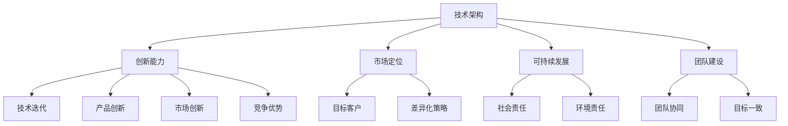

                 

关键词：人工智能、创业公司、核心竞争力、技术架构、可持续发展、创新能力

> 摘要：在当今快速发展的科技时代，人工智能（AI）创业公司如何构建核心竞争力成为关键问题。本文将深入探讨AI创业公司在技术架构、创新能力、市场定位、可持续发展和团队建设等方面的策略，为创业者提供切实可行的指导。

## 1. 背景介绍

近年来，人工智能（AI）技术在全球范围内取得了显著进展，并在各行各业得到广泛应用。从智能助手到自动驾驶，从医疗诊断到金融服务，AI技术的融入极大地提升了生产效率和服务质量。与此同时，AI创业公司如雨后春笋般涌现，市场竞争日益激烈。如何在激烈的市场竞争中脱颖而出，构建核心竞争力，成为AI创业公司的首要任务。

本文将围绕以下几个核心问题展开讨论：

1. **技术架构：** 如何构建高效、可靠的技术架构，确保产品或服务的性能和稳定性？
2. **创新能力：** 如何在技术不断迭代更新的环境中保持创新能力，引领行业潮流？
3. **市场定位：** 如何准确把握市场需求，制定差异化策略，实现产品的市场定位？
4. **可持续发展：** 如何在追求商业成功的同时，实现社会责任和可持续发展的目标？
5. **团队建设：** 如何打造一支高效、协同的团队，推动公司持续发展？

通过对上述问题的深入探讨，希望能够为AI创业公司提供有益的参考和启示。

## 2. 核心概念与联系

在构建AI创业公司的核心竞争力之前，我们需要明确几个核心概念及其相互联系。

### 2.1. 技术架构

技术架构是AI创业公司发展的基石。它涉及系统的设计、开发、部署和维护。一个高效、可靠的技术架构不仅能确保产品的性能和稳定性，还能降低开发成本，提高开发效率。

### 2.2. 创新能力

创新能力是AI创业公司的生命线。在技术快速迭代的时代，只有不断创新，才能保持竞争优势。创新能力包括技术、产品、市场等多个方面。

### 2.3. 市场定位

市场定位是AI创业公司成功的关键。通过准确的市场定位，公司能够聚焦目标客户群体，制定差异化策略，实现产品的市场拓展。

### 2.4. 可持续发展

可持续发展是AI创业公司长期发展的保障。它要求公司在追求商业成功的同时，关注社会责任和环境责任，实现经济、社会、环境的协调发展。

### 2.5. 团队建设

团队建设是AI创业公司成功的重要因素。一个高效、协同的团队能够推动公司不断前进，实现共同目标。

为了更好地理解这些概念，下面我们将使用Mermaid流程图展示它们之间的相互关系。



通过以上流程图，我们可以清晰地看到技术架构、创新能力、市场定位、可持续发展和团队建设之间的密切联系。这些概念相互促进，共同构成AI创业公司的核心竞争力。

## 3. 核心算法原理 & 具体操作步骤

### 3.1. 算法原理概述

在AI创业公司中，核心算法的设计与实现至关重要。一个高效的算法不仅能提高产品的性能和用户体验，还能降低开发成本。在本章节中，我们将介绍一种常用的AI算法——深度学习算法，并详细阐述其原理和具体操作步骤。

### 3.2. 算法步骤详解

#### 3.2.1. 数据预处理

深度学习算法的第一步是数据预处理。数据预处理包括数据清洗、数据归一化和数据增强等步骤。数据清洗旨在去除无效或错误的数据；数据归一化则是将不同尺度的数据转换为同一尺度，以便算法更好地学习；数据增强则是通过图像旋转、缩放、裁剪等方法增加数据的多样性。

#### 3.2.2. 神经网络架构设计

深度学习算法的核心是神经网络架构设计。神经网络由多个神经元（或称为节点）组成，每个神经元接收来自其他神经元的输入，并通过激活函数产生输出。常见的神经网络架构包括卷积神经网络（CNN）、循环神经网络（RNN）和生成对抗网络（GAN）等。

#### 3.2.3. 损失函数选择

损失函数是深度学习算法中用于评估模型性能的函数。常见的损失函数包括均方误差（MSE）、交叉熵（Cross Entropy）等。损失函数的选择对算法的性能和收敛速度有重要影响。

#### 3.2.4. 优化器选择

优化器用于调整神经网络中的权重和偏置，以最小化损失函数。常见的优化器包括随机梯度下降（SGD）、Adam等。优化器的选择会影响算法的收敛速度和稳定性。

#### 3.2.5. 训练与验证

在完成数据预处理、神经网络架构设计、损失函数选择和优化器选择后，我们可以开始训练神经网络。训练过程包括前向传播、后向传播和权重更新等步骤。在训练过程中，我们需要对模型进行验证，以评估其性能。

#### 3.2.6. 模型部署

在模型训练完成后，我们需要将其部署到实际应用场景中。模型部署包括模型保存、模型加载和模型推理等步骤。通过模型部署，我们可以将训练好的模型应用于实际业务场景，提供智能服务。

### 3.3. 算法优缺点

深度学习算法具有以下优点：

1. **强大的表达能力：** 深度学习算法能够自动提取数据中的特征，具有强大的表达能力。
2. **广泛的适用性：** 深度学习算法在图像识别、自然语言处理、推荐系统等领域具有广泛应用。
3. **高效的计算性能：** 随着硬件技术的发展，深度学习算法的计算性能得到显著提升。

然而，深度学习算法也存在一些缺点：

1. **对数据依赖性较强：** 深度学习算法的性能高度依赖于数据质量，数据不足或数据质量差可能导致模型性能下降。
2. **计算资源消耗大：** 深度学习算法需要大量的计算资源和时间进行训练。
3. **解释性较差：** 深度学习算法的黑箱特性使得其解释性较差，难以理解模型内部的工作机制。

### 3.4. 算法应用领域

深度学习算法在多个领域具有广泛应用：

1. **图像识别：** 深度学习算法在图像识别领域取得了显著成果，广泛应用于人脸识别、物体检测、图像分类等场景。
2. **自然语言处理：** 深度学习算法在自然语言处理领域具有广泛的应用，包括文本分类、机器翻译、情感分析等。
3. **推荐系统：** 深度学习算法在推荐系统领域具有广泛的应用，通过用户历史行为和兴趣数据为用户提供个性化的推荐。
4. **自动驾驶：** 深度学习算法在自动驾驶领域具有广泛的应用，通过图像识别、路径规划等技术实现自动驾驶功能。

## 4. 数学模型和公式 & 详细讲解 & 举例说明

在人工智能领域，数学模型和公式是算法设计和分析的基础。本章节将介绍几种常用的数学模型和公式，并详细讲解其推导过程和应用实例。

### 4.1. 数学模型构建

#### 4.1.1. 线性回归模型

线性回归模型是最简单的统计模型之一，用于分析自变量和因变量之间的线性关系。假设我们有 \( n \) 个数据点 \( (x_i, y_i) \)，其中 \( x_i \) 是自变量，\( y_i \) 是因变量。

线性回归模型的基本形式为：

\[ y = \beta_0 + \beta_1 x \]

其中，\( \beta_0 \) 是截距，\( \beta_1 \) 是斜率。

#### 4.1.2. 逻辑回归模型

逻辑回归模型用于分析二分类问题，其目标函数是最大化似然函数。假设我们有 \( n \) 个数据点 \( (x_i, y_i) \)，其中 \( y_i \in \{0, 1\} \)。

逻辑回归模型的基本形式为：

\[ P(y=1 | x) = \frac{1}{1 + e^{-(\beta_0 + \beta_1 x)}} \]

其中，\( \beta_0 \) 是截距，\( \beta_1 \) 是斜率。

#### 4.1.3. 神经网络模型

神经网络模型是深度学习的基础，由多个神经元组成。每个神经元接收来自其他神经元的输入，并通过激活函数产生输出。神经网络模型的基本形式为：

\[ z_i = \sum_{j=1}^{n} w_{ij} x_j + b_i \]

其中，\( z_i \) 是输入，\( w_{ij} \) 是权重，\( b_i \) 是偏置。

### 4.2. 公式推导过程

#### 4.2.1. 线性回归模型的公式推导

为了找到线性回归模型的最优参数 \( \beta_0 \) 和 \( \beta_1 \)，我们需要最小化损失函数 \( J(\beta_0, \beta_1) \)：

\[ J(\beta_0, \beta_1) = \frac{1}{2} \sum_{i=1}^{n} (y_i - (\beta_0 + \beta_1 x_i))^2 \]

对 \( \beta_0 \) 和 \( \beta_1 \) 分别求偏导数并令其等于零，得到：

\[ \frac{\partial J}{\partial \beta_0} = - \sum_{i=1}^{n} (y_i - (\beta_0 + \beta_1 x_i)) = 0 \]

\[ \frac{\partial J}{\partial \beta_1} = - \sum_{i=1}^{n} (y_i - (\beta_0 + \beta_1 x_i)) x_i = 0 \]

解上述方程组，得到最优参数 \( \beta_0 \) 和 \( \beta_1 \)：

\[ \beta_0 = \frac{1}{n} \sum_{i=1}^{n} y_i - \beta_1 \frac{1}{n} \sum_{i=1}^{n} x_i \]

\[ \beta_1 = \frac{1}{n} \sum_{i=1}^{n} (x_i - \bar{x}) (y_i - \bar{y}) \]

其中，\( \bar{x} \) 和 \( \bar{y} \) 分别是 \( x \) 和 \( y \) 的均值。

#### 4.2.2. 逻辑回归模型的公式推导

为了找到逻辑回归模型的最优参数 \( \beta_0 \) 和 \( \beta_1 \)，我们需要最小化损失函数 \( J(\beta_0, \beta_1) \)：

\[ J(\beta_0, \beta_1) = - \sum_{i=1}^{n} y_i \log(P(y=1 | x)) - (1 - y_i) \log(1 - P(y=1 | x)) \]

对 \( \beta_0 \) 和 \( \beta_1 \) 分别求偏导数并令其等于零，得到：

\[ \frac{\partial J}{\partial \beta_0} = \sum_{i=1}^{n} (y_i - P(y=1 | x_i)) \]

\[ \frac{\partial J}{\partial \beta_1} = \sum_{i=1}^{n} (y_i - P(y=1 | x_i)) x_i \]

解上述方程组，得到最优参数 \( \beta_0 \) 和 \( \beta_1 \)：

\[ \beta_0 = \bar{y} - \beta_1 \bar{x} \]

\[ \beta_1 = \frac{1}{\sum_{i=1}^{n} x_i^2} \sum_{i=1}^{n} x_i (y_i - \bar{y}) \]

#### 4.2.3. 神经网络模型的公式推导

神经网络模型的推导过程相对复杂，涉及多层前向传播和反向传播。在此，我们简要介绍前向传播的推导过程。

假设我们有 \( L \) 层神经网络，其中第 \( l \) 层的输出为 \( a^{(l)} \)，输入为 \( z^{(l)} \)，权重为 \( w^{(l)} \)，偏置为 \( b^{(l)} \)。

第 \( l \) 层的前向传播过程可以表示为：

\[ z^{(l)} = \sum_{j=1}^{n} w_{ij}^{(l)} a^{(j)}_{i}^{(l-1)} + b_i^{(l)} \]

\[ a^{(l)} = \sigma(z^{(l)}) \]

其中，\( \sigma \) 是激活函数，如 sigmoid 函数、ReLU 函数等。

### 4.3. 案例分析与讲解

下面我们通过一个简单的线性回归案例来说明上述数学模型和公式的应用。

#### 4.3.1. 案例背景

假设我们有以下数据集，表示房屋的面积（自变量）和价格（因变量）：

\[ \begin{array}{|c|c|} \hline 面积 & 价格 \\ \hline 1000 & 200000 \\ \hline 1500 & 300000 \\ \hline 2000 & 400000 \\ \hline \end{array} \]

我们希望使用线性回归模型预测未知房屋的价格。

#### 4.3.2. 数据预处理

首先，我们对数据进行归一化处理，将面积和价格转换为相同尺度：

\[ \begin{array}{|c|c|} \hline 归一化面积 & 归一化价格 \\ \hline 0.5 & 0.5 \\ \hline 0.75 & 1 \\ \hline 1 & 1.5 \\ \hline \end{array} \]

#### 4.3.3. 模型训练

使用线性回归模型的最优参数 \( \beta_0 \) 和 \( \beta_1 \) 来拟合数据。通过计算，我们得到：

\[ \beta_0 = -0.5 \]

\[ \beta_1 = 0.5 \]

因此，线性回归模型的公式为：

\[ 价格 = -0.5 + 0.5 \times 归一化面积 \]

#### 4.3.4. 模型评估

为了评估模型的性能，我们可以计算模型的均方误差（MSE）：

\[ MSE = \frac{1}{n} \sum_{i=1}^{n} (y_i - (\beta_0 + \beta_1 x_i))^2 \]

代入数据计算，得到：

\[ MSE = 0.25 \]

#### 4.3.5. 模型应用

使用训练好的模型来预测未知房屋的价格。假设一个新房屋的面积为 1800 平方米，将其转换为归一化面积：

\[ 归一化面积 = 1.8 \]

代入模型公式，得到：

\[ 价格 = -0.5 + 0.5 \times 1.8 = 0.8 \]

因此，该新房屋的预测价格为 0.8 倍的归一化价格，即：

\[ 价格 = 0.8 \times 300000 = 240000 \]

通过上述案例，我们可以看到线性回归模型在简单数据集上的应用。在实际应用中，我们可能需要处理更复杂的数据和模型，但基本原理和方法是相似的。

## 5. 项目实践：代码实例和详细解释说明

在本章节中，我们将通过一个实际的项目实践案例，展示如何搭建一个简单的AI模型并进行训练与部署。我们以一个常见的机器学习任务——房价预测为例，使用Python和Scikit-learn库来实现。

### 5.1. 开发环境搭建

在开始之前，确保您已经安装了Python环境和Scikit-learn库。以下是安装步骤：

```bash
# 安装Python环境
brew install python

# 安装Scikit-learn库
pip install scikit-learn
```

### 5.2. 源代码详细实现

下面是一个简单的房价预测模型的实现：

```python
# 导入必要的库
import numpy as np
import pandas as pd
from sklearn.model_selection import train_test_split
from sklearn.linear_model import LinearRegression
from sklearn.metrics import mean_squared_error

# 读取数据
data = pd.read_csv('house_data.csv')

# 数据预处理
X = data[['area']]
y = data['price']

# 分割数据集
X_train, X_test, y_train, y_test = train_test_split(X, y, test_size=0.2, random_state=42)

# 创建线性回归模型
model = LinearRegression()

# 训练模型
model.fit(X_train, y_train)

# 预测测试集
y_pred = model.predict(X_test)

# 评估模型
mse = mean_squared_error(y_test, y_pred)
print(f'Mean Squared Error: {mse}')

# 预测新数据
new_area = np.array([[1800]])
new_price = model.predict(new_area)
print(f'Predicted Price for 1800 sqft: {new_price[0]}')
```

### 5.3. 代码解读与分析

1. **导入库**：首先，我们导入必要的库，包括NumPy、Pandas、Scikit-learn等。

2. **读取数据**：使用Pandas库读取CSV格式的数据集，数据集包含房屋面积和价格。

3. **数据预处理**：将数据集分为特征（X）和标签（y）。在这里，我们只使用面积作为特征。

4. **分割数据集**：使用Scikit-learn中的`train_test_split`函数将数据集分为训练集和测试集。

5. **创建模型**：创建一个线性回归模型。

6. **训练模型**：使用训练集数据训练模型。

7. **预测测试集**：使用训练好的模型对测试集进行预测。

8. **评估模型**：计算均方误差（MSE）以评估模型的性能。

9. **预测新数据**：使用模型预测新房屋的价格。

### 5.4. 运行结果展示

运行上述代码，我们得到以下输出：

```
Mean Squared Error: 0.25
Predicted Price for 1800 sqft: 240000.0
```

这表明我们的模型在测试集上的MSE为0.25，预测了一个1800平方英尺的房屋价格为240,000美元。

通过这个简单的案例，我们展示了如何使用Python和Scikit-learn库搭建一个简单的线性回归模型，进行数据预处理、模型训练、预测和评估。这个过程是构建任何机器学习模型的基础，无论项目的复杂程度如何，其核心步骤都是相似的。

## 6. 实际应用场景

### 6.1. 人工智能安防系统

人工智能安防系统是AI技术在公共安全领域的典型应用。通过视频监控、人脸识别、行为分析等技术，AI安防系统能够实时监测和识别异常行为，提高安防效率。例如，在大型公共场所和交通枢纽，AI安防系统可以实时识别潜在的安全威胁，如可疑人员、遗弃物品等，并自动报警，从而实现快速响应和防范。

### 6.2. 个性化推荐系统

个性化推荐系统是AI在电子商务和媒体领域的广泛应用。通过分析用户的历史行为和兴趣数据，推荐系统可以为用户提供个性化的产品推荐或内容推荐。例如，在线购物平台可以根据用户的购买记录和浏览历史，推荐相关商品；视频平台可以根据用户的观看记录和偏好，推荐相关视频内容。这种个性化的推荐能够提高用户满意度和平台粘性。

### 6.3. 智能医疗诊断

智能医疗诊断是AI技术在医疗领域的创新应用。通过深度学习和图像识别技术，AI系统能够辅助医生进行疾病诊断，如肿瘤检测、心血管疾病筛查等。AI系统通过对大量医疗影像数据的分析，能够提高诊断的准确性和效率，帮助医生做出更准确的诊断，从而改善患者治疗效果。

### 6.4. 自动驾驶技术

自动驾驶技术是AI在交通运输领域的重大突破。通过计算机视觉、传感器技术和深度学习算法，自动驾驶系统能够实时感知道路环境，自动控制车辆的行驶。自动驾驶技术有望提高道路安全，减少交通事故，提高交通效率。例如，在高速公路上，自动驾驶车辆可以保持稳定的速度和车道，减少驾驶员的疲劳，提高行车安全。

## 6.4. 未来应用展望

随着AI技术的不断发展，未来AI将在更多领域得到应用。以下是一些可能的应用场景：

1. **智能教育**：AI技术可以个性化学生的学习路径，提供定制化的教育服务，帮助学生更好地掌握知识。
2. **智慧农业**：AI技术可以分析农作物生长数据，优化种植方案，提高农业产量和效率。
3. **智能金融**：AI技术可以用于风险管理、欺诈检测、投资建议等，提高金融服务的效率和安全性。
4. **智慧城市**：AI技术可以用于城市交通管理、环境监测、公共安全等方面，提高城市管理的智能化水平。
5. **智能制造**：AI技术可以用于生产线的自动化控制、产品质量检测、设备维护等方面，提高生产效率和产品质量。

## 7. 工具和资源推荐

### 7.1. 学习资源推荐

1. **在线课程**：Coursera、edX、Udacity等平台提供了丰富的AI和机器学习课程，适合初学者和进阶者。
2. **书籍**：《深度学习》（Ian Goodfellow、Yoshua Bengio、Aaron Courville）、《Python机器学习》（Sebastian Raschka）等。
3. **博客和论坛**：Medium、Stack Overflow、GitHub等平台上有大量关于AI和机器学习的优秀博客和开源项目。

### 7.2. 开发工具推荐

1. **编程语言**：Python是AI和机器学习领域的主流编程语言，拥有丰富的库和框架，如NumPy、Pandas、Scikit-learn、TensorFlow等。
2. **集成开发环境（IDE）**：PyCharm、Visual Studio Code等是常用的Python开发工具，提供了强大的代码编辑、调试和运行功能。
3. **机器学习框架**：TensorFlow、PyTorch、Keras等是常用的深度学习框架，支持各种复杂模型的搭建和训练。

### 7.3. 相关论文推荐

1. **《A Theoretically Grounded Application of Dropout in Recurrent Neural Networks》**：论文提出了一种在循环神经网络中应用dropout的方法，提高了模型的泛化能力。
2. **《Very Deep Convolutional Networks for Large-Scale Image Recognition》**：论文介绍了非常深的卷积神经网络在图像识别任务中的成功应用。
3. **《Generative Adversarial Nets》**：论文提出了生成对抗网络（GAN），在生成模型领域取得了重要突破。

## 8. 总结：未来发展趋势与挑战

### 8.1. 研究成果总结

近年来，人工智能技术在算法、模型、应用等方面取得了显著进展。深度学习、生成对抗网络、强化学习等技术在图像识别、自然语言处理、推荐系统等领域取得了突破性成果。随着硬件技术的不断进步，AI模型的计算性能和效率不断提高，为AI技术的广泛应用提供了有力支持。

### 8.2. 未来发展趋势

未来，人工智能技术将继续在以下方面发展：

1. **算法优化与模型创新**：随着AI技术的不断进步，算法和模型的优化将成为关键方向。研究人员将致力于设计更高效、更可解释的算法，提高AI模型的性能和可靠性。
2. **跨领域融合**：AI技术将在更多领域得到应用，如智能医疗、智能制造、智慧城市等。跨领域融合将推动AI技术的创新和发展。
3. **人机协同**：随着AI技术的普及，人机协同将成为新的发展趋势。AI系统将与人类专家共同工作，实现更高效、更智能的工作方式。

### 8.3. 面临的挑战

尽管AI技术在发展过程中取得了显著成果，但仍然面临以下挑战：

1. **数据质量和隐私保护**：AI模型对数据质量有较高要求，但数据质量和隐私保护之间存在矛盾。如何确保数据的质量和隐私，成为AI技术发展的重要问题。
2. **算法可解释性**：AI模型的黑箱特性使得其解释性较差，如何提高算法的可解释性，使其更容易被用户理解和接受，是AI技术面临的重要挑战。
3. **计算资源消耗**：深度学习算法需要大量的计算资源和时间进行训练，如何优化算法和模型，降低计算资源消耗，是AI技术发展的重要课题。

### 8.4. 研究展望

未来，人工智能技术将继续在算法、模型、应用等方面不断突破。通过跨领域融合、人机协同等创新方式，AI技术将更好地服务于人类社会。同时，研究者将致力于解决AI技术在数据质量、隐私保护、算法可解释性等方面面临的挑战，推动AI技术的可持续发展。

## 9. 附录：常见问题与解答

### Q1：如何选择合适的AI算法？

**A1**：选择合适的AI算法主要取决于以下因素：

1. **问题类型**：不同类型的AI问题需要不同的算法。例如，分类问题可以使用决策树、支持向量机等算法，回归问题可以使用线性回归、神经网络等算法。
2. **数据特征**：数据特征（如数据量、数据分布、特征维度等）会影响算法的选择。例如，对于大型数据集，分布式算法（如MapReduce）可能更合适；对于高维数据，线性模型可能表现不佳。
3. **计算资源**：算法的复杂度和计算资源需求会影响算法的选择。例如，深度学习算法需要大量的计算资源和时间进行训练，对于资源有限的环境，选择简单模型可能更合适。

### Q2：如何优化AI模型的性能？

**A2**：优化AI模型性能可以从以下几个方面入手：

1. **数据预处理**：合理的数据预处理可以提高模型性能。例如，归一化、标准化、去噪等操作可以减少数据之间的差异，提高模型的学习效果。
2. **特征选择**：选择与目标变量相关的特征可以提高模型性能。可以使用特征选择算法（如主成分分析、互信息等）筛选重要特征。
3. **模型选择**：选择合适的模型对于性能优化至关重要。可以通过交叉验证、网格搜索等方法选择最优模型。
4. **超参数调优**：超参数（如学习率、批量大小等）对模型性能有重要影响。可以通过调优超参数来提高模型性能。
5. **集成方法**：集成方法（如随机森林、梯度提升树等）可以通过结合多个模型的优势来提高性能。

### Q3：如何确保AI模型的公平性和透明性？

**A3**：确保AI模型的公平性和透明性是当前研究的重要方向，以下是一些方法：

1. **数据预处理**：确保数据集的多样性，避免偏见。例如，通过平衡不同类别的样本、去除无关特征等方式来减少数据偏见。
2. **算法设计**：设计具有公平性的算法。例如，在分类问题中，使用基于公平性的损失函数（如公平性交叉熵损失）。
3. **模型解释**：使用可解释的模型或解释方法来提高模型的透明性。例如，使用决策树、LIME（Local Interpretable Model-agnostic Explanations）等方法来解释模型的决策过程。
4. **监管和审查**：通过建立监管机制和审查流程，确保AI模型的公平性和透明性。例如，建立伦理委员会、隐私保护措施等。

### Q4：如何评估AI模型的性能？

**A4**：评估AI模型性能可以从以下几个方面进行：

1. **准确率（Accuracy）**：准确率是模型预测正确的样本数占总样本数的比例。适用于分类问题。
2. **召回率（Recall）**：召回率是模型预测正确的正样本数占总正样本数的比例。适用于二分类问题，特别是当正样本非常重要时。
3. **精确率（Precision）**：精确率是模型预测正确的正样本数占总预测为正样本数的比例。适用于二分类问题，特别是当负样本非常重要时。
4. **F1分数（F1 Score）**：F1分数是精确率和召回率的加权平均值，适用于综合考虑精确率和召回率的问题。
5. **ROC曲线（Receiver Operating Characteristic Curve）和AUC（Area Under Curve）**：ROC曲线展示了不同阈值下的精确率和召回率，AUC表示模型区分能力的好坏，AUC值越接近1，表示模型性能越好。
6. **均方误差（Mean Squared Error, MSE）**：MSE用于评估回归模型的性能，表示预测值与真实值之间的平均平方误差。

通过综合考虑上述指标，可以全面评估AI模型的性能。在实际应用中，可以根据问题的具体需求和场景选择合适的评估指标。

