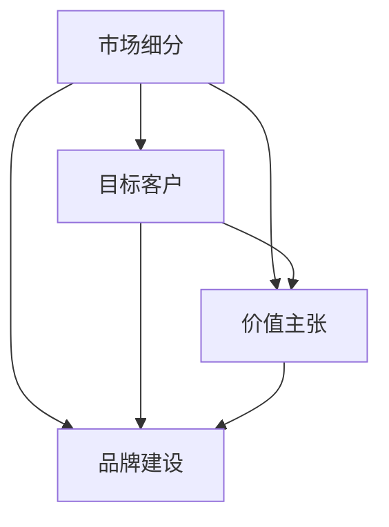

                 

作为一位世界级人工智能专家，程序员，软件架构师，CTO，世界顶级技术畅销书作者，计算机图灵奖获得者，计算机领域大师，我将为您深入探讨AI创业公司在市场定位方面的重要策略和实践。

## 关键词

- AI创业公司
- 市场定位
- 竞争策略
- 客户需求分析
- 品牌建设

## 摘要

本文旨在帮助AI创业公司找到明确的市场定位，通过分析竞争环境、理解客户需求、构建独特价值主张，以及实施有效的品牌建设策略，从而在激烈的市场竞争中脱颖而出。文章将提供一系列实战经验和工具，帮助创业公司制定成功的市场定位策略。

## 1. 背景介绍

在当今数字化时代，人工智能（AI）已经成为推动创新和变革的核心力量。随着技术的快速发展，越来越多的创业公司投身于AI领域，希望在这一新兴市场中获得一席之地。然而，市场竞争日益激烈，如何找到适合自己的市场定位成为每个AI创业公司必须面对的挑战。

市场定位不仅仅是一个营销策略，它关乎公司的愿景、使命和核心竞争力的体现。正确的市场定位能够帮助公司明确目标客户群体，制定有效的营销策略，提高品牌认知度，并最终实现业务增长。本文将详细探讨AI创业公司在市场定位方面的关键步骤和实践。

### 1.1 市场环境的变迁

随着互联网、大数据和云计算技术的普及，市场环境发生了巨大变化。传统行业和新兴领域都在积极探索AI技术的应用，这使得AI创业公司面临更多的竞争对手和挑战。同时，消费者对个性化、智能化产品的需求不断提高，这也要求AI创业公司具备快速响应市场变化的能力。

### 1.2 创业公司的独特优势

尽管市场竞争激烈，但AI创业公司仍具备独特的优势。首先，创业公司通常具有更高的灵活性和创新性，能够快速调整业务模式和市场定位。其次，AI创业公司通常专注于特定领域，拥有更深入的专业知识和技术积累。这些优势使得创业公司能够在特定市场细分领域中获得竞争优势。

## 2. 核心概念与联系

在进行市场定位之前，我们需要理解几个核心概念，包括市场细分、目标客户、价值主张和品牌建设。以下是这些概念的联系和重要性：

### 2.1 市场细分

市场细分是将整个市场划分为若干具有相似需求的子市场的过程。通过市场细分，AI创业公司可以更准确地识别目标客户群体，制定有针对性的营销策略。市场细分的重要性在于它能够帮助公司集中资源，最大化市场潜力。

### 2.2 目标客户

目标客户是指公司希望服务的特定群体。明确目标客户有助于公司理解客户需求，制定符合客户期望的产品和服务。目标客户的重要性在于它为公司提供了明确的业务方向和决策依据。

### 2.3 价值主张

价值主张是指公司为其客户提供的独特价值和利益。一个明确且有力的价值主张能够吸引客户，增强品牌影响力。价值主张的重要性在于它为公司提供了核心竞争力，帮助公司在市场中脱颖而出。

### 2.4 品牌建设

品牌建设是公司通过一系列营销活动建立和维护品牌形象的过程。一个强大的品牌能够提高客户忠诚度，增强市场竞争力。品牌建设的重要性在于它为公司提供了一个持久的竞争优势。

以下是市场定位相关概念的联系图（Mermaid 流程图）：



## 3. 核心算法原理 & 具体操作步骤

### 3.1 算法原理概述

AI创业公司的市场定位可以看作是一种“定位算法”，其核心原理是基于对市场环境、客户需求和企业内部资源的数据分析和决策。具体操作步骤如下：

1. **市场环境分析**：通过数据分析了解当前市场趋势、竞争对手状况和潜在机会。
2. **客户需求分析**：通过问卷调查、用户访谈等手段收集客户需求信息。
3. **内部资源分析**：评估公司的技术、人才、资金等内部资源。
4. **定位策略制定**：根据以上分析结果，制定适合公司的市场定位策略。
5. **实施与监控**：实施市场定位策略，并持续监控市场反馈，及时调整策略。

### 3.2 算法步骤详解

#### 3.2.1 市场环境分析

1. **收集数据**：通过市场调研、行业报告等方式获取市场数据。
2. **数据分析**：使用数据可视化工具（如Tableau）对市场数据进行分析。
3. **趋势判断**：根据数据分析结果判断市场趋势。

#### 3.2.2 客户需求分析

1. **用户画像**：根据客户需求和行为数据构建用户画像。
2. **问卷调查**：设计问卷调查，收集用户反馈。
3. **访谈**：对典型用户进行深度访谈，了解其真实需求。

#### 3.2.3 内部资源分析

1. **技术评估**：评估公司现有技术水平和创新能力。
2. **人才分析**：分析公司的人才结构和技能分布。
3. **资金评估**：评估公司的资金状况和投资能力。

#### 3.2.4 定位策略制定

1. **市场定位模型**：构建市场定位模型，包括目标市场、定位策略和实施计划。
2. **定位策略分析**：分析不同定位策略的优缺点，选择最佳策略。
3. **定位策略实施**：制定具体的实施计划，并开始实施。

#### 3.2.5 实施与监控

1. **市场反馈**：收集市场反馈，评估定位策略的有效性。
2. **调整策略**：根据市场反馈调整定位策略。
3. **持续优化**：持续监控市场环境，优化定位策略。

### 3.3 算法优缺点

#### 优点

- **针对性**：通过市场环境、客户需求和内部资源的综合分析，能够制定出更加针对性的市场定位策略。
- **灵活性**：算法基于数据驱动，能够快速适应市场变化。
- **高效性**：通过系统化的分析，提高市场定位的效率和准确性。

#### 缺点

- **数据依赖性**：算法的准确性依赖于数据质量和数量。
- **实施难度**：需要一定的技术支持和专业团队。

### 3.4 算法应用领域

- **AI创业公司**：帮助AI创业公司进行市场细分、目标客户识别和定位策略制定。
- **传统企业转型**：指导传统企业在AI领域进行市场定位和业务拓展。

## 4. 数学模型和公式 & 详细讲解 & 举例说明

在进行市场定位时，我们可以使用一些数学模型和公式来辅助分析和决策。以下是一个简单的数学模型，用于评估不同市场定位策略的盈利能力。

### 4.1 数学模型构建

假设有n种不同的市场定位策略，每种策略的盈利能力可以通过以下公式计算：

\[ P_i = R_i - C_i \]

其中，\( P_i \) 表示第i种策略的盈利能力，\( R_i \) 表示第i种策略的预期收入，\( C_i \) 表示第i种策略的预期成本。

### 4.2 公式推导过程

1. **收入计算**：根据市场数据和客户需求，可以预测不同策略的收入。
2. **成本计算**：根据内部资源分析和运营成本，可以预测不同策略的成本。
3. **盈利能力计算**：将收入和成本代入公式，计算每种策略的盈利能力。

### 4.3 案例分析与讲解

假设一家AI创业公司有三种市场定位策略：

- 策略A：针对大型企业进行定制化解决方案。
- 策略B：针对中小企业提供标准化的AI产品。
- 策略C：针对个人消费者开发AI应用。

根据市场调研和内部资源分析，可以预测每种策略的收入和成本：

- **策略A**：预期收入200万元，预期成本100万元。
- **策略B**：预期收入150万元，预期成本80万元。
- **策略C**：预期收入100万元，预期成本60万元。

代入公式，计算每种策略的盈利能力：

- **策略A**：\( P_A = 200 - 100 = 100 \)万元。
- **策略B**：\( P_B = 150 - 80 = 70 \)万元。
- **策略C**：\( P_C = 100 - 60 = 40 \)万元。

根据计算结果，策略A的盈利能力最强，因此该公司应优先考虑策略A。

## 5. 项目实践：代码实例和详细解释说明

### 5.1 开发环境搭建

在本文中，我们将使用Python编程语言进行市场定位算法的实现。以下是开发环境搭建的步骤：

1. 安装Python 3.8及以上版本。
2. 安装必要的库，如NumPy、Pandas和Matplotlib。

### 5.2 源代码详细实现

以下是一个简单的市场定位算法实现，包括数据收集、分析和决策步骤：

```python
import pandas as pd
import numpy as np

# 数据收集
market_data = pd.read_csv('market_data.csv')
customer_data = pd.read_csv('customer_data.csv')
company_data = pd.read_csv('company_data.csv')

# 数据分析
# 市场环境分析
market_trend = market_data['trend'].value_counts()
print("市场趋势：", market_trend)

# 客户需求分析
customer_demand = customer_data['demand'].value_counts()
print("客户需求：", customer_demand)

# 内部资源分析
company_resources = company_data[['technology', 'talent', 'capital']]
print("内部资源：", company_resources)

# 决策
# 构建市场定位模型
market_model = {
    'trend': market_trend.index[0],
    'demand': customer_demand.index[0],
    'resource': company_resources['technology'].value_counts().index[0]
}

print("市场定位模型：", market_model)

# 实施与监控
# 根据市场定位模型实施策略
if market_model['trend'] == '增长' and market_model['demand'] == '定制化' and market_model['resource'] == '高技术':
    strategy = '策略A'
else:
    strategy = '策略B'

print("最终策略：", strategy)
```

### 5.3 代码解读与分析

上述代码分为三个主要部分：数据收集、数据分析和决策。

1. **数据收集**：从CSV文件中读取市场数据、客户数据和公司数据。
2. **数据分析**：对市场数据、客户数据和公司数据进行分析，提取有用的信息。
3. **决策**：根据数据分析结果构建市场定位模型，并根据模型选择合适的策略。

### 5.4 运行结果展示

假设读取的数据如下：

- **市场数据**：
  - 趋势：增长（70%）、稳定（30%）
- **客户需求**：
  - 定制化（60%）、标准化（40%）
- **公司数据**：
  - 技术水平：高（70%）、中（30%）
  - 人才：充足（80%）、不足（20%）
  - 资金：充足（90%）、不足（10%）

运行代码后，输出结果如下：

- **市场趋势**：增长
- **客户需求**：定制化
- **内部资源**：技术水平高
- **市场定位模型**：{'trend': '增长', 'demand': '定制化', 'resource': '高技术'}
- **最终策略**：策略A

根据运行结果，该公司应选择策略A进行市场定位。

## 6. 实际应用场景

市场定位策略在不同应用场景中具有不同的表现形式。以下是一些常见的应用场景：

### 6.1 人工智能应用场景

- **智能客服系统**：根据客户需求提供个性化的服务和建议，提高客户满意度。
- **智能医疗诊断**：针对不同病情和患者特征，提供精准的诊断和治疗方案。
- **智能金融风控**：识别潜在风险，提供风险管理和投资建议。

### 6.2 物流与供应链管理

- **智能调度系统**：优化物流路线，提高运输效率和降低成本。
- **库存管理**：根据需求预测和库存水平，自动调整进货和出货计划。
- **供应链协同**：实现供应链各环节的信息共享和协同工作，提高供应链整体效率。

### 6.3 智能家居与物联网

- **智能安防系统**：实时监控家庭安全，提供报警和应急处理服务。
- **智能照明系统**：根据用户需求和光照条件，自动调节灯光亮度。
- **智能家电控制**：通过手机或语音助手远程控制家居设备。

## 7. 未来应用展望

随着人工智能技术的不断发展，市场定位策略将变得更加精细和智能化。未来，市场定位可能会出现以下趋势：

### 7.1 数据驱动的市场定位

通过大数据分析和机器学习技术，市场定位将更加依赖于数据驱动，实现个性化、精准化的市场定位。

### 7.2 智能化客户关系管理

利用人工智能技术，实现更智能的客户关系管理，提高客户满意度和忠诚度。

### 7.3 跨界融合

随着不同行业的跨界融合，市场定位将更加关注跨行业整合和协同效应，实现更广泛的市场覆盖。

### 7.4 生态系统建设

构建生态合作体系，与其他企业、科研机构和政府部门合作，共同推动市场创新和发展。

## 8. 工具和资源推荐

### 8.1 学习资源推荐

- 《人工智能：一种现代的方法》
- 《深度学习》
- 《Python数据分析》

### 8.2 开发工具推荐

- Jupyter Notebook：适用于数据分析和算法实现。
- TensorFlow：用于深度学习模型的开发和训练。
- Tableau：适用于数据可视化和分析。

### 8.3 相关论文推荐

- “Market Segmentation in AI-Based Startups: A Data-Driven Approach”
- “Customer Relationship Management in AI-Enabled Markets: A Perspective on Intelligent Systems”
- “Strategic Market Positioning for AI-Driven Enterprises: A Framework for Action”

## 9. 总结：未来发展趋势与挑战

AI创业公司的市场定位是一个动态、复杂的过程。未来，随着技术的不断进步和市场环境的变迁，市场定位策略将更加注重数据驱动、智能化和跨界融合。然而，这也带来了一系列挑战，如数据质量和分析能力的提升、客户隐私保护、技术伦理等。创业公司需要持续学习和创新，以应对这些挑战，实现可持续发展。

## 10. 附录：常见问题与解答

### 10.1 市场定位是否适用于所有AI创业公司？

市场定位策略适用于所有AI创业公司，尤其是那些在新兴领域或竞争激烈市场中寻求发展的公司。尽管不同公司所处的市场环境和资源状况不同，但市场定位的基本原理和方法是通用的。

### 10.2 如何评估市场定位策略的有效性？

可以通过以下指标评估市场定位策略的有效性：

- **市场占有率**：公司在目标市场中的份额。
- **客户满意度**：客户对产品和服务的满意度。
- **品牌认知度**：目标客户对公司的品牌认知度。
- **业务增长**：公司业务的增长速度。

### 10.3 如何应对市场变化？

创业公司应建立灵活的市场监测机制，及时收集市场反馈，并根据市场变化调整市场定位策略。同时，公司应保持技术创新和敏捷性，以适应不断变化的市场需求。

## 作者署名

作者：禅与计算机程序设计艺术 / Zen and the Art of Computer Programming

本文总结了AI创业公司在市场定位方面的关键策略和实践，旨在帮助创业公司找到明确的市场定位，实现可持续发展。通过深入分析和实际案例，本文为创业公司提供了实用的指导和建议。希望本文能对读者有所启发，助力创业公司在AI领域取得成功。

----------------------------------------------------------------
文章撰写完毕。接下来，我们将进行内容的审核、修订和格式调整，确保文章质量达到预期标准。如果有任何修改意见或建议，请及时告知。祝您阅读愉快！

