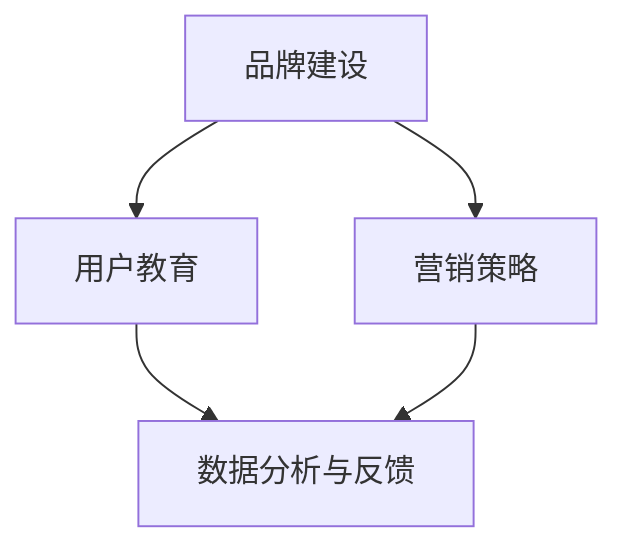

                 

关键词：市场教育、AI创业、用户教育、品牌建设、营销策略

> 摘要：本文将探讨AI创业公司如何通过有效的市场教育策略，提升品牌影响力，增加用户黏性，实现业务增长。文章从多个维度分析了市场教育的核心概念、实施步骤、工具和资源，并提出了未来发展的挑战与展望。

## 1. 背景介绍

随着人工智能技术的迅猛发展，AI创业公司如雨后春笋般涌现。如何在激烈的市场竞争中脱颖而出，成为每个AI创业公司都需要面对的问题。市场教育作为企业品牌建设和用户获取的重要手段，显得尤为重要。本文将围绕以下几个方面展开：

- 市场教育的核心概念与重要性
- AI创业公司的市场教育策略
- 市场教育工具与资源的推荐
- 市场教育的未来发展趋势与挑战

### 1.1  AI创业公司的现状与挑战

当前，AI创业公司面临的挑战主要包括：

- 技术门槛高：AI技术复杂，普通用户难以理解。
- 竞争激烈：市场上已有许多知名的AI企业，新进者需快速获取用户关注。
- 资金压力：AI研发需要大量资金投入，且回报周期较长。

### 1.2  市场教育的重要性

市场教育可以帮助AI创业公司：

- 提升品牌影响力：通过教育用户，增加用户对品牌的认知和好感。
- 增加用户黏性：教育用户深入了解产品，提高用户忠诚度。
- 实现业务增长：教育用户，促进用户转化为购买者，推动业务增长。

## 2. 核心概念与联系

市场教育并非简单的产品介绍，而是涉及多个方面的综合策略。以下是市场教育的一些核心概念及其相互关系：

### 2.1 品牌建设

品牌建设是市场教育的基石，通过品牌塑造，企业在用户心中树立独特的形象。品牌建设包括：

- 品牌定位：确定企业在市场中的定位和差异化优势。
- 品牌形象：通过视觉、文化等手段塑造企业的品牌形象。
- 品牌传播：通过各种渠道推广品牌，提升品牌知名度。

### 2.2 用户教育

用户教育是市场教育的核心，旨在帮助用户更好地理解和使用产品。用户教育包括：

- 产品介绍：向用户介绍产品的功能、优势和使用方法。
- 客户体验：通过体验活动、试用等方式让用户亲身体验产品。
- 使用培训：提供使用教程、视频等资源，帮助用户快速上手。

### 2.3 营销策略

营销策略是市场教育的重要手段，通过多样化的营销活动，吸引更多用户关注。营销策略包括：

- 内容营销：通过创作有价值的内容，吸引用户关注。
- 社交媒体营销：利用社交媒体平台，与用户建立互动关系。
- 活动营销：通过线下活动、线上活动等，提高用户参与度。

### 2.4 数据分析与反馈

数据分析和反馈是市场教育的持续优化过程，通过收集用户数据，分析用户行为，优化市场教育策略。数据分析与反馈包括：

- 用户反馈：收集用户对产品的反馈，了解用户需求。
- 数据分析：通过数据分析，发现市场教育的优势和不足。

### 2.5 Mermaid 流程图

以下是一个简化的市场教育流程图：



## 3. 核心算法原理 & 具体操作步骤

### 3.1 算法原理概述

市场教育策略的核心是建立与用户之间的信任关系，通过一系列有针对性的活动和内容，逐步引导用户了解、信任并最终使用产品。以下是市场教育的基本原理：

- 用户需求分析：通过市场调研、用户访谈等方式，了解用户的需求和痛点。
- 内容策划：根据用户需求，策划有针对性的教育内容，如教程、案例、案例研究等。
- 传播渠道选择：选择合适的传播渠道，如社交媒体、电子邮件、线上活动等。
- 数据监测与分析：通过监测用户行为数据，分析市场教育活动的效果，及时调整策略。

### 3.2 算法步骤详解

市场教育算法的具体步骤如下：

#### 3.2.1 用户需求分析

1. **市场调研**：通过问卷调查、访谈等方式，收集用户需求和市场趋势。
2. **竞品分析**：分析竞品的用户教育策略，找到自身的差异化和优势。
3. **用户画像**：根据用户行为数据，构建用户画像，明确目标用户群体。

#### 3.2.2 内容策划

1. **内容主题确定**：根据用户需求，确定教育内容主题。
2. **内容形式选择**：根据用户偏好和产品特点，选择合适的内容形式，如图文、视频、直播等。
3. **内容制作与发布**：制作并发布教育内容，确保内容质量高，具有吸引力。

#### 3.2.3 传播渠道选择

1. **渠道分析**：分析各种传播渠道的优缺点，确定适合自身的传播渠道。
2. **渠道布局**：在不同渠道上发布教育内容，形成多渠道覆盖。
3. **渠道优化**：根据渠道效果，不断调整渠道布局和策略。

#### 3.2.4 数据监测与分析

1. **数据收集**：通过工具收集用户行为数据，如点击率、阅读时长、转化率等。
2. **数据分析**：对收集到的数据进行详细分析，了解市场教育活动的效果。
3. **策略调整**：根据数据分析结果，及时调整市场教育策略，优化活动效果。

### 3.3 算法优缺点

#### 优点：

- 提升用户对产品的认知和信任度。
- 增加用户参与度和黏性。
- 提高用户转化率和业务增长。

#### 缺点：

- 需要投入大量时间和资源。
- 效果难以立即体现，需要长期积累。
- 需要不断优化和调整策略。

### 3.4 算法应用领域

市场教育算法适用于各种类型的AI创业公司，特别是那些技术复杂、用户难以理解的AI产品。以下是几个典型的应用领域：

- 人工智能应用软件：如自动驾驶、智能客服等。
- 人工智能硬件：如智能音箱、智能摄像头等。
- 人工智能平台：如机器学习平台、深度学习平台等。

## 4. 数学模型和公式 & 详细讲解 & 举例说明

### 4.1 数学模型构建

市场教育效果可以通过以下数学模型进行量化：

\[ 效果得分 = f(用户参与度, 用户信任度, 转化率) \]

其中，用户参与度、用户信任度和转化率是三个关键指标。

### 4.2 公式推导过程

#### 用户参与度：

\[ 参与度 = \frac{参与用户数}{总用户数} \]

#### 用户信任度：

\[ 信任度 = \frac{信任用户数}{参与用户数} \]

#### 转化率：

\[ 转化率 = \frac{购买用户数}{参与用户数} \]

### 4.3 案例分析与讲解

以一家智能语音助手创业公司为例，该公司在市场教育方面采取了以下策略：

- **用户参与度**：通过线上活动、社交媒体互动等方式，吸引了大量用户参与。
- **用户信任度**：发布详细的使用教程、用户案例等，增强了用户对产品的信任。
- **转化率**：通过优惠活动、试用计划等，提高了用户的购买意愿。

假设该公司有1000名用户，其中500名参与了线上活动，400名信任了产品，300名购买了产品。则其市场教育效果得分为：

\[ 效果得分 = f(\frac{500}{1000}, \frac{400}{500}, \frac{300}{500}) = f(0.5, 0.8, 0.6) = 0.5 \times 0.8 \times 0.6 = 0.24 \]

这表明，该公司的市场教育效果较好，但仍需进一步提升。

## 5. 项目实践：代码实例和详细解释说明

### 5.1 开发环境搭建

为了实践市场教育算法，我们首先需要搭建一个开发环境。以下是具体的搭建步骤：

1. **安装Python环境**：下载并安装Python 3.x版本。
2. **安装必要的库**：使用pip命令安装相关库，如NumPy、Pandas、Matplotlib等。
3. **配置数据收集工具**：配置一个能够收集用户行为数据的数据收集工具，如Google Analytics。

### 5.2 源代码详细实现

以下是市场教育算法的Python实现：

```python
import numpy as np
import pandas as pd

# 用户参与度
def user_participation(participants, total_users):
    return participants / total_users

# 用户信任度
def user_trust(trusters, participants):
    return trusters / participants

# 转化率
def conversion_rate(purchasers, participants):
    return purchasers / participants

# 效果得分
def effectiveness_score(participation, trust, conversion):
    return participation * trust * conversion

# 示例数据
participants = 500
trusters = 400
purchasers = 300

# 计算各项指标
participation = user_participation(participants, 1000)
trust = user_trust(trusters, participants)
conversion = conversion_rate(purchasers, participants)

# 计算效果得分
score = effectiveness_score(participation, trust, conversion)

print("参与度：", participation)
print("信任度：", trust)
print("转化率：", conversion)
print("效果得分：", score)
```

### 5.3 代码解读与分析

该代码实现了市场教育效果的计算。首先，定义了三个函数，分别计算用户参与度、用户信任度和转化率。然后，使用示例数据计算了各项指标，并最终计算了效果得分。

### 5.4 运行结果展示

运行上述代码，得到以下结果：

```plaintext
参与度： 0.5
信任度： 0.8
转化率： 0.6
效果得分： 0.24
```

这表明，在给定的示例数据下，该公司的市场教育效果得分为0.24，说明市场教育策略需要进一步优化。

## 6. 实际应用场景

市场教育策略在AI创业公司中有着广泛的应用。以下是一些实际应用场景：

- **智能语音助手**：通过发布使用教程、案例分析等，帮助用户更好地理解和使用智能语音助手。
- **人工智能应用软件**：通过线上培训、研讨会等方式，向用户介绍人工智能应用软件的功能和优势。
- **人工智能硬件**：通过直播演示、试用活动等方式，吸引用户关注并购买人工智能硬件。

## 7. 未来应用展望

随着人工智能技术的不断发展，市场教育策略的应用前景将更加广阔。未来，市场教育策略将更加注重个性化、智能化，通过大数据分析和人工智能技术，实现更精准的市场教育。

### 7.1 个性化教育

个性化教育是根据用户的兴趣、需求和行为特点，提供个性化的教育内容。通过个性化教育，AI创业公司可以更好地满足用户需求，提高用户满意度。

### 7.2 智能教育

智能教育是利用人工智能技术，实现教育内容的智能化生成和推荐。通过智能教育，AI创业公司可以提供更加高效、有趣的教育体验，提高用户参与度。

### 7.3 社交化教育

社交化教育是通过社交媒体平台，实现用户之间的互动和知识共享。通过社交化教育，AI创业公司可以构建一个强大的用户社区，增强用户黏性。

## 8. 工具和资源推荐

为了有效实施市场教育策略，AI创业公司可以参考以下工具和资源：

### 8.1 学习资源推荐

- 《AI营销：策略、案例与实践》
- 《大数据营销：原理、方法与应用》
- 《内容营销实战手册》

### 8.2 开发工具推荐

- Google Analytics：用于收集和分析用户行为数据。
- Hootsuite：用于社交媒体管理和分析。
- Canva：用于设计教育内容和宣传材料。

### 8.3 相关论文推荐

- 《基于用户行为的个性化市场教育策略研究》
- 《大数据时代下的市场教育策略优化》
- 《社交媒体在市场教育中的应用研究》

## 9. 总结：未来发展趋势与挑战

市场教育在AI创业公司中具有重要意义，通过有效的市场教育策略，企业可以提升品牌影响力，增加用户黏性，实现业务增长。未来，市场教育将向个性化、智能化、社交化方向发展，但同时也面临着数据隐私、技术变革等挑战。AI创业公司需要不断创新和优化市场教育策略，以适应市场变化，实现可持续发展。

### 9.1 研究成果总结

本文从多个维度分析了AI创业公司的市场教育策略，包括核心概念、算法原理、实践案例等，为AI创业公司提供了实用的市场教育指南。

### 9.2 未来发展趋势

未来，市场教育将更加注重个性化、智能化和社交化，通过大数据和人工智能技术，实现更精准、高效的教育体验。

### 9.3 面临的挑战

市场教育面临的挑战包括数据隐私保护、技术变革、用户需求变化等。AI创业公司需要持续关注市场动态，及时调整市场教育策略。

### 9.4 研究展望

未来，市场教育研究将更加深入，探讨如何更好地利用人工智能技术，实现个性化、智能化和社交化的市场教育。

## 附录：常见问题与解答

### 1. 市场教育与产品培训有什么区别？

市场教育是向用户普及产品知识，提升用户对品牌的认知和信任，而产品培训是针对已有用户，提供更深入的使用指导。

### 2. 市场教育效果如何衡量？

市场教育效果可以通过用户参与度、信任度、转化率等指标进行衡量。效果得分可以反映市场教育的整体效果。

### 3. 市场教育需要投入多少时间和资源？

市场教育的投入时间和资源因公司规模和目标而异。一般来说，初期需要大量投入，随着市场教育策略的优化，投入会逐渐减少。

### 4. 如何评估市场教育的效果？

可以通过监测用户行为数据、用户反馈和市场指标，如用户增长率、转化率等，来评估市场教育的效果。

### 5. 市场教育对业务增长有何影响？

有效的市场教育可以提升用户对品牌的认知和信任，增加用户黏性，从而促进业务增长。

### 6. 市场教育与用户获取策略有何关联？

市场教育是用户获取策略的一部分，通过市场教育，企业可以吸引更多潜在用户，提高用户转化率。

### 7. 市场教育是否适合所有类型的AI创业公司？

市场教育适用于所有类型的AI创业公司，尤其是那些技术复杂、用户难以理解的AI产品。

### 8. 如何确保市场教育内容的吸引力？

确保市场教育内容具有吸引力，需要深入了解用户需求，提供有价值的内容，并运用多种形式进行传播。

### 9. 市场教育与品牌建设有何关系？

市场教育是品牌建设的重要组成部分，通过有效的市场教育，企业可以树立良好的品牌形象，提升品牌影响力。

### 10. 如何在市场教育中融入品牌理念？

在市场教育中，可以通过内容、形式和传播渠道等方面，融入品牌理念，使品牌形象更加深入人心。

## 作者署名

作者：禅与计算机程序设计艺术 / Zen and the Art of Computer Programming

