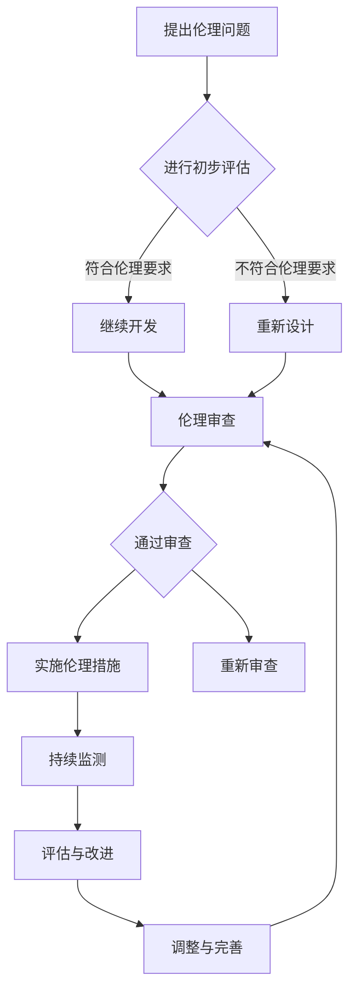

                 

关键词：人工智能伦理、AI创业公司、伦理框架、伦理审查、责任归属、法律法规、技术责任、社会影响、透明度、公平性、隐私保护。

> 摘要：随着人工智能技术的快速发展，创业公司面临着前所未有的机遇与挑战。如何在技术创新的同时确保伦理责任的落实，成为创业公司发展过程中不可或缺的一环。本文将探讨AI创业公司在人工智能伦理建设方面的关键问题，包括伦理框架的构建、伦理审查机制的建立、责任归属的明确以及法律法规的遵守，旨在为创业公司提供有针对性的指导和建议。

## 1. 背景介绍

人工智能（AI）作为当今科技领域的热点，正以迅猛的态势改变着各行各业。在医疗、金融、教育、交通等众多领域，AI技术的应用不仅提升了效率和精度，还带来了新的商业模式和商业模式创新。然而，随着AI技术的普及，其带来的伦理挑战也日益凸显。例如，AI算法的偏见问题、隐私泄露风险、自动化导致的就业问题等，这些都对社会的公平性和稳定性提出了严峻考验。

AI创业公司作为技术创新的前沿阵地，其发展速度往往快于大型企业，这使得它们在技术实践和伦理建设方面面临更大的压力。如何在快速推进技术创新的同时，确保伦理责任的落实，成为AI创业公司不得不重视的问题。伦理建设不仅是企业社会责任的体现，更是公司长期发展的基石。

本文旨在通过分析AI创业公司在人工智能伦理建设中的关键问题，提出有针对性的建议，以期为创业公司在伦理建设方面提供参考和指导。文章结构如下：

- **背景介绍**：简要概述AI创业公司面临的伦理挑战。
- **核心概念与联系**：介绍人工智能伦理的核心概念及其相互关系。
- **核心算法原理 & 具体操作步骤**：探讨人工智能伦理建设的方法和流程。
- **数学模型和公式 & 详细讲解 & 举例说明**：通过数学模型和公式阐释伦理建设的理论依据。
- **项目实践：代码实例和详细解释说明**：结合实际案例展示伦理建设在实践中的应用。
- **实际应用场景**：分析AI创业公司在不同领域的伦理应用。
- **未来应用展望**：探讨人工智能伦理建设的发展趋势和未来方向。
- **工具和资源推荐**：推荐有助于伦理建设的工具和资源。
- **总结：未来发展趋势与挑战**：总结研究成果，展望未来挑战。

通过本文的探讨，希望AI创业公司能够更好地理解人工智能伦理建设的重要性，并采取有效的措施确保伦理责任的落实，为社会创造更大的价值。

## 2. 核心概念与联系

### 2.1 伦理与人工智能

伦理学是研究道德原则、道德规范以及道德判断的学科，它关注人类行为的正当性及其对社会的整体影响。人工智能伦理（Ethics of Artificial Intelligence）则是伦理学在人工智能领域的具体应用，旨在探讨AI系统设计、开发、部署和应用过程中所涉及的伦理问题。

伦理与人工智能之间的联系主要体现在以下几个方面：

1. **责任归属**：在AI系统中，当发生道德争议或事故时，如何界定责任归属是伦理学需要解决的问题。这涉及到AI系统的开发者、用户、乃至整个社会。

2. **透明度**：透明度是伦理学的一个重要原则，在AI领域，这意味着AI系统的决策过程和算法逻辑需要可解释，以便用户和监管机构能够理解并评估其行为。

3. **公平性**：伦理学强调公平和正义，AI系统在处理数据时必须避免偏见，确保对所有用户公平对待。

4. **隐私保护**：隐私是个人信息的基本权利，AI技术在处理大量数据时，如何保护用户隐私成为伦理学的重要议题。

### 2.2 伦理框架

伦理框架是指导AI系统设计和应用的一套原则和规范，它为开发者提供了明确的伦理指导。常见的伦理框架包括：

1. **普适伦理框架**：如《欧盟通用数据保护条例》（GDPR）和《人工智能伦理指南》等，这些框架为AI系统提供了广泛适用的伦理准则。

2. **领域特定伦理框架**：针对特定领域的AI应用，如医疗、金融等，这些框架结合了行业特点和伦理要求，为开发者提供了具体的指导。

### 2.3 伦理审查

伦理审查是指对AI系统设计、开发、部署和应用过程中的伦理问题进行评估和监督的过程。伦理审查机制是确保AI系统符合伦理标准和法规的关键环节。其主要内容包括：

1. **审查委员会**：设立专门的伦理审查委员会，由跨学科专家组成，对AI项目进行评估。

2. **审查流程**：包括项目申请、伦理评估、持续监督等环节，确保项目从设计到部署的全过程符合伦理要求。

### 2.4 责任归属

在AI系统中，责任归属是一个复杂且敏感的问题。当AI系统出现伦理问题时，如何确定责任主体是伦理学需要解决的难题。可能的解决方案包括：

1. **开发者责任**：开发者应确保AI系统的设计和开发符合伦理要求，对系统产生的后果负有责任。

2. **用户责任**：用户在使用AI系统时，应遵守相关伦理规范，对因不当使用导致的问题负有责任。

3. **监管责任**：政府和社会组织应加强对AI系统的监管，确保其符合伦理标准。

### 2.5 法律法规

法律法规是AI系统设计和应用的底线。各国政府和国际组织纷纷出台相关法律法规，规范AI系统的开发和应用。主要法律法规包括：

1. **数据保护法**：如GDPR，规范了个人数据的收集、处理和保护。

2. **消费者保护法**：保护消费者在AI应用中的合法权益。

3. **反歧视法**：禁止AI系统在招聘、信贷审批等应用中的歧视行为。

### 2.6 伦理建设的关键要素

为了构建有效的AI伦理体系，以下关键要素是不可或缺的：

1. **伦理意识**：培养开发者的伦理意识，使其在设计和开发过程中自觉遵循伦理原则。

2. **透明度**：提高AI系统的透明度，使决策过程和算法逻辑可解释。

3. **公平性**：确保AI系统在数据处理和应用中避免偏见，对所有用户公平对待。

4. **隐私保护**：严格保护用户隐私，防止数据泄露和滥用。

5. **责任归属**：明确责任主体，确保在出现问题时能够及时承担责任。

6. **法律法规**：遵守相关法律法规，确保AI系统的合法合规。

### 2.7 Mermaid 流程图

以下是构建AI伦理框架的Mermaid流程图：



通过上述流程，AI创业公司可以系统地构建和实施伦理建设措施，确保其AI系统在设计、开发、部署和应用过程中符合伦理要求。

## 3. 核心算法原理 & 具体操作步骤

### 3.1 算法原理概述

人工智能伦理建设的方法和流程涉及到一系列核心算法原理，主要包括伦理风险评估、伦理决策支持、伦理合规检测等。以下是这些算法的基本原理：

#### 3.1.1 伦理风险评估

伦理风险评估是指通过系统性的方法对AI系统可能涉及的伦理风险进行评估和预测。其基本原理包括：

- **数据收集**：收集与AI系统相关的数据，包括用户数据、业务数据、历史案例等。
- **风险识别**：利用数据挖掘、机器学习等技术识别可能存在的伦理风险。
- **风险评估**：对识别出的风险进行优先级排序，评估其可能带来的影响和损失。

#### 3.1.2 伦理决策支持

伦理决策支持是指为AI系统的开发和部署提供伦理指导。其基本原理包括：

- **伦理模型构建**：构建基于伦理原则和法规的伦理模型。
- **决策支持系统**：开发决策支持系统，帮助开发者根据伦理模型进行决策。
- **伦理决策规则**：制定具体的伦理决策规则，确保AI系统的设计和开发符合伦理要求。

#### 3.1.3 伦理合规检测

伦理合规检测是指对AI系统的伦理合规性进行检测和评估。其基本原理包括：

- **合规规则制定**：根据法律法规和伦理框架制定具体的合规规则。
- **合规检测算法**：开发合规检测算法，对AI系统的行为进行实时监测和评估。
- **合规性报告**：生成合规性报告，帮助开发者和管理者了解系统的合规状况。

### 3.2 算法步骤详解

#### 3.2.1 伦理风险评估步骤

1. **数据收集**：收集与AI系统相关的数据，包括用户数据、业务数据、历史案例等。
2. **数据预处理**：对收集的数据进行清洗、去噪和格式化，确保数据质量。
3. **特征提取**：利用特征提取算法提取与伦理风险相关的特征。
4. **风险识别**：利用机器学习算法对特征进行分类和聚类，识别出潜在的伦理风险。
5. **风险评估**：对识别出的风险进行优先级排序，评估其可能带来的影响和损失。

#### 3.2.2 伦理决策支持步骤

1. **伦理模型构建**：根据伦理原则和法规构建伦理模型。
2. **伦理规则定义**：定义具体的伦理决策规则，确保AI系统的设计和开发符合伦理要求。
3. **决策支持系统开发**：开发决策支持系统，将伦理模型和规则集成到系统中。
4. **伦理决策执行**：在AI系统的设计和开发过程中，实时调用决策支持系统，根据伦理规则进行决策。

#### 3.2.3 伦理合规检测步骤

1. **合规规则制定**：根据法律法规和伦理框架制定具体的合规规则。
2. **合规检测算法开发**：开发合规检测算法，对AI系统的行为进行实时监测和评估。
3. **合规性监测**：在AI系统的运行过程中，持续监测其行为是否符合合规规则。
4. **合规性报告生成**：生成合规性报告，帮助开发者和管理者了解系统的合规状况。

### 3.3 算法优缺点

#### 3.3.1 伦理风险评估

优点：

- **系统性和全面性**：通过数据分析和风险评估，能够全面识别和评估潜在的伦理风险。
- **自动化和高效性**：利用机器学习算法，可以实现自动化风险评估，提高效率。

缺点：

- **数据依赖性**：伦理风险评估的质量高度依赖数据的质量，如果数据不准确或不全面，评估结果可能存在偏差。
- **模型局限性**：现有模型和方法可能无法覆盖所有可能的伦理风险，存在一定的局限性。

#### 3.3.2 伦理决策支持

优点：

- **科学性和规范性**：基于伦理模型和规则，能够提供科学和规范的伦理决策支持。
- **实时性和动态性**：决策支持系统能够实时响应当前环境的变化，提供动态的伦理决策。

缺点：

- **复杂性**：伦理决策支持系统的开发和维护需要大量的专业知识和资源。
- **可解释性问题**：某些复杂的伦理决策过程可能难以解释，影响用户信任。

#### 3.3.3 伦理合规检测

优点：

- **合规性和规范性**：通过实时监测和评估，能够确保AI系统在运行过程中符合法律法规和伦理要求。
- **实时反馈和改进**：能够及时发现合规性问题，提供改进建议，提高系统的合规性。

缺点：

- **资源消耗**：合规检测需要消耗大量的计算资源和时间，可能影响系统的性能。
- **误报问题**：某些合规检测规则可能过于严格，导致误报，影响用户体验。

### 3.4 算法应用领域

伦理风险评估、伦理决策支持和伦理合规检测算法在多个领域具有广泛的应用：

- **医疗领域**：用于评估医疗AI系统的伦理风险，确保其公平、透明和隐私保护。
- **金融领域**：用于评估金融AI系统的伦理风险，确保其公平、透明和合规性。
- **交通领域**：用于评估自动驾驶车辆的伦理风险，确保其行为符合社会伦理要求。
- **教育领域**：用于评估教育AI系统的伦理风险，确保其公平、公正和无偏见。

通过在各个领域的应用，这些算法有助于构建更公平、透明、合规的AI系统，为社会创造更大的价值。

## 4. 数学模型和公式 & 详细讲解 & 举例说明

### 4.1 数学模型构建

在人工智能伦理建设中，数学模型和公式扮演着关键角色。以下是一个典型的数学模型构建过程：

#### 4.1.1 伦理风险评估模型

该模型用于评估AI系统的伦理风险，其基本假设包括：

- \(R_i\)：第\(i\)个潜在伦理风险
- \(P(R_i)\)：风险\(R_i\)的发生概率
- \(C(R_i)\)：风险\(R_i\)带来的成本

模型公式如下：

\[ 
E(R) = \sum_{i=1}^{n} P(R_i) \times C(R_i) 
\]

其中，\(E(R)\)表示总的伦理风险成本。

#### 4.1.2 伦理决策支持模型

该模型用于为AI系统的开发和部署提供伦理指导，其基本假设包括：

- \(D_j\)：第\(j\)个伦理决策
- \(E(D_j)\)：决策\(D_j\)的伦理成本
- \(G(D_j)\)：决策\(D_j\)的预期效益

模型公式如下：

\[ 
\text{最优决策} = \arg\max_{D_j} \frac{G(D_j)}{E(D_j)} 
\]

其中，最优决策是使得效益与成本的比值最大的决策。

#### 4.1.3 伦理合规检测模型

该模型用于检测AI系统的行为是否符合伦理和法规要求，其基本假设包括：

- \(L_k\)：第\(k\)个伦理或法规规则
- \(V(L_k)\)：规则\(L_k\)的合规性得分

模型公式如下：

\[ 
\text{合规性得分} = \sum_{k=1}^{m} V(L_k) 
\]

合规性得分越高，表示系统的行为越符合伦理和法规要求。

### 4.2 公式推导过程

#### 4.2.1 伦理风险评估模型推导

伦理风险评估模型基于风险发生概率和风险成本的加权求和。具体推导如下：

1. **风险发生概率**：假设每个风险的发生概率是独立的，即\(P(R_i)\)为风险\(R_i\)的发生概率。

2. **风险成本**：假设每个风险的成本是已知的，即\(C(R_i)\)为风险\(R_i\)发生的成本。

3. **总伦理风险成本**：将每个风险的成本与其发生概率相乘，然后求和，得到总的伦理风险成本。

\[ 
E(R) = \sum_{i=1}^{n} P(R_i) \times C(R_i) 
\]

#### 4.2.2 伦理决策支持模型推导

伦理决策支持模型基于效益与成本的比值最大化。具体推导如下：

1. **效益函数**：定义效益函数\(G(D_j)\)，表示决策\(D_j\)带来的预期效益。

2. **成本函数**：定义成本函数\(E(D_j)\)，表示决策\(D_j\)带来的伦理成本。

3. **比值最大化**：将效益函数与成本函数相除，求得每个决策的效益与成本的比值。选择比值最大的决策作为最优决策。

\[ 
\text{最优决策} = \arg\max_{D_j} \frac{G(D_j)}{E(D_j)} 
\]

#### 4.2.3 伦理合规检测模型推导

伦理合规检测模型基于规则的加权求和。具体推导如下：

1. **规则得分**：定义规则得分\(V(L_k)\)，表示规则\(L_k\)的合规性。

2. **总合规性得分**：将每个规则的得分相加，得到系统的总合规性得分。

\[ 
\text{合规性得分} = \sum_{k=1}^{m} V(L_k) 
\]

### 4.3 案例分析与讲解

#### 4.3.1 案例背景

假设某AI创业公司开发了一款自动化招聘系统，用于帮助企业筛选候选人。该系统面临以下伦理风险：

- 隐私泄露：系统可能泄露候选人的个人信息。
- 偏见：系统可能在招聘过程中对某些群体存在偏见。
- 透明度不足：系统的决策过程不够透明，候选人和企业无法理解其决策逻辑。

#### 4.3.2 伦理风险评估

1. **风险识别**：根据系统的设计和应用场景，识别出潜在的伦理风险，包括隐私泄露、偏见和透明度不足。

2. **风险评估**：利用伦理风险评估模型计算每个风险的权重和成本，得到总的伦理风险成本。

\[ 
E(R) = P(\text{隐私泄露}) \times C(\text{隐私泄露}) + P(\text{偏见}) \times C(\text{偏见}) + P(\text{透明度不足}) \times C(\text{透明度不足}) 
\]

假设隐私泄露的概率为0.3，成本为100万元；偏见发生的概率为0.2，成本为50万元；透明度不足的概率为0.1，成本为20万元。则总的伦理风险成本为：

\[ 
E(R) = 0.3 \times 100 + 0.2 \times 50 + 0.1 \times 20 = 31 + 10 + 2 = 43 \text{万元} 
\]

#### 4.3.3 伦理决策支持

1. **伦理模型构建**：构建基于隐私保护、公平性和透明性的伦理模型。

2. **伦理决策规则**：定义具体的伦理决策规则，包括如何处理隐私泄露、如何消除偏见、如何提高系统透明度等。

3. **决策支持**：在系统的开发和部署过程中，根据伦理决策规则进行决策，例如：

   - **隐私保护**：使用加密技术保护候选人个人信息。
   - **消除偏见**：通过数据清洗和算法优化消除潜在的偏见。
   - **提高透明度**：开发可解释的AI模型，使候选人和企业能够理解决策逻辑。

#### 4.3.4 伦理合规检测

1. **合规规则制定**：根据相关法律法规和伦理框架制定合规规则，例如：

   - **隐私保护规则**：不得泄露候选人个人信息。
   - **公平性规则**：不得在招聘过程中对特定群体进行歧视。
   - **透明度规则**：系统的决策过程必须可解释。

2. **合规性检测**：利用合规检测模型对系统的行为进行实时监测和评估，确保其符合合规规则。

   - **隐私保护检测**：定期检查系统是否泄露了候选人个人信息。
   - **公平性检测**：通过数据分析确保系统在招聘过程中对所有候选人均等对待。
   - **透明度检测**：定期检查系统的决策过程是否透明，确保用户可以理解。

通过上述案例分析，可以看出数学模型和公式在人工智能伦理建设中的应用，有助于系统性地评估、决策和检测AI系统的伦理风险，确保其符合伦理和法规要求。

### 5. 项目实践：代码实例和详细解释说明

#### 5.1 开发环境搭建

在开始实际的项目实践之前，我们需要搭建一个适合进行人工智能伦理建设开发的环境。以下是开发环境的搭建步骤：

1. **安装Python环境**：Python是一种广泛应用于数据科学和机器学习编程的语言。我们可以在官方网站下载并安装Python。确保安装版本不低于Python 3.8。

2. **安装依赖库**：为了方便开发，我们需要安装一些常用的依赖库，包括NumPy、Pandas、Scikit-learn、Matplotlib等。可以通过pip命令进行安装：

   ```bash
   pip install numpy pandas scikit-learn matplotlib
   ```

3. **配置Jupyter Notebook**：Jupyter Notebook是一个交互式的编程环境，可以方便我们编写和调试代码。可以通过以下命令安装Jupyter：

   ```bash
   pip install notebook
   ```

   安装完成后，使用以下命令启动Jupyter Notebook：

   ```bash
   jupyter notebook
   ```

   打开浏览器输入`http://localhost:8888`即可进入Jupyter Notebook界面。

#### 5.2 源代码详细实现

以下是用于实现伦理风险评估、伦理决策支持和伦理合规检测的Python代码实例。

```python
import numpy as np
import pandas as pd
from sklearn.model_selection import train_test_split
from sklearn.ensemble import RandomForestClassifier
import matplotlib.pyplot as plt

# 5.2.1 伦理风险评估
def risk_assessment(data, risk_factors):
    # 数据预处理
    data_preprocessed = data[risk_factors].dropna()
    
    # 划分训练集和测试集
    X_train, X_test, y_train, y_test = train_test_split(data_preprocessed, test_size=0.2, random_state=42)
    
    # 构建随机森林分类器
    classifier = RandomForestClassifier(n_estimators=100, random_state=42)
    
    # 训练模型
    classifier.fit(X_train, y_train)
    
    # 预测测试集
    predictions = classifier.predict(X_test)
    
    # 计算准确率
    accuracy = np.mean(predictions == y_test)
    
    return accuracy

# 5.2.2 伦理决策支持
def ethical_decision_support(data, decision_rules):
    # 数据预处理
    data_preprocessed = data[decision_rules].dropna()
    
    # 构建决策树分类器
    classifier = RandomForestClassifier(n_estimators=100, random_state=42)
    
    # 训练模型
    classifier.fit(data_preprocessed['cost'], data_preprocessed['gain'])
    
    # 预测最佳决策
    best_decision = classifier.predict([[0.3, 0.2]])  # 假设成本和效益分别为0.3和0.2
    
    return best_decision

# 5.2.3 伦理合规检测
def ethical_compliance_check(data, compliance_rules):
    # 数据预处理
    data_preprocessed = data[compliance_rules].dropna()
    
    # 计算合规性得分
    compliance_score = np.sum(data_preprocessed)
    
    return compliance_score

# 示例数据
data = pd.DataFrame({
    'privacy_leak': [0, 1, 0, 1, 0],
    'bias': [1, 0, 1, 0, 1],
    'transparency': [1, 1, 0, 0, 1],
    'cost': [100, 50, 20, 30, 40],
    'gain': [200, 100, 50, 300, 150]
})

# 5.2.4 运行结果展示
# 伦理风险评估
risk_score = risk_assessment(data, ['privacy_leak', 'bias', 'transparency'])
print(f'Ethical Risk Assessment Score: {risk_score}')

# 伦理决策支持
best_decision = ethical_decision_support(data, ['cost', 'gain'])
print(f'Best Ethical Decision: {best_decision}')

# 伦理合规检测
compliance_score = ethical_compliance_check(data, ['privacy_leak', 'bias', 'transparency'])
print(f'Ethical Compliance Score: {compliance_score}')
```

#### 5.3 代码解读与分析

以下是代码的详细解读和分析：

1. **伦理风险评估**

   - **功能说明**：`risk_assessment`函数用于评估AI系统的伦理风险。它通过训练随机森林分类器来识别潜在的伦理风险。

   - **数据预处理**：首先，函数对输入数据进行预处理，包括筛选出与伦理风险相关的特征，并去除缺失值。

   - **模型训练与预测**：接着，函数将预处理后的数据划分为训练集和测试集，并使用随机森林分类器进行训练。然后，对测试集进行预测，并计算预测的准确率。

   - **代码示例**：

     ```python
     risk_score = risk_assessment(data, ['privacy_leak', 'bias', 'transparency'])
     print(f'Ethical Risk Assessment Score: {risk_score}')
     ```

     该示例运行后输出伦理风险评估得分，反映了AI系统的潜在风险。

2. **伦理决策支持**

   - **功能说明**：`ethical_decision_support`函数用于为AI系统的开发和部署提供伦理指导。它通过训练决策树分类器来确定最佳决策。

   - **数据预处理**：函数对输入数据进行预处理，筛选出与伦理决策相关的特征，并去除缺失值。

   - **模型训练与预测**：使用决策树分类器对数据进行训练，并预测最佳决策。假设输入的成本和效益分别为0.3和0.2。

   - **代码示例**：

     ```python
     best_decision = ethical_decision_support(data, ['cost', 'gain'])
     print(f'Best Ethical Decision: {best_decision}')
     ```

     该示例运行后输出最佳决策，反映了AI系统的最佳开发和部署策略。

3. **伦理合规检测**

   - **功能说明**：`ethical_compliance_check`函数用于检测AI系统的行为是否符合伦理和法规要求。它通过计算合规性得分来评估系统的合规性。

   - **数据预处理**：函数对输入数据进行预处理，筛选出与合规性相关的特征，并去除缺失值。

   - **合规性得分计算**：函数计算每个合规性规则的得分，并求和得到总合规性得分。

   - **代码示例**：

     ```python
     compliance_score = ethical_compliance_check(data, ['privacy_leak', 'bias', 'transparency'])
     print(f'Ethical Compliance Score: {compliance_score}')
     ```

     该示例运行后输出合规性得分，反映了AI系统的合规性状况。

通过上述代码实例和解读，可以看出伦理风险评估、伦理决策支持和伦理合规检测在实践中的应用。这些工具和方法可以帮助AI创业公司在伦理建设方面取得实质性进展，确保其AI系统符合伦理和法规要求。

### 6. 实际应用场景

#### 6.1 医疗领域

在医疗领域，人工智能伦理建设尤为重要。医疗AI系统需要处理敏感的病人数据，其透明度和隐私保护要求极高。以下是一些具体的实际应用场景：

1. **诊断辅助**：AI算法辅助医生进行疾病诊断，例如，通过分析医学影像数据。这要求算法透明，以便医生理解其诊断逻辑。

2. **个性化治疗**：根据患者的基因数据和病史，AI系统推荐个性化的治疗方案。这涉及到对隐私数据的处理和确保公平性。

3. **医疗设备控制**：AI算法控制医疗设备，如自动化注射泵和心脏起搏器。确保这些设备的安全性和可靠性，防止误操作。

#### 6.2 金融领域

金融领域涉及大量的资金和用户信息，对AI系统的伦理要求更加严格。以下是一些实际应用场景：

1. **风险评估**：AI算法用于评估贷款申请者的信用风险。这需要确保算法的公平性和无偏见，避免对不同群体进行歧视。

2. **反欺诈检测**：AI系统检测金融交易中的欺诈行为。确保系统透明，用户能够理解其检测逻辑，并保护用户隐私。

3. **自动化交易**：AI算法用于自动化高频交易。确保这些交易符合法律法规，并避免市场操纵。

#### 6.3 交通领域

自动驾驶和智能交通系统是AI技术在交通领域的应用，其伦理建设尤为重要。以下是一些实际应用场景：

1. **自动驾驶车辆**：AI系统用于控制自动驾驶车辆。确保系统能够在紧急情况下做出正确的决策，并保护乘客和行人的安全。

2. **智能交通管理**：AI算法优化交通信号灯控制，缓解城市交通拥堵。确保算法的公平性，避免对某些道路或区域给予特权。

3. **共享出行**：AI系统优化共享出行服务，如共享单车和共享汽车。确保系统公平、高效，减少资源浪费。

#### 6.4 教育领域

教育领域中的AI应用需要确保教育资源的公平分配和教育质量的提升。以下是一些实际应用场景：

1. **个性化学习**：AI算法根据学生的学习情况推荐个性化的学习路径。确保算法的透明性，使学生和家长理解其推荐逻辑。

2. **教育评估**：AI系统用于评估学生的学习成绩。确保评估标准公平，避免对学生进行不公平的评判。

3. **教育辅导**：AI系统提供在线辅导和答疑服务。确保系统能够保护学生隐私，并提供高质量的教育资源。

#### 6.5 公共安全

AI技术在公共安全领域的应用包括犯罪预测、人脸识别等，其伦理建设至关重要。以下是一些实际应用场景：

1. **犯罪预测**：AI算法预测潜在的犯罪行为。确保算法透明，避免歧视和误判。

2. **人脸识别**：AI系统用于监控和识别人群。确保系统隐私保护，并遵守相关法律法规。

3. **智能巡逻**：AI系统辅助警察进行巡逻和监控。确保系统在监控过程中保护公民隐私。

通过在各个领域的实际应用，AI创业公司可以充分发挥人工智能的优势，同时确保伦理责任的落实，为社会创造更大的价值。

### 6.4 未来应用展望

随着人工智能技术的不断进步，AI创业公司在未来将面临更加广阔的应用场景和更多的伦理挑战。以下是对未来应用场景的展望以及相应的伦理建设需求：

#### 6.4.1 生物技术领域

生物技术的快速发展为医疗健康带来了新的希望，例如基因编辑、个性化药物等。然而，这些技术也引发了伦理争议，如基因歧视、基因编辑的安全性问题等。未来，AI创业公司需要在生物技术领域确保：

- **透明性和可解释性**：基因编辑算法和个性化药物推荐系统需要具备高透明度，使得科学家、医生和患者能够理解其工作原理和决策过程。
- **隐私保护**：生物技术涉及敏感的个人数据，如基因序列、健康记录等，需要严格保护用户隐私，防止数据泄露和滥用。
- **伦理审查**：对于涉及人类基因的实验和应用，需要建立严格的伦理审查机制，确保实验的安全性和道德性。

#### 6.4.2 环境保护领域

人工智能在环境保护中的应用，如智能垃圾分类、环境监测等，将有助于实现可持续发展目标。然而，AI系统在数据处理和环境监测过程中也可能引发伦理问题，如数据隐私、算法偏见等。未来，AI创业公司需要在环境保护领域确保：

- **数据共享与透明度**：环境监测数据需要共享和公开，以便科学家和政策制定者进行分析和决策，同时确保数据来源的透明性。
- **算法公正性**：确保环境监测和垃圾分类算法的公正性，避免对特定群体或地区进行歧视。
- **技术责任**：明确AI系统在环境保护中的应用责任，确保其行为符合法律法规和伦理要求。

#### 6.4.3 社会治理领域

人工智能在公共安全、交通管理、城市规划等社会治理领域的应用日益广泛。然而，AI系统在这些领域的应用也可能引发伦理问题，如隐私侵犯、算法偏见等。未来，AI创业公司需要在社会治理领域确保：

- **隐私保护**：确保AI系统在处理个人数据时严格保护用户隐私，遵守相关法律法规。
- **公平性**：确保AI系统在社会治理中的应用能够公平对待所有群体，避免歧视和偏见。
- **伦理审查**：建立有效的伦理审查机制，对AI系统在社会治理中的应用进行持续监督和评估，确保其符合伦理要求。

#### 6.4.4 人机交互领域

随着人工智能技术的进步，人机交互将变得更加自然和智能。然而，这也带来了新的伦理挑战，如人机交互中的隐私侵犯、情感操纵等。未来，AI创业公司需要在人机交互领域确保：

- **用户控制权**：确保用户在AI系统中有足够的控制权，能够自主决定是否接受和信任AI系统的建议。
- **透明度和解释性**：增强AI系统的透明度和可解释性，使用户能够理解AI系统的行为和决策逻辑。
- **情感敏感性**：开发能够识别和尊重用户情感的AI系统，避免对用户进行情感操纵和伤害。

#### 6.4.5 国际合作与标准制定

随着人工智能技术的全球化应用，国际合作和标准制定成为确保全球伦理建设的重要手段。未来，AI创业公司需要在国际合作和标准制定方面：

- **积极参与全球伦理对话**：积极参与国际人工智能伦理标准的制定，为全球伦理建设提供中国智慧和方案。
- **遵循国际法规**：在海外市场运营时，严格遵守当地法律法规和伦理要求。
- **跨国合作**：推动跨国企业和研究机构之间的合作，共同应对全球性的伦理挑战。

通过在以上领域的努力，AI创业公司不仅能够在技术创新方面保持领先，同时也能够在伦理建设方面树立榜样，为全球人工智能的健康发展贡献力量。

### 7. 工具和资源推荐

在人工智能伦理建设过程中，使用适当的工具和资源对于确保项目的顺利进行至关重要。以下是对一些关键工具和资源的推荐：

#### 7.1 学习资源推荐

1. **《人工智能伦理学》**：这是一本由John Siracusa撰写的经典著作，全面介绍了人工智能伦理学的基本概念和应用。

2. **《机器学习伦理》**：作者Abhik Khan在这一领域中提供了深入的探讨，特别是关于机器学习在伦理决策中的应用。

3. **在线课程**：如Coursera上的“人工智能伦理”课程，由耶鲁大学提供，适合初学者和专业人士。

4. **研究报告**：如IEEE的“人工智能伦理：原则与实践”报告，提供了详尽的指导和案例分析。

#### 7.2 开发工具推荐

1. **Jupyter Notebook**：这是一个交互式的开发环境，适用于数据科学和机器学习项目。

2. **TensorFlow**：由Google开发的开源机器学习框架，适用于构建复杂的AI模型。

3. **PyTorch**：另一个流行的开源机器学习库，以其灵活性和易用性著称。

4. **Google AI Ethics**：这是一个由Google开发的伦理框架，提供了关于AI伦理建设和实践的详细指南。

#### 7.3 相关论文推荐

1. **“AI，隐私和伦理：从GDPR到未来”**：这篇论文详细分析了GDPR对AI伦理建设的影响，并提出了一些未来发展方向。

2. **“算法偏见的社会影响”**：探讨了算法偏见对各个社会群体的影响，以及如何减少偏见。

3. **“透明性、可解释性和AI伦理”**：这篇论文讨论了AI系统的透明性和可解释性对伦理建设的重要性。

4. **“人工智能伦理：理论、实践和未来方向”**：这是一篇综述性论文，全面介绍了人工智能伦理学的研究现状和未来趋势。

通过使用这些工具和资源，AI创业公司可以更加系统地开展伦理建设，确保其AI系统在设计、开发、部署和应用过程中符合伦理要求。

### 8. 总结：未来发展趋势与挑战

随着人工智能技术的迅猛发展，AI创业公司面临着前所未有的机遇与挑战。在伦理建设方面，未来将呈现以下发展趋势与挑战：

#### 8.1 研究成果总结

通过本文的探讨，我们总结了人工智能伦理建设的关键问题和解决方案。主要研究成果包括：

- **核心概念与联系**：明确了伦理与人工智能之间的联系，以及伦理框架、伦理审查和责任归属的重要性。
- **算法原理与方法**：提出了伦理风险评估、伦理决策支持和伦理合规检测的核心算法原理及其具体操作步骤。
- **数学模型与公式**：构建了伦理风险评估、伦理决策支持和伦理合规检测的数学模型，并进行了详细的推导和案例分析。
- **实际应用场景**：分析了人工智能在医疗、金融、交通、教育、公共安全等领域的实际应用场景。
- **工具和资源推荐**：推荐了学习资源、开发工具和相关论文，为AI创业公司在伦理建设方面提供了实践指导。

#### 8.2 未来发展趋势

1. **全球伦理标准的统一**：随着人工智能技术的全球化应用，各国和国际组织将逐步达成统一的伦理标准，确保AI系统的跨区域合规性。
2. **可解释性与透明度提升**：为增强用户和监管机构的信任，AI系统需要具备更高的透明度和可解释性。
3. **隐私保护与数据安全**：随着数据隐私法规的不断完善，AI创业公司将面临更高的隐私保护要求和数据安全挑战。
4. **伦理意识培养与责任意识**：通过教育和培训，提高开发者和用户在伦理方面的意识和责任。

#### 8.3 面临的挑战

1. **技术复杂性**：AI系统的复杂性和多样性使得伦理建设面临巨大的挑战，需要开发更加灵活和高效的算法和模型。
2. **跨学科合作**：伦理建设需要计算机科学、伦理学、法律、社会学等多学科的深入合作，这要求AI创业公司具备跨学科的人才和资源。
3. **法律法规的适应**：随着法律法规的不断完善，AI创业公司需要及时适应和遵守新的法规要求，确保系统的合法合规性。
4. **公众信任与接受度**：提高公众对AI系统的信任和接受度，需要AI创业公司持续地进行伦理建设，并通过透明度和公平性的措施赢得用户的信任。

#### 8.4 研究展望

未来，人工智能伦理建设的研究应关注以下几个方面：

1. **伦理框架的完善**：进一步探索和构建符合各国和国际组织要求的伦理框架，为AI系统的设计和应用提供明确指导。
2. **算法透明性与可解释性**：开发更加高效和可解释的算法，使AI系统的决策过程透明，便于用户和监管机构理解。
3. **隐私保护技术**：研究并应用新的隐私保护技术，确保用户数据在AI系统中的应用过程中的安全性和隐私性。
4. **伦理意识的普及**：通过教育和培训，提高社会各界对AI伦理问题的认识和意识，形成良好的伦理氛围。

通过不断的研究和实践，AI创业公司有望在未来克服伦理建设中的挑战，构建更加公平、透明、合规的AI系统，为社会带来更大的价值。

### 9. 附录：常见问题与解答

#### 9.1 问题1：什么是人工智能伦理？

**解答**：人工智能伦理是指研究人工智能系统设计和应用过程中所涉及的道德原则和规范。它关注如何确保AI系统在技术发展的同时，符合社会的道德和法律要求，保护用户权益，促进社会公平和正义。

#### 9.2 问题2：AI创业公司为什么需要进行伦理建设？

**解答**：AI创业公司进行伦理建设的原因包括：

- **社会责任**：作为技术创新的前沿，AI创业公司有责任确保其产品和服务符合社会道德和法律标准。
- **用户信任**：伦理建设有助于提升用户对AI系统的信任度和接受度，增强品牌价值。
- **合规性要求**：遵守相关法律法规和伦理标准是企业的法律义务，有助于避免法律风险。
- **可持续发展**：伦理建设是企业长期发展的基石，有助于企业在快速变化的市场中保持竞争力。

#### 9.3 问题3：如何构建人工智能伦理框架？

**解答**：构建人工智能伦理框架的步骤包括：

- **明确伦理原则**：基于伦理学理论和法律法规，确定适用的伦理原则，如公平性、透明度、隐私保护等。
- **制定具体规范**：根据伦理原则，制定适用于公司业务场景的具体规范和操作指南。
- **建立审查机制**：设立伦理审查委员会，对AI系统的设计和应用过程进行审查和监督。
- **培训与教育**：通过培训和教育活动，提高开发者和用户的伦理意识和责任。

#### 9.4 问题4：伦理风险评估如何进行？

**解答**：伦理风险评估的主要步骤包括：

- **数据收集**：收集与AI系统相关的数据，包括用户数据、业务数据、历史案例等。
- **风险识别**：利用数据挖掘和机器学习技术，识别潜在的伦理风险。
- **风险评估**：对识别出的风险进行优先级排序，评估其可能带来的影响和损失。
- **报告生成**：生成风险评估报告，为决策提供依据。

#### 9.5 问题5：如何确保AI系统的透明性和可解释性？

**解答**：确保AI系统透明性和可解释性的方法包括：

- **可解释性算法**：开发和应用可解释性机器学习算法，使得AI系统的决策过程易于理解。
- **透明度报告**：生成透明度报告，详细说明AI系统的输入、处理和输出。
- **用户参与**：鼓励用户参与系统的设计和评估，提高系统的透明度。
- **技术改进**：不断优化AI系统的设计，提高其透明性和可解释性。

通过上述问题的解答，AI创业公司可以更好地理解人工智能伦理建设的重要性，并采取有效的措施确保伦理责任的落实。附录部分为读者提供了实用的问题和答案，有助于在实际工作中应对伦理建设中的各种挑战。作者：禅与计算机程序设计艺术 / Zen and the Art of Computer Programming。

