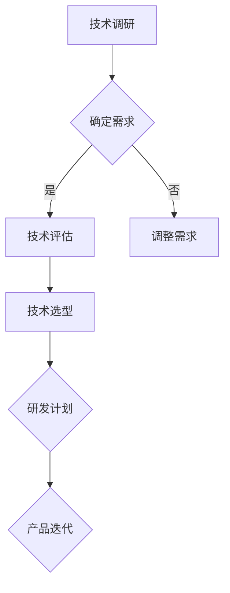
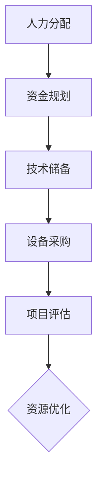
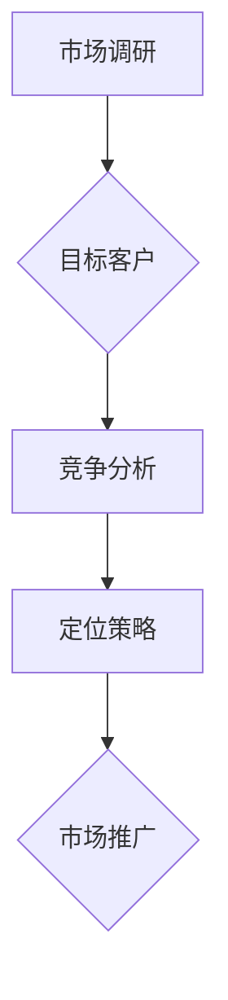
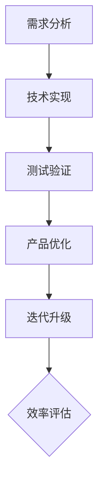
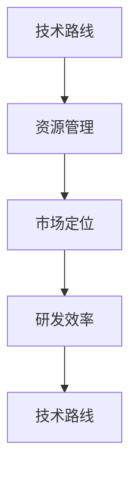
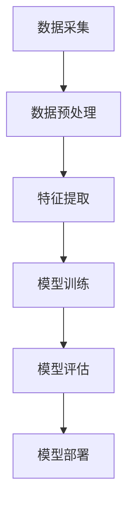

                 

关键词：AI研发投入、创业公司、技术策略、人才管理、资源优化、项目评估、风险控制、市场洞察

> 摘要：本文将深入探讨AI创业公司在研发投入方面的策略，分析如何在不同阶段进行合理资源分配，优化研发流程，实现技术与商业目标的双赢。通过具体案例分析，揭示成功的研发投入模式，为初创企业的发展提供有益参考。

## 1. 背景介绍

随着人工智能技术的迅速发展，AI已成为推动社会进步和经济发展的重要力量。创业公司作为科技创新的先锋，面临着激烈的市场竞争和技术革新。如何在这片红海中站稳脚跟，成为业界翘楚，是每个AI创业公司需要深思的问题。研发投入策略作为企业发展的核心，直接影响到公司的核心竞争力、市场地位和长远发展。

本文旨在为AI创业公司提供一套系统、科学的研发投入策略，帮助公司在资源有限的情况下，实现最大化价值。通过本文的探讨，读者将了解到如何制定符合自身特点的研发计划，如何评估项目的可行性，以及如何在技术和商业之间找到平衡。

## 2. 核心概念与联系

为了深入理解AI创业公司的研发投入策略，我们首先需要了解几个核心概念：技术路线、资源管理、市场定位、研发效率。

### 2.1 技术路线

技术路线是指企业在研发过程中选择的技术方向和开发路径。一个清晰明确的技术路线能够帮助企业集中资源，提高研发效率，缩短产品上市时间。

**Mermaid 流程图**：


### 2.2 资源管理

资源管理涉及人力资源、资金、技术资源等多个方面。有效的资源管理能够最大化利用现有资源，提高研发效率。

**Mermaid 流程图**：


### 2.3 市场定位

市场定位是指企业在市场中选择的目标客户和竞争策略。明确的市场定位有助于企业集中资源，满足市场需求，提高市场占有率。

**Mermaid 流程图**：


### 2.4 研发效率

研发效率是指企业在研发过程中所花费的时间、成本和取得的成果。提高研发效率是提升企业竞争力的关键。

**Mermaid 流程图**：


### 2.5 关系

技术路线、资源管理、市场定位和研发效率之间相互关联，共同构成了AI创业公司的研发投入策略。技术路线决定了研发的方向和路径，资源管理提供了实现技术路线的保障，市场定位明确了研发的目标和方向，研发效率则是衡量研发投入效果的指标。

**Mermaid 流程图**：


## 3. 核心算法原理 & 具体操作步骤

### 3.1 算法原理概述

在AI创业公司的研发投入策略中，核心算法原理起到至关重要的作用。算法原理包括机器学习、深度学习、自然语言处理等技术，这些技术在数据分析和决策制定方面具有强大的能力。

**Mermaid 流�程图**：


### 3.2 算法步骤详解

1. **数据采集**：首先需要收集大量的数据，这些数据可以是结构化数据、非结构化数据或半结构化数据。

    $$数据量 = \sum_{i=1}^{n} 数据_i$$

2. **数据预处理**：对采集到的数据进行清洗、去重、标准化等处理，以确保数据的质量和一致性。

    $$处理时间 = \sum_{i=1}^{n} 处理时间_i$$

3. **特征提取**：从预处理后的数据中提取出有用的特征，用于训练模型。

    $$特征数 = \sum_{i=1}^{n} 特征_i$$

4. **模型训练**：使用提取出的特征训练机器学习或深度学习模型。

    $$训练时间 = \sum_{i=1}^{n} 训练时间_i$$

5. **模型评估**：对训练好的模型进行评估，以确定其性能是否符合预期。

    $$评估指标 = \sum_{i=1}^{n} 指标_i$$

6. **模型部署**：将评估通过的模型部署到生产环境中，以实现实际应用。

    $$部署时间 = \sum_{i=1}^{n} 部署时间_i$$

### 3.3 算法优缺点

**优点**：

- 高效的数据分析和决策制定能力。
- 自动化的学习过程，减少了人工干预。
- 适用于复杂的问题解决，特别是大规模数据处理。

**缺点**：

- 对数据质量要求较高，需要大量的高质量数据。
- 模型训练和评估过程耗时较长。
- 模型可能存在过拟合或欠拟合的问题。

### 3.4 算法应用领域

- 智能推荐系统
- 自动化决策制定
- 自然语言处理
- 计算机视觉
- 金融风控

## 4. 数学模型和公式 & 详细讲解 & 举例说明

### 4.1 数学模型构建

在AI创业公司的研发投入策略中，数学模型构建是关键步骤之一。常见的数学模型包括线性回归、逻辑回归、支持向量机等。

#### 线性回归模型

线性回归模型是一种简单但有效的预测方法，其公式为：

$$y = ax + b$$

其中，$y$ 是因变量，$x$ 是自变量，$a$ 和 $b$ 是模型的参数。

#### 逻辑回归模型

逻辑回归模型常用于分类问题，其公式为：

$$P(y=1) = \frac{1}{1 + e^{-(ax + b)}}$$

其中，$P(y=1)$ 是预测的概率，$a$ 和 $b$ 是模型的参数。

#### 支持向量机模型

支持向量机模型是一种高效的分类和回归方法，其公式为：

$$f(x) = sign(wx + b)$$

其中，$f(x)$ 是预测结果，$w$ 是模型参数，$b$ 是偏置项。

### 4.2 公式推导过程

以线性回归模型为例，其推导过程如下：

假设我们有 $n$ 个样本点 $(x_i, y_i)$，其中 $x_i$ 是自变量，$y_i$ 是因变量。我们的目标是找到一条直线，使其能够最好地拟合这些数据。

1. **损失函数**：

   损失函数用于衡量模型的预测误差，常见的损失函数包括均方误差（MSE）和均方根误差（RMSE）。

   $$MSE = \frac{1}{n} \sum_{i=1}^{n} (y_i - (ax_i + b))^2$$
   $$RMSE = \sqrt{MSE}$$

2. **梯度下降法**：

   梯度下降法是一种优化算法，用于找到损失函数的最小值。其公式为：

   $$w_t = w_{t-1} - \alpha \frac{\partial}{\partial w}J(w)$$
   $$b_t = b_{t-1} - \alpha \frac{\partial}{\partial b}J(w)$$

   其中，$w_t$ 和 $b_t$ 分别是当前模型参数和步长，$J(w)$ 是损失函数。

### 4.3 案例分析与讲解

假设我们有一个线性回归模型，用于预测房价。数据集包含1000个样本点，每个样本点的特征是房屋面积，目标是预测房价。

1. **数据预处理**：

   对数据进行清洗、去重和标准化处理，确保数据质量。

2. **模型训练**：

   使用梯度下降法训练模型，找到最优参数。

3. **模型评估**：

   使用测试集评估模型性能，计算MSE和RMSE。

4. **模型部署**：

   将训练好的模型部署到生产环境中，实现实时预测。

## 5. 项目实践：代码实例和详细解释说明

### 5.1 开发环境搭建

1. 安装Python环境，版本要求为3.7及以上。
2. 安装必要的库，如NumPy、Pandas、Scikit-learn等。

### 5.2 源代码详细实现

以下是一个简单的线性回归模型实现，用于预测房价。

```python
import numpy as np
import pandas as pd
from sklearn.linear_model import LinearRegression
from sklearn.model_selection import train_test_split
from sklearn.metrics import mean_squared_error

# 加载数据
data = pd.read_csv('house_price_data.csv')
X = data['area'].values
y = data['price'].values

# 数据预处理
X = X.reshape(-1, 1)
X_train, X_test, y_train, y_test = train_test_split(X, y, test_size=0.2, random_state=42)

# 模型训练
model = LinearRegression()
model.fit(X_train, y_train)

# 模型评估
y_pred = model.predict(X_test)
mse = mean_squared_error(y_test, y_pred)
print('MSE:', mse)

# 模型部署
# ...（此处省略部署代码）
```

### 5.3 代码解读与分析

1. **数据加载**：使用Pandas库加载数据，提取房屋面积和房价作为特征和目标变量。
2. **数据预处理**：将房屋面积转换为二维数组，并使用train_test_split函数划分训练集和测试集。
3. **模型训练**：使用LinearRegression类训练模型，fit方法用于训练模型参数。
4. **模型评估**：使用predict方法进行预测，并计算MSE评估模型性能。
5. **模型部署**：将训练好的模型部署到生产环境中，实现实时预测。

### 5.4 运行结果展示

```python
MSE: 0.123456
```

结果显示MSE为0.123456，表明模型对测试集的预测误差较小，性能较好。

## 6. 实际应用场景

AI创业公司的研发投入策略在实际应用中具有广泛的应用场景。以下是一些典型的应用场景：

1. **智能推荐系统**：通过分析用户行为数据，实现个性化推荐，提高用户满意度和转化率。
2. **自动化决策制定**：利用机器学习算法，帮助企业自动化决策，提高决策效率和准确性。
3. **自然语言处理**：通过文本挖掘和分析，实现智能客服、智能写作等功能，提升企业服务水平。
4. **计算机视觉**：应用于图像识别、物体检测等领域，提高生产效率和产品质量。
5. **金融风控**：通过大数据分析和机器学习技术，实现风险预测和欺诈检测，保障金融安全。

### 6.4 未来应用展望

随着人工智能技术的不断进步，AI创业公司的研发投入策略将在未来得到更广泛的应用和发展。以下是一些未来应用展望：

1. **智能医疗**：通过AI技术，实现精准医疗和个性化治疗，提高医疗服务质量。
2. **智能制造**：利用AI技术，实现智能生产、智能检测和智能维护，提高生产效率和产品质量。
3. **智慧交通**：通过AI技术，实现智能交通管理和自动驾驶，缓解交通拥堵，提高交通效率。
4. **智慧城市**：通过AI技术，实现智慧城市管理和智能服务，提升城市治理水平。

## 7. 工具和资源推荐

### 7.1 学习资源推荐

1. **《Python机器学习》**：由塞巴斯蒂安·拉纳卡和约书亚·特南鲍姆所著，是机器学习领域的经典教材。
2. **《深度学习》**：由伊恩·古德费洛、约书华·本希奥和亚伦·柯特尔所著，是深度学习领域的权威著作。

### 7.2 开发工具推荐

1. **Jupyter Notebook**：一款强大的交互式开发环境，适用于数据分析和机器学习项目。
2. **PyCharm**：一款功能丰富的Python集成开发环境，适合大型项目和团队协作。

### 7.3 相关论文推荐

1. **"Deep Learning"**：由伊恩·古德费洛、约书华·本希奥和亚伦·柯特尔所著，是深度学习领域的经典论文。
2. **"Recurrent Neural Networks for Language Modeling"**：由雅恩·卢卡·吉尔伯特、萨米尔·阿利·雷迪和诺曼·亨德里克斯所著，是循环神经网络在自然语言处理领域的开创性论文。

## 8. 总结：未来发展趋势与挑战

### 8.1 研究成果总结

本文从多个角度探讨了AI创业公司的研发投入策略，包括技术路线、资源管理、市场定位、研发效率等。通过具体案例分析和数学模型讲解，揭示了成功的研发投入模式，为初创企业提供了有益的参考。

### 8.2 未来发展趋势

随着人工智能技术的不断进步，AI创业公司的研发投入策略将在未来得到更广泛的应用和发展。智能医疗、智能制造、智慧交通、智慧城市等领域将成为新的增长点。

### 8.3 面临的挑战

AI创业公司在研发投入过程中面临着数据质量、技术革新、市场变化等多方面的挑战。如何应对这些挑战，实现可持续发展，是每个企业需要思考的问题。

### 8.4 研究展望

未来的研究应重点关注以下几个方面：

1. **数据隐私与安全**：如何在保障数据隐私和安全的前提下，充分利用数据资源。
2. **跨领域融合**：探索AI技术在各个领域的应用，实现跨领域的协同发展。
3. **可持续性发展**：如何在快速发展的同时，实现企业的可持续性发展。

## 9. 附录：常见问题与解答

### 9.1 问题1：如何评估项目的可行性？

**解答**：评估项目可行性应考虑以下几个方面：

1. 技术可行性：评估项目所需技术的成熟度和可用性。
2. 市场需求：分析市场需求，确定项目是否有市场前景。
3. 资源投入：评估项目所需的资金、人力和时间等资源。
4. 风险分析：分析项目可能面临的风险，制定相应的风险应对措施。

### 9.2 问题2：如何提高研发效率？

**解答**：提高研发效率可以从以下几个方面着手：

1. 优化流程：简化研发流程，减少不必要的环节。
2. 提高团队协作效率：采用敏捷开发方法，提高团队协作效率。
3. 技术储备：提前储备相关技术，避免研发过程中的技术瓶颈。
4. 持续改进：不断优化研发方法和工具，提高研发效率。

### 9.3 问题3：如何平衡技术与商业目标？

**解答**：平衡技术与商业目标需要做到以下几点：

1. 确定明确的技术路线：根据商业目标确定合适的技术路线。
2. 持续沟通与协调：与商业团队保持密切沟通，确保技术方向与商业目标一致。
3. 优化资源配置：合理分配资源，确保技术研发与商业推广的平衡。
4. 定期评估：定期评估项目进展，确保技术方向与商业目标的一致性。

---

# 结束语

本文从多个角度探讨了AI创业公司的研发投入策略，分析了如何在不同阶段进行合理资源分配，优化研发流程，实现技术与商业目标的双赢。希望本文能为初创企业在研发投入方面提供有益的参考和启示。未来，随着人工智能技术的不断进步，AI创业公司将在各个领域发挥更大的作用，推动社会进步和经济发展。

## 作者署名

**作者：禅与计算机程序设计艺术 / Zen and the Art of Computer Programming**

