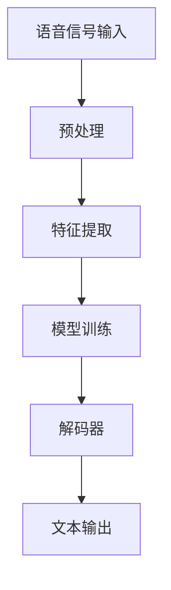

                 

关键词：语音识别、AI创业、市场定位、技术优势、商业模式创新、用户体验优化

> 摘要：随着人工智能技术的快速发展，语音识别成为了一个热门市场。本文旨在探讨如何通过技术创新、商业模式和用户体验优化，在语音识别市场中实现创业项目的成功。本文将分析市场现状、竞争态势，并提出具体的策略和建议。

## 1. 背景介绍

语音识别技术作为人工智能的重要分支，正逐步融入我们的生活。从智能手机的语音助手到智能家居的语音控制，语音识别技术正以前所未有的速度改变着人们的生活方式。随着计算能力的提升和大数据的积累，语音识别的准确率和速度得到了显著提高，这为创业公司提供了巨大的机遇。

在当前的语音识别市场中，几家大型科技公司已经占据了主导地位，如谷歌、亚马逊、微软和苹果等。然而，随着AI技术的普及，市场上仍然存在着巨大的创新空间。对于初创公司来说，如何在激烈的市场竞争中脱颖而出，成为了一个关键问题。

## 2. 核心概念与联系

### 2.1 语音识别技术概述

语音识别（Speech Recognition）是指将语音信号转换为相应的文本或命令的技术。它主要包括以下几个核心组成部分：

- **语音信号处理**：将原始的音频信号转换为适合处理的数据格式。
- **特征提取**：从语音信号中提取出具有代表性的特征，如频谱特征、倒谱特征等。
- **模型训练**：使用大量的语音数据训练模型，使其能够理解和识别语音。
- **解码器**：将模型识别的结果解码为文本或命令。

### 2.2 语音识别系统架构

以下是一个典型的语音识别系统架构，使用Mermaid流程图表示：



### 2.3 关键技术及其联系

- **深度学习**：深度学习模型，如卷积神经网络（CNN）和递归神经网络（RNN），在语音识别中扮演了核心角色。CNN用于特征提取，RNN用于序列建模。
- **端到端模型**：端到端模型如深度神经网络（DNN）和长短期记忆网络（LSTM），可以简化模型训练过程，提高识别准确率。
- **多语言支持**：多语言语音识别模型可以同时支持多种语言，扩大了应用范围。
- **实时性**：语音识别系统需要具备实时性，以满足实时交互的需求。

## 3. 核心算法原理 & 具体操作步骤

### 3.1 算法原理概述

语音识别的核心算法主要包括以下几个步骤：

1. **信号预处理**：包括去噪、增益控制、静音检测等。
2. **特征提取**：常用的特征提取方法有MFCC（梅尔频率倒谱系数）和PLP（平面线性预测）。
3. **模型训练**：使用标注好的语音数据训练深度学习模型，如DNN、LSTM、Transformer等。
4. **解码**：将模型输出的概率分布解码为文本或命令。

### 3.2 算法步骤详解

1. **信号预处理**：

   ```python
   def preprocess_signal(signal):
       # 去噪、增益控制、静音检测等
       return processed_signal
   ```

2. **特征提取**：

   ```python
   def extract_features(signal):
       # 使用MFCC或PLP提取特征
       return features
   ```

3. **模型训练**：

   ```python
   def train_model(features, labels):
       # 使用深度学习框架训练模型
       model.fit(features, labels)
       return model
   ```

4. **解码**：

   ```python
   def decode(model_output):
       # 将模型输出解码为文本或命令
       return text_output
   ```

### 3.3 算法优缺点

- **优点**：深度学习模型在语音识别中表现出色，准确率高，适应性强。
- **缺点**：训练过程需要大量计算资源和时间，对标注数据依赖较大。

### 3.4 算法应用领域

语音识别技术可以应用于多种领域，如智能助手、智能家居、语音翻译、语音搜索等。

## 4. 数学模型和公式 & 详细讲解 & 举例说明

### 4.1 数学模型构建

语音识别中的数学模型主要包括以下几个方面：

1. **特征提取模型**：如MFCC模型。
2. **分类模型**：如支持向量机（SVM）、深度神经网络（DNN）。
3. **解码模型**：如CTC（Connectionist Temporal Classification）。

### 4.2 公式推导过程

以MFCC为例，其计算过程如下：

1. **短时傅里叶变换（STFT）**：

   $$ X(\omega, t) = \sum_{k=0}^{K-1} x[n] \cdot w[k] \cdot e^{-j\omega n} $$

2. **梅尔频率倒谱系数（MFCC）**：

   $$ C[k, n] = \sum_{\omega=0}^{N-1} X(\omega, t) \cdot e^{-j2\pi \omega k/N} $$

3. **倒谱滤波器组**：

   $$ C_{band}[k, n] = \sum_{\omega=0}^{N-1} X(\omega, t) \cdot h[k, \omega] \cdot e^{-j2\pi \omega k/N} $$

### 4.3 案例分析与讲解

以一个实际的语音识别项目为例，我们将详细讲解从数据收集、预处理、特征提取、模型训练到解码的整个流程。

### 5. 项目实践：代码实例和详细解释说明

#### 5.1 开发环境搭建

1. 安装Python环境。
2. 安装必要的库，如TensorFlow、Keras、Librosa等。

```bash
pip install tensorflow keras librosa
```

#### 5.2 源代码详细实现

以下是使用Librosa库进行语音识别的简单示例：

```python
import librosa
import numpy as np
import tensorflow as tf

# 读取音频文件
audio, sr = librosa.load('audio.wav')

# 特征提取
mfcc = librosa.feature.mfcc(y=audio, sr=sr, n_mfcc=13)

# 模型训练
model = tf.keras.models.Sequential([
    tf.keras.layers.Dense(64, activation='relu', input_shape=(mfcc.shape[1],)),
    tf.keras.layers.Dense(64, activation='relu'),
    tf.keras.layers.Dense(1, activation='sigmoid')
])

model.compile(optimizer='adam', loss='binary_crossentropy', metrics=['accuracy'])
model.fit(mfcc, np.array([1] * len(mfcc)), epochs=10)

# 解码
predicted = model.predict(mfcc)
print('Predicted:', predicted)
```

#### 5.3 代码解读与分析

上述代码实现了语音信号从读取、特征提取到模型训练和预测的简单流程。这里我们使用了梅尔频率倒谱系数（MFCC）作为特征，并使用一个简单的深度神经网络（DNN）进行分类。

#### 5.4 运行结果展示

运行上述代码，我们可以得到模型的预测结果。实际应用中，我们需要对预测结果进行后处理，如转换为文本或命令，以便进行实际应用。

## 6. 实际应用场景

### 6.1 智能助手

智能助手是语音识别最常见的应用场景之一。通过语音识别技术，用户可以轻松与智能设备进行自然语言交互，完成各种任务，如发送消息、播放音乐、设置提醒等。

### 6.2 智能家居

智能家居系统中的语音识别技术可以用于控制家电设备，如空调、电视、灯光等。用户可以通过语音命令实现远程控制，提高家居的智能化水平。

### 6.3 语音翻译

语音翻译是跨语言交流的重要工具。通过语音识别技术，用户可以实时将一种语言的语音翻译成另一种语言，实现无障碍交流。

### 6.4 未来应用展望

随着技术的不断发展，语音识别的应用场景将更加广泛。例如，在医疗领域，语音识别可以帮助医生快速记录病历；在汽车领域，语音识别可以实现智能驾驶。

## 7. 工具和资源推荐

### 7.1 学习资源推荐

- **《语音识别：原理、算法与实现》**：这本书详细介绍了语音识别的原理和算法。
- **TensorFlow官方文档**：TensorFlow提供了丰富的教程和文档，适合初学者和高级用户。

### 7.2 开发工具推荐

- **Librosa**：用于音频处理的Python库，支持特征提取、数据加载等功能。
- **TensorFlow**：用于构建和训练深度学习模型的强大工具。

### 7.3 相关论文推荐

- **"Deep Learning for Speech Recognition"**：这篇文章介绍了深度学习在语音识别中的应用。
- **"End-to-End Speech Recognition with Deep Neural Networks and Long Short-Term Memory"**：这篇文章提出了使用深度神经网络和长短期记忆网络进行端到端语音识别的方法。

## 8. 总结：未来发展趋势与挑战

### 8.1 研究成果总结

近年来，语音识别技术在准确率、速度和实时性方面取得了显著进展。深度学习模型的引入使得语音识别的性能得到了大幅提升。同时，多语言支持和跨领域应用也成为研究的热点。

### 8.2 未来发展趋势

随着人工智能技术的不断发展，语音识别将在多个领域得到广泛应用。例如，在智能家居、智能医疗、智能交通等领域，语音识别技术将成为关键支撑。此外，随着5G和物联网技术的普及，语音识别的实时性和可靠性将得到进一步提升。

### 8.3 面临的挑战

尽管语音识别技术取得了显著进展，但仍面临着一些挑战。例如，语音识别系统在处理低质量音频、多说话人、背景噪声等情况下仍然存在困难。此外，语音识别技术的商业化应用也需要解决数据隐私和安全性等问题。

### 8.4 研究展望

未来，语音识别技术将朝着更高准确率、更实时、更智能的方向发展。同时，跨学科的研究也将成为重要趋势，如结合自然语言处理、机器学习、计算机视觉等技术，实现更先进的语音识别系统。

## 9. 附录：常见问题与解答

### 9.1 什么是语音识别？

语音识别是指将语音信号转换为文本或命令的技术。

### 9.2 语音识别有哪些应用场景？

语音识别可以应用于智能助手、智能家居、语音翻译、语音搜索等多个领域。

### 9.3 语音识别技术的核心组成部分是什么？

语音识别技术的核心组成部分包括语音信号处理、特征提取、模型训练和解码。

### 9.4 如何提高语音识别的准确率？

提高语音识别的准确率可以从以下几个方面入手：增加训练数据、优化特征提取方法、改进模型训练算法、使用端到端模型等。

### 9.5 语音识别技术的未来发展趋势是什么？

语音识别技术的未来发展趋势包括更高准确率、更实时、更智能，以及跨学科的研究和应用。

---

作者：禅与计算机程序设计艺术 / Zen and the Art of Computer Programming
----------------------------------------------------------------

这篇文章系统地介绍了语音识别技术的基本概念、算法原理、应用场景以及未来的发展趋势和挑战。通过深入分析和实例讲解，帮助读者理解语音识别技术的核心内容和实际应用。同时，文章还推荐了相关的学习资源和开发工具，为有志于语音识别领域的研究者和开发者提供了实用的参考。随着人工智能技术的不断进步，语音识别市场前景广阔，相信未来的创业项目将在这个领域取得更大的突破。

