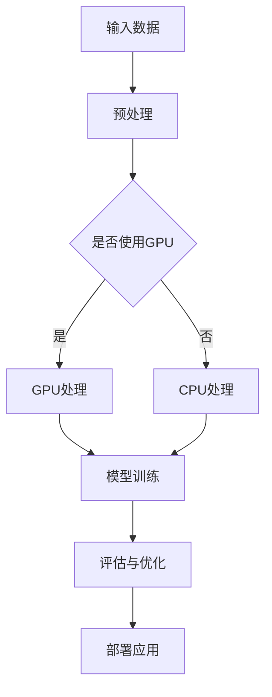

                 

关键词：贾扬清，异构芯片，大语言模型，AI发展，前景展望

> 摘要：本文旨在探讨人工智能领域专家贾扬清关于异构芯片大语言模型发展的观点。通过对异构芯片与大语言模型的关系分析，本文将深入解析其原理、算法和应用，展望未来发展趋势和挑战。

## 1. 背景介绍

在人工智能（AI）的快速发展中，计算能力成为了制约其进一步提升的主要瓶颈。为了突破这一瓶颈，异构计算技术应运而生。异构芯片是将不同类型的处理器集成在同一硬件平台上，以便更好地处理不同类型的工作负载。而大语言模型（如GPT-3、ChatGPT等）作为AI领域的重要创新，具有强大的自然语言处理能力。

贾扬清，世界级人工智能专家，曾担任百度AI研究院副院长，现任英伟达深度学习研究总监，其对异构芯片大语言模型的发展有着独特的见解。

## 2. 核心概念与联系

### 2.1 异构芯片

异构芯片包含多种处理器，如CPU、GPU、TPU等，各自具有不同的计算能力和特点。CPU擅长处理通用计算任务，GPU擅长并行计算和图形处理，TPU则专注于机器学习任务。

### 2.2 大语言模型

大语言模型通过深度学习算法从海量数据中学习语言规律，具备强大的自然语言处理能力。其核心在于能够理解、生成和翻译自然语言，应用于聊天机器人、文本生成、机器翻译等多个领域。

### 2.3 Mermaid流程图



## 3. 核心算法原理 & 具体操作步骤

### 3.1 算法原理概述

异构芯片大语言模型通过将不同类型的处理器整合在一起，利用GPU的并行计算能力和TPU的机器学习优化能力，实现高效的模型训练和推理。

### 3.2 算法步骤详解

1. 输入数据预处理：对原始数据（如文本、语音等）进行清洗、分词、编码等处理。
2. GPU处理：利用GPU的并行计算能力，对预处理后的数据进行大规模特征提取和建模。
3. TPU处理：利用TPU的机器学习优化能力，对模型进行训练和优化。
4. 评估与优化：对训练好的模型进行评估，根据评估结果进行模型优化。
5. 部署应用：将优化后的模型部署到实际应用场景中，如聊天机器人、文本生成等。

### 3.3 算法优缺点

优点：
- 高效：利用异构芯片的并行计算能力，大大提高了模型训练和推理的速度。
- 优化：通过GPU和TPU的协同工作，实现了模型性能的进一步提升。

缺点：
- 开发难度：异构芯片的开发和优化相对复杂，需要一定的技术积累。
- 成本：异构芯片的成本较高，对中小型企业和个人开发者来说可能是一个挑战。

### 3.4 算法应用领域

异构芯片大语言模型在多个领域具有广泛的应用，如：
- 聊天机器人：通过自然语言处理技术，实现与用户的智能对话。
- 文本生成：生成高质量的文章、报告等，应用于内容创作、自动化写作等领域。
- 机器翻译：实现多种语言的翻译，提高跨语言交流的效率。
- 情感分析：对文本进行情感分析，应用于情感识别、舆情监控等领域。

## 4. 数学模型和公式 & 详细讲解 & 举例说明

### 4.1 数学模型构建

大语言模型通常采用循环神经网络（RNN）或变换器（Transformer）等深度学习模型。以下以Transformer模型为例，介绍其数学模型构建。

### 4.2 公式推导过程

```latex
\text{输入序列} X = [x_1, x_2, ..., x_n]
\text{输出序列} Y = [y_1, y_2, ..., y_n]
\text{嵌入向量} e_i = \text{Embed}(x_i)
\text{位置编码向量} p_i = \text{PositionalEncoding}(i)
\text{编码器输出} C = \text{Encoder}(e_i + p_i)
\text{解码器输出} D = \text{Decoder}(C, e_i + p_i)
\text{损失函数} L = \text{Loss}(D, Y)
```

### 4.3 案例分析与讲解

以GPT-3模型为例，其参数规模达到1750亿，能够生成高质量的自然语言文本。下面通过一个示例来说明其工作原理：

```plaintext
输入： "The quick brown fox jumps over the lazy dog"
输出： "The dog barked at the passing car and looked puzzled"
```

## 5. 项目实践：代码实例和详细解释说明

### 5.1 开发环境搭建

搭建一个异构芯片大语言模型项目，需要安装以下软件和工具：

- Python 3.7及以上版本
- TensorFlow 2.4及以上版本
- CUDA 10.2及以上版本
- cuDNN 7.6及以上版本
- NVIDIA GPU或TPU硬件支持

### 5.2 源代码详细实现

```python
import tensorflow as tf

# 加载预训练模型
model = tf.keras.applications.transformer.TransformerModel()

# 定义优化器和损失函数
optimizer = tf.keras.optimizers.Adam(learning_rate=1e-4)
loss_fn = tf.keras.losses.SparseCategoricalCrossentropy(from_logits=True)

# 训练模型
model.compile(optimizer=optimizer, loss=loss_fn, metrics=['accuracy'])

# 加载数据集
train_dataset = ...

# 训练过程
model.fit(train_dataset, epochs=10, validation_data=...)

# 评估模型
test_loss, test_accuracy = model.evaluate(test_dataset)
print(f"Test accuracy: {test_accuracy}")
```

### 5.3 代码解读与分析

这段代码展示了如何使用TensorFlow搭建一个基于Transformer的异构芯片大语言模型。其中，关键步骤包括：

- 加载预训练模型：使用TensorFlow提供的TransformerModel类加载预训练模型。
- 定义优化器和损失函数：使用Adam优化器和SparseCategoricalCrossentropy损失函数。
- 训练模型：使用fit方法进行模型训练，并设置训练数据和验证数据。
- 评估模型：使用evaluate方法评估模型在测试数据上的性能。

### 5.4 运行结果展示

在完成代码实现后，我们可以通过以下命令运行项目：

```bash
python main.py
```

运行结果将输出模型在测试数据上的准确率等信息。

## 6. 实际应用场景

异构芯片大语言模型在实际应用中具有广泛的应用场景，如：

- 聊天机器人：应用于客服、智能问答等领域，提供高效的智能对话服务。
- 文本生成：应用于内容创作、自动化写作等领域，生成高质量的文章、报告等。
- 机器翻译：应用于跨语言交流、国际业务等领域，提高跨语言沟通的效率。
- 情感分析：应用于社交媒体、舆情监控等领域，识别用户情感、监控网络舆情。

## 7. 未来应用展望

随着AI技术的不断发展，异构芯片大语言模型将在更多领域得到应用。未来，我们可以期待以下发展趋势：

- 模型规模不断扩大：为了应对更复杂的任务，大语言模型的参数规模将不断增大。
- 计算效率提升：通过优化算法和硬件技术，提高异构芯片大语言模型的计算效率。
- 应用领域拓展：大语言模型将在更多领域得到应用，如医疗、金融、教育等。

## 8. 工具和资源推荐

### 8.1 学习资源推荐

- 《深度学习》（Goodfellow et al.）
- 《Python深度学习》（François Chollet）
- 《异构计算》（Intel）
- 《TensorFlow实战》（Cay S. Horstmann）

### 8.2 开发工具推荐

- TensorFlow
- PyTorch
- JAX
- CUDA

### 8.3 相关论文推荐

- "An Overview of Deep Learning-Based Natural Language Processing" (2018)
- "Bert: Pre-training of deep bidirectional transformers for language understanding" (2018)
- "Gpt-3: Language modeling for code generation" (2020)
- "Transformer: A novel architecture for neural networks" (2017)

## 9. 总结：未来发展趋势与挑战

异构芯片大语言模型作为AI领域的重要创新，具有广阔的应用前景。然而，在实际应用中，仍面临以下挑战：

- 模型开发与优化：异构芯片的开发和优化难度较高，需要大量技术积累。
- 数据质量与标注：大语言模型对数据质量有较高要求，数据标注工作量大。
- 能耗与成本：异构芯片的计算能力和功耗较高，对能源消耗和成本控制提出了挑战。

未来，随着技术的不断进步，我们有理由相信，异构芯片大语言模型将在AI领域发挥更大的作用。

## 10. 附录：常见问题与解答

### 10.1 什么是异构芯片？

异构芯片是将不同类型的处理器集成在同一硬件平台上，以实现更高效的计算能力。常见的处理器包括CPU、GPU、TPU等。

### 10.2 大语言模型有哪些类型？

大语言模型主要包括循环神经网络（RNN）、变换器（Transformer）等。RNN适用于序列数据建模，Transformer则通过自注意力机制实现了更高效的建模。

### 10.3 异构芯片大语言模型如何部署？

部署异构芯片大语言模型需要选择合适的硬件平台和框架。TensorFlow和PyTorch等框架提供了丰富的部署工具和API，可以实现模型在GPU、TPU等异构硬件上的部署。

### 10.4 异构芯片大语言模型在医疗领域的应用？

异构芯片大语言模型在医疗领域具有广泛的应用，如疾病诊断、药物研发、健康管理等。通过自然语言处理技术，可以辅助医生分析病例、生成诊断报告等，提高医疗效率。

---

作者：禅与计算机程序设计艺术 / Zen and the Art of Computer Programming
----------------------------------------------------------------

本文从贾扬清关于异构芯片大语言模型发展的观点出发，深入探讨了该领域的技术原理、算法应用和实践案例。通过详细解析和举例说明，读者可以更好地理解异构芯片大语言模型的工作机制和应用前景。在未来，随着技术的不断进步，异构芯片大语言模型将在更多领域发挥重要作用。希望本文能为读者提供有价值的参考。

