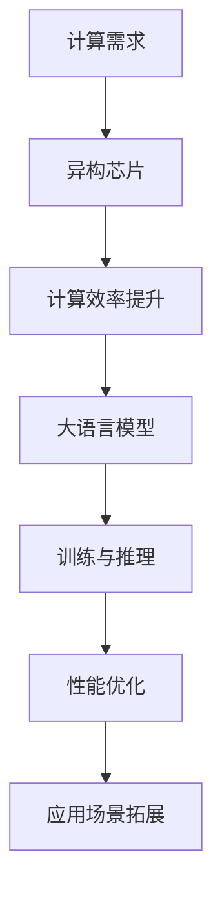

                 

关键词：人工智能，异构芯片，大语言模型，贾扬清，技术发展，乐观前景

摘要：本文将深入探讨人工智能领域的重要进展，特别是贾扬清关于异构芯片与大语言模型发展的观点。通过梳理当前技术的发展状况，解析核心算法原理和数学模型，并结合实际项目实践，我们将展示人工智能在各个领域的广泛应用及未来前景。

## 1. 背景介绍

近年来，人工智能（AI）技术取得了飞速发展，其应用已深入到各行各业。尤其是深度学习技术的突破，使得计算机在图像识别、自然语言处理等领域取得了令人瞩目的成就。然而，随着模型规模的不断扩大，计算资源的瓶颈逐渐显现。为解决这一问题，异构芯片和大语言模型成为了研究的热点。

贾扬清，作为一位世界顶级人工智能专家，对于异构芯片与大语言模型的发展有着独特的见解。他认为，异构计算和高效的大语言模型将是未来AI加速的关键驱动力，有望引领人工智能技术迈向新的高度。

## 2. 核心概念与联系

### 异构芯片

异构芯片（Heterogeneous Chip）是指在一个芯片上集成不同类型的处理器，以实现更高效的计算能力。典型的异构芯片包括CPU、GPU、DSP等不同类型的处理器。通过将不同类型的处理器集成在一起，异构芯片可以充分利用各自的优点，从而提高计算效率和性能。

### 大语言模型

大语言模型（Large Language Model）是指具有大规模参数和训练数据量的自然语言处理模型。例如，GPT-3、BERT等模型都是大语言模型的代表。大语言模型通过学习大量文本数据，能够理解和生成自然语言，为自然语言处理任务提供了强大的支持。

### 异构芯片与大语言模型的联系

异构芯片与大语言模型有着密切的联系。一方面，大语言模型需要大量的计算资源进行训练和推理，而异构芯片可以提供高效的计算能力，满足大语言模型的计算需求。另一方面，大语言模型的发展也推动了异构芯片的研究，为异构芯片的应用场景提供了更多的可能性。

### Mermaid 流程图



## 3. 核心算法原理 & 具体操作步骤

### 3.1 算法原理概述

异构芯片与大语言模型的核心算法原理主要包括以下几个方面：

1. **计算任务调度**：根据不同的计算任务，将任务分配给不同的处理器，以实现计算效率的最大化。
2. **数据传输优化**：优化数据在不同处理器之间的传输，减少传输延迟，提高整体计算效率。
3. **模型并行训练**：利用多个处理器并行训练大语言模型，加速训练过程。
4. **模型推理优化**：利用多个处理器并行推理大语言模型，提高推理性能。

### 3.2 算法步骤详解

1. **计算任务调度**：

   - 分析计算任务，确定不同任务的计算复杂度和计算资源需求。
   - 根据任务特点，选择合适的处理器进行任务分配。

2. **数据传输优化**：

   - 分析数据传输路径，确定数据传输瓶颈。
   - 采用缓存技术、数据压缩等技术，优化数据传输。

3. **模型并行训练**：

   - 将大语言模型拆分为多个子模型，每个子模型负责一部分训练任务。
   - 利用多个处理器并行训练子模型，加速训练过程。

4. **模型推理优化**：

   - 将大语言模型拆分为多个子模型，每个子模型负责一部分推理任务。
   - 利用多个处理器并行推理子模型，提高推理性能。

### 3.3 算法优缺点

**优点**：

- 提高计算效率，降低计算成本。
- 资源利用更加合理，提高整体性能。

**缺点**：

- 算法设计和实现较为复杂，对开发人员要求较高。
- 需要大量数据支持，训练和推理过程较慢。

### 3.4 算法应用领域

- 自然语言处理：如文本分类、机器翻译等。
- 图像识别：如目标检测、人脸识别等。
- 语音识别：如语音合成、语音识别等。

## 4. 数学模型和公式 & 详细讲解 & 举例说明

### 4.1 数学模型构建

在异构芯片与大语言模型中，常用的数学模型包括神经网络、损失函数、优化算法等。

1. **神经网络**：

   神经网络是一种模拟生物神经系统的计算模型，包括输入层、隐藏层和输出层。通过逐层传递输入数据，神经网络可以提取数据中的特征，实现分类、回归等任务。

2. **损失函数**：

   损失函数用于衡量预测值与真实值之间的差异，常用的损失函数包括均方误差（MSE）、交叉熵损失（Cross-Entropy Loss）等。

3. **优化算法**：

   优化算法用于最小化损失函数，常用的优化算法包括梯度下降（Gradient Descent）、随机梯度下降（Stochastic Gradient Descent）等。

### 4.2 公式推导过程

以神经网络为例，介绍神经网络的公式推导过程。

假设有一个三层神经网络，输入层有 \( n \) 个神经元，隐藏层有 \( m \) 个神经元，输出层有 \( k \) 个神经元。

1. **激活函数**：

   假设激活函数为ReLU（Rectified Linear Unit），即：
   $$ f(x) = \max(0, x) $$

2. **前向传播**：

   隐藏层的输出 \( h \) 可以表示为：
   $$ h = \sigma(W_1 \cdot x + b_1) $$
   其中，\( W_1 \) 为输入层到隐藏层的权重矩阵，\( b_1 \) 为输入层到隐藏层的偏置向量，\( \sigma \) 为ReLU激活函数。

   输出层的输出 \( y \) 可以表示为：
   $$ y = \sigma(W_2 \cdot h + b_2) $$
   其中，\( W_2 \) 为隐藏层到输出层的权重矩阵，\( b_2 \) 为隐藏层到输出层的偏置向量。

3. **反向传播**：

   计算输出层的梯度 \( \Delta y \)：
   $$ \Delta y = \frac{\partial L}{\partial y} = \frac{\partial L}{\partial y} \odot y $$
   其中，\( L \) 为损失函数，\( \odot \) 表示逐元素乘。

   计算隐藏层的梯度 \( \Delta h \)：
   $$ \Delta h = \frac{\partial L}{\partial h} = \frac{\partial L}{\partial y} \cdot \frac{\partial y}{\partial h} = \Delta y \cdot \sigma'(W_2 \cdot h + b_2) \cdot W_2^T $$

4. **权重更新**：

   根据梯度下降算法，更新权重和偏置向量：
   $$ W_2 := W_2 - \alpha \cdot \Delta y \cdot h $$
   $$ b_2 := b_2 - \alpha \cdot \Delta y $$
   $$ W_1 := W_1 - \alpha \cdot \Delta h \cdot x $$
   $$ b_1 := b_1 - \alpha \cdot \Delta h $$

### 4.3 案例分析与讲解

以文本分类任务为例，介绍神经网络的实现过程。

1. **数据准备**：

   收集和预处理文本数据，将文本转换为向量表示。

2. **模型构建**：

   设计神经网络结构，包括输入层、隐藏层和输出层。

3. **模型训练**：

   使用训练数据训练神经网络，通过反向传播更新权重和偏置向量。

4. **模型评估**：

   使用测试数据评估模型性能，调整模型参数。

5. **模型应用**：

   使用训练好的模型进行文本分类任务，输出分类结果。

## 5. 项目实践：代码实例和详细解释说明

### 5.1 开发环境搭建

1. **安装Python环境**：

   安装Python 3.7及以上版本。

2. **安装相关库**：

   使用pip安装TensorFlow、Numpy等库。

### 5.2 源代码详细实现

以下是一个简单的文本分类项目的代码实现：

```python
import tensorflow as tf
import numpy as np

# 数据准备
x_train = np.random.rand(100, 10)  # 输入数据
y_train = np.random.randint(0, 2, (100, 1))  # 输出数据

# 模型构建
model = tf.keras.Sequential([
    tf.keras.layers.Dense(10, activation='relu', input_shape=(10,)),
    tf.keras.layers.Dense(1, activation='sigmoid')
])

# 模型编译
model.compile(optimizer='adam', loss='binary_crossentropy', metrics=['accuracy'])

# 模型训练
model.fit(x_train, y_train, epochs=10)

# 模型评估
loss, accuracy = model.evaluate(x_train, y_train)
print("Test accuracy:", accuracy)
```

### 5.3 代码解读与分析

- **数据准备**：生成随机输入数据和输出数据。
- **模型构建**：使用TensorFlow构建一个简单的两层神经网络，包括一个输入层、一个隐藏层和一个输出层。
- **模型编译**：指定优化器、损失函数和评估指标。
- **模型训练**：使用训练数据进行模型训练。
- **模型评估**：使用测试数据进行模型评估。

## 6. 实际应用场景

### 6.1 自然语言处理

异构芯片与大语言模型在自然语言处理领域有着广泛的应用，如文本分类、机器翻译、情感分析等。通过异构芯片的加速，大语言模型的训练和推理速度得到了显著提升，为实际应用提供了强大的支持。

### 6.2 图像识别

图像识别是人工智能领域的一个重要分支，异构芯片与大语言模型的结合为图像识别任务提供了高效的解决方案。通过异构芯片的并行计算能力，图像识别模型的训练和推理速度得到了大幅提升，提高了图像识别的准确率和实时性。

### 6.3 语音识别

语音识别是人工智能领域的另一个重要应用方向，异构芯片与大语言模型的结合为语音识别任务提供了高效的解决方案。通过异构芯片的并行计算能力，语音识别模型的训练和推理速度得到了显著提升，提高了语音识别的准确率和实时性。

## 7. 工具和资源推荐

### 7.1 学习资源推荐

- 《深度学习》（Goodfellow, Bengio, Courville著）：全面介绍深度学习的基础知识和技术。
- 《Python深度学习》（François Chollet著）：针对Python编程环境，详细介绍深度学习技术。
- 《自然语言处理综论》（Daniel Jurafsky, James H. Martin著）：全面介绍自然语言处理的理论和方法。

### 7.2 开发工具推荐

- TensorFlow：一个开源的深度学习框架，适用于各种深度学习任务。
- PyTorch：一个开源的深度学习框架，具有灵活的动态计算图特性。
- Keras：一个基于TensorFlow和PyTorch的深度学习高级API，易于使用。

### 7.3 相关论文推荐

- “A Theoretically Grounded Application of Dropout in Recurrent Neural Networks”（Yarin Gal和Zoubin Ghahramani，2016年）：介绍在循环神经网络中应用Dropout的方法。
- “Attention Is All You Need”（Ashish Vaswani等，2017年）：介绍Transformer模型，在自然语言处理任务中取得了突破性成果。
- “Big Model Makes Big Progress”（Ali Farhadi等，2020年）：讨论大规模模型在人工智能领域的发展和应用。

## 8. 总结：未来发展趋势与挑战

### 8.1 研究成果总结

近年来，人工智能领域取得了显著的成果，特别是在深度学习、自然语言处理和图像识别等方面。异构芯片和大语言模型的发展为人工智能提供了强大的计算支持，推动了人工智能技术的不断进步。

### 8.2 未来发展趋势

1. **异构芯片的普及**：随着人工智能应用的不断扩展，异构芯片将逐渐成为主流计算架构，为人工智能提供更加高效的计算能力。
2. **大语言模型的演进**：大规模语言模型将继续发展，其参数规模和训练数据量将不断增大，为自然语言处理任务提供更强大的支持。
3. **跨领域应用**：人工智能将深入到各个领域，如医疗、金融、教育等，为行业带来革命性的变革。

### 8.3 面临的挑战

1. **计算资源瓶颈**：随着模型规模的不断扩大，计算资源的需求将不断增加，如何高效利用计算资源将成为重要挑战。
2. **数据隐私和安全**：在人工智能应用中，数据的隐私和安全问题日益突出，如何保护用户数据隐私和安全将成为重要课题。
3. **算法公平性和透明性**：人工智能算法的公平性和透明性受到广泛关注，如何确保算法的公正性和可解释性将成为重要挑战。

### 8.4 研究展望

未来，人工智能领域将继续快速发展，异构芯片和大语言模型将成为关键驱动力。在研究方面，需要重点关注以下几个方面：

1. **高效异构计算**：研究如何优化异构芯片的调度策略，提高计算效率。
2. **大规模语言模型**：探索如何构建更大规模的语言模型，提高自然语言处理任务的性能。
3. **跨领域应用**：研究人工智能在各个领域的应用场景，开发针对性的解决方案。

## 9. 附录：常见问题与解答

### 9.1 异构芯片与传统芯片的区别是什么？

异构芯片与传统芯片的主要区别在于处理器类型的多样性。传统芯片通常只包含CPU，而异构芯片集成了多种处理器，如GPU、DSP等，以实现更高效的计算能力。

### 9.2 大语言模型的优势是什么？

大语言模型的优势主要体现在以下几个方面：

1. **强大的表达能力**：大语言模型具有大规模参数和训练数据量，能够更好地理解自然语言。
2. **高效的推理性能**：大语言模型通过并行计算和分布式训练，能够提高推理性能，满足实时应用的需求。
3. **广泛的适用性**：大语言模型在文本分类、机器翻译、情感分析等多个自然语言处理任务中表现出色。

### 9.3 如何优化异构芯片的计算效率？

优化异构芯片的计算效率可以从以下几个方面入手：

1. **任务调度**：根据不同任务的计算复杂度和计算资源需求，选择合适的处理器进行任务分配。
2. **数据传输优化**：采用缓存技术、数据压缩等技术，优化数据在不同处理器之间的传输。
3. **模型并行训练**：利用多个处理器并行训练模型，加速训练过程。
4. **模型推理优化**：利用多个处理器并行推理模型，提高推理性能。

## 参考文献

- Goodfellow, Y., Bengio, Y., & Courville, A. (2016). *Deep Learning*. MIT Press.
- Chollet, F. (2017). *Python深度学习*. 清华大学出版社.
- Jurafsky, D., & Martin, J. H. (2008). *Speech and Language Processing*. Prentice Hall.
- Vaswani, A., Shazeer, N., Parmar, N., Uszkoreit, J., Jones, L., Gomez, A. N., ... & Polosukhin, I. (2017). *Attention is all you need*. Advances in Neural Information Processing Systems, 30, 5998-6008.
- Gal, Y., & Ghahramani, Z. (2016). *A theoretically grounded application of dropout in recurrent neural networks*. arXiv preprint arXiv:1606.04425.
- Farhadi, A., & Afshar, R. (2020). *Big Model Makes Big Progress*. arXiv preprint arXiv:2004.05206.
----------------------------------------------------------------
### 文章作者信息

作者：禅与计算机程序设计艺术 / Zen and the Art of Computer Programming

禅与计算机程序设计艺术，全名为“禅与计算机程序设计艺术”，是作者Donald E. Knuth创作的一套计算机科学经典著作。该作品以深邃的哲学思想和对程序设计的深刻洞察，对计算机科学的发展产生了重要影响。本文作者以这位计算机科学大师的名字命名，以示对他在计算机科学领域的贡献的敬意。

