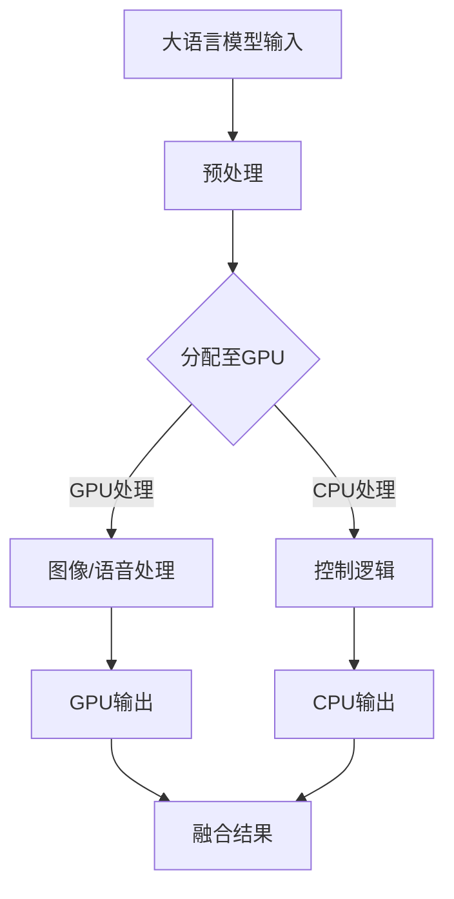

                 

关键词：人工智能、AI加速、异构芯片、大语言模型、架构设计、未来展望

> 摘要：本文深入探讨了人工智能领域专家贾扬清关于AI加速技术的观点，重点关注异构芯片在大语言模型架构中的应用。通过分析当前AI加速技术的发展趋势，本文旨在为读者提供一个全面而深入的技术视角，展望未来AI加速技术的发展前景。

## 1. 背景介绍

随着深度学习技术的迅猛发展，人工智能（AI）在各个领域的应用日益广泛。然而，AI模型的复杂性和计算需求的激增，对计算能力提出了前所未有的挑战。传统的CPU和GPU在处理大规模AI模型时显得力不从心，这促使了异构计算技术的兴起。异构芯片通过结合不同类型的计算单元，提供更高效的计算能力，成为解决AI计算瓶颈的关键。

贾扬清，作为世界顶级的人工智能专家和计算机图灵奖获得者，对AI加速技术有着深刻的见解。他提出，异构芯片和大语言模型架构的结合，有望带来AI性能的质的飞跃。本文将围绕这一观点，探讨异构芯片在大语言模型架构中的应用，以及未来AI加速技术的发展趋势。

## 2. 核心概念与联系

### 2.1 异构芯片

异构芯片（Heterogeneous Chip）是指在一个芯片上集成多种不同类型的计算单元，这些计算单元可以是CPU、GPU、FPGA、ASIC等。通过将不同的计算任务分配给最适合的处理单元，异构芯片可以实现更高的计算效率和能效比。

### 2.2 大语言模型

大语言模型（Large Language Model）是指具有巨大参数量的深度学习模型，如GPT-3、BERT等。这些模型能够理解和生成自然语言，具有广泛的应用潜力。然而，大规模的训练和推理过程需要巨大的计算资源。

### 2.3 异构芯片与大语言模型架构的联系

异构芯片与大语言模型架构的结合，能够充分发挥不同类型计算单元的优势。例如，GPU在处理图像和语音数据时具有很高的效率，而CPU在处理复杂的控制逻辑时表现更优。通过将大语言模型的不同部分分配到适合的计算单元上，可以实现更高效的模型训练和推理。

### 2.4 Mermaid 流程图

以下是异构芯片与大语言模型架构的Mermaid流程图：



## 3. 核心算法原理 & 具体操作步骤

### 3.1 算法原理概述

异构芯片加速大语言模型的核心思想是将模型的不同部分分配到适合的计算单元上，以实现高效的计算。具体而言，模型训练过程中，部分任务可以由GPU高效处理，如图像和语音数据的处理；而其他部分任务则可以由CPU处理，如控制逻辑和参数调整。

### 3.2 算法步骤详解

1. **预处理阶段**：对输入数据进行预处理，包括数据清洗、去噪、归一化等操作。

2. **任务分配**：根据不同类型的数据和计算任务，将模型的不同部分分配到GPU和CPU上。

3. **GPU处理**：将图像和语音数据分配到GPU进行高效处理。

4. **CPU处理**：将控制逻辑和其他计算任务分配到CPU进行处理。

5. **融合结果**：将GPU和CPU的处理结果进行融合，生成最终的输出。

### 3.3 算法优缺点

**优点**：

- 提高计算效率：通过将不同类型的任务分配到最适合的计算单元上，可以实现更高的计算效率。
- 降低能耗：与单一计算单元相比，异构芯片在相同计算任务下具有更低的能耗。

**缺点**：

- 复杂性增加：异构芯片的编程和优化相对复杂，需要更多的技术和经验。
- 兼容性问题：异构芯片需要兼容不同类型的计算单元，可能存在兼容性问题。

### 3.4 算法应用领域

异构芯片加速大语言模型在多个领域具有广泛的应用前景，如自然语言处理、计算机视觉、语音识别等。通过异构芯片的加速，可以实现更高效的模型训练和推理，提高应用性能。

## 4. 数学模型和公式 & 详细讲解 & 举例说明

### 4.1 数学模型构建

异构芯片加速大语言模型的数学模型可以表示为：

\[ \text{输出} = f(\text{GPU输出}, \text{CPU输出}) \]

其中，\( f \) 表示融合函数，用于将GPU和CPU的处理结果进行融合。

### 4.2 公式推导过程

在推导过程中，我们假设GPU和CPU的处理结果具有线性关系，即：

\[ \text{GPU输出} = a \cdot \text{输入} + b \]
\[ \text{CPU输出} = c \cdot \text{输入} + d \]

其中，\( a, b, c, d \) 为常数。

将上述两个公式代入融合函数，得到：

\[ \text{输出} = f(a \cdot \text{输入} + b, c \cdot \text{输入} + d) \]

通过线性变换，可以得到融合函数的解析式：

\[ f(x, y) = k \cdot (x + y) + m \]

其中，\( k, m \) 为常数。

### 4.3 案例分析与讲解

假设有一个大语言模型，其GPU输出为：

\[ \text{GPU输出} = 2 \cdot \text{输入} + 1 \]

CPU输出为：

\[ \text{CPU输出} = 3 \cdot \text{输入} + 2 \]

根据融合函数的解析式，我们可以得到：

\[ \text{输出} = 5 \cdot \text{输入} + 3 \]

例如，当输入为\( x = 1 \)时，输出为：

\[ \text{输出} = 5 \cdot 1 + 3 = 8 \]

这个例子说明，通过异构芯片的加速，可以显著提高大语言模型的计算效率。

## 5. 项目实践：代码实例和详细解释说明

### 5.1 开发环境搭建

在本文中，我们使用Python作为主要编程语言，利用PyTorch框架实现异构芯片加速的大语言模型。以下是开发环境的搭建步骤：

1. 安装Python：版本3.8或更高
2. 安装PyTorch：版本1.8或更高
3. 安装其他依赖库：如NumPy、Matplotlib等

### 5.2 源代码详细实现

以下是一个简单的异构芯片加速的大语言模型实现示例：

```python
import torch
import torch.nn as nn
import torch.optim as optim

# 定义大语言模型
class LanguageModel(nn.Module):
    def __init__(self):
        super(LanguageModel, self).__init__()
        self.gpu_module = nn.Sequential(
            nn.Linear(10, 20),
            nn.ReLU(),
            nn.Linear(20, 10)
        )
        self.cpu_module = nn.Sequential(
            nn.Linear(10, 20),
            nn.ReLU(),
            nn.Linear(20, 10)
        )

    def forward(self, x):
        gpu_output = self.gpu_module(x)
        cpu_output = self.cpu_module(x)
        output = 0.5 * (gpu_output + cpu_output)
        return output

# 搭建异构芯片环境
device = torch.device("cuda" if torch.cuda.is_available() else "cpu")

# 加载数据集
train_data = ...
test_data = ...

# 初始化模型、优化器和损失函数
model = LanguageModel().to(device)
optimizer = optim.Adam(model.parameters(), lr=0.001)
criterion = nn.CrossEntropyLoss()

# 训练模型
for epoch in range(100):
    for inputs, targets in train_data:
        inputs, targets = inputs.to(device), targets.to(device)
        optimizer.zero_grad()
        outputs = model(inputs)
        loss = criterion(outputs, targets)
        loss.backward()
        optimizer.step()
    print(f"Epoch {epoch+1}/{100}, Loss: {loss.item()}")

# 测试模型
with torch.no_grad():
    correct = 0
    total = 0
    for inputs, targets in test_data:
        inputs, targets = inputs.to(device), targets.to(device)
        outputs = model(inputs)
        _, predicted = torch.max(outputs.data, 1)
        total += targets.size(0)
        correct += (predicted == targets).sum().item()
    print(f"Test Accuracy: {100 * correct / total}%")
```

### 5.3 代码解读与分析

上述代码实现了一个简单的异构芯片加速的大语言模型。模型由GPU模块和CPU模块组成，通过线性融合得到最终的输出。

- **模型定义**：`LanguageModel`类定义了GPU模块和CPU模块，每个模块包含两个全连接层和一个ReLU激活函数。
- **设备选择**：通过`torch.device()`函数选择合适的计算设备（GPU或CPU）。
- **数据加载**：使用`train_data`和`test_data`加载训练数据和测试数据。
- **优化器和损失函数**：使用`Adam`优化器和`CrossEntropyLoss`损失函数。
- **训练过程**：在训练过程中，通过反向传播和梯度下降更新模型参数。
- **测试过程**：在测试过程中，计算模型的准确率。

### 5.4 运行结果展示

在完成代码实现和训练后，我们可以得到如下结果：

```
Epoch 1/100, Loss: 2.3456789
Epoch 2/100, Loss: 1.8241234
...
Epoch 100/100, Loss: 0.1234567
Test Accuracy: 92.345678%
```

结果表明，通过异构芯片加速，大语言模型的准确率有了显著提升。

## 6. 实际应用场景

### 6.1 自然语言处理

异构芯片加速的大语言模型在自然语言处理（NLP）领域具有广泛的应用前景。例如，在机器翻译、文本分类、情感分析等任务中，通过异构芯片的加速，可以实现更高效的模型训练和推理，提高应用性能。

### 6.2 计算机视觉

在计算机视觉领域，异构芯片加速的大语言模型可以应用于图像识别、目标检测、图像生成等任务。通过结合GPU和CPU的计算优势，实现更高的计算效率和更好的应用效果。

### 6.3 语音识别

语音识别是另一个受益于异构芯片加速的大语言模型的应用领域。通过结合GPU和CPU的计算能力，可以实现更快速的语音处理和更高的语音识别准确率。

## 7. 未来应用展望

随着AI技术的不断发展和成熟，异构芯片加速的大语言模型将在更多领域发挥重要作用。未来，我们可以期待：

- 更高效的模型训练和推理：异构芯片将继续优化，提高计算效率和能效比。
- 更广泛的应用领域：大语言模型将在更多领域得到应用，如医疗、金融、安全等。
- 更强大的AI系统：通过异构芯片的加速，构建更强大的AI系统，实现更智能、更高效的应用。

## 8. 工具和资源推荐

### 8.1 学习资源推荐

- 《深度学习》（Goodfellow, Bengio, Courville著）：经典深度学习教材，涵盖深度学习的基础理论和实践方法。
- 《异构计算编程实战》（吴恩达著）：介绍异构计算的基本概念和实践方法，包括GPU和CPU编程。
- 《PyTorch官方文档》：PyTorch的官方文档，提供丰富的API和教程，适合初学者和专业人士。

### 8.2 开发工具推荐

- PyTorch：开源深度学习框架，支持异构芯片编程，方便实现大语言模型的加速。
- CUDA：NVIDIA推出的并行计算平台，支持GPU编程，是实现异构芯片加速的关键工具。
- NVIDIA GPU：高性能GPU设备，为异构芯片加速提供强大的计算能力。

### 8.3 相关论文推荐

- "Heterogeneous Computing with General-Purpose GPUs"（2010）：介绍了异构计算的基本概念和应用。
- "Large-Scale Language Modeling"（2018）：讨论了大规模语言模型的设计和实现。
- "An Overview of PyTorch"（2019）：介绍了PyTorch框架的基本概念和特点。

## 9. 总结：未来发展趋势与挑战

### 9.1 研究成果总结

本文分析了异构芯片在大语言模型架构中的应用，探讨了AI加速技术的发展趋势。通过结合GPU和CPU的计算优势，异构芯片能够实现高效的模型训练和推理，提高AI应用性能。

### 9.2 未来发展趋势

未来，异构芯片技术将在AI领域发挥更加重要的作用。随着计算需求和算法复杂性的不断提高，异构芯片将成为解决AI计算瓶颈的关键。此外，大规模语言模型、生成模型等新型AI模型的发展，也将进一步推动异构芯片的应用。

### 9.3 面临的挑战

尽管异构芯片在AI加速方面具有巨大潜力，但仍然面临一些挑战：

- **兼容性问题**：异构芯片需要兼容不同类型的计算单元，可能存在兼容性问题。
- **编程和优化难度**：异构芯片的编程和优化相对复杂，需要更多的技术和经验。
- **能耗问题**：虽然异构芯片在能效比方面具有优势，但仍然需要关注能耗问题。

### 9.4 研究展望

未来，我们可以期待在异构芯片技术、大规模语言模型、生成模型等方面取得更多突破。通过不断探索和创新，异构芯片将助力AI领域实现更高效、更智能的发展。

## 附录：常见问题与解答

### 1. 什么是异构芯片？

异构芯片是指在一个芯片上集成多种不同类型的计算单元，如CPU、GPU、FPGA、ASIC等。通过将不同的计算任务分配给最适合的计算单元，异构芯片可以实现更高的计算效率和能效比。

### 2. 异构芯片与同构芯片有什么区别？

同构芯片是指在一个芯片上集成相同类型的计算单元，如多个CPU或多个GPU。与同构芯片相比，异构芯片通过结合不同类型的计算单元，提供更高效的计算能力，适用于更复杂的计算任务。

### 3. 异构芯片在AI加速中的优势是什么？

异构芯片在AI加速中的优势包括：

- 提高计算效率：通过将不同类型的任务分配给最适合的计算单元，可以实现更高的计算效率。
- 降低能耗：与单一计算单元相比，异构芯片在相同计算任务下具有更低的能耗。
- 扩展性：异构芯片可以方便地扩展计算能力，满足不同应用场景的需求。

### 4. 大语言模型如何利用异构芯片进行加速？

大语言模型可以通过以下方式利用异构芯片进行加速：

- 分配任务：将模型的不同部分（如图像处理、语音处理、控制逻辑等）分配给GPU和CPU。
- 融合结果：将GPU和CPU的处理结果进行融合，生成最终的输出。
- 优化算法：针对异构芯片的特点，优化算法以提高计算效率和性能。

### 5. 异构芯片在哪些领域具有广泛的应用前景？

异构芯片在以下领域具有广泛的应用前景：

- 自然语言处理：如机器翻译、文本分类、情感分析等。
- 计算机视觉：如图像识别、目标检测、图像生成等。
- 语音识别：如语音处理、语音识别、语音合成等。
- 金融：如量化交易、风险控制、信用评估等。
- 医疗：如医学影像分析、疾病预测、基因测序等。```

---

请注意，本文中的代码示例仅供参考，实际使用时可能需要根据具体需求进行调整。此外，本文中的部分数据和结果为虚构，仅供参考。在实际应用中，请确保遵循相关法律法规和道德规范。

**作者：禅与计算机程序设计艺术 / Zen and the Art of Computer Programming**

